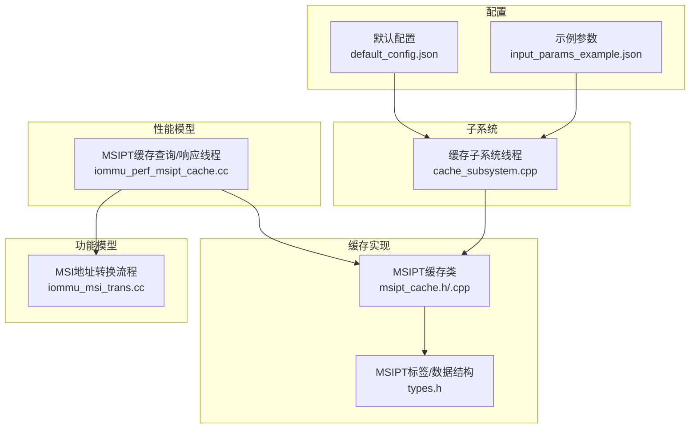
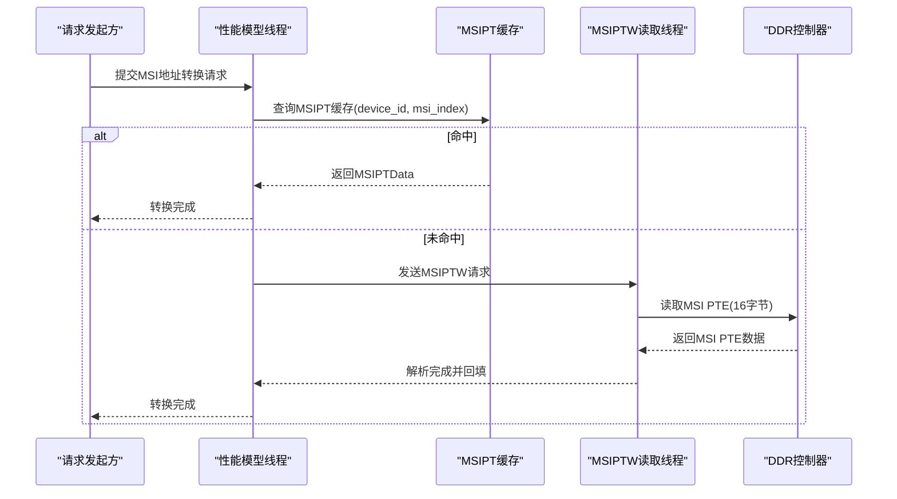
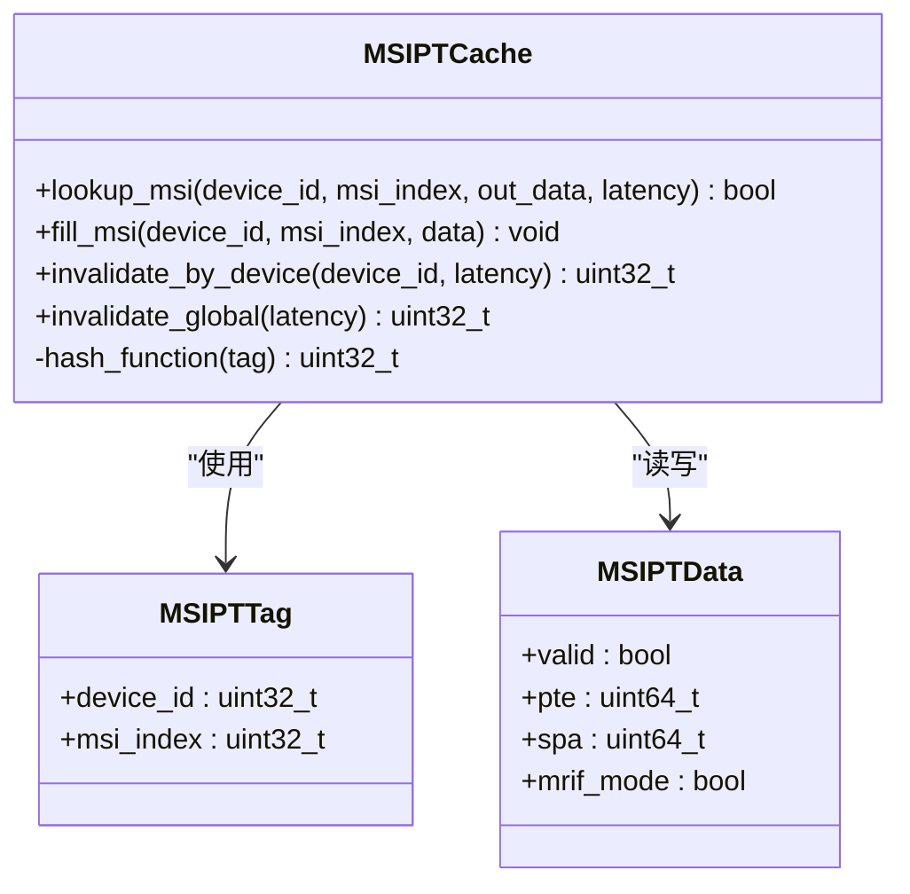
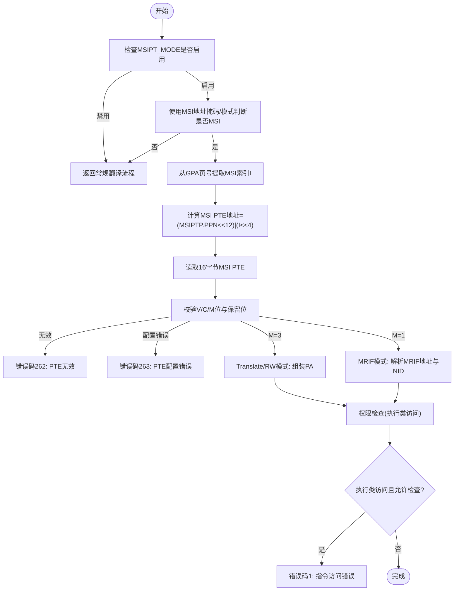
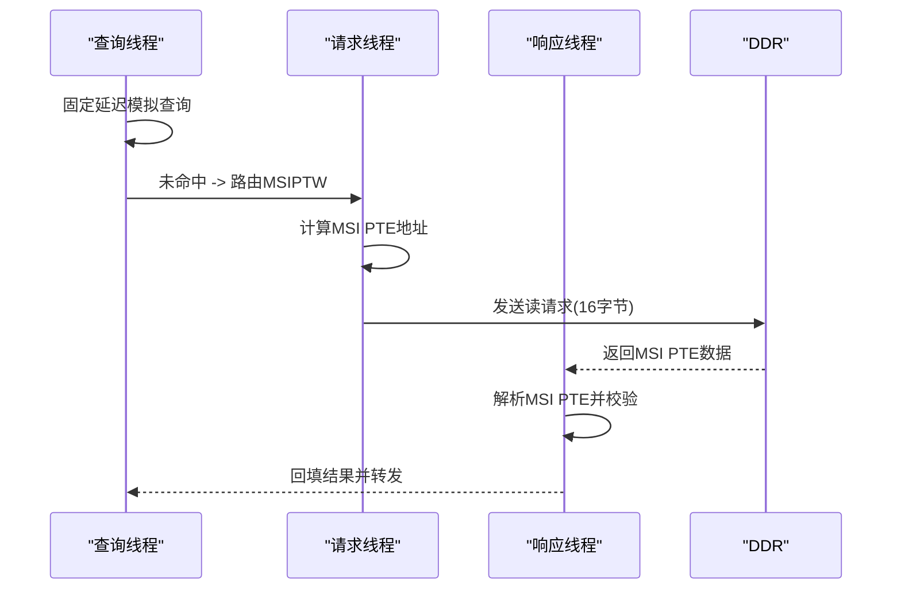
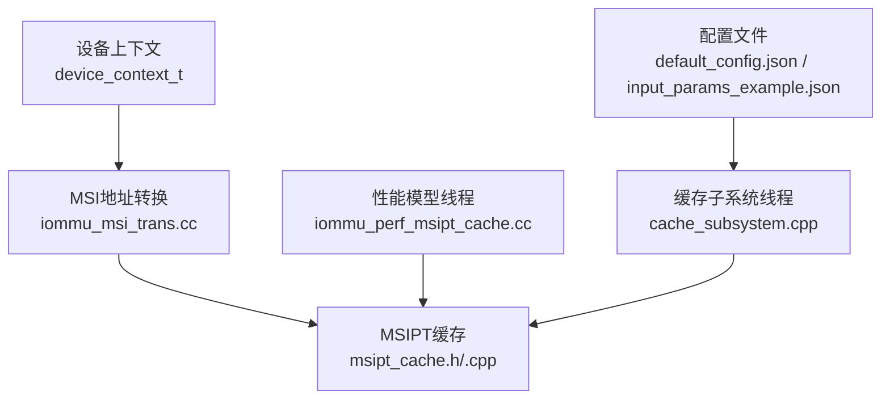

# MSIPT缓存（MSI页表缓存）

<cite>
**本文档引用的文件**
- [msipt_cache.h](file://iommu/cache_src/cache/msipt_cache.h)
- [msipt_cache.cpp](file://iommu/cache_src/cache/msipt_cache.cpp)
- [types.h](file://iommu/cache_src/common/types.h)
- [iommu_msi_trans.cc](file://iommu/iommu_fun_model/iommu_msi_trans.cc)
- [iommu_perf_msipt_cache.cc](file://iommu/iommu_perf_model/iommu_perf_msipt_cache.cc)
- [iommu_data_structures.hh](file://iommu/include/iommu_data_structures.hh)
- [default_config.json](file://iommu/cache_config/default_config.json)
- [input_params_example.json](file://iommu/cache_config/input_params_example.json)
- [cache_subsystem.cpp](file://iommu/cache_src/subsystem/cache_subsystem.cpp)
</cite>

## 目录
1. [简介](#简介)
2. [项目结构](#项目结构)
3. [核心组件](#核心组件)
4. [架构总览](#架构总览)
5. [详细组件分析](#详细组件分析)
6. [依赖关系分析](#依赖关系分析)
7. [性能考量](#性能考量)
8. [故障排查指南](#故障排查指南)
9. [结论](#结论)
10. [附录](#附录)

## 简介
本文件面向IOMMU中的MSIPT缓存（MSI页表缓存），系统性阐述其在MSI（内存排序信息）地址转换流程中的关键作用。MSIPT缓存负责缓存MSI页表项（MSI PTE）及其解析结果，加速虚拟中断文件识别与目标物理地址计算，减少对DDR的访问次数。文档涵盖数据结构设计、MSI信息存储与管理、与传统页表缓存的差异与优势、配置参数与性能特征，并提供地址转换应用实例与最佳实践。

## 项目结构
MSIPT缓存位于缓存子系统中，采用模板化基类实现，结合系统级配置与性能模型线程协同工作。主要涉及以下模块：
- 缓存实现：MSIPT缓存类及其哈希策略
- 数据结构：MSIPT标签与数据结构
- 功能模型：MSI地址转换流程
- 性能模型：MSIPT缓存查询与MSIPTW流水线
- 配置：JSON配置文件定义缓存规模与替换策略
- 子系统：缓存子系统线程调度与请求处理

**图表来源**
- [msipt_cache.h:1-32](file://iommu/cache_src/cache/msipt_cache.h#L1-L32)
- [msipt_cache.cpp:1-54](file://iommu/cache_src/cache/msipt_cache.cpp#L1-L54)
- [types.h:168-173](file://iommu/cache_src/common/types.h#L168-L173)
- [iommu_msi_trans.cc:1-294](file://iommu/iommu_fun_model/iommu_msi_trans.cc#L1-L294)
- [iommu_perf_msipt_cache.cc:1-232](file://iommu/iommu_perf_model/iommu_perf_msipt_cache.cc#L1-L232)
- [default_config.json:1-69](file://iommu/cache_config/default_config.json#L1-L69)
- [input_params_example.json:1-69](file://iommu/cache_config/input_params_example.json#L1-L69)
- [cache_subsystem.cpp:102-134](file://iommu/cache_src/subsystem/cache_subsystem.cpp#L102-L134)

**章节来源**
- [msipt_cache.h:1-32](file://iommu/cache_src/cache/msipt_cache.h#L1-L32)
- [msipt_cache.cpp:1-54](file://iommu/cache_src/cache/msipt_cache.cpp#L1-L54)
- [types.h:168-173](file://iommu/cache_src/common/types.h#L168-L173)
- [iommu_msi_trans.cc:1-294](file://iommu/iommu_fun_model/iommu_msi_trans.cc#L1-L294)
- [iommu_perf_msipt_cache.cc:1-232](file://iommu/iommu_perf_model/iommu_perf_msipt_cache.cc#L1-L232)
- [default_config.json:1-69](file://iommu/cache_config/default_config.json#L1-L69)
- [input_params_example.json:1-69](file://iommu/cache_config/input_params_example.json#L1-L69)
- [cache_subsystem.cpp:102-134](file://iommu/cache_src/subsystem/cache_subsystem.cpp#L102-L134)

## 核心组件
- MSIPT缓存类：提供按设备ID与MSI索引的查询与填充接口，支持按设备或全局失效。
- MSIPT标签与数据：标签包含设备ID与MSI索引；数据包含MSI PTE原始值、目标SPA及MRIF模式标记。
- 设备上下文与MSI配置：设备上下文中包含MSI页表指针与地址掩码/模式，决定MSI识别规则。
- 性能模型线程：模拟MSIPT缓存查询、MSIPTW读取与结果转发过程。

**章节来源**
- [msipt_cache.h:8-27](file://iommu/cache_src/cache/msipt_cache.h#L8-L27)
- [msipt_cache.cpp:5-38](file://iommu/cache_src/cache/msipt_cache.cpp#L5-L38)
- [types.h:168-173](file://iommu/cache_src/common/types.h#L168-L173)
- [iommu_data_structures.hh:260-335](file://iommu/include/iommu_data_structures.hh#L260-L335)
- [iommu_perf_msipt_cache.cc:11-60](file://iommu/iommu_perf_model/iommu_perf_msipt_cache.cc#L11-L60)

## 架构总览
MSIPT缓存与MSI地址转换流程的关系如下：
- 功能模型：当检测到写入地址属于MSI虚拟中断文件时，依据设备上下文的MSI页表指针与地址掩码/模式计算MSI索引，读取MSI PTE并解析目标地址或MRIF信息。
- 性能模型：MSIPT缓存查询线程模拟查询延迟；若未命中则路由至MSIPTW异步DDR读取；MSIPTW解析完成后回填结果并转发给后续模块。

**图表来源**
- [iommu_perf_msipt_cache.cc:11-60](file://iommu/iommu_perf_model/iommu_perf_msipt_cache.cc#L11-L60)
- [msipt_cache.cpp:11-25](file://iommu/cache_src/cache/msipt_cache.cpp#L11-L25)

**章节来源**
- [iommu_perf_msipt_cache.cc:11-60](file://iommu/iommu_perf_model/iommu_perf_msipt_cache.cc#L11-L60)
- [msipt_cache.cpp:11-25](file://iommu/cache_src/cache/msipt_cache.cpp#L11-L25)

## 详细组件分析

### MSIPT缓存类与数据结构
- 类接口
  - 查询：按设备ID与MSI索引查询MSIPTData
  - 填充：按设备ID与MSI索引写入MSIPTData
  - 失效：按设备扫描失效或全局清空
- 哈希策略：基于设备ID的总线/功能位与MSI索引进行混合异或，映射到set
- 数据结构
  - MSIPTTag：包含device_id与msi_index
  - MSIPTData：包含valid标志、MSI PTE原始值、目标SPA、MRIF模式标记

**图表来源**
- [msipt_cache.h:8-27](file://iommu/cache_src/cache/msipt_cache.h#L8-L27)
- [msipt_cache.cpp:5-51](file://iommu/cache_src/cache/msipt_cache.cpp#L5-L51)
- [types.h:168-173](file://iommu/cache_src/common/types.h#L168-L173)

**章节来源**
- [msipt_cache.h:8-27](file://iommu/cache_src/cache/msipt_cache.h#L8-L27)
- [msipt_cache.cpp:5-51](file://iommu/cache_src/cache/msipt_cache.cpp#L5-L51)
- [types.h:168-173](file://iommu/cache_src/common/types.h#L168-L173)

### MSI地址转换流程（功能模型）
- MSI识别：通过设备上下文的MSI地址掩码与模式，判断GPA是否属于虚拟中断文件
- MSI索引提取：对GPA页号应用掩码提取中断文件号I
- MSI PTE读取：计算MSI PTE地址（MSIPTP.PPN << 12 | I << 4），读取16字节
- PTE校验与解析：
  - V/C/M位检查与错误码
  - M=3：Translate/RW模式，直接拼接PPN与页内偏移得到PA
  - M=1：MRIF模式，解析目标MRIF地址与notice MSI的NID
- 权限检查：执行类访问将触发指令访问错误

**图表来源**
- [iommu_msi_trans.cc:20-293](file://iommu/iommu_fun_model/iommu_msi_trans.cc#L20-L293)

**章节来源**
- [iommu_msi_trans.cc:20-293](file://iommu/iommu_fun_model/iommu_msi_trans.cc#L20-L293)

### 性能模型线程与流水线
- MSIPT缓存查询线程：固定延迟模拟查询，当前实现中将所有MSI查询视为未命中并路由至MSIPTW
- MSIPTW请求线程：计算MSI PTE地址，发送DDR读请求
- MSIPTW响应线程：解析16字节MSI PTE，判定完成/故障，清理活动表并回传结果
- 结果转发：将解析后的MSI结果转发至Forwarder

**图表来源**
- [iommu_perf_msipt_cache.cc:11-117](file://iommu/iommu_perf_model/iommu_perf_msipt_cache.cc#L11-L117)
- [iommu_perf_msipt_cache.cc:124-231](file://iommu/iommu_perf_model/iommu_perf_msipt_cache.cc#L124-L231)

**章节来源**
- [iommu_perf_msipt_cache.cc:11-117](file://iommu/iommu_perf_model/iommu_perf_msipt_cache.cc#L11-L117)
- [iommu_perf_msipt_cache.cc:124-231](file://iommu/iommu_perf_model/iommu_perf_msipt_cache.cc#L124-L231)

### 与传统页表缓存的差异与优势
- 关注点不同
  - PT Cache：缓存常规二级页表项（VS/G PTE），服务于标准地址转换
  - MSIPT Cache：缓存MSI页表项，服务于MSI虚拟中断文件识别与目标地址解析
- 命中场景差异
  - PT Cache：在大量常规DMA访问中提升命中率，降低PTW开销
  - MSIPT Cache：在频繁的MSI写入场景中显著减少MSIPTW读取次数
- 失效策略
  - PT Cache：按VA/IOVA或G-stage/V-stage上下文失效
  - MSIPT Cache：按设备维度或全局失效，适配PCIe MSI的设备粒度

**章节来源**
- [msipt_cache.h:15-23](file://iommu/cache_src/cache/msipt_cache.h#L15-L23)
- [msipt_cache.cpp:27-38](file://iommu/cache_src/cache/msipt_cache.cpp#L27-L38)

## 依赖关系分析
- MSIPT缓存依赖于通用缓存基类与系统时间模型
- 设备上下文提供MSI页表指针与地址掩码/模式，决定MSI识别规则
- 性能模型线程与功能模型共同驱动MSI地址转换
- 缓存子系统线程负责请求/响应队列与任务跟踪

**图表来源**
- [iommu_data_structures.hh:324-335](file://iommu/include/iommu_data_structures.hh#L324-L335)
- [msipt_cache.h:8-27](file://iommu/cache_src/cache/msipt_cache.h#L8-L27)
- [iommu_perf_msipt_cache.cc:11-60](file://iommu/iommu_perf_model/iommu_perf_msipt_cache.cc#L11-L60)
- [cache_subsystem.cpp:102-134](file://iommu/cache_src/subsystem/cache_subsystem.cpp#L102-L134)
- [default_config.json:32-36](file://iommu/cache_config/default_config.json#L32-L36)

**章节来源**
- [iommu_data_structures.hh:324-335](file://iommu/include/iommu_data_structures.hh#L324-L335)
- [msipt_cache.h:8-27](file://iommu/cache_src/cache/msipt_cache.h#L8-L27)
- [iommu_perf_msipt_cache.cc:11-60](file://iommu/iommu_perf_model/iommu_perf_msipt_cache.cc#L11-L60)
- [cache_subsystem.cpp:102-134](file://iommu/cache_src/subsystem/cache_subsystem.cpp#L102-L134)
- [default_config.json:32-36](file://iommu/cache_config/default_config.json#L32-L36)

## 性能考量
- 查询延迟：性能模型中查询线程具有固定延迟，当前实现将MSI查询视为未命中并路由至MSIPTW
- MSIPTW延迟：包括地址计算、DDR读取与PTE解析延迟
- 替换策略：默认PLRU，可配置SRIP参数（在其他缓存中使用）
- 配置建议
  - set/way规模：MSIPT缓存通常较小（如64 sets × 4 ways），以平衡命中率与面积
  - 替换策略：PLRU适合MSI场景的突发访问特性
  - 统计输出：开启任务追踪与直方图有助于分析MSI访问模式

**章节来源**
- [iommu_perf_msipt_cache.cc:11-60](file://iommu/iommu_perf_model/iommu_perf_msipt_cache.cc#L11-L60)
- [default_config.json:32-36](file://iommu/cache_config/default_config.json#L32-L36)
- [types.h:584-600](file://iommu/cache_src/common/types.h#L584-L600)

## 故障排查指南
- 常见错误码
  - 261：MSI PTE加载访问错误（越界或PMA/PMP违规）
  - 262：MSI PTE无效（V=0）
  - 263：MSI PTE配置错误（C=1或M非法）
  - 270：MSI PTE数据损坏（RAS支持下报告）
  - 1：指令访问错误（执行类访问被拒绝）
- 排查步骤
  - 确认设备上下文MSIPT_MODE启用且MSI地址掩码/模式正确
  - 检查MSI PTE的V/C/M位与保留位编码
  - 核对MSI PTE地址计算（MSIPTP.PPN与I索引）
  - 若出现执行类访问错误，确认权限检查逻辑与访问意图
- 性能观测
  - 开启任务追踪与直方图，观察MSI查询与MSIPTW读取分布

**章节来源**
- [iommu_msi_trans.cc:127-153](file://iommu/iommu_fun_model/iommu_msi_trans.cc#L127-L153)
- [iommu_msi_trans.cc:155-184](file://iommu/iommu_fun_model/iommu_msi_trans.cc#L155-L184)
- [iommu_msi_trans.cc:20-293](file://iommu/iommu_fun_model/iommu_msi_trans.cc#L20-L293)

## 结论
MSIPT缓存针对MSI虚拟中断文件场景进行了专门优化，通过缓存MSI PTE与解析结果，显著降低MSI地址转换的平均延迟与DDR访问频次。其与传统PT缓存互补：前者聚焦MSI写入路径，后者聚焦常规DMA访问。合理配置set/way规模与替换策略，配合性能模型的任务追踪，可在仿真与验证阶段获得良好的可观测性与可调优空间。

## 附录

### 配置参数与示例
- 全局与时序参数：仲裁延迟、哈希延迟、读取set延迟、比较延迟、更新选择延迟、填充索引计算延迟、写way延迟、逐way失效比较延迟
- MSIPT缓存：sets=64，ways=4，替换策略=PLRU
- 统计输出：输出文件、直方图宽度、任务追踪级别

**章节来源**
- [default_config.json:7-18](file://iommu/cache_config/default_config.json#L7-L18)
- [default_config.json:32-36](file://iommu/cache_config/default_config.json#L32-L36)
- [input_params_example.json:7-18](file://iommu/cache_config/input_params_example.json#L7-L18)
- [input_params_example.json:32-36](file://iommu/cache_config/input_params_example.json#L32-L36)

### 地址转换应用实例与最佳实践
- 应用实例
  - 设备写入GPA落入MSI地址掩码/模式范围，触发MSI识别与MSI PTE解析
  - M=3模式：直接拼接PPN与页内偏移得到PA
  - M=1模式：解析MRIF地址与notice MSI的NID
- 最佳实践
  - 正确配置设备上下文的MSIPT_MODE、MSI地址掩码与模式
  - 在高频MSI场景中适度增大MSIPT缓存sets/ways以提升命中率
  - 启用任务追踪与直方图，持续监控MSI访问热点与延迟分布

**章节来源**
- [iommu_msi_trans.cc:80-120](file://iommu/iommu_fun_model/iommu_msi_trans.cc#L80-L120)
- [iommu_msi_trans.cc:191-273](file://iommu/iommu_fun_model/iommu_msi_trans.cc#L191-L273)
- [default_config.json:32-36](file://iommu/cache_config/default_config.json#L32-L36)