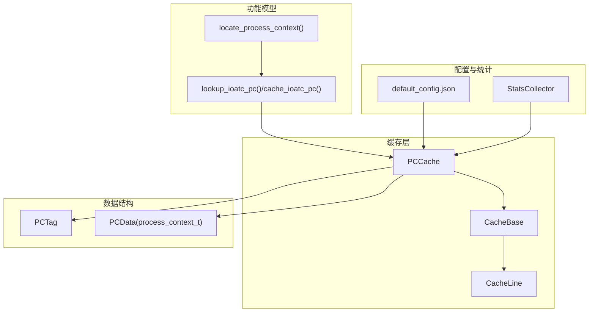
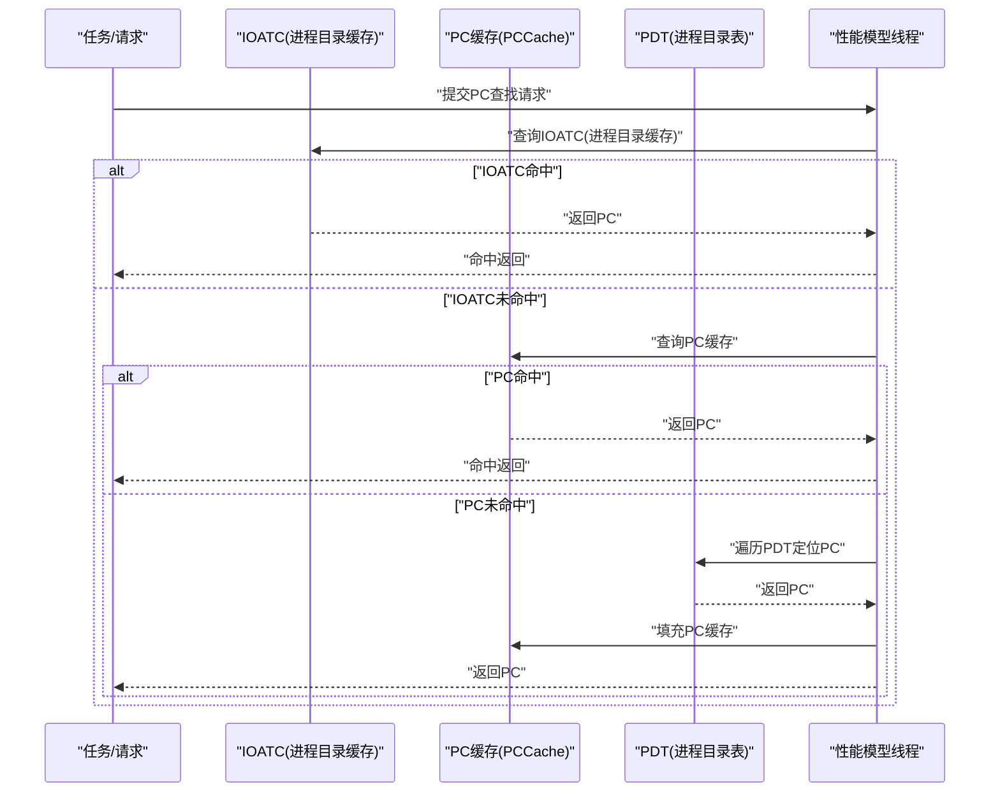
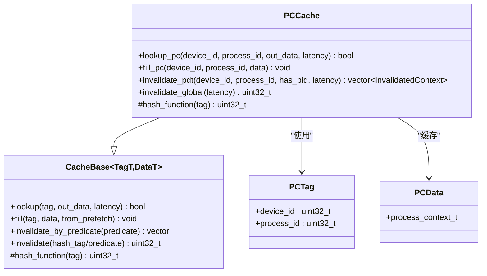
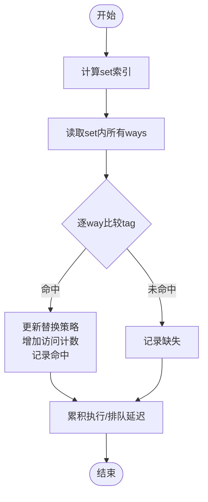
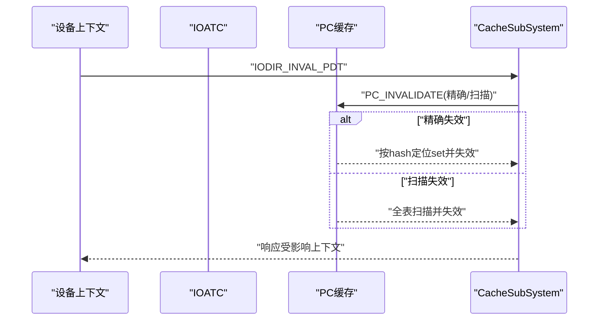
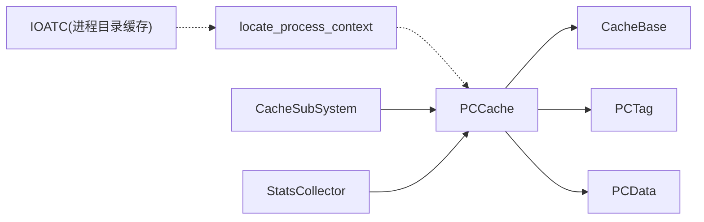

# PC缓存（进程上下文缓存）

<cite>
**本文档引用的文件**
- [pc_cache.h](file://iommu/cache_src/cache/pc_cache.h)
- [pc_cache.cpp](file://iommu/cache_src/cache/pc_cache.cpp)
- [cache_base.h](file://iommu/cache_src/cache/cache_base.h)
- [cache_line.h](file://iommu/cache_src/cache/cache_line.h)
- [types.h](file://iommu/cache_src/common/types.h)
- [iommu_struct.hh](file://iommu/include/iommu_struct.hh)
- [iommu_data_structures.hh](file://iommu/include/iommu_data_structures.hh)
- [iommu_atc.hh](file://iommu/include/iommu_atc.hh)
- [iommu_atc.cc](file://iommu/iommu_fun_model/iommu_atc.cc)
- [iommu_process_context.cc](file://iommu/iommu_fun_model/iommu_process_context.cc)
- [default_config.json](file://iommu/cache_config/default_config.json)
- [iommu_perf_dc_pc_cache.cc](file://iommu/iommu_perf_model/iommu_perf_dc_pc_cache.cc)
- [cache_subsystem.cpp](file://iommu/cache_src/subsystem/cache_subsystem.cpp)
- [stats_collector.h](file://iommu/cache_src/common/stats_collector.h)
- [stats_collector.cpp](file://iommu/cache_src/common/stats_collector.cpp)
</cite>

## 目录
1. [简介](#简介)
2. [项目结构](#项目结构)
3. [核心组件](#核心组件)
4. [架构总览](#架构总览)
5. [详细组件分析](#详细组件分析)
6. [依赖关系分析](#依赖关系分析)
7. [性能考量](#性能考量)
8. [故障排查指南](#故障排查指南)
9. [结论](#结论)
10. [附录](#附录)

## 简介
本文件针对IOMMU模型中的PC缓存（进程上下文缓存）进行系统性技术文档整理，重点阐述其在多级地址转换中的关键作用、缓存组织与查找机制、生命周期管理、失效与更新策略、性能特征与优化建议，并给出配置参数说明与典型应用场景。

## 项目结构
PC缓存位于缓存子系统中，采用模板化的CacheBase基类实现统一的查找、填充与失效流程，结合特定的标签结构与散列函数完成设备ID与进程ID的组合寻址。整体结构如下：

**图表来源**
- [pc_cache.h:8-33](file://iommu/cache_src/cache/pc_cache.h#L8-L33)
- [cache_base.h:26-224](file://iommu/cache_src/cache/cache_base.h#L26-L224)
- [cache_line.h:70-91](file://iommu/cache_src/cache/cache_line.h#L70-L91)
- [types.h:16-45](file://iommu/cache_src/common/types.h#L16-L45)
- [iommu_process_context.cc:12-195](file://iommu/iommu_fun_model/iommu_process_context.cc#L12-L195)
- [iommu_atc.cc:44-77](file://iommu/iommu_fun_model/iommu_atc.cc#L44-L77)
- [default_config.json:26-30](file://iommu/cache_config/default_config.json#L26-L30)
- [stats_collector.h:107-191](file://iommu/cache_src/common/stats_collector.h#L107-L191)

**章节来源**
- [pc_cache.h:1-38](file://iommu/cache_src/cache/pc_cache.h#L1-L38)
- [pc_cache.cpp:1-66](file://iommu/cache_src/cache/pc_cache.cpp#L1-L66)
- [cache_base.h:1-746](file://iommu/cache_src/cache/cache_base.h#L1-L746)
- [cache_line.h:1-103](file://iommu/cache_src/cache/cache_line.h#L1-L103)
- [types.h:1-628](file://iommu/cache_src/common/types.h#L1-L628)
- [default_config.json:1-69](file://iommu/cache_config/default_config.json#L1-L69)

## 核心组件
- PCCache：PC缓存的具体实现，继承自CacheBase，提供基于设备ID与进程ID的查找与填充接口，并实现特定的散列函数与失效策略。
- CacheBase：通用缓存基类，封装查找、填充、失效的统一流程，包含仲裁、替换策略、统计收集等通用能力。
- CacheLine：缓存行模板，承载有效位、标签、数据与预取标记等。
- PCTag/PCData：PC缓存的标签与数据类型，分别对应设备ID+进程ID与进程上下文结构。
- IOATC：进程上下文的IOATC缓存（进程目录缓存），用于快速定位与缓存PC，减少PDT遍历开销。

**章节来源**
- [pc_cache.h:8-33](file://iommu/cache_src/cache/pc_cache.h#L8-L33)
- [cache_base.h:26-224](file://iommu/cache_src/cache/cache_base.h#L26-L224)
- [cache_line.h:70-91](file://iommu/cache_src/cache/cache_line.h#L70-L91)
- [types.h:16-45](file://iommu/cache_src/common/types.h#L16-L45)
- [iommu_atc.hh:44-51](file://iommu/include/iommu_atc.hh#L44-L51)

## 架构总览
PC缓存贯穿于IOMMU的地址转换流程，主要参与以下环节：
- 在事务发起时，先查询PC缓存（IOATC或PC缓存）以快速获得进程上下文，避免昂贵的PDT遍历。
- 当PDT变更或全局失效时，触发PC缓存的精确或扫描失效，确保一致性。
- 在性能模型中，PC缓存的查找与更新通过专用线程模拟，便于统计与验证。

**图表来源**
- [iommu_process_context.cc:68-195](file://iommu/iommu_fun_model/iommu_process_context.cc#L68-L195)
- [iommu_atc.cc:44-77](file://iommu/iommu_fun_model/iommu_atc.cc#L44-L77)
- [pc_cache.cpp:11-25](file://iommu/cache_src/cache/pc_cache.cpp#L11-L25)
- [iommu_perf_dc_pc_cache.cc:70-122](file://iommu/iommu_perf_model/iommu_perf_dc_pc_cache.cc#L70-L122)

## 详细组件分析

### PCCache类与接口
- 查找接口：lookup_pc，将设备ID与进程ID封装为PCTag后委托CacheBase::lookup。
- 填充接口：fill_pc，将PCData写入缓存。
- 失效接口：
  - invalidate_pdt：根据设备ID与可选进程ID进行精确或扫描失效，并回调收集受影响的上下文。
  - invalidate_global：全局清空PC缓存。
- 散列函数：基于设备ID与进程ID的混合异或，结合缓存集数掩码得到set索引。

**图表来源**
- [pc_cache.h:8-33](file://iommu/cache_src/cache/pc_cache.h#L8-L33)
- [pc_cache.cpp:5-65](file://iommu/cache_src/cache/pc_cache.cpp#L5-L65)
- [cache_base.h:26-224](file://iommu/cache_src/cache/cache_base.h#L26-L224)
- [cache_line.h:17-23](file://iommu/cache_src/cache/cache_line.h#L17-L23)

**章节来源**
- [pc_cache.h:8-33](file://iommu/cache_src/cache/pc_cache.h#L8-L33)
- [pc_cache.cpp:11-63](file://iommu/cache_src/cache/pc_cache.cpp#L11-L63)

### CacheBase通用流程与仲裁
- 查找流程：计算set → 读取set内所有ways → 比较tag → 命中则更新替换策略与访问计数，否则记录缺失。
- 填充流程：先尝试更新（命中），否则寻找空闲way，否则触发替换算法选择受害者，最后写入并更新替换状态。
- 失效流程：支持精确（按hash定位set后比较）与扫描（全表扫描）两种模式，逐way比较并失效。
- 仲裁与延迟：采用WRR权重轮询RAM端口，记录排队与执行延迟，支持按阶段统计。

**图表来源**
- [cache_base.h:267-306](file://iommu/cache_src/cache/cache_base.h#L267-L306)
- [cache_base.h:314-472](file://iommu/cache_src/cache/cache_base.h#L314-L472)
- [cache_base.h:534-604](file://iommu/cache_src/cache/cache_base.h#L534-L604)

**章节来源**
- [cache_base.h:267-306](file://iommu/cache_src/cache/cache_base.h#L267-L306)
- [cache_base.h:314-472](file://iommu/cache_src/cache/cache_base.h#L314-L472)
- [cache_base.h:534-604](file://iommu/cache_src/cache/cache_base.h#L534-L604)

### IOATC与PC缓存协同
- IOATC（进程目录缓存）：在iommu_atc.cc中实现，提供快速查找与缓存进程上下文的能力，减少PDT遍历。
- PC缓存：在CacheSubSystem中作为正式缓存，提供持久化、统计与性能建模支持。
- 失效联动：当收到PDT失效命令时，CacheSubSystem将请求转发至PC缓存，触发精确或扫描失效。

**图表来源**
- [cache_subsystem.cpp:1180-1204](file://iommu/cache_src/subsystem/cache_subsystem.cpp#L1180-L1204)
- [pc_cache.cpp:27-52](file://iommu/cache_src/cache/pc_cache.cpp#L27-L52)
- [iommu_atc.cc:44-77](file://iommu/iommu_fun_model/iommu_atc.cc#L44-L77)

**章节来源**
- [iommu_atc.cc:44-77](file://iommu/iommu_fun_model/iommu_atc.cc#L44-L77)
- [cache_subsystem.cpp:1180-1204](file://iommu/cache_src/subsystem/cache_subsystem.cpp#L1180-L1204)
- [pc_cache.cpp:27-52](file://iommu/cache_src/cache/pc_cache.cpp#L27-L52)

### 多级地址转换中的PC缓存作用
- 设备上下文（DC）决定是否启用PDT（多进程场景）以及G/S阶段的地址转换模式。
- locate_process_context负责遍历PDT以定位PC，命中后将PC缓存至IOATC与PC缓存，后续请求可直接命中。
- PC缓存的命中显著减少PDT遍历次数，提升整体吞吐与降低延迟。

**章节来源**
- [iommu_process_context.cc:12-195](file://iommu/iommu_fun_model/iommu_process_context.cc#L12-L195)
- [iommu_data_structures.hh:324-412](file://iommu/include/iommu_data_structures.hh#L324-L412)
- [iommu_struct.hh:92-95](file://iommu/include/iommu_struct.hh#L92-L95)

## 依赖关系分析
- PCCache依赖CacheBase提供的通用缓存能力（查找、填充、失效、仲裁、统计）。
- PCTag与PCData分别映射到设备ID+进程ID与进程上下文结构，二者通过types.h统一定义。
- IOATC与PC缓存在功能上互补：IOATC偏向快速路径与仿真验证，PC缓存面向性能建模与统计。
- CacheSubSystem协调各缓存的失效联动，确保一致性。

**图表来源**
- [pc_cache.h:8-33](file://iommu/cache_src/cache/pc_cache.h#L8-L33)
- [cache_base.h:26-224](file://iommu/cache_src/cache/cache_base.h#L26-L224)
- [types.h:16-45](file://iommu/cache_src/common/types.h#L16-L45)
- [iommu_process_context.cc:12-195](file://iommu/iommu_fun_model/iommu_process_context.cc#L12-L195)
- [cache_subsystem.cpp:1180-1204](file://iommu/cache_src/subsystem/cache_subsystem.cpp#L1180-L1204)
- [stats_collector.h:107-191](file://iommu/cache_src/common/stats_collector.h#L107-L191)

**章节来源**
- [pc_cache.h:8-33](file://iommu/cache_src/cache/pc_cache.h#L8-L33)
- [cache_base.h:26-224](file://iommu/cache_src/cache/cache_base.h#L26-L224)
- [types.h:16-45](file://iommu/cache_src/common/types.h#L16-L45)
- [cache_subsystem.cpp:1180-1204](file://iommu/cache_src/subsystem/cache_subsystem.cpp#L1180-L1204)

## 性能考量
- 命中率与延迟：PC缓存命中可显著降低PDT遍历带来的延迟，命中率越高，整体IOMMU吞吐越大。
- 替换策略：默认采用PLRU，也可配置SRRIP；在高并发下，合理的替换策略有助于降低抖动。
- 仲裁与排队：WRR仲裁均衡lookup/fill/invalidation三类操作，排队延迟会影响端口利用率与IOPS。
- 统计指标：通过StatsCollector记录访问、命中、缺失、替换、失效、排队与执行延迟，支持IOPS与利用率分析。

**章节来源**
- [cache_base.h:627-741](file://iommu/cache_src/cache/cache_base.h#L627-L741)
- [stats_collector.h:13-104](file://iommu/cache_src/common/stats_collector.h#L13-L104)
- [stats_collector.cpp:350-505](file://iommu/cache_src/common/stats_collector.cpp#L350-L505)

## 故障排查指南
- 命中率异常下降：检查是否存在频繁的PDT失效导致PC缓存持续被清空；关注IODIR_INVAL_PDT的触发频率与范围。
- 延迟异常升高：查看排队延迟与执行延迟统计，确认是否存在热点set或替换冲突。
- 失效不一致：核对invalidate_pdt的精确/扫描模式与设备ID/进程ID过滤条件，确保只影响预期上下文。
- 性能模型验证：通过pc_cache_query_thread与pc_cache_update_thread的仿真输出，比对命中/缺失计数与延迟分布。

**章节来源**
- [pc_cache.cpp:27-52](file://iommu/cache_src/cache/pc_cache.cpp#L27-L52)
- [cache_base.h:534-604](file://iommu/cache_src/cache/cache_base.h#L534-L604)
- [iommu_perf_dc_pc_cache.cc:70-122](file://iommu/iommu_perf_model/iommu_perf_dc_pc_cache.cc#L70-L122)

## 结论
PC缓存在IOMMU多级地址转换中扮演关键角色，通过缓存进程上下文显著降低PDT遍历开销，提升整体性能。其设计遵循统一的缓存抽象与仲裁机制，配合完善的统计与性能建模，能够满足高性能与可验证性的双重需求。合理配置缓存规模与替换策略、及时处理失效与更新，是保障PC缓存高效稳定运行的关键。

## 附录

### 配置参数说明（来自default_config.json）
- pc_cache.num_sets：PC缓存的set数量，影响冲突概率与并行度。
- pc_cache.num_ways：PC缓存的way数，决定容量与替换复杂度。
- pc_cache.replacement：替换策略，支持"plru"与"srrip"。
- statistics.output_file：统计输出文件名。
- statistics.enable_latency_histogram：是否启用延迟直方图。
- statistics.enable_task_trace：是否启用任务跟踪。
- statistics.task_trace_level：任务跟踪详细程度。
- statistics.histogram_bin_width_ns：直方图分箱宽度（纳秒）。

**章节来源**
- [default_config.json:26-30](file://iommu/cache_config/default_config.json#L26-L30)
- [default_config.json:61-68](file://iommu/cache_config/default_config.json#L61-L68)

### 典型应用场景示例
- 多进程PCIe设备：每个设备可能有多个进程上下文，启用PDT与PC缓存可显著降低PDT遍历次数。
- 高并发I/O：通过增大num_sets与num_ways、选择合适的替换策略，提升缓存命中率与端口利用率。
- 动态失效场景：在虚拟机迁移或上下文切换频繁时，合理使用精确失效以减少不必要的扫描。

**章节来源**
- [iommu_process_context.cc:68-195](file://iommu/iommu_fun_model/iommu_process_context.cc#L68-L195)
- [cache_subsystem.cpp:1180-1204](file://iommu/cache_src/subsystem/cache_subsystem.cpp#L1180-L1204)