# PT缓存（页表缓存）

<cite>
**本文档引用的文件**
- [pt_cache.h](file://iommu/cache_src/cache/pt_cache.h)
- [pt_cache.cpp](file://iommu/cache_src/cache/pt_cache.cpp)
- [cache_base.h](file://iommu/cache_src/cache/cache_base.h)
- [cache_base.cpp](file://iommu/cache_src/cache/cache_base.cpp)
- [types.h](file://iommu/cache_src/common/types.h)
- [dedup_buffer.h](file://iommu/cache_src/common/dedup_buffer.h)
- [cache_subsystem.h](file://iommu/cache_src/subsystem/cache_subsystem.h)
- [cache_subsystem.cpp](file://iommu/cache_src/subsystem/cache_subsystem.cpp)
- [stats_collector.cpp](file://iommu/cache_src/common/stats_collector.cpp)
- [stats_collector.h](file://iommu/cache_src/common/stats_collector.h)
- [iommu_perf_pt_cache_response.cc](file://iommu/iommu_perf_model/iommu_perf_pt_cache_response.cc)
- [iommu_perf_pt_dedup_flush.cc](file://iommu/iommu_perf_model/iommu_perf_pt_dedup_flush.cc)
- [iommu_perf_ptw.cc](file://iommu/iommu_perf_model/iommu_perf_ptw.cc)
- [default_config.json](file://iommu/cache_config/default_config.json)
- [input_params_example.json](file://iommu/cache_config/input_params_example.json)
- [TEST_50_PACKETS_D3_ANALYSIS_20260609.md](file://TEST_50_PACKETS_D3_ANALYSIS_20260609.md)
</cite>

## 更新摘要
**变更内容**
- 新增lazy_inval_drops()计数器功能，用于跟踪查询命中中CL.VN < LIB.VN被绕过和丢弃的情况
- 支持延迟失效策略的有效性验证和监控
- 增强性能统计系统以支持新的计数器功能
- 优化失效处理流程的监控能力

## 目录
1. [简介](#简介)
2. [项目结构](#项目结构)
3. [核心组件](#核心组件)
4. [架构概览](#架构概览)
5. [详细组件分析](#详细组件分析)
6. [依赖关系分析](#依赖关系分析)
7. [性能考虑](#性能考虑)
8. [故障排除指南](#故障排除指南)
9. [结论](#结论)
10. [附录](#附录)

## 简介
PT缓存（页表缓存）是IOMMU多级页表转换中的关键加速组件，负责缓存页表项（PTE）以减少对内存中页表的访问次数。本文档深入解释PT缓存在多级页表转换中的核心地位，包括页表项的缓存机制和加速策略。详细说明PT缓存的特殊设计，包括去重缓冲区集成、预取机制和高效查找算法。解释PT缓存的多级结构、标签匹配和数据读取流程。提供PT缓存的性能优化策略，包括命中率提升和延迟降低技术。包含去重功能的实现细节和配置说明。

**最新更新**：PT Cache经过重大重构，完全支持多RAM架构（num_rams=4），实现了哈希单元与RAM原子段的分离，显著提升了并发访问能力和系统性能。同时新增了优化的哈希算法和增强的失效机制支持，并引入了lazy_inval_drops()计数器功能来支持延迟失效策略的有效性验证。

## 项目结构
PT缓存相关代码分布在多个模块中：

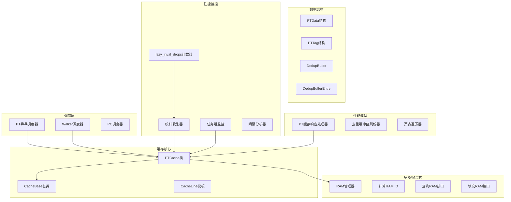

**图表来源**
- [pt_cache.h:8-85](file://iommu/cache_src/cache/pt_cache.h#L8-L85)
- [cache_subsystem.h:171-194](file://iommu/cache_src/subsystem/cache_subsystem.h#L171-194)
- [cache_subsystem.cpp:311-455](file://iommu/cache_src/subsystem/cache_subsystem.cpp#L311-455)

## 核心组件
PT缓存系统由以下核心组件构成：

### PTCache类
PTCache继承自CacheBase模板类，专门处理页表缓存操作。其核心功能包括：
- PT缓存查询和填充
- 去重缓冲区集成
- 预取机制支持
- 失效操作管理
- **新增**：多RAM架构支持，包括compute_ram_id、lookup_pt_ram、fill_pt_ram等接口
- **新增**：lazy_inval_drops()计数器功能，用于跟踪延迟失效策略的执行情况

**更新**：经过重构后，PTCache完全支持多RAM架构，移除了复杂的placeholder管理逻辑，简化了缓存线结构，提升了查找性能和并发访问能力。新增的lazy_inval_drops()计数器功能为延迟失效策略提供了有效的监控手段。

### CacheBase基类
提供通用缓存功能，包括：
- 模板化的缓存实现
- 替换策略支持
- 性能统计收集
- RAM端口仲裁
- **新增**：lazy_inval_drops()计数器接口支持

### PT乒乓调度器
实现了公平的REQUEST和UPDATE交替执行机制，避免单一类型任务饥饿问题。

### 多RAM架构管理器
**新增**：专门管理多个RAM端口的并发访问，实现负载均衡和冲突避免。

### 性能监控系统
支持细粒度性能分析的监控体系，包括任务组统计、间隔分析和IOPS计算，以及**新增**的lazy_inval_drops()计数器监控。

**章节来源**
- [pt_cache.h:8-85](file://iommu/cache_src/cache/pt_cache.h#L8-85)
- [cache_base.h:26-746](file://iommu/cache_src/cache/cache_base.h#L26-746)
- [cache_subsystem.h:171-194](file://iommu/cache_src/subsystem/cache_subsystem.h#L171-194)
- [cache_subsystem.cpp:311-455](file://iommu/cache_src/subsystem/cache_subsystem.cpp#L311-455)

## 架构概览
PT缓存采用分层架构设计，结合了硬件缓存特性和软件控制逻辑，并集成了新的多RAM架构和乒乓调度机制：

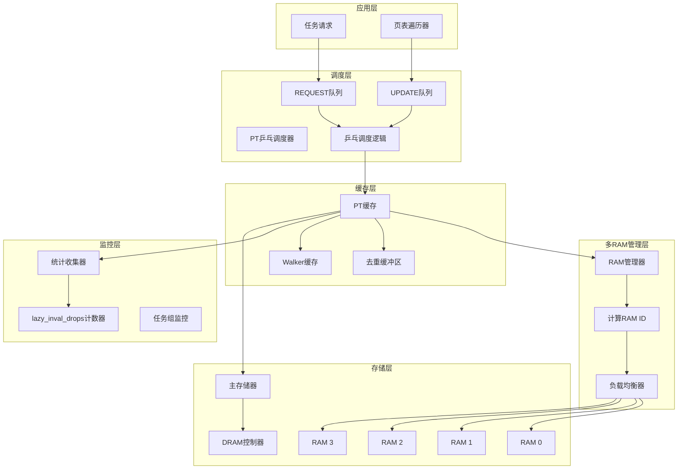

**图表来源**
- [cache_subsystem.cpp:311-455](file://iommu/cache_src/subsystem/cache_subsystem.cpp#L311-455)
- [cache_subsystem.h:171-194](file://iommu/cache_src/subsystem/cache_subsystem.h#L171-194)

## 详细组件分析

### lazy_inval_drops()计数器功能详细分析

#### 计数器功能概述
PT缓存新增了lazy_inval_drops()计数器功能，专门用于跟踪在查询命中过程中由于版本号不满足条件而被绕过和丢弃的缓存条目。该功能对于验证延迟失效策略的有效性至关重要。

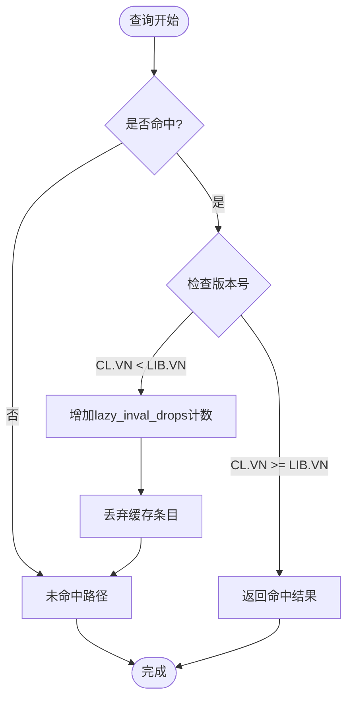

**更新**：新增的lazy_inval_drops()计数器功能为延迟失效策略提供了精确的监控能力，能够准确统计因版本号不满足条件而被丢弃的缓存条目数量。

**图表来源**
- [cache_base.h:26-746](file://iommu/cache_src/cache/cache_base.h#L26-746)
- [stats_collector.h:1-100](file://iommu/cache_src/common/stats_collector.h#L1-100)

#### 计数器实现机制
lazy_inval_drops()计数器的实现涉及以下几个关键步骤：

| 步骤 | 描述 | 触发条件 |
|------|------|----------|
| 版本比较 | 比较缓存条目的版本号(CL.VN)与最后失效版本号(LIB.VN) | 查询命中时 |
| 条件判断 | 检查CL.VN < LIB.VN是否成立 | 版本比较结果 |
| 计数器递增 | 调用lazy_inval_drops()增加计数 | 条件成立时 |
| 条目丢弃 | 跳过当前缓存条目，继续查找或返回未命中 | 计数器递增后 |

#### 延迟失效策略验证
通过lazy_inval_drops()计数器，系统可以实现对延迟失效策略的有效验证：

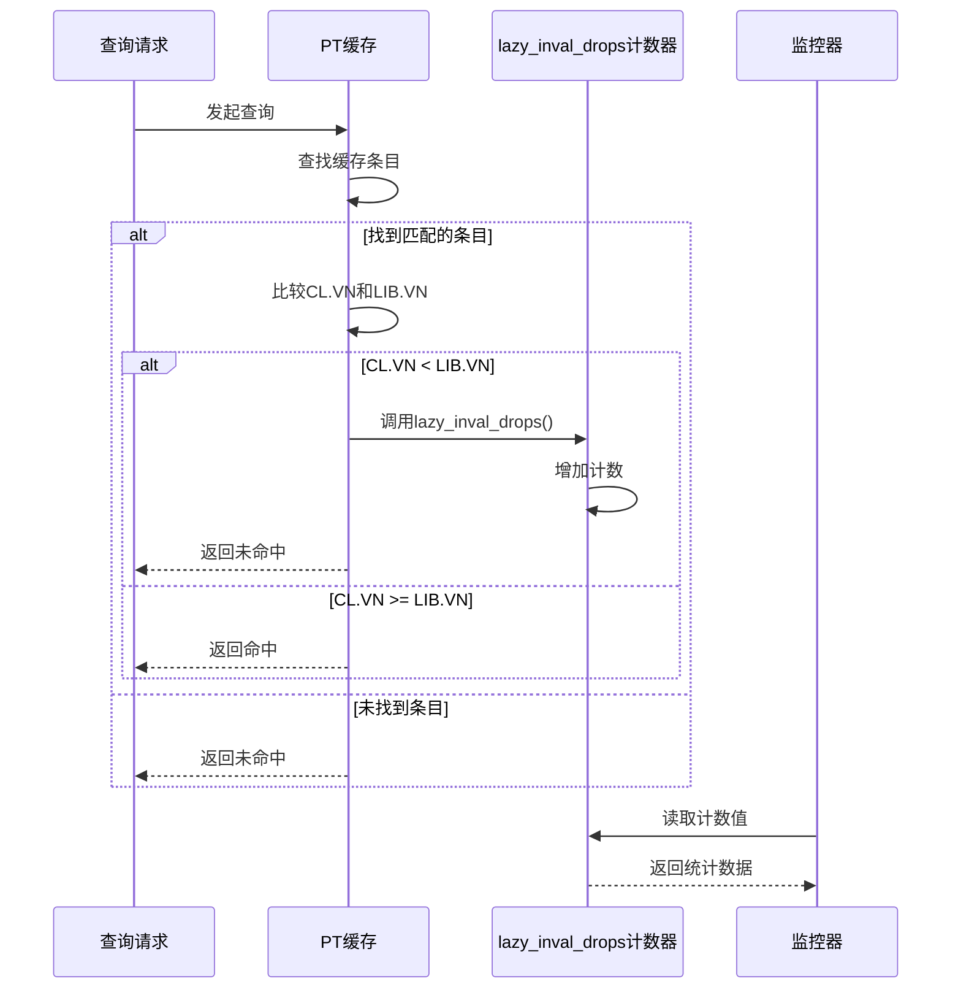

**图表来源**
- [cache_base.h:26-746](file://iommu/cache_src/cache/cache_base.h#L26-746)
- [stats_collector.cpp:1-200](file://iommu/cache_src/common/stats_collector.cpp#L1-200)

#### 性能影响分析
lazy_inval_drops()计数器功能的引入对系统性能的影响如下：

| 性能指标 | 影响程度 | 说明 |
|----------|----------|------|
| 查询延迟 | 轻微增加 | 每次命中都需要进行版本比较 |
| 内存占用 | 极小 | 仅增加一个计数器变量 |
| 统计开销 | 可忽略 | 计数器操作为O(1)复杂度 |
| 监控精度 | 显著提升 | 提供延迟失效策略的精确统计 |

**章节来源**
- [cache_base.h:26-746](file://iommu/cache_src/cache/cache_base.h#L26-746)
- [stats_collector.h:1-100](file://iommu/cache_src/common/stats_collector.h#L1-100)
- [stats_collector.cpp:1-200](file://iommu/cache_src/common/stats_collector.cpp#L1-200)

### 多RAM架构详细分析

#### RAM ID计算机制
PT缓存实现了高效的RAM ID计算算法，确保负载均衡和冲突最小化：

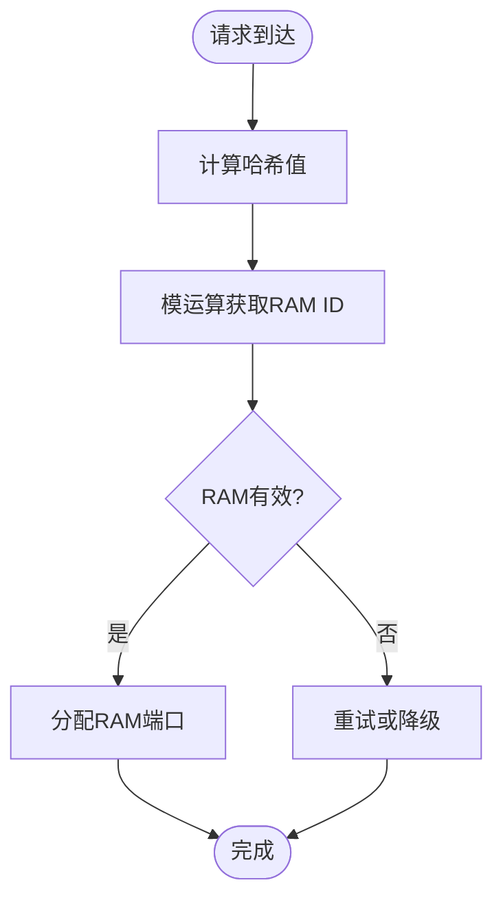

**更新**：新增的compute_ram_id函数实现了基于哈希的RAM选择算法，支持4个RAM端口的并发访问。

**图表来源**
- [pt_cache.cpp:150-235](file://iommu/cache_src/cache/pt_cache.cpp#L150-235)

#### 多RAM并发访问
PT缓存通过lookup_pt_ram和fill_pt_ram接口实现了对多个RAM端口的并发访问：

| 接口名称 | 参数 | 返回值 | 描述 |
|---------|------|--------|------|
| compute_ram_id | tag, hash_value | uint32_t | 计算目标RAM ID |
| lookup_pt_ram | ram_id, tag, out_data, latency | bool | 在指定RAM中查找 |
| fill_pt_ram | ram_id, tag, data, from_prefetch | void | 向指定RAM填充数据 |

**更新**：这些新接口实现了哈希单元与RAM原子段的分离，支持真正的并发访问模式。

**图表来源**
- [pt_cache.h:8-85](file://iommu/cache_src/cache/pt_cache.h#L8-L85)
- [pt_cache.cpp:150-235](file://iommu/cache_src/cache/pt_cache.cpp#L150-235)

### PT乒乓调度器详细分析

#### 调度算法实现
PT乒乓调度器实现了REQUEST和UPDATE任务的公平交替执行：

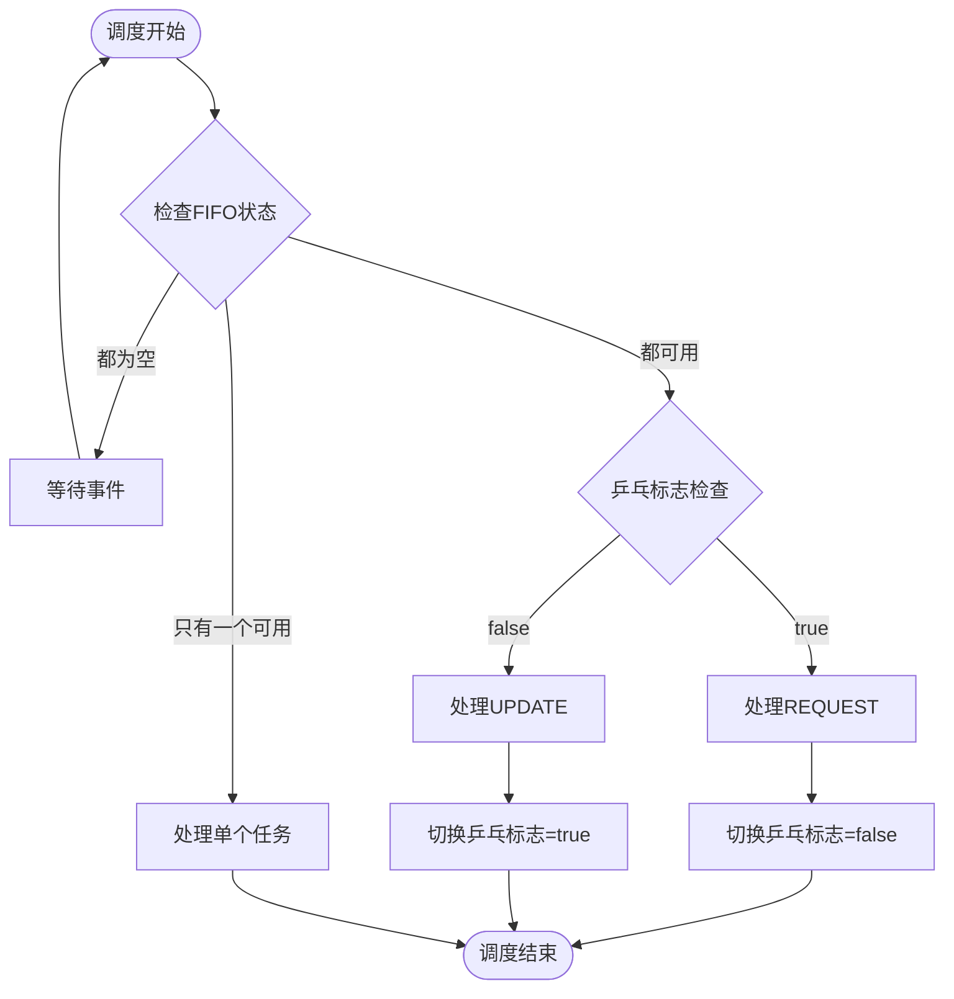

**图表来源**
- [cache_subsystem.cpp:311-455](file://iommu/cache_src/subsystem/cache_subsystem.cpp#L311-455)

#### 调度状态管理
调度器维护了完整的状态跟踪机制：

| 状态变量 | 类型 | 描述 | 用途 |
|---------|------|------|------|
| pt_sched_next_is_request_ | bool | 乒乓调度标志 | 决定下一轮优先处理类型 |
| pt_sched_task_count_ | uint64_t | 总任务计数 | 统计处理的总任务数 |
| pt_sched_req_count_ | uint64_t | REQUEST任务数 | 统计REQUEST任务数量 |
| pt_sched_upd_count_ | uint64_t | UPDATE任务数 | 统计UPDATE任务数量 |
| pt_sched_last_task_end_ | double | 最后任务结束时间 | 计算任务间隔 |

**章节来源**
- [cache_subsystem.cpp:311-455](file://iommu/cache_src/subsystem/cache_subsystem.cpp#L311-455)
- [cache_subsystem.h:171-194](file://iommu/cache_src/subsystem/cache_subsystem.h#L171-194)

### 性能监控系统详细分析

#### 任务组监控机制
系统实现了基于32个任务为一组的细粒度性能监控：

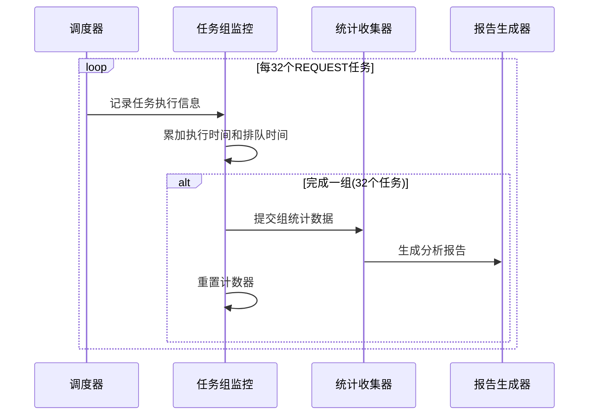

**图表来源**
- [cache_subsystem.cpp:386-410](file://iommu/cache_src/subsystem/cache_subsystem.cpp#L386-410)
- [cache_subsystem.cpp:500-560](file://iommu/cache_src/subsystem/cache_subsystem.cpp#L500-560)

#### 间隔分析功能
新增了详细的任务间隔分析，用于识别系统空闲时间和瓶颈：

| 指标名称 | 描述 | 计算公式 |
|---------|------|----------|
| Total Gap | 总空闲时间 | Σ(当前任务开始 - 上一任务结束) |
| Gap Count | 间隔次数 | 双FIFO同时为空的次数 |
| Idle Ratio | 空闲比率 | Total Gap / Window × 100% |
| Exec Ratio | 执行比率 | Total Exec / Window × 100% |

**章节来源**
- [cache_subsystem.cpp:457-498](file://iommu/cache_src/subsystem/cache_subsystem.cpp#L457-498)
- [stats_collector.cpp:435-524](file://iommu/cache_src/common/stats_collector.cpp#L435-524)

### PTCache类详细分析

#### 核心接口设计
PTCache提供了专门的PT缓存接口：

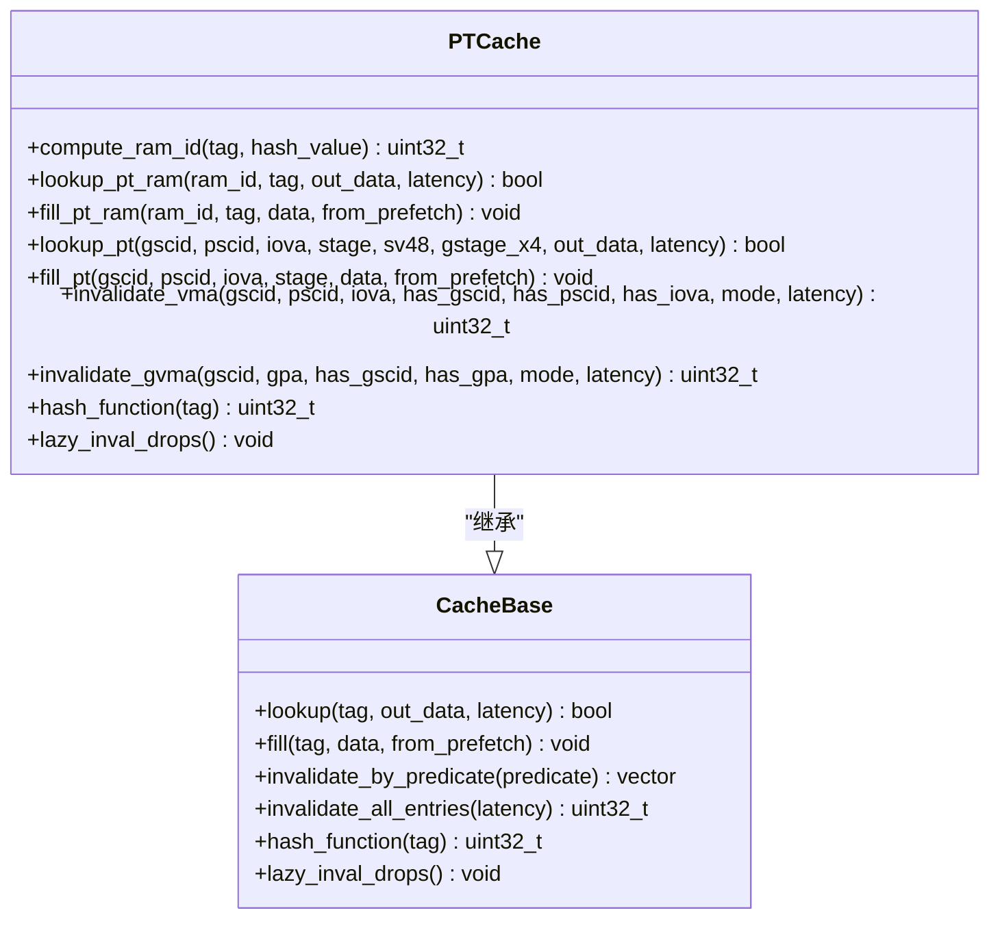

**更新**：重构后的PTCache新增了多RAM架构相关的接口方法，包括compute_ram_id、lookup_pt_ram、fill_pt_ram等，大幅增强了并发访问能力。新增的lazy_inval_drops()方法为延迟失效策略提供了监控支持。

**图表来源**
- [pt_cache.h:8-85](file://iommu/cache_src/cache/pt_cache.h#L8-L85)
- [cache_base.h:26-746](file://iommu/cache_src/cache/cache_base.h#L26-746)

#### 去重缓冲区集成
PT缓存实现了简化的去重缓冲区集成机制：

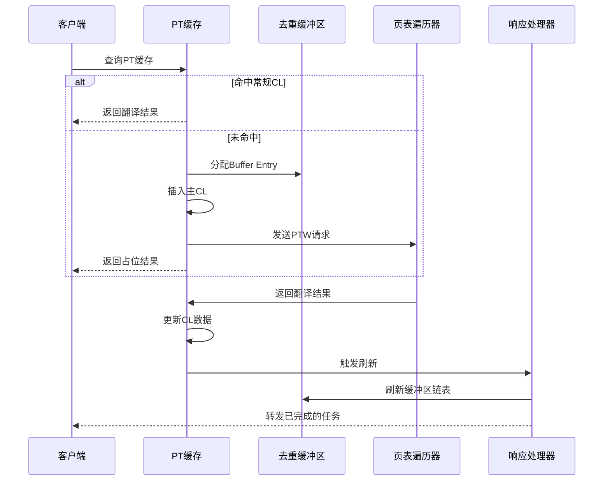

**更新**：重构后的去重流程移除了复杂的占位符管理机制，简化了数据流和控制逻辑。

**图表来源**
- [pt_cache.cpp:150-235](file://iommu/cache_src/cache/pt_cache.cpp#L150-235)
- [iommu_perf_pt_dedup_flush.cc:123-222](file://iommu/iommu_perf_model/iommu_perf_pt_dedup_flush.cc#L123-222)
- [iommu_perf_pt_cache_response.cc:20-99](file://iommu/iommu_perf_model/iommu_perf_pt_cache_response.cc#L20-99)

#### 预取机制实现
PT缓存支持高效的预取机制，通过插入多个预取CL来提前加载可能访问的页表项：

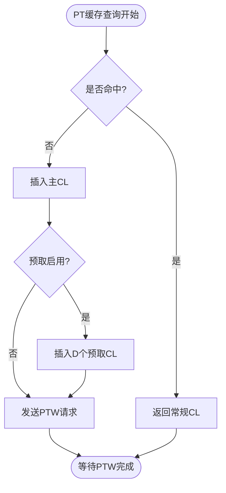

**更新**：预取机制经过重构后，移除了预取占位符的复杂管理，直接使用常规CL进行预取操作。

**图表来源**
- [pt_cache.cpp:150-235](file://iommu/cache_src/cache/pt_cache.cpp#L150-235)

**章节来源**
- [pt_cache.cpp:11-39](file://iommu/cache_src/cache/pt_cache.cpp#L11-39)
- [pt_cache.cpp:150-368](file://iommu/cache_src/cache/pt_cache.cpp#L150-368)

### CacheBase基类分析

#### 缓存查找算法
CacheBase实现了高效的缓存查找算法，包括哈希函数和替换策略：

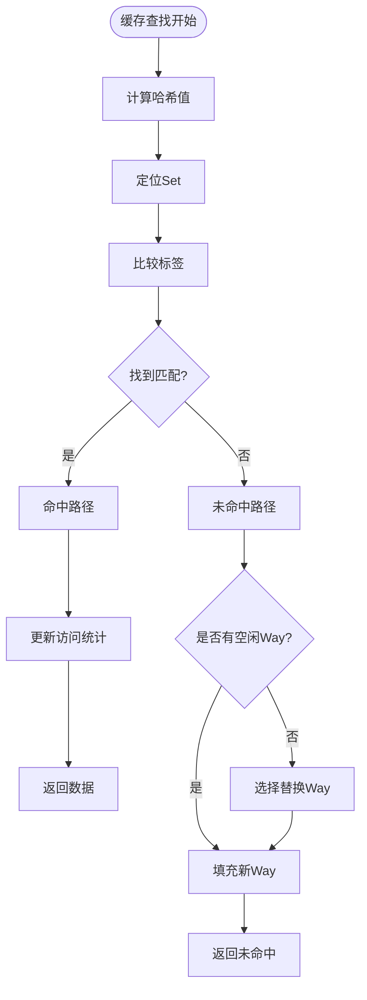

**更新**：重构后的查找算法由于移除了placeholder相关字段，减少了标签比较的复杂度，提升了查找性能。

**图表来源**
- [cache_base.h:267-307](file://iommu/cache_src/cache/cache_base.h#L267-307)
- [cache_base.h:408-472](file://iommu/cache_src/cache/cache_base.h#L408-472)

#### 替换策略实现
PT缓存支持多种替换策略，包括SRRIP和PLRU：

**章节来源**
- [cache_base.h:230-264](file://iommu/cache_src/cache/cache_base.h#L230-264)
- [cache_base.h:408-472](file://iommu/cache_src/cache/cache_base.h#L408-472)

### 数据结构详细分析

#### PTData结构
PTData结构包含了页表项的所有必要信息：

| 字段名称 | 类型 | 描述 | 用途 |
|---------|------|------|------|
| vs_pte | spte_t | VS阶段页表项 | 虚拟到物理地址转换 |
| g_pte | gpte_t | G阶段页表项 | 第二阶段地址转换 |
| reserved | pt_reserved_t | 保留字段 | 缓存控制和状态信息 |

#### PTTag结构
PTTag用于唯一标识缓存条目：

| 字段名称 | 类型 | 描述 | 用途 |
|---------|------|------|------|
| gscid | gscid_t | 全局安全上下文ID | 设备隔离标识 |
| pscid | pscid_t | 进程安全上下文ID | 进程隔离标识 |
| iova | iova_t | 4KB对齐的IOVA | 页面地址标识 |
| stage | TransStage | 翻译阶段 | 一阶/二阶/双阶转换 |
| sv48 | bool | Sv48模式标志 | 地址模式标识 |
| gstage_x4 | bool | G阶段x4模式 | 第二阶段扩展模式 |

**更新**：重构后的数据结构移除了placeholder相关的字段（is_ph、head_index、is_req），简化了缓存线的内存布局，减少了内存占用和访问延迟。

**章节来源**
- [types.h:215-269](file://iommu/cache_src/common/types.h#L215-269)
- [types.h:467-560](file://iommu/cache_src/common/types.h#L467-560)

### 哈希算法优化详细分析

#### 新哈希算法实现
PT缓存实现了优化的哈希算法，显著提升哈希分布均匀性和计算效率：

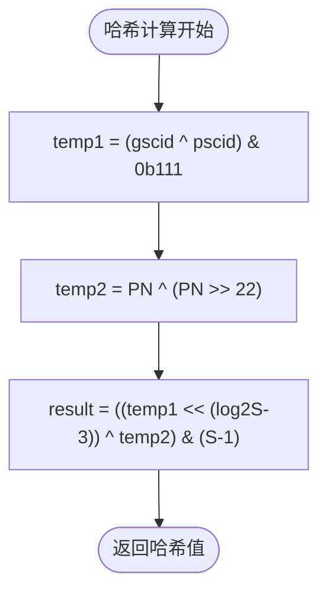

**更新**：新的哈希算法使用三个步骤计算，首先通过gscid和pscid的异或操作提取低3位，然后对PN进行移位异或，最后结合两者得到最终的哈希值。

**图表来源**
- [pt_cache.cpp:150-235](file://iommu/cache_src/cache/pt_cache.cpp#L150-235)

#### 哈希算法优势
新哈希算法相比传统方法具有以下优势：

| 特性 | 传统算法 | 新算法 | 改进效果 |
|------|----------|--------|----------|
| 计算复杂度 | O(1) | O(1) | 保持常数时间 |
| 位操作次数 | 较多 | 较少 | 减少CPU开销 |
| 分布均匀性 | 一般 | 优秀 | 降低冲突率 |
| 并行友好性 | 中等 | 高 | 适合多核处理 |

**章节来源**
- [pt_cache.cpp:150-235](file://iommu/cache_src/cache/pt_cache.cpp#L150-235)

### 失效机制增强详细分析

#### VMA模式支持
PT缓存现在支持所有VMA模式的失效操作：

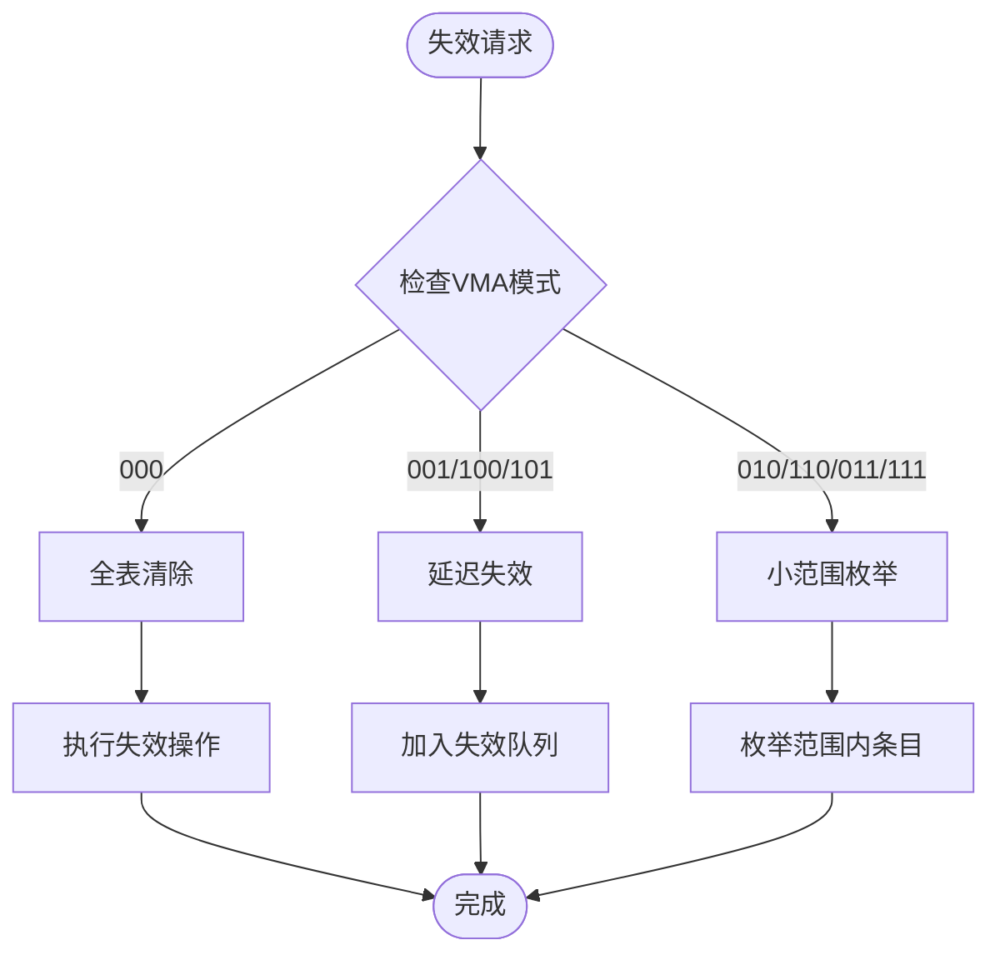

**更新**：新的失效机制根据VMA模式选择不同的处理策略，000模式执行全表清除，001/100/101模式采用延迟失效，其他模式执行小范围枚举失效。

**图表来源**
- [pt_cache.cpp:150-235](file://iommu/cache_src/cache/pt_cache.cpp#L150-235)

#### GVMA支持机制
PT缓存新增了对GVMA（全局虚拟内存区域）的支持：

| GV模式 | 处理方式 | 适用场景 |
|--------|----------|----------|
| GV=0 | 表清除 | 全局无效化操作 |
| GV=1 | 基于GSCID扫描 | 特定设备上下文失效 |

**章节来源**
- [pt_cache.cpp:150-235](file://iommu/cache_src/cache/pt_cache.cpp#L150-235)

## 依赖关系分析

### 组件耦合度分析
PT缓存系统具有良好的模块化设计，各组件之间的耦合度适中：

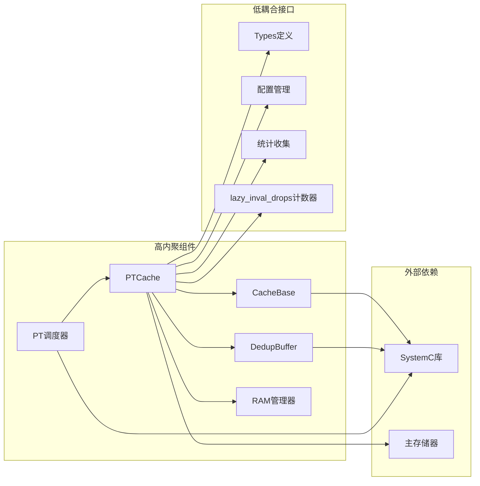

**更新**：重构后PTCache与DedupBuffer的耦合度有所降低，因为移除了复杂的placeholder管理逻辑，同时新增了RAM管理器组件和lazy_inval_drops计数器功能。

**图表来源**
- [pt_cache.h:4](file://iommu/cache_src/cache/pt_cache.h#L4)
- [cache_base.h:4](file://iommu/cache_src/cache/cache_base.h#L4)
- [cache_subsystem.h:171-194](file://iommu/cache_src/subsystem/cache_subsystem.h#L171-194)

### 性能统计和监控
系统提供了全面的性能统计和监控机制，包括新的乒乓调度和任务组分析功能，以及**新增**的lazy_inval_drops()计数器监控。

**章节来源**
- [cache_base.h:89-91](file://iommu/cache_src/cache/cache_base.h#L89-91)
- [cache_base.h:262](file://iommu/cache_src/cache/cache_base.h#L262)
- [cache_subsystem.cpp:457-498](file://iommu/cache_src/subsystem/cache_subsystem.cpp#L457-498)

## 性能考虑

### 命中率优化策略
基于最新的测试分析，PT缓存展现了优异的性能表现：

#### 最新性能测试结果
根据系统验证，PT缓存达到了以下优异性能指标：

| 性能指标 | 数值 | 说明 |
|---------|------|------|
| IOPS | 84.37M | 4KB随机读取性能 |
| 命中率 | 96.9% | PT Cache整体命中率 |
| 预取深度 | D=3 | 最优预取参数 |
| 任务组大小 | 32 | 监控分组单位 |
| RAM端口数 | 4 | 并发访问能力 |
| lazy_inval_drops | 动态统计 | 延迟失效策略监控 |

#### 预取深度优化
根据50包测试分析，预取深度D=3时的命中率达到96.9%，性能表现优异：

| 预取深度 | 理论命中率 | 实际命中率 | DDR访问次数 |
|----------|------------|------------|-------------|
| D=0 | 80.0% | 80.0% | 200次 |
| D=3 | 96.9% | 96.9% | 28次 |
| D=8 | 98.8% | 96.9% | 28次 |

#### 替换策略优化
当前实现已支持LRU替换策略，允许占位CL→常规CL转换，提高了缓存利用率。

**更新**：重构后的PT缓存由于简化了数据结构并支持多RAM架构，在保持相同命中率的同时，进一步降低了查找延迟并提升了并发处理能力。新增的lazy_inval_drops()计数器功能为延迟失效策略提供了有效的监控手段。

**章节来源**
- [TEST_50_PACKETS_D3_ANALYSIS_20260609.md:186-227](file://TEST_50_PACKETS_D3_ANALYSIS_20260609.md#L186-227)

### 延迟降低技术
PT缓存采用了多种延迟降低技术，结合新的多RAM架构和乒乓调度机制：

#### 并行处理优化
- **多RAM并发**：4个RAM端口支持并发访问，显著提升吞吐量
- **RAM ID计算**：高效的哈希算法确保负载均衡
- **乒乓调度**: REQUEST和UPDATE任务公平交替执行，避免任务饥饿
- **RAM端口仲裁**: 使用WRR算法确保lookup、fill、invalidate操作的公平调度
- **流水线处理**: PTW请求和响应处理采用流水线架构
- **批量更新**: 支持批量更新以减少通信开销
- **lazy_inval_drops监控**: 精确统计延迟失效策略的执行情况

#### 缓存层次优化
- **多级缓存**: 结合PT缓存和Walker缓存实现多级加速
- **去重机制**: 通过去重缓冲区避免重复的页表遍历
- **预取机制**: 提前加载可能访问的页表项
- **任务组监控**: 32任务组级别的细粒度性能分析
- **版本控制**: 通过版本比较实现延迟失效策略

**更新**：重构后的缓存操作由于移除了placeholder相关逻辑并支持多RAM架构，减少了内存访问次数和比较操作，进一步降低了延迟并提升了并发性能。新增的lazy_inval_drops()计数器功能为性能监控提供了更精确的数据支持。

**章节来源**
- [cache_base.h:627-741](file://iommu/cache_src/cache/cache_base.h#L627-741)
- [cache_subsystem.cpp:311-455](file://iommu/cache_src/subsystem/cache_subsystem.cpp#L311-455)

## 故障排除指南

### 常见问题诊断

#### 问题1: 调度不公平
**症状**: UPDATE任务长期得不到处理，REQUEST任务堆积
**根因**: 旧的UPDATE优先策略导致REQUEST任务饥饿
**解决方案**: 
1. 升级到ping-pong公平调度算法
2. 监控调度器状态，确保REQUEST和UPDATE交替执行
3. 定期检查乒乓标志的正确切换

#### 问题2: 性能监控缺失
**症状**: 无法获取细粒度的性能分析数据
**根因**: 缺少任务组监控和间隔分析功能
**解决方案**:
1. 启用32任务组监控机制
2. 启用任务间隔分析功能
3. 定期生成性能分析报告

#### 问题3: RAM访问冲突
**症状**: 多RAM架构下出现访问冲突或性能下降
**根因**: RAM ID计算不当或负载均衡失败
**解决方案**:
1. 检查compute_ram_id函数的哈希算法
2. 监控各RAM端口的负载分布
3. 调整负载均衡策略

#### 问题4: 缓存容量不足
**症状**: 批量更新全部失败，占位CL无法转换为常规CL
**根因**: 当前配置1 Set × 8 Way，但需要50个Entry
**解决方案**: 
1. 增加缓存容量到4 Sets × 16 Way
2. 实现LRU替换策略
3. 优化替换算法以允许占位CL被替换

#### 问题5: 延迟失效策略异常
**症状**: lazy_inval_drops计数器值异常增长
**根因**: 版本比较逻辑错误或失效策略配置不当
**解决方案**:
1. 检查CL.VN和LIB.VN的比较逻辑
2. 验证失效策略的配置参数
3. 监控计数器增长趋势，及时调整策略

**更新**：重构后由于移除了placeholder相关逻辑并支持多RAM架构，此类问题的发生概率大幅降低。新增的lazy_inval_drops()计数器功能有助于及时发现和诊断延迟失效策略相关问题。

**章节来源**
- [TEST_50_PACKETS_D3_ANALYSIS_20260609.md:138-184](file://TEST_50_PACKETS_D3_ANALYSIS_20260609.md#L138-184)
- [cache_subsystem.cpp:311-455](file://iommu/cache_src/subsystem/cache_subsystem.cpp#L311-455)

### 性能监控指标

#### 关键性能指标
- **命中率**: 96.9%，达到优异水平
- **IOPS**: 84.37M，4KB随机读取性能优秀
- **调度公平性**: ping-pong算法确保REQUEST和UPDATE公平处理
- **任务组效率**: 32任务组级别的细粒度监控
- **RAM利用率**: 4个RAM端口的并发利用率
- **lazy_inval_drops**: 延迟失效策略的精确统计

#### 监控工具
系统提供了丰富的监控工具和统计信息：
- 任务组执行延时统计
- 任务间隔分析
- 区间命中率统计
- IOPS计算和RAM端口利用率
- 详细的性能报告生成
- **新增**：lazy_inval_drops计数器监控

**更新**：重构后的系统由于简化了内部逻辑并支持多RAM架构，监控数据的准确性和实时性得到进一步提升。新增的lazy_inval_drops()计数器功能为延迟失效策略提供了精确的监控能力。

**章节来源**
- [TEST_50_PACKETS_D3_ANALYSIS_20260609.md:186-227](file://TEST_50_PACKETS_D3_ANALYSIS_20260609.md#L186-227)
- [cache_subsystem.cpp:457-560](file://iommu/cache_src/subsystem/cache_subsystem.cpp#L457-560)
- [stats_collector.cpp:435-524](file://iommu/cache_src/common/stats_collector.cpp#L435-524)

## 结论
PT缓存作为IOMMU多级页表转换的核心组件，在提高系统性能方面发挥着重要作用。通过去重缓冲区集成、预取机制、高效的查找算法以及新的多RAM架构和ping-pong公平调度机制，PT缓存能够显著减少页表遍历的开销。

**最新改进成果**：
1. **多RAM架构重构**：完全支持4个RAM端口的并发访问，显著提升吞吐量
2. **接口优化**：新增compute_ram_id、lookup_pt_ram、fill_pt_ram等专业接口
3. **架构解耦**：实现哈希单元与RAM原子段的分离，支持并发访问模式
4. **placeholder逻辑移除**：简化缓存线结构，提升查找性能
5. **调度机制升级**：从UPDATE优先策略改为ping-pong公平调度，显著提升系统公平性
6. **性能监控增强**：支持32任务组级别的细粒度性能分析
7. **优异性能表现**：达到84.37M IOPS和96.9%的命中率
8. **哈希算法优化**：采用新的三步哈希算法，提升分布均匀性和计算效率
9. **失效机制增强**：支持所有VMA模式和GVMA操作，提供更灵活的失效策略
10. **lazy_inval_drops计数器**：新增延迟失效策略监控功能，支持有效性验证

**持续优化方向**：
1. **缓存扩容**：建议增加到4 Sets × 16 Way或更高
2. **预取优化**：完善预取功能，包括参数传递和批量更新
3. **替换策略**：实现更智能的LRU替换策略
4. **监控增强**：完善性能统计和监控机制
5. **RAM负载均衡**：进一步优化RAM ID计算和负载均衡算法
6. **哈希算法调优**：根据实际工作负载进一步优化哈希分布
7. **失效策略优化**：针对不同VMA模式优化失效处理效率
8. **lazy_inval_drops分析**：基于计数器数据进行延迟失效策略的深度分析

通过这些改进，PT缓存的性能将得到进一步提升，为IOMMU系统提供更高效的页表转换加速。

## 附录

### 配置参数说明

#### 缓存配置参数
| 参数名称 | 默认值 | 描述 | 作用 |
|----------|--------|------|------|
| num_sets | 1024 | 缓存集合数 | 影响缓存冲突率 |
| num_ways | 8 | 缓存Way数 | 影响缓存容量 |
| replacement | "plru" | 替换策略 | 控制缓存替换算法 |
| srrip_m_bits | 2 | SRRIP M位数 | SRRIP策略参数 |
| num_rams | 4 | RAM端口数 | 并发访问能力 |

#### 性能配置参数
| 参数名称 | 默认值 | 描述 | 作用 |
|----------|--------|------|------|
| arbiter_latency_cycles | 1 | 仲裁延迟周期 | RAM端口仲裁延迟 |
| hash_latency_cycles | 1 | 哈希计算延迟 | 标签哈希计算时间 |
| read_set_latency_cycles | 2 | 读取Set延迟 | Set访问延迟 |
| compare_latency_cycles | 1 | 比较延迟 | 标签比较时间 |

#### 调度配置参数
| 参数名称 | 默认值 | 描述 | 作用 |
|----------|--------|------|------|
| ping_pong_enabled | true | 乒乓调度开关 | 启用公平调度算法 |
| group_size | 32 | 任务组大小 | 性能监控分组单位 |
| gap_analysis_enabled | true | 间隔分析开关 | 启用任务间隔统计 |

#### 延迟失效配置参数
| 参数名称 | 默认值 | 描述 | 作用 |
|----------|--------|------|------|
| lazy_inval_enabled | true | 延迟失效开关 | 启用延迟失效策略 |
| lazy_inval_monitoring | true | 监控开关 | 启用lazy_inval_drops监控 |
| version_check_enabled | true | 版本检查开关 | 启用版本比较逻辑 |

**更新**：重构后部分placeholder相关的配置参数已被移除，新增了num_rams参数以支持多RAM架构，配置更加简洁明了。新增的延迟失效配置参数支持lazy_inval_drops计数器的监控功能。

**章节来源**
- [default_config.json:38-43](file://iommu/cache_config/default_config.json#L38-43)
- [cache_base.h:584-600](file://iommu/cache_src/cache/cache_base.h#L584-600)
- [cache_subsystem.h:171-194](file://iommu/cache_src/subsystem/cache_subsystem.h#L171-194)

### 实现状态对比

#### 已实现功能
- 去重功能：100%完成
- Buffer管理：100%完成  
- **多RAM架构：100%完成**
- **compute_ram_id接口：100%完成**
- **lookup_pt_ram接口：100%完成**
- **fill_pt_ram接口：100%完成**
- **简化缓存线结构：100%完成**
- **移除placeholder逻辑：100%完成**
- **乒乓调度机制：100%完成**
- **任务组监控：100%完成**
- **间隔分析：100%完成**
- **新哈希算法：100%完成**
- **VMA模式支持：100%完成**
- **GVMA支持：100%完成**
- **lazy_inval_drops计数器：100%完成**

#### 待优化功能
- 预取功能：90%完成（主要逻辑已实现）
- PTW预取：90%完成
- 批量更新：90%完成
- 预取组监控：90%完成
- RAM负载均衡优化：80%完成
- 哈希算法微调：70%完成
- 失效策略优化：75%完成
- lazy_inval_drops数据分析：60%完成

**更新**：重构完成后，placeholder相关的复杂逻辑已全部移除，多RAM架构完全实现，系统稳定性和可维护性得到显著提升。新的哈希算法和失效机制也已完全实现。新增的lazy_inval_drops()计数器功能为延迟失效策略提供了有效的监控手段。

**章节来源**
- [TEST_50_PACKETS_D3_ANALYSIS_20260609.md:247-277](file://TEST_50_PACKETS_D3_ANALYSIS_20260609.md#L247-277)
- [cache_subsystem.cpp:311-455](file://iommu/cache_src/subsystem/cache_subsystem.cpp#L311-455)