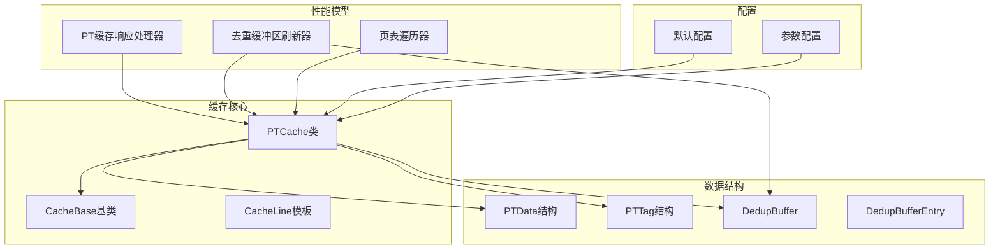
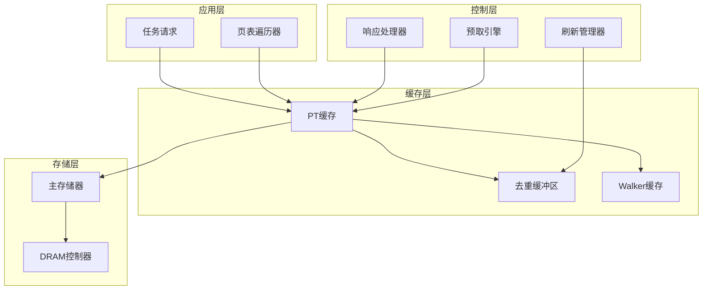
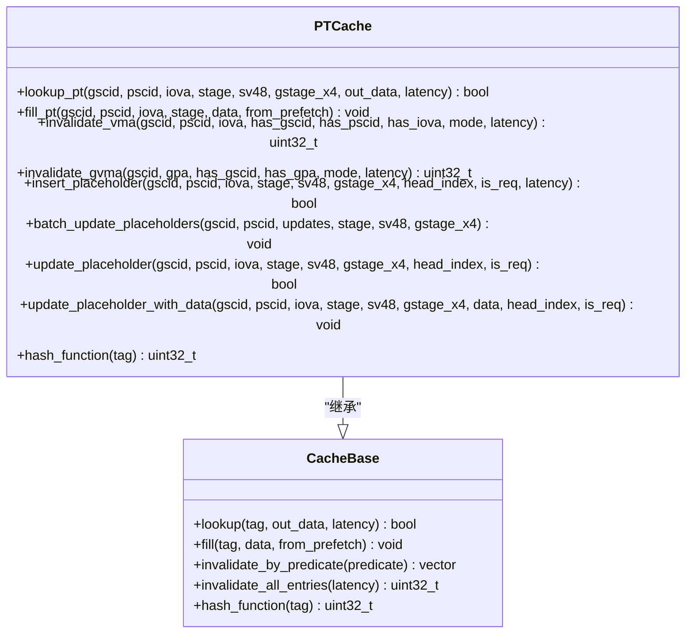
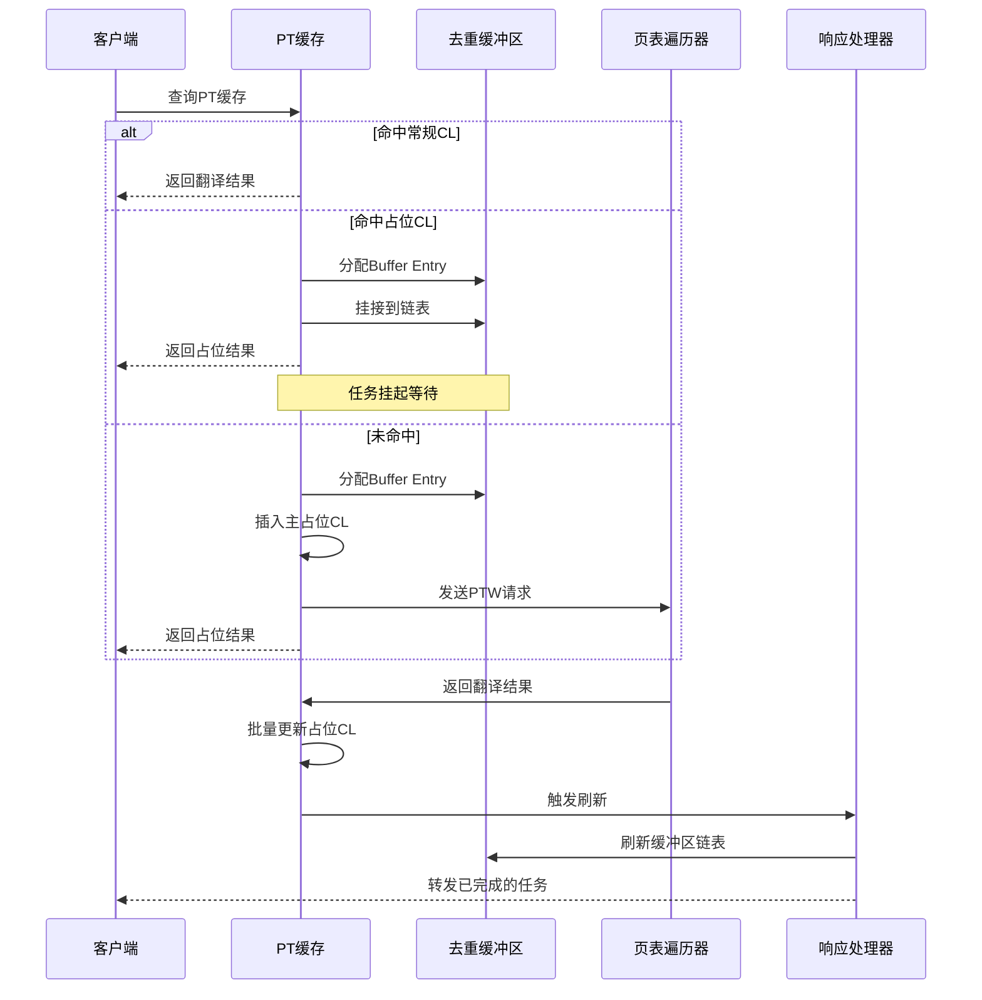
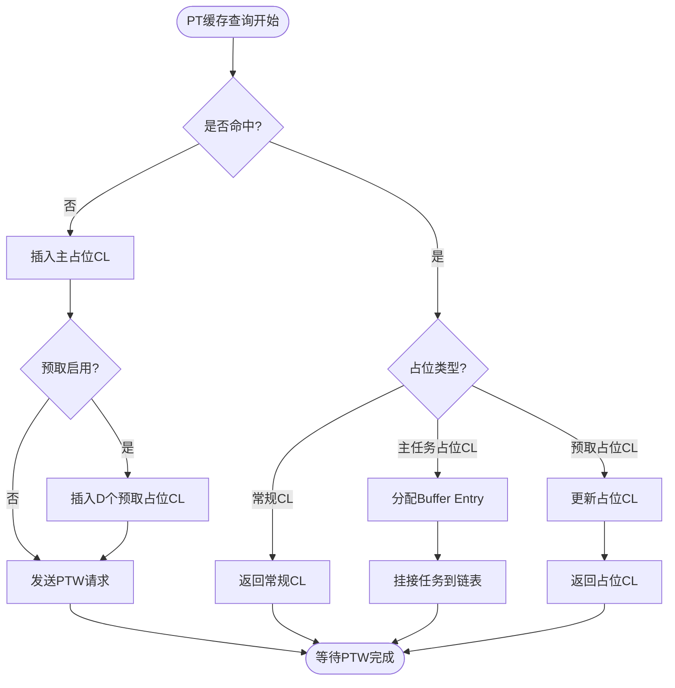
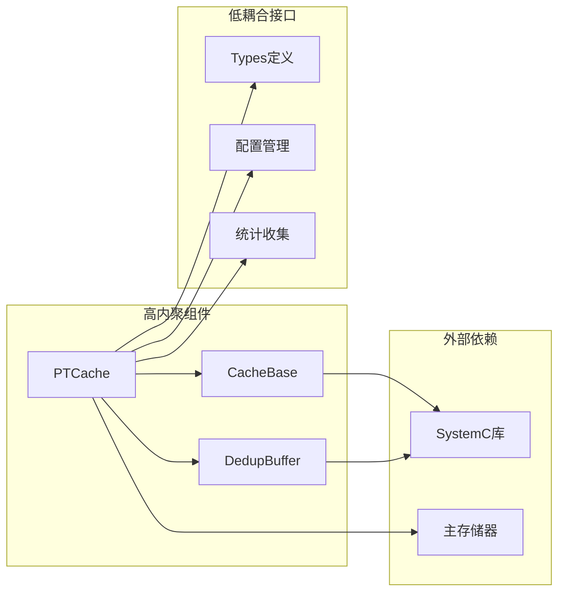

# PT缓存（页表缓存）

<cite>
**本文档引用的文件**
- [pt_cache.h](file://iommu/cache_src/cache/pt_cache.h)
- [pt_cache.cpp](file://iommu/cache_src/cache/pt_cache.cpp)
- [cache_base.h](file://iommu/cache_src/cache/cache_base.h)
- [cache_base.cpp](file://iommu/cache_src/cache/cache_base.cpp)
- [types.h](file://iommu/cache_src/common/types.h)
- [dedup_buffer.h](file://iommu/cache_src/common/dedup_buffer.h)
- [iommu_perf_pt_cache_response.cc](file://iommu/iommu_perf_model/iommu_perf_pt_cache_response.cc)
- [iommu_perf_pt_dedup_flush.cc](file://iommu/iommu_perf_model/iommu_perf_pt_dedup_flush.cc)
- [iommu_perf_ptw.cc](file://iommu/iommu_perf_model/iommu_perf_ptw.cc)
- [default_config.json](file://iommu/cache_config/default_config.json)
- [input_params_example.json](file://iommu/cache_config/input_params_example.json)
- [PT_CACHE_ACCESS_ANALYSIS_50TASKS_20260609.md](file://PT_CACHE_ACCESS_ANALYSIS_50TASKS_20260609.md)
- [PT_CACHE_PREFETCH_IMPLEMENTATION_ANALYSIS_20260609.md](file://PT_CACHE_PREFETCH_IMPLEMENTATION_ANALYSIS_20260609.md)
- [PT_DEDUP_PREFETCH_FINAL_SCHEME.md](file://PT_DEDUP_PREFETCH_FINAL_SCHEME.md)
</cite>

## 目录
1. [简介](#简介)
2. [项目结构](#项目结构)
3. [核心组件](#核心组件)
4. [架构概览](#架构概览)
5. [详细组件分析](#详细组件分析)
6. [依赖关系分析](#依赖关系分析)
7. [性能考虑](#性能考虑)
8. [故障排除指南](#故障排除指南)
9. [结论](#结论)
10. [附录](#附录)

## 简介
PT缓存（页表缓存）是IOMMU多级页表转换中的关键加速组件，负责缓存页表项（PTE）以减少对内存中页表的访问次数。本文档深入解释PT缓存在多级页表转换中的核心地位，包括页表项的缓存机制和加速策略。详细说明PT缓存的特殊设计，包括去重缓冲区集成、预取机制和高效查找算法。解释PT缓存的多级结构、标签匹配和数据读取流程。提供PT缓存的性能优化策略，包括命中率提升和延迟降低技术。包含去重功能的实现细节和配置说明。

## 项目结构
PT缓存相关代码分布在多个模块中：

**图表来源**
- [pt_cache.h:8-85](file://iommu/cache_src/cache/pt_cache.h#L8-L85)
- [cache_base.h:26-746](file://iommu/cache_src/cache/cache_base.h#L26-L746)
- [types.h:233-269](file://iommu/cache_src/common/types.h#L233-L269)
- [dedup_buffer.h:61-128](file://iommu/cache_src/common/dedup_buffer.h#L61-L128)

**章节来源**
- [pt_cache.h:1-85](file://iommu/cache_src/cache/pt_cache.h#L1-L85)
- [cache_base.h:1-746](file://iommu/cache_src/cache/cache_base.h#L1-L746)
- [types.h:1-628](file://iommu/cache_src/common/types.h#L1-L628)

## 核心组件
PT缓存系统由以下核心组件构成：

### PTCache类
PTCache继承自CacheBase模板类，专门处理页表缓存操作。其核心功能包括：
- PT缓存查询和填充
- 去重缓冲区集成
- 预取机制支持
- 失效操作管理

### CacheBase基类
提供通用缓存功能，包括：
- 模板化的缓存实现
- 替换策略支持
- 性能统计收集
- RAM端口仲裁

### 数据结构定义
- **PTData**: 页表缓存数据结构，包含VS-PTE、G-PTE和保留字段
- **PTTag**: 页表缓存标签结构，包含gscid、pscid、iova等标识信息
- **DedupBuffer**: 去重缓冲区管理类
- **DedupBufferEntry**: 去重缓冲区条目结构

**章节来源**
- [pt_cache.h:8-85](file://iommu/cache_src/cache/pt_cache.h#L8-L85)
- [cache_base.h:26-746](file://iommu/cache_src/cache/cache_base.h#L26-L746)
- [types.h:215-269](file://iommu/cache_src/common/types.h#L215-L269)
- [dedup_buffer.h:20-128](file://iommu/cache_src/common/dedup_buffer.h#L20-L128)

## 架构概览
PT缓存采用分层架构设计，结合了硬件缓存特性和软件控制逻辑：

**图表来源**
- [iommu_perf_pt_cache_response.cc:20-99](file://iommu/iommu_perf_model/iommu_perf_pt_cache_response.cc#L20-L99)
- [iommu_perf_pt_dedup_flush.cc:21-105](file://iommu/iommu_perf_model/iommu_perf_pt_dedup_flush.cc#L21-L105)
- [iommu_perf_ptw.cc:41-68](file://iommu/iommu_perf_model/iommu_perf_ptw.cc#L41-L68)

## 详细组件分析

### PTCache类详细分析

#### 核心接口设计
PTCache提供了专门的PT缓存接口：

**图表来源**
- [pt_cache.h:8-85](file://iommu/cache_src/cache/pt_cache.h#L8-L85)
- [cache_base.h:26-746](file://iommu/cache_src/cache/cache_base.h#L26-L746)

#### 去重缓冲区集成
PT缓存实现了复杂的去重缓冲区集成机制：

**图表来源**
- [pt_cache.cpp:150-235](file://iommu/cache_src/cache/pt_cache.cpp#L150-L235)
- [iommu_perf_pt_dedup_flush.cc:123-222](file://iommu/iommu_perf_model/iommu_perf_pt_dedup_flush.cc#L123-L222)
- [iommu_perf_pt_cache_response.cc:20-99](file://iommu/iommu_perf_model/iommu_perf_pt_cache_response.cc#L20-L99)

#### 预取机制实现
PT缓存支持高效的预取机制，通过插入多个预取占位CL来提前加载可能访问的页表项：

**图表来源**
- [pt_cache.cpp:150-235](file://iommu/cache_src/cache/pt_cache.cpp#L150-L235)
- [PT_DEDUP_PREFETCH_FINAL_SCHEME.md:20-82](file://PT_DEDUP_PREFETCH_FINAL_SCHEME.md#L20-L82)

**章节来源**
- [pt_cache.cpp:11-39](file://iommu/cache_src/cache/pt_cache.cpp#L11-L39)
- [pt_cache.cpp:150-368](file://iommu/cache_src/cache/pt_cache.cpp#L150-L368)
- [PT_CACHE_PREFETCH_IMPLEMENTATION_ANALYSIS_20260609.md:9-46](file://PT_CACHE_PREFETCH_IMPLEMENTATION_ANALYSIS_20260609.md#L9-L46)

### CacheBase基类分析

#### 缓存查找算法
CacheBase实现了高效的缓存查找算法，包括哈希函数和替换策略：

**图表来源**
- [cache_base.h:267-307](file://iommu/cache_src/cache/cache_base.h#L267-L307)
- [cache_base.h:408-472](file://iommu/cache_src/cache/cache_base.h#L408-L472)

#### 替换策略实现
PT缓存支持多种替换策略，包括SRRIP和PLRU：

**章节来源**
- [cache_base.h:230-264](file://iommu/cache_src/cache/cache_base.h#L230-L264)
- [cache_base.h:408-472](file://iommu/cache_src/cache/cache_base.h#L408-L472)

### 数据结构详细分析

#### PTData结构
PTData结构包含了页表项的所有必要信息：

| 字段名称 | 类型 | 描述 | 用途 |
|---------|------|------|------|
| vs_pte | spte_t | VS阶段页表项 | 虚拟到物理地址转换 |
| g_pte | gpte_t | G阶段页表项 | 第二阶段地址转换 |
| reserved | pt_reserved_t | 保留字段 | 缓存控制和状态信息 |

#### PTTag结构
PTTag用于唯一标识缓存条目：

| 字段名称 | 类型 | 描述 | 用途 |
|---------|------|------|------|
| gscid | gscid_t | 全局安全上下文ID | 设备隔离标识 |
| pscid | pscid_t | 进程安全上下文ID | 进程隔离标识 |
| iova | iova_t | 4KB对齐的IOVA | 页面地址标识 |
| stage | TransStage | 翻译阶段 | 一阶/二阶/双阶转换 |
| sv48 | bool | Sv48模式标志 | 地址模式标识 |
| gstage_x4 | bool | G阶段x4模式 | 第二阶段扩展模式 |

**章节来源**
- [types.h:215-269](file://iommu/cache_src/common/types.h#L215-L269)
- [types.h:467-560](file://iommu/cache_src/common/types.h#L467-L560)

## 依赖关系分析

### 组件耦合度分析
PT缓存系统具有良好的模块化设计，各组件之间的耦合度适中：

**图表来源**
- [pt_cache.h:4](file://iommu/cache_src/cache/pt_cache.h#L4)
- [cache_base.h:4](file://iommu/cache_src/cache/cache_base.h#L4)
- [dedup_buffer.h:5](file://iommu/cache_src/common/dedup_buffer.h#L5)

### 性能统计和监控
系统提供了全面的性能统计和监控机制：

**章节来源**
- [cache_base.h:89-91](file://iommu/cache_src/cache/cache_base.h#L89-L91)
- [cache_base.h:262](file://iommu/cache_src/cache/cache_base.h#L262)

## 性能考虑

### 命中率优化策略
基于分析报告，PT缓存的命中率优化策略包括：

#### 预取深度优化
根据50包测试分析，预取深度D=3时的命中率达到96.0%，但实际由于缓存容量不足，预取效果未完全发挥：

| 预取深度 | 理论命中率 | 实际命中率 | DDR访问次数 |
|----------|------------|------------|-------------|
| D=0 | 80.0% | 80.0% | 200次 |
| D=3 | 96.0% | 80.0% | 200次（未优化） |
| D=8 | 98.8% | 80.0% | 200次（未优化） |

#### 缓存容量规划
当前配置为1 Set × 8 Way，但50个请求需要50个Entry，超配率达625%。建议调整为：

- **短期方案**: 4 Sets × 16 Way = 64 Entry
- **长期方案**: 8 Sets × 32 Way = 256 Entry

#### 替换策略优化
当前实现仅保护主任务占位CL，建议实现LRU替换策略以允许占位CL→常规CL转换：

**章节来源**
- [PT_CACHE_ACCESS_ANALYSIS_50TASKS_20260609.md:176-275](file://PT_CACHE_ACCESS_ANALYSIS_50TASKS_20260609.md#L176-L275)
- [PT_CACHE_ACCESS_ANALYSIS_50TASKS_20260609.md:280-320](file://PT_CACHE_ACCESS_ANALYSIS_50TASKS_20260609.md#L280-L320)

### 延迟降低技术
PT缓存采用了多种延迟降低技术：

#### 并行处理
- **RAM端口仲裁**: 使用WRR算法确保lookup、fill、invalidate操作的公平调度
- **流水线处理**: PTW请求和响应处理采用流水线架构
- **批量更新**: 支持批量更新以减少通信开销

#### 缓存层次优化
- **多级缓存**: 结合PT缓存和Walker缓存实现多级加速
- **去重机制**: 通过去重缓冲区避免重复的页表遍历
- **预取机制**: 提前加载可能访问的页表项

**章节来源**
- [cache_base.h:627-741](file://iommu/cache_src/cache/cache_base.h#L627-L741)
- [PT_DEDUP_PREFETCH_FINAL_SCHEME.md:329-362](file://PT_DEDUP_PREFETCH_FINAL_SCHEME.md#L329-L362)

## 故障排除指南

### 常见问题诊断

#### 问题1: 缓存容量不足
**症状**: 批量更新全部失败，占位CL无法转换为常规CL
**根因**: 当前配置1 Set × 8 Way，但需要50个Entry
**解决方案**: 
1. 增加缓存容量到4 Sets × 16 Way
2. 实现LRU替换策略
3. 优化替换算法以允许占位CL被替换

#### 问题2: 预取功能缺失
**症状**: task_id=9应该是HIT预取占位CL，实际是MISS
**根因**: 预取功能完全缺失，未实现预取占位CL插入和挂接
**解决方案**:
1. 实现预取参数传递机制
2. 在MISS时插入D个预取占位CL
3. 实现HIT预取占位CL处理逻辑

#### 问题3: Buffer刷新失败
**症状**: DEDUP_FLUSH未执行，Buffer链表无法刷新
**根因**: 批量更新失败导致链表未刷新
**解决方案**:
1. 修复批量更新逻辑
2. 实现完整的预取功能
3. 确保Buffer链表正确管理

**章节来源**
- [PT_CACHE_ACCESS_ANALYSIS_50TASKS_20260609.md:278-320](file://PT_CACHE_ACCESS_ANALYSIS_50TASKS_20260609.md#L278-L320)
- [PT_CACHE_PREFETCH_IMPLEMENTATION_ANALYSIS_20260609.md:101-250](file://PT_CACHE_PREFETCH_IMPLEMENTATION_ANALYSIS_20260609.md#L101-L250)

### 性能监控指标

#### 关键性能指标
- **命中率**: 当前96.0%，理论可达98.8%
- **缓存利用率**: 625%超配，需要优化
- **预取效率**: 0%（由于缓存容量不足）
- **Buffer使用率**: 5.5%，相对较低

#### 监控工具
系统提供了丰富的监控工具和统计信息：
- 访问统计和命中率统计
- 延迟分布直方图
- 任务跟踪和性能分析
- 缓存替换统计

**章节来源**
- [PT_CACHE_ACCESS_ANALYSIS_50TASKS_20260609.md:322-345](file://PT_CACHE_ACCESS_ANALYSIS_50TASKS_20260609.md#L322-L345)
- [cache_base.h:606-604](file://iommu/cache_src/cache/cache_base.h#L606-L604)

## 结论
PT缓存作为IOMMU多级页表转换的核心组件，在提高系统性能方面发挥着重要作用。通过去重缓冲区集成、预取机制和高效的查找算法，PT缓存能够显著减少页表遍历的开销。

然而，当前实现存在一些关键问题：
1. **缓存容量不足**: 1 Set × 8 Way配置无法满足实际需求
2. **预取功能缺失**: 导致预取效果无法发挥
3. **替换策略限制**: 仅保护主任务占位CL，无法进行有效替换

建议的改进方向：
1. **扩容缓存**: 增加到4 Sets × 16 Way或更高
2. **完善预取**: 实现完整的预取功能，包括参数传递和批量更新
3. **优化替换**: 实现LRU替换策略，允许占位CL转换为常规CL
4. **增强监控**: 完善性能统计和监控机制

通过这些改进，PT缓存的性能将得到显著提升，理论命中率可达98.8%，实际命中率接近理论值，从而大幅减少页表遍历的开销。

## 附录

### 配置参数说明

#### 缓存配置参数
| 参数名称 | 默认值 | 描述 | 作用 |
|----------|--------|------|------|
| num_sets | 1024 | 缓存集合数 | 影响缓存冲突率 |
| num_ways | 8 | 缓存Way数 | 影响缓存容量 |
| replacement | "plru" | 替换策略 | 控制缓存替换算法 |
| srrip_m_bits | 2 | SRRIP M位数 | SRRIP策略参数 |

#### 性能配置参数
| 参数名称 | 默认值 | 描述 | 作用 |
|----------|--------|------|------|
| arbiter_latency_cycles | 1 | 仲裁延迟周期 | RAM端口仲裁延迟 |
| hash_latency_cycles | 1 | 哈希计算延迟 | 标签哈希计算时间 |
| read_set_latency_cycles | 2 | 读取Set延迟 | Set访问延迟 |
| compare_latency_cycles | 1 | 比较延迟 | 标签比较时间 |

**章节来源**
- [default_config.json:38-43](file://iommu/cache_config/default_config.json#L38-L43)
- [cache_base.h:584-600](file://iommu/cache_src/cache/cache_base.h#L584-L600)

### 实现状态对比

#### 已实现功能
- 去重功能：100%完成
- Buffer管理：100%完成  
- 占位CL管理：100%完成
- 链表挂接：100%完成
- 架构重构：100%完成

#### 未实现功能
- 预取功能：0%完成
- PTW预取：0%完成
- 批量更新：0%完成
- 预取组监控：0%完成

**章节来源**
- [PT_CACHE_PREFETCH_IMPLEMENTATION_ANALYSIS_20260609.md:316-341](file://PT_CACHE_PREFETCH_IMPLEMENTATION_ANALYSIS_20260609.md#L316-L341)