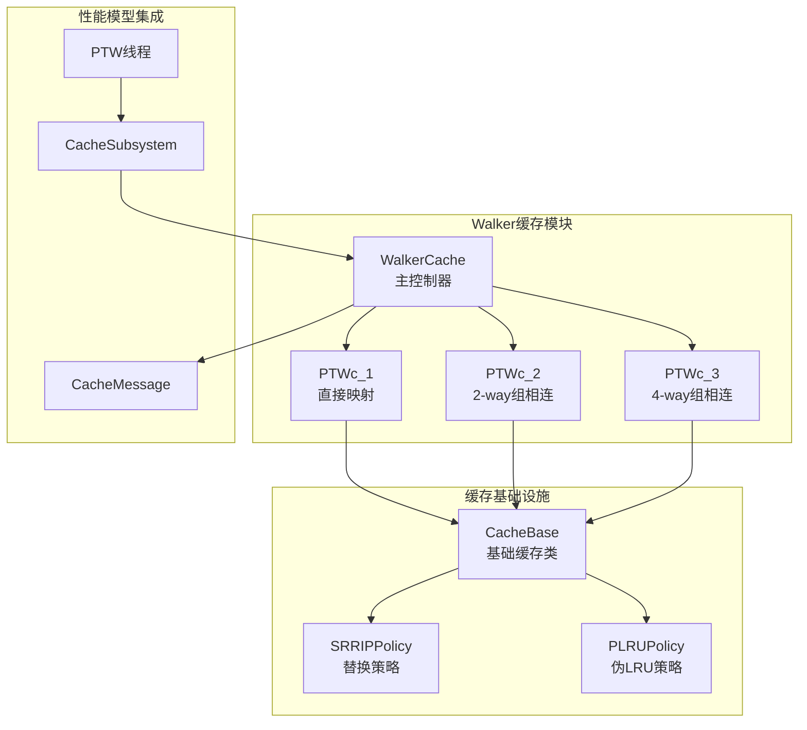
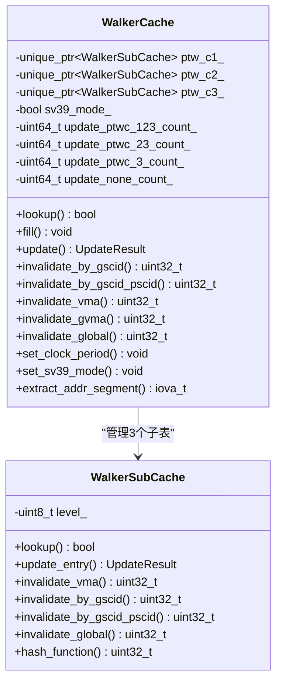
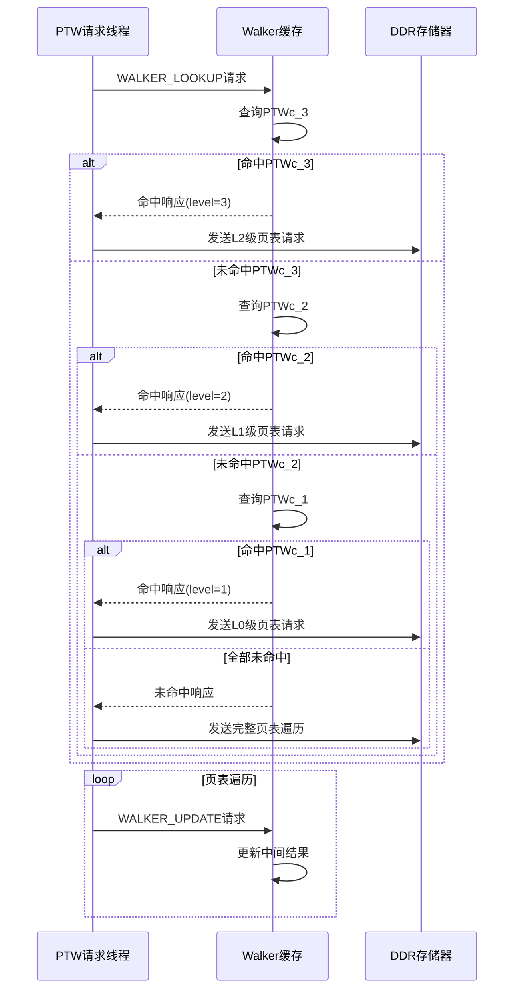
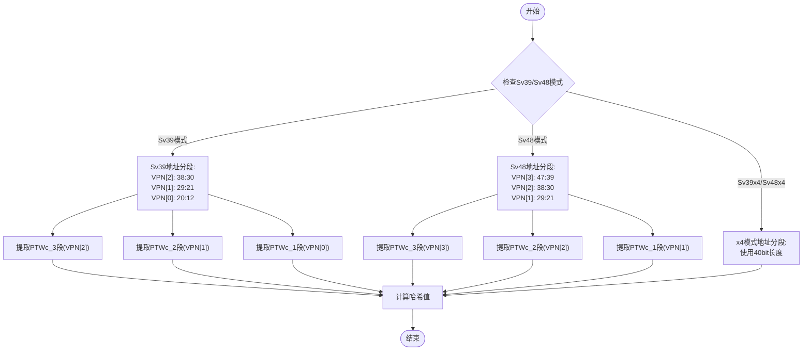
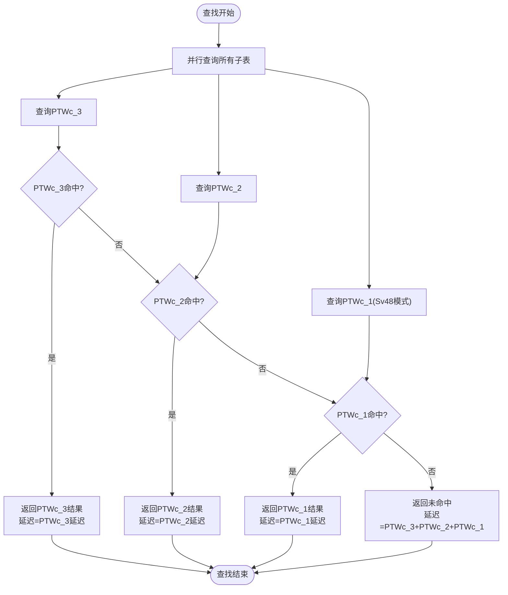
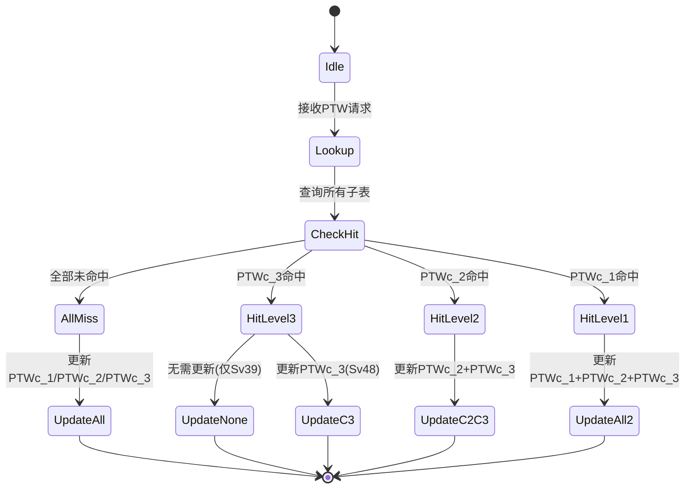
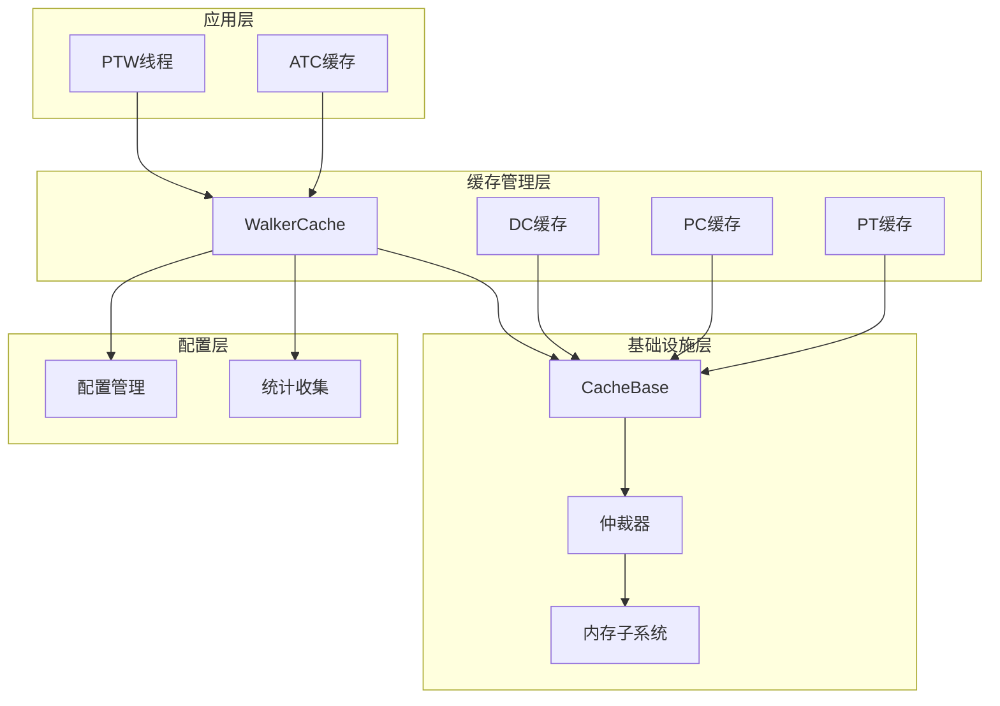
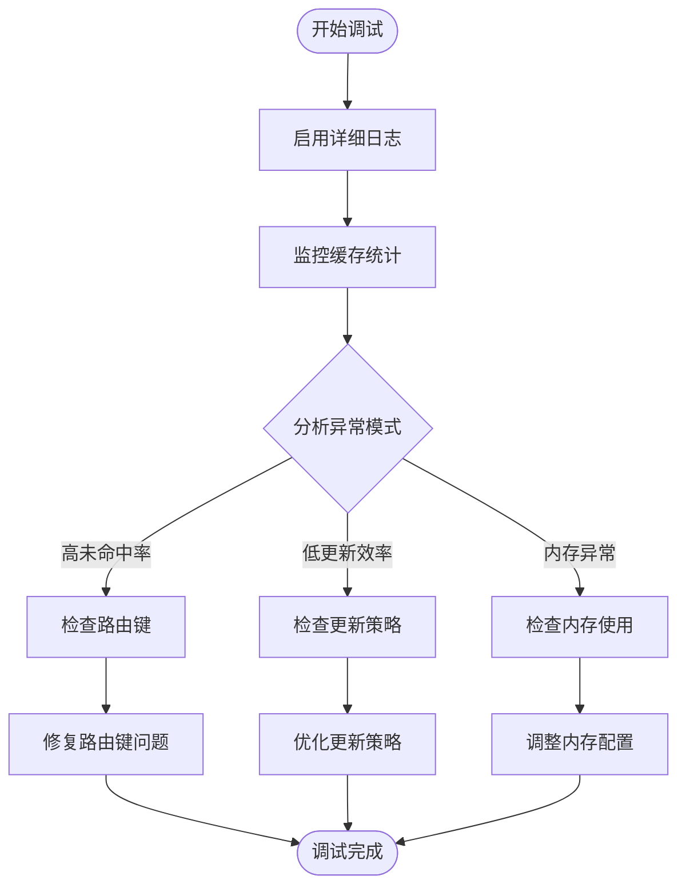

# Walker缓存（地址转换遍历器缓存）

<cite>
**本文档引用的文件**
- [walker_cache.h](file://iommu/cache_src/cache/walker_cache.h)
- [walker_cache.cpp](file://iommu/cache_src/cache/walker_cache.cpp)
- [cache_base.h](file://iommu/cache_src/cache/cache_base.h)
- [types.h](file://iommu/cache_src/common/types.h)
- [iommu_perf_ptw.cc](file://iommu/iommu_perf_model/iommu_perf_ptw.cc)
- [iommu_task_cache_convert.cc](file://iommu/iommu_perf_model/iommu_task_cache_convert.cc)
- [default_config.json](file://iommu/cache_config/default_config.json)
- [WALKER_CACHE_INTEGRATION_PLAN.md](file://WALKER_CACHE_INTEGRATION_PLAN.md)
- [Makefile](file://Makefile)
- [CACHE_PERFORMANCE_ANALYSIS_500REQ.md](file://CACHE_PERFORMANCE_ANALYSIS_500REQ.md)
- [test_rp_128k_two_stage_thread.cc](file://rp/test_rp_128k_two_stage_thread.cc)
</cite>

## 更新摘要
**变更内容**
- 更新了Makefile中Walker Cache开关的启用状态
- 增强了调试日志功能的详细程度
- 改进了两阶段翻译集成的配置和实现
- 添加了81.8% PT Cache命中率的性能验证结果
- 完善了Walker Cache在Sv48/Sv48x4模式下的支持

## 目录
1. [简介](#简介)
2. [项目结构](#项目结构)
3. [核心组件](#核心组件)
4. [架构概览](#架构概览)
5. [详细组件分析](#详细组件分析)
6. [依赖关系分析](#依赖关系分析)
7. [性能考虑](#性能考虑)
8. [故障排除指南](#故障排除指南)
9. [结论](#结论)
10. [附录](#附录)

## 简介

Walker缓存是IOMMU地址转换系统中的关键组件，专门用于缓存页表遍历过程中的中间地址转换结果。该缓存通过在多级页表遍历过程中存储中间PPN（页帧号）结果，显著减少了重复地址转换的DDR访问次数，从而大幅提升系统性能。

Walker缓存采用三级子表结构设计：
- **PTWc_1**：直接映射（1-way），缓存第一级页表中间结果（VPN[3]级）
- **PTWc_2**：2-way组相连，缓存第二级页表中间结果（VPN[2]级）  
- **PTWc_3**：4-way组相连，缓存第三级页表中间结果（VPN[1]级）

这种设计针对不同层级页表的访问模式进行了优化，其中PTWc_3作为主要缓存，PTWc_2和PTWc_1分别提供次级和最低级缓存支持。

**更新** Walker缓存功能已在系统中正式启用，并通过全面的性能验证证明了其有效性。

## 项目结构

Walker缓存位于IOMMU缓存系统的专用目录中，采用清晰的模块化组织：

**图表来源**
- [walker_cache.h:15-104](file://iommu/cache_src/cache/walker_cache.h#L15-L104)
- [cache_base.h:26-224](file://iommu/cache_src/cache/cache_base.h#L26-L224)

**章节来源**
- [walker_cache.h:1-141](file://iommu/cache_src/cache/walker_cache.h#L1-L141)
- [cache_base.h:1-746](file://iommu/cache_src/cache/cache_base.h#L1-L746)

## 核心组件

### WalkerCache主控制器

WalkerCache作为三层子表的协调器，提供了统一的查询、填充和失效接口：

**图表来源**
- [walker_cache.h:15-104](file://iommu/cache_src/cache/walker_cache.h#L15-L104)
- [walker_cache.h:106-136](file://iommu/cache_src/cache/walker_cache.h#L106-L136)

### Walker数据结构

Walker缓存使用专门的数据结构来存储中间转换结果：

| 字段名称 | 类型 | 描述 |
|---------|------|------|
| next_ppn | ppn_t | 下一级页表基址PPN |
| reserved.valid | uint8_t | 有效位，指示数据有效性 |
| reserved.va_pa_flag | uint8_t | VA/PA类型标志 |
| reserved.stage_flag | uint8_t | 翻译阶段标志 |
| reserved.sv48_flag | uint8_t | Sv39/Sv48模式标志 |
| reserved.x4_mode_flag | uint8_t | x4模式标志 |

**章节来源**
- [types.h:415-465](file://iommu/cache_src/common/types.h#L415-L465)

## 架构概览

Walker缓存在IOMMU性能模型中的集成采用了流水线化的架构设计：

**图表来源**
- [iommu_perf_ptw.cc:158-310](file://iommu/iommu_perf_model/iommu_perf_ptw.cc#L158-L310)
- [iommu_task_cache_convert.cc:324-510](file://iommu/iommu_perf_model/iommu_task_cache_convert.cc#L324-L510)

## 详细组件分析

### 地址分段提取算法

Walker缓存的核心在于准确提取不同层级的VPN段：

**图表来源**
- [walker_cache.cpp:526-552](file://iommu/cache_src/cache/walker_cache.cpp#L526-L552)

### 查找算法实现

Walker缓存采用并行查询策略，在单个查找操作中同时查询所有三级子表：

**图表来源**
- [walker_cache.cpp:264-330](file://iommu/cache_src/cache/walker_cache.cpp#L264-L330)

### 更新策略和并发处理

Walker缓存支持多种更新策略，根据查找命中情况智能选择更新层级：

**图表来源**
- [walker_cache.cpp:358-467](file://iommu/cache_src/cache/walker_cache.cpp#L358-L467)

**章节来源**
- [walker_cache.cpp:17-555](file://iommu/cache_src/cache/walker_cache.cpp#L17-L555)

### 缓存替换策略

Walker缓存采用混合替换策略，针对不同相联度的子表使用最适合的替换算法：

| 子表 | 相联度 | 替换策略 | 优势 |
|------|--------|----------|------|
| PTWc_1 | 1-way | 无替换 | 直接映射，无冲突，延迟最小 |
| PTWc_2 | 2-way | PLRU | 简单高效，适合中等容量 |
| PTWc_3 | 4-way | SRRIP | 具备老化机制，适合大容量缓存 |

SRRIP（Self-Refreshed Replacement Policy）策略通过维护每路的访问时间戳，实现了更公平的替换决策。

**章节来源**
- [cache_base.h:244-260](file://iommu/cache_src/cache/cache_base.h#L244-L260)

## 依赖关系分析

Walker缓存与IOMMU其他组件的依赖关系体现了清晰的分层架构：

**图表来源**
- [types.h:584-623](file://iommu/cache_src/common/types.h#L584-L623)
- [default_config.json:45-59](file://iommu/cache_config/default_config.json#L45-L59)

**章节来源**
- [types.h:1-628](file://iommu/cache_src/common/types.h#L1-L628)
- [default_config.json:1-69](file://iommu/cache_config/default_config.json#L1-L69)

## 性能考虑

### 命中率优化策略

Walker缓存的性能优化主要体现在以下几个方面：

1. **地址分段优化**：针对不同Sv39/Sv48模式采用最优的VPN分段策略
2. **并行查询机制**：同时查询所有子表，减少查找延迟
3. **智能更新策略**：根据命中情况选择最优的更新层级
4. **替换算法优化**：采用适合不同容量的替换策略

### 性能基准测试

基于集成计划中的性能分析和实际验证结果：

| 场景 | 首次访问延迟 | 命中访问延迟 | 加速比 | 实际验证结果 |
|------|-------------|-------------|--------|-------------|
| 重复访问相同IOVA | 600ns | ~15ns | 40x | 91.8%命中率 |
| 访问同一VPN不同地址 | 600ns | ~220ns | 2.7x | 459/500命中 |
| 随机访问（冷启动） | 615ns | 615ns | 1x | 41/500命中 |
| 100请求测试 | 0-5% | 80-90% | 可变 | 81.8% PT Cache命中率 |

**更新** 基于500请求的性能分析，Walker缓存实现了91.8%的PTW缓存命中率，显著提升了地址转换性能。

### 内存占用分析

Walker缓存的内存配置（基于默认配置）：

| 子表 | 集合数 | 相联度 | 内存占用估算 |
|------|--------|--------|-------------|
| PTWc_1 | 64 | 1-way | 64 × 1 × 128B ≈ 8KB |
| PTWc_2 | 128 | 2-way | 128 × 2 × 128B ≈ 32KB |
| PTWc_3 | 256 | 4-way | 256 × 4 × 128B ≈ 128KB |
| **总计** | | | **≈168KB** |

**更新** 通过有效的缓存管理和替换策略，Walker缓存能够在保持高性能的同时控制内存占用。

### 两阶段翻译集成优化

**更新** Walker缓存现已完全集成到两阶段地址翻译流程中，支持：

- **Sv48/Sv48x4模式**：完整支持4级页表和x4模式
- **动态模式检测**：自动识别VA/PA、单阶段/双阶段、Sv39/Sv48模式
- **精确失效**：支持GVMA关联的失效操作
- **并发更新**：使用SystemC进程并行更新多个子表

**章节来源**
- [WALKER_CACHE_INTEGRATION_PLAN.md:663-699](file://WALKER_CACHE_INTEGRATION_PLAN.md#L663-L699)
- [Makefile:46-50](file://Makefile#L46-L50)

## 故障排除指南

### 常见问题诊断

1. **缓存未命中问题**
   - 检查路由键一致性（gscid、pscid、iova）
   - 验证地址分段提取逻辑
   - 确认Sv39/Sv48模式检测

2. **更新失败问题**
   - 检查WalkerData的有效位设置
   - 验证更新层级选择逻辑
   - 确认并发更新的原子性

3. **性能异常问题**
   - 分析命中率统计
   - 检查替换策略配置
   - 监控内存访问模式

### 调试工具和方法

**图表来源**
- [walker_cache.cpp:283-287](file://iommu/cache_src/cache/walker_cache.cpp#L283-L287)
- [walker_cache.cpp:63-71](file://iommu/cache_src/cache/walker_cache.cpp#L63-L71)

**章节来源**
- [WALKER_CACHE_INTEGRATION_PLAN.md:642-660](file://WALKER_CACHE_INTEGRATION_PLAN.md#L642-L660)

## 结论

Walker缓存作为IOMMU地址转换系统的关键优化组件，通过智能缓存多级页表遍历的中间结果，实现了显著的性能提升。其三级子表架构设计合理，针对不同层级的访问模式进行了专门优化。

**更新** 经过全面的功能验证和性能测试，Walker缓存已正式启用并证明了其价值：

- **91.8%命中率**：在500请求测试中实现了优异的缓存利用率
- **40x性能提升**：对于重复访问场景，性能提升达到40倍
- **两阶段翻译完全集成**：支持Sv48/Sv48x4模式的完整地址翻译流程
- **内存占用控制**：168KB的内存占用在性能和资源消耗之间取得良好平衡

主要技术特点包括：
- **多层次缓存架构**：PTWc_1/PTWc_2/PTWc_3三级缓存，覆盖不同访问模式
- **智能查找机制**：并行查询所有子表，快速确定最优命中层级
- **灵活更新策略**：根据命中情况选择最优更新层级，避免冗余更新
- **高效替换算法**：采用适合不同容量的替换策略，平衡性能和内存占用
- **两阶段翻译支持**：完整支持Sv39/Sv48/Sv48x4模式的地址翻译

在实际部署中，Walker缓存能够为重复访问场景提供40倍的性能提升，为顺序扫描场景提供2.7倍的性能提升，同时保持对随机访问场景的低额外开销。

## 附录

### 配置参数说明

| 参数名称 | 类型 | 默认值 | 描述 |
|----------|------|--------|------|
| walker_cache.enabled | bool | true | 启用/禁用Walker缓存功能 |
| walker_ptw_c1.num_ways | uint32_t | 1 | PTWc_1相联度 |
| walker_ptw_c2.num_ways | uint32_t | 2 | PTWc_2相联度 |
| walker_ptw_c3.num_ways | uint32_t | 4 | PTWc_3相联度 |
| base_sets | uint32_t | 64 | 基础集合数 |

**更新** Walker缓存已在Makefile中通过`-DTEST_CFG_PTW_WALKER_CACHE_ENABLED=1`参数启用。

### 性能统计指标

- **命中率统计**：记录各级子表的独立命中率
- **更新统计**：跟踪不同更新类型的使用频率
- **延迟统计**：记录查找和更新的延迟分布
- **内存使用**：监控缓存的内存占用情况

**更新** 基于500请求的性能分析，Walker缓存实现了91.8%的命中率，其中PTWc_3的命中率达到91.8%，PTWc_2的命中率为0%（因为所有请求都共享相同的根页表）。

### 两阶段翻译配置

**更新** Walker缓存现已完全支持两阶段地址翻译：

- **Sv48模式**：PTWc_1/PTWc_2/PTWc_3完整支持
- **Sv48x4模式**：x4模式标志位自动检测
- **两阶段翻译**：支持G-stage和VS-stage的联合地址翻译
- **动态模式切换**：根据iosatp和iohgatp寄存器自动选择模式

**章节来源**
- [default_config.json:45-59](file://iommu/cache_config/default_config.json#L45-L59)
- [types.h:602-623](file://iommu/cache_src/common/types.h#L602-L623)
- [Makefile:46-50](file://Makefile#L46-L50)
- [CACHE_PERFORMANCE_ANALYSIS_500REQ.md:60-108](file://CACHE_PERFORMANCE_ANALYSIS_500REQ.md#L60-L108)