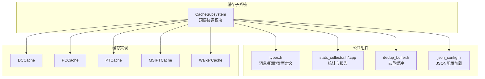
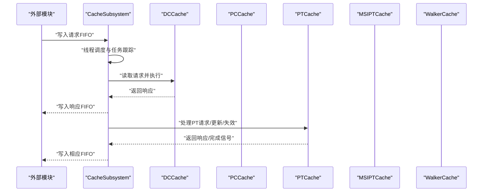
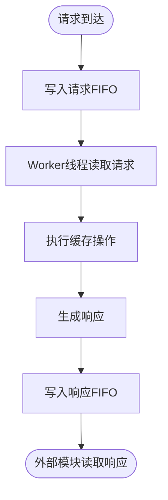
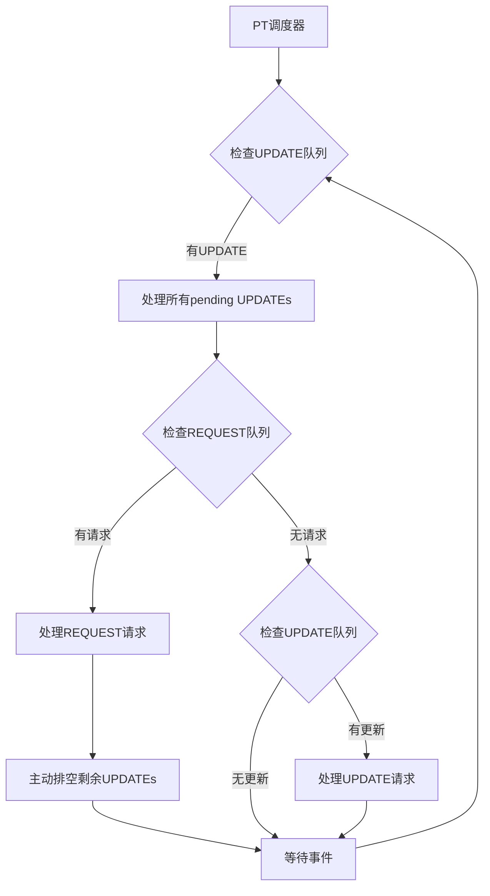
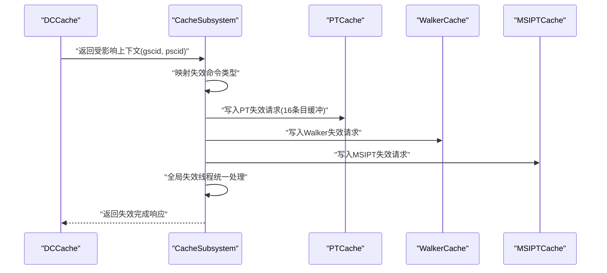
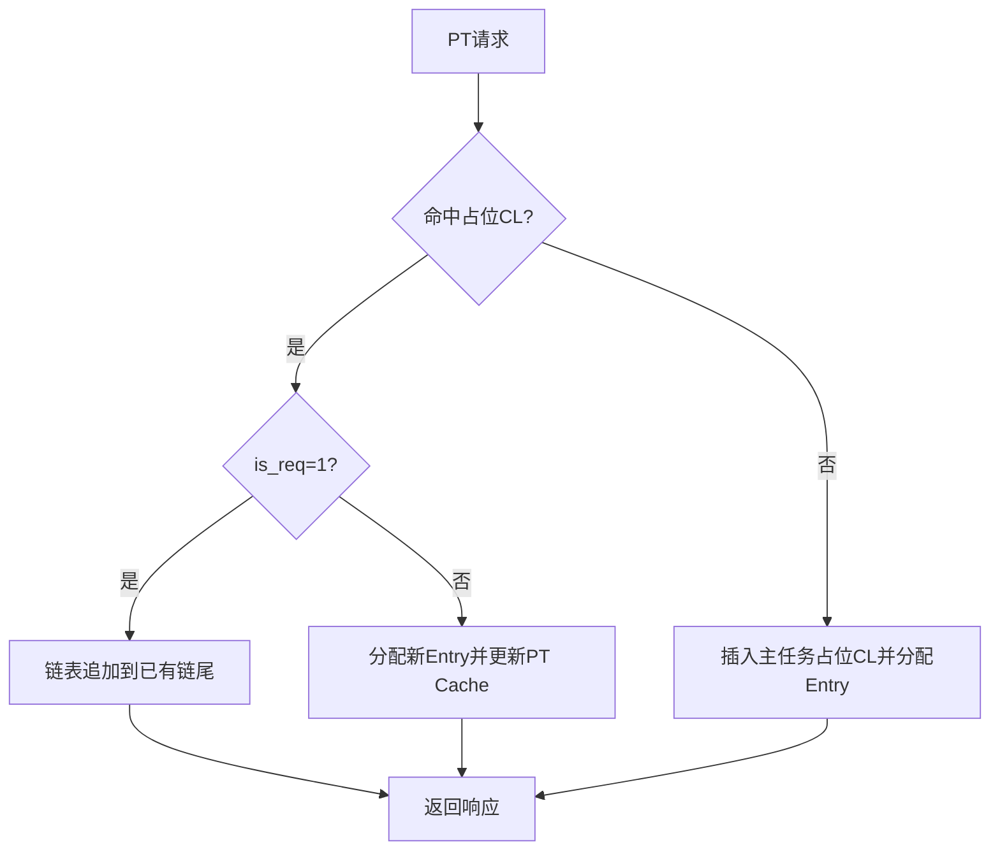
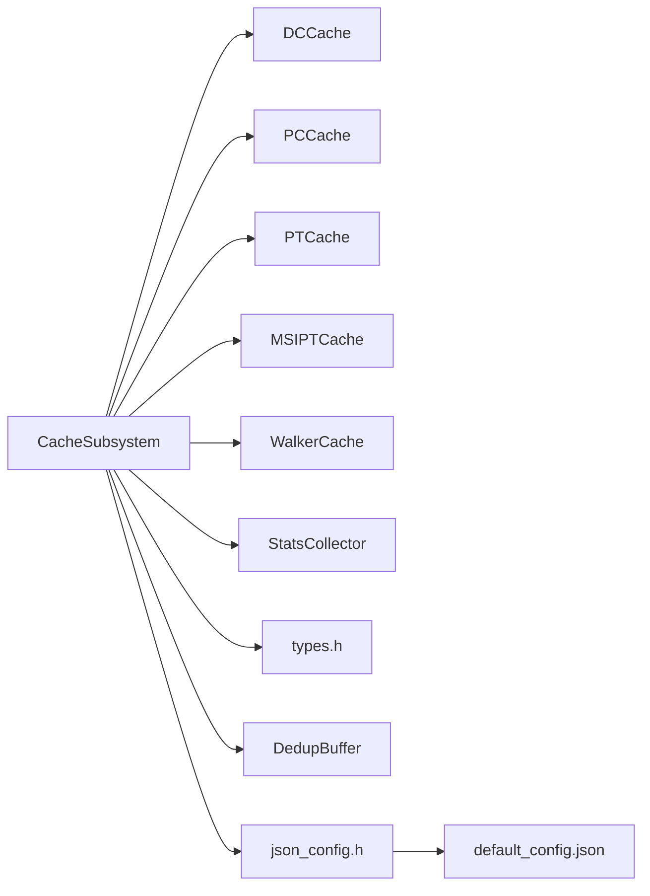

# 缓存子系统概览

<cite>
**本文档引用的文件**
- [cache_subsystem.h](file://iommu/cache_src/subsystem/cache_subsystem.h)
- [cache_subsystem.cpp](file://iommu/cache_src/subsystem/cache_subsystem.cpp)
- [types.h](file://iommu/cache_src/common/types.h)
- [stats_collector.h](file://iommu/cache_src/common/stats_collector.h)
- [stats_collector.cpp](file://iommu/cache_src/common/stats_collector.cpp)
- [cache_base.h](file://iommu/cache_src/cache/cache_base.h)
- [dc_cache.h](file://iommu/cache_src/cache/dc_cache.h)
- [pc_cache.h](file://iommu/cache_src/cache/pc_cache.h)
- [pt_cache.h](file://iommu/cache_src/cache/pt_cache.h)
- [msipt_cache.h](file://iommu/cache_src/cache/msipt_cache.h)
- [walker_cache.h](file://iommu/cache_src/cache/walker_cache.h)
- [dedup_buffer.h](file://iommu/cache_src/common/dedup_buffer.h)
- [default_config.json](file://iommu/cache_config/default_config.json)
- [json_config.h](file://iommu/cache_src/common/json_config.h)
</cite>

## 更新摘要
**变更内容**   
- **重大性能优化**：PT Cache失效FIFO缓冲区大小从1增加到16条目，显著提升高并发场景下的系统稳定性
- PT请求和响应路径的invalidate FIFO缓冲区均扩容至16条目，有效缓解背压问题
- 增强了级联失效处理机制，支持更高吞吐量的缓存失效操作
- 配合两阶段UPDATE优先策略，进一步优化了整体调度性能

## 目录
1. [简介](#简介)
2. [项目结构](#项目结构)
3. [核心组件](#核心组件)
4. [架构总览](#架构总览)
5. [详细组件分析](#详细组件分析)
6. [依赖关系分析](#依赖关系分析)
7. [性能考量](#性能考量)
8. [故障排查指南](#故障排查指南)
9. [结论](#结论)
10. [附录](#附录)

## 简介
本文件面向IOMMU缓存子系统，围绕CacheSubsystem顶层模块进行系统化技术文档整理。重点阐述以下方面：
- CacheSubsystem的设计理念与架构职责：统一管理五个独立缓存模块（DC、PC、PT、MSIPT、Walker），协调请求/更新/失效三类操作的流水线。
- 初始化流程、配置参数传递与生命周期管理：从JSON配置加载到各子模块实例化、统计收集器初始化、SystemC进程启动与任务跟踪。
- FIFO接口体系：请求入口、响应出口、更新/失效通道的数据流向与背压策略。
- 级联失效机制：DC/PC失效如何触发PT/Walker/MSIPT的级联失效，并通过全局失效管道统一处理。
- 性能监控与统计：延迟直方图、阶段化统计、任务跟踪、PT Cache调度间隙分析等。

**最新更新**：PT Cache失效FIFO缓冲区经过重大性能优化，从单条目扩展到16条目，显著提升了高并发场景下的系统稳定性和吞吐量。

## 项目结构
缓存子系统位于iommu/cache_src目录，采用"子系统 + 公共组件 + 各缓存实现"的分层组织：
- subsystem：顶层模块CacheSubsystem及其线程化工作流
- common：公共类型、统计收集器、去重缓冲、JSON配置加载
- cache：各缓存实现（DC、PC、PT、MSIPT、Walker）
- replacement：替换策略（PLRU、SRRIP）

**图表来源**
- [cache_subsystem.h:19-184](file://iommu/cache_src/subsystem/cache_subsystem.h#L19-L184)
- [types.h:580-623](file://iommu/cache_src/common/types.h#L580-L623)
- [stats_collector.h:107-191](file://iommu/cache_src/common/stats_collector.h#L107-L191)
- [dedup_buffer.h:61-126](file://iommu/cache_src/common/dedup_buffer.h#L61-L126)

**章节来源**
- [cache_subsystem.h:19-184](file://iommu/cache_src/subsystem/cache_subsystem.h#L19-L184)
- [default_config.json:1-69](file://iommu/cache_config/default_config.json#L1-L69)

## 核心组件
- CacheSubsystem：顶层模块，负责：
  - 统一管理五个缓存子模块实例
  - 提供独立的请求/更新/失效FIFO接口
  - 维护全局失效管道与级联失效协调
  - 驱动统计收集器与任务跟踪
  - 管理PT Cache去重缓冲与预取接口
- 各缓存子模块：DC、PC、PT、MSIPT、Walker，均继承自CacheBase模板基类，提供lookup/fill/invalidate等统一接口。
- 统计收集器StatsCollector：记录命中/缺失/替换/失效、延迟直方图、阶段化统计、任务跟踪等。
- 去重缓冲DedupBuffer：管理PT Cache占位缓存行对应的链表，支持分配/挂接/释放与峰值统计。

**章节来源**
- [cache_subsystem.h:19-184](file://iommu/cache_src/subsystem/cache_subsystem.h#L19-L184)
- [cache_base.h:26-224](file://iommu/cache_src/cache/cache_base.h#L26-L224)
- [stats_collector.h:13-191](file://iommu/cache_src/common/stats_collector.h#L13-L191)
- [dedup_buffer.h:61-126](file://iommu/cache_src/common/dedup_buffer.h#L61-L126)

## 架构总览
CacheSubsystem通过SystemC进程模型驱动各缓存模块的请求处理，采用"请求FIFO + 响应FIFO + 更新/失效FIFO"的解耦设计，避免单一深度为1的FIFO造成串行瓶颈。顶层模块还维护全局失效管道，集中处理级联失效请求。

**图表来源**
- [cache_subsystem.cpp:287-310](file://iommu/cache_src/subsystem/cache_subsystem.cpp#L287-L310)
- [cache_subsystem.cpp:611-623](file://iommu/cache_src/subsystem/cache_subsystem.cpp#L611-L623)
- [cache_subsystem.cpp:625-635](file://iommu/cache_src/subsystem/cache_subsystem.cpp#L625-L635)

## 详细组件分析

### CacheSubsystem顶层模块
- 设计理念
  - 以SystemC进程为中心，每个缓存类型拥有独立的请求/更新/失效线程，避免共享FIFO带来的串行化。
  - PT与Walker引入统一轮询调度线程，减少互锁死锁风险，提升资源利用率。
  - 全局失效管道集中处理级联失效，保证一致性与时序可控。
- 关键接口
  - 请求FIFO：dc_request_fifo(16)、pc_request_fifo(16)、pt_request_fifo(16)、walker_request_fifo(1)、msi_request_fifo(1)
  - 响应FIFO：dc_response_fifo(16)、pc_response_fifo(16)、pt_hit_response_fifo(16)、pt_miss_response_fifo(16)、walker_response_fifo(1)、msi_response_fifo(1)
  - 更新FIFO：dc_update_fifo(1)、pc_update_fifo(1)、pt_update_fifo(16)、walker_update_fifo(1)、msi_update_fifo(1)
  - 失效FIFO：dc_invalidate_fifo(1)、pc_invalidate_fifo(1)、pt_invalidate_fifo(16)、walker_invalidate_fifo(1)、msi_invalidate_fifo(1)
  - 失效响应FIFO：dc_invalidate_response_fifo(1)、pc_invalidate_response_fifo(1)、pt_invalidate_response_fifo(16)、walker_invalidate_response_fifo(1)、msi_invalidate_response_fifo(1)
  - 全局失效：invalidation_request_fifo(1)、invalidation_response_fifo(1)
- 生命周期与初始化
  - 从GlobalConfig加载时钟周期、统计配置与各缓存配置
  - 实例化各子模块并设置时钟周期
  - 启动所有工作线程与失效线程
  - 初始化统计收集器（直方图宽度、是否启用、输出文件）
- 任务跟踪与统计
  - 支持开启/关闭任务跟踪，按级别输出请求/响应/失效事件
  - 记录各缓存的执行延迟、排队延迟、请求窗口等
  - PT Cache新增调度间隙分析与区间命中率统计

**重大更新** PT Cache失效FIFO缓冲区经过重大性能优化，pt_invalidate_fifo和pt_invalidate_response_fifo缓冲区大小从1增加到16条目，显著提升了高并发场景下的系统稳定性。

**章节来源**
- [cache_subsystem.h:19-184](file://iommu/cache_src/subsystem/cache_subsystem.h#L19-L184)
- [cache_subsystem.cpp:102-175](file://iommu/cache_src/subsystem/cache_subsystem.cpp#L102-L175)
- [cache_subsystem.cpp:212-285](file://iommu/cache_src/subsystem/cache_subsystem.cpp#L212-L285)
- [cache_subsystem.cpp:416-457](file://iommu/cache_src/subsystem/cache_subsystem.cpp#L416-L457)

### FIFO接口与数据流
- 请求入口
  - 外部模块将请求写入对应缓存的请求FIFO
  - CacheSubsystem的对应worker线程读取并执行，记录任务起止时间，调用子模块的lookup/update/invalidate接口
- 响应出口
  - 各缓存独立返回响应，避免共用FIFO导致串行化
  - PT Cache区分命中/未命中两类响应出口，便于上层分流处理
- 更新/失效通道
  - 更新与失效分别有独立FIFO，确保不同操作类型不会互相阻塞
  - Walker Cache采用统一轮询调度，按lookup→update→invalidate顺序处理，避免死锁

**重大更新** PT Cache失效FIFO缓冲区经过重大性能优化：
- pt_invalidate_fifo缓冲区大小从1增加到16条目
- pt_invalidate_response_fifo缓冲区大小从1增加到16条目
- 有效缓解高负载下的背压问题，提升系统吞吐量

**图表来源**
- [cache_subsystem.cpp:287-296](file://iommu/cache_src/subsystem/cache_subsystem.cpp#L287-L296)
- [cache_subsystem.cpp:311-414](file://iommu/cache_src/subsystem/cache_subsystem.cpp#L311-L414)

**章节来源**
- [cache_subsystem.h:34-66](file://iommu/cache_src/subsystem/cache_subsystem.h#L34-L66)
- [cache_subsystem.cpp:287-310](file://iommu/cache_src/subsystem/cache_subsystem.cpp#L287-L310)

### PT Cache增强调度器（重大更新）
**重大更新** PT Cache调度器经过重大性能优化，实现了智能的两阶段优先级调度和主动排空机制：

#### 两阶段UPDATE优先策略
- **第一阶段：预处理UPDATE队列**
  - 在处理任何REQUEST之前，先检查并处理pt_update_fifo中的所有pending UPDATE操作
  - 确保PT Cache状态保持最新，避免task命中旧的placeholder后被挂起无法唤醒
  - 修复了场景4(4KB随机+二阶段)中task 6408超时失败的时序问题

- **第二阶段：REQUEST处理后的UPDATE清理**
  - 每处理完一个REQUEST后，立即检查并排空pt_update_fifo中的剩余UPDATEs
  - 防止pt_update_fifo堆积导致Monitor/PTW线程阻塞
  - 通过while循环批量处理UPDATE，提高批处理能力

#### 增强的缓冲区管理
- pt_update_fifo缓冲区大小从1增加到16条目
- **新增**：pt_invalidate_fifo和pt_invalidate_response_fifo缓冲区大小从1增加到16条目
- 有效缓解高负载下的背压问题
- 减少线程间等待和死锁风险

#### 任务间隔分析
- 实时计算任务间隔(gap)，统计空闲时间和执行时间比例
- 提供详细的调度性能分析报告
- 支持区间命中率统计(每1000笔REQUEST)

**图表来源**
- [cache_subsystem.cpp:314-445](file://iommu/cache_src/subsystem/cache_subsystem.cpp#L314-L445)
- [cache_subsystem.cpp:448-488](file://iommu/cache_src/subsystem/cache_subsystem.cpp#L448-L488)

**章节来源**
- [cache_subsystem.cpp:314-445](file://iommu/cache_src/subsystem/cache_subsystem.cpp#L314-L445)
- [cache_subsystem.cpp:448-488](file://iommu/cache_src/subsystem/cache_subsystem.cpp#L448-L488)

### 级联失效机制
- 触发条件
  - DC/PC缓存的精确/扫描失效完成后，返回受影响的上下文（如gscid/pscid）
  - CacheSubsystem根据命令类型映射到对应缓存的失效类型
- 处理流程
  - 将PT/Walker/MSIPT的失效请求写入对应失效FIFO
  - 全局失效线程统一消费失效请求，执行相应的invalidate操作
  - 记录受影响条目数与处理延迟，写回失效响应FIFO

**重大更新** 级联失效机制经过性能优化，PT失效FIFO缓冲区扩容至16条目，支持更高并发度的级联失效操作。

**图表来源**
- [cache_subsystem.cpp:12-21](file://iommu/cache_src/subsystem/cache_subsystem.cpp#L12-L21)
- [cache_subsystem.cpp:199-210](file://iommu/cache_src/subsystem/cache_subsystem.cpp#L199-L210)

**章节来源**
- [cache_subsystem.cpp:12-21](file://iommu/cache_src/subsystem/cache_subsystem.cpp#L12-L21)
- [cache_subsystem.cpp:199-210](file://iommu/cache_src/subsystem/cache_subsystem.cpp#L199-L210)

### PT Cache去重与预取（V3.0）
- 占位缓存行（Placeholder CL）
  - 在PT Cache中插入占位CL，携带Buffer链表头索引与主任务/预取标识
  - 保护主任务占位CL（is_req=1）不被替换，确保关键路径的稳定性
- Dedup Buffer
  - 管理等待PTW完成的任务链表，支持顺序分配、链表挂接与释放
  - 提供峰值有效Entry统计与反压事件通知
- 执行流程
  - PT请求命中占位CL：根据is_req分支处理，为主任务分配Buffer Entry并更新PT Cache
  - PT请求MISS：自动插入主任务占位CL并分配Buffer Entry
  - 批量更新：支持批量将占位CL更新为常规CL，减少后续PTW压力

**更新** 预取占位符处理逻辑得到改进，增强了边界检查和冲突检测机制。

**图表来源**
- [cache_subsystem.cpp:638-800](file://iommu/cache_src/subsystem/cache_subsystem.cpp#L638-L800)
- [dedup_buffer.h:61-126](file://iommu/cache_src/common/dedup_buffer.h#L61-L126)

**章节来源**
- [pt_cache.h:48-72](file://iommu/cache_src/cache/pt_cache.h#L48-L72)
- [cache_subsystem.cpp:638-800](file://iommu/cache_src/subsystem/cache_subsystem.cpp#L638-L800)
- [dedup_buffer.h:61-126](file://iommu/cache_src/common/dedup_buffer.h#L61-L126)

### 统计收集与性能监控
- 统计维度
  - 基础指标：总访问、命中、缺失、替换、失效、预取发出/命中
  - 阶段化统计：REQUEST/UPDATE/PTW Monitor三阶段的lookup/fill分类
  - 时间戳统计：PT Cache阶段入口/出口时间戳，用于任务放大系数计算
  - 区间命中率：每1000笔REQUEST的命中/缺失统计
- 报告与直方图
  - 支持延迟直方图与排队延迟直方图
  - 可配置直方图bin宽度与输出文件
  - 支持统一报告输出，包含摘要与可选直方图

**更新** 新增了PT调度器任务间隔分析功能，提供详细的性能洞察和优化指导。

**章节来源**
- [stats_collector.h:13-191](file://iommu/cache_src/common/stats_collector.h#L13-L191)
- [stats_collector.cpp:13-200](file://iommu/cache_src/common/stats_collector.cpp#L13-L200)

## 依赖关系分析
- CacheSubsystem依赖
  - 各缓存子模块：DCCache、PCCache、PTCache、MSIPTCache、WalkerCache
  - 统计收集器：StatsCollector
  - 公共类型与消息：types.h
  - 去重缓冲：dedup_buffer.h
  - JSON配置：json_config.h + default_config.json
- 内部依赖
  - CacheBase模板基类提供统一的lookup/fill/invalidate实现与仲裁逻辑
  - 各缓存子模块通过继承实现特定的散列函数与业务接口

**图表来源**
- [cache_subsystem.h:9-13](file://iommu/cache_src/subsystem/cache_subsystem.h#L9-L13)
- [json_config.h:9-13](file://iommu/cache_src/common/json_config.h#L9-L13)
- [default_config.json:1-69](file://iommu/cache_config/default_config.json#L1-L69)

**章节来源**
- [cache_subsystem.h:9-13](file://iommu/cache_src/subsystem/cache_subsystem.h#L9-L13)
- [cache_base.h:26-224](file://iommu/cache_src/cache/cache_base.h#L26-L224)

## 性能考量
- RAM端口仲裁
  - CacheBase实现基于WRR的仲裁，平衡lookup/fill/invalidate三类操作的端口占用
  - 支持阶段化排队等待时间统计，便于分析瓶颈
- PT Cache调度优化
  - **两阶段UPDATE优先策略**：在处理REQUEST前先处理所有pending UPDATE，确保PT Cache状态最新
  - **主动排空机制**：处理完REQUEST后立即排空UPDATE队列，防止积压导致的阻塞
  - **增大的缓冲区**：pt_update_fifo从1增加到16条目，pt_invalidate_fifo和pt_invalidate_response_fifo从1增加到16条目，显著提升吞吐量
  - **任务间隔分析**：实时统计gap、最大gap、空闲比例等关键指标
  - **区间命中率统计**：帮助评估预取效果
- 去重缓冲反压
  - Buffer满时阻塞等待free_event，避免降级策略导致的性能波动
  - 提供峰值有效Entry统计，辅助容量规划

**重大更新** PT Cache失效FIFO缓冲区经过重大性能优化，从单条目扩展到16条目，显著减少了线程竞争，提高了整体吞吐量和响应性，解决了根本性的调度时序问题。这些优化从根本上改善了高并发场景下的稳定性，为复杂翻译任务提供了更好的支持。

**章节来源**
- [cache_base.h:626-741](file://iommu/cache_src/cache/cache_base.h#L626-741)
- [cache_subsystem.cpp:314-414](file://iommu/cache_src/subsystem/cache_subsystem.cpp#L314-L414)
- [stats_collector.cpp:191-200](file://iommu/cache_src/common/stats_collector.cpp#L191-L200)
- [dedup_buffer.h:61-126](file://iommu/cache_src/common/dedup_buffer.h#L61-L126)

## 故障排查指南
- 任务跟踪
  - 通过设置task_trace_level开启详细/基本任务跟踪，定位卡顿与异常
  - 统一日志输出文件，包含请求类型、设备/进程ID、gscid/pscid、IOVA、命中/影响条目、执行/总延迟等
- 失效异常
  - 检查全局失效管道是否有积压，确认无效化命令类型映射是否正确
  - 核对DC/PC失效返回的上下文列表是否为空
- PT Cache去重
  - 观察占位CL插入失败与fallback行为，检查Buffer是否频繁满
  - 关注is_req=1占位CL保护策略，避免替换算法建议的victim被保护导致插入失败
- **PT调度器诊断（新增）**
  - 使用print_pt_scheduler_gap_report()分析调度间隙和性能瓶颈
  - 检查pt_update_fifo是否经常达到16条目的上限
  - **新增**：检查pt_invalidate_fifo和pt_invalidate_response_fifo是否经常达到16条目的上限
  - 监控REQUEST和UPDATE的处理比例，确保两阶段优先级机制正常工作
  - 关注任务间隔(gap)统计，识别调度层面的性能问题

**更新** 新增了PT失效FIFO相关的故障排查方法，帮助识别失效处理层面的性能问题和背压情况。

**章节来源**
- [cache_subsystem.cpp:223-285](file://iommu/cache_src/subsystem/cache_subsystem.cpp#L223-L285)
- [cache_subsystem.cpp:12-21](file://iommu/cache_src/subsystem/cache_subsystem.cpp#L12-L21)
- [cache_subsystem.cpp:638-800](file://iommu/cache_src/subsystem/cache_subsystem.cpp#L638-800)
- [cache_subsystem.cpp:448-488](file://iommu/cache_src/subsystem/cache_subsystem.cpp#L448-L488)

## 结论
CacheSubsystem通过清晰的模块划分、解耦的FIFO接口、统一轮询调度与全局失效管道，实现了对多类型缓存的一致管理与高效协作。结合完善的统计收集与任务跟踪，能够有效支撑IOMMU缓存子系统的性能优化与问题定位。PT Cache去重与预取机制进一步提升了缓存命中率与整体吞吐，配合去重缓冲的反压策略，确保系统在高负载下的稳定性。

**重大优化成果**：通过实现两阶段UPDATE优先策略、主动排空机制和扩大的缓冲区大小，特别是PT失效FIFO缓冲区从1增加到16条目的重大性能优化，系统显著减少了线程竞争和调度延迟，解决了关键时序问题。这些优化从根本上改善了高并发场景下的稳定性，为复杂翻译任务提供了更好的支持。

## 附录
- 配置文件示例
  - default_config.json展示了各缓存的组相联参数、替换策略、统计配置等
- 关键类型与消息
  - types.h定义了CacheMessage、InvalidCmdType、CacheInvalidateMode等核心类型
- 统一报告
  - StatsCollector提供统一报告接口，包含摘要与可选直方图

**章节来源**
- [default_config.json:1-69](file://iommu/cache_config/default_config.json#L1-L69)
- [types.h:78-146](file://iommu/cache_src/common/types.h#L78-L146)
- [stats_collector.h:170-174](file://iommu/cache_src/common/stats_collector.h#L170-L174)