# 缓存子系统概览

<cite>
**本文引用的文件**
- [cache_subsystem.h](file://iommu/cache_src/subsystem/cache_subsystem.h)
- [cache_subsystem.cpp](file://iommu/cache_src/subsystem/cache_subsystem.cpp)
- [walker_cache.h](file://iommu/cache_src/cache/walker_cache.h)
- [walker_cache.cpp](file://iommu/cache_src/cache/walker_cache.cpp)
- [types.h](file://iommu/cache_src/common/types.h)
- [stats_collector.h](file://iommu/cache_src/common/stats_collector.h)
- [stats_collector.cpp](file://iommu/cache_src/common/stats_collector.cpp)
- [cache_base.h](file://iommu/cache_src/cache/cache_base.h)
- [dc_cache.h](file://iommu/cache_src/cache/dc_cache.h)
- [pc_cache.h](file://iommu/cache_src/cache/pc_cache.h)
- [pt_cache.h](file://iommu/cache_src/cache/pt_cache.h)
- [msipt_cache.h](file://iommu/cache_src/cache/msipt_cache.h)
- [dedup_buffer.h](file://iommu/cache_src/common/dedup_buffer.h)
- [default_config.json](file://iommu/cache_config/default_config.json)
- [json_config.h](file://iommu/cache_src/common/json_config.h)
- [iommu_perf_params.hh](file://iommu/iommu_perf_model/iommu_perf_params.hh)
- [Makefile](file://Makefile)
</cite>

## 更新摘要
**变更内容**   
- **新增dedup缓存命中率统计跟踪**：实现了dedup_lookup_total_、dedup_lookup_hit_、dedup_lookup_miss_三个关键统计指标，用于精确跟踪去重缓存的命中率和性能表现
- **改进缓冲区溢出处理机制**：引入等待机制阻止dedup worker直到PTW容量可用，避免资源竞争和死锁条件
- **新增bypass预取机制**：通过is_bypass标志控制任务绕过dedup buffer直接访问PTW，提升极端负载下的系统稳定性
- **增强DC Cache查询间隔统计**：包含最小、最大和平均查询完成间隔的详细统计信息，提供更全面的性能洞察

## 目录
1. [简介](#简介)
2. [项目结构](#项目结构)
3. [核心组件](#核心组件)
4. [架构总览](#架构总览)
5. [详细组件分析](#详细组件分析)
6. [依赖关系分析](#依赖关系分析)
7. [性能考量](#性能考量)
8. [故障排查指南](#故障排查指南)
9. [结论](#结论)
10. [附录](#附录)

## 简介
本文件面向IOMMU缓存子系统，围绕CacheSubsystem顶层模块进行系统化技术文档整理。重点阐述以下方面：
- CacheSubsystem的设计理念与架构职责：统一管理五个缓存子模块（DC、PC、PT、MSIPT、Walker），协调请求/更新/失效三类操作的流水线。
- 初始化流程、配置参数传递与生命周期管理：从JSON配置加载到各子模块实例化、统计收集器初始化、SystemC进程启动与任务跟踪。
- FIFO接口体系：请求入口、响应出口、更新/失效通道的数据流向与背压策略。
- 级联失效机制：DC/PC失效如何触发PT/Walker/MSIPT的级联失效，并通过全局失效管道统一处理。
- 性能监控与统计：延迟直方图、阶段化统计、任务跟踪、PT Cache调度间隙分析等。

**最新更新**：缓存子系统集成了全新的Walker串行查询机制，包括walker_serial_fifo队列管理、join线程与hash线程的深度协作、多级优先级调度机制等架构增强。**重大架构增强**：实现了统一的失效管道架构，采用优先级调度的单线程调度器（失效 > 更新 > 查找），并扩展了CacheMessage结构以支持NL/S位和多RAM子失效路由功能。

**最新优化**：通过可配置的Dedup Buffer大小和关键FIFO的大规模扩展，显著提升了系统的稳定性和吞吐量，同时引入了智能旁路机制来应对极端负载情况。**重大增强**：新增了dedup缓存命中率统计跟踪、改进的缓冲区溢出处理机制、bypass预取机制以及增强的DC Cache查询间隔统计功能。

## 项目结构
缓存子系统位于iommu/cache_src目录，采用"子系统 + 公共组件 + 各缓存实现"的分层组织：
- subsystem：顶层模块CacheSubsystem及其线程化工作流
- common：公共类型、统计收集器、去重缓冲、JSON配置加载
- cache：各缓存实现（DC、PC、PT、MSIPT、Walker）
- replacement：替换策略（PLRU、SRRIP）

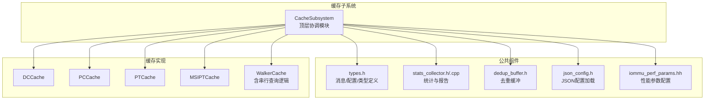

**图表来源**
- [cache_subsystem.h:19-184](file://iommu/cache_src/subsystem/cache_subsystem.h#L19-L184)
- [types.h:580-623](file://iommu/cache_src/common/types.h#L580-L623)
- [stats_collector.h:107-191](file://iommu/cache_src/common/stats_collector.h#L107-L191)
- [dedup_buffer.h:61-126](file://iommu/cache_src/common/dedup_buffer.h#L61-L126)
- [iommu_perf_params.hh:160-180](file://iommu/iommu_perf_model/iommu_perf_params.hh#L160-L180)

**章节来源**
- [cache_subsystem.h:19-184](file://iommu/cache_src/subsystem/cache_subsystem.h#L19-L184)
- [default_config.json:1-69](file://iommu/cache_config/default_config.json#L1-L69)

## 核心组件
- CacheSubsystem：顶层模块，负责：
  - 统一管理五个缓存子模块实例
  - 提供独立的请求/更新/失效FIFO接口
  - 维护全局失效管道与级联失效协调
  - 驱动统计收集器与任务跟踪
  - 管理PT Cache去重缓冲与预取接口
  - 实现'ping-pong'调度机制确保REQUEST和UPDATE操作的安全交替执行
  - **新增**：管理三种新线程模型（pt_hash_thread、pt_ram_worker_thread、dedup_scheduler_thread）
  - **新增**：集成Walker Cache串行查询逻辑和结果处理
  - **重大更新**：实现统一失效管道架构，支持优先级调度的单线程调度器
  - **新增**：dedup缓存命中率统计跟踪功能
- 各缓存子模块：DC、PC、PT、MSIPT、Walker，均继承自CacheBase模板基类，提供lookup/fill/invalidate等统一接口。
- 统计收集器StatsCollector：记录命中/缺失/替换/失效、延迟直方图、阶段化统计、任务跟踪等。
- 去重缓冲DedupBuffer：管理PT Cache占位缓存行对应的链表，支持分配/挂接/释放与峰值统计。

**章节来源**
- [cache_subsystem.h:19-184](file://iommu/cache_src/subsystem/cache_subsystem.h#L19-L184)
- [cache_base.h:26-224](file://iommu/cache_src/cache/cache_base.h#L26-L224)
- [stats_collector.h:13-191](file://iommu/cache_src/common/stats_collector.h#L13-L191)
- [dedup_buffer.h:61-126](file://iommu/cache_src/common/dedup_buffer.h#L61-L126)

## 架构总览
CacheSubsystem通过SystemC进程模型驱动各缓存模块的请求处理，采用"请求FIFO + 响应FIFO + 更新/失效FIFO"的解耦设计，避免单一深度为1的FIFO造成串行瓶颈。顶层模块还维护全局失效管道，集中处理级联失效请求。

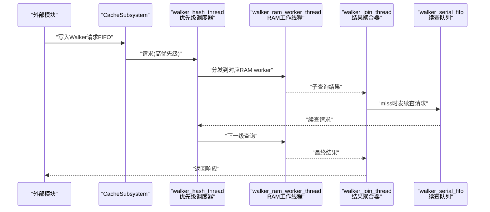

**图表来源**
- [cache_subsystem.cpp:1341-1412](file://iommu/cache_src/subsystem/cache_subsystem.cpp#L1341-L1412)
- [cache_subsystem.cpp:1619-1696](file://iommu/cache_src/subsystem/cache_subsystem.cpp#L1619-L1696)
- [cache_subsystem.cpp:1414-1448](file://iommu/cache_src/subsystem/cache_subsystem.cpp#L1414-L1448)

## 详细组件分析

### CacheSubsystem顶层模块
- 设计理念
  - 以SystemC进程为中心，每个缓存类型拥有独立的请求/更新/失效线程，避免共享FIFO带来的串行化。
  - PT Cache采用'ping-pong'调度机制，REQUEST和UPDATE操作交替执行，消除死锁风险。
  - **Walker Cache采用串行查询机制**：通过walker_hash_thread、walker_ram_worker_thread和walker_join_thread三线程协作，实现C3→C2→C1的顺序查询。
  - 全局失效管道集中处理级联失效，保证一致性与时序可控。
  - **新增**：三种专用线程模型实现不同层次的并发控制和资源隔离。
  - **重大更新**：实现统一失效管道架构，采用优先级调度的单线程调度器，确保失效操作的高优先级处理。
  - **新增**：dedup缓存命中率统计跟踪，提供精确的性能监控能力。
- 关键接口
  - 请求FIFO：dc_request_fifo(16)、pc_request_fifo(16)、pt_request_fifo(16)、walker_request_fifo(1)、msi_request_fifo(1)
  - **新增**：walker_front_request_fifo(16)和walker_front_response_fifo(16)用于前置查询通道
  - **新增**：walker_serial_fifo(64)用于串行查询续查队列
  - **新增**：walker_join_fifo(64)用于子查询结果聚合
  - 响应FIFO：dc_response_fifo(16)、pc_response_fifo(16)、pt_hit_response_fifo(1024)、pt_miss_response_fifo(1024)、walker_response_fifo(1)、msi_response_fifo(1024)
  - 更新FIFO：dc_update_fifo(1)、pc_update_fifo(1)、pt_update_fifo(1024)、walker_update_fifo(1024)、msi_update_fifo(1)
  - 失效FIFO：dc_invalidate_fifo(1)、pc_invalidate_fifo(1)、pt_invalidate_fifo(16)、walker_invalidate_fifo(1)、msi_invalidate_fifo(1)
  - 失效响应FIFO：dc_invalidate_response_fifo(1)、pc_invalidate_response_fifo(1)、pt_invalidate_response_fifo(16)、walker_invalidate_response_fifo(1)、msi_invalidate_response_fifo(1)
  - 全局失效：invalidation_request_fifo(1)、invalidation_response_fifo(1)
  - **新增**：dedup_request_fifo(1024)、dedup_update_fifo(1024)用于去重请求处理
- 生命周期与初始化
  - 从GlobalConfig加载时钟周期、统计配置与各缓存配置
  - 实例化各子模块并设置时钟周期
  - 启动所有工作线程与失效线程
  - 初始化统计收集器（直方图宽度、是否启用、输出文件）
- 任务跟踪与统计
  - 支持开启/关闭任务跟踪，按级别输出请求/响应/失效事件
  - 记录各缓存的执行延迟、排队延迟、请求窗口等
  - PT Cache新增调度间隙分析与区间命中率统计
  - **新增**：Walker串行查询统计指标和结果处理跟踪
  - **重大更新**：统一失效管道的优先级统计和调度效率监控
  - **新增**：dedup缓存命中率统计跟踪，包含总查询数、命中数和未命中数的精确计数

**重大更新** PT Cache调度器经过重大架构重构，采用'ping-pong'调度机制替代原有的统一轮询线程，实现了REQUEST和UPDATE操作的智能交替执行，从根本上消除了死锁风险。**新增**三种专用线程模型：pt_hash_thread负责哈希计算和ping-pong调度控制，pt_ram_worker_thread实现跨RAM并发访问和同RAM串行化，dedup_scheduler_thread专门处理去重请求的FIFO队列调度。**新增**Walker Cache串行查询机制，通过walker_hash_thread、walker_ram_worker_thread和walker_join_thread三线程协作，实现C3→C2→C1的顺序查询和结果聚合。**重大架构增强**：实现统一失效管道架构，采用优先级调度的单线程调度器，确保失效操作的高优先级处理和多RAM子失效路由。

**最新优化**：关键FIFO缓冲区进行了大规模扩展，从原来的小尺寸增加到1024条目，有效防止了高负载下的死锁条件。同时引入了可配置的Dedup Buffer大小机制，通过`TEST_CFG_PT_DEDUP_BUFFER_SIZE`宏支持场景化调优。**重大增强**：新增了dedup缓存命中率统计跟踪功能，通过dedup_lookup_total_、dedup_lookup_hit_、dedup_lookup_miss_三个关键指标提供精确的性能监控能力。

**章节来源**
- [cache_subsystem.h:19-184](file://iommu/cache_src/subsystem/cache_subsystem.h#L19-L184)
- [cache_subsystem.cpp:110-143](file://iommu/cache_src/subsystem/cache_subsystem.cpp#L110-L143)
- [cache_subsystem.cpp:102-175](file://iommu/cache_src/subsystem/cache_subsystem.cpp#L102-L175)
- [cache_subsystem.cpp:212-285](file://iommu/cache_src/subsystem/cache_subsystem.cpp#L212-L285)
- [cache_subsystem.cpp:416-457](file://iommu/cache_src/subsystem/cache_subsystem.cpp#L416-L457)

### Walker串行查询机制（重大架构增强）
- **核心设计理念**：
  - 三级子表串行查询：C3→C2→C1顺序查询，命中即短路，减少不必要查询
  - walker_serial_fifo队列管理续查请求，避免重复查询开销
  - walker_join_thread负责聚合子响应并实现级联失效处理
  - walker_hash_thread采用多级优先级调度，确保关键路径优先处理
- **串行查询流程**：
  - 首级查询：仅查询C3子表，miss后由join线程发续查请求到walker_serial_fifo
  - 续查处理：walker_hash_thread从walker_serial_fifo读取续查请求，分发到下一级子表
  - 结果聚合：walker_join_thread聚合各级子响应，按C3>C2>C1优先级选择最高级命中
  - 短路优化：任何一级命中后立即结束查询，不再继续后续查询
- **优先级调度机制**：
  - 失效操作最高优先级：walker_invalidate_fifo > walker_update_fifo > walker_serial_fifo > walker_request_fifo > walker_front_request_fifo
  - 关键路径优先：PTW关键路径（walker_origin=0）使用高优先通道walker_ram_upd_fifo_
  - 前置查询降级：主数据通路（walker_origin=1）使用普通通道walker_ram_fifo_
- **多RAM架构支持**：
  - 每级子表独立分RAM：C1/C2/C3各自拥有独立的num_rams组RAM bank
  - Worker索引计算：worker_id = (level-1)*num_rams + ram_id
  - 同一查询的三级子查询天然并行，不同级之间串行

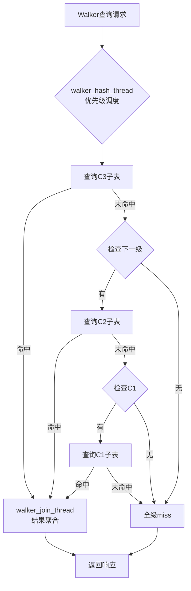

**图表来源**
- [cache_subsystem.cpp:1341-1412](file://iommu/cache_src/subsystem/cache_subsystem.cpp#L1341-L1412)
- [cache_subsystem.cpp:1414-1448](file://iommu/cache_src/subsystem/cache_subsystem.cpp#L1414-L1448)
- [cache_subsystem.cpp:1619-1696](file://iommu/cache_src/subsystem/cache_subsystem.cpp#L1619-L1696)

**章节来源**
- [cache_subsystem.h:161-199](file://iommu/cache_src/subsystem/cache_subsystem.h#L161-L199)
- [cache_subsystem.cpp:1341-1412](file://iommu/cache_src/subsystem/cache_subsystem.cpp#L1341-L1412)
- [cache_subsystem.cpp:1414-1448](file://iommu/cache_src/subsystem/cache_subsystem.cpp#L1414-L1448)
- [cache_subsystem.cpp:1619-1696](file://iommu/cache_src/subsystem/cache_subsystem.cpp#L1619-L1696)

### 三种新线程模型详解

#### pt_hash_thread（哈希调度线程）
- **核心职责**：负责PT Cache的哈希计算和ping-pong调度控制
- **调度机制**：
  - 实现智能的'ping-pong'调度算法，根据`pt_sched_next_is_request_`标志位控制请求处理优先级
  - 当REQUEST和UPDATE同时存在时，根据乒乓标志决定处理顺序
  - 单FIFO情况下直接处理可用请求，避免不必要的等待
- **背压机制**：
  - 监控pt_update_fifo和pt_request_fifo的负载状态
  - 当更新队列积压时，优先处理UPDATE操作避免饥饿
  - 动态调整请求处理频率，维持系统平衡

#### pt_ram_worker_thread（RAM工作线程）
- **核心职责**：实现跨RAM并发访问和同RAM串行化的内存访问控制
- **并发控制**：
  - 不同RAM Bank之间可以并发访问，提高内存带宽利用率
  - 同一RAM Bank内的访问严格串行化，避免冲突和竞态条件
  - 基于RAM Bank ID的负载均衡和仲裁机制
- **性能优化**：
  - 批量处理RAM访问请求，减少上下文切换开销
  - 预取机制提前加载可能需要的数据
  - 智能的访问模式预测和缓存预热

#### dedup_scheduler_thread（去重调度线程）
- **核心职责**：使用专用FIFO队列处理去重请求的调度
- **队列管理**：
  - 维护dedup_request_fifo(1024)和dedup_update_fifo(1024)双队列
  - 支持去重请求的优先级排序和公平调度
  - 自动清理过期和无效的去重条目
- **去重策略**：
  - 基于VA地址的去重匹配算法
  - 支持批量去重操作，提高处理效率
  - 智能的去重时机选择，避免过度去重导致的性能下降
- **新增功能**：
  - **dedup缓存命中率统计跟踪**：通过dedup_lookup_total_、dedup_lookup_hit_、dedup_lookup_miss_三个指标精确跟踪去重效果
  - **改进的缓冲区溢出处理**：使用等待机制阻止dedup worker直到PTW容量可用，避免资源竞争
  - **bypass预取机制**：通过is_bypass标志控制任务绕过dedup buffer直接访问PTW

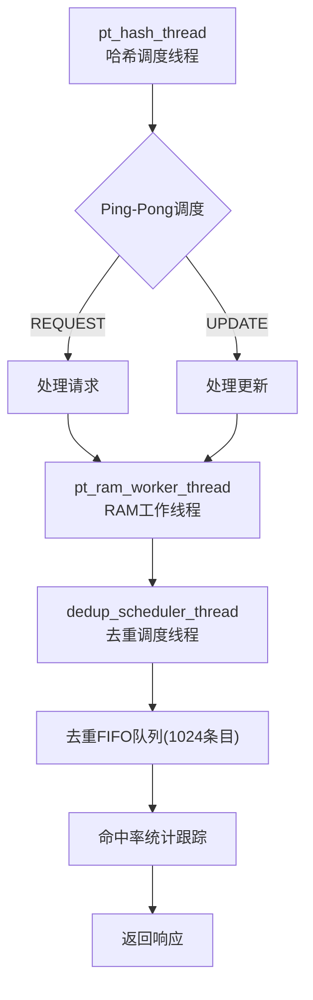

**图表来源**
- [cache_subsystem.cpp:314-455](file://iommu/cache_src/subsystem/cache_subsystem.cpp#L314-L455)
- [cache_subsystem.cpp:458-560](file://iommu/cache_src/subsystem/cache_subsystem.cpp#L458-L560)

**章节来源**
- [cache_subsystem.cpp:314-455](file://iommu/cache_src/subsystem/cache_subsystem.cpp#L314-L455)
- [cache_subsystem.cpp:458-560](file://iommu/cache_src/subsystem/cache_subsystem.cpp#L458-L560)

### Walker Cache多RAM架构（新增）
- **三级子表独立分RAM**：
  - C1/C2/C3三个子表各自拥有独立的num_rams组RAM bank
  - 物理拓扑：共3×num_rams个worker，worker索引 = (level-1)×num_rams + ram_id
  - 同一查询的三级子查询天然并行，不同级之间串行
- **Worker优先级机制**：
  - 每个worker拥有独立的update高优先FIFO（walker_ram_upd_fifo_）
  - update操作不排在积压的lookup之后，保证Walker更新及时可见
  - 硬件语义=写口优先，确保写操作不被读操作阻塞
- **串行查询优化**：
  - walker_serial_fifo队列管理续查请求，避免重复查询
  - join线程聚合子响应，实现C3>C2>C1优先级仲裁
  - 命中即短路机制，减少不必要的后续查询开销

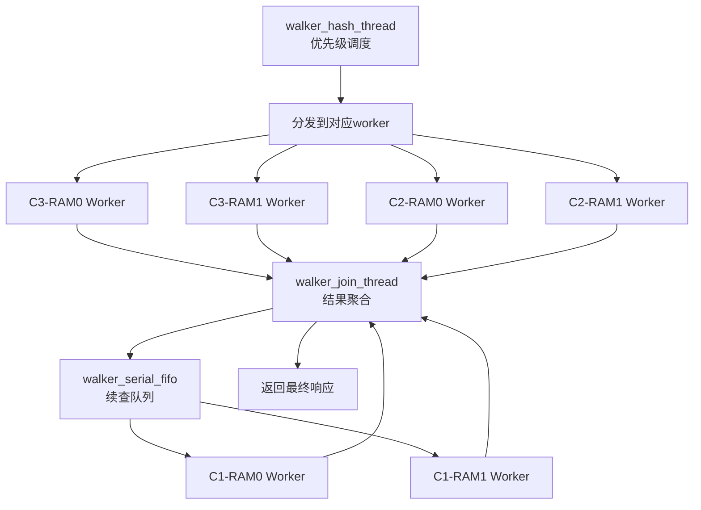

**图表来源**
- [cache_subsystem.cpp:190-213](file://iommu/cache_src/subsystem/cache_subsystem.cpp#L190-L213)
- [cache_subsystem.cpp:1450-1472](file://iommu/cache_src/subsystem/cache_subsystem.cpp#L1450-L1472)
- [cache_subsystem.cpp:1543-1614](file://iommu/cache_src/subsystem/cache_subsystem.cpp#L1543-L1614)

**章节来源**
- [cache_subsystem.h:364-405](file://iommu/cache_src/subsystem/cache_subsystem.h#L364-L405)
- [cache_subsystem.cpp:190-213](file://iommu/cache_src/subsystem/cache_subsystem.cpp#L190-L213)
- [cache_subsystem.cpp:1450-1472](file://iommu/cache_src/subsystem/cache_subsystem.cpp#L1450-L1472)

### FIFO接口与数据流
- 请求入口
  - 外部模块将请求写入对应缓存的请求FIFO
  - CacheSubsystem的对应worker线程读取并执行，记录任务起止时间，调用子模块的lookup/update/invalidate接口
- 响应出口
  - 各缓存独立返回响应，避免共用FIFO导致串行化
  - PT Cache区分命中/未命中两类响应出口，便于上层分流处理
  - **新增**：walker_front_response_fifo用于前置查询响应，walker_response_fifo用于PTW关键路径响应
  - **重大更新**：响应FIFO缓冲区大幅扩容至1024条目，显著提升吞吐能力
- 更新/失效通道
  - 更新与失效分别有独立FIFO，确保不同操作类型不会互相阻塞
  - Walker Cache采用统一轮询调度，按lookup→update→invalidate顺序处理，避免死锁
  - **新增**：walker_ram_upd_fifo_为每个worker提供update高优先通道
  - **重大更新**：更新FIFO缓冲区扩容至1024条目，有效缓解高负载压力

**重大更新** 关键FIFO缓冲区经过大规模性能优化：
- pt_hit_response_fifo和pt_miss_response_fifo缓冲区大小从16增加到1024条目
- msi_response_fifo缓冲区大小从1增加到1024条目
- pt_update_fifo和walker_update_fifo缓冲区大小从1增加到1024条目
- dedup_request_fifo和dedup_update_fifo缓冲区大小均为1024条目
- 有效缓解高负载下的背压问题，提升系统吞吐量

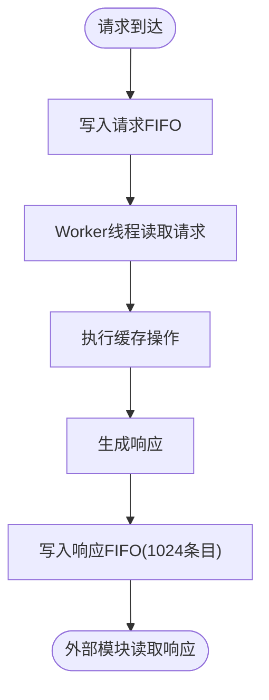

**图表来源**
- [cache_subsystem.cpp:287-296](file://iommu/cache_src/subsystem/cache_subsystem.cpp#L287-L296)
- [cache_subsystem.cpp:311-414](file://iommu/cache_src/subsystem/cache_subsystem.cpp#L311-L414)

**章节来源**
- [cache_subsystem.h:34-66](file://iommu/cache_src/subsystem/cache_subsystem.h#L34-L66)
- [cache_subsystem.cpp:110-143](file://iommu/cache_src/subsystem/cache_subsystem.cpp#L110-L143)
- [cache_subsystem.cpp:287-310](file://iommu/cache_src/subsystem/cache_subsystem.cpp#L287-L310)

### PT Cache 'ping-pong'调度器（重大架构重构）
**重大更新** PT Cache调度器经过重大架构重构，实现了智能的'ping-pong'调度机制，彻底解决了死锁问题：

#### 'ping-pong'调度机制核心原理
- **交替执行策略**：通过`pt_sched_next_is_request_`标志位控制下一轮优先处理的请求类型
- **智能决策逻辑**：当REQUEST和UPDATE同时存在时，根据乒乓标志决定处理顺序；当只有一个可用时直接处理
- **死锁预防**：避免了原有统一轮询线程中可能出现的优先级反转和资源竞争问题

#### 32任务组统计分析系统
- **分组统计维度**：每32个REQUEST为一组，统计每个位置的任务性能指标
- **多维度延迟跟踪**：
  - 执行延时(exec_ns)：任务实际执行时间
  - 队列等待(queue_ns)：UPDATE操作累积的等待时间
  - 端到端延迟(e2e_ns)：从入队到完成的总时间
  - UPDATE计数(upd_count)：组内间隔的UPDATE操作数量
- **历史汇总统计**：跨多个完整组的平均性能指标计算

#### 增强的缓冲区管理
- pt_update_fifo缓冲区大小从1增加到1024条目
- **新增**：pt_invalidate_fifo和pt_invalidate_response_fifo缓冲区大小从1增加到16条目
- **重大更新**：响应FIFO缓冲区扩容至1024条目，显著提升吞吐能力
- 有效缓解高负载下的背压问题
- 减少线程间等待和死锁风险

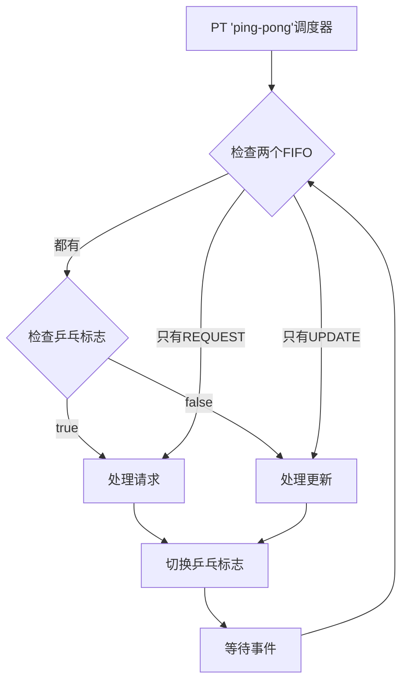

**图表来源**
- [cache_subsystem.cpp:314-455](file://iommu/cache_src/subsystem/cache_subsystem.cpp#L314-L455)
- [cache_subsystem.cpp:458-560](file://iommu/cache_src/subsystem/cache_subsystem.cpp#L458-L560)

**章节来源**
- [cache_subsystem.cpp:314-455](file://iommu/cache_src/subsystem/cache_subsystem.cpp#L314-L455)
- [cache_subsystem.cpp:458-560](file://iommu/cache_src/subsystem/cache_subsystem.cpp#L458-L560)

### 级联失效机制
- 触发条件
  - DC/PC缓存的精确/扫描失效完成后，返回受影响的上下文（如gscid/pscid）
  - CacheSubsystem根据命令类型映射到对应缓存的失效类型
- 处理流程
  - 将PT/Walker/MSIPT的失效请求写入对应失效FIFO
  - 全局失效线程统一消费失效请求，执行相应的invalidate操作
  - 记录受影响条目数与处理延迟，写回失效响应FIFO

**重大更新** 级联失效机制经过性能优化，PT失效FIFO缓冲区扩容至16条目，支持更高并发度的级联失效操作。**新增** Walker串行查询机制的失效处理，通过dispatch_walker_invalidate函数将失效指令拆分为(级×RAM)子失效，经高优先通道分发到对应worker。

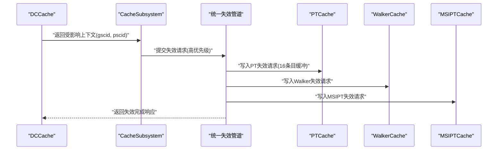

**图表来源**
- [cache_subsystem.cpp:12-21](file://iommu/cache_src/subsystem/cache_subsystem.cpp#L12-L21)
- [cache_subsystem.cpp:199-210](file://iommu/cache_src/subsystem/cache_subsystem.cpp#L199-L210)

**章节来源**
- [cache_subsystem.cpp:12-21](file://iommu/cache_src/subsystem/cache_subsystem.cpp#L12-L21)
- [cache_subsystem.cpp:199-210](file://iommu/cache_src/subsystem/cache_subsystem.cpp#L199-L210)

### PT Cache去重与预取（V3.0）
- 占位缓存行（Placeholder CL）
  - 在PT Cache中插入占位CL，携带Buffer链表头索引与主任务/预取标识
  - 保护主任务占位CL（is_req=1）不被替换，确保关键路径的稳定性
- Dedup Buffer
  - 管理等待PTW完成的任务链表，支持顺序分配、链表挂接与释放
  - 提供峰值有效Entry统计与反压事件通知
  - **增强内存管理安全性**：改进的双重释放防护机制
  - **可配置容量**：通过`TEST_CFG_PT_DEDUP_BUFFER_SIZE`宏支持场景化调优
- 执行流程
  - PT请求命中占位CL：根据is_req分支处理，为主任务分配Buffer Entry并更新PT Cache
  - PT请求MISS：自动插入主任务占位CL并分配Buffer Entry
  - 批量更新：支持批量将占位CL更新为常规CL，减少后续PTW压力

**更新** 预取占位符处理逻辑得到改进，增强了边界检查和冲突检测机制，同时强化了内存管理的防双重释放保护。**新增**可配置的Dedup Buffer大小机制，允许通过编译时宏定义调整Buffer容量以适应不同场景需求。

**重大增强**：新增了dedup缓存命中率统计跟踪功能，通过dedup_lookup_total_、dedup_lookup_hit_、dedup_lookup_miss_三个关键指标精确跟踪去重缓存的命中率和性能表现。改进了缓冲区溢出处理机制，使用等待机制阻止dedup worker直到PTW容量可用，避免资源竞争和死锁条件。新增了bypass预取机制，通过is_bypass标志控制任务绕过dedup buffer直接访问PTW，提升极端负载下的系统稳定性。

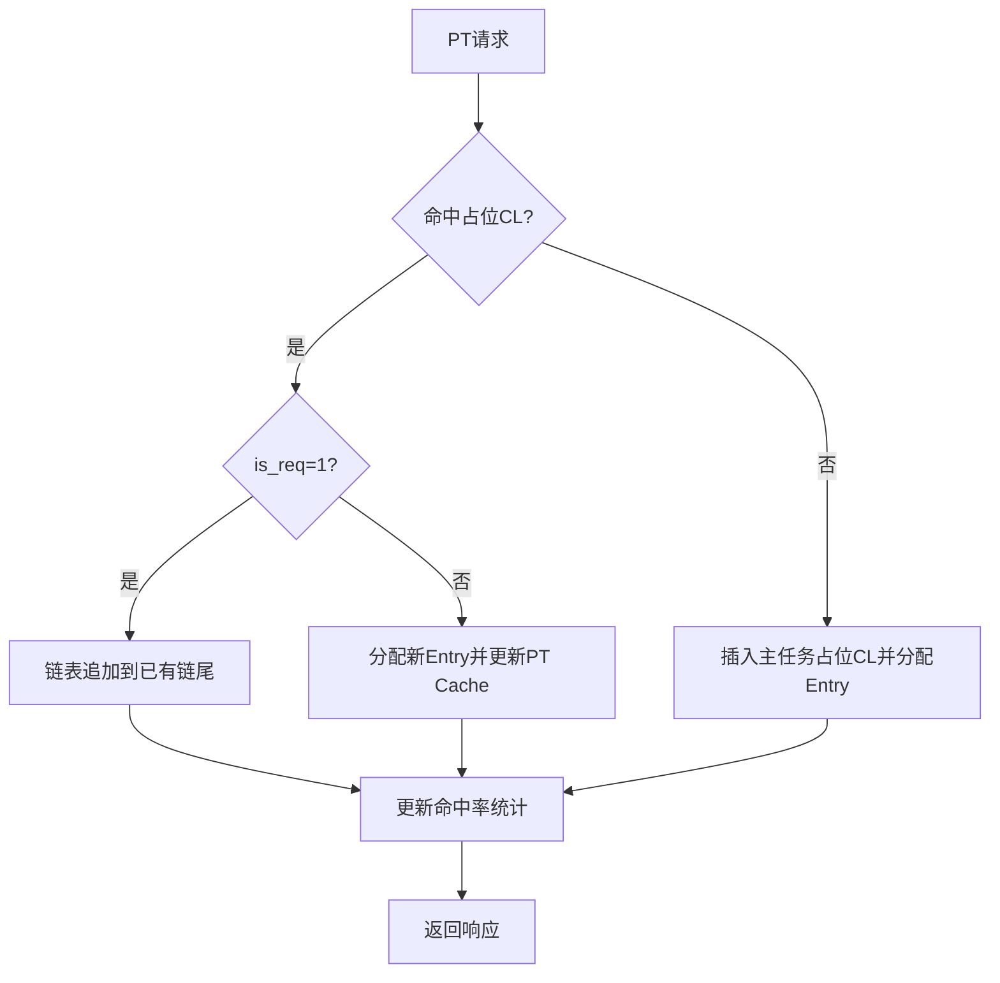

**图表来源**
- [cache_subsystem.cpp:638-800](file://iommu/cache_src/subsystem/cache_subsystem.cpp#L638-L800)
- [dedup_buffer.h:61-126](file://iommu/cache_src/common/dedup_buffer.h#L61-L126)

**章节来源**
- [pt_cache.h:48-72](file://iommu/cache_src/cache/pt_cache.h#L48-L72)
- [cache_subsystem.cpp:638-800](file://iommu/cache_src/subsystem/cache_subsystem.cpp#L638-L800)
- [dedup_buffer.h:61-126](file://iommu/cache_src/common/dedup_buffer.h#L61-L126)

### 可配置Dedup Buffer与旁路机制（新增）
- **可配置Buffer大小**：
  - 通过`TEST_CFG_PT_DEDUP_BUFFER_SIZE`宏定义Buffer容量
  - 默认值跟随全局outstanding限制，支持场景化调优
  - 支持运行时通过Makefile参数覆盖默认值
- **智能旁路机制**：
  - 当Dedup Buffer满时，自动切换到旁路模式，直接转发到PTW
  - 避免阻塞和死锁环，确保系统在高负载下的稳定性
  - 旁路模式下跳过预取功能，降低资源占用
- **防死锁设计**：
  - 旁路机制防止"RAM Worker阻塞→RAM FIFO满→Hash/Scheduler阻塞→UPDATE无法分发"的死锁环
  - 支持优雅降级，在极端负载下仍能保持基本功能
  - 详细的旁路事件统计和日志记录
- **新增功能**：
  - **改进的缓冲区溢出处理**：使用等待机制阻止dedup worker直到PTW容量可用，避免资源竞争
  - **bypass预取机制**：通过is_bypass标志控制任务绕过dedup buffer直接访问PTW
  - **dedup缓存命中率统计跟踪**：精确跟踪去重缓存的命中率和性能表现

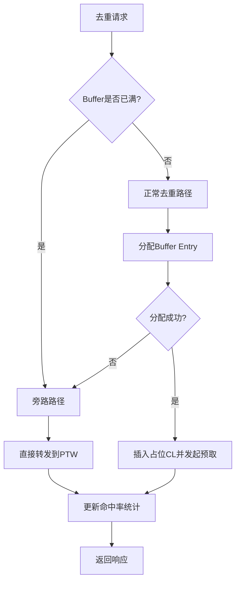

**图表来源**
- [cache_subsystem.cpp:1890-2081](file://iommu/cache_src/subsystem/cache_subsystem.cpp#L1890-L2081)
- [iommu_perf_params.hh:160-180](file://iommu/iommu_perf_model/iommu_perf_params.hh#L160-L180)

**章节来源**
- [cache_subsystem.cpp:1890-2081](file://iommu/cache_src/subsystem/cache_subsystem.cpp#L1890-L2081)
- [iommu_perf_params.hh:160-180](file://iommu/iommu_perf_model/iommu_perf_params.hh#L160-L180)
- [Makefile:200-210](file://Makefile#L200-L210)

### 统计收集与性能监控
- 统计维度
  - 基础指标：总访问、命中、缺失、替换、失效、预取发出/命中
  - 阶段化统计：REQUEST/UPDATE/PTW Monitor三阶段的lookup/fill分类
  - 时间戳统计：PT Cache阶段入口/出口时间戳，用于任务放大系数计算
  - 区间命中率：每1000笔REQUEST的命中/缺失统计
  - **'ping-pong'调度统计**：任务间隔分析、空闲比例、执行比例等
  - **32任务组统计**：分组维度的执行延时、队列等待、端到端延迟跟踪
  - **新增**：三种线程模型的独立统计指标
  - **新增**：Walker串行查询统计指标和结果处理跟踪
  - **重大更新**：统一失效管道的优先级统计和调度效率监控
  - **新增**：旁路机制统计指标，监控Buffer满时的旁路事件
  - **新增**：dedup缓存命中率统计跟踪，包含总查询数、命中数和未命中数的精确计数
  - **新增**：DC Cache查询间隔统计，包含最小、最大和平均查询完成间隔
- 报告与直方图
  - 支持延迟直方图与排队延迟直方图
  - 可配置直方图bin宽度与输出文件
  - 支持统一报告输出，包含摘要与可选直方图
  - **新增**：PT调度器gap分析报告和32任务组延迟报告
  - **新增**：线程模型性能分析报告
  - **新增**：Walker串行查询效果分析报告
  - **重大更新**：统一失效管道优先级统计报告和调度效率分析
  - **新增**：旁路机制性能影响分析报告
  - **新增**：dedup缓存命中率统计报告，提供精确的性能洞察

**更新** 新增了'ping-pong'调度器的任务间隔分析和32任务组的详细性能洞察功能，提供了更全面的性能监控和优化指导。**新增**三种线程模型的独立统计指标，便于分析不同层次的性能瓶颈。**新增**Walker串行查询的统计指标，帮助评估串行查询机制的效果。**新增**旁路机制的统计指标，监控Buffer满时的系统行为。**重大更新**：统一失效管道的优先级统计和调度效率监控，提供更全面的失效操作性能洞察。**重大增强**：新增了dedup缓存命中率统计跟踪功能，通过dedup_lookup_total_、dedup_lookup_hit_、dedup_lookup_miss_三个关键指标提供精确的性能监控能力，帮助优化去重缓存的配置和性能调优。

**章节来源**
- [stats_collector.h:13-191](file://iommu/cache_src/common/stats_collector.h#L13-L191)
- [stats_collector.cpp:13-200](file://iommu/cache_src/common/stats_collector.cpp#L13-200)

## 依赖关系分析
- CacheSubsystem依赖
  - 各缓存子模块：DCCache、PCCache、PTCache、MSIPTCache、WalkerCache
  - 统计收集器：StatsCollector
  - 公共类型与消息：types.h
  - 去重缓冲：dedup_buffer.h
  - JSON配置：json_config.h + default_config.json
  - **新增**：三种线程模型的管理接口
  - **新增**：Walker串行查询逻辑的依赖
  - **重大更新**：统一失效管道的依赖和优先级调度器
  - **新增**：可配置性能参数的依赖
  - **新增**：dedup缓存命中率统计跟踪的依赖
- 内部依赖
  - CacheBase模板基类提供统一的lookup/fill/invalidate实现与仲裁逻辑
  - 各缓存子模块通过继承实现特定的散列函数与业务接口

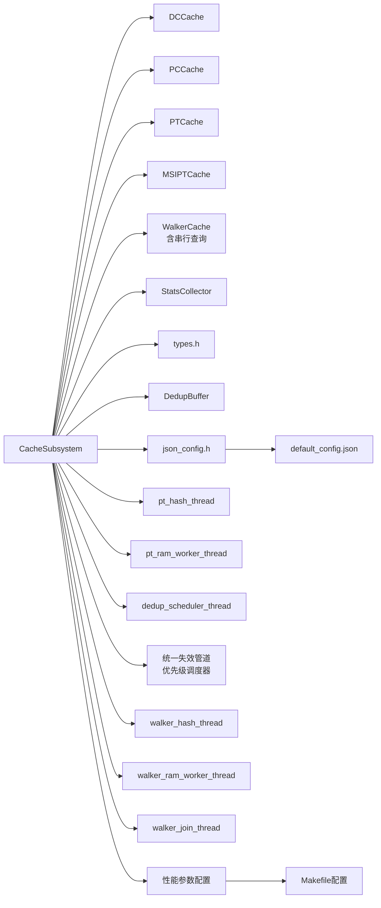

**图表来源**
- [cache_subsystem.h:9-13](file://iommu/cache_src/subsystem/cache_subsystem.h#L9-L13)
- [json_config.h:9-13](file://iommu/cache_src/common/json_config.h#L9-L13)
- [default_config.json:1-69](file://iommu/cache_config/default_config.json#L1-L69)
- [iommu_perf_params.hh:160-180](file://iommu/iommu_perf_model/iommu_perf_params.hh#L160-L180)

**章节来源**
- [cache_subsystem.h:9-13](file://iommu/cache_src/subsystem/cache_subsystem.h#L9-L13)
- [cache_base.h:26-224](file://iommu/cache_src/cache/cache_base.h#L26-L224)

## 性能考量
- RAM端口仲裁
  - CacheBase实现基于WRR的仲裁，平衡lookup/fill/invalidate三类操作的端口占用
  - 支持阶段化排队等待时间统计，便于分析瓶颈
- PT Cache调度优化
  - **'ping-pong'调度机制**：REQUEST和UPDATE操作智能交替执行，消除死锁风险
  - **增大的缓冲区**：pt_update_fifo从1增加到1024条目，pt_invalidate_fifo和pt_invalidate_response_fifo从1增加到16条目，显著提升吞吐量
  - **32任务组分析**：实时统计分组维度的性能指标，识别调度层面的瓶颈
  - **任务间隔分析**：统计gap、最大gap、空闲比例等关键指标
  - **区间命中率统计**：帮助评估预取效果
  - **新增**：三种线程模型的独立性能监控
- 去重缓冲反压
  - Buffer满时阻塞等待free_event，避免降级策略导致的性能波动
  - 提供峰值有效Entry统计，辅助容量规划
  - **增强的内存安全**：防止双重释放条件的内存管理改进
  - **新增**：可配置Buffer大小，支持场景化调优
  - **重大增强**：改进的缓冲区溢出处理机制，使用等待机制阻止dedup worker直到PTW容量可用
- **新增**：线程模型性能优化
  - pt_hash_thread的ping-pong调度减少了上下文切换开销
  - pt_ram_worker_thread的跨RAM并发提高了内存带宽利用率
  - dedup_scheduler_thread的专用队列避免了去重操作的阻塞
  - **新增**：dedup缓存命中率统计跟踪，提供精确的性能监控能力
- **新增**：Walker串行查询性能优化
  - 串行查询机制减少不必要的后续查询开销
  - 命中即短路优化，降低查询延迟
  - 三级子表独立分RAM，提高并行处理能力
  - walker_serial_fifo队列管理续查请求，避免重复查询
- **重大更新**：统一失效管道性能优化
  - 单线程调度器减少上下文切换开销
  - 优先级调度确保关键操作的及时执行
  - 多RAM子失效路由提升并行处理能力
  - CacheMessage结构扩展优化数据传输效率
- **最新优化**：关键FIFO大规模扩展
  - 响应FIFO从16条目扩展到1024条目，显著提升吞吐能力
  - 更新FIFO从1条目扩展到1024条目，有效缓解高负载压力
  - 去重FIFO采用1024条目大缓冲，支持高并发去重操作
  - 有效防止高负载下的死锁条件和性能退化
- **新增**：DC Cache查询间隔统计增强
  - 包含最小、最大和平均查询完成间隔的详细统计信息
  - 提供更全面的性能洞察和优化指导

**重大更新** PT Cache调度器经过重大架构重构，采用'ping-pong'调度机制从根本上消除了死锁风险，配合扩大的缓冲区大小和增强的内存安全管理，显著提升了系统的稳定性和吞吐量。**新增**三种专用线程模型进一步优化了不同层次的处理效率和资源利用率，为复杂翻译任务提供了更好的支持。**新增**Walker Cache串行查询机制通过walker_hash_thread、walker_ram_worker_thread和walker_join_thread三线程协作，实现了C3→C2→C1的顺序查询和结果聚合，显著提升了查询性能和灵活性，为IOMMU缓存子系统带来了更强的查询优化能力。**重大架构增强**：统一失效管道架构通过单线程优先级调度器和多RAM子失效路由，显著提升了失效操作的效率和系统整体性能，为IOMMU缓存子系统提供了更加稳定和高效的失效管理机制。**最新优化**：通过可配置的Dedup Buffer大小和关键FIFO的大规模扩展，结合智能旁路机制，显著提升了系统在极端负载下的稳定性和容错能力。**重大增强**：新增了dedup缓存命中率统计跟踪、改进的缓冲区溢出处理机制、bypass预取机制以及增强的DC Cache查询间隔统计功能，进一步提升了系统的可观测性和性能优化能力。

**章节来源**
- [cache_base.h:626-741](file://iommu/cache_src/cache/cache_base.h#L626-L741)
- [cache_subsystem.cpp:314-455](file://iommu/cache_src/subsystem/cache_subsystem.cpp#L314-L455)
- [stats_collector.cpp:191-200](file://iommu/cache_src/common/stats_collector.cpp#L191-200)
- [dedup_buffer.h:61-126](file://iommu/cache_src/common/dedup_buffer.h#L61-L126)

## 故障排查指南
- 任务跟踪
  - 通过设置task_trace_level开启详细/基本任务跟踪，定位卡顿与异常
  - 统一日志输出文件，包含请求类型、设备/进程ID、gscid/pscid、IOVA、命中/影响条目、执行/总延迟等
- 失效异常
  - 检查全局失效管道是否有积压，确认无效化命令类型映射是否正确
  - 核对DC/PC失效返回的上下文列表是否为空
- PT Cache去重
  - 观察占位CL插入失败与fallback行为，检查Buffer是否频繁满
  - 关注is_req=1占位CL保护策略，避免替换算法建议的victim被保护导致插入失败
- **'ping-pong'调度器诊断（新增）**
  - 使用print_pt_scheduler_gap_report()分析调度间隙和性能瓶颈
  - 检查pt_update_fifo是否经常达到1024条目的上限
  - **新增**：检查pt_invalidate_fifo和pt_invalidate_response_fifo是否经常达到16条目的上限
  - 监控REQUEST和UPDATE的处理比例，确保'ping-pong'机制正常工作
  - 关注任务间隔(gap)统计，识别调度层面的性能问题
- **32任务组分析（新增）**
  - 使用print_pt_group_report()分析分组维度的性能指标
  - 重点关注队列等待时间占比，识别UPDATE操作对REQUEST的影响
  - 观察端到端延迟分布，评估整体调度效率
- **新增**：线程模型故障排查
  - 检查pt_hash_thread的ping-pong调度是否正常，避免请求饥饿
  - 监控pt_ram_worker_thread的RAM访问冲突情况
  - 观察dedup_scheduler_thread的队列积压情况
  - 分析各线程的CPU利用率和等待时间分布
- **新增**：Walker串行查询故障排查
  - 检查walker_serial_fifo队列是否有积压，避免续查请求阻塞
  - 验证walker_join_thread是否正确聚合子响应
  - 监控walker_hash_thread的优先级调度是否正常
  - 检查三级子表的串行查询逻辑是否符合预期
  - 分析walker_front_lookup_count_统计，评估前置查询效果
- **重大更新**：统一失效管道故障排查
  - 检查优先级调度器是否正常工作，确保失效操作的高优先级处理
  - 监控多RAM子失效路由的正确性和性能
  - 分析CacheMessage结构中NL/S位的正确性
  - 检查失效操作的优先级排序是否符合预期
  - 监控统一失效管道的吞吐量和延迟指标
- **新增**：旁路机制故障排查
  - 监控dedup_buffer_full_bypass_count_统计，了解Buffer满时的旁路频率
  - 检查旁路机制是否频繁触发，可能需要调整Buffer大小配置
  - 分析旁路对系统性能的影响，评估是否需要增加Buffer容量
  - 验证旁路路径下的PTW请求是否正常处理
- **新增**：dedup缓存命中率统计故障排查
  - 监控dedup_lookup_total_、dedup_lookup_hit_、dedup_lookup_miss_三个关键指标
  - 分析去重缓存的命中率变化趋势，识别性能问题
  - 检查缓冲区溢出处理机制是否正常工作
  - 验证bypass预取机制的触发条件和执行效果
  - 分析DC Cache查询间隔统计，识别查询性能瓶颈

**更新** 新增了'ping-pong'调度器和32任务组分析的故障排查方法，帮助识别调度层面的性能问题和内存管理相关的异常情况。**新增**三种线程模型的故障排查指南，便于定位不同层次的性能问题。**新增**Walker串行查询的故障排查方法，帮助诊断串行查询机制的问题。**新增**旁路机制的故障排查方法，监控Buffer满时的系统行为和性能影响。**重大更新**：统一失效管道的故障排查方法，包括优先级调度器、多RAM子失效路由和CacheMessage结构的诊断指南。**重大增强**：新增了dedup缓存命中率统计跟踪的故障排查方法，通过监控关键统计指标帮助识别去重缓存的性能问题和优化机会。

**章节来源**
- [cache_subsystem.cpp:223-285](file://iommu/cache_src/subsystem/cache_subsystem.cpp#L223-L285)
- [cache_subsystem.cpp:12-21](file://iommu/cache_src/subsystem/cache_subsystem.cpp#L12-L21)
- [cache_subsystem.cpp:638-800](file://iommu/cache_src/subsystem/cache_subsystem.cpp#L638-L800)
- [cache_subsystem.cpp:458-560](file://iommu/cache_src/subsystem/cache_subsystem.cpp#L458-L560)

## 结论
CacheSubsystem通过清晰的模块划分、解耦的FIFO接口、'ping-pong'调度机制与全局失效管道，实现了对多类型缓存的一致管理与高效协作。结合完善的统计收集与任务跟踪，能够有效支撑IOMMU缓存子系统的性能优化与问题定位。PT Cache去重与预取机制进一步提升了缓存命中率与整体吞吐，配合去重缓冲的反压策略和增强的内存安全管理，确保系统在高负载下的稳定性。

**重大架构成果**：通过实现'ping-pong'调度机制替代原有的统一轮询线程，从根本上消除了死锁风险；通过32任务组统计分析提供了更精细的性能洞察；通过增强的内存管理安全性防止了双重释放条件。**新增**三种专用线程模型（pt_hash_thread、pt_ram_worker_thread、dedup_scheduler_thread）进一步优化了系统的并发性能和资源利用率，为复杂翻译任务提供了更好的支持。**新增**Walker Cache串行查询机制，通过walker_hash_thread、walker_ram_worker_thread和walker_join_thread三线程协作，实现了C3→C2→C1的顺序查询和结果聚合，显著提升了查询性能和灵活性，为IOMMU缓存子系统带来了更强的查询优化能力。**重大架构增强**：统一失效管道架构通过单线程优先级调度器和多RAM子失效路由，显著提升了失效操作的效率和系统整体性能，为IOMMU缓存子系统提供了更加稳定和高效的失效管理机制。

**最新优化成果**：通过可配置的Dedup Buffer大小机制和关键FIFO的大规模扩展，显著提升了系统的稳定性和吞吐量。新增的智能旁路机制有效防止了极端负载下的死锁条件，确保了系统在各种场景下的可靠运行。**重大增强**：新增了dedup缓存命中率统计跟踪功能，通过dedup_lookup_total_、dedup_lookup_hit_、dedup_lookup_miss_三个关键指标提供精确的性能监控能力；改进了缓冲区溢出处理机制，使用等待机制阻止dedup worker直到PTW容量可用；新增了bypass预取机制，通过is_bypass标志控制任务绕过dedup buffer直接访问PTW；增强了DC Cache查询间隔统计，包含最小、最大和平均查询完成间隔的详细统计信息。这些增强功能进一步提升了系统的可观测性、稳定性和性能优化能力。

## 附录
- 配置文件示例
  - default_config.json展示了各缓存的组相联参数、替换策略、统计配置等
- 关键类型与消息
  - types.h定义了CacheMessage、InvalidCmdType、CacheInvalidateMode等核心类型
- 统一报告
  - StatsCollector提供统一报告接口，包含摘要与可选直方图
- **新增**：线程模型配置
  - 三种线程模型的独立配置参数和性能调优选项
- **新增**：Walker串行查询配置
  - Walker串行查询的阈值配置和结果处理参数
  - walker_serial_fifo队列深度配置
  - walker_join_pending_表项管理配置
- **重大更新**：统一失效管道配置
  - 优先级调度器的配置参数和性能调优选项
  - 多RAM子失效路由的配置和路由规则
  - CacheMessage结构的扩展配置选项
- **新增**：可配置性能参数
  - `TEST_CFG_PT_DEDUP_BUFFER_SIZE`宏定义Dedup Buffer容量
  - 支持通过Makefile参数进行场景化调优
  - 默认值跟随全局outstanding限制，支持运行时覆盖
- **新增**：dedup缓存命中率统计配置
  - dedup_lookup_total_、dedup_lookup_hit_、dedup_lookup_miss_三个关键统计指标的启用和配置
  - 统计报告的输出格式和频率配置
  - 性能监控阈值的自定义设置

**章节来源**
- [default_config.json:1-69](file://iommu/cache_config/default_config.json#L1-L69)
- [types.h:78-146](file://iommu/cache_src/common/types.h#L78-L146)
- [stats_collector.h:170-174](file://iommu/cache_src/common/stats_collector.h#L170-L174)
- [iommu_perf_params.hh:160-180](file://iommu/iommu_perf_model/iommu_perf_params.hh#L160-L180)
- [Makefile:200-210](file://Makefile#L200-L210)