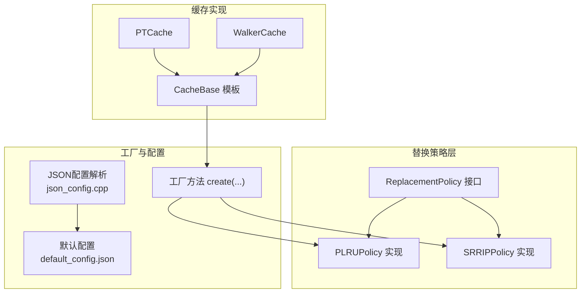
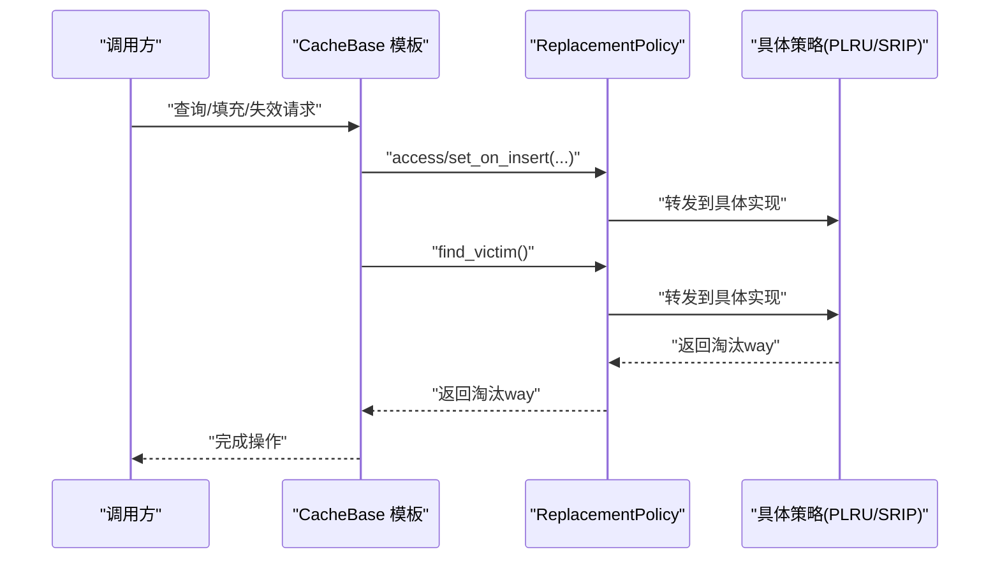
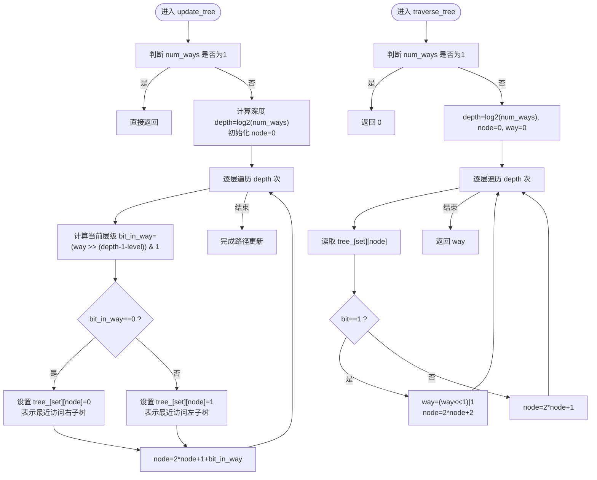
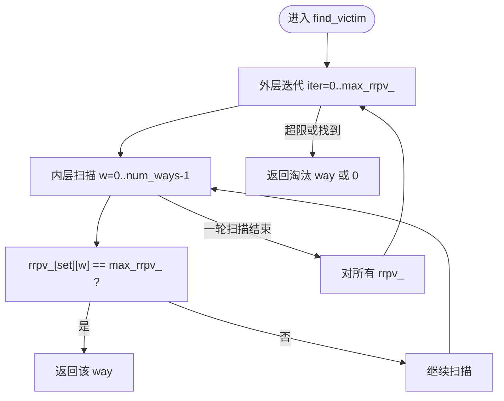
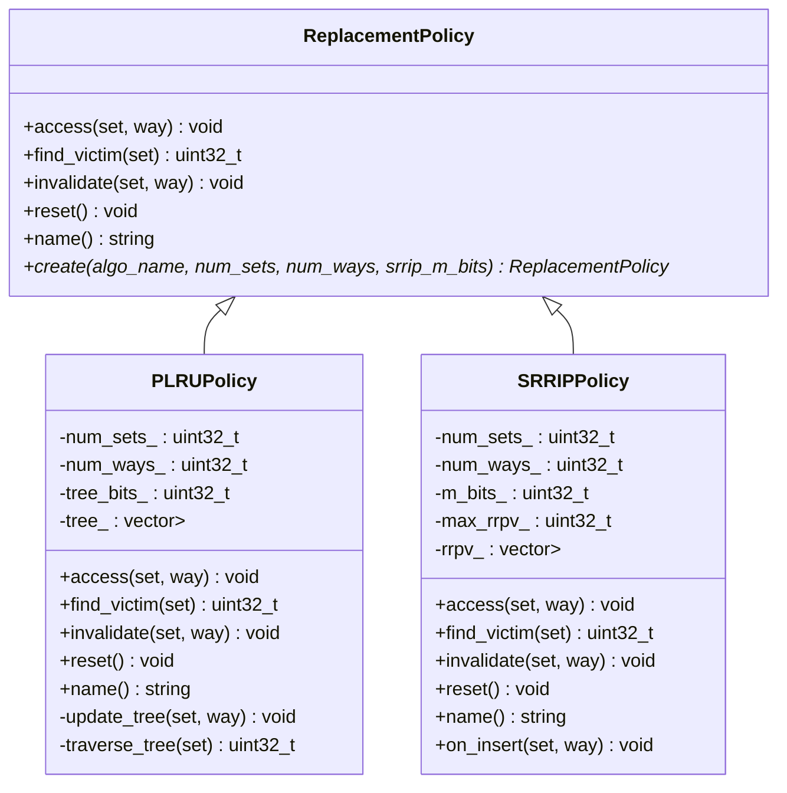
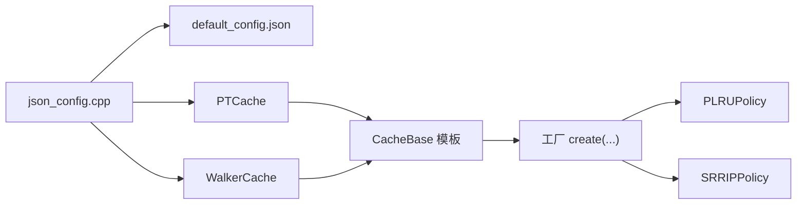

# 缓存替换策略

<cite>
**本文引用的文件**
- [replacement_policy.h](file://iommu/cache_src/replacement/replacement_policy.h)
- [plru_policy.h](file://iommu/cache_src/replacement/plru_policy.h)
- [plru_policy.cpp](file://iommu/cache_src/replacement/plru_policy.cpp)
- [srrip_policy.h](file://iommu/cache_src/replacement/srrip_policy.h)
- [srrip_policy.cpp](file://iommu/cache_src/replacement/srrip_policy.cpp)
- [cache_base.cpp](file://iommu/cache_src/cache/cache_base.cpp)
- [json_config.h](file://iommu/cache_src/common/json_config.h)
- [json_config.cpp](file://iommu/cache_src/common/json_config.cpp)
- [default_config.json](file://iommu/cache_config/default_config.json)
- [input_params_example.json](file://iommu/cache_config/input_params_example.json)
- [pt_cache.h](file://iommu/cache_src/cache/pt_cache.h)
- [walker_cache.h](file://iommu/cache_src/cache/walker_cache.h)
</cite>

## 目录
1. [引言](#引言)
2. [项目结构](#项目结构)
3. [核心组件](#核心组件)
4. [架构总览](#架构总览)
5. [详细组件分析](#详细组件分析)
6. [依赖关系分析](#依赖关系分析)
7. [性能考量](#性能考量)
8. [故障排查指南](#故障排查指南)
9. [结论](#结论)
10. [附录](#附录)

## 引言
本技术文档聚焦于IOMMU缓存替换策略，系统性阐述两类替换算法的设计原理与实现细节，并结合配置与使用场景给出性能权衡、调优建议与最佳实践。重点覆盖：
- PLRU（伪LRU，基于二叉树）：以少量树状比特记录访问方向，实现低开销的近似LRU替换。
- SRIP（静态RRIE，Re-Reference Interval Prediction）：为每个line维护RRPV（剩余重引用计数），通过递增衰减模拟重引用间隔，实现更贴近真实访问模式的替换。

同时，文档解释替换策略如何影响命中率、延迟与吞吐量，并提供配置参数与调优指南，辅以性能对比分析与实践建议。

## 项目结构
替换策略位于缓存子系统的“replacement”目录，采用统一接口抽象与工厂创建机制；配置由JSON解析模块负责，不同缓存类型（如PT Cache、Walker Cache等）在配置中分别指定替换策略及参数。

图表来源
- [replacement_policy.h:10-35](file://iommu/cache_src/replacement/replacement_policy.h#L10-L35)
- [plru_policy.h:12-33](file://iommu/cache_src/replacement/plru_policy.h#L12-L33)
- [srrip_policy.h:13-33](file://iommu/cache_src/replacement/srrip_policy.h#L13-L33)
- [cache_base.cpp:10-25](file://iommu/cache_src/cache/cache_base.cpp#L10-L25)
- [json_config.cpp:33-131](file://iommu/cache_src/common/json_config.cpp#L33-L131)
- [default_config.json:20-59](file://iommu/cache_config/default_config.json#L20-L59)

章节来源
- [replacement_policy.h:1-40](file://iommu/cache_src/replacement/replacement_policy.h#L1-L40)
- [json_config.cpp:1-144](file://iommu/cache_src/common/json_config.cpp#L1-L144)
- [default_config.json:1-69](file://iommu/cache_config/default_config.json#L1-L69)

## 核心组件
- 统一接口：定义访问通知、查找淘汰项、失效与重置等能力，以及工厂方法create，支持按名称创建具体策略实例。
- PLRU策略：面向组相连缓存，使用树状比特记录访问方向，通过二叉树路径更新与遍历实现近似LRU替换。
- SRIP策略：面向高容量缓存，为每个line维护RRPV，命中清零、插入设定初始值、未命中统一递增，循环扫描寻找最大RRPV作为淘汰候选。
- 工厂与配置：根据配置字符串选择策略（如“plru”、“srrip”、“none”），并传入num_sets、num_ways、m_bits等参数；默认配置中PT Cache使用SRIP，其他缓存多使用PLRU。

章节来源
- [replacement_policy.h:10-35](file://iommu/cache_src/replacement/replacement_policy.h#L10-L35)
- [plru_policy.h:10-33](file://iommu/cache_src/replacement/plru_policy.h#L10-L33)
- [srrip_policy.h:10-33](file://iommu/cache_src/replacement/srrip_policy.h#L10-L33)
- [cache_base.cpp:10-25](file://iommu/cache_src/cache/cache_base.cpp#L10-L25)
- [json_config.cpp:23-31](file://iommu/cache_src/common/json_config.cpp#L23-L31)
- [default_config.json:20-59](file://iommu/cache_config/default_config.json#L20-L59)

## 架构总览
替换策略通过工厂方法注入到各缓存实例中，缓存查询命中/填充/失效流程会调用策略的access/on_insert/find_victim/invalidate等接口，从而在替换决策上体现不同算法特性。

图表来源
- [cache_base.cpp:10-25](file://iommu/cache_src/cache/cache_base.cpp#L10-L25)
- [replacement_policy.h:14-27](file://iommu/cache_src/replacement/replacement_policy.h#L14-L27)
- [plru_policy.cpp:15-23](file://iommu/cache_src/replacement/plru_policy.cpp#L15-L23)
- [srrip_policy.cpp:15-19](file://iommu/cache_src/replacement/srrip_policy.cpp#L15-L19)

## 详细组件分析

### PLRU（伪LRU）策略
- 设计原理
  - 使用二叉树结构记录访问方向，每个set的树比特数量为num_ways-1，通过路径上的比特值指示“最近访问的子树”，从而在淘汰时选择另一侧。
  - 访问时沿way对应的二进制路径更新树比特，使路径指向“远离”该way的方向；遍历时依据树比特决定左右子树选择，最终得到最久未访问的way。
  - 失效时将树比特沿way路径设置为“指向该way”，确保淘汰时直接选中该way，实现快速失效。
  - 限制：num_ways必须为2的幂次，保证二叉树结构完整。
- 数据结构与复杂度
  - 树比特数组：每set占用(num_ways-1)个字节，空间开销与num_ways线性相关。
  - 时间复杂度：access/traverse/update均为O(log num_ways)，适合高并行场景。
- 适用场景
  - 组相连缓存（如DC/PC/MSIPT/Walker子表），num_ways通常为4或8，PLRU能以较低硬件成本近似LRU。
- 选择标准
  - 当num_ways较大但又希望接近LRU效果时，PLRU是性价比之选；当num_ways=1时，策略退化为“无替换”。

图表来源
- [plru_policy.cpp:56-76](file://iommu/cache_src/replacement/plru_policy.cpp#L56-L76)
- [plru_policy.cpp:78-100](file://iommu/cache_src/replacement/plru_policy.cpp#L78-L100)

章节来源
- [plru_policy.h:10-33](file://iommu/cache_src/replacement/plru_policy.h#L10-L33)
- [plru_policy.cpp:1-103](file://iommu/cache_src/replacement/plru_policy.cpp#L1-L103)

### SRIP（静态RRIE）策略
- 设计原理
  - 每个line维护M-bit RRPV（剩余重引用预测值），范围[0, 2^M-1]。命中时将RRPV清零（近似立即重引用），插入时设定为最大值-1（长间隔重引用），未命中时所有小于最大值的RRPV加1，形成递增衰减。
  - 查找淘汰时从RRPV=max开始扫描，若未找到则对所有未达最大值的条目+1，重复直至找到最大值条目或达到最大衰减轮次。
  - 失效时将RRPV置为最大值，确保易被淘汰。
- 数据结构与复杂度
  - RRPV矩阵：每set占用num_ways个32位整型，空间开销与num_sets×num_ways线性相关。
  - 时间复杂度：find_victim最坏情况下需扫描多轮，每轮O(num_ways)，整体O(num_ways×(2^M))，M越大越接近LRU但代价更高。
- 适用场景
  - 容量较大、重引用间隔变化明显的缓存（如PT Cache），SRIP能更好拟合访问模式。
- 选择标准
  - 当num_ways较大且需要更精细的重引用建模时，SRIP优于PLRU；但需权衡查找开销与M参数。

图表来源
- [srrip_policy.cpp:27-48](file://iommu/cache_src/replacement/srrip_policy.cpp#L27-L48)

章节来源
- [srrip_policy.h:10-33](file://iommu/cache_src/replacement/srrip_policy.h#L10-L33)
- [srrip_policy.cpp:1-63](file://iommu/cache_src/replacement/srrip_policy.cpp#L1-L63)

### 工厂与配置集成
- 工厂方法create根据算法名返回对应策略实例，支持“srrip”、“plru”、“none”（当num_ways<=1时直接映射，无需替换）。
- JSON配置解析模块负责从JSON加载全局、缓存时序、各缓存配置（num_sets、num_ways、replacement、srrip_m_bits等），并在默认配置中为PT Cache指定SRIP、其他缓存指定PLRU。
- 缓存实现通过继承CacheBase模板类获得统一的替换策略注入点，查询/填充/失效流程中调用策略接口。

图表来源
- [replacement_policy.h:10-35](file://iommu/cache_src/replacement/replacement_policy.h#L10-L35)
- [plru_policy.h:12-33](file://iommu/cache_src/replacement/plru_policy.h#L12-L33)
- [srrip_policy.h:13-33](file://iommu/cache_src/replacement/srrip_policy.h#L13-L33)

章节来源
- [cache_base.cpp:10-25](file://iommu/cache_src/cache/cache_base.cpp#L10-L25)
- [json_config.cpp:23-31](file://iommu/cache_src/common/json_config.cpp#L23-L31)
- [default_config.json:20-59](file://iommu/cache_config/default_config.json#L20-L59)

## 依赖关系分析
- 接口与实现解耦：通过统一接口与工厂方法，替换策略与缓存实现松耦合，便于切换与扩展。
- 配置驱动：JSON配置决定各缓存的num_sets、num_ways、replacement与srrip_m_bits，直接影响策略行为与性能。
- 缓存类型差异：PT Cache容量大、访问模式复杂，适合SRIP；DC/PC/MSIPT与Walker子表容量相对较小，适合PLRU。

图表来源
- [json_config.cpp:33-131](file://iommu/cache_src/common/json_config.cpp#L33-L131)
- [default_config.json:20-59](file://iommu/cache_config/default_config.json#L20-L59)
- [cache_base.cpp:10-25](file://iommu/cache_src/cache/cache_base.cpp#L10-L25)

章节来源
- [json_config.cpp:1-144](file://iommu/cache_src/common/json_config.cpp#L1-L144)
- [default_config.json:1-69](file://iommu/cache_config/default_config.json#L1-L69)
- [pt_cache.h:1-85](file://iommu/cache_src/cache/pt_cache.h#L1-L85)
- [walker_cache.h:1-141](file://iommu/cache_src/cache/walker_cache.h#L1-L141)

## 性能考量
- 命中率
  - SRIP通过RRPV建模重引用间隔，在高容量、访问模式多变的场景（如PT Cache）可能更接近LRU，提升命中率。
  - PLRU以树比特近似访问方向，命中率受访问局部性影响，适合中等容量、访问模式相对稳定的场景。
- 延迟
  - PLRU单次查找为O(log num_ways)，树比特更新与遍历开销小，适合高并发查询。
  - SRIP单次查找最坏为O(num_ways×(2^M))，M增大显著增加查找延迟，需结合num_ways权衡。
- 吞吐量
  - 在num_ways较大时，PLRU的低开销有利于提升整体吞吐；SRIP在命中率优势明显时可抵消查找开销。
- 参数敏感性
  - SRIP的M值直接影响RRPV分辨率与查找复杂度，需结合工作负载进行调优。
  - PLRU对num_ways为2的幂次有约束，且num_ways越大，树比特越多，内存占用上升。

## 故障排查指南
- num_ways非2的幂次
  - 现象：构造函数断言失败。
  - 处理：调整num_ways为2的幂次（如1、2、4、8）。
- SRIP M值异常
  - 现象：断言失败或RRPV越界。
  - 处理：确保M在有效范围内（实现中限定1~8），并合理设置srrip_m_bits。
- 失效策略不当
  - 现象：缓存污染或替换过早。
  - 处理：确认失效路径正确调用invalidate，使相应条目RRPV置最大或树比特设置为“指向该way”。
- 配置不一致
  - 现象：策略未生效或参数未应用。
  - 处理：检查JSON配置中replacement与srrip_m_bits是否正确，确认缓存类型与配置键匹配。

章节来源
- [plru_policy.cpp:10-13](file://iommu/cache_src/replacement/plru_policy.cpp#L10-L13)
- [srrip_policy.cpp:10-13](file://iommu/cache_src/replacement/srrip_policy.cpp#L10-L13)
- [json_config.cpp:23-31](file://iommu/cache_src/common/json_config.cpp#L23-L31)

## 结论
- PLRU与SRIP分别适用于不同规模与访问模式的缓存：前者以低开销近似LRU，后者以RRPV建模重引用间隔，更贴近真实访问。
- 在IOMMU中，PT Cache因容量大、访问模式复杂，采用SRIP；DC/PC/MSIPT与Walker子表容量较小，采用PLRU。
- 通过合理的num_sets/num_ways与M参数配置，可在命中率、延迟与吞吐之间取得平衡；建议结合工作负载进行A/B测试与参数微调。

## 附录

### 配置参数与调优指南
- 通用参数
  - num_sets：组数，影响冲突概率与查找延迟。
  - num_ways：每组路数，影响命中率与替换开销；PLRU要求为2的幂次。
  - replacement：策略选择（“plru”、“srrip”、“none”）。
  - srrip_m_bits：SRIP的M值，控制RRPV分辨率与查找复杂度。
- 缓存类型与默认策略
  - PT Cache：推荐“srrip”，M值建议从2开始尝试，观察命中率与替换延迟。
  - DC/PC/MSIPT Cache：推荐“plru”，num_ways可选4或8。
  - Walker子表：C1（直写）使用“none”，C2/C3使用“plru”。
- 调优步骤
  1) 以默认配置运行基线，记录命中率、平均延迟与吞吐。
  2) 对PT Cache逐步调整srrip_m_bits，观察命中率与替换延迟变化。
  3) 对DC/PC/MSIPT与Walker子表调整num_ways，评估命中率与替换开销。
  4) 在高负载场景下进行长时间稳定性测试，确认失效路径正确。

章节来源
- [json_config.cpp:23-31](file://iommu/cache_src/common/json_config.cpp#L23-L31)
- [default_config.json:20-59](file://iommu/cache_config/default_config.json#L20-L59)
- [input_params_example.json:20-59](file://iommu/cache_config/input_params_example.json#L20-L59)