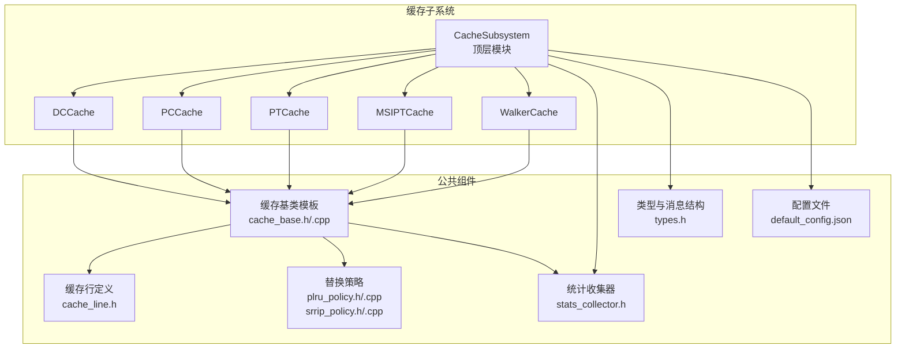
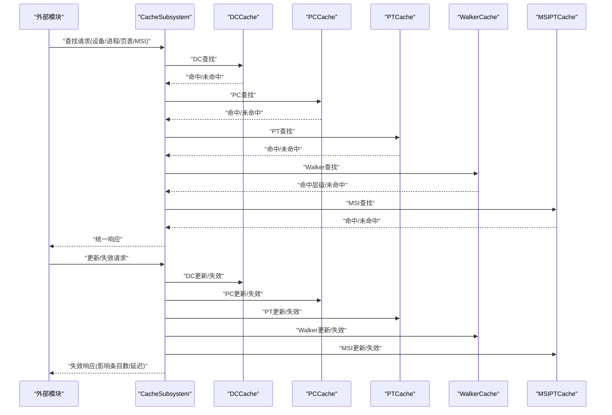
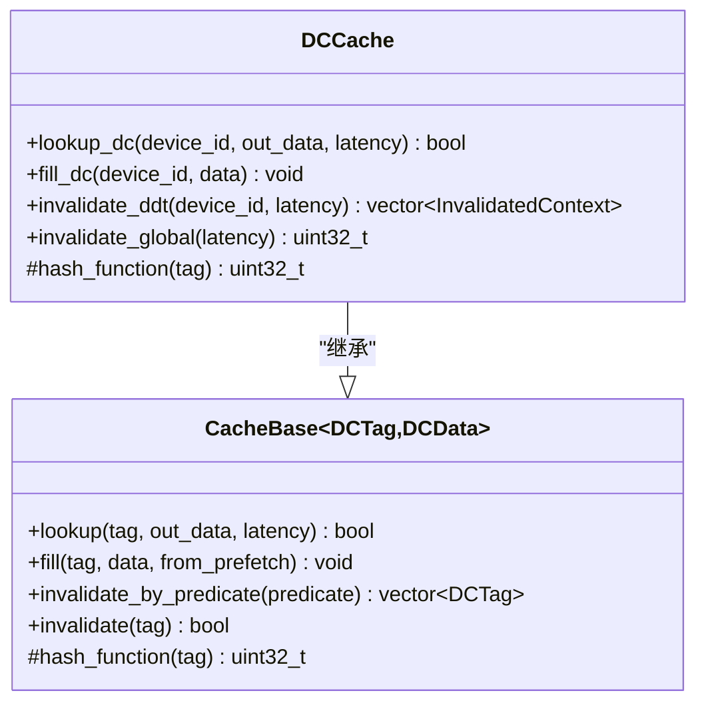
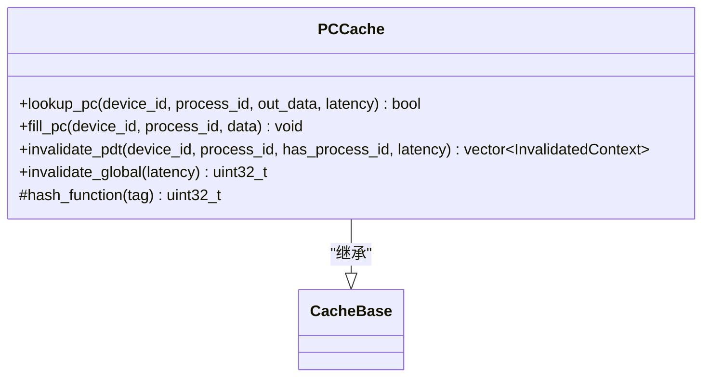
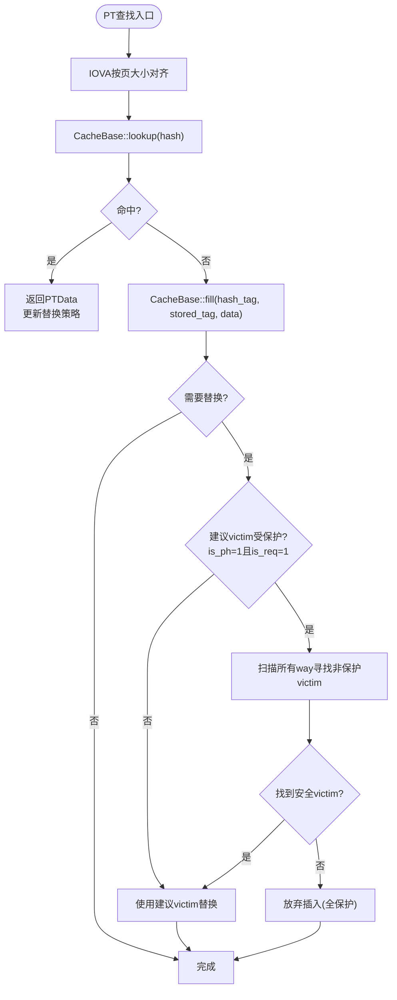
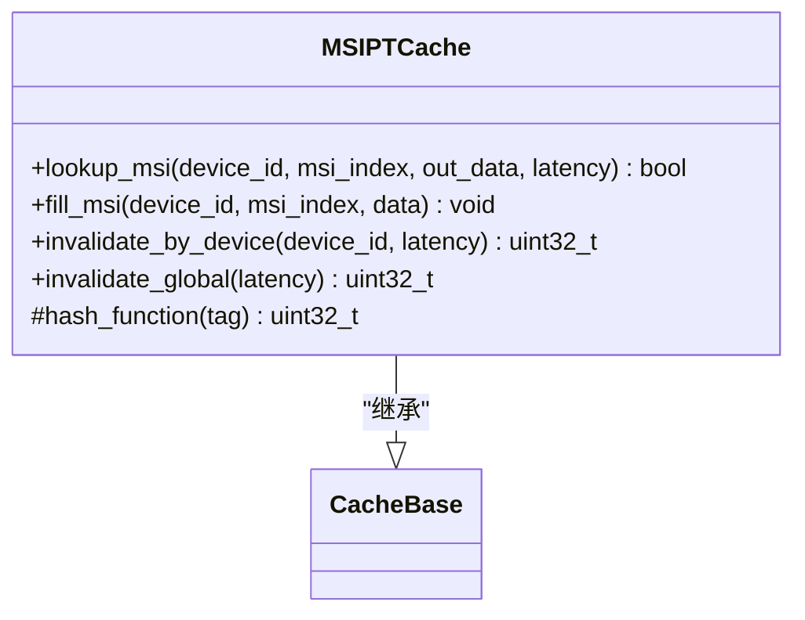
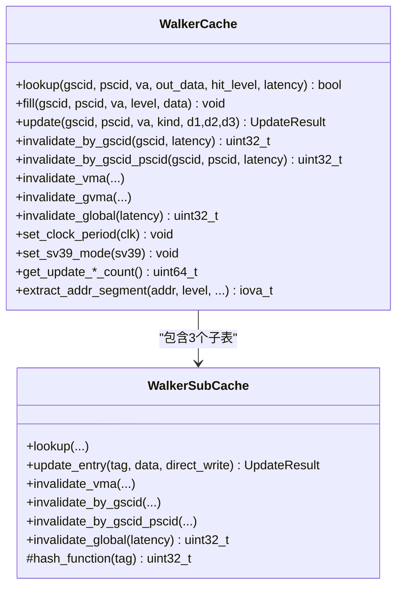
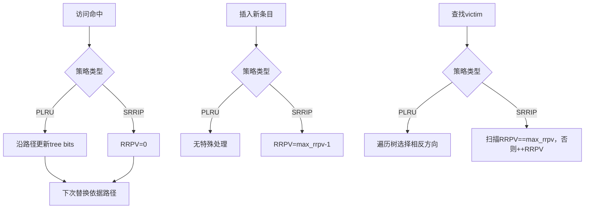
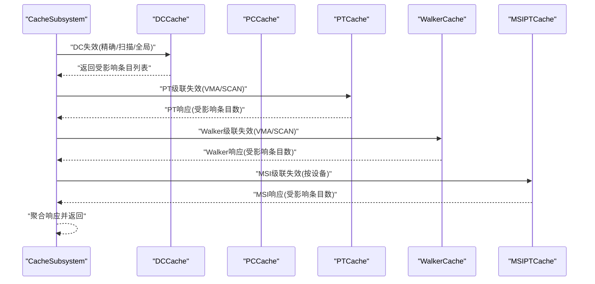
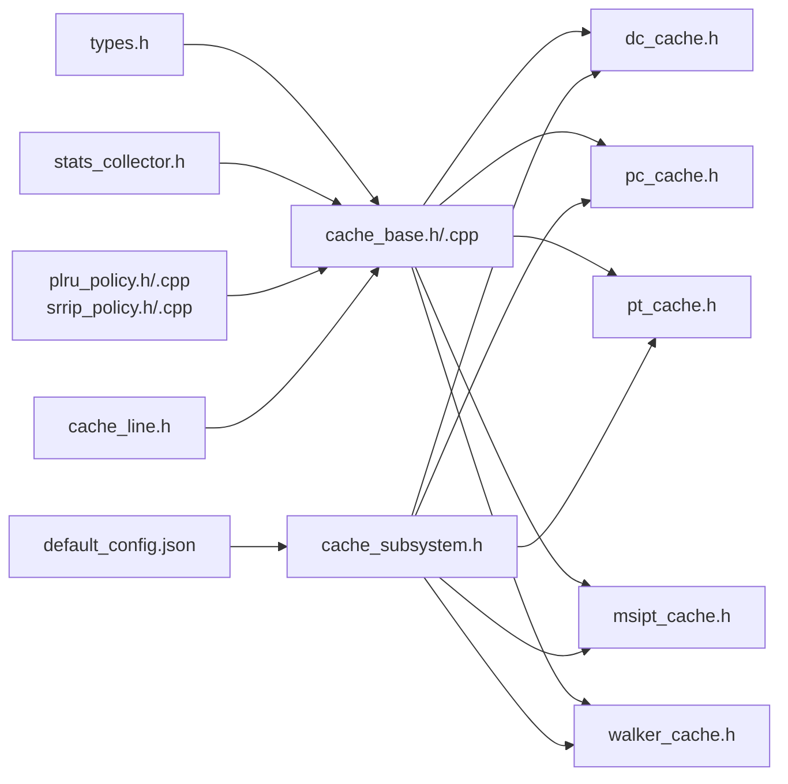

# 缓存系统

<cite>
**本文档引用的文件**
- [cache_base.h](file://iommu/cache_src/cache/cache_base.h)
- [cache_base.cpp](file://iommu/cache_src/cache/cache_base.cpp)
- [cache_line.h](file://iommu/cache_src/cache/cache_line.h)
- [dc_cache.h](file://iommu/cache_src/cache/dc_cache.h)
- [pc_cache.h](file://iommu/cache_src/cache/pc_cache.h)
- [pt_cache.h](file://iommu/cache_src/cache/pt_cache.h)
- [msipt_cache.h](file://iommu/cache_src/cache/msipt_cache.h)
- [walker_cache.h](file://iommu/cache_src/cache/walker_cache.h)
- [plru_policy.h](file://iommu/cache_src/replacement/plru_policy.h)
- [plru_policy.cpp](file://iommu/cache_src/replacement/plru_policy.cpp)
- [srrip_policy.h](file://iommu/cache_src/replacement/srrip_policy.h)
- [srrip_policy.cpp](file://iommu/cache_src/replacement/srrip_policy.cpp)
- [types.h](file://iommu/cache_src/common/types.h)
- [stats_collector.h](file://iommu/cache_src/common/stats_collector.h)
- [default_config.json](file://iommu/cache_config/default_config.json)
- [cache_subsystem.h](file://iommu/cache_src/subsystem/cache_subsystem.h)
</cite>

## 目录
1. [简介](#简介)
2. [项目结构](#项目结构)
3. [核心组件](#核心组件)
4. [架构总览](#架构总览)
5. [详细组件分析](#详细组件分析)
6. [依赖关系分析](#依赖关系分析)
7. [性能考量](#性能考量)
8. [故障排查指南](#故障排查指南)
9. [结论](#结论)
10. [附录](#附录)

## 简介
本文件面向IOMMU缓存系统的开发者与使用者，系统性阐述四层缓存架构：设备上下文缓存(DC)、进程上下文缓存(PC)、页表缓存(PT)、MSI页表缓存(MSIPT)，以及页表遍历缓存(Walker)的设计与实现。内容涵盖缓存组织结构、数据布局与索引机制，替换策略(PLRU、SRRIP)的选择原理与性能影响，缓存一致性维护与失效传播流程，配置参数与性能调优建议，以及命中率分析与性能监控方法。

## 项目结构
IOMMU缓存子系统采用SystemC模块化设计，核心目录组织如下：
- cache/cache：各缓存类型的实现（DC/PC/PT/MSIPT/Walker）
- cache/common：公共类型、统计收集器、JSON配置解析等
- cache/replacement：替换策略（PLRU/SRRIP）
- cache/subsystem：顶层缓存子系统，负责请求/响应队列、失效流水线与任务跟踪
- cache_config：默认配置文件

图表来源
- [cache_subsystem.h:19-189](file://iommu/cache_src/subsystem/cache_subsystem.h#L19-L189)
- [cache_base.h:26-224](file://iommu/cache_src/cache/cache_base.h#L26-L224)
- [cache_line.h:69-103](file://iommu/cache_src/cache/cache_line.h#L69-L103)
- [plru_policy.h:10-33](file://iommu/cache_src/replacement/plru_policy.h#L10-L33)
- [srrip_policy.h:10-33](file://iommu/cache_src/replacement/srrip_policy.h#L10-L33)
- [stats_collector.h:107-191](file://iommu/cache_src/common/stats_collector.h#L107-L191)
- [types.h:584-627](file://iommu/cache_src/common/types.h#L584-L627)
- [default_config.json:1-69](file://iommu/cache_config/default_config.json#L1-L69)

章节来源
- [cache_subsystem.h:19-189](file://iommu/cache_src/subsystem/cache_subsystem.h#L19-L189)
- [types.h:584-627](file://iommu/cache_src/common/types.h#L584-L627)
- [default_config.json:1-69](file://iommu/cache_config/default_config.json#L1-L69)

## 核心组件
- 缓存基类模板CacheBase：提供统一的查找、填充、失效接口，封装替换策略、仲裁与延迟建模，并集成统计收集。
- 四类专用缓存：DC、PC、PT、MSIPT，均继承自CacheBase，各自实现特定的标签结构与散列函数。
- Walker缓存：包含三层子表（PTWc_1/2/3），分别缓存不同级别的页表中间结果，支持查询、填充与多级更新。
- 替换策略：PLRU（伪LRU树）、SRRIP（静态重引用间隔预测），在构造时按配置选择。
- 统计与配置：StatsCollector提供命中率、IOPS、延迟直方图等指标；GlobalConfig/CacheConfig描述缓存规模与延迟参数。

章节来源
- [cache_base.h:26-224](file://iommu/cache_src/cache/cache_base.h#L26-L224)
- [cache_line.h:69-103](file://iommu/cache_src/cache/cache_line.h#L69-L103)
- [plru_policy.h:10-33](file://iommu/cache_src/replacement/plru_policy.h#L10-L33)
- [srrip_policy.h:10-33](file://iommu/cache_src/replacement/srrip_policy.h#L10-L33)
- [stats_collector.h:107-191](file://iommu/cache_src/common/stats_collector.h#L107-L191)
- [types.h:584-627](file://iommu/cache_src/common/types.h#L584-L627)

## 架构总览
缓存子系统通过顶层模块CacheSubsystem对外暴露请求/响应FIFO接口，内部为每个缓存实例提供独立的worker线程或统一轮询调度，确保查找、更新、失效三类操作的并发与有序。失效命令支持全局与精确两种模式，并通过级联机制触发下游缓存的失效。

图表来源
- [cache_subsystem.h:34-136](file://iommu/cache_src/subsystem/cache_subsystem.h#L34-L136)
- [cache_base.h:38-51](file://iommu/cache_src/cache/cache_base.h#L38-L51)

## 详细组件分析

### DC缓存（设备上下文）
- 功能：缓存设备上下文信息，支持按device_id查找与填充，提供DDT级联失效能力。
- 标签与散列：DCTag仅包含device_id，散列函数基于设备号。
- 失效传播：invalidate_ddt返回受影响的{gscid, pscid}集合，供级联触发PT/Walker/MSIPT失效。

图表来源
- [dc_cache.h:8-31](file://iommu/cache_src/cache/dc_cache.h#L8-L31)
- [cache_base.h:26-150](file://iommu/cache_src/cache/cache_base.h#L26-L150)

章节来源
- [dc_cache.h:8-31](file://iommu/cache_src/cache/dc_cache.h#L8-L31)
- [cache_line.h:12-15](file://iommu/cache_src/cache/cache_line.h#L12-L15)

### PC缓存（进程上下文）
- 功能：缓存进程上下文信息，支持按(device_id, process_id)查找与填充，提供PDT级联失效能力。
- 标签与散列：PCTag包含device_id与process_id，散列函数综合两者。
- 失效传播：invalidate_pdt返回受影响的{gscid, pscid}集合，用于PT/Walker级联失效。

图表来源
- [pc_cache.h:8-33](file://iommu/cache_src/cache/pc_cache.h#L8-L33)
- [cache_base.h:26-150](file://iommu/cache_src/cache/cache_base.h#L26-L150)

章节来源
- [pc_cache.h:8-33](file://iommu/cache_src/cache/pc_cache.h#L8-L33)
- [cache_line.h:17-23](file://iommu/cache_src/cache/cache_line.h#L17-L23)

### PT缓存（页表缓存）
- 功能：缓存页表项(spte/gpte)及保留字段，支持按(gscid, pscid, iova, stage, sv48, gstage_x4)查找与填充。
- 去重与预取：支持占位缓存行插入、批量更新占位为常规缓存行、直接更新占位缓存行等高级接口，保护is_req=1的占位不被替换。
- 失效策略：支持VMA/GVMA按范围失效，按gscid/pscid批量失效，以及全局失效。
- 索引与对齐：IOVA按页大小对齐后参与索引；保留字段承载翻译阶段、页大小、SV48标志等。

图表来源
- [pt_cache.h:18-80](file://iommu/cache_src/cache/pt_cache.h#L18-L80)
- [cache_base.h:354-472](file://iommu/cache_src/cache/cache_base.h#L354-L472)

章节来源
- [pt_cache.h:8-85](file://iommu/cache_src/cache/pt_cache.h#L8-L85)
- [cache_line.h:33-45](file://iommu/cache_src/cache/cache_line.h#L33-L45)
- [cache_base.h:354-472](file://iommu/cache_src/cache/cache_base.h#L354-L472)

### MSIPT缓存（MSI页表缓存）
- 功能：缓存MSI页表项，支持按(device_id, msi_index)查找与填充，提供按设备批量失效。
- 标签与散列：MSIPTTag包含device_id与msi_index。

图表来源
- [msipt_cache.h:8-27](file://iommu/cache_src/cache/msipt_cache.h#L8-L27)
- [cache_base.h:26-150](file://iommu/cache_src/cache/cache_base.h#L26-L150)

章节来源
- [msipt_cache.h:8-32](file://iommu/cache_src/cache/msipt_cache.h#L8-L32)
- [cache_line.h:25-31](file://iommu/cache_src/cache/cache_line.h#L25-L31)

### Walker缓存（页表遍历缓存）
- 结构：包含三层子表PTWc_1/2/3，分别缓存不同级别的页表中间结果。PTWc_1为直接映射，PTWc_2为2路组相联，PTWc_3为4路组相联。
- 查询：lookup不指定层级，内部按3>2>1顺序查询，命中层级通过out_data返回。
- 更新：update根据更新类型决定更新PTWc_1/2/3组合，并统计更新次数。
- 失效：支持按gscid、gscid+pscid、VMA/GVMA精确或扫描失效。

图表来源
- [walker_cache.h:15-141](file://iommu/cache_src/cache/walker_cache.h#L15-L141)
- [cache_base.h:26-150](file://iommu/cache_src/cache/cache_base.h#L26-L150)

章节来源
- [walker_cache.h:15-141](file://iommu/cache_src/cache/walker_cache.h#L15-L141)
- [cache_line.h:47-64](file://iommu/cache_src/cache/cache_line.h#L47-L64)

### 替换策略（PLRU与SRRIP）
- PLRU（伪LRU树）：每个set使用(num_ways-1)个tree bit表示近似访问顺序，访问时沿路径更新tree bits，淘汰时依据路径选择相反方向的子树。
- SRRIP（静态重引用间隔预测）：每个line维护M-bit RRPV，命中置0，插入置max_rrpv-1，淘汰循环扫描寻找max_rrpv，未找到则所有RRPV+1。
- 选择原则：多路组相联推荐SRRIP以提升命中率；直接映射或1路退化场景可用PLRU；部分Walker子表采用“none”策略（直接映射）。

图表来源
- [plru_policy.h:10-33](file://iommu/cache_src/replacement/plru_policy.h#L10-L33)
- [plru_policy.cpp:56-70](file://iommu/cache_src/replacement/plru_policy.cpp#L56-L70)
- [srrip_policy.h:10-33](file://iommu/cache_src/replacement/srrip_policy.h#L10-L33)
- [srrip_policy.cpp:15-54](file://iommu/cache_src/replacement/srrip_policy.cpp#L15-L54)

章节来源
- [plru_policy.h:10-33](file://iommu/cache_src/replacement/plru_policy.h#L10-L33)
- [plru_policy.cpp:56-70](file://iommu/cache_src/replacement/plru_policy.cpp#L56-L70)
- [srrip_policy.h:10-33](file://iommu/cache_src/replacement/srrip_policy.h#L10-L33)
- [srrip_policy.cpp:15-54](file://iommu/cache_src/replacement/srrip_policy.cpp#L15-L54)

### 缓存一致性与失效传播
- 级联失效：DC/PC失效后，CacheSubsystem将生成级联失效消息，推送至PT/Walker/MSIPT的失效FIFO，确保一致性。
- 失效模式：支持精确（hash定位set后逐way比较）、扫描（逐set扫描）、全局（全表清空）三种模式。
- 流水线：顶层模块提供失效请求/响应FIFO，内部按命令类型驱动各缓存执行失效，并聚合响应。

图表来源
- [cache_subsystem.h:1258-1282](file://iommu/cache_src/subsystem/cache_subsystem.h#L1258-L1282)
- [cache_base.h:475-604](file://iommu/cache_src/cache/cache_base.h#L475-L604)

章节来源
- [cache_subsystem.h:1258-1282](file://iommu/cache_src/subsystem/cache_subsystem.h#L1258-L1282)
- [types.h:119-146](file://iommu/cache_src/common/types.h#L119-L146)

## 依赖关系分析
- 组件耦合：各缓存均依赖CacheBase模板，共享替换策略、仲裁与统计接口；顶层CacheSubsystem协调各缓存的请求/响应与失效流水线。
- 外部依赖：SystemC用于仿真建模；JSON配置文件提供运行时参数；公共类型与消息结构贯穿所有模块。
- 潜在风险：PT缓存的占位插入保护逻辑在全保护情况下会放弃插入，需结合配置与工作负载评估影响。

图表来源
- [cache_base.h:4-17](file://iommu/cache_src/cache/cache_base.h#L4-L17)
- [types.h:1-17](file://iommu/cache_src/common/types.h#L1-L17)
- [stats_collector.h:107-191](file://iommu/cache_src/common/stats_collector.h#L107-L191)
- [plru_policy.h:4-7](file://iommu/cache_src/replacement/plru_policy.h#L4-L7)
- [srrip_policy.h:4-7](file://iommu/cache_src/replacement/srrip_policy.h#L4-L7)
- [cache_line.h:4-6](file://iommu/cache_src/cache/cache_line.h#L4-L6)
- [cache_subsystem.h:9-16](file://iommu/cache_src/subsystem/cache_subsystem.h#L9-L16)
- [default_config.json:1-69](file://iommu/cache_config/default_config.json#L1-L69)

章节来源
- [cache_base.h:4-17](file://iommu/cache_src/cache/cache_base.h#L4-L17)
- [cache_subsystem.h:9-16](file://iommu/cache_src/subsystem/cache_subsystem.h#L9-L16)
- [default_config.json:1-69](file://iommu/cache_config/default_config.json#L1-L69)

## 性能考量
- 命中率与替换策略：多路组相联推荐SRRIP；Walker子表因容量较小采用PLRU或直接映射。M_bits越大，SRRIP对近期访问的敏感度下降，可能提升长期局部性。
- 并发与仲裁：CacheBase内置WRR仲裁，lookup/fill/invalidation按权重轮转，避免饥饿；可通过调整仲裁延迟与访问路径延迟平衡吞吐与公平性。
- PT去重与预取：占位插入保护避免替换关键预取占位；批量更新减少多次查找开销；合理设置预取深度与启用条件可提升命中率。
- 统计指标：命中率、IOPS、延迟直方图、阶段分类统计（REQUEST/UPDATE/PTW Monitor）与区间命中率可用于性能分析与回归对比。

章节来源
- [cache_base.h:244-260](file://iommu/cache_src/cache/cache_base.h#L244-L260)
- [stats_collector.h:13-105](file://iommu/cache_src/common/stats_collector.h#L13-L105)
- [pt_cache.h:48-73](file://iommu/cache_src/cache/pt_cache.h#L48-L73)

## 故障排查指南
- 命中率异常偏低：检查替换策略配置（SRRIP vs PLRU）、M_bits、num_sets/num_ways；确认是否存在大量扫描失效导致的抖动。
- 插入失败（PT占位）：关注“全保护”告警，评估预取深度与缓冲区容量；必要时放宽保护条件或增大缓存规模。
- 失效未生效：核对失效模式（精确/扫描/全局）与路由键（gscid/pscid/iova），确认级联失效是否正确下发至PT/Walker/MSIPT。
- 性能退化：查看阶段分类统计与队列等待时间，识别瓶颈路径；调整仲裁权重或访问延迟参数。

章节来源
- [cache_base.h:402-450](file://iommu/cache_src/cache/cache_base.h#L402-L450)
- [cache_subsystem.h:1103-1256](file://iommu/cache_src/subsystem/cache_subsystem.h#L1103-L1256)
- [stats_collector.h:114-153](file://iommu/cache_src/common/stats_collector.h#L114-L153)

## 结论
IOMMU缓存系统通过四层缓存与Walker缓存协同，结合PLRU/SRRIP替换策略与完善的统计监控，实现了高效的一致性保障与性能可观测性。针对不同工作负载，合理配置缓存规模、替换策略与失效模式，可显著提升命中率与整体吞吐。

## 附录

### 缓存配置参数说明
- 全局与时序参数：仲裁延迟、哈希/读集/比较/写入等延迟拍数，直接影响访问时延与吞吐。
- 各缓存参数：num_sets、num_ways、replacement（plru/srrip/none）、SRRIP的M比特数。
- Walker子表：PTWc_1/2/3的num_ways与replacement策略。
- 统计参数：输出文件、延迟直方图开关、任务跟踪等级与直方图bin宽度。

章节来源
- [types.h:584-627](file://iommu/cache_src/common/types.h#L584-L627)
- [default_config.json:1-69](file://iommu/cache_config/default_config.json#L1-L69)

### 性能调优指南
- 命中率优化：增大num_sets/num_ways；对热点区域采用SRRIP并适当增大M_bits；开启预取并合理设置深度。
- 吞吐优化：平衡仲裁权重与访问延迟；避免频繁扫描失效；利用批量更新减少查找次数。
- 监控与回归：定期导出统计报告，关注阶段分类与区间命中率变化，建立回归基线。

章节来源
- [stats_collector.h:171-191](file://iommu/cache_src/common/stats_collector.h#L171-L191)
- [cache_base.h:154-160](file://iommu/cache_src/cache/cache_base.h#L154-L160)