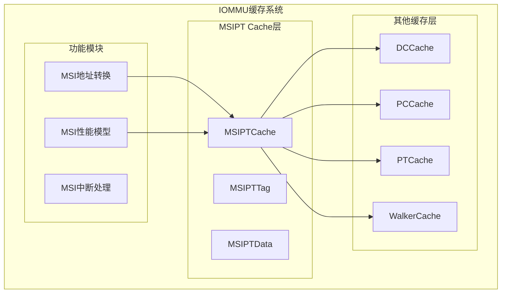
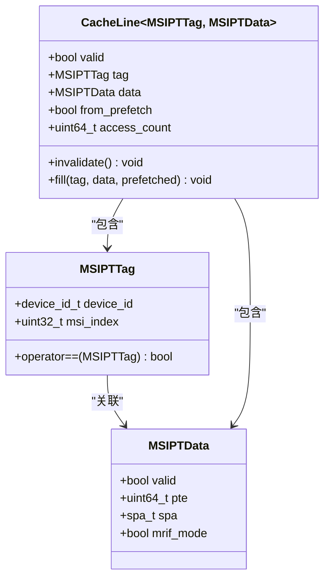
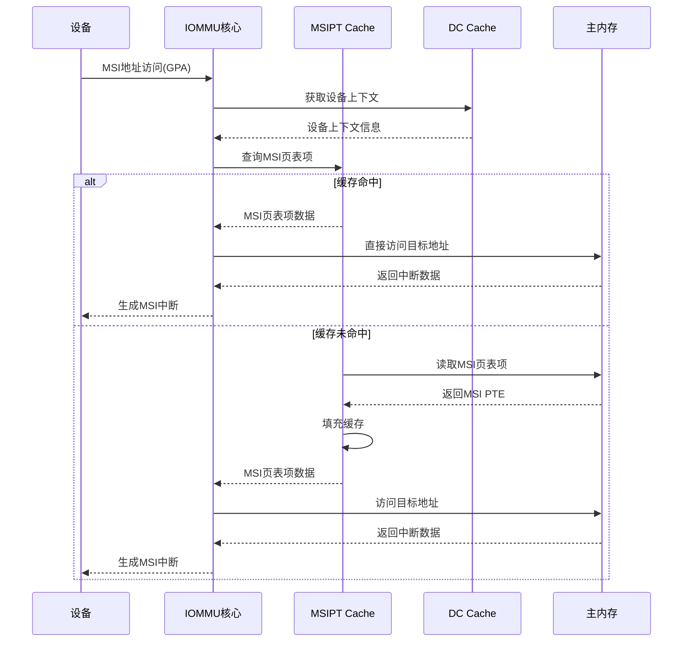
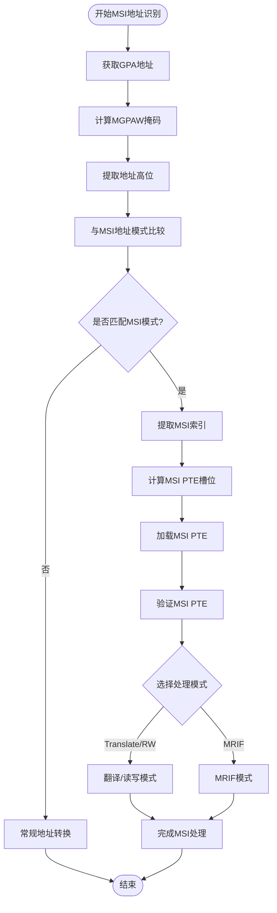
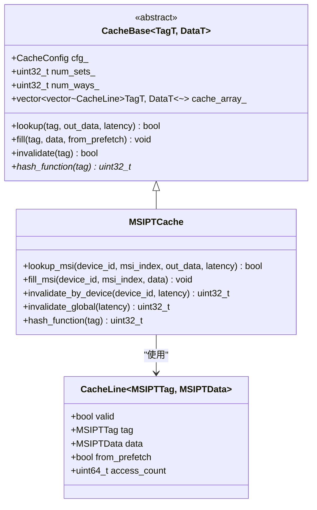
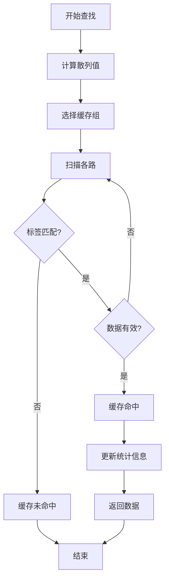
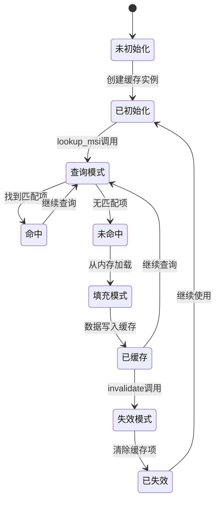
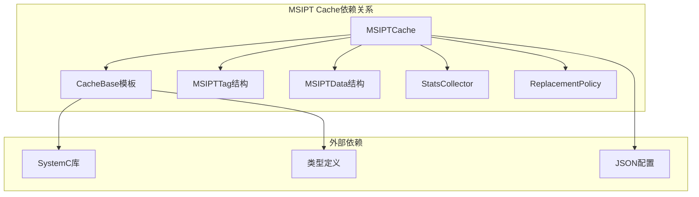
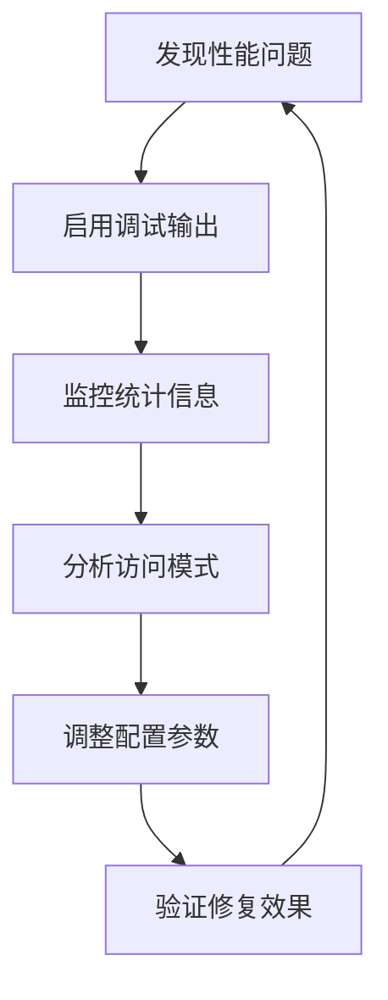

# MSI页表缓存(MSIPT Cache)

<cite>
**本文档引用的文件**
- [msipt_cache.h](file://iommu/cache_src/cache/msipt_cache.h)
- [msipt_cache.cpp](file://iommu/cache_src/cache/msipt_cache.cpp)
- [cache_base.h](file://iommu/cache_src/cache/cache_base.h)
- [cache_line.h](file://iommu/cache_src/cache/cache_line.h)
- [types.h](file://iommu/cache_src/common/types.h)
- [cache_subsystem.h](file://iommu/cache_src/subsystem/cache_subsystem.h)
- [iommu_msi_trans.cc](file://iommu/iommu_fun_model/iommu_msi_trans.cc)
- [iommu_perf_msipt_cache.cc](file://iommu/iommu_perf_model/iommu_perf_msipt_cache.cc)
- [iommu_interrupt.hh](file://iommu/include/iommu_interrupt.hh)
- [default_config.json](file://iommu/cache_config/default_config.json)
- [input_params_example.json](file://iommu/cache_config/input_params_example.json)
</cite>

## 目录
1. [简介](#简介)
2. [项目结构](#项目结构)
3. [核心组件](#核心组件)
4. [架构概览](#架构概览)
5. [详细组件分析](#详细组件分析)
6. [依赖关系分析](#依赖关系分析)
7. [性能考虑](#性能考虑)
8. [故障排除指南](#故障排除指南)
9. [结论](#结论)
10. [附录](#附录)

## 简介

MSI页表缓存(MSIPT Cache)是RISC-V IOMMU架构中的关键组件，专门负责缓存MSI(内存映射中断)页表项，以加速MSI地址转换过程。MSI地址转换是IOMMU处理内存映射中断的关键功能，它允许设备通过内存访问的方式发送中断信号，而不是传统的PCIe中断线。

MSIPT Cache的核心作用包括：
- **加速MSI地址识别**：快速判断给定的GPA是否为MSI地址
- **缓存MSI页表项**：存储MSI页表条目，避免重复的内存访问
- **优化中断路由**：通过缓存机制减少MSI中断处理的延迟
- **支持MRIF模式**：处理内存寄存器中断文件(Memory-Registered Interrupt File)模式

## 项目结构

MSIPT Cache位于IOMMU缓存系统的特定层次中，与DC Cache、PC Cache、PT Cache和Walker Cache共同构成完整的缓存体系。

**图表来源**
- [cache_subsystem.h:18-75](file://iommu/cache_src/subsystem/cache_subsystem.h#L18-L75)
- [msipt_cache.h:8-27](file://iommu/cache_src/cache/msipt_cache.h#L8-L27)

**章节来源**
- [cache_subsystem.h:18-75](file://iommu/cache_src/subsystem/cache_subsystem.h#L18-L75)
- [msipt_cache.h:8-27](file://iommu/cache_src/cache/msipt_cache.h#L8-L27)

## 核心组件

MSIPT Cache的核心组件包括标签结构、数据结构、缓存基类和性能模型。

### MSIPT标签结构

MSIPT标签结构设计用于唯一标识MSI页表项：

**图表来源**
- [cache_line.h:25-31](file://iommu/cache_src/cache/cache_line.h#L25-L31)
- [types.h:167-172](file://iommu/cache_src/common/types.h#L167-L172)

### 缓存配置参数

MSIPT Cache支持多种配置参数，用于优化性能和行为：

| 参数名称 | 默认值 | 描述 |
|---------|--------|------|
| num_sets | 64 | 缓存组数量，决定缓存容量 |
| num_ways | 4 | 每组的缓存行数，决定相联度 |
| replacement | "plru" | 替换策略，支持plru和srrip |
| srrip_m_bits | 2 | SRRIP策略的M位参数 |
| arbiter_latency_cycles | 1 | 仲裁延迟周期数 |
| hash_latency_cycles | 1 | 散列计算延迟 |
| read_set_latency_cycles | 1 | 读取缓存组延迟 |

**章节来源**
- [types.h:573-589](file://iommu/cache_src/common/types.h#L573-L589)
- [default_config.json:32-36](file://iommu/cache_config/default_config.json#L32-L36)

## 架构概览

MSIPT Cache在整个IOMMU架构中的位置和交互关系：

**图表来源**
- [iommu_msi_trans.cc:20-293](file://iommu/iommu_fun_model/iommu_msi_trans.cc#L20-L293)
- [msipt_cache.cpp:11-25](file://iommu/cache_src/cache/msipt_cache.cpp#L11-L25)

## 详细组件分析

### MSI地址识别机制

MSI地址识别是MSIPT Cache的核心功能之一，通过分析GPA的高位部分来确定是否为MSI地址。

**图表来源**
- [iommu_msi_trans.cc:80-115](file://iommu/iommu_fun_model/iommu_msi_trans.cc#L80-L115)
- [iommu_msi_trans.cc:127-173](file://iommu/iommu_fun_model/iommu_msi_trans.cc#L127-L173)

### MSI页表项缓存结构

MSIPT Cache采用标准的缓存结构设计，支持多路组相联：

**图表来源**
- [cache_base.h:26-34](file://iommu/cache_src/cache/cache_base.h#L26-L34)
- [msipt_cache.h:8-27](file://iommu/cache_src/cache/msipt_cache.h#L8-L27)
- [cache_line.h:96-98](file://iommu/cache_src/cache/cache_line.h#L96-L98)

### 查找算法实现

MSIPT Cache的查找算法基于散列函数和精确匹配：

**图表来源**
- [cache_base.h:259-295](file://iommu/cache_src/cache/cache_base.h#L259-L295)
- [msipt_cache.cpp:40-51](file://iommu/cache_src/cache/msipt_cache.cpp#L40-L51)

### 生命周期管理

MSIPT Cache的生命周期管理包括初始化、查询、填充和失效等操作：

**图表来源**
- [msipt_cache.cpp:5-9](file://iommu/cache_src/cache/msipt_cache.cpp#L5-L9)
- [cache_base.h:297-406](file://iommu/cache_src/cache/cache_base.h#L297-L406)

### 更新机制和失效策略

MSIPT Cache支持多种更新和失效策略：

| 策略类型 | 方法 | 描述 |
|---------|------|------|
| 精确更新 | fill_msi | 基于完整标签的精确更新 |
| 设备级失效 | invalidate_by_device | 按设备ID失效所有相关条目 |
| 全局失效 | invalidate_global | 清空整个缓存 |
| 条件失效 | invalidate_by_predicate | 基于谓词函数的条件失效 |

**章节来源**
- [msipt_cache.cpp:19-38](file://iommu/cache_src/cache/msipt_cache.cpp#L19-L38)
- [cache_base.h:409-466](file://iommu/cache_src/cache/cache_base.h#L409-L466)

### MSI中断路由优化

MSIPT Cache通过以下机制优化中断路由：

1. **散列策略优化**：使用设备总线、设备号和功能号的组合进行散列
2. **预取支持**：支持预取机制减少后续访问延迟
3. **统计收集**：记录命中率、替换次数等性能指标
4. **级联失效**：与其他缓存的失效操作协调

**章节来源**
- [msipt_cache.cpp:40-51](file://iommu/cache_src/cache/msipt_cache.cpp#L40-L51)
- [cache_base.h:573-676](file://iommu/cache_src/cache/cache_base.h#L573-L676)

## 依赖关系分析

MSIPT Cache与其他组件的依赖关系：

**图表来源**
- [msipt_cache.h:4](file://iommu/cache_src/cache/msipt_cache.h#L4)
- [cache_base.h:1-17](file://iommu/cache_src/cache/cache_base.h#L1-L17)
- [types.h:14](file://iommu/cache_src/common/types.h#L14)

**章节来源**
- [msipt_cache.h:4](file://iommu/cache_src/cache/msipt_cache.h#L4)
- [cache_base.h:1-17](file://iommu/cache_src/cache/cache_base.h#L1-L17)

## 性能考虑

### 性能特征

MSIPT Cache的性能特征主要体现在以下几个方面：

1. **延迟特性**：
   - 命中延迟：散列计算 + 读取缓存组 + 比较操作
   - 未命中延迟：额外的内存访问延迟
   - 填充延迟：写入新数据的延迟

2. **吞吐量特性**：
   - 支持并发查询和更新操作
   - 仲裁机制确保公平访问
   - 替换策略影响缓存效率

3. **容量规划**：
   - 组数(num_sets)影响缓存容量
   - 路数(num_ways)影响相联度
   - 组相联设计平衡成本和性能

### 性能调优建议

基于默认配置，提供以下调优建议：

1. **缓存大小调整**：
   - 增大num_sets提高缓存容量
   - 增大num_ways提高相联度
   - 平衡内存占用和命中率

2. **替换策略优化**：
   - 对于MSI场景，推荐使用plru策略
   - SRRIP策略适合复杂的访问模式
   - 根据实际工作负载选择最优策略

3. **延迟参数调优**：
   - 调整hash_latency_cycles适应硬件特性
   - 优化read_set_latency_cycles和compare_latency_cycles
   - 平衡延迟和功耗

**章节来源**
- [default_config.json:32-36](file://iommu/cache_config/default_config.json#L32-L36)
- [types.h:573-589](file://iommu/cache_src/common/types.h#L573-L589)

## 故障排除指南

### 常见问题诊断

1. **MSI地址识别失败**：
   - 检查设备上下文配置
   - 验证MSI地址掩码和模式设置
   - 确认MGPAW计算正确性

2. **缓存命中率低**：
   - 分析MSI访问模式
   - 调整缓存大小和相联度
   - 检查替换策略适用性

3. **性能瓶颈**：
   - 监控仲裁等待时间
   - 分析内存访问延迟
   - 评估并发访问模式

### 调试工具和方法

**章节来源**
- [iommu_msi_trans.cc:26-28](file://iommu/iommu_fun_model/iommu_msi_trans.cc#L26-L28)
- [iommu_perf_msipt_cache.cc:11-30](file://iommu/iommu_perf_model/iommu_perf_msipt_cache.cc#L11-L30)

## 结论

MSIPT Cache作为RISC-V IOMMU架构中的关键组件，在MSI地址转换和中断处理中发挥着重要作用。通过合理的缓存设计和优化策略，可以显著提升MSI中断处理的性能和效率。

主要特点总结：
- **专门化设计**：针对MSI场景优化的缓存结构
- **灵活配置**：支持多种配置参数和替换策略
- **性能优化**：通过散列和预取机制提升性能
- **完整集成**：与IOMMU其他组件无缝集成

未来发展方向：
- 实现更智能的预取策略
- 优化大规模MSI场景的性能
- 增强与其他缓存的协调机制

## 附录

### 配置参数详解

MSIPT Cache的完整配置参数集合：

| 参数类别 | 参数名称 | 类型 | 默认值 | 说明 |
|---------|----------|------|--------|------|
| 缓存基础 | num_sets | uint32_t | 64 | 缓存组数量 |
| 缓存基础 | num_ways | uint32_t | 4 | 每组缓存行数 |
| 缓存基础 | replacement | string | "plru" | 替换策略 |
| 缓存基础 | srrip_m_bits | uint32_t | 2 | SRRIP策略参数 |
| 性能参数 | arbiter_latency_cycles | uint32_t | 1 | 仲裁延迟 |
| 性能参数 | hash_latency_cycles | uint32_t | 1 | 散列延迟 |
| 性能参数 | read_set_latency_cycles | uint32_t | 1 | 读取组延迟 |
| 性能参数 | compare_latency_cycles | uint32_t | 1 | 比较延迟 |
| 性能参数 | fill_compute_index_hit_cycles | uint32_t | 1 | 命中填充延迟 |
| 性能参数 | fill_compute_index_invalid_cycles | uint32_t | 2 | 无效填充延迟 |
| 性能参数 | fill_compute_index_replacement_cycles | uint32_t | 4 | 替换填充延迟 |
| 性能参数 | write_way_latency_cycles | uint32_t | 1 | 写入延迟 |
| 性能参数 | invalidation_compare_per_way_cycles | uint32_t | 1 | 失效比较延迟 |

### 代码示例路径

以下是一些关键功能的代码示例路径：

1. **MSI地址识别示例**：
   - [MSI地址识别核心逻辑:80-115](file://iommu/iommu_fun_model/iommu_msi_trans.cc#L80-L115)

2. **MSIPT Cache查找示例**：
   - [MSIPT Cache查找实现:11-17](file://iommu/cache_src/cache/msipt_cache.cpp#L11-L17)

3. **MSI中断处理示例**：
   - [MSI中断生成逻辑:89-106](file://iommu/iommu_fun_model/iommu_interrupt.cc#L89-L106)

4. **缓存配置示例**：
   - [默认配置参数:32-36](file://iommu/cache_config/default_config.json#L32-L36)

**章节来源**
- [input_params_example.json:32-36](file://iommu/cache_config/input_params_example.json#L32-L36)
- [iommu_msi_trans.cc:80-115](file://iommu/iommu_fun_model/iommu_msi_trans.cc#L80-L115)
- [msipt_cache.cpp:11-17](file://iommu/cache_src/cache/msipt_cache.cpp#L11-L17)
- [iommu_interrupt.hh:23-25](file://iommu/include/iommu_interrupt.hh#L23-L25)