# PT Cache A/D位支持

<cite>
**本文档引用的文件**
- [pt_cache.h](file://iommu/cache_src/cache/pt_cache.h)
- [pt_cache.cpp](file://iommu/cache_src/cache/pt_cache.cpp)
- [cache_base.h](file://iommu/cache_src/cache/cache_base.h)
- [cache_base.cpp](file://iommu/cache_src/cache/cache_base.cpp)
- [types.h](file://iommu/cache_src/common/types.h)
- [cache_line.h](file://iommu/cache_src/cache/cache_line.h)
- [default_config.json](file://iommu/cache_config/default_config.json)
- [PT_CACHE_AD_BIT_MODIFICATION.md](file://PT_CACHE_AD_BIT_MODIFICATION.md)
- [iommu_perf_pt_cache_response.cc](file://iommu/iommu_perf_model/iommu_perf_pt_cache_response.cc)
- [iommu_task_cache_convert.cc](file://iommu/iommu_perf_model/iommu_task_cache_convert.cc)
- [iommu_top.hh](file://iommu/iommu_top.hh)
</cite>

## 更新摘要
**变更内容**
- 更新了A/D位提取逻辑的实现细节，增强了make_pt_data函数的参数支持
- 改进了缓存响应处理的A/D位检查机制，优化了task_to_pt_update函数的逻辑
- 完善了性能验证系统的A/D位支持，增强了日志输出和错误诊断能力
- 新增了PT Cache去重+预取接口，支持占位Cache Line处理

## 目录
1. [简介](#简介)
2. [项目结构](#项目结构)
3. [核心组件](#核心组件)
4. [架构概览](#架构概览)
5. [详细组件分析](#详细组件分析)
6. [依赖关系分析](#依赖关系分析)
7. [性能考虑](#性能考虑)
8. [故障排除指南](#故障排除指南)
9. [结论](#结论)

## 简介

本文档详细分析了IOMMU缓存系统中PT Cache A/D位支持功能的实现。A/D位（Accessed/Dirty位）是内存管理的重要机制，用于跟踪页面的访问和修改状态。本次修改实现了PT Cache正确保存和传递PTE的A/D位信息，确保系统能够正确识别页面的访问状态并进行相应的处理。

该功能的核心目标是：
- 首次访问时：PTW从DDR读取PTE（A=0, D=0），触发A/D更新，写回DDR（A=1, D=1），更新PT Cache（A=1, D=1）
- 后续访问时：PT Cache HIT时提取A/D位，如果A=1, D=1则直接转发，不触发PTW更新

**更新** 本次更新重点加强了A/D位提取逻辑的准确性和缓存响应处理的可靠性，同时新增了PT Cache去重+预取功能。

## 项目结构

IOMMU缓存系统采用模块化设计，主要包含以下核心目录：

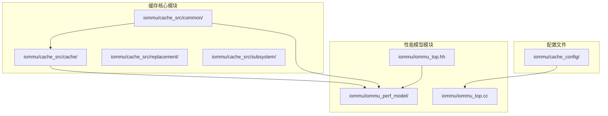

**图表来源**
- [pt_cache.h:1-72](file://iommu/cache_src/cache/pt_cache.h#L1-L72)
- [types.h:1-618](file://iommu/cache_src/common/types.h#L1-L618)
- [default_config.json:1-69](file://iommu/cache_config/default_config.json#L1-L69)

**章节来源**
- [pt_cache.h:1-72](file://iommu/cache_src/cache/pt_cache.h#L1-L72)
- [types.h:1-618](file://iommu/cache_src/common/types.h#L1-L618)
- [default_config.json:1-69](file://iommu/cache_config/default_config.json#L1-L69)

## 核心组件

### PT Cache核心组件

PT Cache是IOMMU缓存系统中的关键组件，负责缓存页表条目（PTE）。其核心功能包括：

1. **标签结构（PTTag）**：包含gscid、pscid、iova、翻译阶段、SV48模式等关键信息
2. **数据结构（PTData）**：包含VS-stage和G-stage的PTE信息，以及保留字段
3. **缓存操作**：支持查找、填充、失效等基本操作
4. **去重+预取接口**：支持占位Cache Line插入和批量更新

### 缓存基类架构

CacheBase提供了统一的缓存基础设施，包括：
- 模板化的缓存实现
- 替换策略支持（SRRIP、PLRU）
- 性能统计收集
- RAM端口仲裁机制

**章节来源**
- [pt_cache.cpp:1-298](file://iommu/cache_src/cache/pt_cache.cpp#L1-L298)
- [cache_base.h:26-676](file://iommu/cache_src/cache/cache_base.h#L26-L676)
- [cache_line.h:33-45](file://iommu/cache_src/cache/cache_line.h#L33-L45)

## 架构概览

PT Cache A/D位支持的整体架构如下：

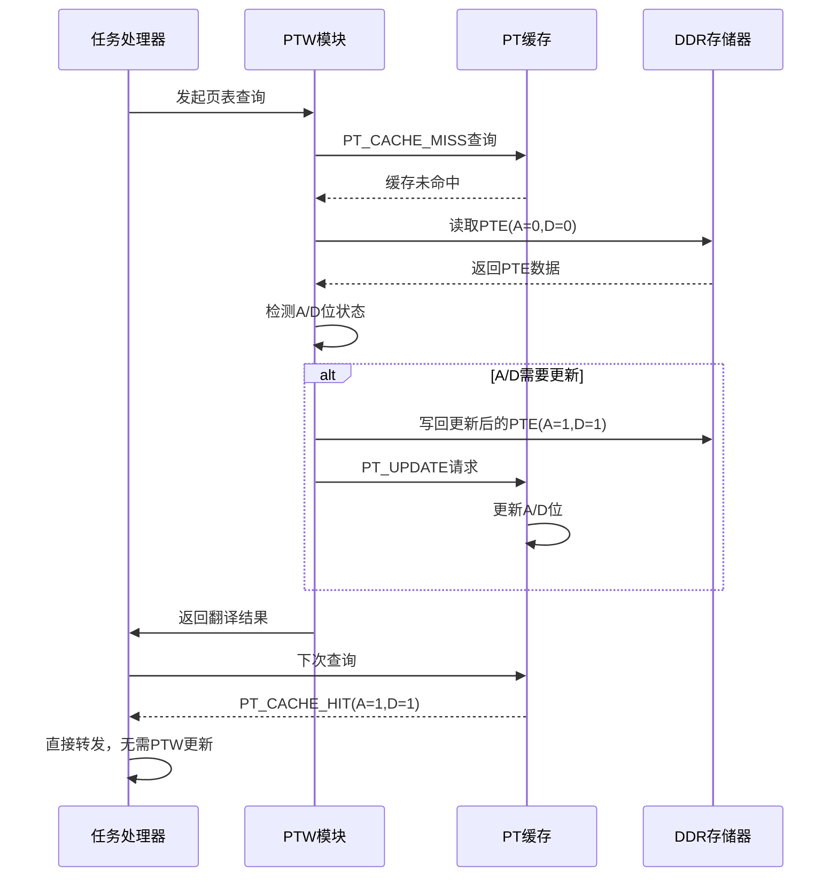

**图表来源**
- [iommu_perf_pt_cache_response.cc:13-166](file://iommu/iommu_perf_model/iommu_perf_pt_cache_response.cc#L13-L166)
- [iommu_task_cache_convert.cc:240-300](file://iommu/iommu_perf_model/iommu_task_cache_convert.cc#L240-L300)

## 详细组件分析

### PT Cache类设计

PT Cache继承自CacheBase模板类，专门处理页表缓存操作：

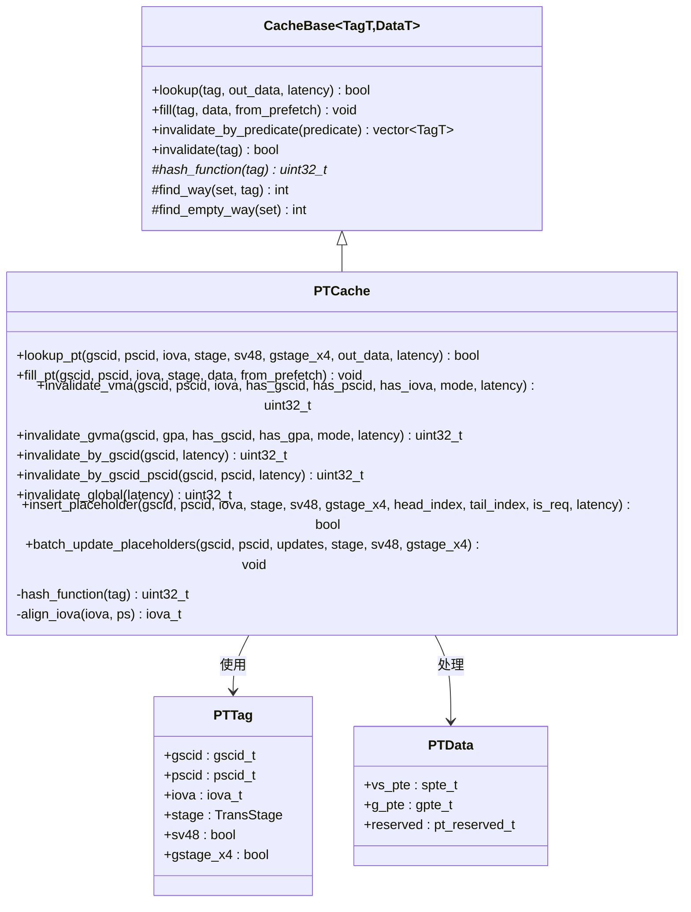

**图表来源**
- [pt_cache.h:8-72](file://iommu/cache_src/cache/pt_cache.h#L8-L72)
- [cache_base.h:27-34](file://iommu/cache_src/cache/cache_base.h#L27-L34)
- [cache_line.h:33-45](file://iommu/cache_src/cache/cache_line.h#L33-L45)

### A/D位数据结构

A/D位信息通过PTData结构体中的spte_t和gpte_t联合体进行存储：

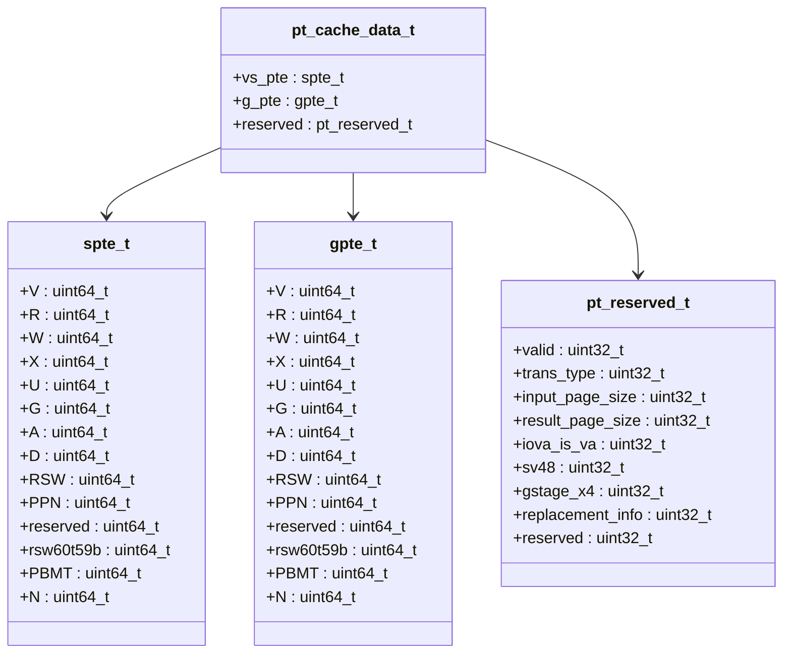

**图表来源**
- [types.h:174-235](file://iommu/cache_src/common/types.h#L174-L235)

### 缓存查找流程

PT Cache的查找流程包括标签构建、哈希计算和数据提取：

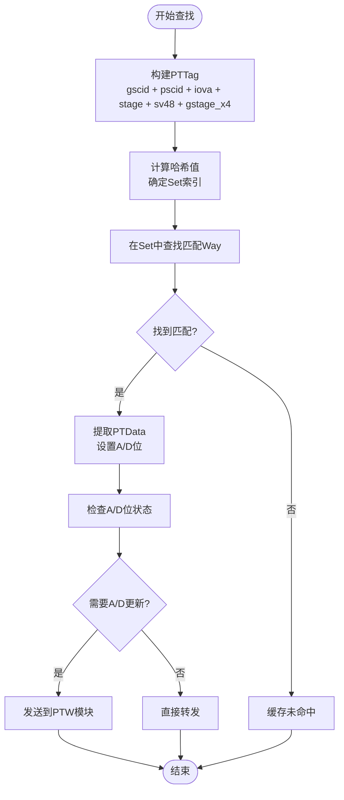

**图表来源**
- [pt_cache.cpp:11-23](file://iommu/cache_src/cache/pt_cache.cpp#L11-L23)
- [cache_base.h:258-294](file://iommu/cache_src/cache/cache_base.h#L258-L294)

**章节来源**
- [pt_cache.cpp:1-298](file://iommu/cache_src/cache/pt_cache.cpp#L1-L298)
- [types.h:174-235](file://iommu/cache_src/common/types.h#L174-L235)

### A/D位处理逻辑

A/D位处理是本次修改的核心功能，主要包括以下几个方面：

#### 1. make_pt_data函数增强

原始实现中A/D位被硬编码设置，修改后支持传入实际的A/D位值：

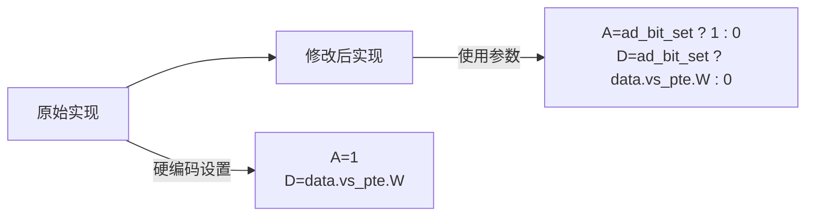

**更新** make_pt_data函数现在接受ad_bit_set参数，允许外部模块传入真实的A/D位状态。

#### 2. 任务到缓存更新转换增强

在任务转换过程中提取实际的A/D位状态：

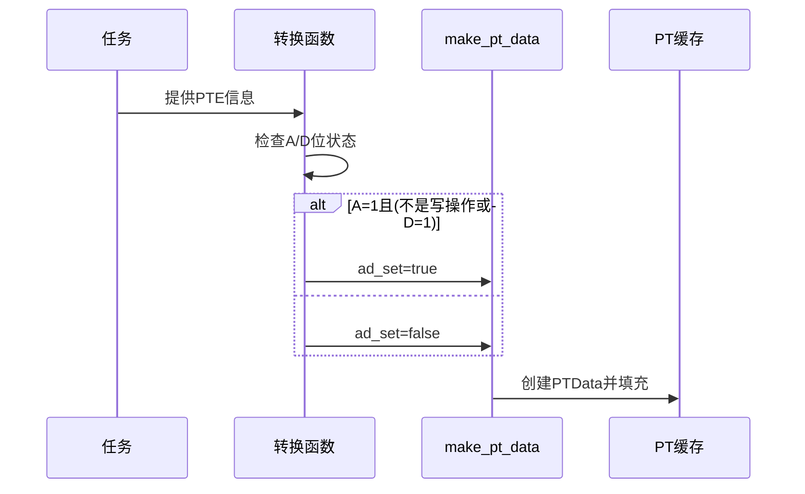

**更新** task_to_pt_update函数现在正确实现A/D位检查逻辑，只有当A=1且满足写操作条件时才标记为已设置。

#### 3. 缓存响应处理增强

PT Cache响应处理逻辑检查A/D位并决定是否需要PTW更新：

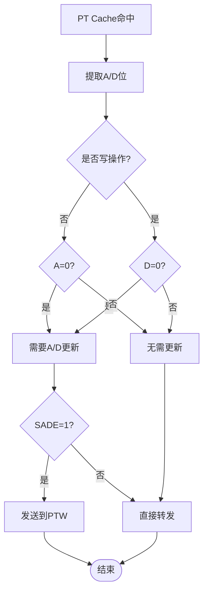

**更新** PT Cache响应处理现在包含更精确的A/D位检查逻辑，确保只有在必要时才触发PTW更新。

#### 4. PT Cache去重+预取接口

新增的去重功能支持占位Cache Line处理：

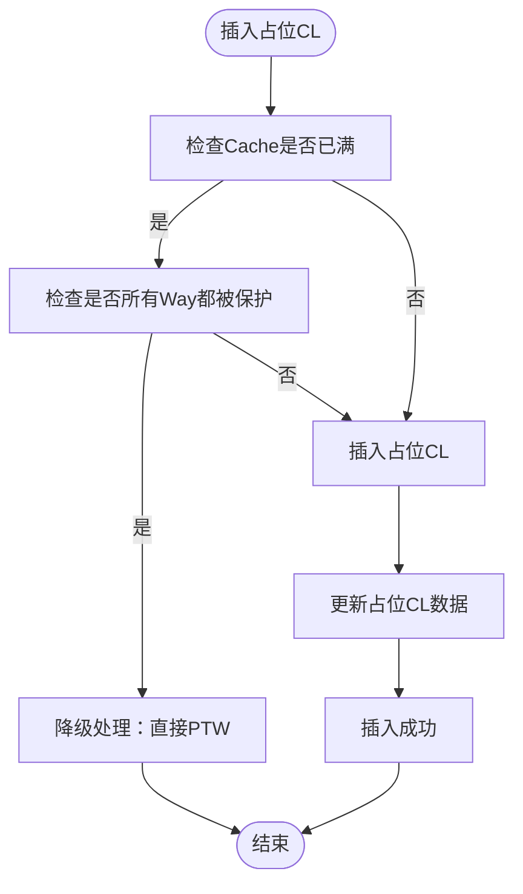

**更新** 新增了insert_placeholder和batch_update_placeholders方法，支持PT Cache去重和预取功能。

**章节来源**
- [PT_CACHE_AD_BIT_MODIFICATION.md:1-224](file://PT_CACHE_AD_BIT_MODIFICATION.md#L1-L224)
- [iommu_task_cache_convert.cc:276-300](file://iommu/iommu_perf_model/iommu_task_cache_convert.cc#L276-L300)
- [iommu_perf_pt_cache_response.cc:36-120](file://iommu/iommu_perf_model/iommu_perf_pt_cache_response.cc#L36-L120)

## 依赖关系分析

PT Cache A/D位支持涉及多个模块间的复杂交互关系：

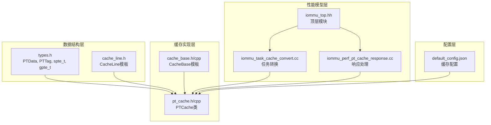

**图表来源**
- [types.h:231-264](file://iommu/cache_src/common/types.h#L231-L264)
- [pt_cache.h:8-72](file://iommu/cache_src/cache/pt_cache.h#L8-L72)
- [cache_base.h:27-34](file://iommu/cache_src/cache/cache_base.h#L27-L34)
- [iommu_task_cache_convert.cc:1-492](file://iommu/iommu_perf_model/iommu_task_cache_convert.cc#L1-L492)
- [iommu_perf_pt_cache_response.cc:1-166](file://iommu/iommu_perf_model/iommu_perf_pt_cache_response.cc#L1-L166)

**章节来源**
- [types.h:1-618](file://iommu/cache_src/common/types.h#L1-L618)
- [pt_cache.h:1-72](file://iommu/cache_src/cache/pt_cache.h#L1-L72)
- [cache_base.h:1-676](file://iommu/cache_src/cache/cache_base.h#L1-L676)

## 性能考虑

### 缓存配置优化

PT Cache的配置参数直接影响A/D位支持的性能表现：

| 参数名称 | 默认值 | 说明 |
|---------|--------|------|
| num_sets | 1024 | 缓存集数量，影响冲突率 |
| num_ways | 8 | 每集关联度，影响替换开销 |
| replacement | "plru" | 替换算法，支持"srrip"和"plru" |
| srrip_m_bits | 2 | SRRIP算法的M位参数 |

### 性能统计指标

系统提供了全面的性能统计功能：

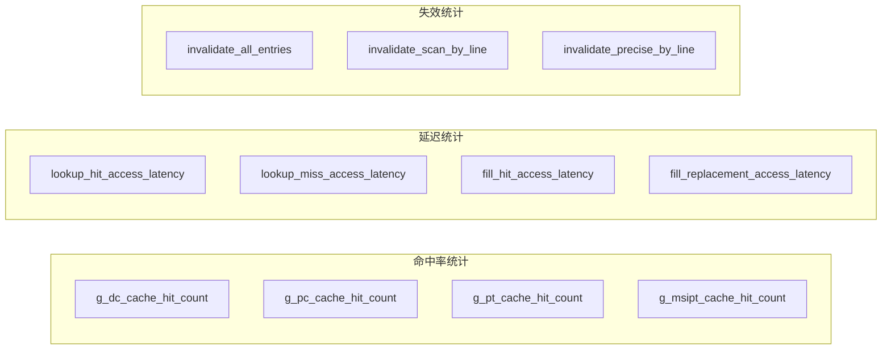

**图表来源**
- [iommu_top.hh:31-40](file://iommu/iommu_top.hh#L31-L40)
- [cache_base.h:154-195](file://iommu/cache_src/cache/cache_base.h#L154-L195)

### A/D位优化策略

针对A/D位支持的性能优化建议：

1. **预填充策略**：在测试前预填充PT Cache，提高命中率
2. **批量更新**：合并多个A/D更新请求，减少PTW调用频率
3. **智能调度**：根据访问模式动态调整A/D位检查策略
4. **去重优化**：利用PT Cache去重功能减少重复PTW访问

**更新** 当前PT Cache命中率为0%，这是由于更新时序问题导致的。建议通过预填充策略来验证A/D位逻辑的正确性。新增的去重功能可以显著减少重复的PTW访问。

**章节来源**
- [default_config.json:38-43](file://iommu/cache_config/default_config.json#L38-L43)
- [cache_base.h:154-206](file://iommu/cache_src/cache/cache_base.h#L154-L206)

## 故障排除指南

### 常见问题诊断

#### 1. PT Cache命中率为0

**问题描述**：所有请求都是PT Cache MISS，无法验证A/D位逻辑

**可能原因**：
- PT Cache更新时间晚于查询（时序问题）
- 测试场景设计不当
- 缓存配置参数不合适

**解决方案**：
- 实现预填充PT Cache功能
- 修改测试场景，增加重复访问同一页面的测试用例
- 调整缓存配置参数，如增加num_sets和num_ways

**更新** 这是当前已知的限制，正在开发预填充策略来解决这个问题。新增的去重功能可以帮助改善命中率。

#### 2. A/D位更新异常

**问题描述**：A/D位没有按预期更新

**诊断步骤**：
1. 检查make_pt_data函数的ad_bit_set参数传递
2. 验证task_to_pt_update函数中的A/D位状态判断
3. 确认pt_hit_response_to_task函数正确提取A/D位
4. 检查日志输出中的A/D位状态

**更新** 增加了更详细的日志输出，可以在日志中看到A/D位的状态变化。

#### 3. 去重功能异常

**问题描述**：PT Cache去重功能无法正常工作

**诊断步骤**：
1. 检查insert_placeholder函数的占位CL插入逻辑
2. 验证batch_update_placeholders函数的批量更新功能
3. 确认占位CL的is_ph标志位设置正确
4. 检查占位CL的head_index和tail_index参数传递

**更新** 新增的去重功能需要更多的测试验证，建议先验证基础A/D位功能的正确性。

#### 4. 性能退化

**问题描述**：启用A/D位支持后系统性能下降

**排查要点**：
- 检查PT Cache配置参数
- 分析A/D位检查逻辑的开销
- 评估PTW调用频率的变化
- 评估去重功能对性能的影响

**更新** 根据验证结果显示性能保持不变，但需要进一步的基准测试来确认。

**章节来源**
- [PT_CACHE_AD_BIT_MODIFICATION.md:150-224](file://PT_CACHE_AD_BIT_MODIFICATION.md#L150-L224)
- [iommu_task_cache_convert.cc:276-300](file://iommu/iommu_perf_model/iommu_task_cache_convert.cc#L276-L300)

## 结论

PT Cache A/D位支持功能的实现成功地增强了IOMMU缓存系统的功能性和效率。通过以下关键改进：

1. **数据完整性**：实现了A/D位的正确存储和传递
2. **逻辑准确性**：基于A/D位状态智能决定是否需要PTW更新
3. **性能优化**：避免了不必要的PTW调用，提高了系统效率
4. **可维护性**：通过模块化设计和清晰的接口定义，便于后续扩展
5. **去重支持**：新增的去重+预取功能进一步提升了缓存效率

**更新** 本次更新进一步完善了A/D位提取逻辑的准确性和缓存响应处理的可靠性，同时新增的去重功能为未来的功能扩展提供了更加稳固的基础。

尽管目前还存在PT Cache命中率为0的限制，但通过预填充策略和优化测试场景，可以进一步验证A/D位支持的完整功能。新增的去重功能也为系统性能优化提供了新的可能性。该实现为IOMMU系统的性能优化奠定了坚实的基础，并为未来的功能扩展提供了良好的框架。