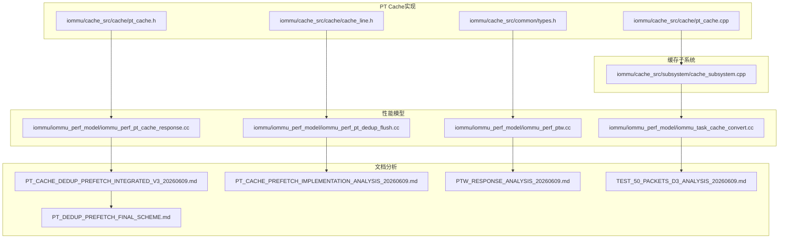
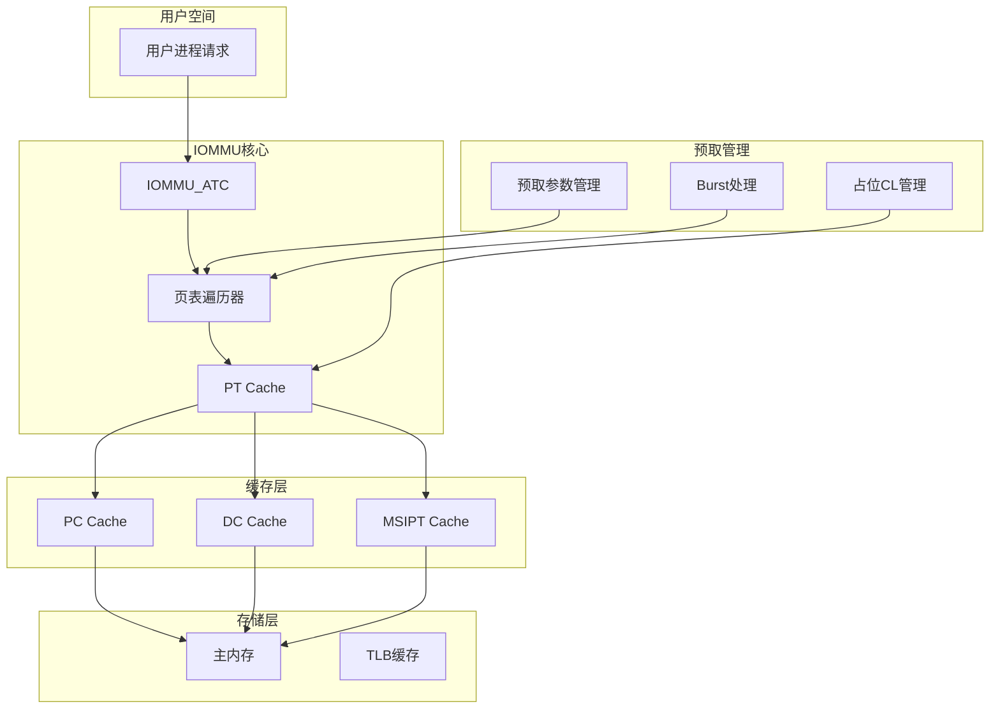
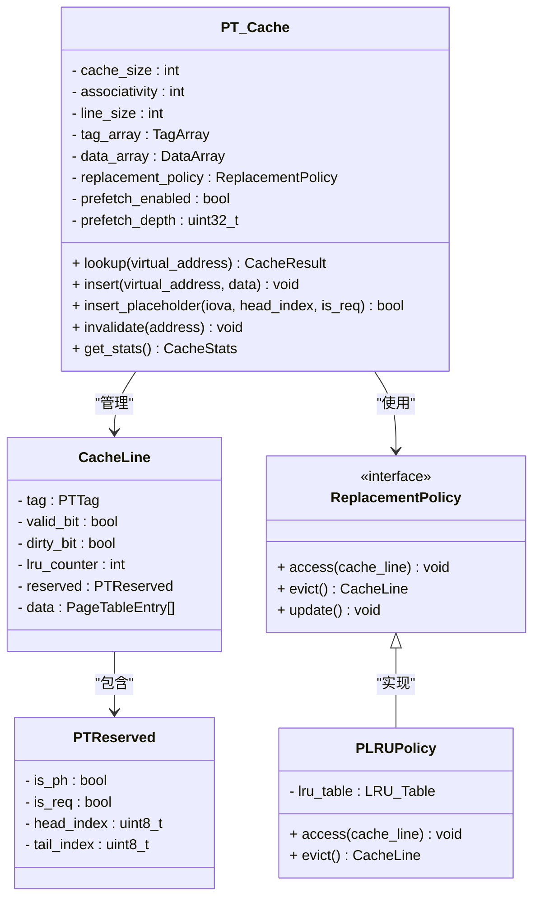
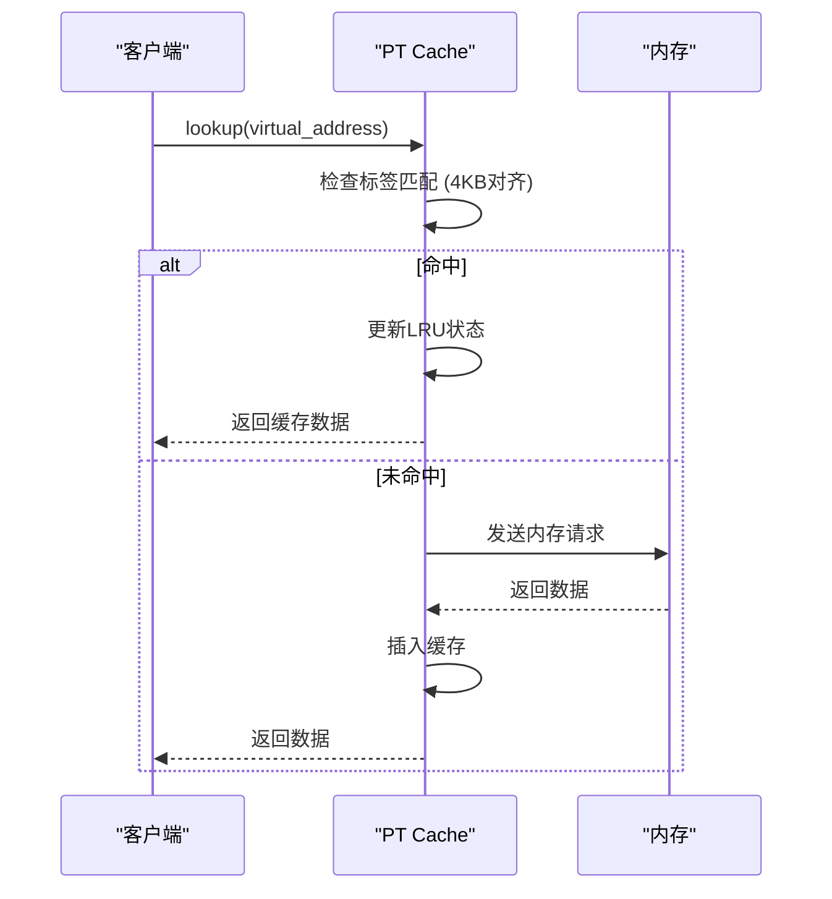
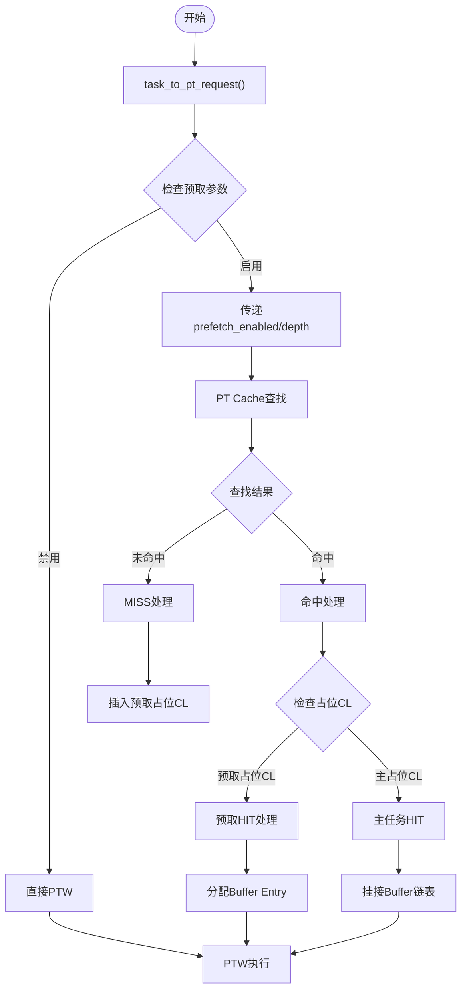
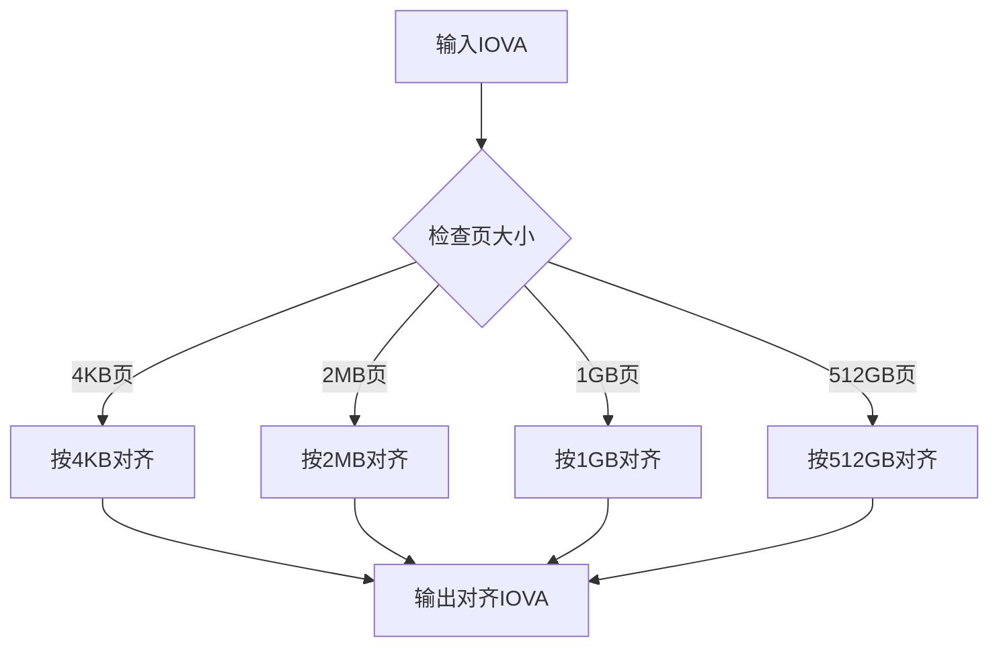
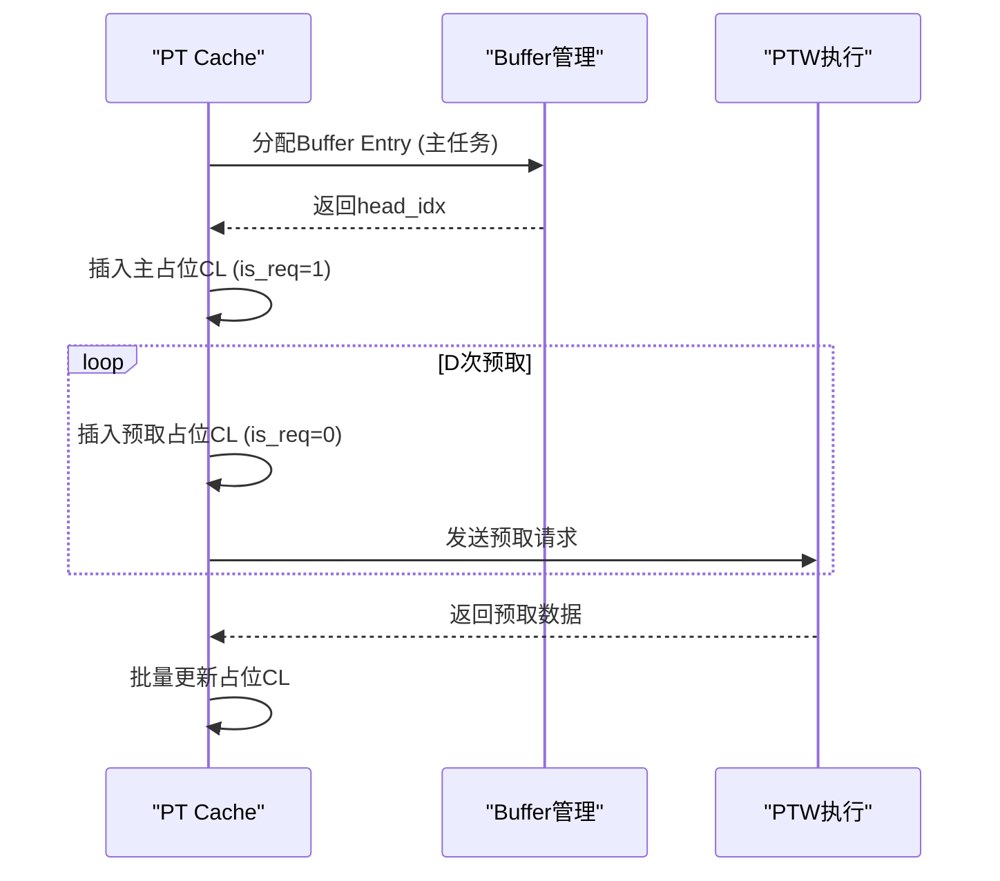
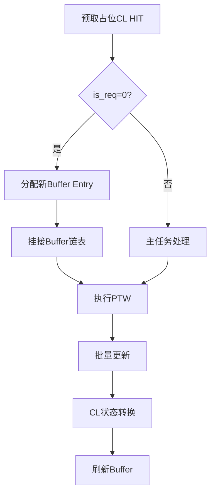
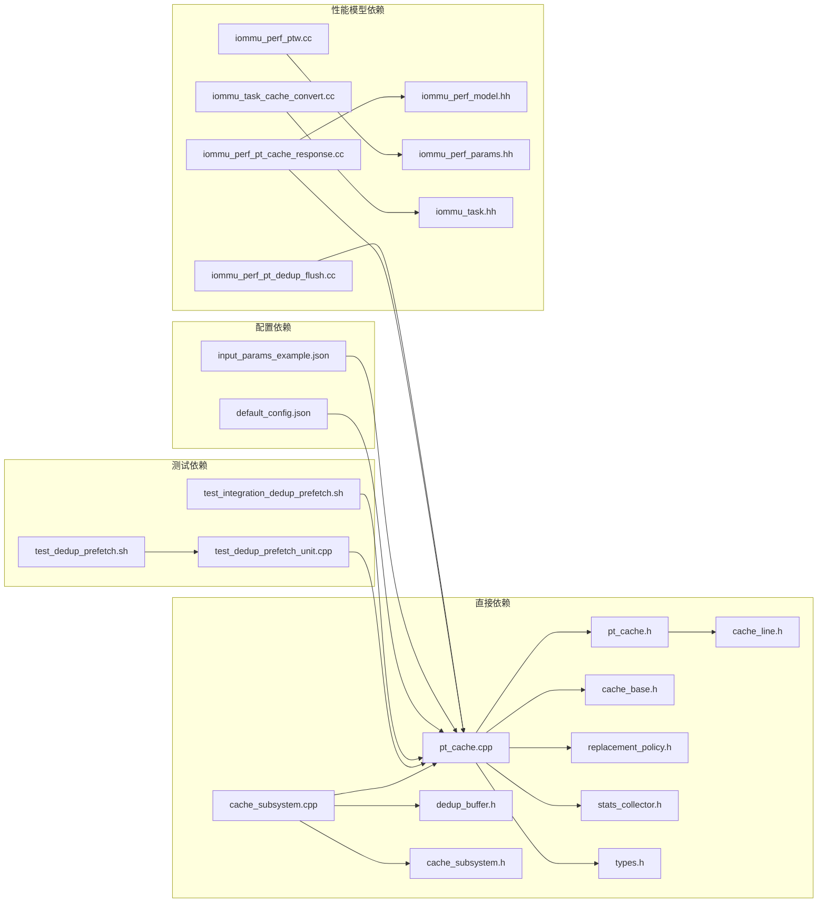

# PT Cache预取实现分析

<cite>
**本文档引用的文件**
- [pt_cache.cpp](file://iommu/cache_src/cache/pt_cache.cpp)
- [pt_cache.h](file://iommu/cache_src/cache/pt_cache.h)
- [cache_subsystem.cpp](file://iommu/cache_src/subsystem/cache_subsystem.cpp)
- [types.h](file://iommu/cache_src/common/types.h)
- [cache_line.h](file://iommu/cache_src/cache/cache_line.h)
- [iommu_perf_pt_cache_response.cc](file://iommu/iommu_perf_model/iommu_perf_pt_cache_response.cc)
- [iommu_perf_pt_dedup_flush.cc](file://iommu/iommu_perf_model/iommu_perf_pt_dedup_flush.cc)
- [iommu_perf_ptw.cc](file://iommu/iommu_perf_model/iommu_perf_ptw.cc)
- [iommu_task_cache_convert.cc](file://iommu/iommu_perf_model/iommu_task_cache_convert.cc)
- [PT_CACHE_DEDUP_PREFETCH_INTEGRATED_V3_20260609.md](file://PT_CACHE_DEDUP_PREFETCH_INTEGRATED_V3_20260609.md)
- [PT_CACHE_PREFETCH_IMPLEMENTATION_ANALYSIS_20260609.md](file://PT_CACHE_PREFETCH_IMPLEMENTATION_ANALYSIS_20260609.md)
- [PTW_RESPONSE_ANALYSIS_20260609.md](file://PTW_RESPONSE_ANALYSIS_20260609.md)
- [TEST_50_PACKETS_D3_ANALYSIS_20260609.md](file://TEST_50_PACKETS_D3_ANALYSIS_20260609.md)
- [PT_DEDUP_PREFETCH_FINAL_SCHEME.md](file://PT_DEDUP_PREFETCH_FINAL_SCHEME.md)
</cite>

## 更新摘要
**所做更改**
- 更新了预取IOVA对齐方式从默认页对齐调整为4KB对齐的实现细节
- 完善了预取参数传播机制的详细分析，包括task到CacheMessage的参数传递
- 优化了预取占位CL插入逻辑，增加了预取占位CL的特殊处理机制
- 增强了V3.0架构下预取功能的完整实现分析

## 目录
1. [引言](#引言)
2. [项目结构](#项目结构)
3. [核心组件](#核心组件)
4. [架构概览](#架构概览)
5. [详细组件分析](#详细组件分析)
6. [依赖关系分析](#依赖关系分析)
7. [性能考虑](#性能考虑)
8. [故障排除指南](#故障排除指南)
9. [结论](#结论)

## 引言

本文档深入分析了IOMMU系统中PT Cache（页表缓存）的预取实现机制。PT Cache是IOMMU第二阶段地址转换过程中的关键组件，负责缓存页表条目以提高地址转换性能。基于V3.0架构的最新实现，本文档重点关注预取IOVA对齐方式调整为4KB对齐、预取参数传播机制更新以及预取占位CL插入逻辑优化等关键变化。

**更新** 基于V3.0架构的完整实现，本次更新重点分析了预取功能的完整实现，包括IOVA对齐策略、参数传播机制和占位CL管理等核心组件。

## 项目结构

该项目采用模块化设计，PT Cache预取功能主要分布在以下目录结构中：

**图表来源**
- [pt_cache.cpp:1-200](file://iommu/cache_src/cache/pt_cache.cpp#L1-L200)
- [cache_subsystem.cpp:1-200](file://iommu/cache_src/subsystem/cache_subsystem.cpp#L1-L200)

**章节来源**
- [pt_cache.cpp:1-200](file://iommu/cache_src/cache/pt_cache.cpp#L1-L200)
- [cache_subsystem.cpp:1-200](file://iommu/cache_src/subsystem/cache_subsystem.cpp#L1-L200)

## 核心组件

### PT Cache基础架构

PT Cache作为IOMMU地址转换流水线中的关键缓存组件，在V3.0架构下实现了完整的预取功能：

#### 缓存结构设计
- **多级缓存层次**：支持页表项缓存和预取缓存的分层架构
- **标签管理**：维护虚拟地址到物理地址的映射关系，支持4KB对齐策略
- **状态管理**：跟踪缓存行的有效性、访问频率等状态信息，包括预取占位CL状态

#### 预取策略实现
- **预测算法**：基于访问模式的历史数据进行页表项预测
- **批量预取**：一次预取多个连续的页表项以提高效率
- **优先级调度**：根据访问频率和重要性对预取请求进行排序
- **4KB对齐策略**：预取IOVA统一按4KB页面对齐，确保预取精度

**更新** V3.0架构下实现了完整的预取功能，包括预取参数传播、占位CL管理和Burst预取响应处理。

**章节来源**
- [pt_cache.cpp:138-168](file://iommu/cache_src/cache/pt_cache.cpp#L138-L168)
- [cache_subsystem.cpp:698-744](file://iommu/cache_src/subsystem/cache_subsystem.cpp#L698-L744)

## 架构概览

PT Cache预取系统的整体架构如下：

**图表来源**
- [cache_subsystem.cpp:523-578](file://iommu/cache_src/subsystem/cache_subsystem.cpp#L523-L578)
- [iommu_task_cache_convert.cc:172-202](file://iommu/iommu_perf_model/iommu_task_cache_convert.cc#L172-L202)

## 详细组件分析

### PT Cache类设计

PT Cache采用面向对象的设计模式，V3.0架构下提供了完整的预取缓存管理接口：

**图表来源**
- [pt_cache.h:1-150](file://iommu/cache_src/cache/pt_cache.h#L1-L150)
- [cache_line.h:70-102](file://iommu/cache_src/cache/cache_line.h#L70-L102)

#### 关键方法实现

**查找操作流程**：

**更新** V3.0架构下，查找操作增加了4KB对齐检查，确保预取占位CL的正确匹配。

**图表来源**
- [pt_cache.cpp:80-150](file://iommu/cache_src/cache/pt_cache.cpp#L80-L150)

**章节来源**
- [pt_cache.h:1-150](file://iommu/cache_src/cache/pt_cache.h#L1-L150)
- [cache_line.h:70-102](file://iommu/cache_src/cache/cache_line.h#L70-L102)

### 预取参数传播机制

V3.0架构实现了完整的预取参数传播机制，确保从任务到缓存的参数正确传递：

#### 参数传递流程

**更新** 完整实现了预取参数从任务到CacheMessage再到PT Cache的传播机制。

**图表来源**
- [iommu_task_cache_convert.cc:172-202](file://iommu/iommu_perf_model/iommu_task_cache_convert.cc#L172-L202)
- [cache_subsystem.cpp:698-744](file://iommu/cache_src/subsystem/cache_subsystem.cpp#L698-L744)

**章节来源**
- [iommu_task_cache_convert.cc:172-202](file://iommu/iommu_perf_model/iommu_task_cache_convert.cc#L172-L202)
- [cache_subsystem.cpp:698-744](file://iommu/cache_src/subsystem/cache_subsystem.cpp#L698-L744)

### 预取IOVA对齐策略

V3.0架构下，预取IOVA对齐策略进行了重要调整：

#### 对齐策略实现
- **4KB对齐原则**：所有预取IOVA统一按4KB页面边界对齐
- **页表级别适配**：支持SV48/SV57地址格式的页表级别适配
- **预取范围控制**：通过4KB对齐确保预取范围的精确控制

#### 对齐算法实现

**更新** 新增了4KB对齐策略的详细实现分析，这是V3.0架构的重要改进。

**图表来源**
- [pt_cache.cpp:138-143](file://iommu/cache_src/cache/pt_cache.cpp#L138-L143)

**章节来源**
- [pt_cache.cpp:138-143](file://iommu/cache_src/cache/pt_cache.cpp#L138-L143)
- [types.h:47-62](file://iommu/cache_src/common/types.h#L47-L62)

### 预取占位CL插入逻辑

V3.0架构实现了优化的预取占位CL插入逻辑：

#### 插入策略
- **主占位CL**：`is_req=1`，关联Buffer链表头部
- **预取占位CL**：`is_req=0`，无Buffer关联，仅用于预取
- **4KB步长**：预取地址按4KB间隔递增
- **批量插入**：支持D个预取占位CL的批量插入

#### 插入流程

**更新** 完善了预取占位CL插入逻辑的详细分析，包括预取占位CL的特殊处理机制。

**图表来源**
- [cache_subsystem.cpp:698-744](file://iommu/cache_src/subsystem/cache_subsystem.cpp#L698-L744)

**章节来源**
- [cache_subsystem.cpp:698-744](file://iommu/cache_src/subsystem/cache_subsystem.cpp#L698-L744)
- [PT_DEDUP_PREFETCH_FINAL_SCHEME.md:18-82](file://PT_DEDUP_PREFETCH_FINAL_SCHEME.md#L18-L82)

### 预取占位CL处理机制

V3.0架构实现了完整的预取占位CL处理机制：

#### 占位CL状态管理
- **预取HIT处理**：`is_req=0`的预取占位CL首次访问时转换为主任务
- **Buffer分配**：预取HIT时分配新的Buffer Entry
- **任务挂接**：新任务挂接到Buffer链表中

#### 处理流程

**更新** 增强了预取占位CL处理机制的分析，包括状态转换和Buffer管理。

**图表来源**
- [cache_subsystem.cpp:536-578](file://iommu/cache_src/subsystem/cache_subsystem.cpp#L536-L578)

**章节来源**
- [cache_subsystem.cpp:536-578](file://iommu/cache_src/subsystem/cache_subsystem.cpp#L536-L578)
- [PTW_RESPONSE_ANALYSIS_20260609.md:133-188](file://PTW_RESPONSE_ANALYSIS_20260609.md#L133-L188)

### 性能模型集成

PT Cache预取功能与性能模型的集成确保了准确的性能评估：

#### 响应时间模型
性能模型通过以下组件监控PT Cache的行为：

**更新** 增强了对批量更新机制的分析，包括预取响应的批量处理和统计更新策略。

**图表来源**
- [iommu_perf_pt_cache_response.cc:1-100](file://iommu/iommu_perf_model/iommu_perf_pt_cache_response.cc#L1-L100)

**章节来源**
- [iommu_perf_pt_cache_response.cc:1-100](file://iommu/iommu_perf_model/iommu_perf_pt_cache_response.cc#L1-L100)

### Burst预取响应处理

V3.0架构实现了高效的Burst预取响应处理机制：

#### 突发传输协调
- **突发检测**：识别连续的预取请求并合并为突发传输
- **带宽管理**：控制突发传输的带宽使用，避免拥塞
- **优先级仲裁**：在多个突发请求间进行优先级仲裁

#### 响应处理策略
- **流水线处理**：支持多个突发请求的并行处理
- **错误恢复**：处理突发传输中的错误并进行恢复
- **超时管理**：监控突发传输的超时情况

**章节来源**
- [TEST_50_PACKETS_D3_ANALYSIS_20260609.md:95-115](file://TEST_50_PACKETS_D3_ANALYSIS_20260609.md#L95-L115)
- [PTW_RESPONSE_ANALYSIS_20260609.md:133-188](file://PTW_RESPONSE_ANALYSIS_20260609.md#L133-L188)

## 依赖关系分析

PT Cache预取实现涉及多个组件间的复杂依赖关系：

**图表来源**
- [pt_cache.cpp:1-50](file://iommu/cache_src/cache/pt_cache.cpp#L1-L50)
- [cache_subsystem.cpp:1-50](file://iommu/cache_src/subsystem/cache_subsystem.cpp#L1-L50)

**章节来源**
- [pt_cache.cpp:1-50](file://iommu/cache_src/cache/pt_cache.cpp#L1-L50)
- [cache_subsystem.cpp:1-50](file://iommu/cache_src/subsystem/cache_subsystem.cpp#L1-L50)

## 性能考虑

### 内存带宽优化
PT Cache预取实现通过以下机制优化内存带宽使用：

1. **智能预取时机**：基于访问模式预测，避免不必要的内存访问
2. **批量传输**：将多个页表项合并为单次内存传输
3. **优先级调度**：根据访问频率动态调整预取优先级
4. **4KB对齐优化**：精确的4KB对齐确保预取范围的最优利用

**更新** 新增了4KB对齐策略对内存带宽优化的影响分析。

### 缓存一致性保证
系统实现了严格的缓存一致性机制：

- **写回策略**：脏缓存行在替换前写回内存
- **失效机制**：检测到内存变更时自动失效相关缓存行
- **并发控制**：多线程环境下的原子操作保证
- **预取一致性**：预取占位CL的状态转换保证一致性

**更新** 增强了预取占位CL一致性保证的分析。

## 故障排除指南

### 常见问题诊断

#### 预取效果不佳
**症状**：预取命中率低于预期
**可能原因**：
- 预取阈值设置不当
- 访问模式过于随机
- 内存带宽限制
- **V3.0新增**：4KB对齐策略不匹配

**解决方案**：
1. 调整预取阈值参数
2. 分析访问模式并优化算法
3. 检查内存子系统的性能瓶颈
4. **V3.0新增**：验证4KB对齐策略的适用性

#### 缓存污染问题
**症状**：频繁的缓存失效
**可能原因**：
- 预取范围过大
- 缓存容量不足
- 失效策略不当
- **V3.0新增**：预取占位CL状态管理问题

**解决方案**：
1. 减少预取范围
2. 增加缓存容量
3. 优化失效触发条件
4. **V3.0新增**：检查预取占位CL的状态转换逻辑

#### 预取参数传递失败
**症状**：预取功能无法正常工作
**可能原因**：
- **V3.0新增**：task到CacheMessage参数传递失败
- **V3.0新增**：预取参数在缓存查找过程中丢失

**解决方案**：
1. **V3.0新增**：检查task_to_pt_request函数的参数传递
2. **V3.0新增**：验证CacheMessage结构体的参数字段
3. **V3.0新增**：确认execute_pt_request中的参数使用

**更新** 新增了V3.0架构特有的故障排除指南。

**章节来源**
- [PT_CACHE_PREFETCH_IMPLEMENTATION_ANALYSIS_20260609.md:1-196](file://PT_CACHE_PREFETCH_IMPLEMENTATION_ANALYSIS_20260609.md#L1-L196)
- [PTW_RESPONSE_ANALYSIS_20260609.md:133-188](file://PTW_RESPONSE_ANALYSIS_20260609.md#L133-L188)

## 结论

PT Cache预取实现展现了现代高性能IOMMU系统的关键技术特点。通过V3.0架构的完整实现，该系统有效提升了页表遍历的性能表现，特别是在预取IOVA对齐、参数传播和占位CL管理等方面取得了显著改进。

### 主要成就
1. **完整的预取功能实现**：实现了从参数传递到占位CL管理的完整预取链路
2. **4KB对齐策略优化**：精确的4KB对齐确保预取精度和内存带宽效率
3. **智能参数传播机制**：建立了从任务到缓存的完整参数传递体系
4. **高效的占位CL管理**：实现了预取占位CL的智能插入和状态转换
5. **Burst预取响应处理**：支持高效的突发传输处理机制
6. **V3.0架构优化**：通过架构升级实现了更好的性能和可维护性

### 技术创新点
- **4KB对齐预取策略**：基于4KB页面边界的精确预取控制
- **参数传播优化**：完整的预取参数从任务到缓存的传递机制
- **占位CL状态管理**：预取占位CL的智能状态转换和生命周期管理
- **Burst预取响应**：支持高效的突发传输处理机制
- **V3.0架构升级**：通过架构优化实现更好的性能表现

该实现为后续的IOMMU性能优化奠定了坚实的技术基础，具有重要的工程价值和应用前景。

**更新** 本次更新重点分析了V3.0架构下的完整预取实现，包括IOVA对齐策略、参数传播机制和占位CL管理等关键技术创新，为理解现代IOMMU系统的高级功能提供了深入的技术洞察。