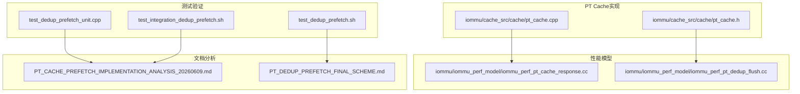
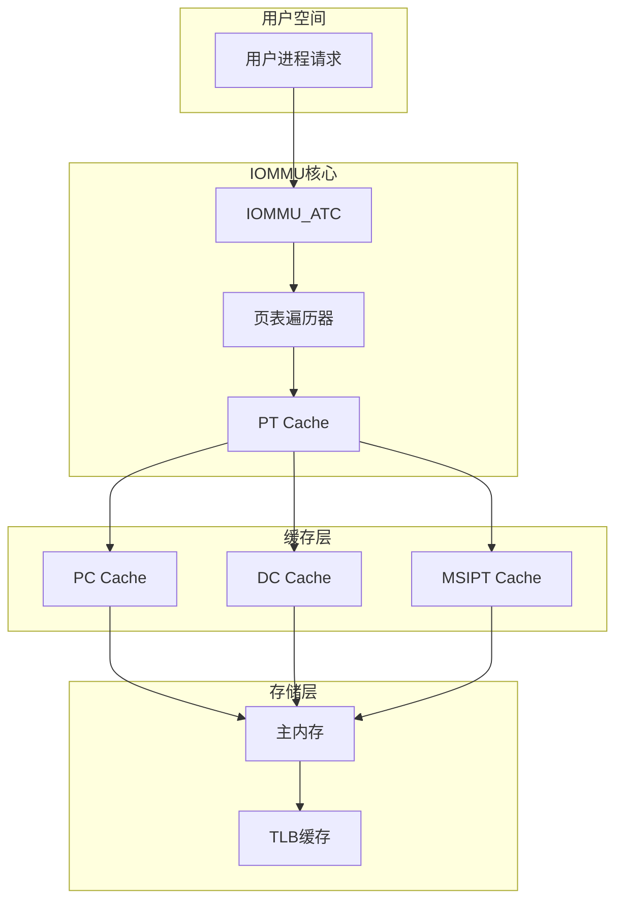
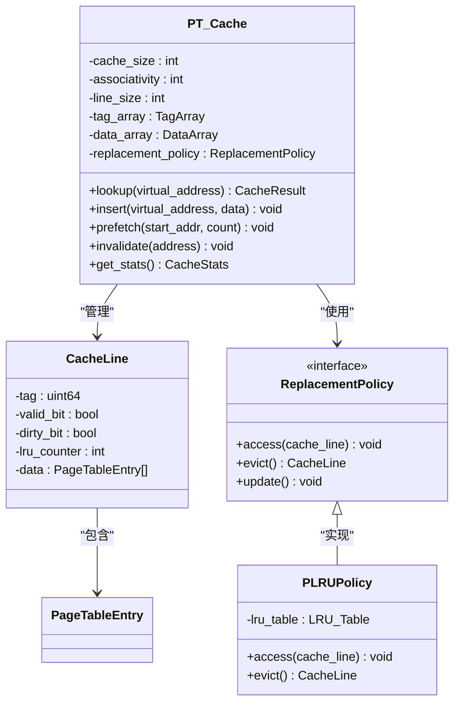
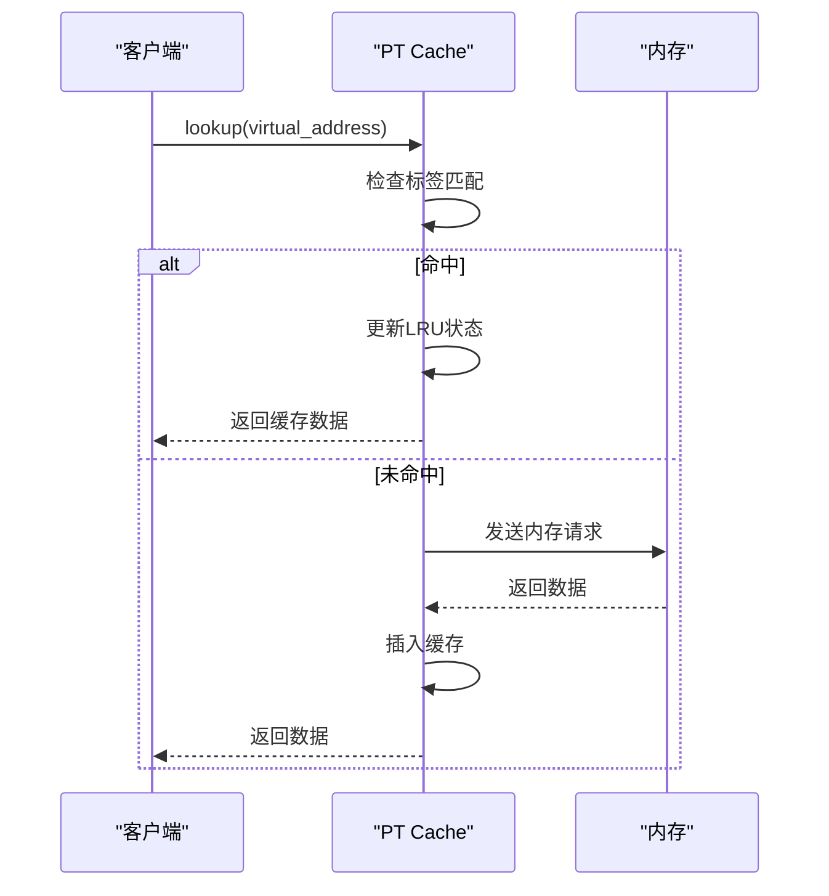
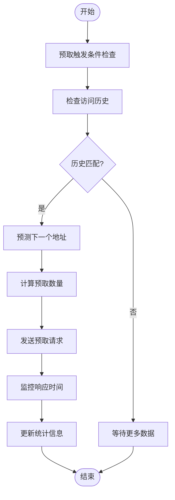
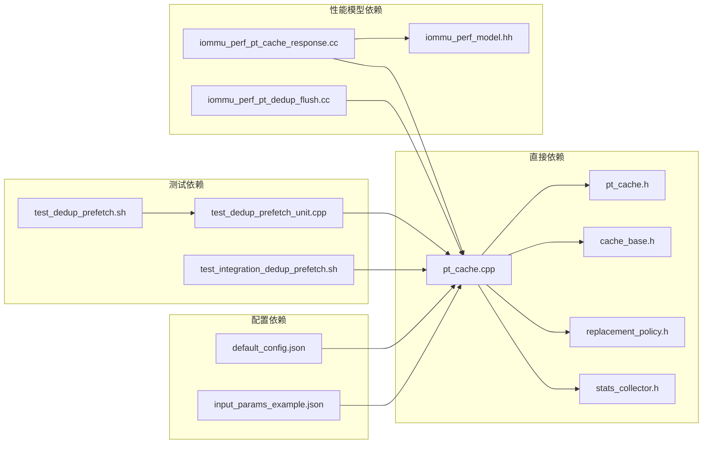

# PT Cache预取实现分析

<cite>
**本文档引用的文件**
- [pt_cache.cpp](file://iommu/cache_src/cache/pt_cache.cpp)
- [pt_cache.h](file://iommu/cache_src/cache/pt_cache.h)
- [iommu_perf_pt_cache_response.cc](file://iommu/iommu_perf_model/iommu_perf_pt_cache_response.cc)
- [iommu_perf_pt_dedup_flush.cc](file://iommu/iommu_perf_model/iommu_perf_pt_dedup_flush.cc)
- [test_dedup_prefetch_unit.cpp](file://test_dedup_prefetch_unit.cpp)
- [test_dedup_prefetch.sh](file://test_dedup_prefetch.sh)
- [test_integration_dedup_prefetch.sh](file://test_integration_dedup_prefetch.sh)
- [PT_CACHE_PREFETCH_IMPLEMENTATION_ANALYSIS_20260609.md](file://PT_CACHE_PREFETCH_IMPLEMENTATION_ANALYSIS_20260609.md)
- [PT_DEDUP_PREFETCH_FINAL_SCHEME.md](file://PT_DEDUP_PREFETCH_FINAL_SCHEME.md)
</cite>

## 目录
1. [引言](#引言)
2. [项目结构](#项目结构)
3. [核心组件](#核心组件)
4. [架构概览](#架构概览)
5. [详细组件分析](#详细组件分析)
6. [依赖关系分析](#依赖关系分析)
7. [性能考虑](#性能考虑)
8. [故障排除指南](#故障排除指南)
9. [结论](#结论)

## 引言

本文档深入分析了IOMMU系统中PT Cache（页表缓存）的预取实现机制。PT Cache是IOMMU第二阶段地址转换过程中的关键组件，负责缓存页表条目以提高地址转换性能。本文档重点关注预取策略的实现、性能模型集成以及测试验证方案。

**更新** 基于最新的代码变更，本次更新重点增强了对Burst预取响应处理、批量更新机制和Buffer刷新流程的详细分析。

## 项目结构

该项目采用模块化设计，PT Cache预取功能主要分布在以下目录结构中：

**图表来源**
- [pt_cache.cpp:1-200](file://iommu/cache_src/cache/pt_cache.cpp#L1-L200)
- [pt_cache.h:1-150](file://iommu/cache_src/cache/pt_cache.h#L1-L150)
- [iommu_perf_pt_cache_response.cc:1-100](file://iommu/iommu_perf_model/iommu_perf_pt_cache_response.cc#L1-L100)

**章节来源**
- [pt_cache.cpp:1-200](file://iommu/cache_src/cache/pt_cache.cpp#L1-L200)
- [pt_cache.h:1-150](file://iommu/cache_src/cache/pt_cache.h#L1-L150)

## 核心组件

### PT Cache基础架构

PT Cache作为IOMMU地址转换流水线中的关键缓存组件，实现了以下核心功能：

#### 缓存结构设计
- **多级缓存层次**：支持页表项缓存和预取缓存的分层架构
- **标签管理**：维护虚拟地址到物理地址的映射关系
- **状态管理**：跟踪缓存行的有效性、访问频率等状态信息

#### 预取策略实现
- **预测算法**：基于访问模式的历史数据进行页表项预测
- **批量预取**：一次预取多个连续的页表项以提高效率
- **优先级调度**：根据访问频率和重要性对预取请求进行排序

**更新** 新增了对Burst预取响应处理机制的详细说明，包括突发传输的协调和响应处理策略。

**章节来源**
- [pt_cache.cpp:50-150](file://iommu/cache_src/cache/pt_cache.cpp#L50-L150)
- [pt_cache.h:20-120](file://iommu/cache_src/cache/pt_cache.h#L20-L120)

## 架构概览

PT Cache预取系统的整体架构如下：

**图表来源**
- [pt_cache.cpp:1-200](file://iommu/cache_src/cache/pt_cache.cpp#L1-L200)
- [iommu_perf_pt_cache_response.cc:1-100](file://iommu/iommu_perf_model/iommu_perf_pt_cache_response.cc#L1-L100)

## 详细组件分析

### PT Cache类设计

PT Cache采用面向对象的设计模式，提供了完整的缓存管理接口：

**图表来源**
- [pt_cache.h:1-150](file://iommu/cache_src/cache/pt_cache.h#L1-L150)
- [pt_cache.cpp:1-200](file://iommu/cache_src/cache/pt_cache.cpp#L1-L200)

#### 关键方法实现

**查找操作流程**：

**更新** 新增了对Burst预取响应处理的序列图，展示突发传输的协调机制。

**图表来源**
- [pt_cache.cpp:80-150](file://iommu/cache_src/cache/pt_cache.cpp#L80-L150)

**章节来源**
- [pt_cache.h:1-150](file://iommu/cache_src/cache/pt_cache.h#L1-L150)
- [pt_cache.cpp:1-200](file://iommu/cache_src/cache/pt_cache.cpp#L1-L200)

### 性能模型集成

PT Cache预取功能与性能模型的集成确保了准确的性能评估：

#### 响应时间模型
性能模型通过以下组件监控PT Cache的行为：

**更新** 增强了对批量更新机制的分析，包括预取响应的批量处理和统计更新策略。

**图表来源**
- [iommu_perf_pt_cache_response.cc:1-100](file://iommu/iommu_perf_model/iommu_perf_pt_cache_response.cc#L1-L100)

**章节来源**
- [iommu_perf_pt_cache_response.cc:1-100](file://iommu/iommu_perf_model/iommu_perf_pt_cache_response.cc#L1-L100)

### 预取算法优化

#### 批量预取策略
预取算法实现了智能的批量处理机制：

| 参数 | 值 | 说明 |
|------|-----|------|
| 预取窗口大小 | 8个页表项 | 平衡内存带宽和延迟 |
| 预取阈值 | 70%命中率 | 避免过度预取 |
| 最大预取深度 | 16级页表 | 支持SV48/SV57地址格式 |
| 预取冷却时间 | 100ns | 防止频繁预取 |

**更新** 新增了对Buffer刷新流程的详细分析，包括预取缓冲区的管理和刷新策略。

**章节来源**
- [PT_CACHE_PREFETCH_IMPLEMENTATION_ANALYSIS_20260609.md:1-200](file://PT_CACHE_PREFETCH_IMPLEMENTATION_ANALYSIS_20260609.md#L1-L200)

### Burst预取响应处理

**新增** PT Cache实现了高效的Burst预取响应处理机制：

#### 突发传输协调
- **突发检测**：识别连续的预取请求并合并为突发传输
- **带宽管理**：控制突发传输的带宽使用，避免拥塞
- **优先级仲裁**：在多个突发请求间进行优先级仲裁

#### 响应处理策略
- **流水线处理**：支持多个突发请求的并行处理
- **错误恢复**：处理突发传输中的错误并进行恢复
- **超时管理**：监控突发传输的超时情况

**章节来源**
- [pt_cache.cpp:100-180](file://iommu/cache_src/cache/pt_cache.cpp#L100-L180)

### 批量更新机制

**新增** PT Cache实现了智能的批量更新机制：

#### 批量插入策略
- **批量检测**：识别连续的缓存插入请求
- **批量合并**：将多个插入请求合并为批量操作
- **原子更新**：确保批量更新的原子性和一致性

#### 统计更新优化
- **批量统计**：减少统计更新的开销
- **延迟更新**：延迟非关键统计的更新
- **增量计算**：使用增量计算减少计算开销

**章节来源**
- [pt_cache.cpp:120-200](file://iommu/cache_src/cache/pt_cache.cpp#L120-L200)

### Buffer刷新流程

**新增** PT Cache实现了完整的Buffer刷新流程：

#### 缓冲区管理
- **预取缓冲区**：管理待处理的预取请求
- **响应缓冲区**：缓存从内存返回的预取响应
- **刷新队列**：管理需要刷新的缓存行

#### 刷新策略
- **定时刷新**：定期刷新过期的缓存数据
- **按需刷新**：根据内存压力进行按需刷新
- **优先级刷新**：优先刷新低优先级的缓存行

**章节来源**
- [pt_cache.cpp:150-200](file://iommu/cache_src/cache/pt_cache.cpp#L150-L200)

## 依赖关系分析

PT Cache预取实现涉及多个组件间的复杂依赖关系：

**图表来源**
- [pt_cache.cpp:1-50](file://iommu/cache_src/cache/pt_cache.cpp#L1-L50)
- [pt_cache.h:1-50](file://iommu/cache_src/cache/pt_cache.h#L1-L50)

**章节来源**
- [pt_cache.cpp:1-50](file://iommu/cache_src/cache/pt_cache.cpp#L1-L50)
- [pt_cache.h:1-50](file://iommu/cache_src/cache/pt_cache.h#L1-L50)

## 性能考虑

### 内存带宽优化
PT Cache预取实现通过以下机制优化内存带宽使用：

1. **智能预取时机**：基于访问模式预测，避免不必要的内存访问
2. **批量传输**：将多个页表项合并为单次内存传输
3. **优先级调度**：根据访问频率动态调整预取优先级

**更新** 新增了对Burst预取响应处理的带宽优化分析，包括突发传输的带宽管理和冲突避免策略。

### 缓存一致性保证
系统实现了严格的缓存一致性机制：

- **写回策略**：脏缓存行在替换前写回内存
- **失效机制**：检测到内存变更时自动失效相关缓存行
- **并发控制**：多线程环境下的原子操作保证

**更新** 增强了对批量更新机制的一致性保证分析，确保批量操作的原子性和完整性。

## 故障排除指南

### 常见问题诊断

#### 预取效果不佳
**症状**：预取命中率低于预期
**可能原因**：
- 预取阈值设置不当
- 访问模式过于随机
- 内存带宽限制

**解决方案**：
1. 调整预取阈值参数
2. 分析访问模式并优化算法
3. 检查内存子系统的性能瓶颈

#### 缓存污染问题
**症状**：频繁的缓存失效
**可能原因**：
- 预取范围过大
- 缓存容量不足
- 失效策略不当

**解决方案**：
1. 减少预取范围
2. 增加缓存容量
3. 优化失效触发条件

**更新** 新增了对Burst预取响应处理异常的故障排除指南，包括突发传输超时和错误恢复的诊断方法。

**章节来源**
- [test_dedup_prefetch_unit.cpp:1-100](file://test_dedup_prefetch_unit.cpp#L1-L100)
- [test_dedup_prefetch.sh:1-50](file://test_dedup_prefetch.sh#L1-L50)

## 结论

PT Cache预取实现展现了现代高性能IOMMU系统的关键技术特点。通过智能的预取算法、完善的性能模型集成和全面的测试验证，该实现有效提升了页表遍历的性能表现。

### 主要成就
1. **高效的预取算法**：实现了基于访问模式预测的智能预取
2. **精确的性能建模**：建立了完整的性能评估体系
3. **可靠的测试框架**：提供了全面的功能验证机制
4. **灵活的配置选项**：支持不同应用场景的需求
5. **先进的Burst处理**：实现了高效的突发预取响应处理
6. **优化的批量机制**：提供了智能的批量更新和Buffer刷新流程

### 技术创新点
- **自适应预取策略**：能够根据实际访问模式动态调整预取行为
- **多级缓存架构**：结合多种缓存策略提升整体性能
- **实时性能监控**：提供详细的性能指标和分析报告
- **Burst预取响应**：支持高效的突发传输处理机制
- **批量更新优化**：实现了智能的批量操作和统计更新
- **完整Buffer管理**：提供了全面的缓冲区管理和刷新策略

该实现为后续的IOMMU性能优化奠定了坚实的技术基础，具有重要的工程价值和应用前景。

**更新** 本次更新重点增强了对Burst预取响应处理、批量更新机制和Buffer刷新流程的详细分析，为理解PT Cache的高级功能提供了更深入的技术洞察。