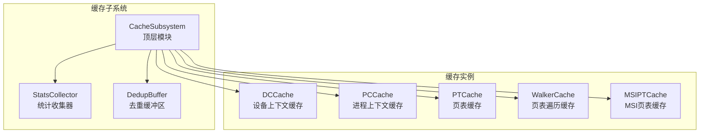
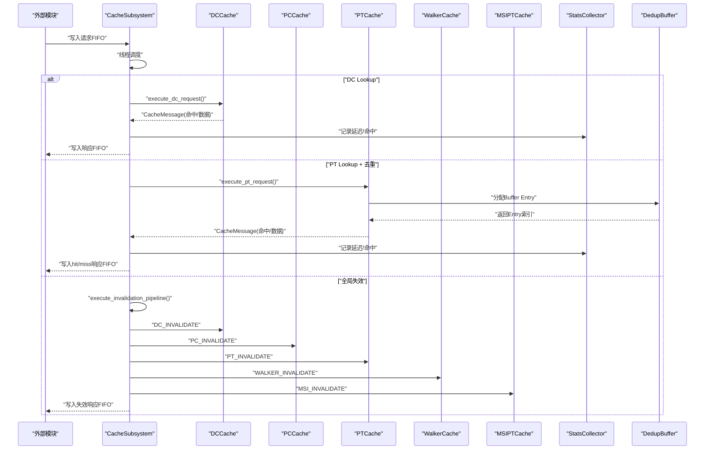
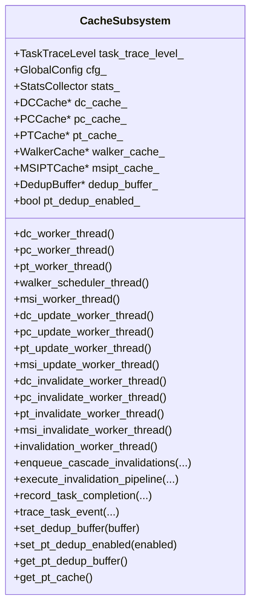
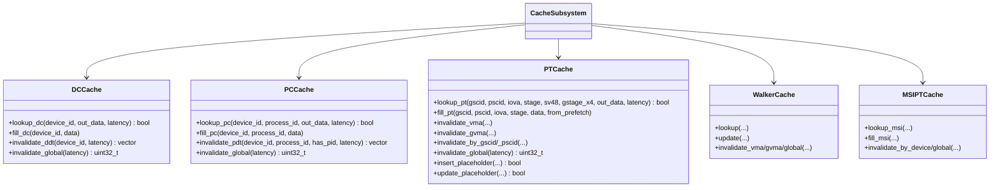
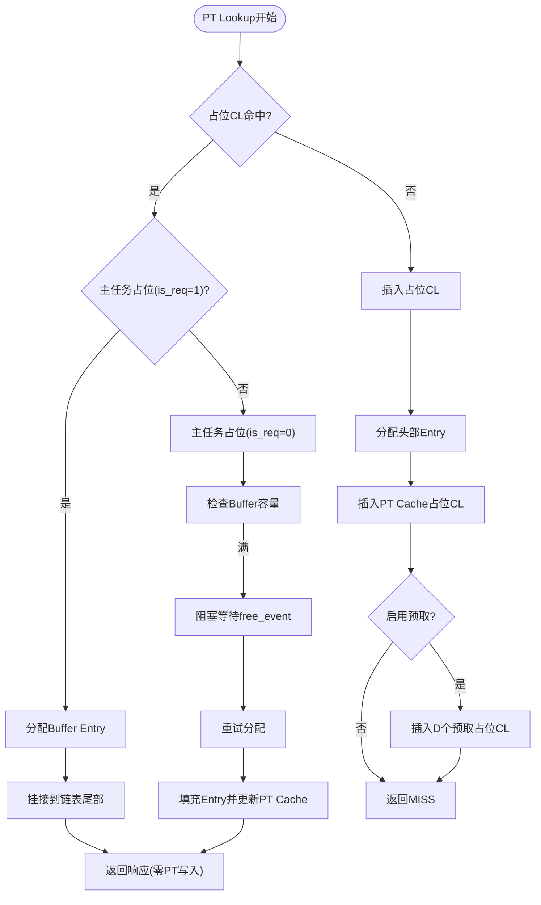
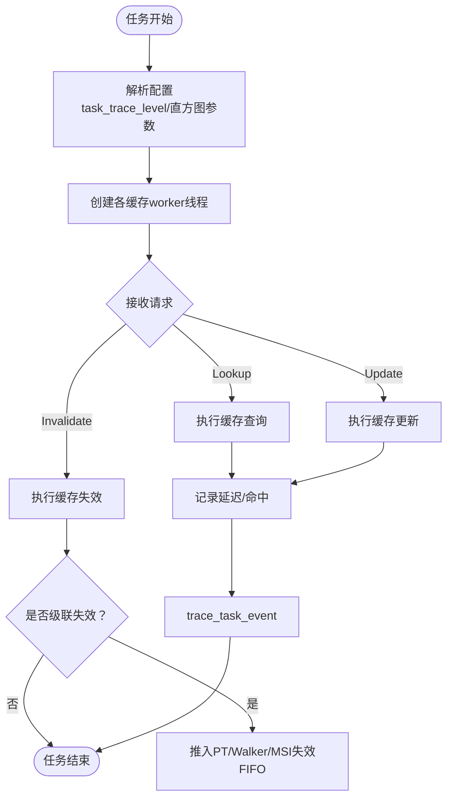
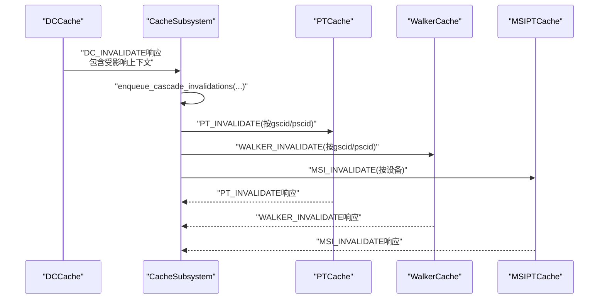
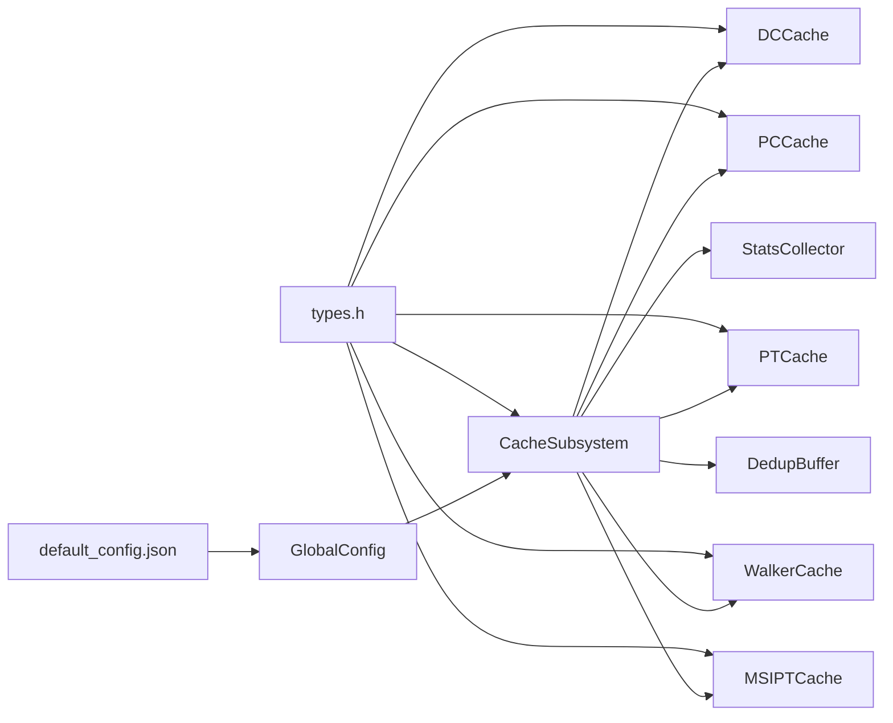

# 缓存子系统概览

<cite>
**本文档引用的文件**
- [cache_subsystem.h](file://iommu/cache_src/subsystem/cache_subsystem.h)
- [cache_subsystem.cpp](file://iommu/cache_src/subsystem/cache_subsystem.cpp)
- [stats_collector.h](file://iommu/cache_src/common/stats_collector.h)
- [types.h](file://iommu/cache_src/common/types.h)
- [dc_cache.h](file://iommu/cache_src/cache/dc_cache.h)
- [pc_cache.h](file://iommu/cache_src/cache/pc_cache.h)
- [pt_cache.h](file://iommu/cache_src/cache/pt_cache.h)
- [walker_cache.h](file://iommu/cache_src/cache/walker_cache.h)
- [cache_base.h](file://iommu/cache_src/cache/cache_base.h)
- [default_config.json](file://iommu/cache_config/default_config.json)
- [iommu_task.hh](file://iommu/include/iommu_task.hh)
- [README.md](file://README.md)
</cite>

## 更新摘要
**所做更改**
- 新增PT缓存去重功能的架构说明和实现细节
- 更新Walker缓存统一轮询调度机制的详细描述
- 增强数据类型升级对系统级性能的影响分析
- 完善缓冲区容量扩展对性能优化的作用说明
- 补充批量更新和预取占位CL的处理机制

## 目录
1. [简介](#简介)
2. [项目结构](#项目结构)
3. [核心组件](#核心组件)
4. [架构总览](#架构总览)
5. [详细组件分析](#详细组件分析)
6. [依赖关系分析](#依赖关系分析)
7. [性能考虑](#性能考虑)
8. [故障排查指南](#故障排查指南)
9. [结论](#结论)
10. [附录](#附录)

## 简介
本文件为RISC-V IOMMU缓存子系统的概览文档，聚焦于CacheSubsystem作为顶层模块的整体架构设计。该子系统负责管理多个缓存实例（DC、PC、PT、Walker、MSIPT），并提供统一的失效管道（invalidation pipeline）。文档涵盖：
- 初始化流程与配置参数管理
- 性能统计收集机制
- 各缓存模块间的协作关系与数据流
- 任务跟踪级别设置、级联失效机制与全局失效管道工作原理
- **新增**：PT缓存去重功能、批量更新机制和预取占位CL处理
- 使用接口示例与性能监控、调试方法

## 项目结构
缓存子系统位于iommu/cache_src目录下，采用"子模块+统一调度"的组织方式：
- subsystem：顶层模块CacheSubsystem，负责实例化各缓存子模块、统一调度线程、失效管道与统计收集
- cache：各类缓存的具体实现（DCCache、PCCache、PTCache、WalkerCache、MSIPTCache）
- common：公共类型定义、统计收集器、JSON配置解析等
- replacement：替换策略（PLRU、SRRIP）

**图表来源**
- [cache_subsystem.h:16-175](file://iommu/cache_src/subsystem/cache_subsystem.h#L16-L175)
- [cache_subsystem.cpp:102-176](file://iommu/cache_src/subsystem/cache_subsystem.cpp#L102-L176)

**章节来源**
- [cache_subsystem.h:16-175](file://iommu/cache_src/subsystem/cache_subsystem.h#L16-L175)
- [cache_subsystem.cpp:102-176](file://iommu/cache_src/subsystem/cache_subsystem.cpp#L102-L176)

## 核心组件
- CacheSubsystem：顶层模块，管理各缓存实例与失效管道，提供lookup/update/invalidate三类请求的统一调度线程，支持任务跟踪与性能统计。
- **新增**：DedupBuffer去重缓冲区，用于PT缓存占位CL的内存管理
- 各缓存实例：DC、PC、PT、Walker、MSIPT，分别负责设备上下文、进程上下文、页表、页表遍历与MSI页表的查询、更新与失效。
- StatsCollector：集中统计访问次数、命中/缺失、驱逐、失效、预取命中、延迟直方图等指标，并支持输出到文件。
- 类型与消息：统一的CacheMessage结构承载所有操作类型（lookup/update/invalidate）与上下文字段，配合InvalidationCmd与相关枚举。

**章节来源**
- [cache_subsystem.h:18-175](file://iommu/cache_src/subsystem/cache_subsystem.h#L18-L175)
- [stats_collector.h:65-130](file://iommu/cache_src/common/stats_collector.h#L65-L130)
- [types.h:78-554](file://iommu/cache_src/common/types.h#L78-L554)

## 架构总览
CacheSubsystem通过SystemC线程模型为每个缓存操作提供独立的worker线程，确保并发处理能力。关键特性：
- 独立FIFO接口：每个操作类型（lookup/update/invalidate）都有对应的请求与响应FIFO，避免串行化瓶颈
- **优化**：WalkerCache采用统一轮询调度线程，按lookup→update→invalidate顺序处理，避免互锁死锁
- 全局失效管道：通过专用的invalidation_request_fifo/invalidation_response_fifo实现全局或命令驱动的失效流水线
- 统一消息模型：CacheMessage复用所有操作类型，减少接口复杂度
- **新增**：PT缓存去重功能，通过DedupBuffer管理占位CL的内存分配和链接

**图表来源**
- [cache_subsystem.cpp:282-483](file://iommu/cache_src/subsystem/cache_subsystem.cpp#L282-L483)
- [cache_subsystem.cpp:729-803](file://iommu/cache_src/subsystem/cache_subsystem.cpp#L729-L803)

**章节来源**
- [cache_subsystem.cpp:282-483](file://iommu/cache_src/subsystem/cache_subsystem.cpp#L282-L483)
- [cache_subsystem.cpp:729-803](file://iommu/cache_src/subsystem/cache_subsystem.cpp#L729-L803)

## 详细组件分析

### CacheSubsystem顶层模块
- 职责
  - 实例化并配置各缓存子模块（DCCache、PCCache、PTCache、WalkerCache、MSIPTCache）
  - 创建并启动各操作类型的worker线程（lookup/update/invalidate）
  - 提供全局失效管道与级联失效机制
  - 集成StatsCollector进行性能统计与任务跟踪
  - **新增**：管理DedupBuffer去重缓冲区，支持PT缓存去重功能
- 关键接口
  - 请求/响应FIFO：dc_request_fifo/pc_request_fifo/pt_request_fifo/walker_request_fifo/msi_request_fifo与对应响应FIFO
  - 更新与失效FIFO：dc_update_fifo/pc_update_fifo/pt_update_fifo/walker_update_fifo/msi_update_fifo与失效响应FIFO
  - 全局失效：invalidation_request_fifo/invalidation_response_fifo
  - 级联失效：enqueue_cascade_invalidations
  - 任务跟踪：set_task_trace_enabled/task_trace_enabled
  - **新增**：PT去重接口：set_dedup_buffer/set_pt_dedup_enabled/get_pt_dedup_buffer/get_pt_cache
- 初始化流程
  - 解析GlobalConfig，设置时钟周期与统计配置
  - 为各缓存实例分配FIFO深度并创建线程
  - 初始化StatsCollector并配置直方图参数
  - **新增**：创建DedupBuffer并启用PT缓存去重功能

**图表来源**
- [cache_subsystem.h:20-175](file://iommu/cache_src/subsystem/cache_subsystem.h#L20-L175)

**章节来源**
- [cache_subsystem.h:20-175](file://iommu/cache_src/subsystem/cache_subsystem.h#L20-L175)
- [cache_subsystem.cpp:102-176](file://iommu/cache_src/subsystem/cache_subsystem.cpp#L102-L176)

### 各缓存实例
- DCCache（设备上下文缓存）
  - lookup_dc：按device_id查询，返回gscid、stage等上下文
  - invalidate_ddt：按设备ID精确失效，返回受影响的{gscid, pscid}列表用于级联
  - invalidate_global：全局清空
- PCCache（进程上下文缓存）
  - lookup_pc：按device_id+process_id查询
  - invalidate_pdt：按设备+进程精确失效，返回受影响的pscid列表
  - invalidate_global：全局清空
- PTCache（页表缓存）
  - lookup_pt：按gscid/pscid/iova+stage查询，支持sv48/gstage_x4
  - **增强**：支持占位CL（placeholder CL）机制，用于PT缓存去重
  - invalidate_vma/gvma：按VMA/GVMA失效，支持PRECISE/SCAN模式
  - invalidate_by_gscid/_pscid：按上下文批量失效
  - **新增**：insert_placeholder/update_placeholder接口，支持去重缓冲区管理
- WalkerCache（页表遍历缓存）
  - 三层子表：PTWc_1（直接映射）、PTWc_2（2-way组相联）、PTWc_3（4-way组相联）
  - lookup：按gscid/pscid/va查询，命中level返回
  - update：按更新类型（PTWC_1_2_3/2_3/3）填充三级子表
  - invalidate_vma/gvma/global：支持多种失效模式
  - **优化**：统一轮询调度，避免互锁死锁
- MSIPTCache（MSI页表缓存）
  - lookup_msi：按device_id+msi_index查询
  - invalidate_by_device/global：按设备或全局失效

**图表来源**
- [dc_cache.h:8-31](file://iommu/cache_src/cache/dc_cache.h#L8-L31)
- [pc_cache.h:8-33](file://iommu/cache_src/cache/pc_cache.h#L8-L33)
- [pt_cache.h:8-54](file://iommu/cache_src/cache/pt_cache.h#L8-L54)
- [walker_cache.h:15-92](file://iommu/cache_src/cache/walker_cache.h#L15-L92)

**章节来源**
- [dc_cache.h:8-31](file://iommu/cache_src/cache/dc_cache.h#L8-L31)
- [pc_cache.h:8-33](file://iommu/cache_src/cache/pc_cache.h#L8-L33)
- [pt_cache.h:8-54](file://iommu/cache_src/cache/pt_cache.h#L8-L54)
- [walker_cache.h:15-92](file://iommu/cache_src/cache/walker_cache.h#L15-L92)

### PT缓存去重功能
- **新增**：DedupBuffer去重缓冲区，用于管理PT缓存占位CL的内存分配
- **核心机制**：
  - 占位CL（placeholder CL）：当PT缓存命中预取或主任务占位时，不写入PT Cache，仅写入去重缓冲区
  - 链表管理：通过Buffer entry的next_index和tail_index维护任务链表
  - 零写入优化：主任务占位CL仅写Buffer，避免PT Cache写入开销
- **处理流程**：
  - MISS时自动插入占位CL，分配Buffer Entry并建立单节点链表
  - 占位CL HIT时仅分配新Entry并挂接到链表尾部，零PT Cache写入
  - 预取占位CL：支持D个连续页面的预取占位，提升预取效率

**图表来源**
- [cache_subsystem.cpp:536-751](file://iommu/cache_src/subsystem/cache_subsystem.cpp#L536-L751)

**章节来源**
- [cache_subsystem.cpp:536-751](file://iommu/cache_src/subsystem/cache_subsystem.cpp#L536-L751)

### 统计收集与任务跟踪
- StatsCollector
  - 注册缓存通道、记录访问/命中/缺失/驱逐/失效、预取命中
  - 记录执行延迟、排队延迟、请求总延迟，支持直方图统计
  - 支持输出到文件，打印摘要与直方图
- 任务跟踪
  - 支持OFF/BASIC/DETAIL三级跟踪级别
  - trace_task_event记录请求开始/结束、命令类型、失效模式、阶段、设备/进程/MSI索引、IOVA等
  - record_task_completion记录请求总延迟并上报StatsCollector

**图表来源**
- [stats_collector.h:65-130](file://iommu/cache_src/common/stats_collector.h#L65-L130)

**章节来源**
- [stats_collector.h:65-130](file://iommu/cache_src/common/stats_collector.h#L65-L130)
- [cache_subsystem.cpp:218-280](file://iommu/cache_src/subsystem/cache_subsystem.cpp#L218-L280)

### 级联失效机制
- DC/PC失效后，会返回受影响的上下文集合（gscid/pscid），CacheSubsystem将其转换为级联失效消息，推入PT/Walker/MSIPT的失效FIFO
- WalkerCache采用统一轮询调度，避免互锁死锁，按lookup→update→invalidate顺序处理
- 全局失效管道（GLOBAL_INVAL）会依次对所有缓存执行全局失效

**图表来源**
- [cache_subsystem.cpp:624-628](file://iommu/cache_src/subsystem/cache_subsystem.cpp#L624-L628)
- [cache_subsystem.cpp:324-370](file://iommu/cache_src/subsystem/cache_subsystem.cpp#L324-L370)
- [cache_subsystem.cpp:729-803](file://iommu/cache_src/subsystem/cache_subsystem.cpp#L729-L803)

**章节来源**
- [cache_subsystem.cpp:624-628](file://iommu/cache_src/subsystem/cache_subsystem.cpp#L624-L628)
- [cache_subsystem.cpp:324-370](file://iommu/cache_src/subsystem/cache_subsystem.cpp#L324-L370)
- [cache_subsystem.cpp:729-803](file://iommu/cache_src/subsystem/cache_subsystem.cpp#L729-L803)

### 全局失效管道
- 通过invalidation_request_fifo接收失效命令，invalidation_worker_thread逐个处理
- execute_invalidation_pipeline根据命令类型（GLOBAL_INVAL/IODIR_INVAL_*）决定失效范围
- 对于全局失效，依次对DC/PC/PT/Walker/MSI执行全局失效
- 对于按命令类型失效，先对主缓存执行精确失效，再根据受影响上下文级联失效到其他缓存

**章节来源**
- [cache_subsystem.cpp:476-483](file://iommu/cache_src/subsystem/cache_subsystem.cpp#L476-L483)
- [cache_subsystem.cpp:729-803](file://iommu/cache_src/subsystem/cache_subsystem.cpp#L729-L803)

## 依赖关系分析
- CacheSubsystem依赖各缓存实例与StatsCollector
- **新增**：依赖DedupBuffer去重缓冲区
- 各缓存实例继承自CacheBase模板类，共享统一的缓存架构、仲裁与延迟建模
- 类型系统统一使用types.h中的枚举与结构体，保证跨模块一致性
- 配置来源于default_config.json，通过GlobalConfig传入CacheSubsystem

**图表来源**
- [default_config.json:1-69](file://iommu/cache_config/default_config.json#L1-L69)
- [types.h:599-617](file://iommu/cache_src/common/types.h#L599-L617)
- [cache_subsystem.h:6-16](file://iommu/cache_src/subsystem/cache_subsystem.h#L6-L16)

**章节来源**
- [default_config.json:1-69](file://iommu/cache_config/default_config.json#L1-L69)
- [types.h:599-617](file://iommu/cache_src/common/types.h#L599-L617)
- [cache_subsystem.h:6-16](file://iommu/cache_src/subsystem/cache_subsystem.h#L6-L16)

## 性能考虑
- FIFO深度设计：lookup请求FIFO通常较大（如dc/pc为16，walker/msi为1），update/invalidate为1，平衡吞吐与延迟
- 仲裁与延迟建模：CacheBase提供统一的仲裁权重与多阶段延迟建模，包括hash/read_set/compare/fill_compute_index/write_way等
- 替换策略：支持PLRU与SRRIP，PTCache默认使用PLRU，可配置SRRIP的M位数
- 统计直方图：可配置直方图bin宽度，输出执行延迟与排队延迟直方图，便于性能分析
- **新增**：PT缓存去重优化，通过零写入机制显著降低PT Cache写入开销
- **新增**：批量更新机制，支持一次处理多个更新请求，提高批量操作效率
- **新增**：预取占位CL机制，通过占位CL减少重复的PT Walk操作

**章节来源**
- [cache_subsystem.cpp:105-132](file://iommu/cache_src/subsystem/cache_subsystem.cpp#L105-L132)
- [cache_base.h:146-200](file://iommu/cache_src/cache/cache_base.h#L146-L200)
- [default_config.json:45-59](file://iommu/cache_config/default_config.json#L45-L59)

## 故障排查指南
- 启用任务跟踪
  - 通过set_task_trace_enabled(true)或配置statistics.enable_task_trace与task_trace_level开启详细跟踪
  - 任务跟踪日志包含请求类型、命令类型、失效模式、阶段、设备/进程/MSI索引、IOVA、命中情况、影响条目数、执行延迟等
- 性能报告
  - StatsCollector::report()输出摘要与直方图，检查各缓存的命中率、IOPS、平均延迟
  - 若直方图为空，确认statistics.enable_latency_histogram与bin宽度设置
- 失效问题
  - 全局失效失败：检查execute_invalidation_pipeline是否正确转发到各缓存
  - 级联失效不生效：确认enqueue_cascade_invalidations是否被调用且上下文正确
- **新增**：PT缓存去重问题
  - 去重缓冲区满：检查DedupBuffer的free_event触发机制
  - 占位CL插入失败：确认PT Cache是否有可用cacheline空间
  - 预取占位CL丢失：检查预取深度配置和插入逻辑
- 调试建议
  - 使用GDB调试（参考GDB_DEBUG_GUIDE.md）
  - 结合README.md中的编译与运行说明，在WSL环境中进行调试

**章节来源**
- [cache_subsystem.cpp:172-174](file://iommu/cache_src/subsystem/cache_subsystem.cpp#L172-L174)
- [stats_collector.cpp:170-182](file://iommu/cache_src/common/stats_collector.cpp#L170-L182)
- [README.md:77-92](file://README.md#L77-L92)

## 结论
CacheSubsystem通过统一的消息模型、独立的worker线程与统一轮询调度，实现了高并发、低耦合的缓存子系统。其级联失效与全局失效管道确保了内存一致性，而完善的统计与任务跟踪机制为性能优化与问题定位提供了坚实基础。**新增的PT缓存去重功能**通过占位CL机制和零写入优化，显著提升了缓存效率和系统性能。合理配置FIFO深度、仲裁权重、替换策略以及去重缓冲区容量，可在吞吐与延迟之间取得最佳平衡。

## 附录

### 使用接口示例（路径指引）
以下为常用接口的代码路径示例，便于快速定位实现：
- 初始化与配置
  - [CacheSubsystem构造函数:102-176](file://iommu/cache_src/subsystem/cache_subsystem.cpp#L102-L176)
  - [GlobalConfig与配置加载:1-69](file://iommu/cache_config/default_config.json#L1-L69)
- 查询接口
  - [DC查询:485-497](file://iommu/cache_src/subsystem/cache_subsystem.cpp#L485-L497)
  - [PC查询:499-510](file://iommu/cache_src/subsystem/cache_subsystem.cpp#L499-L510)
  - [PT查询:512-529](file://iommu/cache_src/subsystem/cache_subsystem.cpp#L512-L529)
  - [Walker查询:531-550](file://iommu/cache_src/subsystem/cache_subsystem.cpp#L531-L550)
  - [MSI查询:552-562](file://iommu/cache_src/subsystem/cache_subsystem.cpp#L552-L562)
- 更新接口
  - [DC更新:564-570](file://iommu/cache_src/subsystem/cache_subsystem.cpp#L564-L570)
  - [PC更新:572-578](file://iommu/cache_src/subsystem/cache_subsystem.cpp#L572-L578)
  - [PT更新:580-586](file://iommu/cache_src/subsystem/cache_subsystem.cpp#L580-L586)
  - [Walker更新:588-601](file://iommu/cache_src/subsystem/cache_subsystem.cpp#L588-L601)
  - [MSI更新:603-609](file://iommu/cache_src/subsystem/cache_subsystem.cpp#L603-L609)
- 失效接口
  - [DC失效:611-636](file://iommu/cache_src/subsystem/cache_subsystem.cpp#L611-L636)
  - [PC失效:638-662](file://iommu/cache_src/subsystem/cache_subsystem.cpp#L638-L662)
  - [PT失效:664-683](file://iommu/cache_src/subsystem/cache_subsystem.cpp#L664-L683)
  - [Walker失效:685-703](file://iommu/cache_src/subsystem/cache_subsystem.cpp#L685-L703)
  - [MSI失效:705-719](file://iommu/cache_src/subsystem/cache_subsystem.cpp#L705-L719)
- **新增**：PT去重接口
  - [设置去重缓冲区:78-81](file://iommu/cache_src/subsystem/cache_subsystem.h#L78-L81)
  - [获取PT缓存:136-137](file://iommu/cache_src/subsystem/cache_subsystem.h#L136-L137)
- 全局失效管道
  - [execute_invalidation_pipeline:729-803](file://iommu/cache_src/subsystem/cache_subsystem.cpp#L729-L803)
- 统计与任务跟踪
  - [StatsCollector接口:65-130](file://iommu/cache_src/common/stats_collector.h#L65-L130)
  - [trace_task_event:218-280](file://iommu/cache_src/subsystem/cache_subsystem.cpp#L218-L280)
  - [record_task_completion:207-216](file://iommu/cache_src/subsystem/cache_subsystem.cpp#L207-L216)

### 性能监控与调试方法
- 性能监控
  - 启用statistics.enable_latency_histogram与直方图bin宽度
  - 通过StatsCollector::report()查看摘要与直方图
  - **新增**：监控PT缓存去重效果，关注占位CL命中率和Buffer利用率
- 调试方法
  - 设置task_trace_level为detail或basic，结合CacheSubsystem::set_task_trace_enabled(true)
  - 使用GDB在worker线程断点处观察请求/响应流转
  - **新增**：监控DedupBuffer的分配/释放事件和free_event触发时机
  - 参考README.md与GDB_DEBUG_GUIDE.md进行环境准备与调试

**章节来源**
- [stats_collector.cpp:170-182](file://iommu/cache_src/common/stats_collector.cpp#L170-L182)
- [cache_subsystem.cpp:218-280](file://iommu/cache_src/subsystem/cache_subsystem.cpp#L218-L280)
- [README.md:77-92](file://README.md#L77-L92)