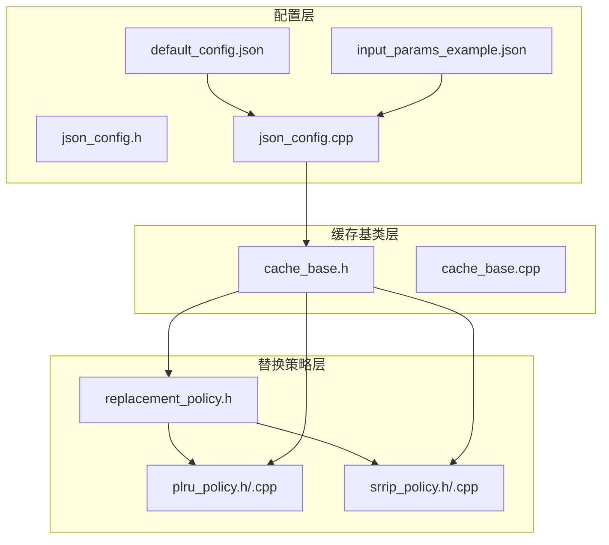
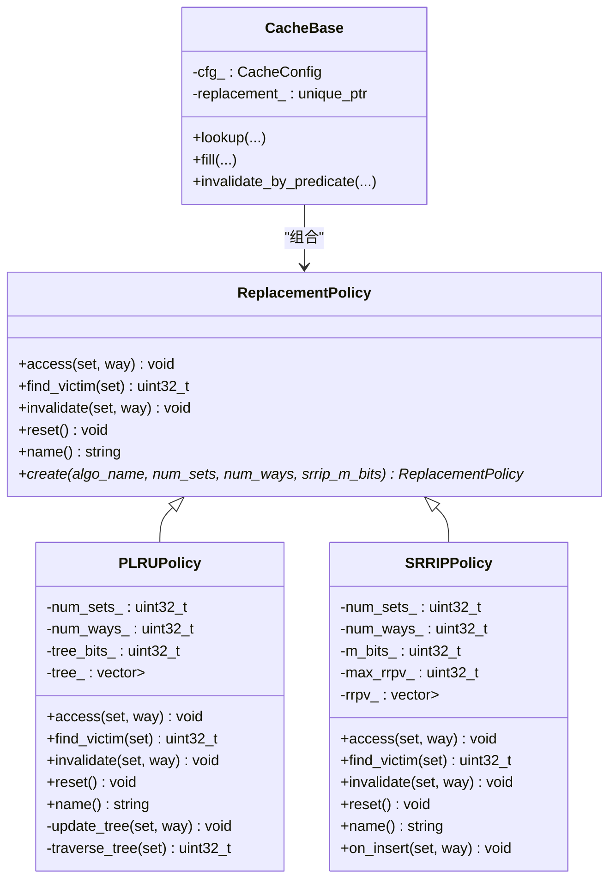
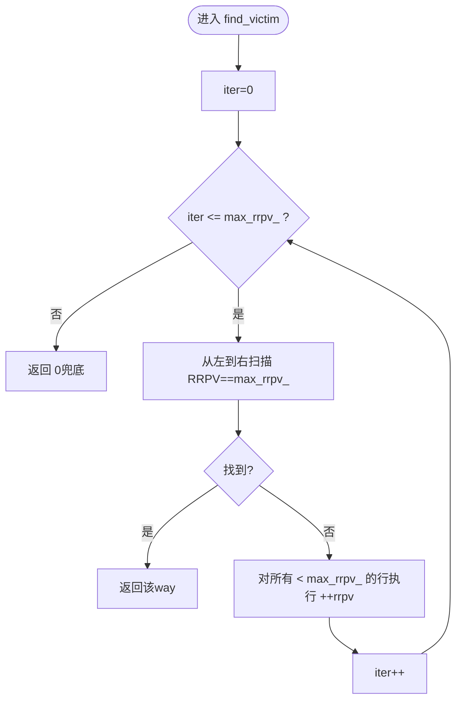
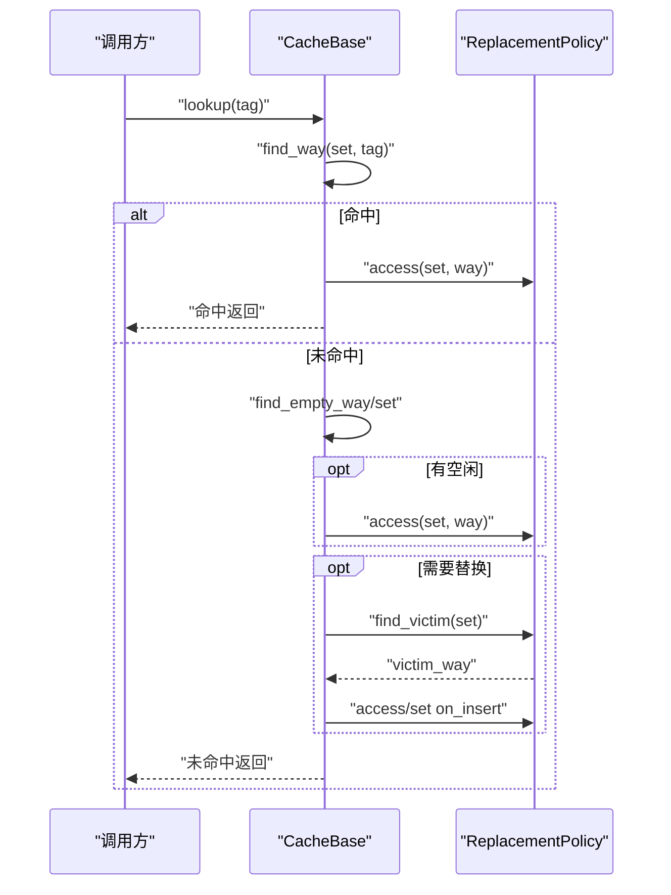
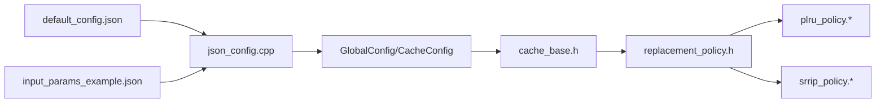

# 缓存替换策略

<cite>
**本文引用的文件**
- [replacement_policy.h](file://iommu/cache_src/replacement/replacement_policy.h)
- [plru_policy.h](file://iommu/cache_src/replacement/plru_policy.h)
- [plru_policy.cpp](file://iommu/cache_src/replacement/plru_policy.cpp)
- [srrip_policy.h](file://iommu/cache_src/replacement/srrip_policy.h)
- [srrip_policy.cpp](file://iommu/cache_src/replacement/srrip_policy.cpp)
- [cache_base.h](file://iommu/cache_src/cache/cache_base.h)
- [cache_base.cpp](file://iommu/cache_src/cache/cache_base.cpp)
- [json_config.h](file://iommu/cache_src/common/json_config.h)
- [json_config.cpp](file://iommu/cache_src/common/json_config.cpp)
- [default_config.json](file://iommu/cache_config/default_config.json)
- [input_params_example.json](file://iommu/cache_config/input_params_example.json)
- [CACHE_PERFORMANCE_ANALYSIS_500REQ.md](file://CACHE_PERFORMANCE_ANALYSIS_500REQ.md)
- [PERF_MODEL_IMPLEMENTATION.md](file://PERF_MODEL_IMPLEMENTATION.md)
</cite>

## 目录
1. [简介](#简介)
2. [项目结构](#项目结构)
3. [核心组件](#核心组件)
4. [架构概览](#架构概览)
5. [详细组件分析](#详细组件分析)
6. [依赖关系分析](#依赖关系分析)
7. [性能考量](#性能考量)
8. [故障排查指南](#故障排查指南)
9. [结论](#结论)
10. [附录](#附录)

## 简介
本文件针对RISC-V IOMMU缓存系统中的替换策略进行全面技术文档化，重点覆盖两类实现：PLRU（Pseudo-LRU，伪LRU）与SRRIP（Simple Re-Reference Interval Prediction，静态重引用间隔预测）。文档将阐述两种策略的实现原理、适用场景、性能特征与复杂度，并给出策略选择标准、参数配置与性能调优方法，以及不同缓存类型对替换策略的需求差异与优化考虑。最后提供具体代码示例路径与性能对比分析及选择建议。

## 项目结构
替换策略位于缓存子系统的替换层，与缓存基类协作完成缓存查找、填充与替换决策。配置通过JSON文件驱动，缓存基类根据配置动态创建相应的替换策略实例。



**图表来源**
- [json_config.cpp:33-131](file://iommu/cache_src/common/json_config.cpp#L33-L131)
- [cache_base.h:235-252](file://iommu/cache_src/cache/cache_base.h#L235-L252)
- [replacement_policy.h:10-35](file://iommu/cache_src/replacement/replacement_policy.h#L10-L35)
- [plru_policy.h:12-33](file://iommu/cache_src/replacement/plru_policy.h#L12-L33)
- [srrip_policy.h:13-33](file://iommu/cache_src/replacement/srrip_policy.h#L13-L33)

**章节来源**
- [json_config.cpp:33-131](file://iommu/cache_src/common/json_config.cpp#L33-L131)
- [cache_base.h:235-252](file://iommu/cache_src/cache/cache_base.h#L235-L252)

## 核心组件
- 替换策略接口：定义统一的访问通知、查找淘汰项、失效与重置接口，并提供工厂方法以根据配置创建具体策略实例。
- PLRU策略：基于二叉树的伪LRU，使用少量位记录访问方向，实现O(log_2(W))的更新与查找。
- SRRIP策略：静态RRIP，为每行维护M比特RRPV（重引用预测值），值越大越易被淘汰；查找时采用循环推进策略。
- 缓存基类：负责缓存生命周期、查找/填充流程与替换策略的集成；在填充路径中区分普通访问与新插入的特殊处理。

**章节来源**
- [replacement_policy.h:10-35](file://iommu/cache_src/replacement/replacement_policy.h#L10-L35)
- [plru_policy.h:12-33](file://iommu/cache_src/replacement/plru_policy.h#L12-L33)
- [srrip_policy.h:13-33](file://iommu/cache_src/replacement/srrip_policy.h#L13-L33)
- [cache_base.h:235-252](file://iommu/cache_src/cache/cache_base.h#L235-L252)

## 架构概览
替换策略与缓存基类通过组合关系耦合：缓存基类在初始化阶段依据配置选择并创建替换策略实例；在缓存命中与填充过程中调用策略接口完成状态更新与淘汰项选择。



**图表来源**
- [replacement_policy.h:10-35](file://iommu/cache_src/replacement/replacement_policy.h#L10-L35)
- [plru_policy.h:12-33](file://iommu/cache_src/replacement/plru_policy.h#L12-L33)
- [srrip_policy.h:13-33](file://iommu/cache_src/replacement/srrip_policy.h#L13-L33)
- [cache_base.h:235-252](file://iommu/cache_src/cache/cache_base.h#L235-L252)

## 详细组件分析

### PLRU（伪LRU）策略
PLRU通过二叉树结构记录访问方向，每个set使用(num_ways_-1)个tree bit表示近似访问顺序。访问时沿从根到叶的路径更新bit，查找淘汰项时沿bit指示的方向遍历，最终得到“最久未访问”的way。

- 实现要点
  - 树深度与路径：树深度为log2(num_ways)，路径由way的二进制位决定左右分支。
  - 访问更新：将路径上的bit设置为“远离”当前way的方向，以反映最近访问的子树。
  - 淘汰查找：bit=1表示最近访问左子树，淘汰时选右；bit=0表示最近访问右子树，淘汰时选左。
  - 失效处理：将路径bit设置为指向目标way，使其在查找时被优先淘汰。
  - 复杂度：单次access/find_victim均为O(log_2(W))，空间为O(num_sets × num_ways)的近似树位。

- 适用场景
  - 高way数的组相连缓存，需要接近LRU效果但硬件成本较低。
  - 对替换精度要求中等、功耗敏感的场景。

- 参数与配置
  - 无需额外参数，仅依赖num_ways（必须为2的幂）。

- 代码示例路径
  - 访问更新：[plru_policy.cpp:56-76](file://iommu/cache_src/replacement/plru_policy.cpp#L56-L76)
  - 淘汰查找：[plru_policy.cpp:78-100](file://iommu/cache_src/replacement/plru_policy.cpp#L78-L100)
  - 失效处理：[plru_policy.cpp:25-48](file://iommu/cache_src/replacement/plru_policy.cpp#L25-L48)

```mermaid
flowchart TD
Start(["进入 access/set"]) --> Depth["计算树深度 depth=log2(num_ways)"]
Depth --> InitNode["初始化 node=0"]
InitNode --> Loop{"遍历每一层(level=0..depth-1)"}
Loop --> |取 bit_in_way=(way >> (depth-1-level)) & 1| SetBit["设置 tree[set][node]=1(左)/0(右)"]
SetBit --> NextNode["node=2*node+1+bit_in_way"]
NextNode --> Loop
Loop --> |完成| End(["结束"])
```

**图表来源**
- [plru_policy.cpp:56-76](file://iommu/cache_src/replacement/plru_policy.cpp#L56-L76)

**章节来源**
- [plru_policy.h:12-33](file://iommu/cache_src/replacement/plru_policy.h#L12-L33)
- [plru_policy.cpp:15-100](file://iommu/cache_src/replacement/plru_policy.cpp#L15-L100)

### SRRIP（静态RRIP）策略
SRRIP为每行维护M比特RRPV（重引用预测值），初始值通常为最大值减1，命中时清零，查找淘汰时从最大RRPV向下搜索，未找到则所有未达上限的RRPV加一。

- 实现要点
  - RRPV初始化：on_insert时设为max_rrpv_-1，表示“较久未重引用”。
  - 命中处理：access时将RRPV置零，表示“即将重引用”。
  - 淘汰策略：循环搜索RRPV==max_rrpv_的行，若未找到则对所有<max_rrpv_的行执行RRPV++。
  - 复杂度：单次find_victim最坏情况下可能扫描多轮，每轮O(W)，整体O(W×R)，R为RRPV轮转次数（通常较小）。

- 适用场景
  - 需要更好反映“重引用间隔”的场景，适合具有明显时间局部性的工作负载。
  - 与Walker Cache集成良好，已在性能模型中作为PTWc_1/2/3的替换策略。

- 参数与配置
  - m_bits：控制RRPV位宽，影响可达范围与精度；默认配置中为2比特（RRPV范围[0,3]）。

- 代码示例路径
  - 初始化与命中：[srrip_policy.cpp:6-19](file://iommu/cache_src/replacement/srrip_policy.cpp#L6-L19)
  - 新插入处理：[srrip_policy.cpp:21-25](file://iommu/cache_src/replacement/srrip_policy.cpp#L21-L25)
  - 淘汰查找：[srrip_policy.cpp:27-44](file://iommu/cache_src/replacement/srrip_policy.cpp#L27-L44)
  - 失效处理：[srrip_policy.cpp:50-54](file://iommu/cache_src/replacement/srrip_policy.cpp#L50-L54)



**图表来源**
- [srrip_policy.cpp:27-44](file://iommu/cache_src/replacement/srrip_policy.cpp#L27-L44)

**章节来源**
- [srrip_policy.h:13-33](file://iommu/cache_src/replacement/srrip_policy.h#L13-L33)
- [srrip_policy.cpp:6-60](file://iommu/cache_src/replacement/srrip_policy.cpp#L6-L60)

### 缓存基类与替换策略集成
缓存基类在构造时根据配置选择替换策略：当replacement为"srrip"时创建SRRIPPolicy，为"plru"且way数>1时创建PLRUPolicy；当replacement为"none"或way数==1时，根据策略兼容性决定是否创建PLRUPolicy（1-way退化）。

- 关键流程
  - 命中路径：lookup命中后调用replacement_->access(set, way)更新状态。
  - 填充路径：若发生替换，先调用find_victim获取淘汰项，再进行填充；对于SRRIP，填充后调用on_insert设置初始RRPV，否则调用access。

- 代码示例路径
  - 策略创建与选择：[cache_base.h:235-252](file://iommu/cache_src/cache/cache_base.h#L235-L252)
  - 命中与填充调用：[cache_base.h:269-270](file://iommu/cache_src/cache/cache_base.h#L269-L270), [cache_base.h:393-401](file://iommu/cache_src/cache/cache_base.h#L393-L401)
  - 工厂方法实现：[cache_base.cpp:10-25](file://iommu/cache_src/cache/cache_base.cpp#L10-L25)



**图表来源**
- [cache_base.h:258-406](file://iommu/cache_src/cache/cache_base.h#L258-L406)

**章节来源**
- [cache_base.h:235-252](file://iommu/cache_src/cache/cache_base.h#L235-L252)
- [cache_base.h:258-406](file://iommu/cache_src/cache/cache_base.h#L258-L406)
- [cache_base.cpp:10-25](file://iommu/cache_src/cache/cache_base.cpp#L10-L25)

## 依赖关系分析
- 配置驱动：JSON配置文件定义各缓存的num_sets、num_ways与replacement策略，json_config.cpp解析并合并默认配置，随后传递给缓存基类。
- 策略工厂：replacement_policy.h提供静态工厂方法，cache_base.cpp实现具体创建逻辑。
- 策略选择：cache_base.h在构造时依据配置与way数选择策略实例。



**图表来源**
- [default_config.json:20-68](file://iommu/cache_config/default_config.json#L20-L68)
- [input_params_example.json:20-68](file://iommu/cache_config/input_params_example.json#L20-L68)
- [json_config.cpp:33-131](file://iommu/cache_src/common/json_config.cpp#L33-L131)
- [cache_base.h:235-252](file://iommu/cache_src/cache/cache_base.h#L235-L252)
- [replacement_policy.h:10-35](file://iommu/cache_src/replacement/replacement_policy.h#L10-L35)

**章节来源**
- [json_config.cpp:23-131](file://iommu/cache_src/common/json_config.cpp#L23-L131)
- [default_config.json:20-68](file://iommu/cache_config/default_config.json#L20-L68)
- [input_params_example.json:20-68](file://iommu/cache_config/input_params_example.json#L20-L68)

## 性能考量
- 时间复杂度
  - PLRU：每次access/find_victim为O(log_2(W))，适合高way数场景。
  - SRRIP：find_victim最坏O(W×R)，R受m_bits影响；命中/失效为O(1)。
- 空间开销
  - PLRU：O(num_sets × (num_ways-1))位树位。
  - SRRIP：O(num_sets × num_ways × m_bits)比特。
- 命中率与局部性
  - SRRIP对时间局部性更敏感，适合重复访问模式；PLRU在无明显局部性时表现稳定。
- 实践观察
  - Walker Cache（SRRIP，m_bits=2）在实际测试中达到91.8%命中率，体现SRRIP在特定工作负载下的优势。
  - PT Cache在空间扫描场景下命中率为0%，属于预期行为，提示应结合缓存容量与工作负载特征选择策略。

**章节来源**
- [PERF_MODEL_IMPLEMENTATION.md:105-112](file://PERF_MODEL_IMPLEMENTATION.md#L105-L112)
- [CACHE_PERFORMANCE_ANALYSIS_500REQ.md:60-108](file://CACHE_PERFORMANCE_ANALYSIS_500REQ.md#L60-L108)

## 故障排查指南
- 配置错误
  - num_ways非2的幂：PLRU构造断言失败，检查配置文件或传入参数。
  - m_bits超出范围：SRRIP构造断言失败（1-8），调整配置。
- 替换策略未生效
  - 当num_ways==1或replacement="none"时，缓存基类可能不创建替换策略实例；确认配置与缓存类型。
- 命中率异常
  - 若预期命中率低，检查工作负载是否为空间扫描（命中率低属正常）；或评估是否需要增大缓存容量、更换策略或引入预取。
- 性能瓶颈定位
  - 若缓存延时占比高，优先检查num_sets/num_ways与替换策略实现；结合统计数据直方图定位热点。

**章节来源**
- [plru_policy.cpp:10-12](file://iommu/cache_src/replacement/plru_policy.cpp#L10-L12)
- [srrip_policy.cpp:10](file://iommu/cache_src/replacement/srrip_policy.cpp#L10)
- [cache_base.h:235-252](file://iommu/cache_src/cache/cache_base.h#L235-L252)

## 结论
- PLRU与SRRIP分别适用于不同局部性特征的工作负载：前者适合一般组相连缓存，后者在时间局部性场景表现更佳。
- 配置层通过JSON文件集中管理策略选择与参数，缓存基类以统一接口集成策略，便于扩展与维护。
- 实践中应结合工作负载特征（时间/空间局部性）、缓存容量与硬件约束选择策略，并通过统计与性能分析持续调优。

## 附录

### 策略选择标准与参数配置
- 选择标准
  - 时间局部性强：优先SRRIP，配合适当m_bits。
  - 空间扫描或无明显局部性：PLRU即可满足需求。
  - 直接映射或1-way：可使用"none"或退化的PLRU。
- 参数配置
  - replacement：可选"plru"、"srrip"、"none"。
  - srrip_m_bits：仅对"srrip"生效，默认2（范围1-8）。
  - num_sets/num_ways：影响策略空间与时间复杂度。

**章节来源**
- [json_config.cpp:23-31](file://iommu/cache_src/common/json_config.cpp#L23-L31)
- [default_config.json:20-68](file://iommu/cache_config/default_config.json#L20-L68)
- [input_params_example.json:20-68](file://iommu/cache_config/input_params_example.json#L20-L68)

### 代码示例路径（不含具体代码内容）
- PLRU访问更新：[plru_policy.cpp:56-76](file://iommu/cache_src/replacement/plru_policy.cpp#L56-L76)
- PLRU淘汰查找：[plru_policy.cpp:78-100](file://iommu/cache_src/replacement/plru_policy.cpp#L78-L100)
- PLRU失效处理：[plru_policy.cpp:25-48](file://iommu/cache_src/replacement/plru_policy.cpp#L25-L48)
- SRRIP初始化与命中：[srrip_policy.cpp:6-19](file://iommu/cache_src/replacement/srrip_policy.cpp#L6-L19)
- SRRIP新插入处理：[srrip_policy.cpp:21-25](file://iommu/cache_src/replacement/srrip_policy.cpp#L21-L25)
- SRRIP淘汰查找：[srrip_policy.cpp:27-44](file://iommu/cache_src/replacement/srrip_policy.cpp#L27-L44)
- SRRIP失效处理：[srrip_policy.cpp:50-54](file://iommu/cache_src/replacement/srrip_policy.cpp#L50-L54)
- 策略工厂创建：[cache_base.cpp:10-25](file://iommu/cache_src/cache/cache_base.cpp#L10-L25)
- 缓存基类策略选择：[cache_base.h:235-252](file://iommu/cache_src/cache/cache_base.h#L235-L252)
- 命中与填充调用：[cache_base.h:269-270](file://iommu/cache_src/cache/cache_base.h#L269-L270), [cache_base.h:393-401](file://iommu/cache_src/cache/cache_base.h#L393-L401)