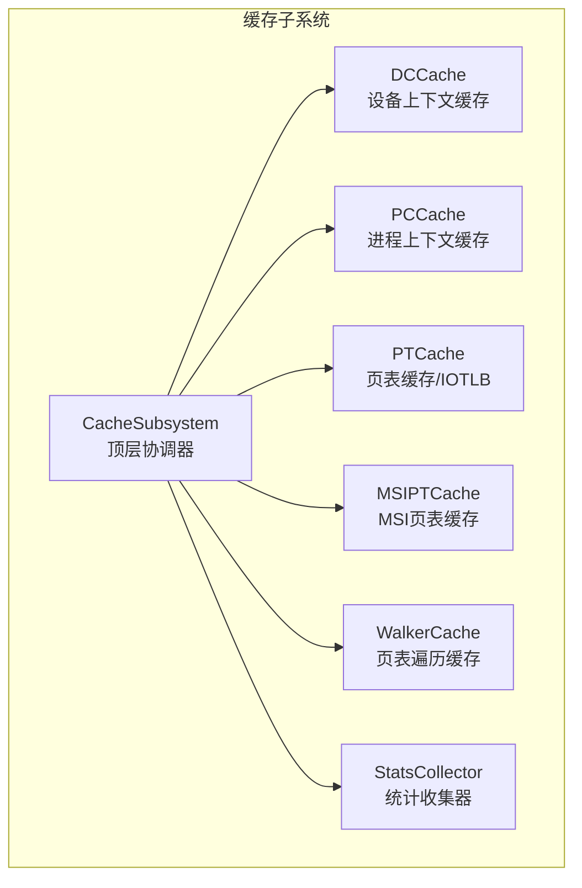
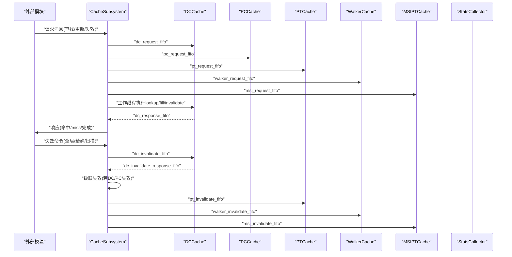
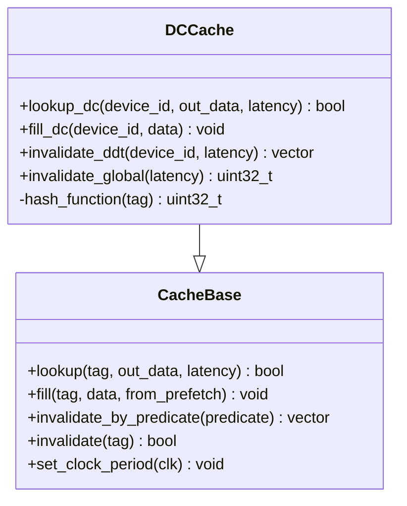
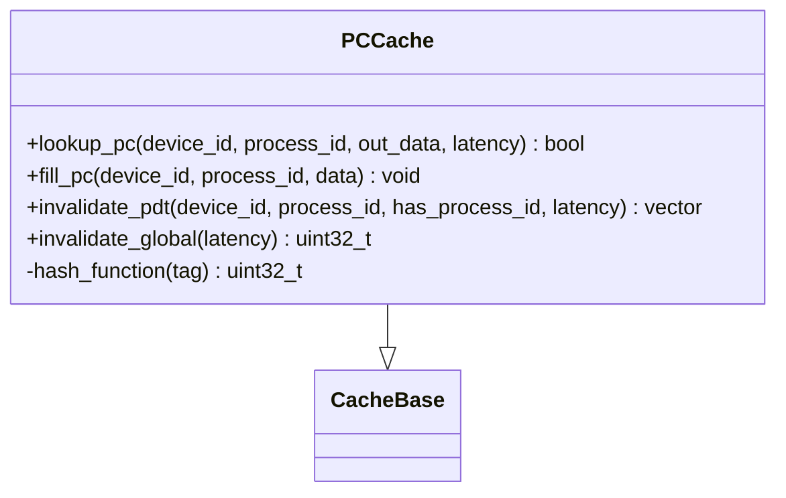
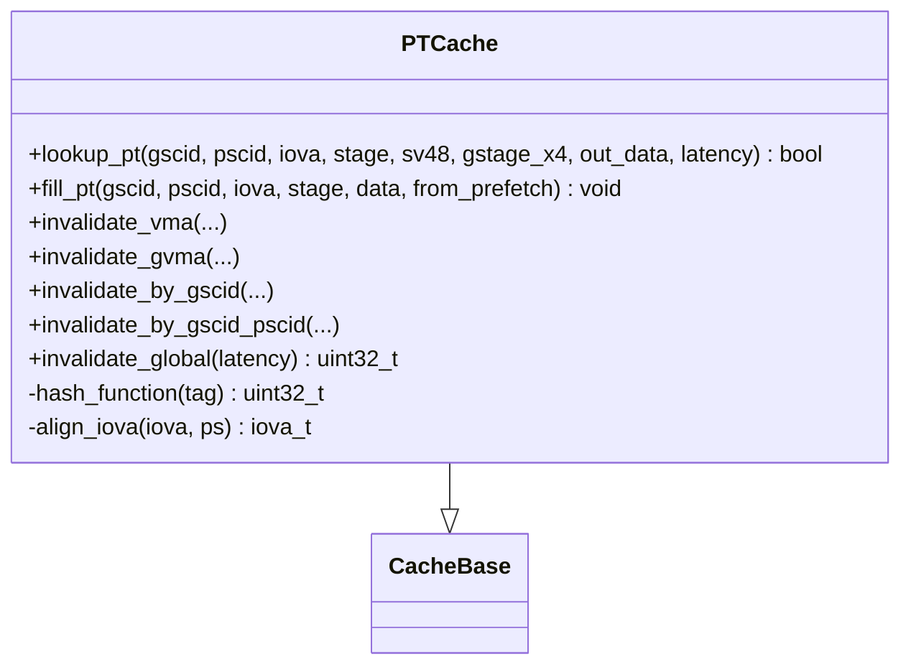
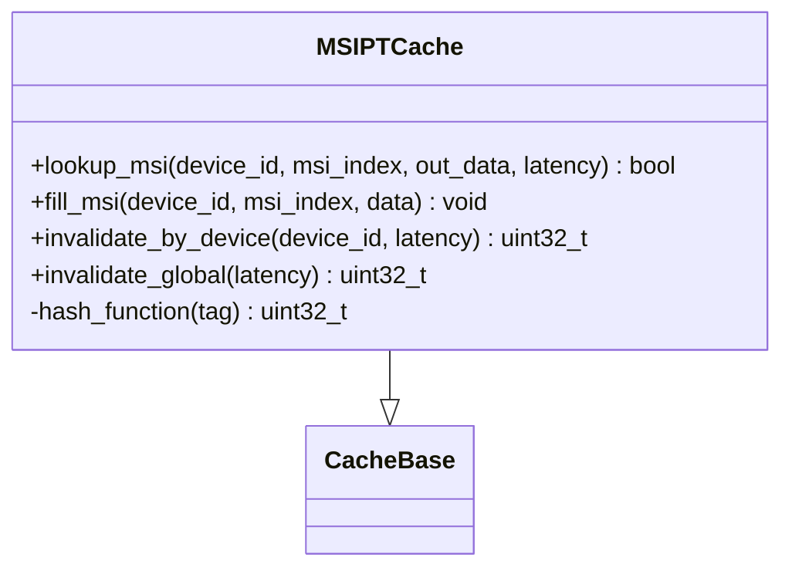
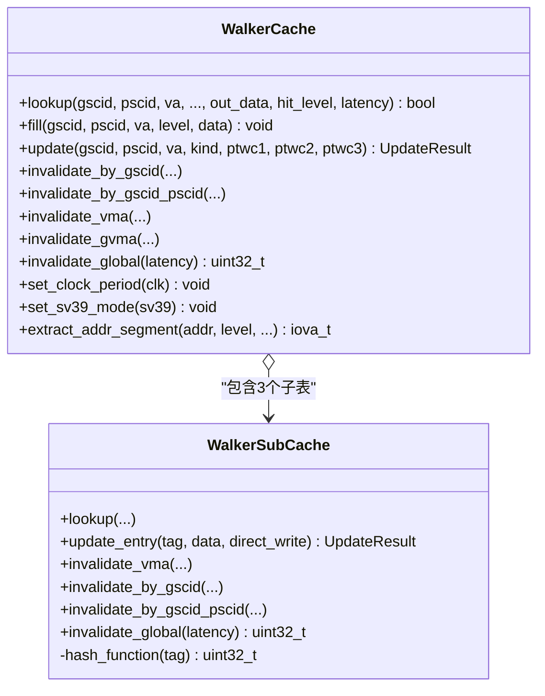
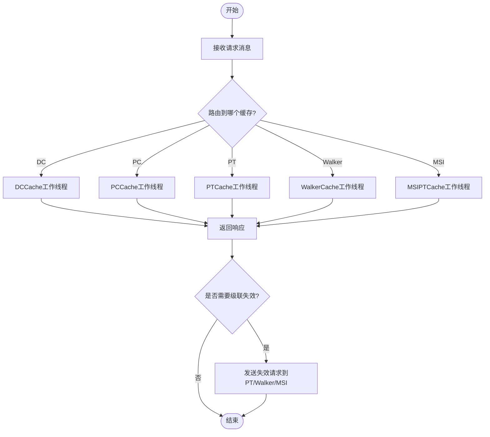
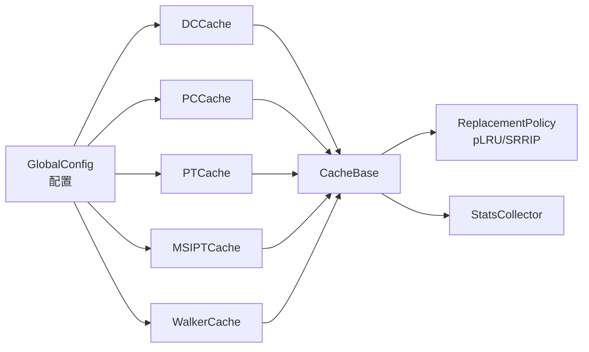

# 缓存系统架构

<cite>
**本文档引用的文件**
- [cache_base.h](file://iommu/cache_src/cache/cache_base.h)
- [cache_base.cpp](file://iommu/cache_src/cache/cache_base.cpp)
- [dc_cache.h](file://iommu/cache_src/cache/dc_cache.h)
- [dc_cache.cpp](file://iommu/cache_src/cache/dc_cache.cpp)
- [pc_cache.h](file://iommu/cache_src/cache/pc_cache.h)
- [pt_cache.h](file://iommu/cache_src/cache/pt_cache.h)
- [msipt_cache.h](file://iommu/cache_src/cache/msipt_cache.h)
- [walker_cache.h](file://iommu/cache_src/cache/walker_cache.h)
- [types.h](file://iommu/cache_src/common/types.h)
- [cache_subsystem.h](file://iommu/cache_src/subsystem/cache_subsystem.h)
- [stats_collector.h](file://iommu/cache_src/common/stats_collector.h)
- [plru_policy.h](file://iommu/cache_src/replacement/plru_policy.h)
- [srrip_policy.h](file://iommu/cache_src/replacement/srrip_policy.h)
- [default_config.json](file://iommu/cache_config/default_config.json)
- [input_params_example.json](file://iommu/cache_config/input_params_example.json)
</cite>

## 目录
1. [引言](#引言)
2. [项目结构](#项目结构)
3. [核心组件](#核心组件)
4. [架构总览](#架构总览)
5. [详细组件分析](#详细组件分析)
6. [依赖分析](#依赖分析)
7. [性能考量](#性能考量)
8. [故障排查指南](#故障排查指南)
9. [结论](#结论)
10. [附录](#附录)

## 引言
本文件面向RISC-V IOMMU缓存子系统，系统性阐述多级缓存层次设计与实现，覆盖DC Cache（设备上下文缓存）、PC Cache（进程上下文缓存）、PT Cache（页表缓存/IOTLB）、MSIPT Cache（MSI页表缓存）与Walker Cache（页表遍历缓存）。文档重点说明：
- 缓存一致性机制与级联失效流程
- 替换策略（pLRU、SRRIP）与性能建模
- 缓存子系统整体架构、组件协作与数据流
- 配置参数、性能调优与监控指标
- 命中率分析与性能瓶颈识别方法
- 具体代码示例与使用模式

## 项目结构
缓存子系统位于iommu/cache_src目录下，采用“按功能模块分层”的组织方式：
- cache：各类缓存实现（DC/PC/PT/MSIPT/Walker）
- common：公共类型、统计收集器、JSON配置解析等
- replacement：替换策略（pLRU、SRRIP）
- subsystem：顶层缓存子系统封装与工作线程

图表来源
- [cache_subsystem.h:18-98](file://iommu/cache_src/subsystem/cache_subsystem.h#L18-L98)
- [types.h:573-612](file://iommu/cache_src/common/types.h#L573-L612)

章节来源
- [cache_subsystem.h:18-98](file://iommu/cache_src/subsystem/cache_subsystem.h#L18-L98)
- [types.h:573-612](file://iommu/cache_src/common/types.h#L573-L612)

## 核心组件
- CacheBase模板基类：统一实现查找、填充、失效、仲裁与延迟建模，支持pLRU与SRRIP替换策略。
- 各类专用缓存：DC/PC/PT/MSIPT/Walker，继承自CacheBase并实现各自标签与哈希函数。
- CacheSubsystem：顶层模块，负责请求/响应队列、工作线程、级联失效与全局失效流水线。
- StatsCollector：统一统计与报告，提供命中率、淘汰次数、队列延迟、吞吐等指标。
- 配置系统：default_config.json与input_params_example.json提供全局时钟、缓存时延、替换策略、统计输出等参数。

章节来源
- [cache_base.h:26-256](file://iommu/cache_src/cache/cache_base.h#L26-L256)
- [cache_base.cpp:10-25](file://iommu/cache_src/cache/cache_base.cpp#L10-L25)
- [types.h:573-612](file://iommu/cache_src/common/types.h#L573-L612)
- [stats_collector.h:65-125](file://iommu/cache_src/common/stats_collector.h#L65-L125)
- [default_config.json:1-69](file://iommu/cache_config/default_config.json#L1-L69)
- [input_params_example.json:1-69](file://iommu/cache_config/input_params_example.json#L1-L69)

## 架构总览
缓存子系统通过SystemC sc_fifo连接各缓存模块，每个缓存拥有独立的请求/响应通道，避免串行化瓶颈。顶层CacheSubsystem维护以下关键流程：
- 查找流水线：请求进入对应缓存的请求FIFO，工作线程执行lookup，命中则返回响应，miss则触发后续处理。
- 填充流水线：外部模块发起update，缓存执行fill，必要时触发替换。
- 失效流水线：支持精确失效、扫描失效与全局失效；DC/PC失效后可级联触发PT/Walker/MSIPT失效。
- 统计与报告：StatsCollector记录访问、命中、miss、evict、invalidation、预取命中等，并生成摘要与直方图。

图表来源
- [cache_subsystem.h:33-66](file://iommu/cache_src/subsystem/cache_subsystem.h#L33-L66)
- [cache_subsystem.h:109-156](file://iommu/cache_src/subsystem/cache_subsystem.h#L109-L156)

章节来源
- [cache_subsystem.h:33-66](file://iommu/cache_src/subsystem/cache_subsystem.h#L33-L66)
- [cache_subsystem.h:109-156](file://iommu/cache_src/subsystem/cache_subsystem.h#L109-L156)

## 详细组件分析

### DC Cache（设备上下文缓存）
- 功能：缓存设备ID到设备上下文（device_context_t）的映射，支持按设备ID查找与填充，支持DDT失效并返回受影响的gscid/pscid用于级联。
- 标签与哈希：基于device_id构造DCTag，哈希函数结合高字节与中字节异或掩码。
- 一致性：DDT失效后，返回受影响的上下文对，供上层触发PC/PT/Walker/MSIPT级联失效。
- 时延与统计：继承自CacheBase，包含仲裁、哈希、读set、比较、写way等时延建模与命中/miss统计。

图表来源
- [cache_base.h:26-256](file://iommu/cache_src/cache/cache_base.h#L26-L256)
- [dc_cache.h:8-31](file://iommu/cache_src/cache/dc_cache.h#L8-L31)
- [dc_cache.cpp:47-50](file://iommu/cache_src/cache/dc_cache.cpp#L47-L50)

章节来源
- [dc_cache.h:8-31](file://iommu/cache_src/cache/dc_cache.h#L8-L31)
- [dc_cache.cpp:11-45](file://iommu/cache_src/cache/dc_cache.cpp#L11-L45)
- [cache_base.h:258-406](file://iommu/cache_src/cache/cache_base.h#L258-L406)

### PC Cache（进程上下文缓存）
- 功能：缓存(device_id, process_id)到进程上下文（process_context_t）的映射，支持按设备与进程ID查找/填充，支持PDT失效并返回受影响的gscid/pscid用于级联。
- 标签与哈希：基于device_id与process_id构造PCTag，哈希函数确保跨设备与进程均匀分布。
- 一致性：PDT失效后，返回受影响的上下文对，供上层触发PT/Walker/MSIPT级联失效。

图表来源
- [cache_base.h:26-256](file://iommu/cache_src/cache/cache_base.h#L26-L256)
- [pc_cache.h:8-33](file://iommu/cache_src/cache/pc_cache.h#L8-L33)

章节来源
- [pc_cache.h:8-33](file://iommu/cache_src/cache/pc_cache.h#L8-L33)
- [cache_base.h:258-406](file://iommu/cache_src/cache/cache_base.h#L258-L406)

### PT Cache（页表缓存/IOTLB）
- 功能：缓存(gscid, pscid, iova)到页表项（spte_t/gpte_t + reserved）的映射，支持按阶段（一阶/二阶/两阶）与SV48/X4模式查询，支持VMA/GVMA失效与按gscid/pscid批量失效。
- 标签与哈希：基于gscid/pscid/iova构造PTTag，哈希函数考虑地址对齐与页大小。
- 一致性：VMA/GVMA失效支持精确/扫描/全局三种模式，按需触发级联失效。
- 性能：配置较大的sets与ways，采用pLRU或SRRIP提升命中率；支持预取标记以统计预取命中。

图表来源
- [cache_base.h:26-256](file://iommu/cache_src/cache/cache_base.h#L26-L256)
- [pt_cache.h:8-54](file://iommu/cache_src/cache/pt_cache.h#L8-L54)

章节来源
- [pt_cache.h:18-46](file://iommu/cache_src/cache/pt_cache.h#L18-L46)
- [cache_base.h:258-406](file://iommu/cache_src/cache/cache_base.h#L258-L406)

### MSIPT Cache（MSI页表缓存）
- 功能：缓存(device_id, msi_index)到MSI页表项（MSIPTData）的映射，支持按设备与索引查找/填充，支持按设备批量失效。
- 标签与哈希：基于device_id与msi_index构造MSIPTTag，哈希函数保证均匀分布。
- 一致性：按设备失效用于处理MSI页表变更，避免脏数据导致中断翻译错误。

图表来源
- [cache_base.h:26-256](file://iommu/cache_src/cache/cache_base.h#L26-L256)
- [msipt_cache.h:8-27](file://iommu/cache_src/cache/msipt_cache.h#L8-L27)

章节来源
- [msipt_cache.h:16-23](file://iommu/cache_src/cache/msipt_cache.h#L16-L23)
- [cache_base.h:258-406](file://iommu/cache_src/cache/cache_base.h#L258-L406)

### Walker Cache（页表遍历缓存）
- 功能：内含三个子表（PTWc_1/2/3），分别缓存不同层级页表中间结果，支持按VA/PA、阶段、SV48/X4模式查询与更新，支持按gscid/pscid/VMA/GVMA失效。
- 结构：PTWc_1为直接映射（1-way），PTWc_2为2-way组相联，PTWc_3为4-way组相联；支持sv39模式切换。
- 查询策略：lookup不指定level，内部按3>2>1顺序查询，命中level回传；update支持批量更新多个子表。
- 一致性：支持精确/扫描/全局失效，按gscid/pscid批量失效，以及与VMA/GVMA关联失效。

图表来源
- [cache_base.h:26-256](file://iommu/cache_src/cache/cache_base.h#L26-L256)
- [walker_cache.h:15-92](file://iommu/cache_src/cache/walker_cache.h#L15-L92)
- [walker_cache.h:95-124](file://iommu/cache_src/cache/walker_cache.h#L95-L124)

章节来源
- [walker_cache.h:26-71](file://iommu/cache_src/cache/walker_cache.h#L26-L71)
- [walker_cache.h:95-124](file://iommu/cache_src/cache/walker_cache.h#L95-L124)
- [cache_base.h:258-406](file://iommu/cache_src/cache/cache_base.h#L258-L406)

### CacheSubsystem（顶层协调器）
- 职责：管理各缓存实例，维护请求/响应FIFO，启动各缓存的工作线程，处理级联失效与全局失效流水线。
- 流水线：每个缓存拥有独立的请求/响应通道，避免串行化；Walker采用统一轮询调度线程。
- 级联失效：DC/PC失效后，根据返回的gscid/pscid对触发PT/Walker/MSIPT失效。

图表来源
- [cache_subsystem.h:109-156](file://iommu/cache_src/subsystem/cache_subsystem.h#L109-L156)
- [cache_subsystem.h:77-81](file://iommu/cache_src/subsystem/cache_subsystem.h#L77-L81)

章节来源
- [cache_subsystem.h:18-98](file://iommu/cache_src/subsystem/cache_subsystem.h#L18-L98)
- [cache_subsystem.h:109-156](file://iommu/cache_src/subsystem/cache_subsystem.h#L109-L156)

## 依赖分析
- 组件耦合：CacheBase为所有缓存的共同基类，提供统一的仲裁、替换、统计与延迟建模；各专用缓存仅关注标签与哈希。
- 替换策略：PLRUPolicy与SRRIPPolicy通过工厂方法注入，支持pLRU与SRRIP两种策略。
- 配置依赖：GlobalConfig集中管理时钟周期、缓存时延、替换策略、统计输出等；default_config.json与input_params_example.json提供默认与示例配置。
- 统计依赖：StatsCollector被CacheBase与CacheSubsystem共享，统一记录访问、命中、miss、evict、invalidation、预取命中与延迟直方图。

图表来源
- [types.h:599-612](file://iommu/cache_src/common/types.h#L599-L612)
- [cache_base.h:235-252](file://iommu/cache_src/cache/cache_base.h#L235-L252)
- [stats_collector.h:65-125](file://iommu/cache_src/common/stats_collector.h#L65-L125)

章节来源
- [types.h:599-612](file://iommu/cache_src/common/types.h#L599-L612)
- [cache_base.h:235-252](file://iommu/cache_src/cache/cache_base.h#L235-L252)
- [stats_collector.h:65-125](file://iommu/cache_src/common/stats_collector.h#L65-L125)

## 性能考量
- 替换策略
  - pLRU（Tree-based）：适合高并发场景，开销小，适用于DC/PC/MSIPT等中等规模缓存。
  - SRRIP（Static RRIP）：适合PT/Walker等大规模缓存，M位RRPV控制替换偏好，提升命中率。
- 仲裁与延迟建模
  - CacheBase内置WRR仲裁，lookup/fill/invalidate三类操作按权重轮转，避免饥饿；仲裁阶段与各阶段时延可配置。
  - 通过CacheConfig中的hash/read_set/compare/fill_compute/write等cycles参数精细建模。
- 预取与命中率
  - 支持预取标记，统计预取命中率与准确性，有助于识别热点与优化预取策略。
- 配置调优
  - sets与ways：PT/Walker通常增大sets与ways以降低miss；DC/PC/MSIPT可适度减小以节省面积。
  - replacement：PT/Walker建议使用SRRIP；直接映射（1-way）无需替换策略。
  - srrip_m_bits：SRRIP的M值越大，对近期访问更敏感，适合波动较大的工作负载。
- 监控指标
  - 命中率、miss率、淘汰次数、无效化次数、平均执行/排队/请求延迟、吞吐（IOPS）与延迟直方图。

章节来源
- [cache_base.h:88-152](file://iommu/cache_src/cache/cache_base.h#L88-L152)
- [plru_policy.h:10-33](file://iommu/cache_src/replacement/plru_policy.h#L10-L33)
- [srrip_policy.h:10-33](file://iommu/cache_src/replacement/srrip_policy.h#L10-L33)
- [stats_collector.h:13-63](file://iommu/cache_src/common/stats_collector.h#L13-L63)
- [types.h:573-612](file://iommu/cache_src/common/types.h#L573-L612)

## 故障排查指南
- 命中率异常下降
  - 检查sets/ways配置是否过小；确认替换策略是否合适（PT/Walker建议SRRIP）。
  - 分析预取命中率与准确性，评估预取策略有效性。
- 失效不生效或级联缺失
  - 确认DC/PC失效后是否正确返回gscid/pscid并触发PT/Walker/MSIPT失效。
  - 检查失效模式（PRECISE/SCAN/GLOBAL）与参数（has_gscid/has_pscid/has_iova）。
- 延迟过高
  - 检查仲裁权重与仲裁阶段时延；核对hash/read_set/compare/fill_compute/write等时延配置。
  - 关注队列延迟直方图，定位瓶颈阶段。
- 统计缺失或异常
  - 确认StatsCollector输出文件路径与任务跟踪级别；检查是否启用延迟直方图与任务跟踪。

章节来源
- [cache_subsystem.h:77-81](file://iommu/cache_src/subsystem/cache_subsystem.h#L77-L81)
- [stats_collector.h:104-125](file://iommu/cache_src/common/stats_collector.h#L104-L125)
- [cache_base.h:560-671](file://iommu/cache_src/cache/cache_base.h#L560-L671)

## 结论
本缓存子系统通过统一的CacheBase模板与顶层CacheSubsystem协调器，实现了DC/PC/PT/MSIPT/Walker五级缓存的高效协同。其关键优势在于：
- 明确的一致性与级联失效机制，确保翻译正确性；
- 可插拔的替换策略与精细的时延建模，便于性能调优；
- 统一的统计与报告体系，支撑命中率分析与瓶颈识别；
- 清晰的配置接口，便于在不同工作负载下进行参数优化。

## 附录

### 缓存配置参数与示例
- 全局参数：clock_period_ns、random_seed
- 时序参数：arbiter_latency_cycles、hash_latency_cycles、read_set_latency_cycles、compare_latency_cycles、fill_compute_index_*、write_way_latency_cycles、invalidation_compare_per_way_cycles
- 各缓存参数：num_sets、num_ways、replacement、srrip_m_bits（仅SRRIP）
- 统计参数：output_file、enable_latency_histogram、enable_task_trace、task_trace_level、histogram_bin_width_ns

章节来源
- [default_config.json:1-69](file://iommu/cache_config/default_config.json#L1-L69)
- [input_params_example.json:1-69](file://iommu/cache_config/input_params_example.json#L1-L69)
- [types.h:573-612](file://iommu/cache_src/common/types.h#L573-L612)

### 使用模式与代码示例（路径引用）
- 查找设备上下文
  - [dc_cache.cpp:11-16](file://iommu/cache_src/cache/dc_cache.cpp#L11-L16)
- 填充设备上下文
  - [dc_cache.cpp:18-22](file://iommu/cache_src/cache/dc_cache.cpp#L18-L22)
- DC DDT失效并获取级联上下文
  - [dc_cache.cpp:24-41](file://iommu/cache_src/cache/dc_cache.cpp#L24-L41)
- 查找进程上下文
  - [pc_cache.h:16-19](file://iommu/cache_src/cache/pc_cache.h#L16-L19)
- PT查询（带阶段与SV48/X4）
  - [pt_cache.h:18-24](file://iommu/cache_src/cache/pt_cache.h#L18-L24)
- PT VMA/GVMA失效
  - [pt_cache.h:31-40](file://iommu/cache_src/cache/pt_cache.h#L31-L40)
- MSI查找与失效
  - [msipt_cache.h:16-23](file://iommu/cache_src/cache/msipt_cache.h#L16-L23)
- Walker查询与更新
  - [walker_cache.h:27-52](file://iommu/cache_src/cache/walker_cache.h#L27-L52)
- CacheSubsystem请求/响应与级联失效
  - [cache_subsystem.h:33-81](file://iommu/cache_src/subsystem/cache_subsystem.h#L33-L81)