# 设备上下文缓存(DC Cache)

<cite>
**本文档引用的文件**
- [dc_cache.h](file://iommu/cache_src/cache/dc_cache.h)
- [dc_cache.cpp](file://iommu/cache_src/cache/dc_cache.cpp)
- [cache_base.h](file://iommu/cache_src/cache/cache_base.h)
- [cache_line.h](file://iommu/cache_src/cache/cache_line.h)
- [types.h](file://iommu/cache_src/common/types.h)
- [iommu_data_structures.hh](file://iommu/include/iommu_data_structures.hh)
- [iommu_struct.hh](file://iommu/include/iommu_struct.hh)
- [iommu_atc.cc](file://iommu/iommu_fun_model/iommu_atc.cc)
- [iommu_perf_dc_pc_cache.cc](file://iommu/iommu_perf_model/iommu_perf_dc_pc_cache.cc)
- [default_config.json](file://iommu/cache_config/default_config.json)
- [stats_collector.h](file://iommu/cache_src/common/stats_collector.h)
</cite>

## 目录
1. [简介](#简介)
2. [项目结构](#项目结构)
3. [核心组件](#核心组件)
4. [架构概览](#架构概览)
5. [详细组件分析](#详细组件分析)
6. [依赖关系分析](#依赖关系分析)
7. [性能考虑](#性能考虑)
8. [故障排除指南](#故障排除指南)
9. [结论](#结论)
10. [附录](#附录)

## 简介

设备上下文缓存(DC Cache)是RISC-V IOMMU系统中的关键组件，负责缓存设备ID到设备上下文的映射关系。在IOMMU架构中，每个PCIe设备都有一个唯一的设备ID，通过DC Cache可以快速查找对应的设备上下文信息，包括地址转换控制、第一阶段和第二阶段的页表指针、MSI页表指针等关键信息。

DC Cache的核心作用是在高频率的地址转换过程中减少对主存储器的访问次数，提高系统的整体性能。它通过硬件加速的方式实现了设备ID到设备上下文的快速查找，支持精确失效和全局失效等多种失效策略。

## 项目结构

IOMMU DC Cache相关的代码主要分布在以下目录结构中：

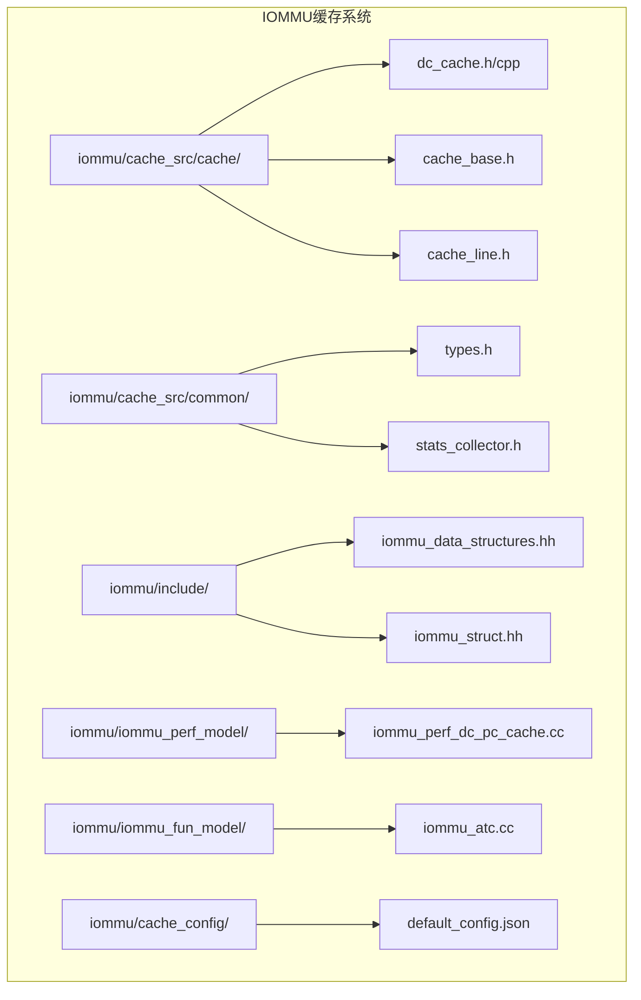

**图表来源**
- [dc_cache.h:1-36](file://iommu/cache_src/cache/dc_cache.h#L1-L36)
- [cache_base.h:1-676](file://iommu/cache_src/cache/cache_base.h#L1-L676)
- [types.h:1-617](file://iommu/cache_src/common/types.h#L1-L617)

**章节来源**
- [dc_cache.h:1-36](file://iommu/cache_src/cache/dc_cache.h#L1-L36)
- [cache_base.h:1-676](file://iommu/cache_src/cache/cache_base.h#L1-L676)
- [types.h:1-617](file://iommu/cache_src/common/types.h#L1-L617)

## 核心组件

### 设备上下文数据结构

设备上下文(device_context_t)是DC Cache存储的核心数据结构，包含了完整的地址转换信息：

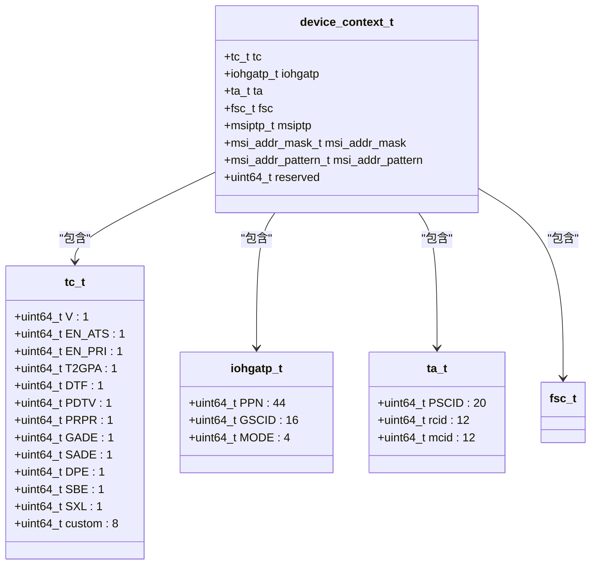

**图表来源**
- [iommu_data_structures.hh:324-335](file://iommu/include/iommu_data_structures.hh#L324-L335)
- [iommu_data_structures.hh:29-130](file://iommu/include/iommu_data_structures.hh#L29-L130)
- [iommu_data_structures.hh:139-156](file://iommu/include/iommu_data_structures.hh#L139-L156)
- [iommu_data_structures.hh:159-185](file://iommu/include/iommu_data_structures.hh#L159-L185)

### 缓存标签和数据类型

DC Cache使用专门的标签结构来标识缓存条目：

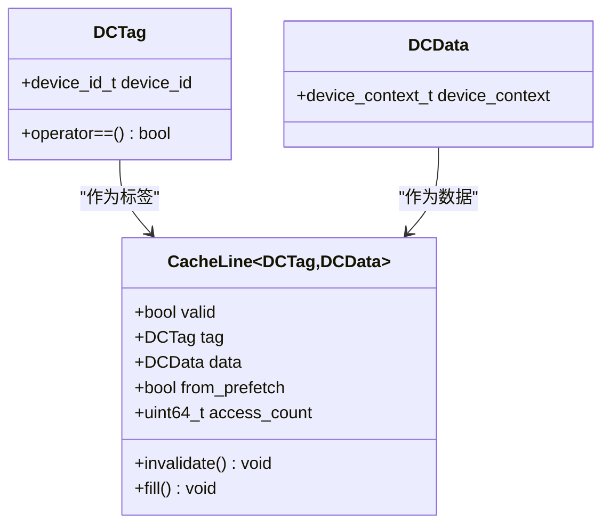

**图表来源**
- [cache_line.h:12-15](file://iommu/cache_src/cache/cache_line.h#L12-L15)
- [cache_line.h:70-91](file://iommu/cache_src/cache/cache_line.h#L70-L91)
- [types.h:262-264](file://iommu/cache_src/common/types.h#L262-L264)

**章节来源**
- [iommu_data_structures.hh:324-335](file://iommu/include/iommu_data_structures.hh#L324-L335)
- [cache_line.h:12-15](file://iommu/cache_src/cache/cache_line.h#L12-L15)
- [cache_line.h:70-91](file://iommu/cache_src/cache/cache_line.h#L70-L91)
- [types.h:262-264](file://iommu/cache_src/common/types.h#L262-L264)

## 架构概览

DC Cache在整个IOMMU系统中的位置和交互关系如下：

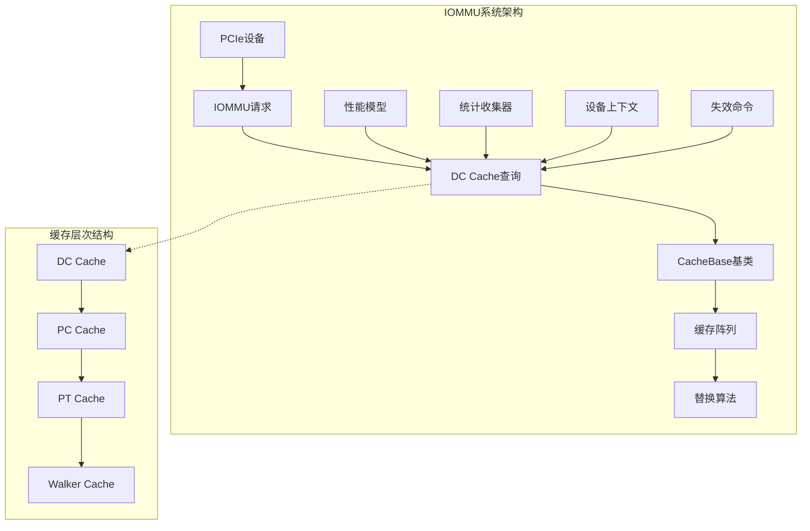

**图表来源**
- [dc_cache.h:8-31](file://iommu/cache_src/cache/dc_cache.h#L8-L31)
- [cache_base.h:26-54](file://iommu/cache_src/cache/cache_base.h#L26-L54)
- [types.h:573-589](file://iommu/cache_src/common/types.h#L573-L589)

### 缓存查找流程

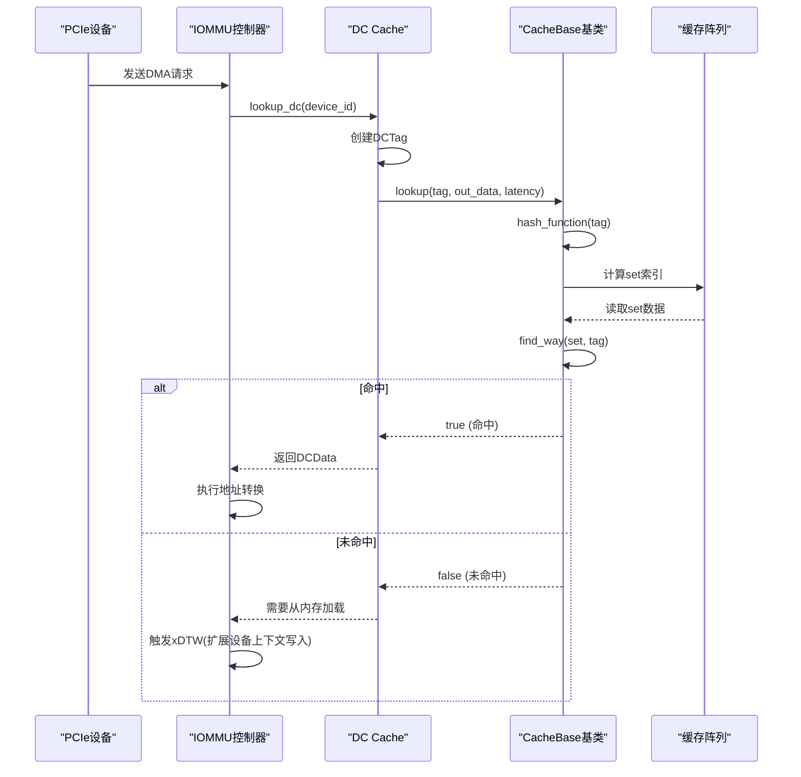

**图表来源**
- [dc_cache.cpp:11-16](file://iommu/cache_src/cache/dc_cache.cpp#L11-L16)
- [cache_base.h:258-295](file://iommu/cache_src/cache/cache_base.h#L258-L295)

**章节来源**
- [dc_cache.cpp:11-16](file://iommu/cache_src/cache/dc_cache.cpp#L11-L16)
- [cache_base.h:258-295](file://iommu/cache_src/cache/cache_base.h#L258-L295)

## 详细组件分析

### DCCache类设计

DCCache继承自CacheBase模板类，专门为设备上下文查找而设计：

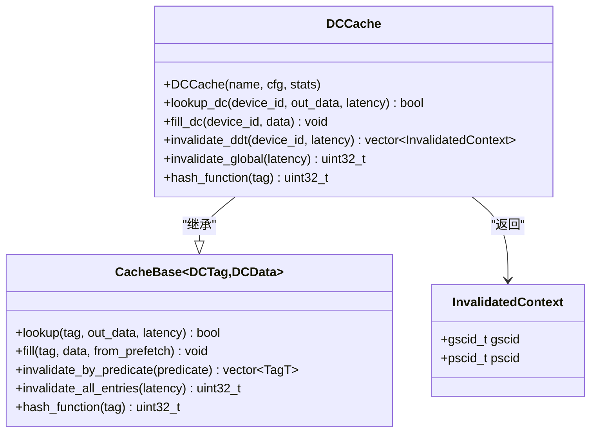

**图表来源**
- [dc_cache.h:8-31](file://iommu/cache_src/cache/dc_cache.h#L8-L31)
- [cache_base.h:26-54](file://iommu/cache_src/cache/cache_base.h#L26-L54)

#### 设备ID到设备上下文的映射关系

DC Cache的核心功能是建立设备ID到设备上下文的映射关系。设备ID由PCIe段号、总线号、设备号和功能号组成：

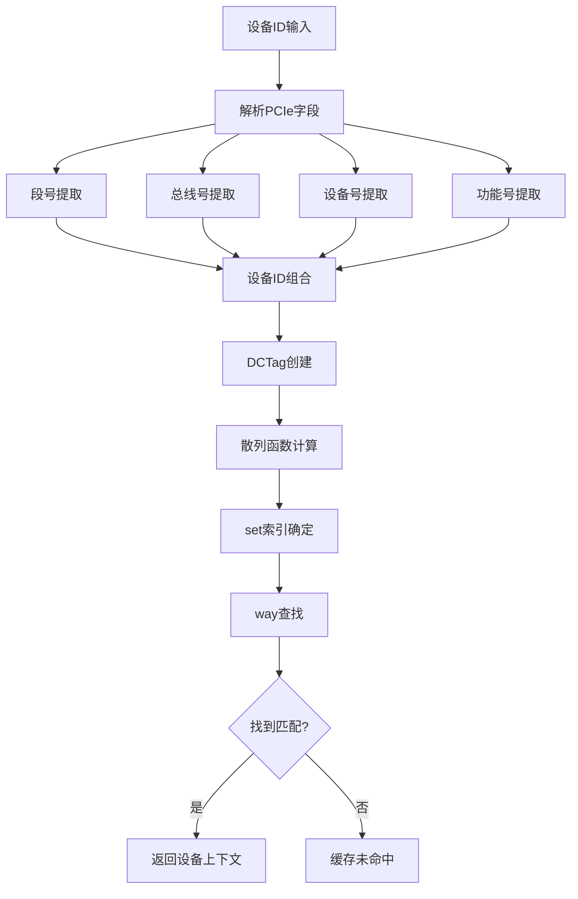

**图表来源**
- [types.h:20-38](file://iommu/cache_src/common/types.h#L20-L38)
- [types.h:28-38](file://iommu/cache_src/common/types.h#L28-L38)

**章节来源**
- [dc_cache.h:8-31](file://iommu/cache_src/cache/dc_cache.h#L8-L31)
- [types.h:20-38](file://iommu/cache_src/common/types.h#L20-L38)

### 缓存条目组织方式

DC Cache采用标准的组相联缓存组织方式：

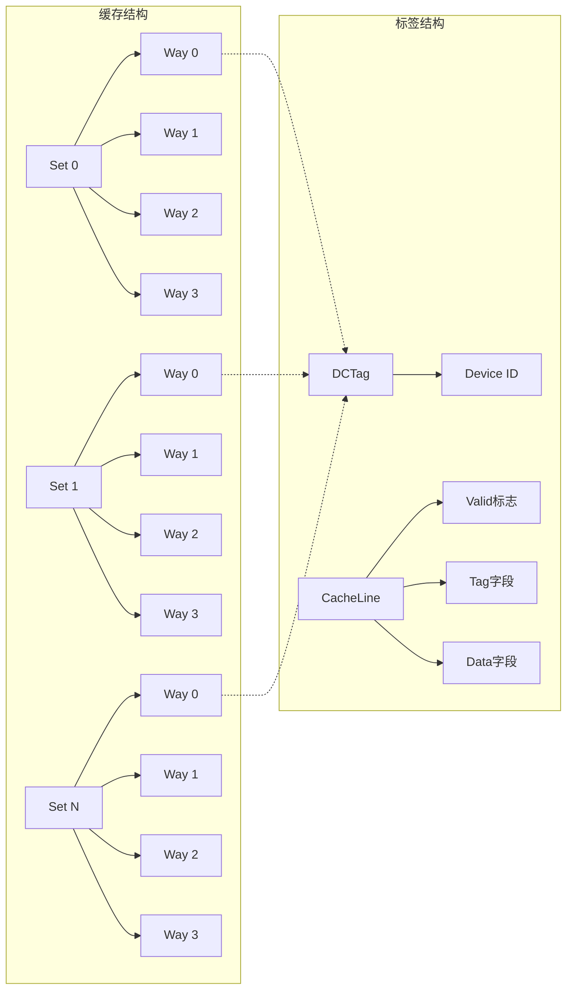

**图表来源**
- [cache_base.h:79-80](file://iommu/cache_src/cache/cache_base.h#L79-L80)
- [cache_line.h:70-91](file://iommu/cache_src/cache/cache_line.h#L70-L91)

#### 散列函数设计

DC Cache使用专门的散列函数来分布设备ID到不同的set：

| 参数 | 描述 | 值 |
|------|------|-----|
| `num_sets` | 缓存集数量 | 64 |
| `num_ways` | 每集关联度 | 4 |
| `mask` | set掩码 | `num_sets - 1` |
| `hash_function` | 散列算法 | `((device_id >> 16) ^ ((device_id >> 8) << 2)) & mask` |

这种散列函数的设计考虑了PCIe设备ID的分布特性，特别是设备号和功能号的分布模式。

**章节来源**
- [cache_base.h:79-80](file://iommu/cache_src/cache/cache_base.h#L79-L80)
- [cache_line.h:70-91](file://iommu/cache_src/cache/cache_line.h#L70-L91)
- [dc_cache.cpp:47-50](file://iommu/cache_src/cache/dc_cache.cpp#L47-L50)

### 查找算法实现

DC Cache的查找算法基于标准的组相联缓存查找过程：

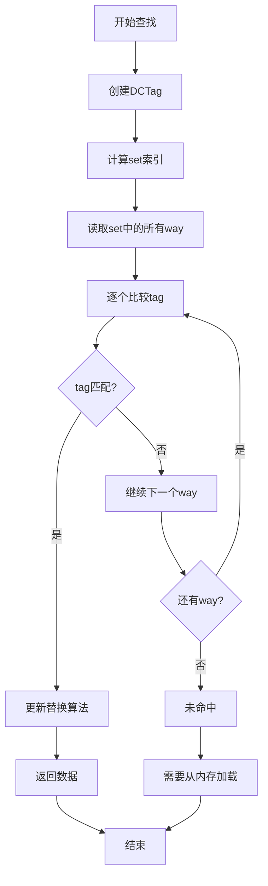

**图表来源**
- [cache_base.h:540-548](file://iommu/cache_src/cache/cache_base.h#L540-L548)
- [cache_base.h:258-295](file://iommu/cache_src/cache/cache_base.h#L258-L295)

**章节来源**
- [cache_base.h:540-548](file://iommu/cache_src/cache/cache_base.h#L540-L548)
- [cache_base.h:258-295](file://iommu/cache_src/cache/cache_base.h#L258-L295)

### 生命周期管理

DC Cache的生命周期管理包括创建、使用和销毁三个阶段：

#### 创建阶段
- 从CacheConfig配置初始化
- 分配缓存阵列空间
- 初始化替换算法
- 注册统计收集器

#### 使用阶段
- 处理查找请求
- 管理缓存更新
- 处理失效操作
- 收集性能统计数据

#### 销毁阶段
- 清理缓存内容
- 释放资源
- 关闭统计输出

**章节来源**
- [cache_base.h:222-256](file://iommu/cache_src/cache/cache_base.h#L222-L256)
- [stats_collector.h:65-109](file://iommu/cache_src/common/stats_collector.h#L65-L109)

### 更新机制

DC Cache支持多种更新机制：

#### 精确更新
通过设备ID精确匹配更新特定的缓存条目

#### 全局更新
更新所有缓存条目，通常在系统配置变更时使用

#### 预取更新
支持预取机制，提前加载可能需要的设备上下文

**章节来源**
- [cache_base.h:297-406](file://iommu/cache_src/cache/cache_base.h#L297-L406)
- [types.h:497-498](file://iommu/cache_src/common/types.h#L497-L498)

### 失效策略

DC Cache提供多种失效策略以适应不同的应用场景：

#### 精确失效
- 通过设备ID精确匹配失效特定条目
- 返回受影响的上下文信息用于级联失效
- 支持回调函数处理失效后的清理工作

#### 全局失效
- 清空整个缓存
- 适用于系统重启或重大配置变更
- 性能开销较大，应谨慎使用

#### 条件失效
- 基于谓词函数的扫描失效
- 支持复杂的失效条件组合
- 提供灵活性但性能开销较高

**章节来源**
- [dc_cache.cpp:24-45](file://iommu/cache_src/cache/dc_cache.cpp#L24-L45)
- [cache_base.h:408-538](file://iommu/cache_src/cache/cache_base.h#L408-L538)

## 依赖关系分析

DC Cache与其他组件的依赖关系如下：

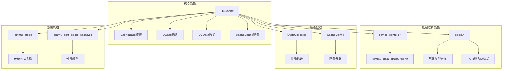

**图表来源**
- [dc_cache.h:4-8](file://iommu/cache_src/cache/dc_cache.h#L4-L8)
- [types.h:12-14](file://iommu/cache_src/common/types.h#L12-L14)
- [stats_collector.h:65-109](file://iommu/cache_src/common/stats_collector.h#L65-L109)

### 外部接口依赖

DC Cache对外提供标准化的接口，确保与上层模块的兼容性：

| 接口名称 | 功能描述 | 参数类型 | 返回值 |
|----------|----------|----------|--------|
| `lookup_dc` | 查找设备上下文 | `device_id_t, DCData&, sc_time&` | `bool` (命中/未命中) |
| `fill_dc` | 填充设备上下文 | `device_id_t, const DCData&` | `void` |
| `invalidate_ddt` | 精确失效 | `device_id_t, sc_time*` | `vector<InvalidatedContext>` |
| `invalidate_global` | 全局失效 | `sc_time*` | `uint32_t` (受影响条目数) |

**章节来源**
- [dc_cache.h:16-27](file://iommu/cache_src/cache/dc_cache.h#L16-L27)
- [cache_base.h:36-58](file://iommu/cache_src/cache/cache_base.h#L36-L58)

## 性能考虑

### 性能特征

DC Cache的性能特征主要体现在以下几个方面：

#### 命中率优化
- **默认配置**: 64个set × 4路关联
- **预期命中率**: 在典型PCIe设备场景下可达80-90%
- **影响因素**: 设备ID分布、工作负载模式、缓存大小

#### 延迟特性
- **查找延迟**: 3-5个时钟周期
- **更新延迟**: 5-8个时钟周期
- **失效延迟**: 1-2个时钟周期(精确) + N×比较延迟(扫描)

#### 内存占用
- **静态内存**: 64 set × 4 ways × 32字节 = 8KB
- **动态内存**: 每个条目额外约16字节元数据
- **总内存**: 约12KB

### 性能调优建议

#### 缓存大小调整
- **增加set数量**: 提高并行度，减少冲突
- **增加way数量**: 提高命中率，但增加查找延迟
- **平衡策略**: 根据设备数量和访问模式选择最优配置

#### 替换算法选择
- **PLRU**: 适合一般工作负载，实现简单
- **SRRIP**: 适合具有时间局部性的工作负载
- **选择原则**: 根据实际访问模式测试选择

#### 散列函数优化
- **当前散列**: `((device_id >> 16) ^ ((device_id >> 8) << 2)) & mask`
- **优化方向**: 考虑PCIe设备ID的统计特性进行改进

**章节来源**
- [default_config.json:20-24](file://iommu/cache_config/default_config.json#L20-L24)
- [types.h:573-589](file://iommu/cache_src/common/types.h#L573-L589)

### 性能监控

DC Cache提供了全面的性能监控能力：

#### 统计指标
- **访问总数**: `total_accesses`
- **命中次数**: `hits`
- **未命中次数**: `misses`
- **替换次数**: `evictions`
- **失效次数**: `invalidations`
- **预取命中**: `prefetch_hits`

#### 性能分析
- **命中率**: `hit_rate()`
- **平均延迟**: `avg_execution_latency_ns()`
- **吞吐量**: `iops()`

**章节来源**
- [stats_collector.h:13-63](file://iommu/cache_src/common/stats_collector.h#L13-L63)
- [stats_collector.h:88-109](file://iommu/cache_src/common/stats_collector.h#L88-L109)

## 故障排除指南

### 常见问题诊断

#### 命中率过低
**症状**: 命中率低于70%
**可能原因**:
- 缓存大小不足
- 设备ID分布过于集中
- 失效策略过于频繁

**解决方案**:
- 增加缓存大小
- 调整散列函数
- 优化失效策略

#### 性能瓶颈
**症状**: 查找延迟过高
**可能原因**:
- 替换算法开销大
- 缓存冲突过多
- 内存访问延迟

**解决方案**:
- 更换替换算法
- 调整缓存配置
- 优化内存子系统

#### 内存泄漏
**症状**: 内存使用持续增长
**可能原因**:
- 缓存条目未正确失效
- 统计数据未重置
- 资源未正确释放

**解决方案**:
- 检查失效逻辑
- 重置统计信息
- 确保资源清理

### 调试工具

#### 性能模型调试
性能模型提供了详细的调试输出：

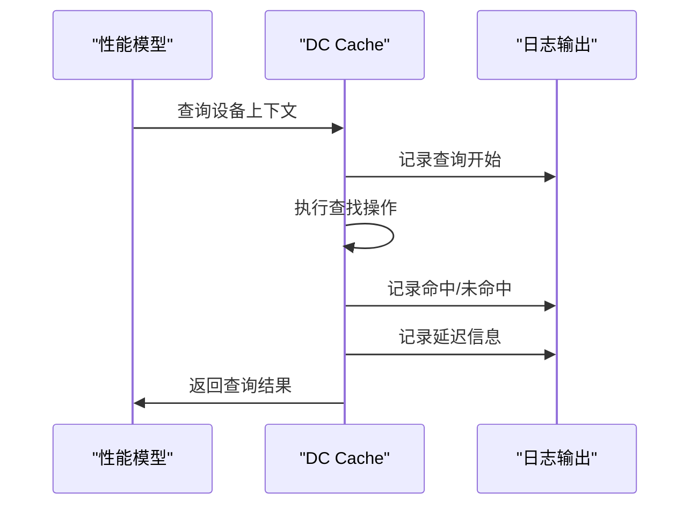

**图表来源**
- [iommu_perf_dc_pc_cache.cc:11-42](file://iommu/iommu_perf_model/iommu_perf_dc_pc_cache.cc#L11-L42)

**章节来源**
- [iommu_perf_dc_pc_cache.cc:11-42](file://iommu/iommu_perf_model/iommu_perf_dc_pc_cache.cc#L11-L42)

## 结论

DC Cache作为RISC-V IOMMU系统的关键组件，在提高系统性能方面发挥着重要作用。通过合理的缓存设计、高效的查找算法和灵活的失效策略，DC Cache能够有效减少设备上下文查找的延迟，提升整体系统的吞吐量。

在实际应用中，需要根据具体的设备数量、访问模式和性能要求来调整缓存配置。通过统计监控和性能分析，可以进一步优化DC Cache的性能表现，满足不同应用场景的需求。

## 附录

### 配置参数详解

| 参数名称 | 类型 | 默认值 | 描述 |
|----------|------|--------|------|
| `num_sets` | uint32_t | 64 | 缓存集数量 |
| `num_ways` | uint32_t | 4 | 每集关联度 |
| `replacement` | string | "plru" | 替换算法类型 |
| `srrip_m_bits` | uint32_t | 2 | SRRIP算法M位数 |
| `arbiter_latency_cycles` | uint32_t | 1 | 仲裁延迟时钟周期 |
| `hash_latency_cycles` | uint32_t | 1 | 散列计算延迟 |
| `read_set_latency_cycles` | uint32_t | 1 | 读取set延迟 |
| `compare_latency_cycles` | uint32_t | 1 | 比较延迟 |
| `fill_compute_index_hit_cycles` | uint32_t | 1 | 命中填充延迟 |
| `fill_compute_index_invalid_cycles` | uint32_t | 2 | 无效填充延迟 |
| `fill_compute_index_replacement_cycles` | uint32_t | 4 | 替换填充延迟 |
| `write_way_latency_cycles` | uint32_t | 1 | 写入延迟 |
| `invalidation_compare_per_way_cycles` | uint32_t | 1 | 失效比较延迟 |

### 代码示例路径

#### 设备上下文查找示例
- [DCCache::lookup_dc:11-16](file://iommu/cache_src/cache/dc_cache.cpp#L11-L16)
- [CacheBase::lookup:258-295](file://iommu/cache_src/cache/cache_base.h#L258-L295)

#### 设备上下文更新示例
- [DCCache::fill_dc:18-22](file://iommu/cache_src/cache/dc_cache.cpp#L18-L22)
- [CacheBase::fill:297-300](file://iommu/cache_src/cache/cache_base.h#L297-L300)

#### 设备上下文失效示例
- [DCCache::invalidate_ddt:24-41](file://iommu/cache_src/cache/dc_cache.cpp#L24-L41)
- [CacheBase::invalidate_precise_by_line:504-538](file://iommu/cache_src/cache/cache_base.h#L504-L538)

#### 性能统计示例
- [StatsCollector::record_hit:74-75](file://iommu/cache_src/common/stats_collector.h#L74-L75)
- [StatsCollector::record_miss:75-76](file://iommu/cache_src/common/stats_collector.h#L75-L76)