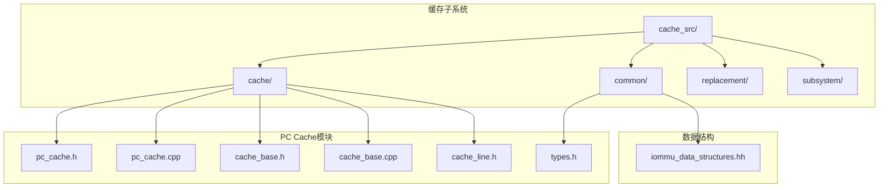
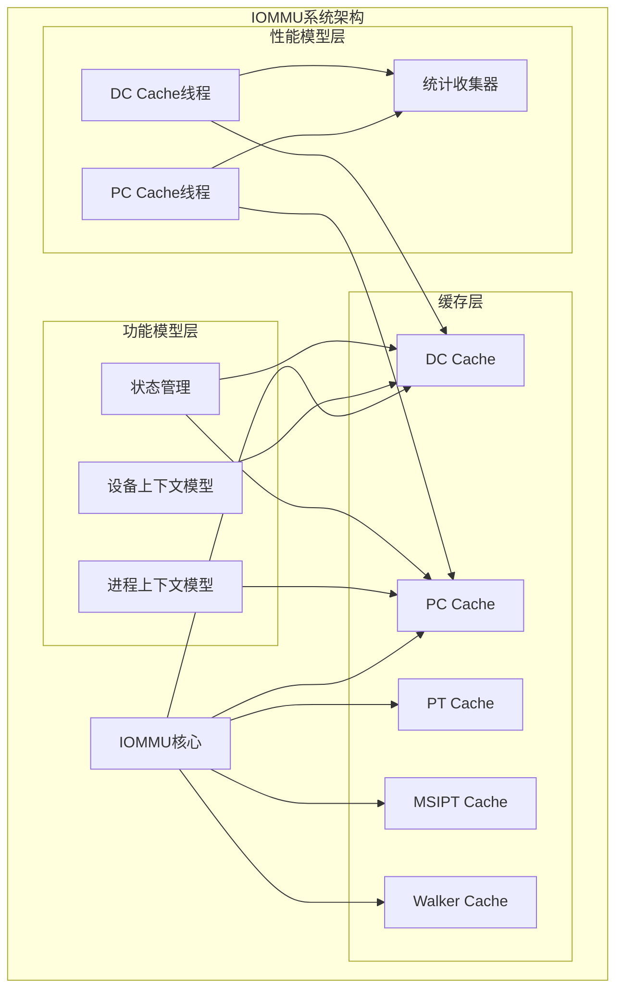
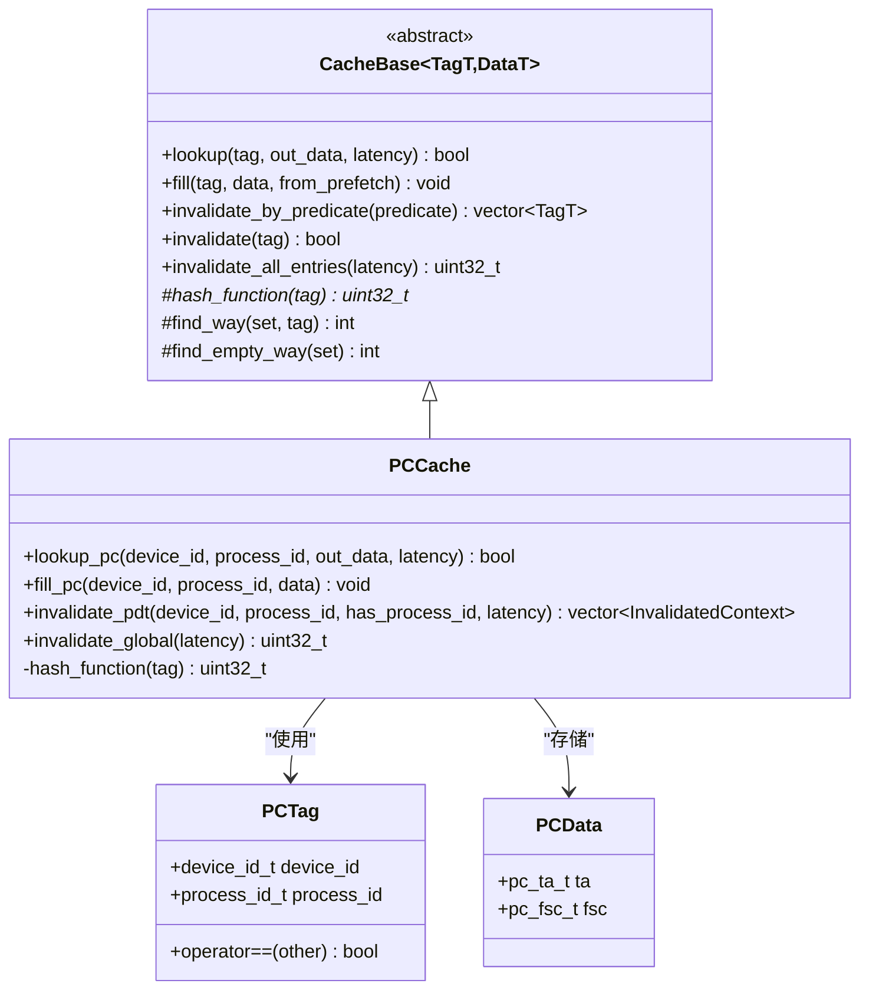
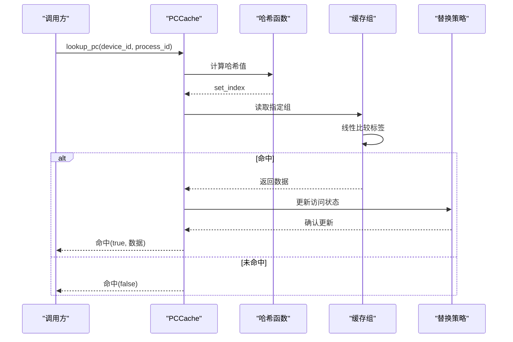
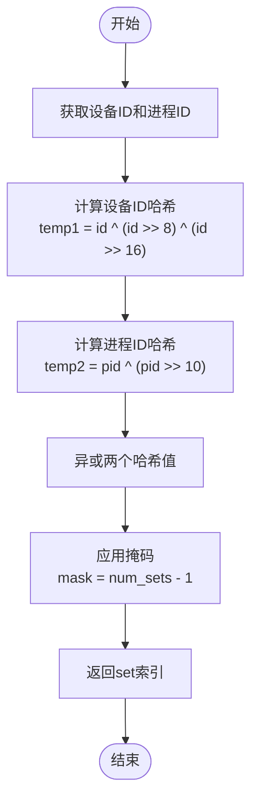
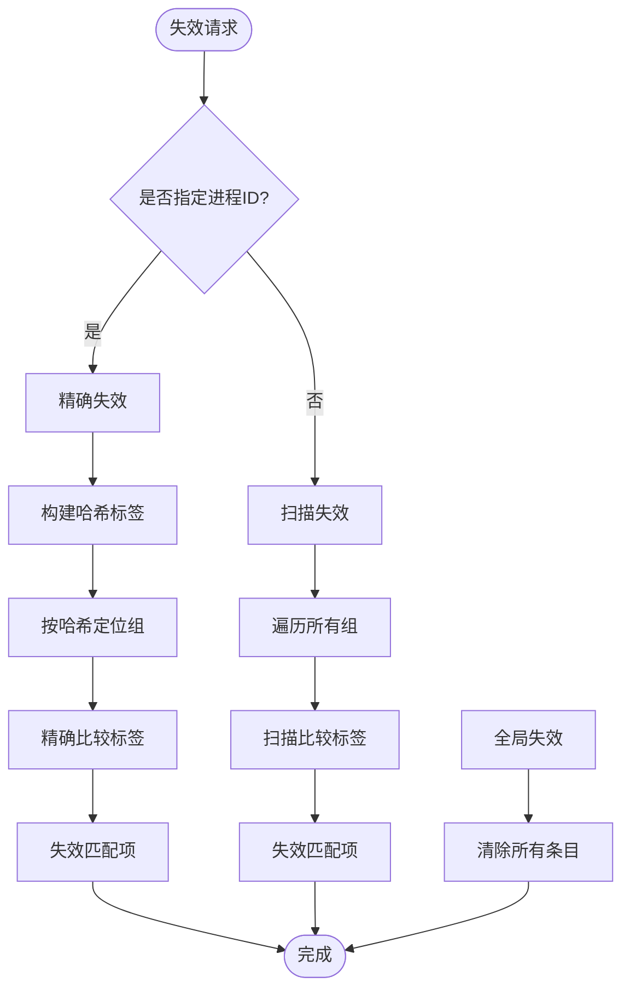
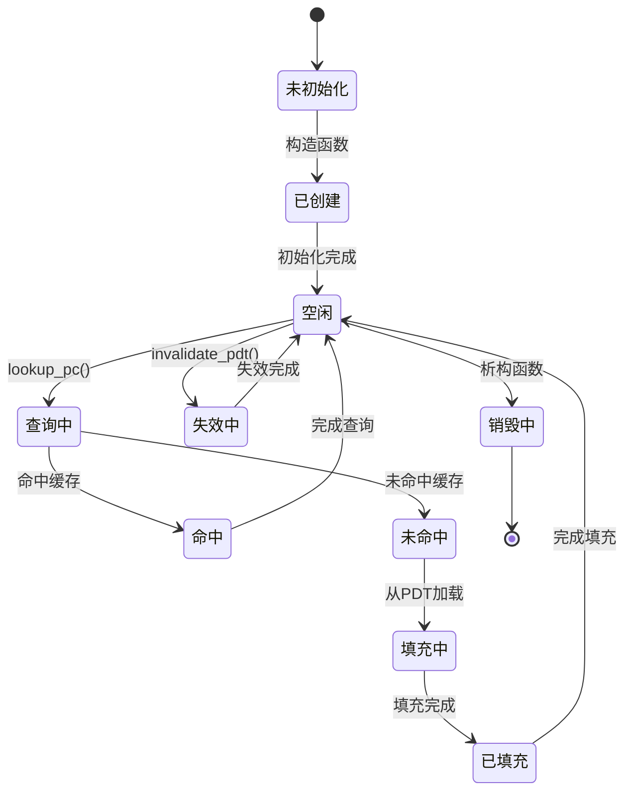
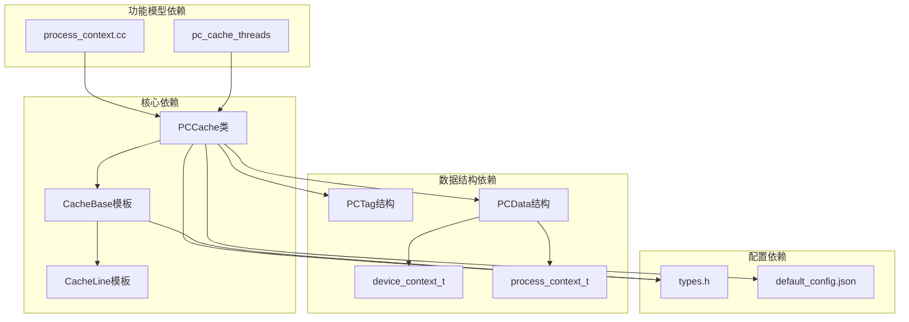
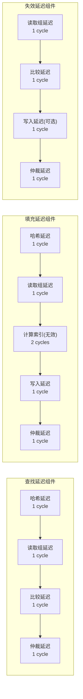

# 进程上下文缓存(PC Cache)

<cite>
**本文档引用的文件**
- [pc_cache.h](file://iommu/cache_src/cache/pc_cache.h)
- [pc_cache.cpp](file://iommu/cache_src/cache/pc_cache.cpp)
- [cache_base.h](file://iommu/cache_src/cache/cache_base.h)
- [cache_base.cpp](file://iommu/cache_src/cache/cache_base.cpp)
- [cache_line.h](file://iommu/cache_src/cache/cache_line.h)
- [types.h](file://iommu/cache_src/common/types.h)
- [iommu_data_structures.hh](file://iommu/include/iommu_data_structures.hh)
- [iommu_process_context.cc](file://iommu/iommu_fun_model/iommu_process_context.cc)
- [default_config.json](file://iommu/cache_config/default_config.json)
- [iommu_perf_dc_pc_cache.cc](file://iommu/iommu_perf_model/iommu_perf_dc_pc_cache.cc)
- [stats_collector.h](file://iommu/cache_src/common/stats_collector.h)
</cite>

## 目录
1. [简介](#简介)
2. [项目结构](#项目结构)
3. [核心组件](#核心组件)
4. [架构概览](#架构概览)
5. [详细组件分析](#详细组件分析)
6. [依赖关系分析](#依赖关系分析)
7. [性能考虑](#性能考虑)
8. [故障排除指南](#故障排除指南)
9. [结论](#结论)
10. [附录](#附录)

## 简介
本文件详细阐述RISC-V IOMMU中进程上下文缓存(PC Cache)的设计与实现。PC Cache在IOMMU中承担着关键角色：它维护设备ID到进程ID的映射，并缓存对应的进程上下文(process_context_t)，从而显著减少对设备上下文目录表(PDT)的访问次数，提升地址转换性能。

PC Cache的核心职责包括：
- **进程ID到进程上下文的映射**：通过设备ID和进程ID组合形成唯一标签，快速检索进程上下文
- **缓存条目组织**：采用多路组相联结构，支持LRU/SRRIP等替换策略
- **查找算法**：基于哈希函数确定组索引，组内线性比较标签匹配
- **生命周期管理**：支持精确失效、扫描失效和全局失效
- **更新机制**：支持直接填充和替换填充两种更新策略
- **性能特征**：提供详细的延迟建模和统计收集

## 项目结构
PC Cache位于IOMMU缓存子系统的特定模块中，与DC Cache、PT Cache、MSIPT Cache等并列存在。其文件组织结构如下：

**图表来源**
- [pc_cache.h:1-38](file://iommu/cache_src/cache/pc_cache.h#L1-L38)
- [pc_cache.cpp:1-66](file://iommu/cache_src/cache/pc_cache.cpp#L1-L66)
- [cache_base.h:1-676](file://iommu/cache_src/cache/cache_base.h#L1-L676)

**章节来源**
- [pc_cache.h:1-38](file://iommu/cache_src/cache/pc_cache.h#L1-L38)
- [pc_cache.cpp:1-66](file://iommu/cache_src/cache/pc_cache.cpp#L1-L66)

## 核心组件
PC Cache的核心组件包括以下关键部分：

### 1. 标签结构设计
PC Cache使用复合标签结构来唯一标识缓存条目：
- `device_id_t device_id`：设备标识符，包含段、总线、设备和功能信息
- `process_id_t process_id`：进程标识符，支持最多20位的进程ID空间

### 2. 数据结构定义
PC Cache存储的进程上下文数据结构包含：
- `pc_ta_t ta`：进程上下文转换属性，包含有效性标志、权限控制等
- `pc_fsc_t fsc`：第一阶段上下文，包含IOSATP模式和根页表指针

### 3. 缓存配置参数
PC Cache支持以下配置参数：
- `num_sets`：组数量，默认64
- `num_ways`：每组关联度，默认4
- `replacement`：替换策略，支持"plru"和"srrip"
- 性能参数：哈希延迟、比较延迟、写入延迟等

**章节来源**
- [types.h:16-617](file://iommu/cache_src/common/types.h#L16-L617)
- [iommu_data_structures.hh:350-415](file://iommu/include/iommu_data_structures.hh#L350-L415)
- [default_config.json:26-30](file://iommu/cache_config/default_config.json#L26-L30)

## 架构概览
PC Cache在整个IOMMU系统中的位置和交互关系如下：

**图表来源**
- [pc_cache.h:8-33](file://iommu/cache_src/cache/pc_cache.h#L8-L33)
- [cache_base.h:26-54](file://iommu/cache_src/cache/cache_base.h#L26-L54)
- [iommu_perf_dc_pc_cache.cc:67-101](file://iommu/iommu_perf_model/iommu_perf_dc_pc_cache.cc#L67-L101)

## 详细组件分析

### PCCache类设计
PCCache继承自CacheBase模板类，专门处理进程上下文缓存：

**图表来源**
- [pc_cache.h:8-33](file://iommu/cache_src/cache/pc_cache.h#L8-L33)
- [cache_base.h:26-54](file://iommu/cache_src/cache/cache_base.h#L26-L54)
- [cache_line.h:17-23](file://iommu/cache_src/cache/cache_line.h#L17-L23)

### 查找算法实现
PC Cache的查找算法采用标准的组相联缓存设计：

**图表来源**
- [pc_cache.cpp:11-17](file://iommu/cache_src/cache/pc_cache.cpp#L11-L17)
- [cache_base.h:258-295](file://iommu/cache_src/cache/cache_base.h#L258-L295)

### 哈希函数设计
PC Cache使用专门设计的哈希函数来分布标签：

**图表来源**
- [pc_cache.cpp:58-63](file://iommu/cache_src/cache/pc_cache.cpp#L58-L63)

### 失效策略实现
PC Cache提供多种失效策略以满足不同的应用场景：

**图表来源**
- [pc_cache.cpp:27-56](file://iommu/cache_src/cache/pc_cache.cpp#L27-L56)
- [cache_base.h:468-538](file://iommu/cache_src/cache/cache_base.h#L468-L538)

**章节来源**
- [pc_cache.h:16-29](file://iommu/cache_src/cache/pc_cache.h#L16-L29)
- [pc_cache.cpp:27-56](file://iommu/cache_src/cache/pc_cache.cpp#L27-L56)

### 生命周期管理
PC Cache的生命周期管理包括创建、查询、更新和失效四个阶段：

**图表来源**
- [pc_cache.cpp:5-9](file://iommu/cache_src/cache/pc_cache.cpp#L5-L9)
- [cache_base.h:222-256](file://iommu/cache_src/cache/cache_base.h#L222-L256)

**章节来源**
- [pc_cache.cpp:5-9](file://iommu/cache_src/cache/pc_cache.cpp#L5-L9)
- [cache_base.h:222-256](file://iommu/cache_src/cache/cache_base.h#L222-L256)

## 依赖关系分析

### 组件耦合关系
PC Cache与其他组件的依赖关系如下：

**图表来源**
- [pc_cache.h:4-8](file://iommu/cache_src/cache/pc_cache.h#L4-L8)
- [cache_base.h:6-10](file://iommu/cache_src/cache/cache_base.h#L6-L10)
- [types.h:16-263](file://iommu/cache_src/common/types.h#L16-L263)

### 外部接口依赖
PC Cache对外提供标准化的接口，与IOMMU其他模块无缝集成：

| 接口名称 | 参数类型 | 返回值 | 功能描述 |
|---------|---------|--------|----------|
| lookup_pc | device_id_t, process_id_t, PCData&, sc_time& | bool | 查找进程上下文 |
| fill_pc | device_id_t, process_id_t, PCData | void | 填充进程上下文 |
| invalidate_pdt | device_id_t, process_id_t, bool, sc_time* | vector~InvalidatedContext~ | 按PDT失效 |
| invalidate_global | sc_time* | uint32_t | 全局失效 |

**章节来源**
- [pc_cache.h:16-29](file://iommu/cache_src/cache/pc_cache.h#L16-L29)
- [pc_cache.cpp:11-56](file://iommu/cache_src/cache/pc_cache.cpp#L11-L56)

## 性能考虑

### 延迟建模
PC Cache的性能特性通过详细的延迟建模来体现：

**图表来源**
- [default_config.json:7-18](file://iommu/cache_config/default_config.json#L7-L18)
- [cache_base.h:154-206](file://iommu/cache_src/cache/cache_base.h#L154-L206)

### 命中率优化策略
为了提高PC Cache的命中率，可以采用以下策略：

1. **合理的组数配置**：根据设备数量和进程并发数调整num_sets
2. **合适的关联度**：num_ways过小会导致抖动，过大增加比较开销
3. **替换策略选择**：SRRIP适合高命中场景，PLRU适合一般场景
4. **预取机制**：结合PDT访问模式进行智能预取

### 内存占用分析
PC Cache的内存占用计算公式：
- 每个缓存行大小：sizeof(PCTag) + sizeof(PCData) + 元数据开销
- 总内存占用：num_sets × num_ways × (标签大小 + 数据大小 + 1字节有效位)

**章节来源**
- [default_config.json:26-30](file://iommu/cache_config/default_config.json#L26-L30)
- [types.h:263-264](file://iommu/cache_src/common/types.h#L263-L264)

## 故障排除指南

### 常见问题诊断
1. **命中率异常低**：检查num_sets和num_ways配置是否合理
2. **查找延迟过高**：确认替换策略选择和仲裁延迟设置
3. **失效不生效**：验证失效谓词函数的正确性
4. **内存泄漏**：检查缓存行的有效性标志管理

### 性能监控指标
通过StatsCollector收集的关键指标：
- 总访问次数、命中次数、未命中次数
- 淘汰次数、失效次数
- 平均执行延迟、队列延迟
- 预取准确性

**章节来源**
- [stats_collector.h:13-63](file://iommu/cache_src/common/stats_collector.h#L13-L63)
- [iommu_perf_dc_pc_cache.cc:67-101](file://iommu/iommu_perf_model/iommu_perf_dc_pc_cache.cc#L67-L101)

## 结论
PC Cache作为RISC-V IOMMU中的关键组件，通过高效的组相联缓存设计和完善的失效策略，显著提升了进程上下文的访问性能。其模块化的架构设计使得配置灵活、易于扩展，同时提供了全面的性能监控能力。

通过合理的配置参数调优和失效策略选择，PC Cache能够在保证性能的同时维持良好的内存使用效率，为IOMMU的整体性能表现提供重要支撑。

## 附录

### 配置参数详解
| 参数名称 | 类型 | 默认值 | 描述 |
|---------|------|--------|------|
| num_sets | uint32_t | 64 | 缓存组数量 |
| num_ways | uint32_t | 4 | 每组关联度 |
| replacement | string | "plru" | 替换策略 |
| srrip_m_bits | uint32_t | 2 | SRRIP M位数 |
| arbiter_latency_cycles | uint32_t | 1 | 仲裁延迟 |
| hash_latency_cycles | uint32_t | 1 | 哈希延迟 |
| read_set_latency_cycles | uint32_t | 1 | 读取组延迟 |
| compare_latency_cycles | uint32_t | 1 | 比较延迟 |

### 代码示例路径
以下为具体的代码示例路径，展示PC Cache的主要操作：

1. **进程上下文查找**：
   - [lookup_pc实现:11-17](file://iommu/cache_src/cache/pc_cache.cpp#L11-L17)
   - [进程上下文定位:12-69](file://iommu/iommu_fun_model/iommu_process_context.cc#L12-L69)

2. **进程上下文更新**：
   - [fill_pc实现:19-25](file://iommu/cache_src/cache/pc_cache.cpp#L19-L25)
   - [进程上下文缓存更新:194-195](file://iommu/iommu_fun_model/iommu_process_context.cc#L194-L195)

3. **进程上下文失效**：
   - [invalidate_pdt实现:27-52](file://iommu/cache_src/cache/pc_cache.cpp#L27-L52)
   - [全局失效:54-56](file://iommu/cache_src/cache/pc_cache.cpp#L54-L56)

4. **性能监控**：
   - [PC Cache线程实现:70-101](file://iommu/iommu_perf_model/iommu_perf_dc_pc_cache.cc#L70-L101)
   - [统计收集器:65-125](file://iommu/cache_src/common/stats_collector.h#L65-L125)

**章节来源**
- [default_config.json:26-30](file://iommu/cache_config/default_config.json#L26-L30)
- [pc_cache.cpp:11-56](file://iommu/cache_src/cache/pc_cache.cpp#L11-L56)
- [iommu_process_context.cc:12-195](file://iommu/iommu_fun_model/iommu_process_context.cc#L12-L195)
- [iommu_perf_dc_pc_cache.cc:70-101](file://iommu/iommu_perf_model/iommu_perf_dc_pc_cache.cc#L70-L101)
- [stats_collector.h:65-125](file://iommu/cache_src/common/stats_collector.h#L65-L125)