# 页表缓存(PT Cache)

<cite>
**本文档引用的文件**
- [pt_cache.h](file://iommu/cache_src/cache/pt_cache.h)
- [pt_cache.cpp](file://iommu/cache_src/cache/pt_cache.cpp)
- [cache_base.h](file://iommu/cache_src/cache/cache_base.h)
- [cache_base.cpp](file://iommu/cache_src/cache/cache_base.cpp)
- [cache_line.h](file://iommu/cache_src/cache/cache_line.h)
- [types.h](file://iommu/cache_src/common/types.h)
- [stats_collector.h](file://iommu/cache_src/common/stats_collector.h)
- [iommu_data_structures.hh](file://iommu/include/iommu_data_structures.hh)
- [json_config.cpp](file://iommu/cache_src/common/json_config.cpp)
- [cache_subsystem.cpp](file://iommu/cache_src/subsystem/cache_subsystem.cpp)
- [iommu_perf_pt_cache_response.cc](file://iommu/iommu_perf_model/iommu_perf_pt_cache_response.cc)
- [iommu_task_cache_convert.cc](file://iommu/iommu_perf_model/iommu_task_cache_convert.cc)
- [iommu_task_cache_convert.hh](file://iommu/iommu_perf_model/iommu_task_cache_convert.hh)
- [iommu_top.hh](file://iommu/iommu_top.hh)
- [iommu_top.cc](file://iommu/iommu_top.cc)
- [iommu_perf_params.hh](file://iommu/iommu_perf_model/iommu_perf_params.hh)
- [iommu_task.hh](file://iommu/include/iommu_task.hh)
- [PT_CACHE_HIT_RATE_ANALYSIS.md](file://PT_CACHE_HIT_RATE_ANALYSIS.md)
- [PT_CACHE_AD_BIT_MODIFICATION.md](file://PT_CACHE_AD_BIT_MODIFICATION.md)
</cite>

## 更新摘要
**所做更改**
- 新增A/D位支持功能章节，详细描述A/D位检查机制、动态A/D位传递和日志增强
- 更新查找算法与命中/未命中处理，增加A/D位验证逻辑
- 新增A/D位处理流程图和相关代码示例
- 更新性能考量，包含A/D位对内存访问跟踪的影响分析
- 新增A/D位配置参数和后续工作建议

## 目录
1. [简介](#简介)
2. [项目结构](#项目结构)
3. [核心组件](#核心组件)
4. [架构总览](#架构总览)
5. [详细组件分析](#详细组件分析)
6. [A/D位支持功能](#ad位支持功能)
7. [VA去重功能](#va去重功能)
8. [依赖关系分析](#依赖关系分析)
9. [性能考量](#性能考量)
10. [故障排查指南](#故障排查指南)
11. [结论](#结论)
12. [附录](#附录)

## 简介
本文件针对 RISC-V IOMMU 的页表缓存(PT Cache)进行系统化技术文档化，重点阐述其作为 IOTLB(IOMMU Page Table Lookaside Buffer)的核心作用：缓存页表项并加速地址转换。文档覆盖以下方面：
- PT Cache 的数据结构设计与缓存行组织方式
- 查找、插入与更新的处理流程与命中/未命中机制
- 失效管理策略（VMA/GVMA/按上下文批量失效）
- **新增A/D位支持功能**：通过A/D位检查机制实现内存访问跟踪，完善PT Cache的访问监控能力
- **新增VA去重功能**：通过deduplication table实现同页VA访问的去重优化
- 性能特征、命中率优化与内存占用评估
- 配置参数、替换策略选择与调优建议
- 通过代码路径引用展示关键操作的实现位置

## 项目结构
PT Cache 位于 iommu/cache_src/cache 子目录，采用模板化基类 CacheBase 提供统一的缓存接口与性能建模，PTCache 作为特化实现，结合公共类型定义与统计收集器完成端到端的功能。

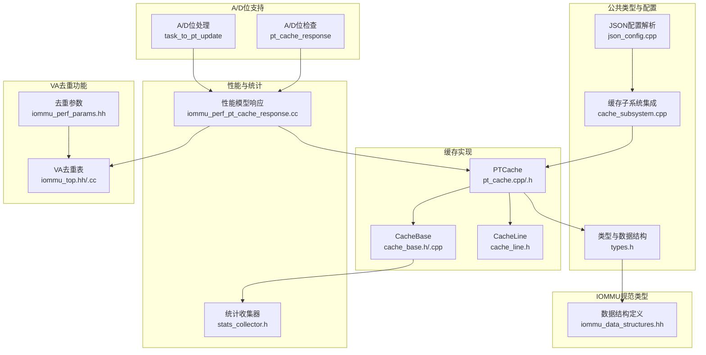

**图表来源**
- [pt_cache.h:1-59](file://iommu/cache_src/cache/pt_cache.h#L1-L59)
- [pt_cache.cpp:1-146](file://iommu/cache_src/cache/pt_cache.cpp#L1-L146)
- [cache_base.h:1-676](file://iommu/cache_src/cache/cache_base.h#L1-L676)
- [cache_line.h:1-103](file://iommu/cache_src/cache/cache_line.h#L1-L103)
- [types.h:1-618](file://iommu/cache_src/common/types.h#L1-L618)
- [json_config.cpp:63-74](file://iommu/cache_src/common/json_config.cpp#L63-L74)
- [cache_subsystem.cpp:143-143](file://iommu/cache_src/subsystem/cache_subsystem.cpp#L143-L143)
- [stats_collector.h:1-130](file://iommu/cache_src/common/stats_collector.h#L1-L130)
- [iommu_data_structures.hh:1-200](file://iommu/include/iommu_data_structures.hh#L1-L200)
- [iommu_perf_pt_cache_response.cc:26-26](file://iommu/iommu_perf_model/iommu_perf_pt_cache_response.cc#L26-L26)
- [iommu_task_cache_convert.cc:240-300](file://iommu/iommu_perf_model/iommu_task_cache_convert.cc#L240-300)
- [iommu_top.hh:123-142](file://iommu/iommu_top.hh#L123-L142)
- [iommu_perf_params.hh:113-114](file://iommu/iommu_perf_model/iommu_perf_params.hh#L113-L114)

**章节来源**
- [pt_cache.h:1-59](file://iommu/cache_src/cache/pt_cache.h#L1-L59)
- [pt_cache.cpp:1-146](file://iommu/cache_src/cache/pt_cache.cpp#L1-L146)
- [cache_base.h:1-676](file://iommu/cache_src/cache/cache_base.h#L1-L676)
- [cache_line.h:1-103](file://iommu/cache_src/cache/cache_line.h#L1-L103)
- [types.h:1-618](file://iommu/cache_src/common/types.h#L1-L618)
- [json_config.cpp:63-74](file://iommu/cache_src/common/json_config.cpp#L63-L74)
- [cache_subsystem.cpp:143-143](file://iommu/cache_src/subsystem/cache_subsystem.cpp#L143-L143)
- [stats_collector.h:1-130](file://iommu/cache_src/common/stats_collector.h#L1-L130)
- [iommu_data_structures.hh:1-200](file://iommu/include/iommu_data_structures.hh#L1-L200)
- [iommu_perf_pt_cache_response.cc:26-26](file://iommu/iommu_perf_model/iommu_perf_pt_cache_response.cc#L26-L26)
- [iommu_task_cache_convert.cc:240-300](file://iommu/iommu_perf_model/iommu_task_cache_convert.cc#L240-300)
- [iommu_top.hh:123-142](file://iommu/iommu_top.hh#L123-L142)
- [iommu_perf_params.hh:113-114](file://iommu/iommu_perf_model/iommu_perf_params.hh#L113-L114)

## 核心组件
- PTCache：PT Cache 的具体实现，继承自 CacheBase，提供页表项查找、填充与多种失效策略。
- CacheBase：通用缓存模板基类，封装哈希定位、set 内 way 比较、替换算法、仲裁与延迟建模等。
- CacheLine：缓存行模板，包含 valid 标志、tag、data、预取标记与访问计数。
- PTTag/PTData：PT Cache 的标签与数据结构，承载 gscid、pscid、IOVA、翻译阶段、SV48/X4 模式等关键信息。
- CacheConfig：缓存配置，包含 set 数、way 数、替换策略、仲裁与流水线延迟等。
- StatsCollector：统计收集器，记录访问、命中、缺失、替换、失效、队列延迟等指标。
- **A/D位支持组件**：A/D位检查机制、动态A/D位传递、日志增强功能。
- **VA去重组件**：deduplication table、去重键值结构、同步机制和统计计数器。

**章节来源**
- [pt_cache.h:8-54](file://iommu/cache_src/cache/pt_cache.h#L8-L54)
- [pt_cache.cpp:5-39](file://iommu/cache_src/cache/pt_cache.cpp#L5-L39)
- [cache_base.h:26-256](file://iommu/cache_src/cache/cache_base.h#L26-L256)
- [cache_line.h:70-91](file://iommu/cache_src/cache/cache_line.h#L70-L91)
- [types.h:33-45](file://iommu/cache_src/common/types.h#L33-L45)
- [types.h:573-589](file://iommu/cache_src/common/types.h#L573-L589)
- [stats_collector.h:13-63](file://iommu/cache_src/common/stats_collector.h#L13-L63)
- [iommu_task_cache_convert.cc:276-291](file://iommu/iommu_perf_model/iommu_task_cache_convert.cc#L276-291)
- [iommu_perf_pt_cache_response.cc:36-54](file://iommu/iommu_perf_model/iommu_perf_pt_cache_response.cc#L36-L54)
- [iommu_top.hh:123-142](file://iommu/iommu_top.hh#L123-L142)

## 架构总览
PT Cache 在 IOMMU 地址转换路径中扮演 IOTLB 角色，通过缓存页表项减少对主存页表的访问次数，提升整体吞吐。其核心流程：
- 查找：根据 gscid/pscid/iova/阶段/模式构造 PTTag，经哈希定位 set，遍历 way 完成 tag 比较，命中则返回 PTData 并更新替换策略。
- **A/D位检查**：在PT Cache命中时，检查A/D位状态，如果需要更新且SADE=1，则触发PTW进行硬件更新。
- **VA去重**：在PT Cache未命中时，检查VA去重表，如果同页VA访问已存在，则挂起当前任务等待去重完成。
- 填充：将 Walker 或页表遍历结果写入缓存，同时记录翻译阶段、输入/输出页大小、SV48/X4 等元信息。
- 失效：支持 VMA(G-stage)、GVMA(S-stage)、按 gscid/pscid 批量失效以及全局失效，按模式精确或扫描执行。

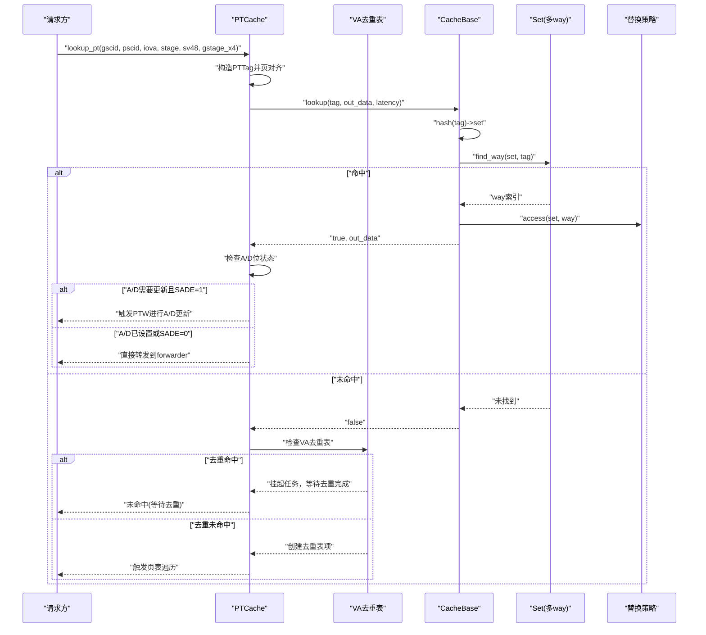

**图表来源**
- [pt_cache.cpp:11-23](file://iommu/cache_src/cache/pt_cache.cpp#L11-L23)
- [cache_base.h:258-295](file://iommu/cache_src/cache/cache_base.h#L258-L295)
- [cache_base.h:541-548](file://iommu/cache_src/cache/cache_base.h#L541-L548)
- [iommu_perf_pt_cache_response.cc:36-54](file://iommu/iommu_perf_model/iommu_perf_pt_cache_response.cc#L36-L54)
- [iommu_task_cache_convert.cc:276-291](file://iommu/iommu_perf_model/iommu_task_cache_convert.cc#L276-291)

**章节来源**
- [pt_cache.cpp:11-23](file://iommu/cache_src/cache/pt_cache.cpp#L11-L23)
- [cache_base.h:258-295](file://iommu/cache_src/cache/cache_base.h#L258-L295)
- [cache_base.h:541-548](file://iommu/cache_src/cache/cache_base.h#L541-L548)
- [iommu_perf_pt_cache_response.cc:36-54](file://iommu/iommu_perf_model/iommu_perf_pt_cache_response.cc#L36-L54)
- [iommu_task_cache_convert.cc:276-291](file://iommu/iommu_perf_model/iommu_task_cache_convert.cc#L276-291)

## 详细组件分析

### PTCache 类与接口
- 查找接口：支持带 SV48/X4 参数的查找重载，内部统一构造 PTTag 并调用基类 lookup。
- 填充接口：将 Walker 结果或页表遍历结果写入缓存，自动设置翻译阶段、IOVA 是否为 VA、SV48/X4 等元信息。
- 失效接口：
  - VMA 失效：影响第一阶段翻译，支持精确/扫描/全局模式。
  - GVMA 失效：影响第二阶段翻译。
  - 按上下文失效：按 gscid/pscid 批量失效。
  - 全局失效：清空所有有效行。
- 哈希函数：基于 gscid/iova/psecid 组合进行混合哈希，掩码取 set 索引。
- 页对齐：按 4K 对齐 IOVA，确保同一页内的访问共享缓存行。

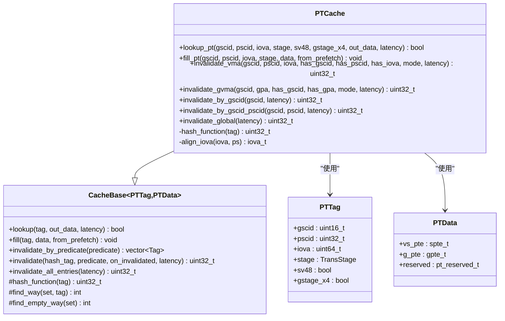

**图表来源**
- [pt_cache.h:8-54](file://iommu/cache_src/cache/pt_cache.h#L8-L54)
- [pt_cache.cpp:5-143](file://iommu/cache_src/cache/pt_cache.cpp#L5-L143)
- [cache_base.h:26-256](file://iommu/cache_src/cache/cache_base.h#L26-L256)
- [cache_line.h:33-45](file://iommu/cache_src/cache/cache_line.h#L33-L45)
- [types.h:214-235](file://iommu/cache_src/common/types.h#L214-L235)

**章节来源**
- [pt_cache.h:8-54](file://iommu/cache_src/cache/pt_cache.h#L8-L54)
- [pt_cache.cpp:5-143](file://iommu/cache_src/cache/pt_cache.cpp#L5-L143)
- [cache_base.h:26-256](file://iommu/cache_src/cache/cache_base.h#L26-L256)
- [cache_line.h:33-45](file://iommu/cache_src/cache/cache_line.h#L33-L45)
- [types.h:214-235](file://iommu/cache_src/common/types.h#L214-L235)

### 查找算法与命中/未命中处理
- 命中：基类 lookup 流程中，先计算 set，再在该 set 内顺序比较 tag，命中后更新替换策略计数并记录命中统计与延迟。
- **A/D位检查**：命中后检查A/D位状态，如果A/D未设置且SADE=1，则触发PTW进行硬件更新；如果A/D已设置或SADE=0，则直接转发。
- 未命中：记录缺失统计与延迟，返回 false，通常由上层触发页表遍历或 Walker Cache 查询。
- 预取命中：若命中行来自预取，会额外统计预取命中并清除标记。

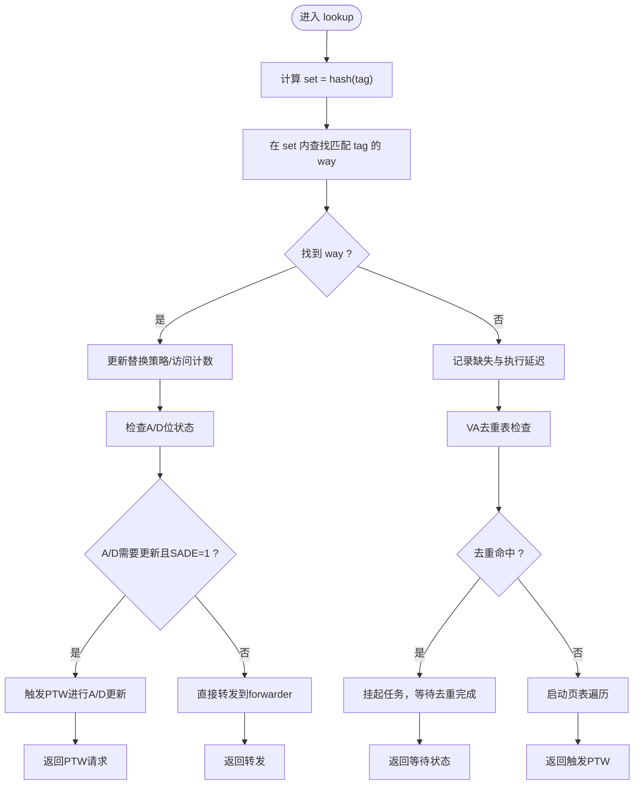

**图表来源**
- [cache_base.h:258-295](file://iommu/cache_src/cache/cache_base.h#L258-L295)
- [cache_base.h:541-548](file://iommu/cache_src/cache/cache_base.h#L541-L548)
- [iommu_perf_pt_cache_response.cc:36-54](file://iommu/iommu_perf_model/iommu_perf_pt_cache_response.cc#L36-L54)

**章节来源**
- [cache_base.h:258-295](file://iommu/cache_src/cache/cache_base.h#L258-L295)
- [cache_base.h:541-548](file://iommu/cache_src/cache/cache_base.h#L541-L548)
- [iommu_perf_pt_cache_response.cc:36-54](file://iommu/iommu_perf_model/iommu_perf_pt_cache_response.cc#L36-L54)

### 插入与更新策略
- 更新命中：若相同 tag 已存在于某 way，则直接更新数据与有效位，并更新替换策略。
- 空闲填充：若存在无效 way，则直接填入新 tag/data。
- 替换填充：若无空闲 way，则调用替换策略选择受害者 way，写入新数据并记录淘汰统计。
- 预取标记：fill 支持 from_prefetch 标记，便于统计预取命中率。
- **A/D位传递**：在更新PT Cache时，传递实际的A/D位状态，确保缓存数据与硬件状态一致。

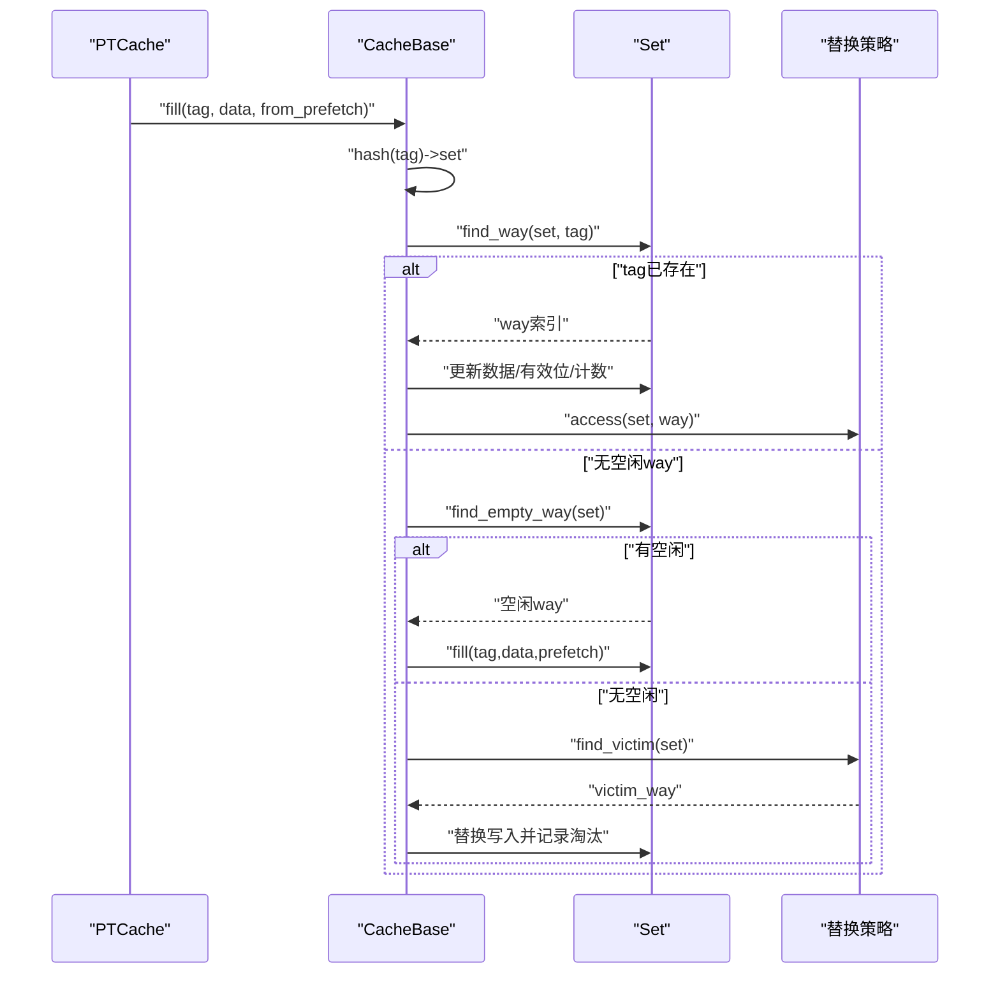

**图表来源**
- [cache_base.h:297-406](file://iommu/cache_src/cache/cache_base.h#L297-L406)
- [cache_base.h:551-558](file://iommu/cache_src/cache/cache_base.h#L551-L558)

**章节来源**
- [cache_base.h:297-406](file://iommu/cache_src/cache/cache_base.h#L297-L406)
- [cache_base.h:551-558](file://iommu/cache_src/cache/cache_base.h#L551-L558)

### 失效管理与级联失效
- VMA 失效：仅影响包含第一阶段的条目，支持精确/扫描/全局模式；精确模式下先计算 hash 定位 set 再比较 way。
- GVMA 失效：仅影响包含第二阶段的条目。
- 按上下文失效：按 gscid 或 gscid+pscid 扫描失效。
- 全局失效：清空所有有效行并重置替换状态。

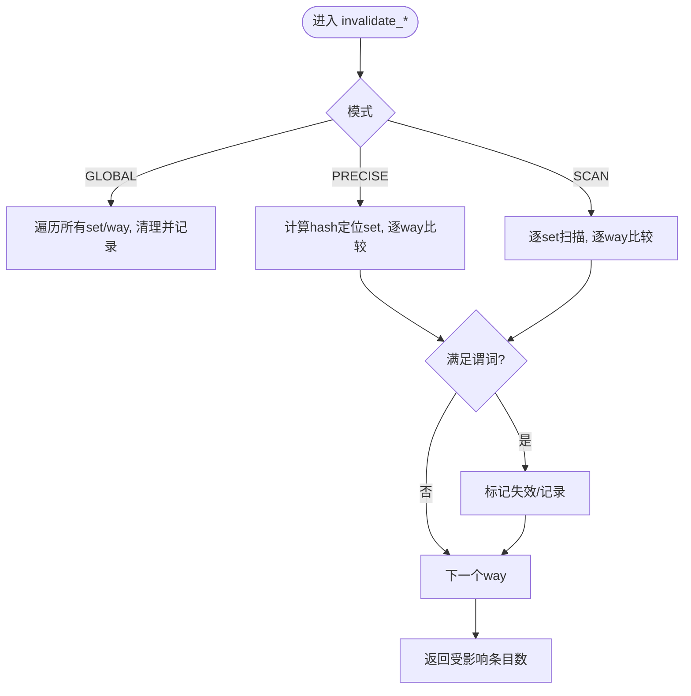

**图表来源**
- [pt_cache.cpp:41-95](file://iommu/cache_src/cache/pt_cache.cpp#L41-L95)
- [cache_base.h:442-538](file://iommu/cache_src/cache/cache_base.h#L442-L538)

**章节来源**
- [pt_cache.cpp:41-95](file://iommu/cache_src/cache/pt_cache.cpp#L41-L95)
- [cache_base.h:442-538](file://iommu/cache_src/cache/cache_base.h#L442-L538)

### 数据结构与缓存行组织
- PTTag：包含 gscid、pscid、对齐后的 iova、翻译阶段(stage)、SV48 标志、G-stage X4 标志，用于唯一标识一次页表查询上下文。
- PTData：包含 VS 与 G 两阶段 PTE 的位域结构，以及 reserved 元信息，用于记录翻译类型、输入/输出页大小、IOVA 是否为 VA、SV48/X4 等。
- CacheLine：每个 set 内的多 way 缓存行，包含 valid、tag、data、from_prefetch、access_count 等字段。

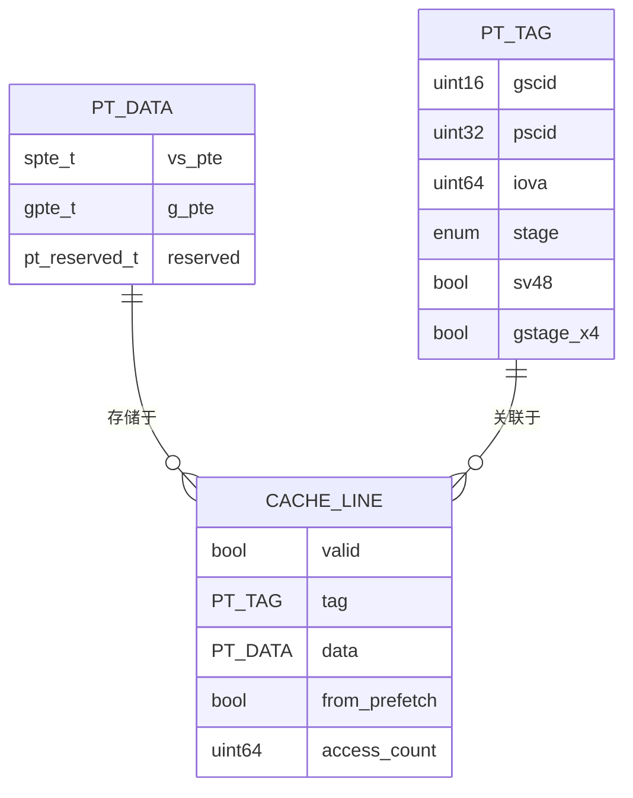

**图表来源**
- [cache_line.h:33-45](file://iommu/cache_src/cache/cache_line.h#L33-L45)
- [cache_line.h:70-91](file://iommu/cache_src/cache/cache_line.h#L70-L91)
- [types.h:214-235](file://iommu/cache_src/common/types.h#L214-L235)

**章节来源**
- [cache_line.h:33-45](file://iommu/cache_src/cache/cache_line.h#L33-L45)
- [cache_line.h:70-91](file://iommu/cache_src/cache/cache_line.h#L70-L91)
- [types.h:214-235](file://iommu/cache_src/common/types.h#L214-L235)

### 性能特征与延迟建模
- 延迟来源：仲裁延迟 + 哈希/读 set/比较/写入等流水线延迟，分别对应查找命中/未命中、更新命中/空闲/替换三种路径。
- 统计指标：总访问、命中、缺失、替换、失效、预取命中/发出、平均执行/排队/请求延迟、IOPS 等。
- 命中率分析：仓库提供专门的命中率分析文档，可用于评估不同工作负载下的性能表现。
- **A/D位影响**：A/D位检查增加了额外的判断逻辑，但避免了不必要的PTW请求，整体性能影响可控。

**章节来源**
- [cache_base.h:146-216](file://iommu/cache_src/cache/cache_base.h#L146-L216)
- [stats_collector.h:13-63](file://iommu/cache_src/common/stats_collector.h#L13-L63)
- [PT_CACHE_HIT_RATE_ANALYSIS.md](file://PT_CACHE_HIT_RATE_ANALYSIS.md)

## A/D位支持功能

### A/D位检查机制
A/D位支持功能通过以下机制实现内存访问跟踪：

- **A/D位状态检查**：在PT Cache命中时，检查任务的A/D位状态（A=Accessed, D=Dirty）
- **更新条件判断**：如果A/D未设置且SADE=1（允许硬件更新），则触发PTW进行硬件更新
- **直接转发条件**：如果A/D已设置或SADE=0，则直接转发到forwarder，避免不必要的硬件更新

```mermaid
flowchart TD
Start(["PT Cache命中"]) --> CheckAD["检查A/D位状态"]
CheckAD --> NeedUpdate{"需要A/D更新 ?"}
NeedUpdate --> |A=0或(D=0且写访问)| CheckSADE{"SADE=1 ?"}
NeedUpdate --> |A=1且D=1| DirectForward["直接转发"]
CheckSADE --> |是| TriggerPTW["触发PTW进行A/D更新"]
CheckSADE --> |否| DirectForward
TriggerPTW --> ReturnPTW["返回PTW请求"]
DirectForward --> ReturnForward["返回转发"]
```

**图表来源**
- [iommu_perf_pt_cache_response.cc:36-54](file://iommu/iommu_perf_model/iommu_perf_pt_cache_response.cc#L36-L54)

### 动态A/D位传递
A/D位通过以下流程在系统中动态传递：

1. **从任务提取**：在`task_to_pt_update`中从任务结构提取实际的A/D位值
2. **构建PTData**：调用`make_pt_data`时传递A/D位状态
3. **缓存存储**：PT Cache存储完整的A/D位信息
4. **命中提取**：在`pt_hit_response_to_task`中从缓存提取A/D位到任务

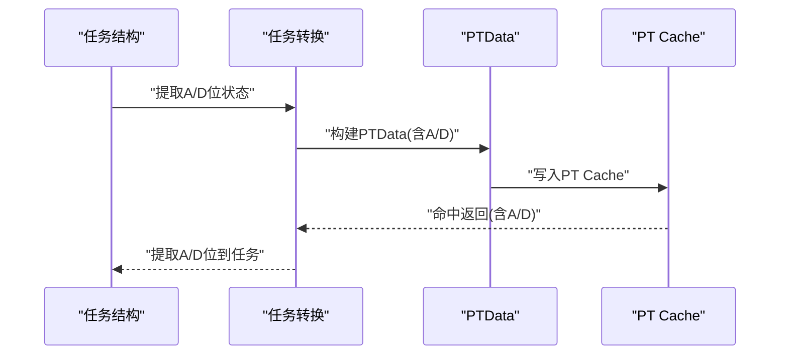

**图表来源**
- [iommu_task_cache_convert.cc:276-291](file://iommu/iommu_perf_model/iommu_task_cache_convert.cc#L276-291)
- [iommu_task_cache_convert.cc:208-222](file://iommu/iommu_perf_model/iommu_task_cache_convert.cc#L208-222)

### A/D位处理流程
A/D位处理涉及多个组件的协作：

- **make_pt_data函数**：新增`ad_bit_set`参数，支持动态传递A/D位状态
- **task_to_pt_update函数**：从任务中提取实际A/D位值，传递给make_pt_data
- **pt_hit_response_to_task函数**：从缓存响应中提取A/D位到任务结构
- **PT Cache响应处理**：检查A/D位状态决定是否需要PTW更新

**章节来源**
- [types.h:370-423](file://iommu/cache_src/common/types.h#L370-L423)
- [iommu_task_cache_convert.cc:276-291](file://iommu/iommu_perf_model/iommu_task_cache_convert.cc#L276-291)
- [iommu_task_cache_convert.cc:208-222](file://iommu/iommu_perf_model/iommu_task_cache_convert.cc#L208-222)
- [iommu_perf_pt_cache_response.cc:36-54](file://iommu/iommu_perf_model/iommu_perf_pt_cache_response.cc#L36-L54)

### 日志增强功能
A/D位支持增强了系统的可观测性：

- **PT_UPDATE日志**：显示A/D位的实际值（A=1, D=1）
- **PT_CACHE响应日志**：显示A/D位状态和决策过程
- **调试信息**：提供详细的A/D位检查和更新信息

**章节来源**
- [iommu_task_cache_convert.cc:293-297](file://iommu/iommu_perf_model/iommu_task_cache_convert.cc#L293-L297)
- [iommu_perf_pt_cache_response.cc:40-53](file://iommu/iommu_perf_model/iommu_perf_pt_cache_response.cc#L40-L53)

## VA去重功能

### deduplication table 结构
VA去重功能通过deduplication table实现，该表存储同页VA访问的去重信息：

- **va_dedup_key_t**：去重键值结构，包含 gscid、pscid 和 page_iova（4KB页对齐的IOVA）。
- **va_dedup_entry_t**：去重表项结构，包含：
  - valid：表项有效性标志
  - first_task_id：首个去重未命中的任务ID（去重MISS）
  - pending_tasks：等待去重完成的任务列表（去重HIT）
- **va_dedup_table**：std::map<va_dedup_key_t, va_dedup_entry_t>，存储所有活跃的去重条目。

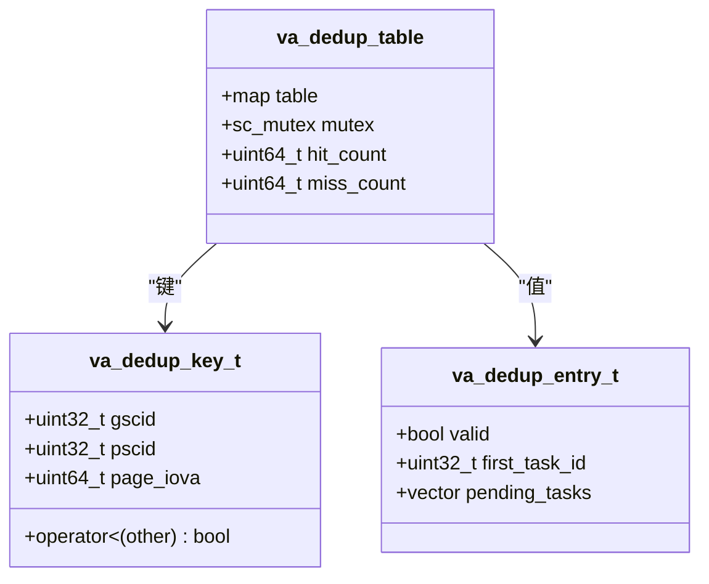

**图表来源**
- [iommu_top.hh:123-142](file://iommu/iommu_top.hh#L123-L142)

### VA去重工作流程
VA去重功能在PT Cache未命中时激活，通过以下步骤实现：

1. **去重检查**：当PT Cache未命中时，检查va_dedup_table中是否存在相同的(gscid, pscid, page_iova)键
2. **去重命中**：如果存在有效条目，将当前任务挂入pending_tasks列表，不触发PTW
3. **去重未命中**：创建新的va_dedup_entry_t条目，记录first_task_id，触发PTW
4. **去重恢复**：当PTW完成后，从va_dedup_table中取出pending_tasks列表，批量转发给forwarder

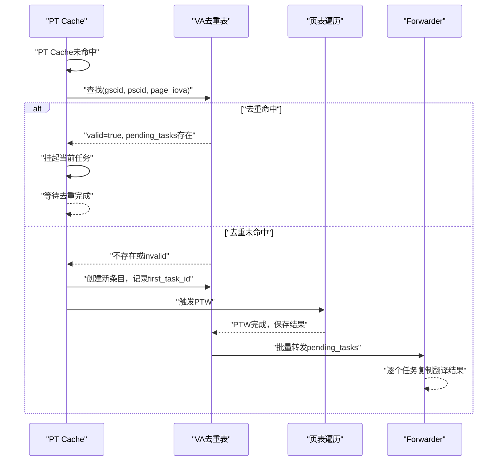

**图表来源**
- [iommu_perf_pt_cache_response.cc:78-108](file://iommu/iommu_perf_model/iommu_perf_pt_cache_response.cc#L78-L108)
- [iommu_top.cc:477-529](file://iommu/iommu_top.cc#L477-L529)

### 同步机制与线程安全
VA去重功能采用严格的同步机制确保线程安全：

- **互斥锁**：va_dedup_mtx保护va_dedup_table的并发访问
- **原子操作**：va_dedup_hit_count和va_dedup_miss_count的更新需要加锁保护
- **RAII模式**：使用lock()/unlock()确保异常安全的资源管理

### 统计信息与性能分析
VA去重功能提供详细的统计信息：

- **va_dedup_hit_count**：去重命中次数（同页VA访问被去重）
- **va_dedup_miss_count**：去重未命中次数（首次访问或新页面）
- **PTW任务节省率**：va_dedup_hit_count/(va_dedup_hit_count+va_dedup_miss_count)×100%

这些统计信息通过print_cache_statistics()函数输出，帮助评估VA去重功能的性能收益。

**章节来源**
- [iommu_top.hh:123-142](file://iommu/iommu_top.hh#L123-L142)
- [iommu_perf_pt_cache_response.cc:78-108](file://iommu/iommu_perf_model/iommu_perf_pt_cache_response.cc#L78-L108)
- [iommu_top.cc:477-529](file://iommu/iommu_top.cc#L477-L529)
- [iommu_top.cc:547-556](file://iommu/iommu_top.cc#L547-L556)

## 依赖关系分析
- PTCache 依赖 CacheBase 提供的通用缓存能力；CacheBase 再依赖替换策略、统计收集器与配置。
- PTTag/PTData 依赖公共类型定义，如 TransStage、PageSize、spte_t/gpte_t 等。
- 配置通过 JSON 解析注入到缓存子系统，最终传入 PTCache 构造函数。
- **A/D位支持**：依赖iommu_task.hh中的SADE字段和iommu_perf_params.hh中的配置。
- **VA去重功能**：依赖iommu_perf_params.hh中的PT_CACHE_VA_DEDUP_ENABLED配置，通过iommu_top.hh中的数据结构实现。

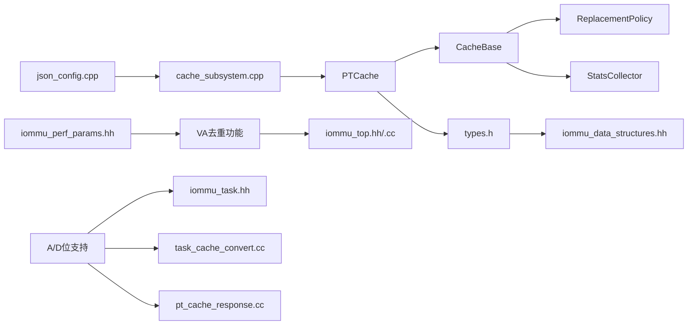

**图表来源**
- [pt_cache.cpp:5-8](file://iommu/cache_src/cache/pt_cache.cpp#L5-L8)
- [cache_base.h:235-252](file://iommu/cache_src/cache/cache_base.h#L235-L252)
- [types.h:65-69](file://iommu/cache_src/common/types.h#L65-L69)
- [json_config.cpp:63-74](file://iommu/cache_src/common/json_config.cpp#L63-L74)
- [cache_subsystem.cpp:143-143](file://iommu/cache_src/subsystem/cache_subsystem.cpp#L143-L143)
- [iommu_perf_params.hh:113-114](file://iommu/iommu_perf_model/iommu_perf_params.hh#L113-L114)
- [iommu_task.hh:160-162](file://iommu/include/iommu_task.hh#L160-L162)

**章节来源**
- [pt_cache.cpp:5-8](file://iommu/cache_src/cache/pt_cache.cpp#L5-L8)
- [cache_base.h:235-252](file://iommu/cache_src/cache/cache_base.h#L235-L252)
- [types.h:65-69](file://iommu/cache_src/common/types.h#L65-L69)
- [json_config.cpp:63-74](file://iommu/cache_src/common/json_config.cpp#L63-L74)
- [cache_subsystem.cpp:143-143](file://iommu/cache_src/subsystem/cache_subsystem.cpp#L143-L143)
- [iommu_perf_params.hh:113-114](file://iommu/iommu_perf_model/iommu_perf_params.hh#L113-L114)
- [iommu_task.hh:160-162](file://iommu/include/iommu_task.hh#L160-L162)

## 性能考量
- 命中率优化
  - 合理设置 num_sets 与 num_ways：增大 ways 可降低替换开销，增大 sets 可降低冲突。
  - 选择替换策略：SRRIP 在高并发场景表现稳定；PLRU 更简单且适合低开销需求。
  - 预取策略：利用 from_prefetch 标记，结合命中统计评估预取收益。
  - **VA去重优化**：对于具有高空间局部性的工作负载，VA去重可显著减少PTW任务数量。
- 内存占用
  - 每个缓存行包含 tag + data + 控制位，内存占用约为 (tag_size + data_size + 1字节控制位) × sets × ways。
  - PTData 包含 VS/G 两阶段 PTE 与 reserved 字段，占用相对较大，需权衡精度与容量。
  - **VA去重表内存**：每个去重表项约占用24字节（1+4+8+8+4），实际占用取决于活跃页面数量。
  - **A/D位存储**：每个PTData额外存储A/D位状态，增加约2位存储开销。
- 延迟优化
  - 减少仲裁等待：合理设置 arbiter_latency_cycles 与流水线延迟参数。
  - 降低替换开销：在替换路径较长时，考虑增大 sets 或采用更高效的替换策略。
  - **VA去重延迟**：去重命中可避免PTW延迟，但需要额外的去重表查找和同步开销。
  - **A/D位检查延迟**：增加的A/D位检查逻辑带来微小延迟，但避免了不必要的PTW请求。
- 命中率分析
  - 参考仓库提供的命中率分析文档，结合工作负载特征调整缓存规模与替换策略。
  - **VA去重效果评估**：通过统计信息分析去重命中率和PTW任务节省率。
  - **A/D位影响分析**：评估A/D位检查对整体性能的影响，通常为正向优化。

**章节来源**
- [types.h:573-589](file://iommu/cache_src/common/types.h#L573-L589)
- [stats_collector.h:13-63](file://iommu/cache_src/common/stats_collector.h#L13-L63)
- [PT_CACHE_HIT_RATE_ANALYSIS.md](file://PT_CACHE_HIT_RATE_ANALYSIS.md)
- [iommu_top.cc:547-556](file://iommu/iommu_top.cc#L547-L556)

## 故障排查指南
- 命中率异常偏低
  - 检查 num_sets 是否过小导致高冲突；检查 pagesize 对齐是否正确。
  - 关注预取命中统计，评估预取策略有效性。
  - **VA去重问题**：检查va_dedup_table大小是否过大导致内存压力。
  - **A/D位问题**：检查A/D位状态是否正确传递，确认SADE配置。
- 失效不生效
  - 确认失效模式（PRECISE/SCAN/GLOBAL）与谓词条件是否匹配预期。
  - 检查 stage 标志（STAGE1_ONLY/STAGE2_ONLY/STAGE1_AND_2）是否与失效目标一致。
- 性能退化
  - 查看替换与失效统计，确认是否存在频繁替换或大量失效。
  - 分析延迟直方图，定位瓶颈在仲裁、哈希、比较还是写入阶段。
  - **VA去重相关问题**：
    - 去重命中率异常：检查va_dedup_hit_count和va_dedup_miss_count的平衡
    - 去重表内存泄漏：确认va_dedup_table的清理机制正常工作
    - 线程死锁：检查va_dedup_mtx的加锁/解锁配对是否正确
  - **A/D位相关问题**：
    - A/D更新频繁：检查SADE配置和访问模式
    - A/D位不正确：验证make_pt_data函数的A/D位传递逻辑
    - 性能下降：确认A/D位检查逻辑的优化效果

**章节来源**
- [stats_collector.h:13-63](file://iommu/cache_src/common/stats_collector.h#L13-L63)
- [pt_cache.cpp:41-95](file://iommu/cache_src/cache/pt_cache.cpp#L41-L95)
- [cache_base.h:442-538](file://iommu/cache_src/cache/cache_base.h#L442-L538)
- [iommu_top.cc:547-556](file://iommu/iommu_top.cc#L547-L556)

## 结论
PT Cache 通过模板化的 CacheBase 提供了统一、可扩展的缓存框架，PTCache 在其中承担 IOTLB 的核心职责。其设计兼顾了查找效率、替换策略灵活性与性能统计可观测性。**新增的A/D位支持功能进一步完善了PT Cache的内存访问跟踪能力，通过A/D位检查机制实现了更精确的访问监控和硬件更新控制。** **新增的VA去重功能进一步提升了性能，通过deduplication table实现了同页VA访问的去重优化，显著减少了重复的PTW任务。**通过合理的配置与替换策略选择，可在不同工作负载下获得稳定的命中率与较低的地址转换延迟。

## 附录

### 配置参数与默认值
- 缓存规模与替换
  - num_sets：set 数
  - num_ways：way 数
  - replacement：替换策略（"srrip"/"plru"/"none"）
  - srrip_m_bits：SRRIP M 位参数
- 仲裁与流水线延迟
  - arbiter_latency_cycles：仲裁阶段延迟
  - hash_latency_cycles：哈希计算延迟
  - read_set_latency_cycles：读取 set 延迟
  - compare_latency_cycles：比较每个 way 延迟
  - fill_compute_index_*：更新路径延迟（命中/空闲/替换）
  - write_way_latency_cycles：写入 way 延迟
  - invalidation_compare_per_way_cycles：失效比较每个 way 延迟
- 全局配置
  - clock_period_ns：时钟周期（ns）
  - random_seed：随机种子
  - pt_cache：PT Cache 的 CacheConfig
  - statistics：统计配置（输出文件、直方图等）
- **VA去重配置**
  - PT_CACHE_VA_DEDUP_ENABLED：VA去重功能开关（true/false）
- **A/D位配置**
  - SADE：硬件A/D更新允许标志（在iommu_task.hh中定义）
  - GADE：G-stage硬件A/D更新允许标志（在iommu_task.hh中定义）

**章节来源**
- [types.h:573-612](file://iommu/cache_src/common/types.h#L573-L612)
- [json_config.cpp:63-74](file://iommu/cache_src/common/json_config.cpp#L63-L74)
- [iommu_perf_params.hh:113-114](file://iommu/iommu_perf_model/iommu_perf_params.hh#L113-L114)
- [iommu_task.hh:160-162](file://iommu/include/iommu_task.hh#L160-L162)

### 代码示例路径（不含具体代码内容）
- 查找页表项
  - [lookup_pt 接口:18-24](file://iommu/cache_src/cache/pt_cache.h#L18-L24)
  - [lookup 实现:11-23](file://iommu/cache_src/cache/pt_cache.cpp#L11-L23)
  - [基类 lookup 流程:258-295](file://iommu/cache_src/cache/cache_base.h#L258-L295)
- 插入/更新页表项
  - [fill_pt 接口:26-27](file://iommu/cache_src/cache/pt_cache.h#L26-L27)
  - [fill 实现:25-39](file://iommu/cache_src/cache/pt_cache.cpp#L25-L39)
  - [基类 fill 流程:297-406](file://iommu/cache_src/cache/cache_base.h#L297-L406)
- 失效操作
  - [VMA 失效接口:31-34](file://iommu/cache_src/cache/pt_cache.h#L31-L34)
  - [GVMA 失效接口:37-40](file://iommu/cache_src/cache/pt_cache.h#L37-L40)
  - [VMA 失效实现:41-74](file://iommu/cache_src/cache/pt_cache.cpp#L41-L74)
  - [GVMA 失效实现:76-95](file://iommu/cache_src/cache/pt_cache.cpp#L76-L95)
  - [按上下文失效实现:97-118](file://iommu/cache_src/cache/pt_cache.cpp#L97-L118)
  - [基类失效扫描/精确/全局:442-538](file://iommu/cache_src/cache/cache_base.h#L442-L538)
- 哈希与页对齐
  - [哈希函数:120-133](file://iommu/cache_src/cache/pt_cache.cpp#L120-L133)
  - [IOVA 页对齐:135-143](file://iommu/cache_src/cache/pt_cache.cpp#L135-L143)
- 统计与性能
  - [统计收集器接口:65-109](file://iommu/cache_src/common/stats_collector.h#L65-L109)
  - [命中/缺失/替换/失效统计:73-78](file://iommu/cache_src/common/stats_collector.h#L73-L78)
  - [命中率与IOPS计算:31-62](file://iommu/cache_src/common/stats_collector.h#L31-L62)
- **A/D位支持功能**
  - [make_pt_data函数:370-423](file://iommu/cache_src/common/types.h#L370-L423)
  - [task_to_pt_update函数:276-291](file://iommu/iommu_perf_model/iommu_task_cache_convert.cc#L276-L291)
  - [pt_hit_response_to_task函数:208-222](file://iommu/iommu_perf_model/iommu_task_cache_convert.cc#L208-L222)
  - [PT Cache响应检查:36-54](file://iommu/iommu_perf_model/iommu_perf_pt_cache_response.cc#L36-L54)
- **VA去重功能**
  - [去重键值结构:123-133](file://iommu/iommu_top.hh#L123-L133)
  - [去重表项结构:134-138](file://iommu/iommu_top.hh#L134-L138)
  - [去重检查实现:78-108](file://iommu/iommu_perf_model/iommu_perf_pt_cache_response.cc#L78-L108)
  - [去重恢复实现:477-529](file://iommu/iommu_top.cc#L477-L529)
  - [统计输出:547-556](file://iommu/iommu_top.cc#L547-L556)
- 性能模型集成
  - [PT Cache 响应线程:26-26](file://iommu/iommu_perf_model/iommu_perf_pt_cache_response.cc#L26-L26)