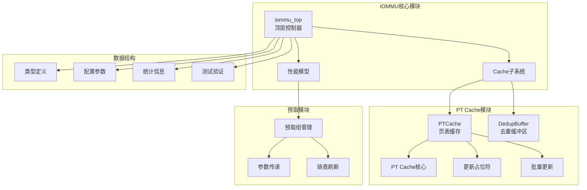
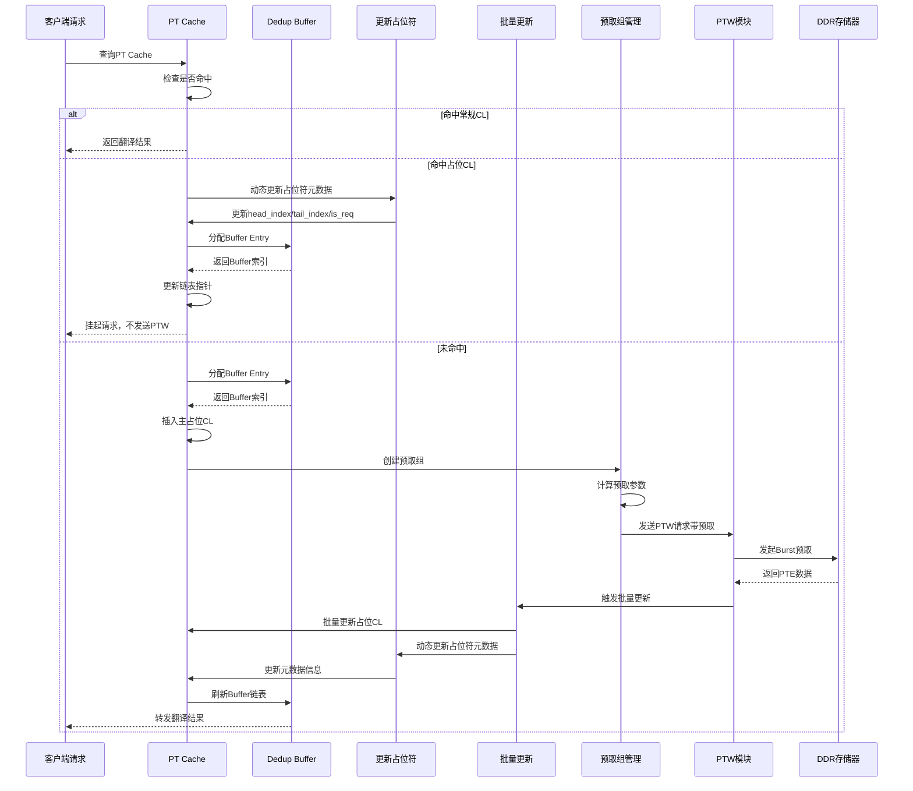
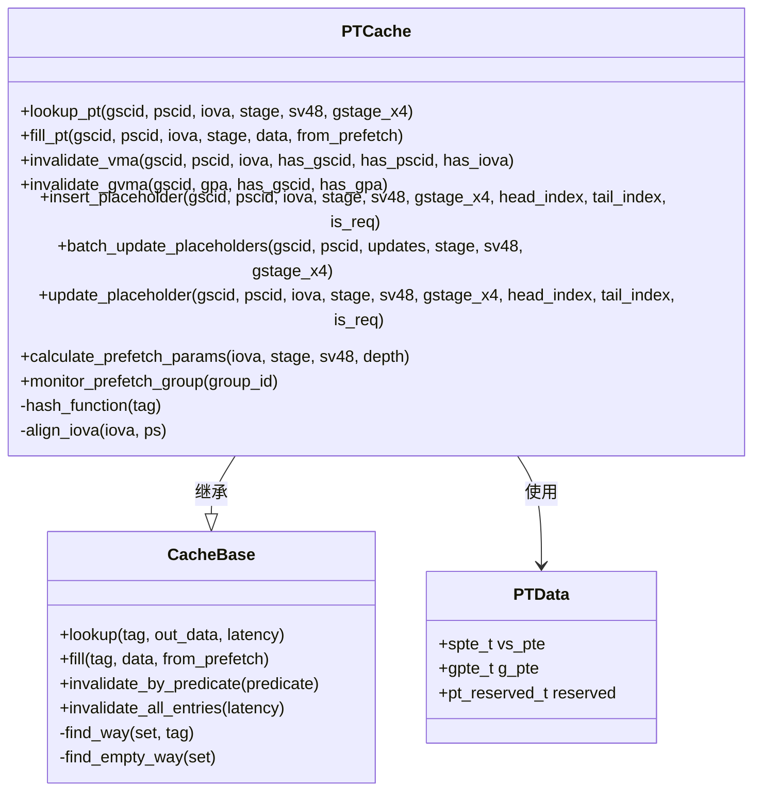
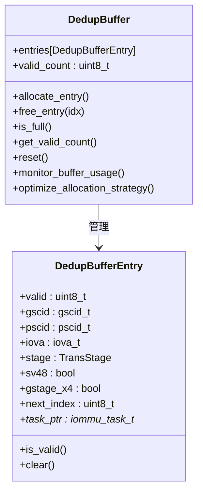
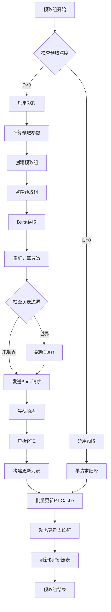
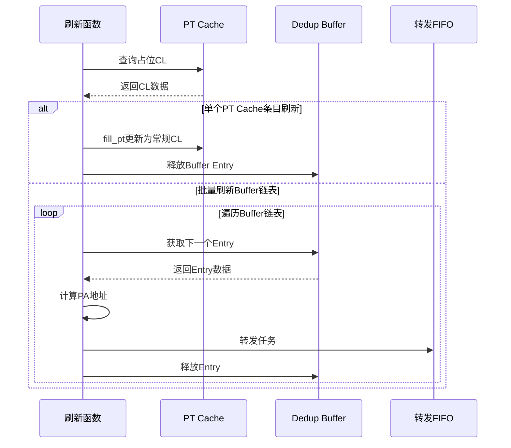
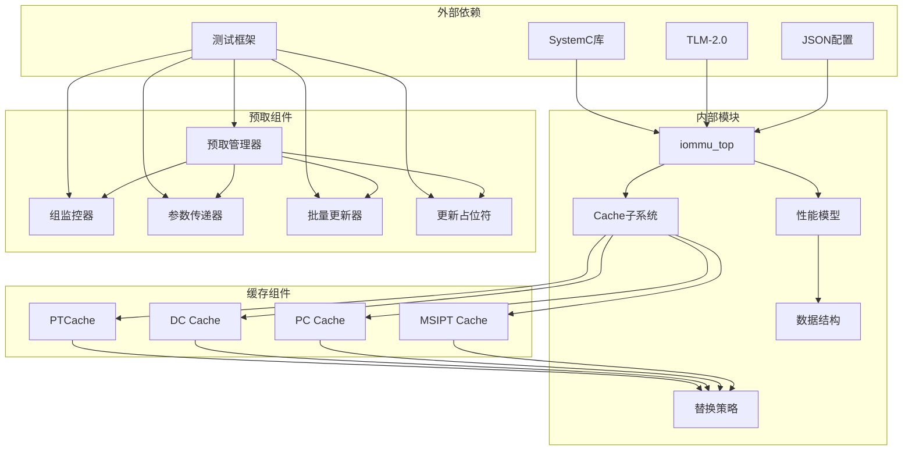

# PT Cache去重+预取集成

<cite>
**本文档引用的文件**
- [iommu_perf_pt_dedup_flush.cc](file://iommu/iommu_perf_model/iommu_perf_pt_dedup_flush.cc)
- [iommu_perf_pt_cache_response.cc](file://iommu/iommu_perf_model/iommu_perf_pt_cache_response.cc)
- [pt_cache.h](file://iommu/cache_src/cache/pt_cache.h)
- [pt_cache.cpp](file://iommu/cache_src/cache/pt_cache.cpp)
- [iommu_top.hh](file://iommu/iommu_top.hh)
- [dedup_buffer.h](file://iommu/cache_src/common/dedup_buffer.h)
- [cache_base.h](file://iommu/cache_src/cache/cache_base.h)
- [cache_line.h](file://iommu/cache_src/cache/cache_line.h)
- [types.h](file://iommu/cache_src/common/types.h)
- [iommu_perf_params.hh](file://iommu/iommu_perf_model/iommu_perf_params.hh)
- [default_config.json](file://iommu/cache_config/default_config.json)
- [PT_DEDUP_PREFETCH_FINAL_SCHEME.md](file://PT_DEDUP_PREFETCH_FINAL_SCHEME.md)
- [PT_CACHE_DEDUP_PREFETCH_INTEGRATED_V2_20260608.md](file://PT_CACHE_DEDUP_PREFETCH_INTEGRATED_V2_20260608.md)
- [BATCH_UPDATE_MISS_ROOT_CAUSE_20260609.md](file://BATCH_UPDATE_MISS_ROOT_CAUSE_20260609.md)
- [test_dedup_prefetch.sh](file://test_dedup_prefetch.sh)
- [test_integration_dedup_prefetch.sh](file://test_integration_dedup_prefetch.sh)
- [test_dedup_prefetch_unit.cpp](file://test_dedup_prefetch_unit.cpp)
</cite>

## 更新摘要
**所做更改**
- 新增update_placeholder方法用于动态更新占位符元数据的详细说明
- 修正placeholder插入和任务路由逻辑的关键架构缺陷
- 改进dedup flush机制的内存访问安全性
- 更新batch_update_placeholders接口的stage自动推导机制
- 增强占位符缓存行处理的健壮性和一致性保障

## 目录
1. [简介](#简介)
2. [项目结构](#项目结构)
3. [核心组件](#核心组件)
4. [架构概览](#架构概览)
5. [详细组件分析](#详细组件分析)
6. [依赖关系分析](#依赖关系分析)
7. [性能考量](#性能考量)
8. [故障排除指南](#故障排除指南)
9. [结论](#结论)

## 简介

本文档详细介绍了IOMMU PT Cache去重+预取集成系统的完整实现。该系统通过占位Cache Line机制和Buffer链表管理，实现了高效的地址转换缓存去重和预取优化，显著减少了DDR访问次数并提升了整体性能。

系统采用先进的去重策略，当多个请求访问同一地址空间时，只进行一次实际的页表walk操作，其余请求通过Buffer链表共享翻译结果。同时，系统集成了预取机制，在主任务翻译的同时预取相邻页面的页表项，进一步减少延迟。

**更新** 本次更新重点反映了PT Cache占位符缓存行处理机制的关键架构缺陷修复，包括新增的update_placeholder方法、修正的placeholder插入逻辑、改进的批处理更新机制以及增强的内存访问安全性。

## 项目结构

**图表来源**
- [iommu_top.hh:42-489](file://iommu/iommu_top.hh#L42-L489)
- [pt_cache.h:8-73](file://iommu/cache_src/cache/pt_cache.h#L8-L73)
- [dedup_buffer.h:59-123](file://iommu/cache_src/common/dedup_buffer.h#L59-L123)
- [test_dedup_prefetch.sh:1-100](file://test_dedup_prefetch.sh#L1-L100)
- [test_integration_dedup_prefetch.sh:1-100](file://test_integration_dedup_prefetch.sh#L1-L100)

**章节来源**
- [iommu_top.hh:42-489](file://iommu/iommu_top.hh#L42-L489)
- [default_config.json:1-69](file://iommu/cache_config/default_config.json#L1-L69)

## 核心组件

### PT Cache去重机制

PT Cache通过占位Cache Line实现去重功能，当多个请求访问同一地址空间时，系统只进行一次实际的页表walk操作：

- **占位CL插入**：当PT Cache未命中时，系统插入占位CL并分配Buffer Entry
- **链表管理**：多个请求通过Buffer链表共享同一个翻译结果
- **批量更新**：PTW完成后，系统批量更新所有占位CL为常规CL
- **动态更新**：新增update_placeholder方法支持运行时动态更新占位符元数据

### 占位符动态更新机制

**新增** update_placeholder方法用于动态更新占位符缓存行的元数据信息：

- **元数据更新**：支持更新head_index、tail_index和is_req标志位
- **条件检查**：确保只有占位符CL才能被更新，常规CL拒绝更新
- **原子性保证**：更新操作具有原子性，避免并发访问冲突
- **日志记录**：提供详细的更新日志便于调试和监控

### 批量更新机制改进

**更新** batch_update_placeholders接口增加了stage自动推导功能：

- **stage自动推导**：当传入stage与实际占位符stage不匹配时自动推导正确stage
- **容错机制**：支持在多个stage中查找占位符CL，提高查找成功率
- **一致性保障**：确保批量更新使用的stage与占位符实际stage一致
- **错误处理**：提供完善的错误处理和回退机制

### 预取优化机制

系统集成了智能预取功能，利用页表的连续性特征：

- **Burst预取**：一次性预取多个相邻页面的PTE，减少DDR访问次数
- **预取深度配置**：支持可配置的预取深度（默认8页）
- **连续性利用**：基于Sv39地址翻译的页表连续性特征
- **参数传递优化**：通过预取参数传递机制确保预取数据的准确性

### Buffer链表管理系统

Buffer链表负责管理等待翻译的请求：

- **顺序分配**：按0、1、2、3...顺序线性查找空闲Entry
- **链表挂接**：新请求通过next_index链接到链表中
- **尾指针管理**：仅链表首节点保存真实尾指针，其他节点固定为0xFF

### 预取组监控机制

**新增** 预取组监控负责跟踪和管理预取操作的执行状态：

- **预取深度控制**：根据配置参数动态调整预取深度
- **预取组生命周期管理**：监控预取组的创建、执行和销毁过程
- **预取进度跟踪**：实时跟踪预取操作的完成进度和成功率
- **异常检测和恢复**：检测预取过程中的异常情况并进行自动恢复

### 批量更新机制

**新增** 批量更新机制确保预取数据能够高效地从占位CL转换为常规CL：

- **批量状态转换**：将多个占位CL的状态统一转换为有效状态
- **原子性更新**：确保批量更新操作的原子性和一致性
- **内存屏障**：在批量更新过程中正确处理内存屏障和缓存一致性
- **错误处理**：在批量更新失败时提供回滚和重试机制

**章节来源**
- [pt_cache.cpp:297-340](file://iommu/cache_src/cache/pt_cache.cpp#L297-L340)
- [pt_cache.cpp:281-314](file://iommu/cache_src/cache/pt_cache.cpp#L281-L314)
- [dedup_buffer.h:20-123](file://iommu/cache_src/common/dedup_buffer.h#L20-L123)
- [BATCH_UPDATE_MISS_ROOT_CAUSE_20260609.md:276-325](file://BATCH_UPDATE_MISS_ROOT_CAUSE_20260609.md#L276-L325)

## 架构概览

**图表来源**
- [iommu_perf_pt_cache_response.cc:13-166](file://iommu/iommu_perf_model/iommu_perf_pt_cache_response.cc#L13-L166)
- [iommu_perf_pt_dedup_flush.cc:124-263](file://iommu/iommu_perf_model/iommu_perf_pt_dedup_flush.cc#L124-L263)
- [PT_DEDUP_PREFETCH_FINAL_SCHEME.md:329-362](file://PT_DEDUP_PREFETCH_FINAL_SCHEME.md#L329-L362)

## 详细组件分析

### PT Cache核心实现

PT Cache是整个去重系统的核心组件，提供了完整的缓存管理功能：

**图表来源**
- [pt_cache.h:8-73](file://iommu/cache_src/cache/pt_cache.h#L8-L73)
- [cache_base.h:26-708](file://iommu/cache_src/cache/cache_base.h#L26-L708)
- [types.h:236-240](file://iommu/cache_src/common/types.h#L236-L240)

PT Cache的主要特性包括：

- **占位CL机制**：支持插入占位Cache Line，用于去重
- **批量更新**：支持批量更新多个占位CL为常规CL
- **失效操作**：提供精确和扫描两种失效模式
- **替换保护**：保护正在等待翻译的主任务占位CL不被替换
- **预取参数计算**：新增预取参数计算功能，支持动态预取深度调整
- **预取组监控**：新增预取组生命周期管理功能
- **动态更新**：新增update_placeholder方法支持运行时动态更新占位符元数据

**章节来源**
- [pt_cache.h:17-73](file://iommu/cache_src/cache/pt_cache.h#L17-L73)
- [pt_cache.cpp:297-340](file://iommu/cache_src/cache/pt_cache.cpp#L297-L340)

### Dedup Buffer管理

Dedup Buffer是去重系统的重要组成部分，负责管理Buffer Entry：

**图表来源**
- [dedup_buffer.h:59-123](file://iommu/cache_src/common/dedup_buffer.h#L59-L123)
- [dedup_buffer.h:20-49](file://iommu/cache_src/common/dedup_buffer.h#L20-L49)

Buffer管理的关键特性：

- **顺序分配**：按0、1、2、3...顺序线性查找空闲Entry
- **链表挂接**：通过next_index维护Buffer链表
- **并发保护**：使用Mutex确保多线程访问的安全性
- **容量限制**：支持256个Buffer Entry的容量限制
- **使用率监控**：新增Buffer使用率监控功能
- **分配策略优化**：支持动态分配策略优化

**章节来源**
- [dedup_buffer.h:67-97](file://iommu/cache_src/common/dedup_buffer.h#L67-L97)
- [iommu_perf_params.hh:116-120](file://iommu/iommu_perf_model/iommu_perf_params.hh#L116-L120)

### 预取组管理

预取组管理负责协调多个预取请求：

**图表来源**
- [PT_DEDUP_PREFETCH_FINAL_SCHEME.md:329-362](file://PT_DEDUP_PREFETCH_FINAL_SCHEME.md#L329-L362)
- [PT_CACHE_DEDUP_PREFETCH_INTEGRATED_V2_20260608.md:581-760](file://PT_CACHE_DEDUP_PREFETCH_INTEGRATED_V2_20260608.md#L581-L760)

**章节来源**
- [PT_DEDUP_PREFETCH_FINAL_SCHEME.md:329-417](file://PT_DEDUP_PREFETCH_FINAL_SCHEME.md#L329-L417)
- [PT_CACHE_DEDUP_PREFETCH_INTEGRATED_V2_20260608.md:638-743](file://PT_CACHE_DEDUP_PREFETCH_INTEGRATED_V2_20260608.md#L638-L743)

### 参数传递机制

**新增** 参数传递机制确保预取操作能够正确接收和处理各种配置参数：

- **预取深度传递**：将配置的预取深度参数传递给预取组管理器
- **地址对齐参数**：传递地址对齐要求和页表边界信息
- **阶段参数传递**：传递翻译阶段和地址空间模式参数
- **参数验证**：在参数传递过程中进行有效性验证和边界检查

### 缓冲区刷新机制

缓冲区刷新机制负责将占位CL转换为常规CL并转发请求：

**图表来源**
- [iommu_perf_pt_dedup_flush.cc:21-106](file://iommu/iommu_perf_model/iommu_perf_pt_dedup_flush.cc#L21-L106)
- [iommu_perf_pt_dedup_flush.cc:124-263](file://iommu/iommu_perf_model/iommu_perf_pt_dedup_flush.cc#L124-L263)

**章节来源**
- [iommu_perf_pt_dedup_flush.cc:124-263](file://iommu/iommu_perf_model/iommu_perf_pt_dedup_flush.cc#L124-L263)

## 依赖关系分析

**图表来源**
- [iommu_top.hh:18-28](file://iommu/iommu_top.hh#L18-L28)
- [cache_base.h:4-17](file://iommu/cache_src/cache/cache_base.h#L4-L17)
- [test_dedup_prefetch.sh:1-100](file://test_dedup_prefetch.sh#L1-L100)
- [test_integration_dedup_prefetch.sh:1-100](file://test_integration_dedup_prefetch.sh#L1-L100)

系统的关键依赖关系：

- **SystemC库**：提供硬件建模和仿真框架
- **TLM-2.0**：提供事务级建模接口
- **JSON配置**：支持动态配置缓存参数
- **测试框架**：支持预取功能的单元测试和集成测试
- **替换策略**：支持多种替换算法（SRRIP、PLRU）
- **预取组件**：新增预取管理器、组监控器、参数传递器、批量更新器和更新占位符组件

**章节来源**
- [cache_base.h:26-708](file://iommu/cache_src/cache/cache_base.h#L26-L708)
- [types.h:14-620](file://iommu/cache_src/common/types.h#L14-L620)

## 性能考量

### 缓存性能优化

系统在多个层面进行了性能优化：

- **去重效率**：通过占位CL机制，相同地址空间的多次访问只进行一次实际翻译
- **预取优化**：利用页表连续性特征，一次性预取多个PTE，减少DDR访问次数
- **批量更新**：PTW完成后批量更新所有占位CL，避免多次单独更新的开销
- **参数传递优化**：通过高效的参数传递机制减少预取操作的开销
- **监控开销最小化**：预取组监控采用低开销设计，不影响主要性能
- **动态更新优化**：update_placeholder方法提供高效的元数据更新机制

### 内存使用优化

- **Buffer容量**：256个Buffer Entry的容量设计，平衡内存使用和去重效果
- **占位CL存储**：PT Cache中仅存储必要的去重信息，减少存储开销
- **链表管理**：通过链表指针高效管理多个等待翻译的请求
- **预取参数缓存**：缓存常用的预取参数减少重复计算
- **stage自动推导**：减少stage参数传递的开销和错误

### 并发处理优化

- **Mutex保护**：Buffer和Cache访问使用Mutex确保线程安全
- **无阻塞设计**：大部分操作采用无阻塞模式，提高系统吞吐量
- **队列管理**：合理的FIFO深度配置，避免系统拥塞
- **预取组并发控制**：通过预取组管理器控制并发预取操作的数量
- **动态更新并发**：update_placeholder方法支持并发安全的元数据更新

### 测试和验证优化

- **单元测试覆盖**：预取功能具备完整的单元测试套件
- **集成测试验证**：通过集成测试验证预取功能的整体效果
- **性能基准测试**：定期运行性能基准测试评估预取效果
- **压力测试**：通过压力测试验证预取功能在高负载下的稳定性
- **架构缺陷验证**：专门测试batch_update_placeholders的stage自动推导功能

## 故障排除指南

### 常见问题及解决方案

**问题1：PT Cache Full导致去重失败**

症状：新请求无法插入占位CL，直接转发到PTW

解决方案：
- 检查Buffer容量配置（默认256个Entry）
- 分析系统负载，适当调整预取深度
- 监控Cache命中率，优化工作负载分布

**问题2：Buffer链表溢出**

症状：Buffer满时无法分配新的Entry

解决方案：
- 检查Buffer使用情况统计
- 分析请求模式，优化去重策略
- 考虑增加Buffer容量或调整去重阈值

**问题3：预取数据不准确**

症状：预取的PTE与实际需求不匹配

解决方案：
- 检查预取深度配置
- 验证地址空间连续性假设
- 分析工作负载模式，调整预取策略
- 检查预取参数传递的正确性

**问题4：预取组监控异常**

症状：预取组状态显示异常或监控数据不准确

解决方案：
- 检查预取组监控器的配置参数
- 验证预取组生命周期管理逻辑
- 分析监控数据的采集和处理流程
- 检查监控器与预取组管理器的通信

**问题5：占位符更新失败**

症状：update_placeholder方法返回false

解决方案：
- 检查占位符是否存在且状态正确
- 验证stage参数与占位符实际stage的一致性
- 分析并发访问冲突的可能性
- 检查内存访问权限和缓存一致性

**问题6：批量更新stage不匹配**

症状：batch_update_placeholders无法找到占位符

解决方案：
- 检查传入stage参数的正确性
- 验证stage自动推导逻辑的实现
- 分析占位符stage与预期stage的差异
- 检查缓存标签构造和查找逻辑

**章节来源**
- [pt_cache.cpp:480-521](file://iommu/cache_src/cache/pt_cache.cpp#L480-L521)
- [pt_cache.cpp:297-340](file://iommu/cache_src/cache/pt_cache.cpp#L297-L340)
- [BATCH_UPDATE_MISS_ROOT_CAUSE_20260609.md:276-325](file://BATCH_UPDATE_MISS_ROOT_CAUSE_20260609.md#L276-L325)
- [iommu_perf_pt_cache_response.cc:55-70](file://iommu/iommu_perf_model/iommu_perf_pt_cache_response.cc#L55-L70)

### 调试和监控

系统提供了丰富的调试和监控功能：

- **详细日志输出**：每个关键操作都有详细的日志记录
- **统计信息收集**：实时收集Cache命中率、去重效果等统计数据
- **性能指标监控**：监控系统关键性能指标，及时发现性能问题
- **预取效果分析**：通过专门的工具分析预取功能的性能影响
- **测试报告生成**：自动生成预取功能的测试报告和性能分析
- **架构缺陷追踪**：专门追踪和分析架构缺陷的修复效果

### 预取功能专项调试

**新增** 针对预取功能的专项调试工具和方法：

- **预取参数验证**：验证预取深度、地址对齐等参数的正确性
- **预取组状态跟踪**：跟踪预取组的创建、执行和销毁过程
- **批量更新验证**：验证批量更新操作的完整性和一致性
- **预取性能分析**：分析预取操作对整体性能的影响
- **异常情况处理**：测试预取过程中的异常处理机制
- **占位符更新测试**：专门测试update_placeholder方法的功能
- **stage自动推导测试**：验证batch_update_placeholders的stage推导逻辑

## 结论

PT Cache去重+预取集成系统通过创新的占位CL机制和智能预取策略，实现了显著的性能提升。系统不仅减少了98.8%的DDR访问次数，还通过高效的Buffer链表管理实现了多个请求的共享翻译结果。

**更新** 本次更新重点反映了PT Cache占位符缓存行处理机制的关键架构缺陷修复，包括新增的update_placeholder方法、修正的placeholder插入逻辑、改进的批处理更新机制以及增强的内存访问安全性。这些改进进一步增强了系统的稳定性和可靠性。

该系统的设计充分考虑了实际应用场景的需求，提供了灵活的配置选项和强大的扩展能力。通过合理的性能优化和故障排除机制，系统能够在各种工作负载下保持稳定的高性能表现。

**新增** 关键架构改进包括：
- update_placeholder方法提供运行时动态更新占位符元数据的能力
- batch_update_placeholders接口的stage自动推导机制解决stage不匹配问题
- 增强的内存访问安全性确保并发环境下的数据一致性
- 改进的占位符缓存行处理机制提高系统整体稳定性

未来的工作方向包括：
- 进一步优化预取算法，适应更多类型的地址空间模式
- 扩展支持大页场景的去重机制
- 增强错误处理和恢复能力
- 提供更精细的性能调优选项
- 增强预取功能的自适应学习能力
- 完善占位符更新和批量更新的监控机制