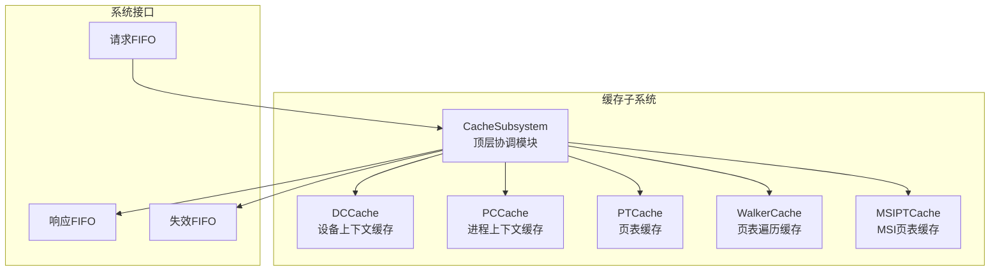
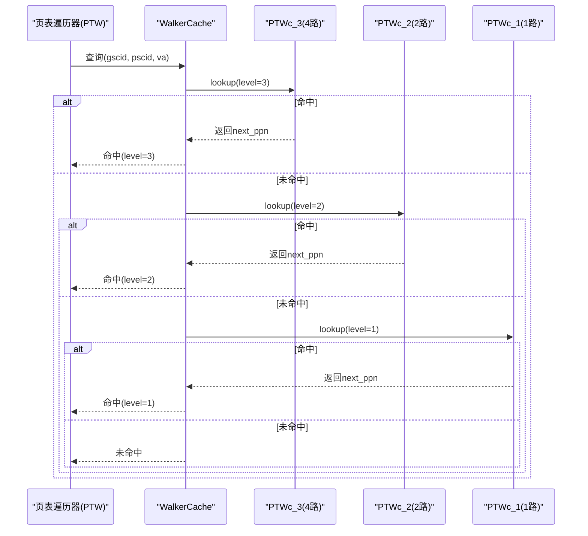
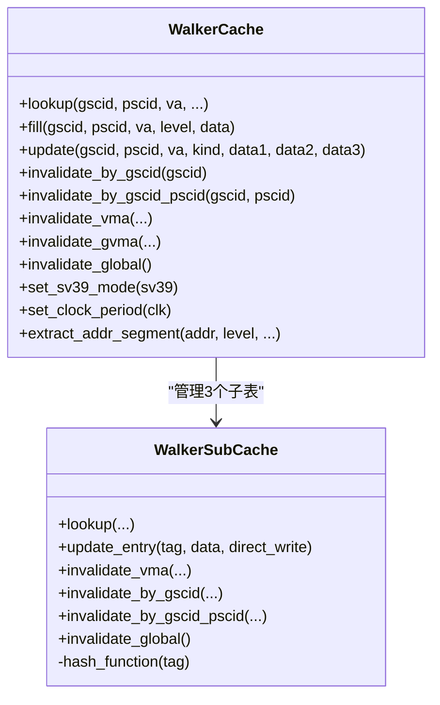
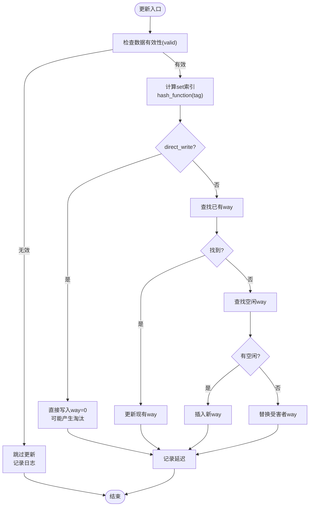
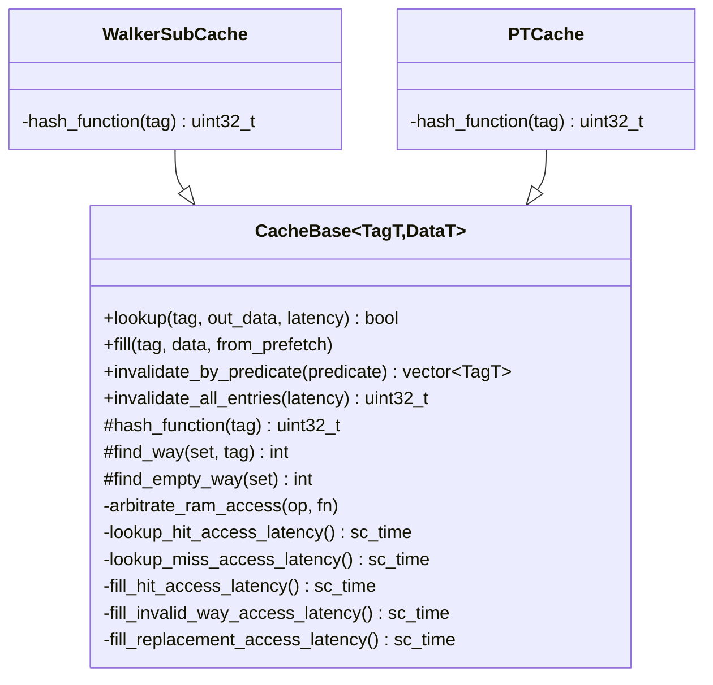
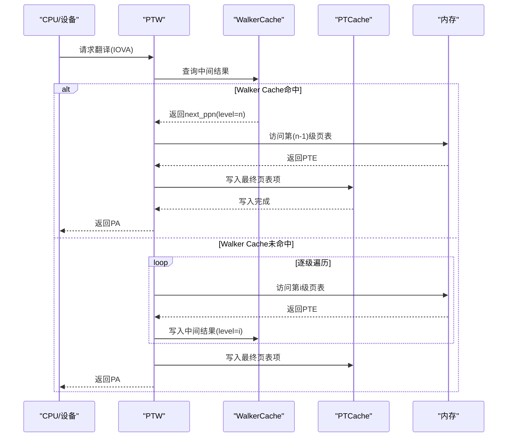
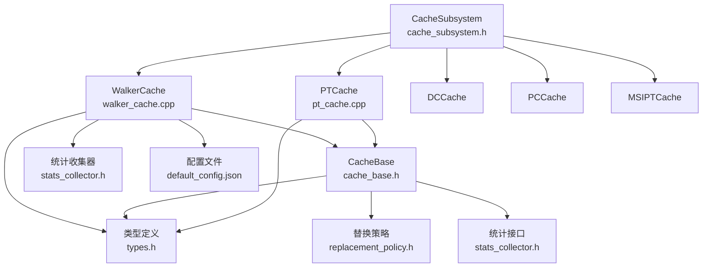

# 页表遍历缓存(Walker Cache)

<cite>
**本文档引用的文件**
- [walker_cache.h](file://iommu/cache_src/cache/walker_cache.h)
- [walker_cache.cpp](file://iommu/cache_src/cache/walker_cache.cpp)
- [pt_cache.h](file://iommu/cache_src/cache/pt_cache.h)
- [pt_cache.cpp](file://iommu/cache_src/cache/pt_cache.cpp)
- [types.h](file://iommu/cache_src/common/types.h)
- [cache_base.h](file://iommu/cache_src/cache/cache_base.h)
- [cache_base.cpp](file://iommu/cache_src/cache/cache_base.cpp)
- [default_config.json](file://iommu/cache_config/default_config.json)
- [cache_subsystem.h](file://iommu/cache_src/subsystem/cache_subsystem.h)
- [stats_collector.h](file://iommu/cache_src/common/stats_collector.h)
- [WALKER_CACHE_INTEGRATION_PLAN.md](file://WALKER_CACHE_INTEGRATION_PLAN.md)
</cite>

## 目录
1. [简介](#简介)
2. [项目结构](#项目结构)
3. [核心组件](#核心组件)
4. [架构概览](#架构概览)
5. [详细组件分析](#详细组件分析)
6. [依赖关系分析](#依赖关系分析)
7. [性能考量](#性能考量)
8. [故障排除指南](#故障排除指南)
9. [结论](#结论)
10. [附录](#附录)

## 简介
本文件针对RISC-V IOMMU中的页表遍历缓存(Walker Cache)进行全面技术文档化。Walker Cache通过缓存多级页表遍历过程中的中间结果，显著减少重复访问时的DDR请求次数，从而大幅降低页表遍历延迟。其核心价值体现在：

- **多级缓存架构**：包含PTWc_1(直接映射，缓存第1级中间结果)、PTWc_2(2路组相联，缓存第2级中间结果)、PTWc_3(4路组相联，缓存第3级中间结果)，形成从高层到低层的渐进式加速。
- **智能查询策略**：按level 3→2→1顺序查询，命中即短路返回，避免不必要的低层访问。
- **精确失效机制**：支持按GSCID/PSCID/VMA/GVMA等粒度进行精确或扫描失效，确保缓存一致性。
- **更新优化**：支持并行更新多个level的中间结果，减少更新时延。
- **与PT Cache协作**：Walker Cache缓存中间结果，PT Cache缓存最终页表项，两者配合实现端到端的翻译加速。

## 项目结构
Walker Cache位于iommu/cache_src/cache目录下，采用SystemC模块化设计，继承统一的CacheBase基类，具备完整的查找、填充、失效、统计等功能。整体文件组织如下：
- cache_base.h/cpp：通用缓存基类，提供仲裁、替换、延迟建模等基础设施
- walker_cache.h/cpp：Walker Cache及其子表实现
- pt_cache.h/cpp：PT Cache实现（与Walker Cache协作）
- types.h：缓存类型、标签、数据结构及配置定义
- cache_subsystem.h：顶层缓存子系统，管理各缓存实例与失效流水线
- default_config.json：默认缓存配置（含Walker Cache参数）
- stats_collector.h：性能统计收集器

**图表来源**
- [cache_subsystem.h:18-84](file://iommu/cache_src/subsystem/cache_subsystem.h#L18-L84)

**章节来源**
- [cache_subsystem.h:18-84](file://iommu/cache_src/subsystem/cache_subsystem.h#L18-L84)
- [default_config.json:45-59](file://iommu/cache_config/default_config.json#L45-L59)

## 核心组件
Walker Cache由一个主模块和三个子表组成，每个子表负责缓存对应级别的中间结果。其核心接口包括：

- **查找接口**：lookup(gscid, pscid, va, ...)，内部按level 3→2→1顺序查询，命中即返回
- **填充接口**：fill(gscid, pscid, va, level, data)，按level写入对应子表
- **更新接口**：update(gscid, pscid, va, kind, data1, data2, data3)，支持并行更新多级结果
- **失效接口**：按GSCID/PSCID/VMA/GVMA等粒度进行精确或扫描失效

Walker Cache的关键特性：
- **子表配置差异**：PTWc_1为直接映射(1路)，PTWc_2为2路组相联，PTWc_3为4路组相联
- **地址段提取**：根据Sv39/Sv48和x4模式提取对应level的地址段作为缓存索引
- **Sv39模式兼容**：Sv39无PTWc_1，自动跳过第1级查询
- **替换策略**：PTWc_1无替换(直接映射)，PTWc_2/3支持PLRU或SRRIP

**章节来源**
- [walker_cache.h:15-92](file://iommu/cache_src/cache/walker_cache.h#L15-L92)
- [walker_cache.cpp:239-262](file://iommu/cache_src/cache/walker_cache.cpp#L239-L262)
- [types.h:573-589](file://iommu/cache_src/common/types.h#L573-L589)

## 架构概览
Walker Cache在IOMMU中的位置与职责如下：

**图表来源**
- [walker_cache.cpp:264-319](file://iommu/cache_src/cache/walker_cache.cpp#L264-L319)

**章节来源**
- [walker_cache.cpp:264-319](file://iommu/cache_src/cache/walker_cache.cpp#L264-L319)

## 详细组件分析

### WalkerCache类分析
WalkerCache是顶层模块，管理三个WalkerSubCache子表。其主要职责包括：
- **查询协调**：按level 3→2→1顺序查询，短路返回最高命中level
- **填充路由**：根据level将数据写入对应子表
- **并行更新**：使用SystemC进程并行更新多个子表，最大化吞吐
- **失效聚合**：提供按GSCID/PSCID/VMA/GVMA的失效接口

**图表来源**
- [walker_cache.h:15-92](file://iommu/cache_src/cache/walker_cache.h#L15-L92)
- [walker_cache.cpp:239-262](file://iommu/cache_src/cache/walker_cache.cpp#L239-L262)

**章节来源**
- [walker_cache.h:15-92](file://iommu/cache_src/cache/walker_cache.h#L15-L92)
- [walker_cache.cpp:239-493](file://iommu/cache_src/cache/walker_cache.cpp#L239-L493)

### WalkerSubCache类分析
WalkerSubCache继承自CacheBase，实现具体的查找、更新和失效逻辑：
- **哈希函数**：基于va_segment、gscid、pscid的LSB异或，确保跨进程和跨地址的均匀分布
- **查找流程**：hash→set内way比较→命中返回，未命中继续
- **更新策略**：支持直接写入(direct_write)和普通更新两种路径，避免无效数据污染
- **失效策略**：支持精确失效(仅hash定位set)和扫描失效(全表扫描)

**图表来源**
- [walker_cache.cpp:55-144](file://iommu/cache_src/cache/walker_cache.cpp#L55-L144)

**章节来源**
- [walker_cache.cpp:21-144](file://iommu/cache_src/cache/walker_cache.cpp#L21-L144)

### CacheBase基类分析
CacheBase提供统一的缓存基础设施：
- **仲裁机制**：WRR权重均衡分配lookup/fill/invalidation，避免饥饿
- **延迟建模**：分别建模hash、read_set、compare、write等阶段延迟
- **替换策略**：支持PLRU和SRRIP，SRRIP在插入时特殊处理
- **性能统计**：访问、命中、缺失、淘汰、失效、排队延迟等指标

**图表来源**
- [cache_base.h:26-216](file://iommu/cache_src/cache/cache_base.h#L26-L216)

**章节来源**
- [cache_base.h:26-216](file://iommu/cache_src/cache/cache_base.h#L26-L216)

### Walker Cache与PT Cache的协作关系
Walker Cache与PT Cache在IOMMU翻译流程中形成互补：
- **Walker Cache**：缓存页表遍历中间结果(next_ppn)，减少重复的页表访问
- **PT Cache**：缓存最终页表项(spte/gpte)，提供最终翻译结果
- **数据流向**：Walker Cache命中→跳过对应层级→直接访问下一级页表；Walker Cache未命中→按层级遍历→最终在PT Cache写入

**图表来源**
- [WALKER_CACHE_INTEGRATION_PLAN.md:297-358](file://WALKER_CACHE_INTEGRATION_PLAN.md#L297-L358)

**章节来源**
- [WALKER_CACHE_INTEGRATION_PLAN.md:297-358](file://WALKER_CACHE_INTEGRATION_PLAN.md#L297-L358)

## 依赖关系分析
Walker Cache的依赖关系如下：

**图表来源**
- [walker_cache.cpp:1-5](file://iommu/cache_src/cache/walker_cache.cpp#L1-L5)
- [cache_base.h:1-17](file://iommu/cache_src/cache/cache_base.h#L1-L17)
- [types.h:14-17](file://iommu/cache_src/common/types.h#L14-L17)

**章节来源**
- [walker_cache.cpp:1-5](file://iommu/cache_src/cache/walker_cache.cpp#L1-L5)
- [cache_base.h:1-17](file://iommu/cache_src/cache/cache_base.h#L1-L17)
- [types.h:14-17](file://iommu/cache_src/common/types.h#L14-L17)

## 性能考量
Walker Cache的性能优化点包括：

### 缓存配置参数
- **基础集数(base_sets)**：决定缓存规模，默认64
- **PTWc_1配置**：1路直接映射，无替换策略，适合高频访问的第1级中间结果
- **PTWc_2配置**：2路组相联，平衡容量与冲突
- **PTWc_3配置**：4路组相联，容纳更多中间结果
- **替换策略**：默认PLRU，SRRIP可选(在cache_base中实现)

### 延迟建模
CacheBase对各类操作的延迟进行了精细建模：
- **仲裁延迟(arbiter_latency_cycles)**：1周期
- **哈希延迟(hash_latency_cycles)**：1周期
- **读set延迟(read_set_latency_cycles)**：1周期
- **比较延迟(compare_latency_cycles)**：1周期
- **写入延迟(write_way_latency_cycles)**：1周期
- **索引计算延迟(fill_compute_index_*)**：命中1、空闲2、替换4周期

### 并行更新优化
WalkerCache::update支持并行更新多个子表，使用SystemC进程池：
- **条件更新**：仅在对应level有效且非Sv39模式下更新PTWc_1
- **直接写入**：PTWc_1使用direct_write=true，绕过替换算法
- **并行执行**：使用sc_join等待所有子进程完成，最大化吞吐

**章节来源**
- [default_config.json:45-59](file://iommu/cache_config/default_config.json#L45-L59)
- [cache_base.h:154-202](file://iommu/cache_src/cache/cache_base.h#L154-L202)
- [walker_cache.cpp:347-435](file://iommu/cache_src/cache/walker_cache.cpp#L347-L435)

## 故障排除指南
Walker Cache相关的常见问题与排查方法：

### 缓存污染问题
现象：缓存命中但返回无效数据
原因：更新了无效的中间结果(valid=0)
解决：WalkerSubCache::update_entry已内置保护，检查数据构造逻辑

### 命中率偏低
可能原因：
- 地址段提取错误，导致冲突增加
- 配置不当(sets过小、ways过少)
- 失效策略过于激进

排查步骤：
1. 检查extract_addr_segment逻辑与Sv39/Sv48模式匹配
2. 分析统计报告中的命中率和淘汰率
3. 调整配置参数，观察效果

### 死锁或性能退化
现象：系统响应缓慢或停滞
原因：Walker Cache查询阻塞
解决：确保walker_response_fifo深度充足(≥16)，避免背压

**章节来源**
- [walker_cache.cpp:55-71](file://iommu/cache_src/cache/walker_cache.cpp#L55-L71)
- [cache_base.h:560-647](file://iommu/cache_src/cache/cache_base.h#L560-L647)

## 结论
Walker Cache通过缓存多级页表遍历中间结果，实现了对重复访问场景的显著加速。其设计特点包括：
- **分层缓存架构**：PTWc_1/2/3分别缓存不同层级的中间结果
- **智能查询策略**：按level降序查询，命中即短路
- **精确失效机制**：支持多种粒度的失效策略
- **并行更新优化**：最大化更新吞吐
- **与PT Cache协作**：形成从中间结果到最终页表项的完整加速链

在实际部署中，建议：
- 根据工作负载调整PTWc_1/2/3的ways配置
- 启用适当的替换策略(SRRIP适用于高冲突场景)
- 监控统计指标，及时发现异常
- 合理配置FIFO深度，避免背压

## 附录

### Walker Cache配置参数详解
- **base_sets**：基础缓存集数，影响总体容量
- **ptw_c1**：PTWc_1配置，通常为1路直接映射
- **ptw_c2**：PTWc_2配置，2路组相联
- **ptw_c3**：PTWc_3配置，4路组相联
- **replacement**：替换策略选择
- **srrip_m_bits**：SRRIP策略的m参数

### 关键数据结构
- **WalkerData**：缓存的中间结果，包含next_ppn和保留字段
- **WalkerTag**：缓存标签，包含gscid、pscid、level、va_segment等
- **WalkerUpdateKind**：更新类型枚举，支持批量更新

**章节来源**
- [types.h:424-474](file://iommu/cache_src/common/types.h#L424-L474)
- [types.h:573-589](file://iommu/cache_src/common/types.h#L573-L589)