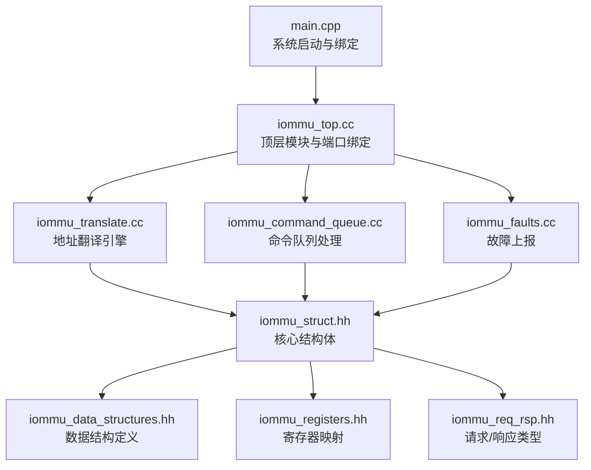
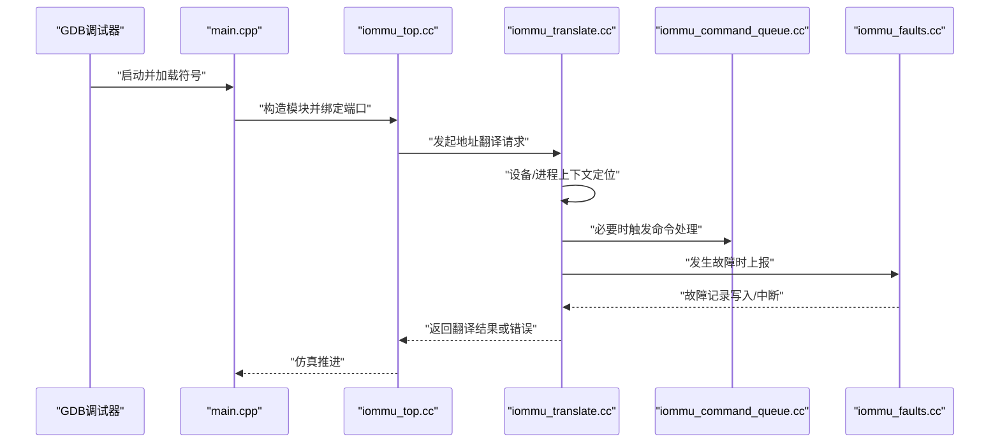
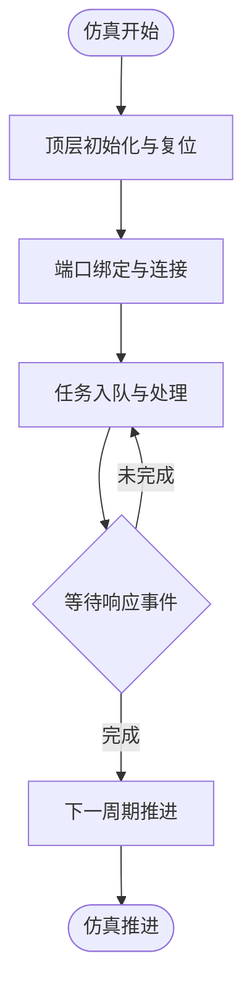
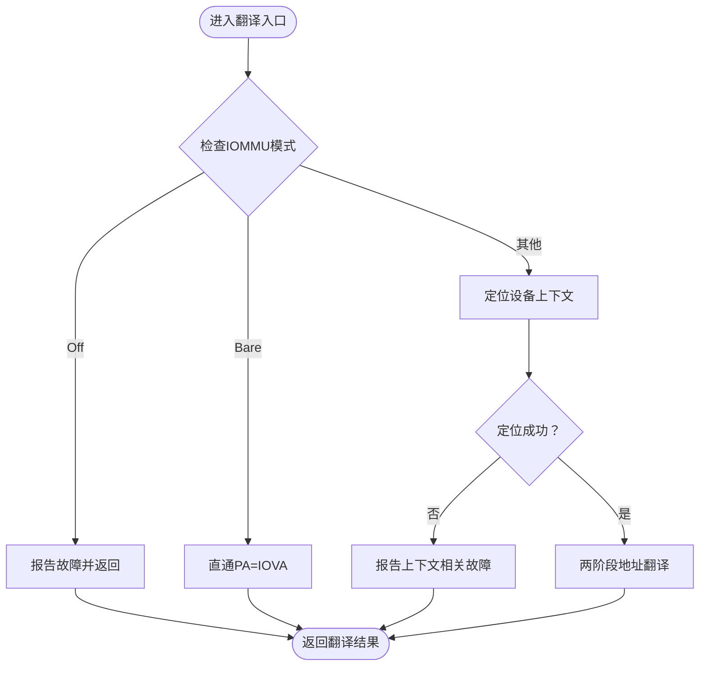
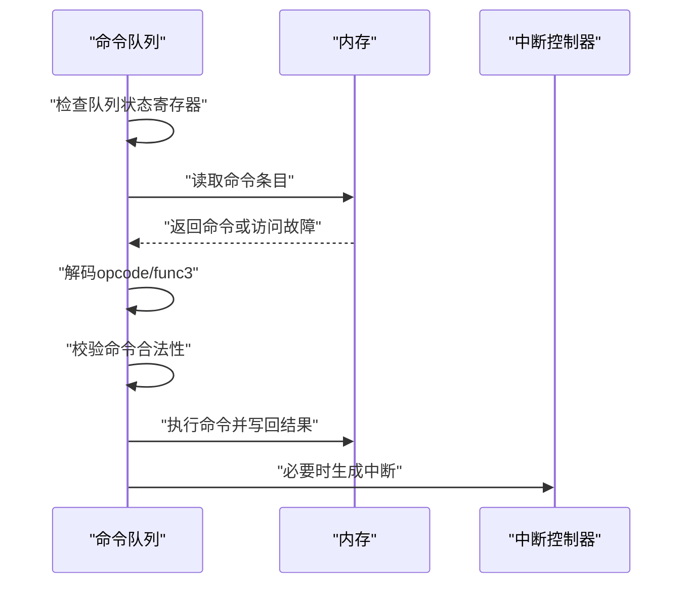
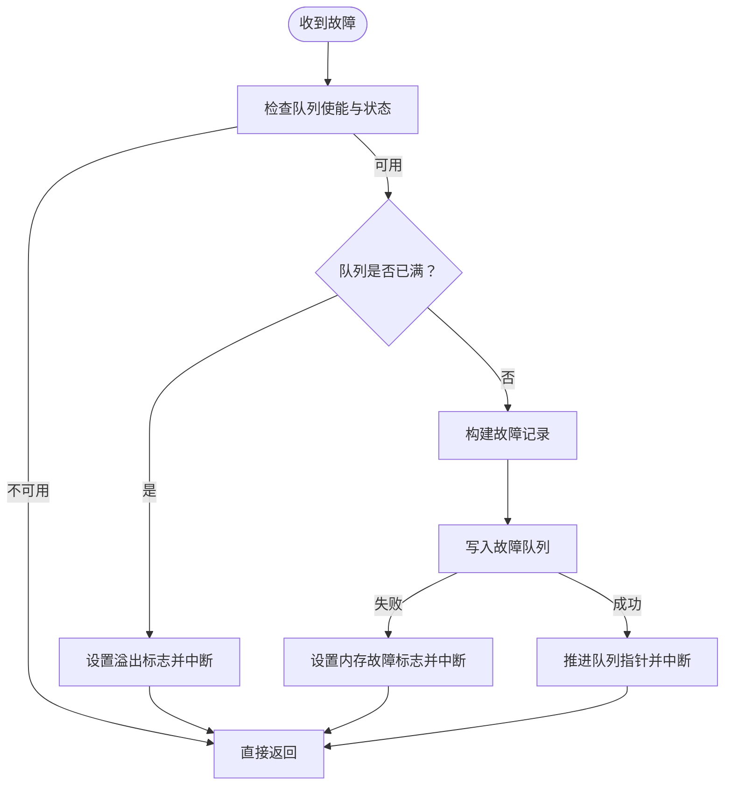

# GDB调试工具使用

<cite>
**本文引用的文件**
- [GDB_DEBUG_GUIDE.md](file://GDB_DEBUG_GUIDE.md)
- [gdb_debug.sh](file://gdb_debug.sh)
- [Makefile](file://Makefile)
- [README.md](file://README.md)
- [main.cpp](file://main.cpp)
- [iommu_top.cc](file://iommu/iommu_top.cc)
- [iommu_translate.cc](file://iommu/iommu_fun_model/iommu_translate.cc)
- [iommu_command_queue.cc](file://iommu/iommu_perf_model/iommu_command_queue.cc)
- [iommu_faults.cc](file://iommu/iommu_fun_model/iommu_faults.cc)
- [iommu_struct.hh](file://iommu/include/iommu_struct.hh)
- [iommu_data_structures.hh](file://iommu/include/iommu_data_structures.hh)
- [iommu_registers.hh](file://iommu/include/iommu_registers.hh)
- [iommu_req_rsp.hh](file://iommu/include/iommu_req_rsp.hh)
- [iommu_utils.hh](file://iommu/include/iommu_utils.hh)
</cite>

## 目录
1. [简介](#简介)
2. [项目结构](#项目结构)
3. [核心组件](#核心组件)
4. [架构总览](#架构总览)
5. [详细组件分析](#详细组件分析)
6. [依赖关系分析](#依赖关系分析)
7. [性能考量](#性能考量)
8. [故障排查指南](#故障排查指南)
9. [结论](#结论)
10. [附录](#附录)

## 简介
本指南面向使用 GDB 调试 RISC-V IOMMU 模型的开发者，系统介绍基本与高级调试命令、断点策略、变量与内存检查、调试脚本使用、IOMMU 模型专用调试技巧（关键断点、条件断点、命令断点）、调试示例与常见问题处理，并说明调试模式编译选项及其性能影响。文档中的所有技术细节均来自仓库内现有文件与脚本，确保可操作性与准确性。

## 项目结构
该工程采用 SystemC 作为仿真框架，IOMMU 核心逻辑分布在 iommu 子目录中，包含功能模型与性能模型两大类模块；顶层模块负责连接各子系统并通过 main.cpp 启动仿真。调试相关的关键位置包括：
- 顶层模块与主程序入口：用于观察系统启动与初始化路径
- 地址翻译引擎：核心功能，适合设置断点定位翻译问题
- 命令队列处理：用于验证命令解析与执行流程
- 故障上报模块：用于定位故障产生与上报路径
- 头文件：提供寄存器、数据结构、请求响应等类型定义，便于在 GDB 中打印复杂结构

**图示来源**
- [main.cpp:39-94](file://main.cpp#L39-L94)
- [iommu_top.cc:19-200](file://iommu/iommu_top.cc#L19-L200)
- [iommu_translate.cc:8-200](file://iommu/iommu_fun_model/iommu_translate.cc#L8-L200)
- [iommu_command_queue.cc:7-200](file://iommu/iommu_perf_model/iommu_command_queue.cc#L7-L200)
- [iommu_faults.cc:8-160](file://iommu/iommu_fun_model/iommu_faults.cc#L8-L160)
- [iommu_struct.hh:42-102](file://iommu/include/iommu_struct.hh#L42-L102)
- [iommu_data_structures.hh:1-200](file://iommu/include/iommu_data_structures.hh#L1-L200)
- [iommu_registers.hh:1-200](file://iommu/include/iommu_registers.hh#L1-L200)
- [iommu_req_rsp.hh:1-106](file://iommu/include/iommu_req_rsp.hh#L1-L106)

**章节来源**
- [README.md:55-92](file://README.md#L55-L92)
- [Makefile:10-50](file://Makefile#L10-L50)

## 核心组件
- 顶层模块与系统启动
  - 顶层模块负责初始化 IOMMU、绑定各子系统端口，并在 main.cpp 中启动 SystemC 仿真。
  - 关键调试点：顶层模块初始化、端口绑定、任务入队与响应事件。
- 地址翻译引擎
  - 提供 IOVA 到 PA 的地址翻译流程，包含多阶段查找、设备/进程上下文定位、故障处理等。
  - 关键调试点：翻译入口、设备上下文定位、两阶段翻译、故障上报。
- 命令队列处理
  - 解析并执行软件下发的 IOMMU 命令，包含非法命令检测、内存访问故障、超时等状态。
  - 关键调试点：命令读取、解码、执行分支、状态寄存器检查。
- 故障上报模块
  - 将故障记录写入故障队列，处理溢出、内存访问故障等异常情况。
  - 关键调试点：故障队列可用性检查、溢出/内存故障标志、记录写入与中断生成。

**章节来源**
- [main.cpp:39-94](file://main.cpp#L39-L94)
- [iommu_top.cc:19-200](file://iommu/iommu_top.cc#L19-L200)
- [iommu_translate.cc:8-200](file://iommu/iommu_fun_model/iommu_translate.cc#L8-L200)
- [iommu_command_queue.cc:7-200](file://iommu/iommu_perf_model/iommu_command_queue.cc#L7-L200)
- [iommu_faults.cc:8-160](file://iommu/iommu_fun_model/iommu_faults.cc#L8-L160)

## 架构总览
下图展示 GDB 调试视角下的关键交互：从 main 启动到顶层模块绑定，再到翻译、命令与故障处理模块的协作。

**图示来源**
- [main.cpp:39-94](file://main.cpp#L39-L94)
- [iommu_top.cc:19-200](file://iommu/iommu_top.cc#L19-L200)
- [iommu_translate.cc:8-200](file://iommu/iommu_fun_model/iommu_translate.cc#L8-L200)
- [iommu_command_queue.cc:7-200](file://iommu/iommu_perf_model/iommu_command_queue.cc#L7-L200)
- [iommu_faults.cc:8-160](file://iommu/iommu_fun_model/iommu_faults.cc#L8-L160)

## 详细组件分析

### 顶层模块与系统启动（调试要点）
- 初始化与复位：顶层模块在 before_end_of_elaboration 中完成 IOMMU 复位与能力配置，是观察寄存器初始状态的理想断点。
- 端口绑定：顶层模块将 IOMMU 的多个 AXI/TLM 端口与 RP、PCIENOC、SLINK、DDR 等模块绑定，便于在仿真早期定位连接问题。
- 任务入队与响应：顶层模块接收外部请求并写入入站 FIFO，随后等待响应事件，适合观察请求生命周期。

**图示来源**
- [iommu_top.cc:19-200](file://iommu/iommu_top.cc#L19-L200)

**章节来源**
- [iommu_top.cc:19-200](file://iommu/iommu_top.cc#L19-L200)
- [main.cpp:39-94](file://main.cpp#L39-L94)

### 地址翻译引擎（调试要点）
- 翻译入口：在翻译入口函数设置断点，检查请求参数（设备 ID、IOVA、访问属性）与寄存器状态。
- 设备/进程上下文：定位设备上下文失败是常见问题，可在定位函数处断点并检查原因码。
- 两阶段翻译：若启用两级翻译，可在两阶段函数处分别断点，核验各级页表查找与权限。
- 故障上报：当翻译失败时，故障上报模块会写入故障队列并可能触发中断，适合在此断点验证故障路径。

**图示来源**
- [iommu_translate.cc:8-200](file://iommu/iommu_fun_model/iommu_translate.cc#L8-L200)
- [iommu_faults.cc:8-160](file://iommu/iommu_fun_model/iommu_faults.cc#L8-L160)

**章节来源**
- [iommu_translate.cc:8-200](file://iommu/iommu_fun_model/iommu_translate.cc#L8-L200)
- [iommu_faults.cc:8-160](file://iommu/iommu_fun_model/iommu_faults.cc#L8-L160)

### 命令队列处理（调试要点）
- 命令读取：检查命令队列状态寄存器，确认队列是否就绪、是否出现内存故障或非法命令。
- 命令解码：根据 opcode 与 func3 分支，核验命令合法性与能力支持。
- 执行与回写：执行具体命令（如无效化、围栏等），并更新队列指针与状态。

**图示来源**
- [iommu_command_queue.cc:7-200](file://iommu/iommu_perf_model/iommu_command_queue.cc#L7-L200)

**章节来源**
- [iommu_command_queue.cc:7-200](file://iommu/iommu_perf_model/iommu_command_queue.cc#L7-L200)

### 故障上报模块（调试要点）
- 队列可用性：检查故障队列使能与状态，避免在队列满或内存故障时丢弃记录。
- 记录写入：核验记录地址计算、对齐与写入状态，关注溢出与内存故障标志。
- 中断生成：故障上报后应生成中断，便于上层软件处理。

**图示来源**
- [iommu_faults.cc:8-160](file://iommu/iommu_fun_model/iommu_faults.cc#L8-L160)

**章节来源**
- [iommu_faults.cc:8-160](file://iommu/iommu_fun_model/iommu_faults.cc#L8-L160)

## 依赖关系分析
- 编译与调试宏：Makefile 中通过 DEBUG 控制编译选项，启用调试符号与大量调试宏，便于在 GDB 中观察内部状态。
- 头文件依赖：核心结构体与寄存器映射由头文件统一定义，GDB 调试时可直接打印复杂字段。
- 数据结构：请求/响应类型、寄存器结构、数据结构联合体等为 GDB 类型信息提供支撑。

**图示来源**
- [Makefile:25-33](file://Makefile#L25-L33)
- [iommu_struct.hh:42-102](file://iommu/include/iommu_struct.hh#L42-L102)
- [iommu_registers.hh:1-200](file://iommu/include/iommu_registers.hh#L1-200)
- [iommu_req_rsp.hh:1-106](file://iommu/include/iommu_req_rsp.hh#L1-106)

**章节来源**
- [Makefile:25-33](file://Makefile#L25-L33)
- [iommu_struct.hh:42-102](file://iommu/include/iommu_struct.hh#L42-L102)
- [iommu_registers.hh:1-200](file://iommu/include/iommu_registers.hh#L1-200)
- [iommu_req_rsp.hh:1-106](file://iommu/include/iommu_req_rsp.hh#L1-106)

## 性能考量
- 调试模式编译：启用 -g 与 -O0，牺牲性能换取完整调试信息与断点精度，属于预期行为。
- 仿真时间：main.cpp 中设置较长仿真时间以覆盖测试场景，调试时可结合断点减少不必要的执行。

**章节来源**
- [Makefile:25-33](file://Makefile#L25-L33)
- [README.md:41-54](file://README.md#L41-L54)
- [main.cpp:82-83](file://main.cpp#L82-L83)

## 故障排查指南
- 符号不可用
  - 确认使用 DEBUG=1 编译，确保未 strip 调试符号，且源码路径正确。
- 断点无法命中
  - 检查函数名拼写、确认在 DEBUG=1 下编译，以及相关代码路径确被执行。
- 性能与速度
  - 调试模式下运行速度较慢属正常现象，建议在定位问题后切换到发布模式进行性能评估。

**章节来源**
- [GDB_DEBUG_GUIDE.md:160-173](file://GDB_DEBUG_GUIDE.md#L160-L173)
- [README.md:41-54](file://README.md#L41-L54)

## 结论
通过结合仓库内的调试指南、调试脚本与编译配置，开发者可以高效地在 GDB 中定位 IOMMU 地址翻译、命令处理与故障上报等问题。建议优先从顶层模块与翻译入口设置断点，配合条件断点与命令断点快速缩小问题范围，并利用头文件提供的结构定义在 GDB 中直观查看寄存器与数据结构。

## 附录

### GDB 常用命令速查
- 基本命令：运行、继续、退出、帮助
- 断点管理：在函数或行号设置断点、查看与删除断点
- 单步调试：进入函数、跳过函数、完成当前函数、运行到指定行
- 变量与内存：打印变量、数组、每次停止自动显示、查看局部变量、检查内存
- 调用栈：显示调用栈、切换栈帧、查看当前帧信息

**章节来源**
- [GDB_DEBUG_GUIDE.md:36-68](file://GDB_DEBUG_GUIDE.md#L36-L68)

### 调试脚本使用
- 自动化启动：脚本检查可执行文件与 GDB 安装，自动设置工作目录、参数与断点并运行。
- 快速上手：无需手工输入繁琐命令，一键进入调试会话。

**章节来源**
- [gdb_debug.sh:1-37](file://gdb_debug.sh#L1-L37)

### IOMMU 模型专用调试技巧
- 关键断点建议：翻译入口、设备上下文定位、地址翻译缓存、命令队列处理线程
- 调试地址翻译问题：在翻译入口、两阶段翻译函数、故障上报处设置断点
- 查看关键数据结构：实例寄存器文件、DDTP、功能控制寄存器、能力寄存器

**章节来源**
- [GDB_DEBUG_GUIDE.md:69-120](file://GDB_DEBUG_GUIDE.md#L69-L120)

### 高级调试技术
- 条件断点：仅在满足条件时中断
- 命令断点：命中断点时自动执行一组命令
- 跟踪点：不中断程序执行，仅记录信息

**章节来源**
- [GDB_DEBUG_GUIDE.md:174-204](file://GDB_DEBUG_GUIDE.md#L174-L204)

### 调试示例
- 示例1：调试地址翻译失败
  - 设置翻译入口、设备上下文定位、故障上报断点，运行后检查请求参数与寄存器状态
- 示例2：单步调试特定功能
  - 启动后按 Ctrl+C 停止，设置断点并继续，逐步检查寄存器字段

**章节来源**
- [GDB_DEBUG_GUIDE.md:121-157](file://GDB_DEBUG_GUIDE.md#L121-L157)

### 调试模式编译选项与影响
- 编译选项：DEBUG=1 启用 -g 与 -O0，并开启多种调试宏
- 影响：运行速度显著降低，但调试信息完整，适合定位问题

**章节来源**
- [Makefile:25-33](file://Makefile#L25-L33)
- [README.md:41-54](file://README.md#L41-L54)