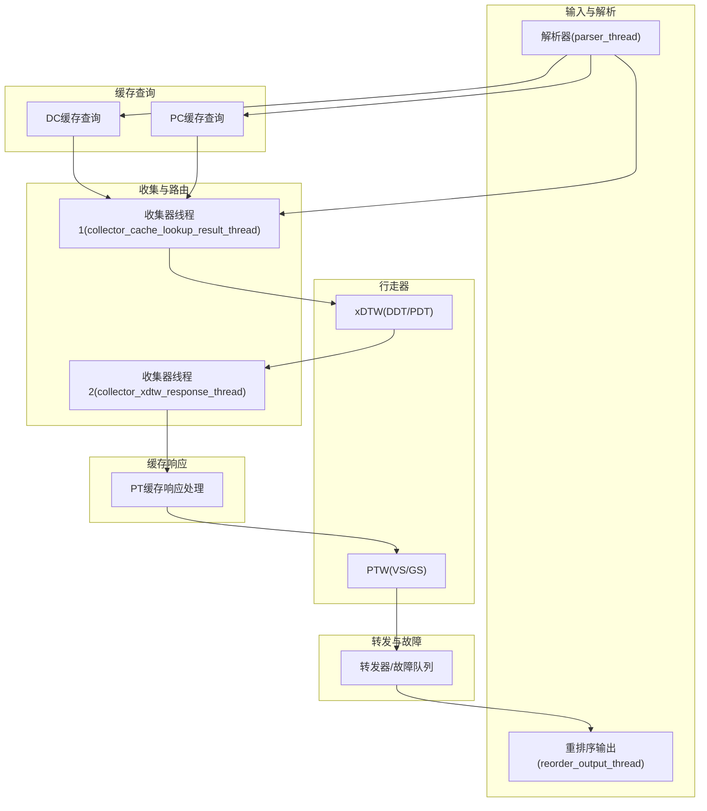
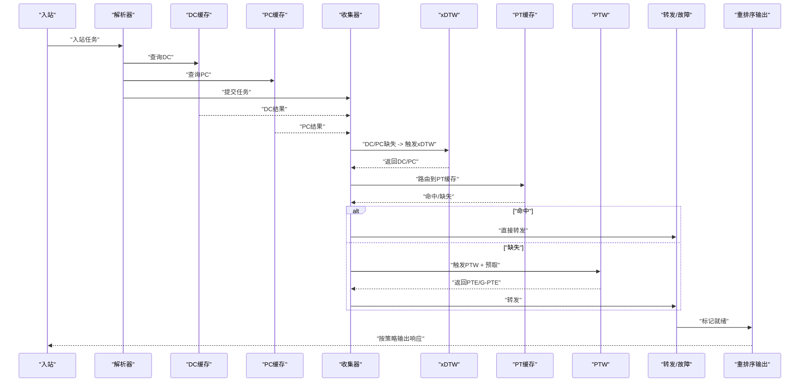
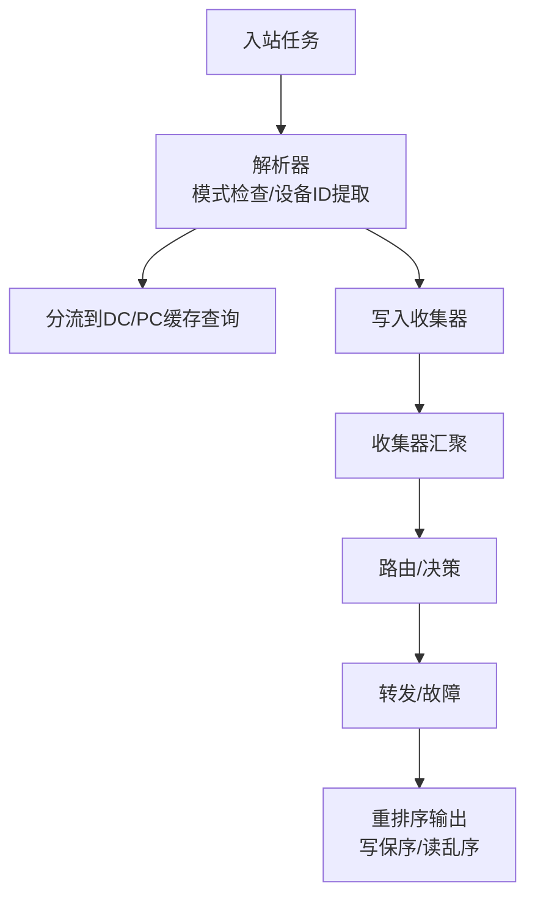
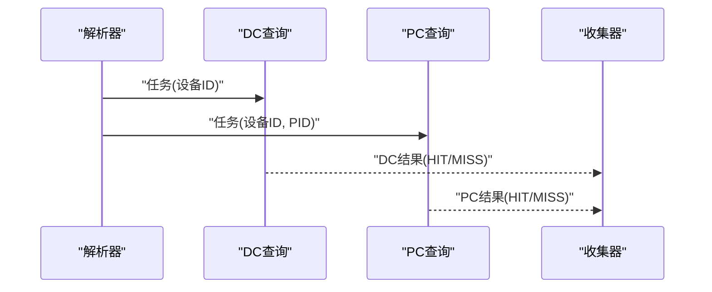
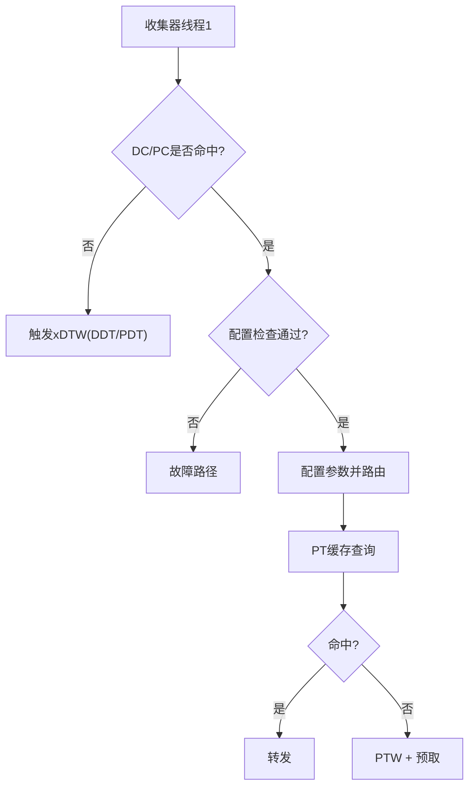
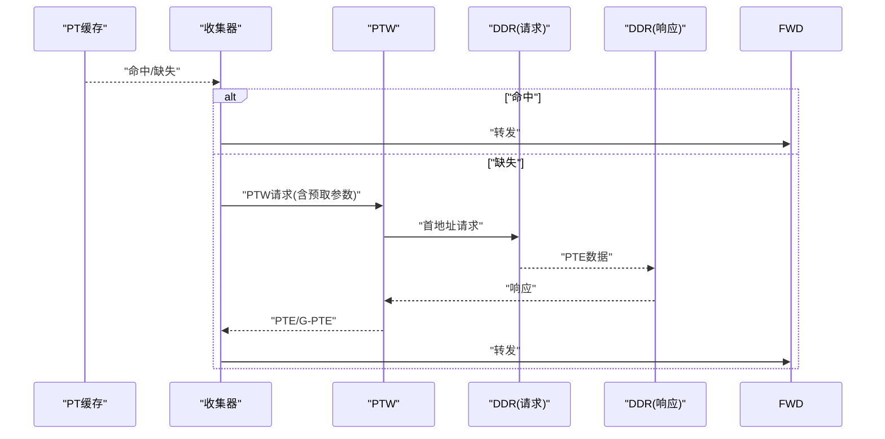
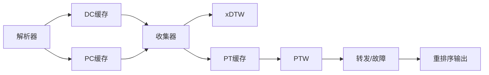

# 性能问题调试

<cite>
**本文档引用的文件**
- [iommu_perf_model.hh](file://iommu/iommu_perf_model/iommu_perf_model.hh)
- [iommu_perf_collector.cc](file://iommu/iommu_perf_model/iommu_perf_collector.cc)
- [stats_collector.h](file://iommu/cache_src/common/stats_collector.h)
- [stats_collector.cpp](file://iommu/cache_src/common/stats_collector.cpp)
- [iommu_perf_params.hh](file://iommu/iommu_perf_model/iommu_perf_params.hh)
- [iommu_perf_params_t2.hh](file://iommu/iommu_perf_model/iommu_perf_params_t2.hh)
- [iommu_perf_parser.cc](file://iommu/iommu_perf_model/iommu_perf_parser.cc)
- [iommu_perf_dc_pc_cache.cc](file://iommu/iommu_perf_model/iommu_perf_dc_pc_cache.cc)
- [iommu_perf_pt_cache_response.cc](file://iommu/iommu_perf_model/iommu_perf_pt_cache_response.cc)
- [iommu_perf_xdtw.cc](file://iommu/iommu_perf_model/iommu_perf_xdtw.cc)
- [iommu_perf_ptw.cc](file://iommu/iommu_perf_model/iommu_perf_ptw.cc)
- [iommu_perf_reorder.cc](file://iommu/iommu_perf_model/iommu_perf_reorder.cc)
</cite>

## 目录
1. [简介](#简介)
2. [项目结构](#项目结构)
3. [核心组件](#核心组件)
4. [架构总览](#架构总览)
5. [详细组件分析](#详细组件分析)
6. [依赖关系分析](#依赖关系分析)
7. [性能考量](#性能考量)
8. [故障排查指南](#故障排查指南)
9. [结论](#结论)
10. [附录](#附录)

## 简介
本文件面向IOMMU性能问题调试，聚焦于缓存命中率分析、延迟测量与吞吐量评估，解释性能统计指标的含义与计算方法，提供性能回归测试与基准测试的实施方案，并总结优化调试技巧与最佳实践。文档基于代码库中的性能模型、统计收集器与各子系统的实现细节，帮助读者快速定位瓶颈并制定优化策略。

## 项目结构
IOMMU性能模型采用SystemC线程化模块划分，围绕“解析-缓存查询-收集决策-行走器-缓存响应-转发/故障-重排序输出”的流水线展开。关键目录与文件如下：
- 性能模型与参数：iommu/iommu_perf_model/*.cc/.hh
- 缓存与统计：iommu/cache_src/common/stats_collector.*（统计采集与报告）
- 参数配置：iommu/iommu_perf_model/iommu_perf_params*.hh（FIFO深度、缓存规模、处理延迟等）

图表来源
- [iommu_perf_parser.cc:9-122](file://iommu/iommu_perf_model/iommu_perf_parser.cc#L9-L122)
- [iommu_perf_dc_pc_cache.cc:11-122](file://iommu/iommu_perf_model/iommu_perf_dc_pc_cache.cc#L11-L122)
- [iommu_perf_collector.cc:14-275](file://iommu/iommu_perf_model/iommu_perf_collector.cc#L14-L275)
- [iommu_perf_xdtw.cc:12-369](file://iommu/iommu_perf_model/iommu_perf_xdtw.cc#L12-L369)
- [iommu_perf_pt_cache_response.cc:20-99](file://iommu/iommu_perf_model/iommu_perf_pt_cache_response.cc#L20-L99)
- [iommu_perf_ptw.cc:41-311](file://iommu/iommu_perf_model/iommu_perf_ptw.cc#L41-L311)
- [iommu_perf_reorder.cc:91-198](file://iommu/iommu_perf_model/iommu_perf_reorder.cc#L91-L198)

章节来源
- [iommu_perf_parser.cc:9-122](file://iommu/iommu_perf_model/iommu_perf_parser.cc#L9-L122)
- [iommu_perf_dc_pc_cache.cc:11-122](file://iommu/iommu_perf_model/iommu_perf_dc_pc_cache.cc#L11-L122)
- [iommu_perf_collector.cc:14-275](file://iommu/iommu_perf_model/iommu_perf_collector.cc#L14-L275)
- [iommu_perf_xdtw.cc:12-369](file://iommu/iommu_perf_model/iommu_perf_xdtw.cc#L12-L369)
- [iommu_perf_pt_cache_response.cc:20-99](file://iommu/iommu_perf_model/iommu_perf_pt_cache_response.cc#L20-L99)
- [iommu_perf_ptw.cc:41-311](file://iommu/iommu_perf_model/iommu_perf_ptw.cc#L41-L311)
- [iommu_perf_reorder.cc:91-198](file://iommu/iommu_perf_model/iommu_perf_reorder.cc#L91-L198)

## 核心组件
- 解析器：负责入站任务解析、模式检查、设备ID提取与分流至缓存查询与收集器。
- DC/PC缓存：并行查询设备/进程上下文缓存，返回命中/缺失结果。
- 收集器：汇聚解析、DC/PC查询结果，执行配置检查与路由决策，必要时触发xDTW行走器。
- xDTW：根据设备/进程上下文查找DC/PC，读取寄存器配置并校验有效性。
- PT缓存响应：处理PT缓存命中/缺失，命中直接转发，缺失则触发PTW与预取。
- PTW：两阶段地址转换（VS/GS），处理A/D位更新、隐式/显式G-stage翻译、合并读与预取。
- 重排序输出：按写保序与读乱序策略输出响应，统计端到端延迟与吞吐。

章节来源
- [iommu_perf_parser.cc:9-122](file://iommu/iommu_perf_model/iommu_perf_parser.cc#L9-L122)
- [iommu_perf_dc_pc_cache.cc:11-122](file://iommu/iommu_perf_model/iommu_perf_dc_pc_cache.cc#L11-L122)
- [iommu_perf_collector.cc:14-275](file://iommu/iommu_perf_model/iommu_perf_collector.cc#L14-L275)
- [iommu_perf_xdtw.cc:12-369](file://iommu/iommu_perf_model/iommu_perf_xdtw.cc#L12-L369)
- [iommu_perf_pt_cache_response.cc:20-99](file://iommu/iommu_perf_model/iommu_perf_pt_cache_response.cc#L20-L99)
- [iommu_perf_ptw.cc:41-311](file://iommu/iommu_perf_model/iommu_perf_ptw.cc#L41-L311)
- [iommu_perf_reorder.cc:91-198](file://iommu/iommu_perf_model/iommu_perf_reorder.cc#L91-L198)

## 架构总览
IOMMU性能模型以“模块化线程+统计采集”为核心，通过参数文件统一约束FIFO深度、缓存规模与处理延迟，形成可扩展的流水线。关键性能点包括：
- 并发outstanding上限控制（Parser、xDTW、PTW、重排序输出）
- 缓存命中路径与缺失路径的延迟差异
- DDR访问的流水与合并策略
- 端口带宽与排队延迟建模

图表来源
- [iommu_perf_parser.cc:9-122](file://iommu/iommu_perf_model/iommu_perf_parser.cc#L9-L122)
- [iommu_perf_dc_pc_cache.cc:11-122](file://iommu/iommu_perf_model/iommu_perf_dc_pc_cache.cc#L11-L122)
- [iommu_perf_collector.cc:14-275](file://iommu/iommu_perf_model/iommu_perf_collector.cc#L14-L275)
- [iommu_perf_xdtw.cc:12-369](file://iommu/iommu_perf_model/iommu_perf_xdtw.cc#L12-L369)
- [iommu_perf_pt_cache_response.cc:20-99](file://iommu/iommu_perf_model/iommu_perf_pt_cache_response.cc#L20-L99)
- [iommu_perf_ptw.cc:41-311](file://iommu/iommu_perf_model/iommu_perf_ptw.cc#L41-L311)
- [iommu_perf_reorder.cc:91-198](file://iommu/iommu_perf_model/iommu_perf_reorder.cc#L91-L198)

## 详细组件分析

### 组件A：解析器与重排序输出
- 解析器职责：模式检查、设备ID提取、分流至缓存查询与收集器；注册重排序缓冲并申请全局outstanding。
- 重排序输出：按写保序与读乱序策略输出响应，统计端到端延迟与稳态IOPS采样窗口。

图表来源
- [iommu_perf_parser.cc:9-122](file://iommu/iommu_perf_model/iommu_perf_parser.cc#L9-L122)
- [iommu_perf_reorder.cc:91-198](file://iommu/iommu_perf_model/iommu_perf_reorder.cc#L91-L198)

章节来源
- [iommu_perf_parser.cc:9-122](file://iommu/iommu_perf_model/iommu_perf_parser.cc#L9-L122)
- [iommu_perf_reorder.cc:91-198](file://iommu/iommu_perf_model/iommu_perf_reorder.cc#L91-L198)

### 组件B：DC/PC缓存查询与更新
- 查询线程：并行查询DC/PC缓存，记录命中/缺失计数，返回任务给收集器。
- 更新线程：在xDTW完成后更新缓存内容。

图表来源
- [iommu_perf_dc_pc_cache.cc:11-122](file://iommu/iommu_perf_model/iommu_perf_dc_pc_cache.cc#L11-L122)

章节来源
- [iommu_perf_dc_pc_cache.cc:11-122](file://iommu/iommu_perf_model/iommu_perf_dc_pc_cache.cc#L11-L122)

### 组件C：收集器（缓存结果汇聚与路由）
- 线程1：汇聚解析、DC/PC查询结果，执行配置检查（EN_ATS、PDTV、ENS等），决定是否走xDTW或直接转发。
- 线程2：处理xDTW返回，更新DC/PC有效位，继续后续配置与路由。

图表来源
- [iommu_perf_collector.cc:14-275](file://iommu/iommu_perf_model/iommu_perf_collector.cc#L14-L275)
- [iommu_perf_xdtw.cc:12-369](file://iommu/iommu_perf_model/iommu_perf_xdtw.cc#L12-L369)
- [iommu_perf_pt_cache_response.cc:20-99](file://iommu/iommu_perf_model/iommu_perf_pt_cache_response.cc#L20-L99)

章节来源
- [iommu_perf_collector.cc:14-275](file://iommu/iommu_perf_model/iommu_perf_collector.cc#L14-L275)
- [iommu_perf_xdtw.cc:12-369](file://iommu/iommu_perf_model/iommu_perf_xdtw.cc#L12-L369)
- [iommu_perf_pt_cache_response.cc:20-99](file://iommu/iommu_perf_model/iommu_perf_pt_cache_response.cc#L20-L99)

### 组件D：PT缓存响应与PTW
- PT缓存响应：处理命中/缺失，命中直接转发，缺失则触发PTW与预取。
- PTW：两阶段地址转换，支持合并读与预取，记录DDR访问日志与统计。

图表来源
- [iommu_perf_pt_cache_response.cc:20-99](file://iommu/iommu_perf_model/iommu_perf_pt_cache_response.cc#L20-L99)
- [iommu_perf_ptw.cc:41-311](file://iommu/iommu_perf_model/iommu_perf_ptw.cc#L41-L311)

章节来源
- [iommu_perf_pt_cache_response.cc:20-99](file://iommu/iommu_perf_model/iommu_perf_pt_cache_response.cc#L20-L99)
- [iommu_perf_ptw.cc:41-311](file://iommu/iommu_perf_model/iommu_perf_ptw.cc#L41-L311)

## 依赖关系分析
- 模块耦合：解析器与缓存查询并行解耦；收集器作为协调者，连接缓存、xDTW与PTW；重排序输出作为最终收敛点。
- 关键依赖链：
  - 解析器 → DC/PC缓存 → 收集器 → xDTW/PT缓存 → PTW → 转发/故障 → 重排序输出
- 外部依赖：参数文件定义FIFO深度、缓存规模、处理延迟与带宽，影响整体吞吐与延迟。

图表来源
- [iommu_perf_parser.cc:9-122](file://iommu/iommu_perf_model/iommu_perf_parser.cc#L9-L122)
- [iommu_perf_dc_pc_cache.cc:11-122](file://iommu/iommu_perf_model/iommu_perf_dc_pc_cache.cc#L11-L122)
- [iommu_perf_collector.cc:14-275](file://iommu/iommu_perf_model/iommu_perf_collector.cc#L14-L275)
- [iommu_perf_xdtw.cc:12-369](file://iommu/iommu_perf_model/iommu_perf_xdtw.cc#L12-L369)
- [iommu_perf_pt_cache_response.cc:20-99](file://iommu/iommu_perf_model/iommu_perf_pt_cache_response.cc#L20-L99)
- [iommu_perf_ptw.cc:41-311](file://iommu/iommu_perf_model/iommu_perf_ptw.cc#L41-L311)
- [iommu_perf_reorder.cc:91-198](file://iommu/iommu_perf_model/iommu_perf_reorder.cc#L91-L198)

章节来源
- [iommu_perf_params.hh:6-161](file://iommu/iommu_perf_model/iommu_perf_params.hh#L6-L161)
- [iommu_perf_params_t2.hh:6-154](file://iommu/iommu_perf_model/iommu_perf_params_t2.hh#L6-L154)

## 性能考量
- 缓存命中率分析
  - DC/PC命中率：通过统计采集器记录total_accesses、hits、misses，计算命中率与缺失次数。
  - PT缓存命中率：关注请求阶段与更新阶段的lookup/fill分布，结合区间命中率统计观察稳定性。
  - 预取准确性：prefetch_issued与prefetch_hits用于评估预取命中率。
- 延迟测量
  - 执行延迟（ExecAvg）：纯RAM端口执行时间，用于IOPS计算与端口利用率。
  - 排队延迟（QueueAvg）：FIFO等待时间，反映背压与瓶颈。
  - 请求平均延迟（TotalAvg）：包含排队与执行，用于端到端评估。
  - 端到端延迟：重排序输出记录任务入口时间与完成时间差。
- 吞吐量评估
  - IOPS：基于执行时间计算，避免使用包含排队的请求总时间。
  - 端口利用率：执行时间/窗口时间×100%。
  - 稳态IOPS：跳过前后10%，统计中间80%稳定段。
- 参数与瓶颈定位
  - FIFO深度不足导致背压与排队延迟上升。
  - 缓存规模与关联度影响命中率与替换开销。
  - 处理延迟（如xDTW/PTW/转发）直接影响流水线深度与吞吐。
  - DDR带宽与并发限制影响行走器与缓存更新性能。

章节来源
- [stats_collector.h:13-105](file://iommu/cache_src/common/stats_collector.h#L13-L105)
- [stats_collector.cpp:227-538](file://iommu/cache_src/common/stats_collector.cpp#L227-L538)
- [iommu_perf_params.hh:78-161](file://iommu/iommu_perf_model/iommu_perf_params.hh#L78-L161)
- [iommu_perf_params_t2.hh:78-154](file://iommu/iommu_perf_model/iommu_perf_params_t2.hh#L78-L154)
- [iommu_perf_reorder.cc:157-165](file://iommu/iommu_perf_model/iommu_perf_reorder.cc#L157-L165)

## 故障排查指南
- 常见故障类型
  - 配置检查失败：EN_ATS、PDTV、ENS等配置违规导致任务故障。
  - 地址合法性：非规范地址导致故障。
  - 设备/进程上下文无效：DDT/PDT条目V位或保留位错误。
- 调试步骤
  - 启用统计报告，观察缓存命中率与缺失路径。
  - 分析PTW任务DDR访问摘要，确认读取次数与路径。
  - 检查重排序输出的端到端延迟与稳态窗口，判断是否处于稳态。
  - 对照参数文件，检查FIFO深度与并发限制是否合理。
- 日志与指标
  - 收集器线程打印DC/PC命中/缺失与路由决策。
  - PTW线程打印Walker命中、合并读与预取详情。
  - 重排序输出打印任务就绪与端到端延迟。

章节来源
- [iommu_perf_collector.cc:110-270](file://iommu/iommu_perf_model/iommu_perf_collector.cc#L110-L270)
- [iommu_perf_xdtw.cc:164-369](file://iommu/iommu_perf_model/iommu_perf_xdtw.cc#L164-L369)
- [iommu_perf_ptw.cc:10-80](file://iommu/iommu_perf_model/iommu_perf_ptw.cc#L10-L80)
- [iommu_perf_reorder.cc:157-165](file://iommu/iommu_perf_model/iommu_perf_reorder.cc#L157-L165)

## 结论
通过统计采集器与性能参数的协同，IOMMU性能模型提供了全面的命中率、延迟与吞吐度量。调试时应优先关注缓存命中率与缺失路径、DDR访问合并与预取策略、以及重排序输出的端到端延迟与稳态窗口。结合参数文件调整FIFO深度与并发限制，可在不改变功能的前提下显著提升性能稳定性与吞吐能力。

## 附录

### 性能统计指标与计算方法
- 命中率：hits / total_accesses
- 缺失率：misses / total_accesses
- 预取准确率：prefetch_hits / prefetch_issued
- 执行平均延迟（ExecAvg）：total_execution_latency_ns / execution_latency_samples
- 排队平均延迟（QueueAvg）：total_queue_latency_ns / queue_latency_samples
- 请求平均延迟（TotalAvg）：total_request_latency_ns / request_latency_samples
- IOPS：request_latency_samples / total_execution_latency_ns × 1e-9
- 端口利用率：total_execution_latency_ns / (overall_window_ns) × 100%

章节来源
- [stats_collector.h:73-105](file://iommu/cache_src/common/stats_collector.h#L73-L105)
- [stats_collector.cpp:227-538](file://iommu/cache_src/common/stats_collector.cpp#L227-L538)

### 性能回归测试与基准测试实施
- 回归测试
  - 固定输入工作负载（不同TTYP、VA分布、PID组合），对比命中率、ExecAvg、QueueAvg、IOPS与端到端延迟。
  - 变更参数（FIFO深度、缓存规模、处理延迟）后重复测试，记录指标变化。
- 基准测试
  - 使用稳定段IOPS（跳过前后10%）评估吞吐稳定性。
  - 逐步提高并发（parser/global outstanding、xDTW/PTW并发）观察瓶颈点。
  - 验证预取与合并读策略对命中率与IOPS的影响。

章节来源
- [iommu_perf_params.hh:149-152](file://iommu/iommu_perf_model/iommu_perf_params.hh#L149-L152)
- [iommu_perf_params_t2.hh:143-146](file://iommu/iommu_perf_model/iommu_perf_params_t2.hh#L143-L146)
- [stats_collector.cpp:510-534](file://iommu/cache_src/common/stats_collector.cpp#L510-L534)

### 性能优化调试技巧与最佳实践
- 优先提升缓存命中率：增大缓存规模与关联度，优化替换策略；减少不必要的上下文切换。
- 降低排队延迟：适当增加FIFO深度，避免上游阻塞；平衡下游处理能力。
- 合理设置处理延迟：根据硬件带宽与端口并发限制设定合理延迟，避免过度串行化。
- 利用预取与合并读：在PTW中启用预取，减少多次小读；合并叶子与预取PTE为一次读。
- 监控稳态窗口：使用稳态IOPS采样窗口评估系统在持续负载下的表现。
- 使用统计报告：定期导出统计报告，对比不同版本与参数配置下的指标变化。

章节来源
- [iommu_perf_params.hh:102-137](file://iommu/iommu_perf_model/iommu_perf_params.hh#L102-L137)
- [iommu_perf_params_t2.hh:102-131](file://iommu/iommu_perf_model/iommu_perf_params_t2.hh#L102-L131)
- [iommu_perf_ptw.cc:257-280](file://iommu/iommu_perf_model/iommu_perf_ptw.cc#L257-L280)
- [stats_collector.cpp:510-534](file://iommu/cache_src/common/stats_collector.cpp#L510-L534)