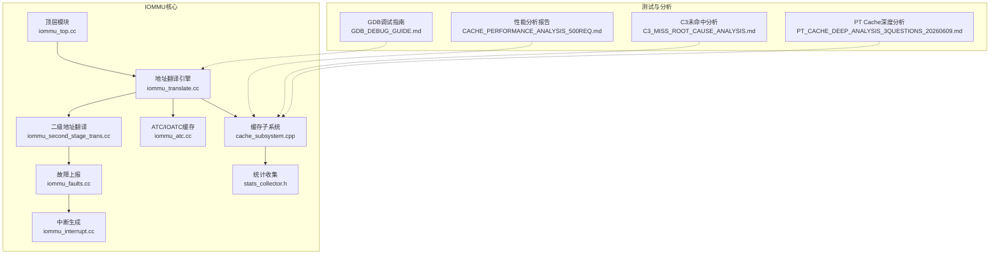
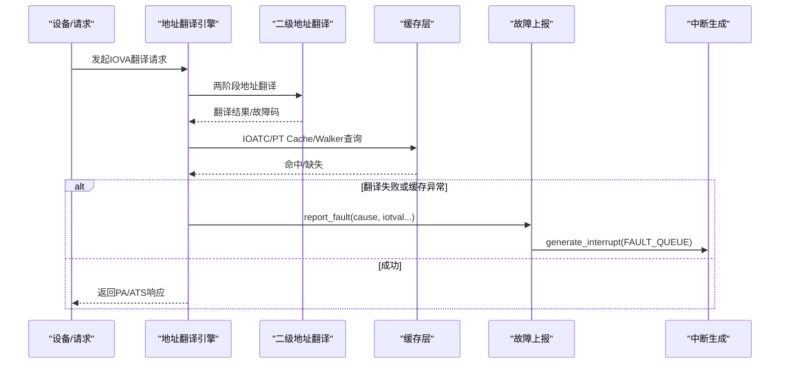
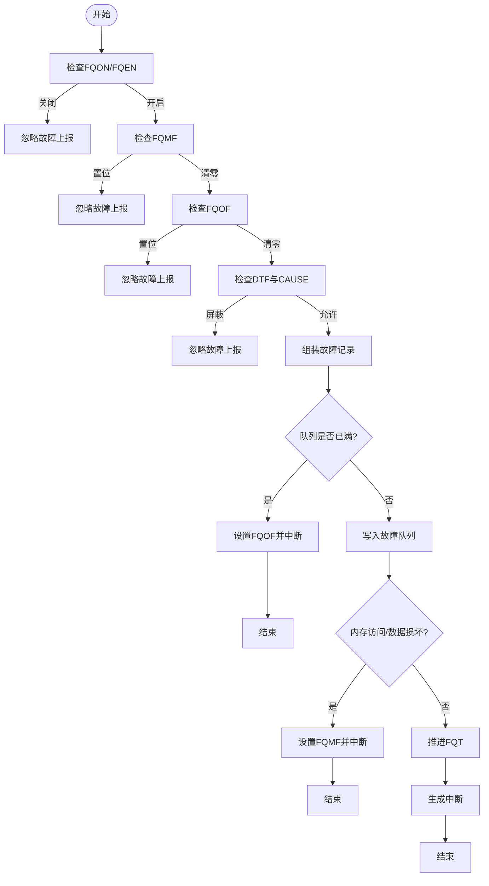
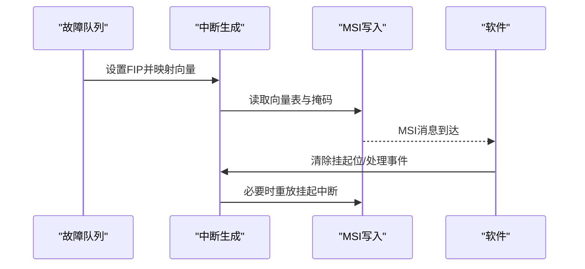
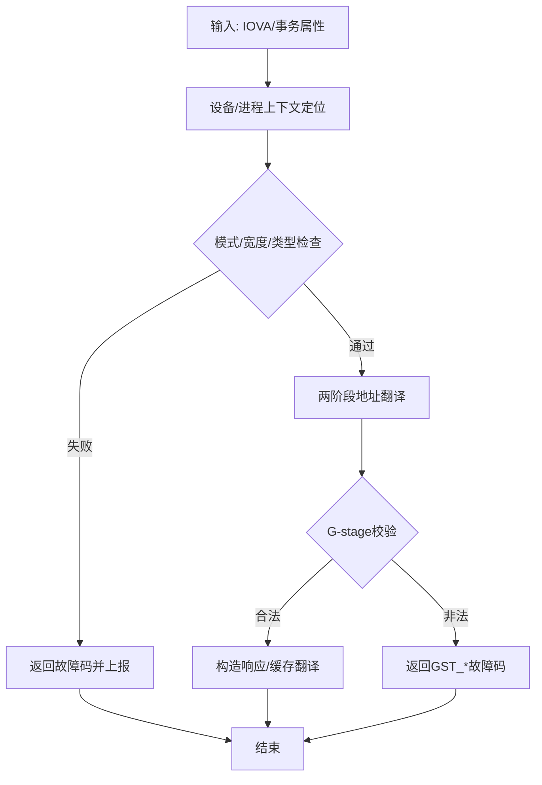
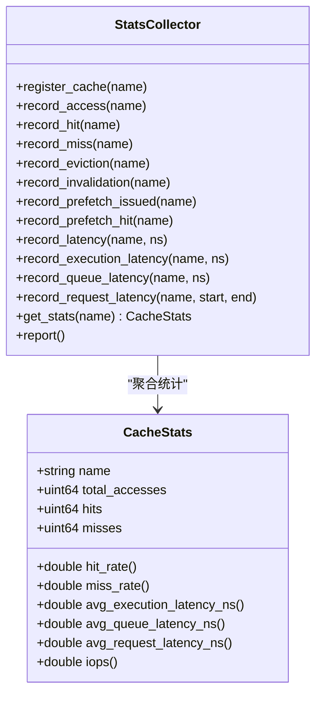
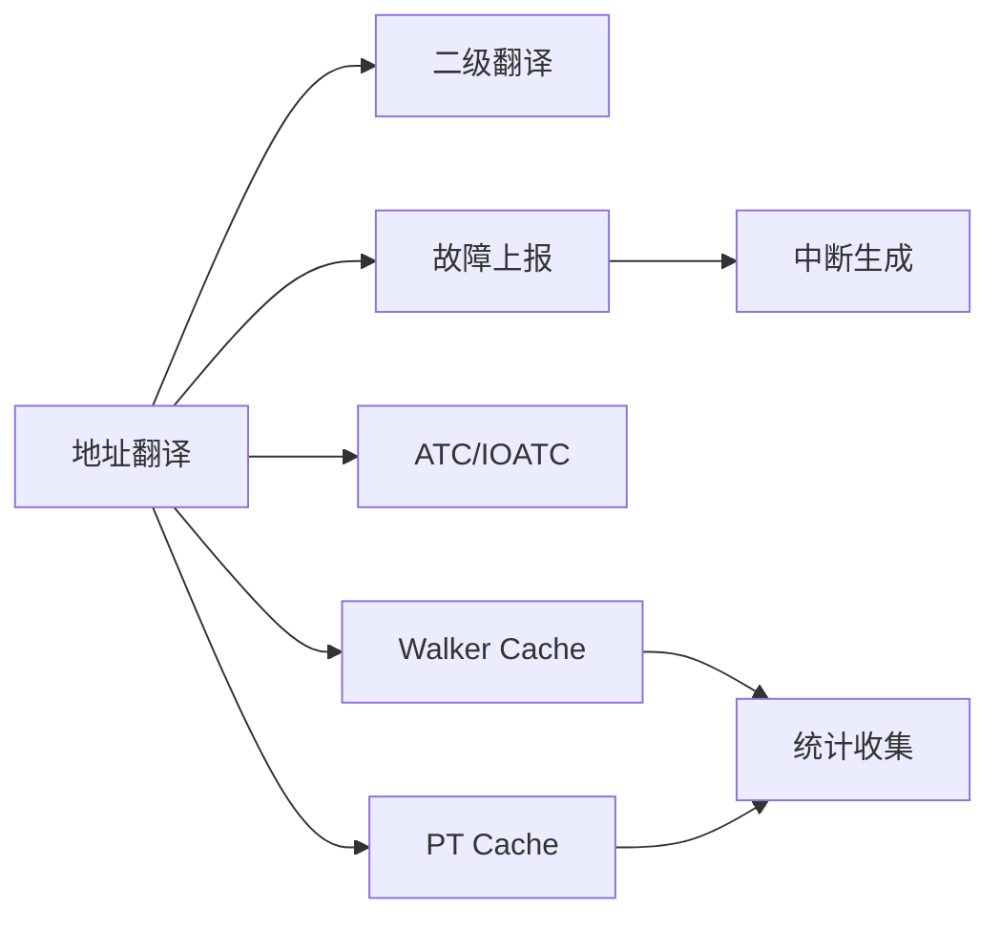

# 故障诊断与定位

<cite>
**本文引用的文件**
- [iommu_fault.hh](file://iommu/include/iommu_fault.hh)
- [iommu_faults.cc](file://iommu/iommu_fun_model/iommu_faults.cc)
- [iommu_interrupt.hh](file://iommu/include/iommu_interrupt.hh)
- [iommu_interrupt.cc](file://iommu/iommu_fun_model/iommu_interrupt.cc)
- [iommu_translate.cc](file://iommu/iommu_fun_model/iommu_translate.cc)
- [iommu_second_stage_trans.cc](file://iommu/iommu_fun_model/iommu_second_stage_trans.cc)
- [stats_collector.h](file://iommu/cache_src/common/stats_collector.h)
- [GDB_DEBUG_GUIDE.md](file://GDB_DEBUG_GUIDE.md)
- [CACHE_PERFORMANCE_ANALYSIS_500REQ.md](file://CACHE_PERFORMANCE_ANALYSIS_500REQ.md)
- [C3_MISS_ROOT_CAUSE_ANALYSIS.md](file://C3_MISS_ROOT_CAUSE_ANALYSIS.md)
- [PT_CACHE_DEEP_ANALYSIS_3QUESTIONS_20260609.md](file://PT_CACHE_DEEP_ANALYSIS_3QUESTIONS_20260609.md)
- [README.md](file://README.md)
</cite>

## 目录
1. [简介](#简介)
2. [项目结构](#项目结构)
3. [核心组件](#核心组件)
4. [架构总览](#架构总览)
5. [详细组件分析](#详细组件分析)
6. [依赖关系分析](#依赖关系分析)
7. [性能考量](#性能考量)
8. [故障排查指南](#故障排查指南)
9. [结论](#结论)
10. [附录](#附录)

## 简介
本指导文档面向IOMMU故障诊断与定位，聚焦于三类典型问题：地址翻译错误、缓存失效与性能退化。文档系统阐述故障报告机制与故障码含义，给出可操作的排查流程与最佳实践，并结合仓库中的分析报告与调试指南，提供可复现的根因分析方法与解决方案。读者可据此快速定位问题、验证修复并持续优化系统稳定性与吞吐。

## 项目结构
IOMMU模型采用模块化设计，核心位于iommu目录，包含地址翻译、故障与中断、缓存与统计、性能建模等子系统；测试与分析报告位于根目录，辅助定位与验证。

**图表来源**
- [iommu_translate.cc](file://iommu/iommu_fun_model/iommu_translate.cc)
- [iommu_second_stage_trans.cc](file://iommu/iommu_fun_model/iommu_second_stage_trans.cc)
- [iommu_faults.cc](file://iommu/iommu_fun_model/iommu_faults.cc)
- [iommu_interrupt.cc](file://iommu/iommu_fun_model/iommu_interrupt.cc)
- [stats_collector.h](file://iommu/cache_src/common/stats_collector.h)
- [CACHE_PERFORMANCE_ANALYSIS_500REQ.md](file://CACHE_PERFORMANCE_ANALYSIS_500REQ.md)
- [C3_MISS_ROOT_CAUSE_ANALYSIS.md](file://C3_MISS_ROOT_CAUSE_ANALYSIS.md)
- [PT_CACHE_DEEP_ANALYSIS_3QUESTIONS_20260609.md](file://PT_CACHE_DEEP_ANALYSIS_3QUESTIONS_20260609.md)
- [GDB_DEBUG_GUIDE.md](file://GDB_DEBUG_GUIDE.md)

**章节来源**
- [README.md:63-76](file://README.md#L63-L76)

## 核心组件
- 故障上报与队列：负责将故障记录写入内存队列并通过中断通知软件，支持DTF屏蔽与溢出/内存访问故障标志。
- 中断机制：统一挂起位与向量映射，支持MSI与掩码控制，保障故障事件及时送达。
- 地址翻译：两阶段地址翻译（VS/G-stage），支持ATS、MRIF、PBMT等特性，贯穿IOATC/PT Cache/Walker Cache。
- 缓存与统计：多级缓存（IOATC、Walker、PT Cache）与统计收集器，提供命中率、延迟、驱逐等指标。
- 性能建模与分析：基于测试报告的性能洞察，定位缓存污染、批量更新失败等关键问题。

**章节来源**
- [iommu_fault.hh:52-88](file://iommu/include/iommu_fault.hh#L52-L88)
- [iommu_faults.cc:8-159](file://iommu/iommu_fun_model/iommu_faults.cc#L8-L159)
- [iommu_interrupt.hh:16-25](file://iommu/include/iommu_interrupt.hh#L16-L25)
- [iommu_interrupt.cc:27-121](file://iommu/iommu_fun_model/iommu_interrupt.cc#L27-L121)
- [iommu_translate.cc:8-732](file://iommu/iommu_fun_model/iommu_translate.cc#L8-L732)
- [stats_collector.h:13-196](file://iommu/cache_src/common/stats_collector.h#L13-L196)

## 架构总览
IOMMU故障诊断涉及“翻译—缓存—上报—中断”闭环：地址翻译失败触发故障码与记录，缓存命中/缺失影响性能，故障队列与中断驱动软件处理，统计收集器提供量化依据。

**图表来源**
- [iommu_translate.cc:376-439](file://iommu/iommu_fun_model/iommu_translate.cc#L376-L439)
- [iommu_second_stage_trans.cc:1-424](file://iommu/iommu_fun_model/iommu_second_stage_trans.cc#L1-L424)
- [iommu_faults.cc:8-159](file://iommu/iommu_fun_model/iommu_faults.cc#L8-L159)
- [iommu_interrupt.cc:27-121](file://iommu/iommu_fun_model/iommu_interrupt.cc#L27-L121)

## 详细组件分析

### 故障上报与故障码
- 故障记录字段包含CAUSE、PID、PV、PRIV、TTYP、DID、iotval/iotval2等，支持区分事务类型与特权级别。
- 故障队列启用/溢出/内存访问故障标志控制记录写入与中断生成。
- DTF位可屏蔽翻译过程中的故障上报，但不影响错误响应与非翻译类故障。
- 常见故障码涵盖访问/页面/数据损坏、ATS/MRIF/PDT/MSI相关错误、内部数据路径错误等。

**图表来源**
- [iommu_faults.cc:23-159](file://iommu/iommu_fun_model/iommu_faults.cc#L23-L159)
- [iommu_fault.hh:52-88](file://iommu/include/iommu_fault.hh#L52-L88)

**章节来源**
- [iommu_fault.hh:52-88](file://iommu/include/iommu_fault.hh#L52-L88)
- [iommu_faults.cc:8-159](file://iommu/iommu_fun_model/iommu_faults.cc#L8-L159)

### 中断与事件通知
- IPSR挂起位与ICVEC向量映射决定中断源与向量。
- MSI路径支持掩码控制与挂起重放，确保中断可靠投递。
- 故障队列、命令队列、HPM、页面队列分别对应不同中断源。

**图表来源**
- [iommu_interrupt.cc:27-121](file://iommu/iommu_fun_model/iommu_interrupt.cc#L27-L121)
- [iommu_interrupt.hh:16-25](file://iommu/include/iommu_interrupt.hh#L16-L25)

**章节来源**
- [iommu_interrupt.hh:16-25](file://iommu/include/iommu_interrupt.hh#L16-L25)
- [iommu_interrupt.cc:27-121](file://iommu/iommu_fun_model/iommu_interrupt.cc#L27-L121)

### 地址翻译与故障分类
- 事务类型TTYP区分未翻译/已翻译读/写/执行、ATS请求等，用于故障记录与响应差异。
- 两阶段地址翻译在G-stage校验PTE合法性、权限与NAPOT编码，出现访问/页面/数据损坏即返回相应故障码。
- ATS翻译请求成功时通常不产生故障记录，仅在特定永久性错误时返回UR/CA。

**图表来源**
- [iommu_translate.cc:94-142](file://iommu/iommu_fun_model/iommu_translate.cc#L94-L142)
- [iommu_second_stage_trans.cc:139-255](file://iommu/iommu_fun_model/iommu_second_stage_trans.cc#L139-L255)

**章节来源**
- [iommu_translate.cc:94-142](file://iommu/iommu_fun_model/iommu_translate.cc#L94-L142)
- [iommu_second_stage_trans.cc:139-255](file://iommu/iommu_fun_model/iommu_second_stage_trans.cc#L139-L255)

### 缓存与性能统计
- 统计收集器提供命中/缺失/驱逐/失效、预取命中率、执行/排队/请求延迟、区间命中率等指标。
- Walker Cache在Sv39场景下对根页表基址进行缓存，显著降低PTW开销。
- PT Cache在空间扫描场景命中率低属预期，实际工作负载中命中率随时间局部性提升。

**图表来源**
- [stats_collector.h:107-196](file://iommu/cache_src/common/stats_collector.h#L107-L196)

**章节来源**
- [stats_collector.h:13-196](file://iommu/cache_src/common/stats_collector.h#L13-L196)
- [CACHE_PERFORMANCE_ANALYSIS_500REQ.md:13-178](file://CACHE_PERFORMANCE_ANALYSIS_500REQ.md#L13-L178)

## 依赖关系分析
- 地址翻译依赖设备/进程上下文、页表模式与权限，二级翻译严格校验PTE与权限。
- 故障上报依赖寄存器状态（FQON/FQEN/FQMF/FQOF）与内存访问一致性。
- 中断生成依赖向量映射与MSI配置，受掩码与挂起状态影响。
- 缓存命中/缺失直接影响翻译延迟与PTW触发频率，统计收集器提供量化反馈。

**图表来源**
- [iommu_translate.cc:376-439](file://iommu/iommu_fun_model/iommu_translate.cc#L376-L439)
- [iommu_faults.cc:126-156](file://iommu/iommu_fun_model/iommu_faults.cc#L126-L156)
- [iommu_interrupt.cc:27-121](file://iommu/iommu_fun_model/iommu_interrupt.cc#L27-L121)
- [stats_collector.h:107-196](file://iommu/cache_src/common/stats_collector.h#L107-L196)

**章节来源**
- [iommu_translate.cc:376-439](file://iommu/iommu_fun_model/iommu_translate.cc#L376-L439)
- [iommu_faults.cc:126-156](file://iommu/iommu_fun_model/iommu_faults.cc#L126-L156)
- [iommu_interrupt.cc:27-121](file://iommu/iommu_fun_model/iommu_interrupt.cc#L27-L121)
- [stats_collector.h:107-196](file://iommu/cache_src/common/stats_collector.h#L107-L196)

## 性能考量
- 缓存延时占比小，PTW DDR读取为主要瓶颈；Walker Cache命中率高，PT Cache在空间扫描场景命中率低属预期。
- 批量更新失败多由占位CL保护导致，需检查替换策略与tag一致性。
- 预取与大页可降低PTW层级，提升整体吞吐。

**章节来源**
- [CACHE_PERFORMANCE_ANALYSIS_500REQ.md:145-178](file://CACHE_PERFORMANCE_ANALYSIS_500REQ.md#L145-L178)
- [PT_CACHE_DEEP_ANALYSIS_3QUESTIONS_20260609.md:344-462](file://PT_CACHE_DEEP_ANALYSIS_3QUESTIONS_20260609.md#L344-L462)

## 故障排查指南

### 一、地址翻译错误
- 现象：ATS请求UR/CA、普通请求失败、权限不足返回。
- 诊断步骤：
  1) 检查事务类型TTYP与特权位PRIV，确认是否触发“事务类型不允许”。
  2) 校验设备/进程上下文定位是否成功，关注DDI宽度与模式匹配。
  3) 二级翻译阶段检查PTE合法性、权限位与NAPOT编码，定位GST_*故障。
  4) 若为MRIF/MSI路径，确认MSI地址模式与PDT/MSI PTE配置。
- 工具与日志：
  - 使用GDB在翻译入口与两阶段翻译函数断点，观察iotval/iotval2与cause。
  - 对照故障码表，定位具体阶段与原因。

**章节来源**
- [iommu_translate.cc:628-731](file://iommu/iommu_fun_model/iommu_translate.cc#L628-L731)
- [iommu_second_stage_trans.cc:139-255](file://iommu/iommu_fun_model/iommu_second_stage_trans.cc#L139-L255)
- [GDB_DEBUG_GUIDE.md:69-121](file://GDB_DEBUG_GUIDE.md#L69-L121)

### 二、缓存失效
- 现象：Walker/PT Cache命中率异常、批量更新跳过、缓存污染。
- 诊断步骤：
  1) 核对Walker Cache更新有效性检查，避免无效条目污染。
  2) 检查PT Cache占位CL保护机制，批量更新时允许覆盖或先降级占位。
  3) 分析Hash映射与Set冲突，必要时调整替换策略或容量。
- 工具与日志：
  - 关注“Set full, no safe victim found!”与“SKIP UPDATE(valid=0)”等关键日志。
  - 对比批更新前后tag与Set映射，定位替换冲突。

**章节来源**
- [CACHE_PERFORMANCE_ANALYSIS_500REQ.md:131-142](file://CACHE_PERFORMANCE_ANALYSIS_500REQ.md#L131-L142)
- [PT_CACHE_DEEP_ANALYSIS_3QUESTIONS_20260609.md:234-341](file://PT_CACHE_DEEP_ANALYSIS_3QUESTIONS_20260609.md#L234-L341)
- [PT_CACHE_DEEP_ANALYSIS_3QUESTIONS_20260609.md:463-650](file://PT_CACHE_DEEP_ANALYSIS_3QUESTIONS_20260609.md#L463-L650)

### 三、性能问题
- 现象：翻译延迟高、PTW频繁、队列排队。
- 诊断步骤：
  1) 使用统计收集器查看执行/排队/请求延迟与IOPS，定位瓶颈。
  2) 评估Walker/PT Cache命中率与驱逐次数，判断容量与替换策略。
  3) 结合测试报告，验证预取与大页策略对PTW层级的影响。
- 工具与日志：
  - 通过报告输出与直方图分析，识别异常延迟分布。
  - 对比修复前后WALK FAULT与命中率变化。

**章节来源**
- [stats_collector.h:107-196](file://iommu/cache_src/common/stats_collector.h#L107-L196)
- [CACHE_PERFORMANCE_ANALYSIS_500REQ.md:145-178](file://CACHE_PERFORMANCE_ANALYSIS_500REQ.md#L145-L178)
- [C3_MISS_ROOT_CAUSE_ANALYSIS.md:136-201](file://C3_MISS_ROOT_CAUSE_ANALYSIS.md#L136-L201)

### 四、故障报告机制与故障码
- 故障记录字段与队列写入、溢出/内存访问故障处理、DTF屏蔽规则。
- 常见故障码与触发条件：
  - 访问/页面/数据损坏：内存访问违规或PTE损坏。
  - ATS/MRIF/PDT/MSI相关：配置错误或未生效。
  - 内部数据路径错误：实现内部一致性问题。
- 处理建议：
  - 优先检查FQCSR状态与队列容量，避免溢出。
  - 结合中断与MSI路径，确认软件侧事件处理链路。

**章节来源**
- [iommu_fault.hh:52-88](file://iommu/include/iommu_fault.hh#L52-L88)
- [iommu_faults.cc:23-159](file://iommu/iommu_fun_model/iommu_faults.cc#L23-L159)
- [iommu_translate.cc:628-731](file://iommu/iommu_fun_model/iommu_translate.cc#L628-L731)

### 五、调试工具与根因分析
- GDB调试要点：在翻译入口、上下文定位、IOATC/PT Cache/Walker相关函数设置断点；打印寄存器与关键状态。
- 常见问题：符号不可用、断点未命中、调试模式性能下降。
- 高级技巧：条件断点、命令断点、跟踪点，结合日志进行关联分析。

**章节来源**
- [GDB_DEBUG_GUIDE.md:36-206](file://GDB_DEBUG_GUIDE.md#L36-L206)

## 结论
通过“翻译—缓存—上报—中断—统计”的闭环，IOMMU能够有效识别与定位地址翻译错误、缓存失效与性能退化问题。结合仓库中的分析报告与调试指南，可形成从现象到根因的系统化排查流程，并以统计指标与日志为依据验证修复效果。建议在实际部署中持续监控缓存命中率、批量更新成功率与中断处理时延，以维持稳定与高性能。

## 附录

### 典型故障案例与解决方案
- Walker Cache缓存污染：修复UPDATE时无效条目检查，消除WALK FAULT。
- C3未命中根因：非跨1GB边界，而是VPN[1]变化导致；通过预取优化降低miss。
- PT Cache批量更新跳过：占位CL保护导致victim选择失败；需放宽覆盖策略或增强调试日志。

**章节来源**
- [CACHE_PERFORMANCE_ANALYSIS_500REQ.md:210-292](file://CACHE_PERFORMANCE_ANALYSIS_500REQ.md#L210-L292)
- [C3_MISS_ROOT_CAUSE_ANALYSIS.md:136-201](file://C3_MISS_ROOT_CAUSE_ANALYSIS.md#L136-L201)
- [PT_CACHE_DEEP_ANALYSIS_3QUESTIONS_20260609.md:344-462](file://PT_CACHE_DEEP_ANALYSIS_3QUESTIONS_20260609.md#L344-L462)