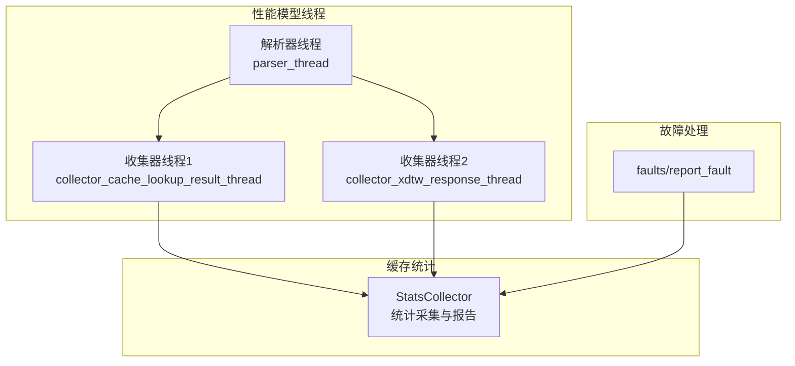
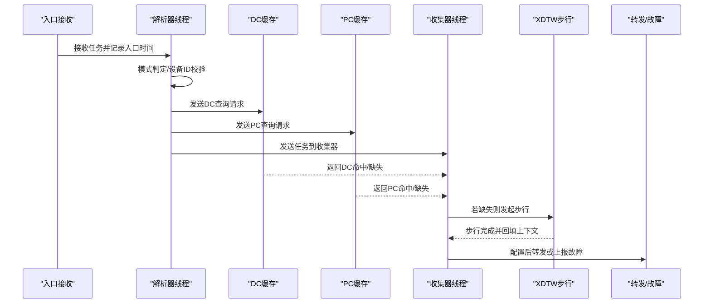
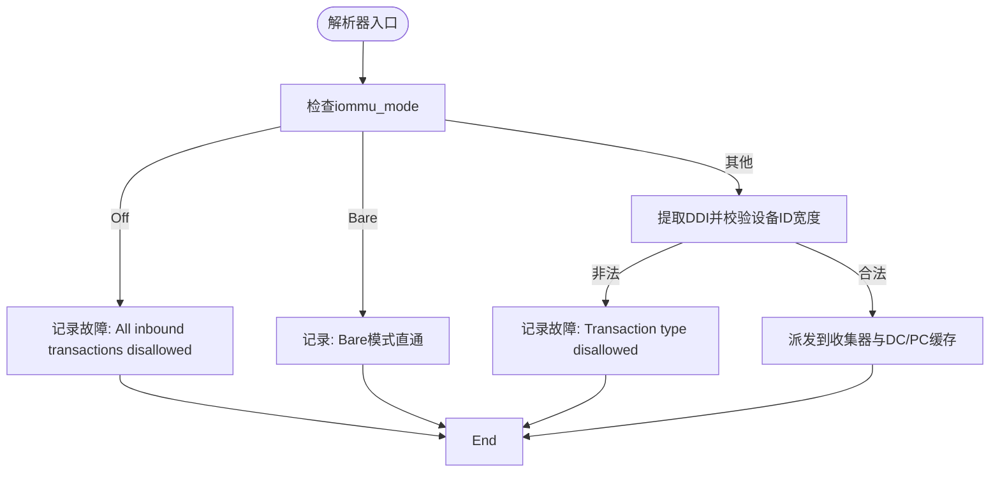
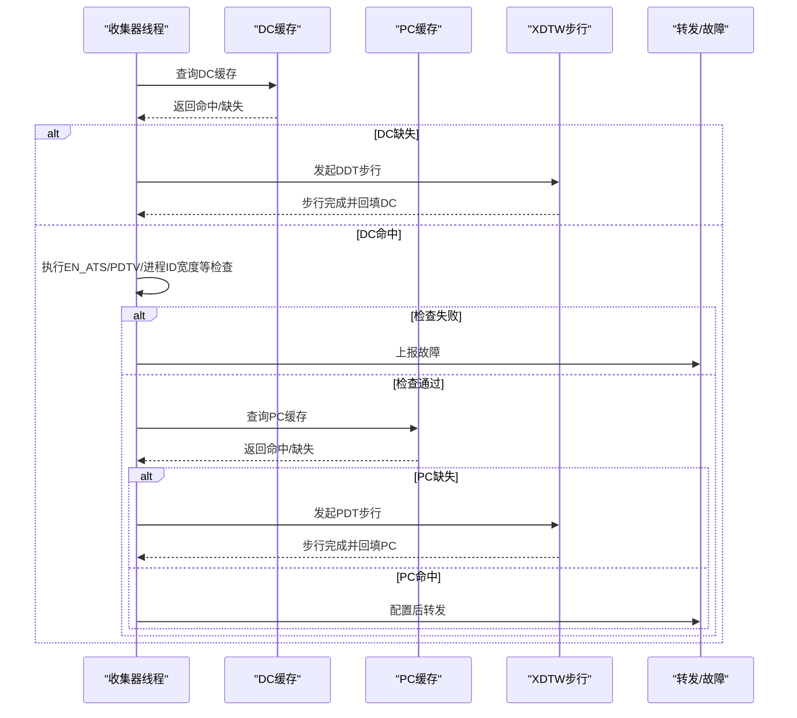
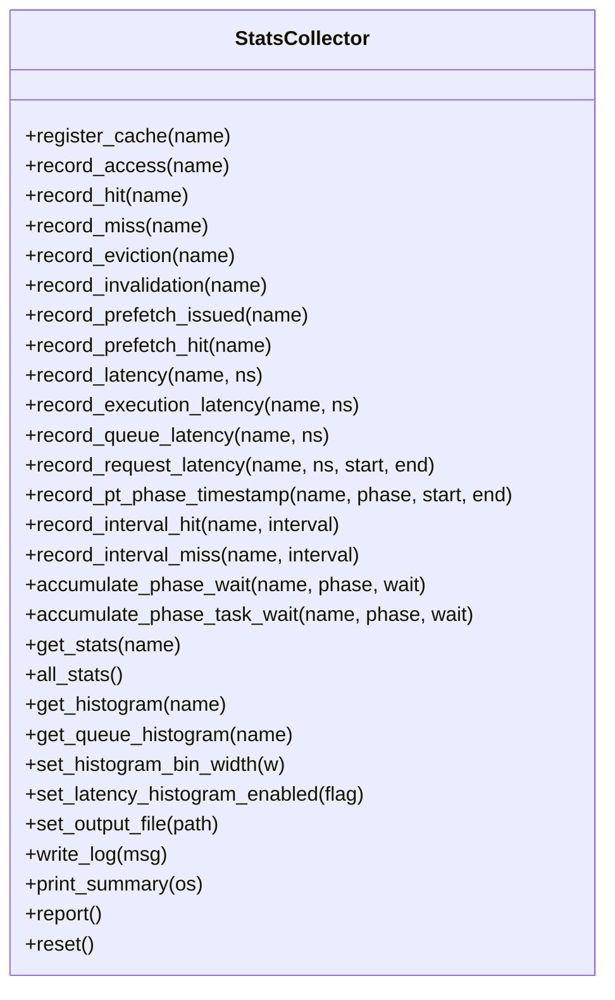
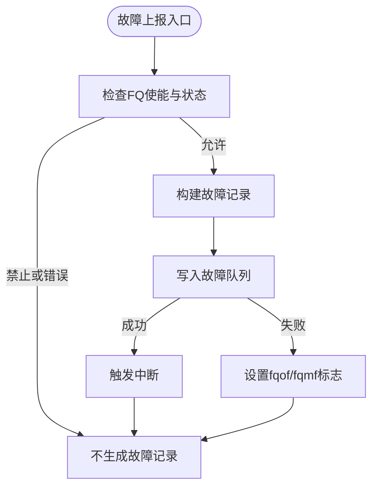
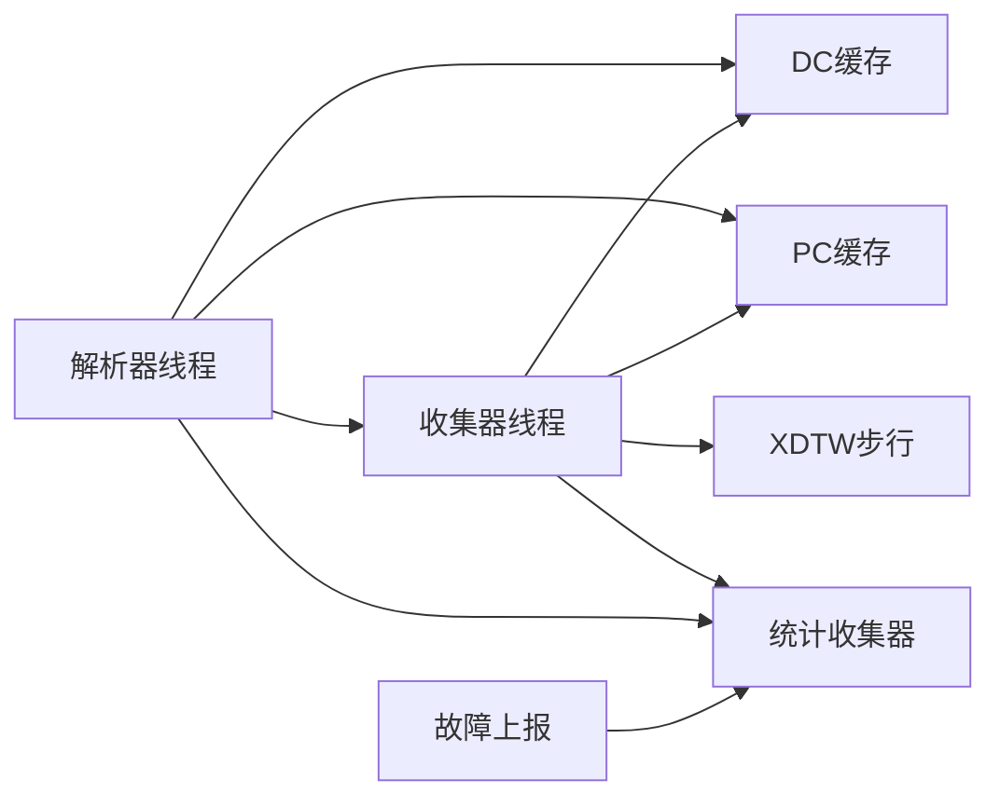

# 日志系统与分析

<cite>
**本文引用的文件**
- [iommu_perf_collector.cc](file://iommu/iommu_perf_model/iommu_perf_collector.cc)
- [iommu_perf_parser.cc](file://iommu/iommu_perf_model/iommu_perf_parser.cc)
- [stats_collector.h](file://iommu/cache_src/common/stats_collector.h)
- [stats_collector.cpp](file://iommu/cache_src/common/stats_collector.cpp)
- [iommu_faults.cc](file://iommu/iommu_fun_model/iommu_faults.cc)
- [iommu_fault.hh](file://iommu/include/iommu_fault.hh)
- [iommu_top.cc](file://iommu/iommu_top.cc)
- [README.md](file://README.md)
- [CACHE_PERFORMANCE_ANALYSIS_500REQ.md](file://CACHE_PERFORMANCE_ANALYSIS_500REQ.md)
- [PT_CACHE_ACCESS_ANALYSIS_50TASKS_20260609.md](file://PT_CACHE_ACCESS_ANALYSIS_50TASKS_20260609.md)
- [C3_MISS_ROOT_CAUSE_ANALYSIS.md](file://C3_MISS_ROOT_CAUSE_ANALYSIS.md)
</cite>

## 目录
1. [简介](#简介)
2. [项目结构](#项目结构)
3. [核心组件](#核心组件)
4. [架构总览](#架构总览)
5. [详细组件分析](#详细组件分析)
6. [依赖关系分析](#依赖关系分析)
7. [性能考量](#性能考量)
8. [故障排查指南](#故障排查指南)
9. [结论](#结论)
10. [附录](#附录)

## 简介
本文件面向IOMMU日志系统与分析，目标是帮助读者快速掌握日志配置、使用方法、性能统计日志的含义与分析方法、故障日志的解读与定位技巧，以及日志过滤与搜索的实用方法。文档结合代码与分析报告，给出从日志中提取关键信息进行问题诊断的操作步骤与最佳实践。

## 项目结构
IOMMU日志系统主要分布在以下模块：
- 性能模型线程日志：解析器线程、收集器线程、XDTW响应线程等，负责记录任务状态流转与关键决策点。
- 缓存统计收集器：统一采集各类缓存的访问、命中、缺失、替换、预取、延迟等统计，并可输出汇总报告。
- 故障上报：将故障记录写入内存队列并触发中断，便于外部分析。
- 分析报告：以Markdown形式呈现的性能与缓存分析，辅助理解日志指标与定位问题。

图表来源
- [iommu_perf_parser.cc:9-122](file://iommu/iommu_perf_model/iommu_perf_parser.cc#L9-L122)
- [iommu_perf_collector.cc:14-275](file://iommu/iommu_perf_model/iommu_perf_collector.cc#L14-L275)
- [stats_collector.h:107-191](file://iommu/cache_src/common/stats_collector.h#L107-L191)
- [stats_collector.cpp:1-640](file://iommu/cache_src/common/stats_collector.cpp#L1-L640)
- [iommu_faults.cc:1-160](file://iommu/iommu_fun_model/iommu_faults.cc#L1-L160)

章节来源
- [README.md:63-76](file://README.md#L63-L76)

## 核心组件
- 解析器线程日志：记录任务进入、模式判定、设备ID宽度校验、派发到缓存查询与收集器等关键步骤。
- 收集器线程日志：记录DC/PC缓存命中/缺失、路由到XDTW步行、步行完成后的配置与转发、故障判定等。
- 缓存统计收集器：提供统一的统计接口与报告输出，包含命中率、预取准确率、执行/排队/请求平均延迟、IOPS、区间命中率等。
- 故障上报：记录故障队列状态、溢出/内存访问错误、中断触发等。

章节来源
- [iommu_perf_parser.cc:9-122](file://iommu/iommu_perf_model/iommu_perf_parser.cc#L9-L122)
- [iommu_perf_collector.cc:14-457](file://iommu/iommu_perf_model/iommu_perf_collector.cc#L14-L457)
- [stats_collector.h:107-191](file://iommu/cache_src/common/stats_collector.h#L107-L191)
- [stats_collector.cpp:227-538](file://iommu/cache_src/common/stats_collector.cpp#L227-L538)
- [iommu_faults.cc:1-160](file://iommu/iommu_fun_model/iommu_faults.cc#L1-L160)

## 架构总览
IOMMU日志系统围绕“任务生命周期”展开：从入口接收、解析、缓存查询、步行、转发/故障，再到统计与报告。解析器负责任务初始化与模式判断；收集器负责缓存结果聚合与状态机推进；统计收集器贯穿各环节，提供统一的观测面。

图表来源
- [iommu_perf_parser.cc:9-122](file://iommu/iommu_perf_model/iommu_perf_parser.cc#L9-L122)
- [iommu_perf_collector.cc:14-275](file://iommu/iommu_perf_model/iommu_perf_collector.cc#L14-L275)

## 详细组件分析

### 组件A：解析器线程日志
- 关键输出点：任务进入、模式判定（Off/Bare）、设备ID宽度校验、派发到收集器与缓存请求。
- 日志字段示例：task_id、device_id、iova、TTYP、状态转移。
- 分析要点：通过解析器日志可确认任务是否被正确识别为Bare模式、Off模式、或需要步行；若出现频繁Off/Bare分支，需检查寄存器配置与输入参数。

图表来源
- [iommu_perf_parser.cc:9-122](file://iommu/iommu_perf_model/iommu_perf_parser.cc#L9-L122)

章节来源
- [iommu_perf_parser.cc:9-122](file://iommu/iommu_perf_model/iommu_perf_parser.cc#L9-L122)

### 组件B：收集器线程日志
- 关键输出点：DC/PC缓存命中/缺失、步行发起与完成、步行后配置、转发或故障。
- 日志字段示例：task_id、device_id、pid、walk类型（DDT/PDT）、状态（DC/PC HIT/MISS）、故障原因码。
- 分析要点：收集器日志是定位步行瓶颈与配置错误的核心。例如EN_ATS/PDTV/ENS等条件触发的故障，可据此回溯解析器与步行结果。

图表来源
- [iommu_perf_collector.cc:14-457](file://iommu/iommu_perf_model/iommu_perf_collector.cc#L14-L457)

章节来源
- [iommu_perf_collector.cc:14-457](file://iommu/iommu_perf_model/iommu_perf_collector.cc#L14-L457)

### 组件C：缓存统计收集器
- 统计维度：总访问、命中、缺失、驱逐、失效、预取发出/命中、执行/排队/请求平均延迟、IOPS、区间命中率、PT Cache阶段时间戳与任务放大系数等。
- 报告能力：打印汇总、直方图、阶段窗口统计、任务生命周期分解（FIFO等待/执行/总生命周期）。
- 使用方式：在顶层模块中注册并调用，最终输出到文件。

图表来源
- [stats_collector.h:107-191](file://iommu/cache_src/common/stats_collector.h#L107-L191)

章节来源
- [stats_collector.h:107-191](file://iommu/cache_src/common/stats_collector.h#L107-L191)
- [stats_collector.cpp:1-640](file://iommu/cache_src/common/stats_collector.cpp#L1-L640)
- [iommu_top.cc:561-561](file://iommu/iommu_top.cc#L561-L561)

### 组件D：故障上报与日志
- 故障记录字段：CAUSE、PID、PV、PRIV、TTYP、DID、iotval、iotval2。
- 故障队列状态：队列满（fqof）、队列内存访问错误（fqmf）、中断触发（fip）。
- 分析要点：结合故障记录与解析器/收集器日志，可定位故障类型（如EN_ATS=0、PDTV=0、ENS=0、进程ID越界等）。

图表来源
- [iommu_faults.cc:1-160](file://iommu/iommu_fun_model/iommu_faults.cc#L1-L160)
- [iommu_fault.hh:63-77](file://iommu/include/iommu_fault.hh#L63-L77)

章节来源
- [iommu_faults.cc:1-160](file://iommu/iommu_fun_model/iommu_faults.cc#L1-L160)
- [iommu_fault.hh:63-77](file://iommu/include/iommu_fault.hh#L63-L77)

## 依赖关系分析
- 解析器线程依赖顶层模块的入口FIFO与寄存器状态；收集器线程依赖解析器与缓存子系统；统计收集器贯穿各模块，形成统一观测面。
- 故障上报依赖寄存器配置与内存队列，受FQ控制位影响。

图表来源
- [iommu_perf_parser.cc:9-122](file://iommu/iommu_perf_model/iommu_perf_parser.cc#L9-L122)
- [iommu_perf_collector.cc:14-457](file://iommu/iommu_perf_model/iommu_perf_collector.cc#L14-L457)
- [stats_collector.cpp:1-640](file://iommu/cache_src/common/stats_collector.cpp#L1-L640)
- [iommu_faults.cc:1-160](file://iommu/iommu_fun_model/iommu_faults.cc#L1-L160)

章节来源
- [iommu_perf_parser.cc:9-122](file://iommu/iommu_perf_model/iommu_perf_parser.cc#L9-L122)
- [iommu_perf_collector.cc:14-457](file://iommu/iommu_perf_model/iommu_perf_collector.cc#L14-L457)
- [stats_collector.cpp:1-640](file://iommu/cache_src/common/stats_collector.cpp#L1-L640)
- [iommu_faults.cc:1-160](file://iommu/iommu_fun_model/iommu_faults.cc#L1-L160)

## 性能考量
- 统计指标解读：
  - 命中率：总访问/命中，反映缓存有效性。
  - 预取准确率：预取命中/预取发出，衡量预取策略收益。
  - 平均延迟：执行/排队/请求平均延迟，区分排队与执行瓶颈。
  - IOPS：以执行时间为基准计算，避免排队时间高估。
  - 区间命中率：按请求区间统计命中率，观察稳定性。
- 实战建议：
  - 使用统计收集器的报告输出，结合分析报告中的指标，定位瓶颈模块。
  - 关注Walker Cache与PT Cache的命中率差异，评估缓存策略有效性。

章节来源
- [stats_collector.cpp:227-538](file://iommu/cache_src/common/stats_collector.cpp#L227-L538)
- [CACHE_PERFORMANCE_ANALYSIS_500REQ.md:1-305](file://CACHE_PERFORMANCE_ANALYSIS_500REQ.md#L1-L305)
- [PT_CACHE_ACCESS_ANALYSIS_50TASKS_202609.md:278-376](file://PT_CACHE_ACCESS_ANALYSIS_50TASKS_20260609.md#L278-L376)

## 故障排查指南
- 快速定位步骤：
  1) 在解析器日志中确认任务是否进入Off/Bare模式，或设备ID宽度是否非法。
  2) 在收集器日志中查看DC/PC命中/缺失与步行发起情况，关注EN_ATS/PDTV/ENS/进程ID宽度等检查项。
  3) 若出现故障，核对故障记录字段（CAUSE、TTYP、DID、PID、iotval等）与寄存器状态（FQ控制位）。
- 常见故障类型与定位：
  - EN_ATS=0且为Translated/ATS：检查ATS使能与事务类型。
  - pid_valid=1但PDTV=0：检查进程上下文配置。
  - 进程ID宽度越界：核对PD17/PD8模式与进程ID位宽。
  - ENS=0且特权请求：检查进程上下文ENS与特权位。

章节来源
- [iommu_perf_parser.cc:34-99](file://iommu/iommu_perf_model/iommu_perf_parser.cc#L34-L99)
- [iommu_perf_collector.cc:111-156](file://iommu/iommu_perf_model/iommu_perf_collector.cc#L111-L156)
- [iommu_perf_collector.cc:250-258](file://iommu/iommu_perf_model/iommu_perf_collector.cc#L250-L258)
- [iommu_faults.cc:25-45](file://iommu/iommu_fun_model/iommu_faults.cc#L25-L45)

## 结论
- 日志系统以“任务生命周期”为主线，解析器、收集器、步行与转发/故障形成闭环。
- 统计收集器提供统一观测面，结合分析报告可量化性能与稳定性。
- 故障日志与寄存器状态共同构成定位依据，建议按“模式判定→缓存命中→步行→转发/故障”的路径逐步排查。

## 附录

### 日志配置与使用方法
- 日志级别与输出格式
  - 解析器/收集器线程采用printf/stdout输出，格式包含任务标识、设备ID、状态与关键决策信息。
  - 统计收集器默认输出到文件（默认文件名），可通过接口设置输出文件路径与直方图开关。
- 使用建议
  - 在调试阶段保留stdout输出，便于实时跟踪任务状态。
  - 在性能测试阶段启用统计收集器报告，导出汇总与直方图，结合分析报告进行指标对比。

章节来源
- [iommu_perf_parser.cc:18-20](file://iommu/iommu_perf_model/iommu_perf_parser.cc#L18-L20)
- [iommu_perf_collector.cc:39-40](file://iommu/iommu_perf_model/iommu_perf_collector.cc#L39-L40)
- [stats_collector.cpp:540-570](file://iommu/cache_src/common/stats_collector.cpp#L540-L570)

### 性能统计日志的含义与分析方法
- 指标说明
  - 命中率/缺失率：评估缓存有效性。
  - 预取准确率：评估预取收益。
  - 执行/排队/请求平均延迟：区分排队与执行瓶颈。
  - IOPS：以执行时间计算，避免排队时间干扰。
  - 区间命中率：观察稳定性与退化趋势。
- 分析方法
  - 对比不同场景的命中率与IOPS，定位瓶颈模块。
  - 结合Walker Cache与PT Cache的命中率差异，评估缓存策略有效性。

章节来源
- [stats_collector.cpp:227-538](file://iommu/cache_src/common/stats_collector.cpp#L227-L538)
- [CACHE_PERFORMANCE_ANALYSIS_500REQ.md:13-279](file://CACHE_PERFORMANCE_ANALYSIS_500REQ.md#L13-L279)

### 故障日志的解读与定位技巧
- 字段解读
  - CAUSE：故障原因编码，结合规范映射到具体故障类型。
  - TTYP：事务类型，辅助定位故障场景。
  - DID/PID/PV/PRIV：设备/进程/特权信息，辅助关联故障来源。
  - iotval/iotval2：故障地址信息，辅助定位问题地址。
- 定位技巧
  - 结合解析器与收集器日志，回溯故障发生前的状态与决策。
  - 检查FQ控制位（fqof/fqmf），确认队列状态与中断触发。

章节来源
- [iommu_fault.hh:63-77](file://iommu/include/iommu_fault.hh#L63-L77)
- [iommu_faults.cc:126-157](file://iommu/iommu_fun_model/iommu_faults.cc#L126-L157)

### 日志过滤与搜索的实用方法
- 常用过滤关键词
  - “FAULT”、“EN_ATS=0”、“PDTV=0”、“ENS=0”、“process_id too wide”、“DDT walk DONE”、“PDT walk DONE”
- 搜索建议
  - 使用正则匹配任务ID（task_id=数字）与关键状态（HIT/MISS/FAULT）。
  - 结合时间戳字段（如“[PARSER]”、“[COLLECTOR]”）进行时序对齐。
  - 对Walker Cache/C3 Miss分析，关注“lookup miss”、“update skip”、“cache full”。

章节来源
- [iommu_perf_parser.cc:34-99](file://iommu/iommu_perf_model/iommu_perf_parser.cc#L34-L99)
- [iommu_perf_collector.cc:88-100](file://iommu/iommu_perf_model/iommu_perf_collector.cc#L88-L100)
- [C3_MISS_ROOT_CAUSE_ANALYSIS.md:1-320](file://C3_MISS_ROOT_CAUSE_ANALYSIS.md#L1-L320)

### 从日志中提取关键信息用于问题诊断
- 任务路径追踪
  - 从解析器日志确认任务进入与模式判定。
  - 从收集器日志确认缓存命中/缺失与步行路径。
- 统计指标提取
  - 从统计收集器报告提取命中率、预取准确率、平均延迟、IOPS与区间命中率。
- 故障信息提取
  - 从故障记录字段提取CAUSE、TTYP、DID、PID、iotval等，结合寄存器状态定位原因。

章节来源
- [stats_collector.cpp:227-538](file://iommu/cache_src/common/stats_collector.cpp#L227-L538)
- [iommu_faults.cc:96-157](file://iommu/iommu_fun_model/iommu_faults.cc#L96-L157)