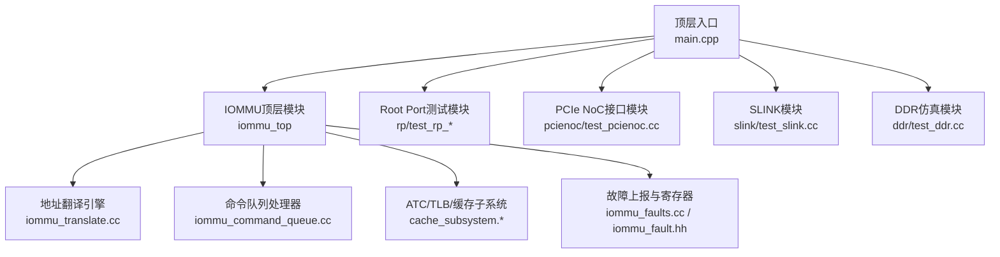
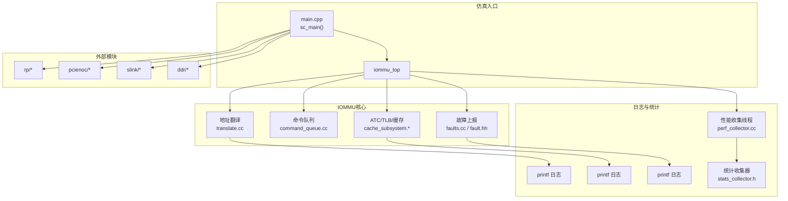
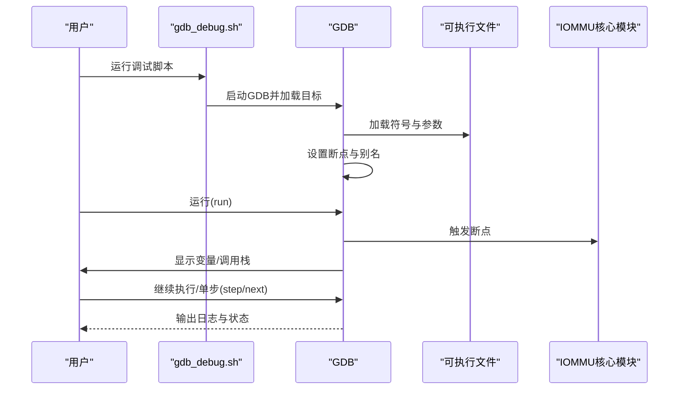
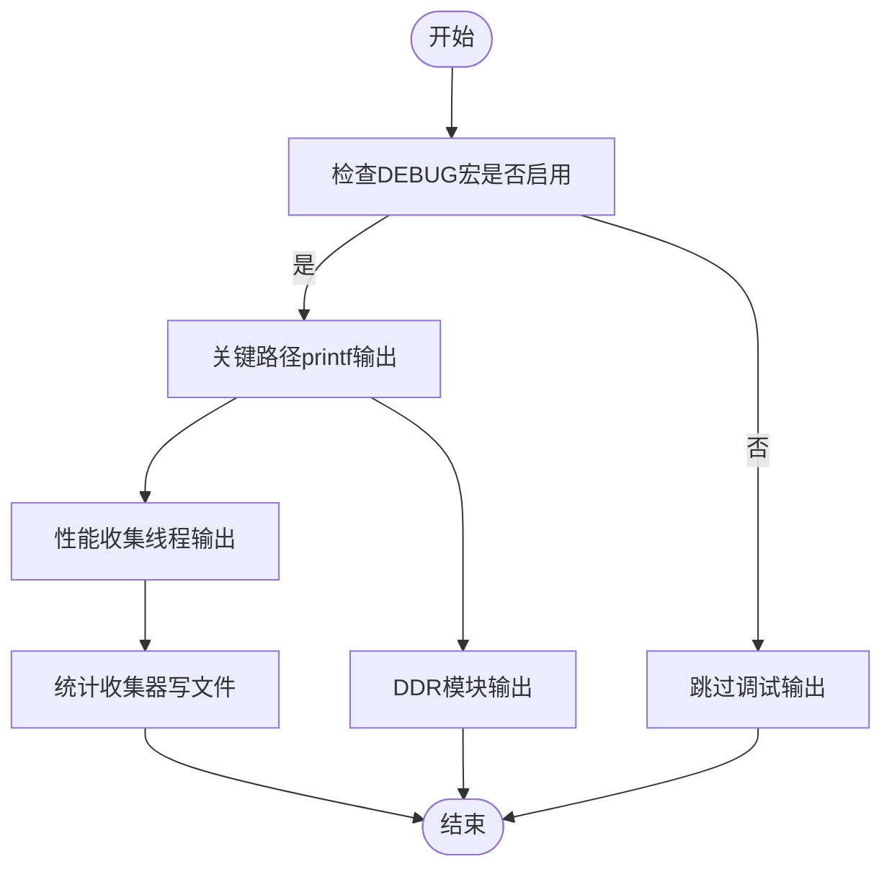
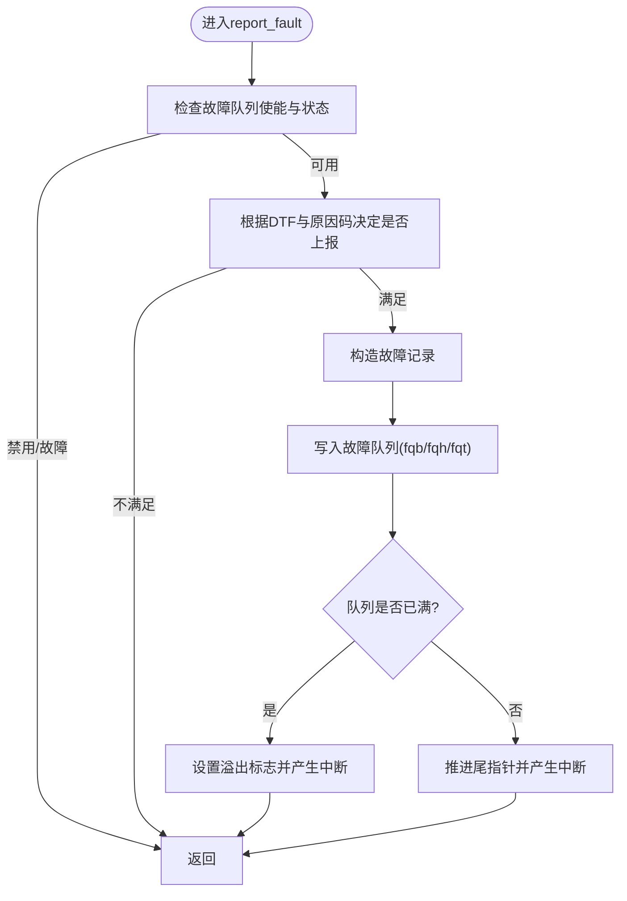
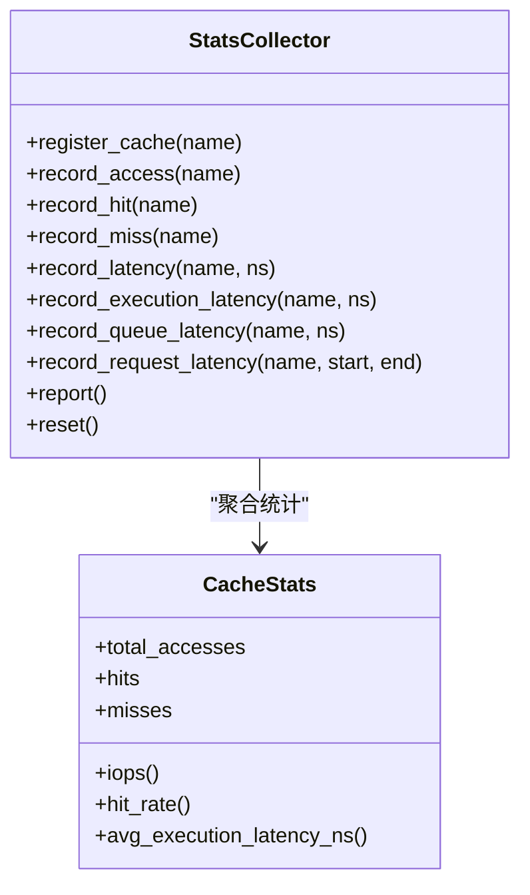
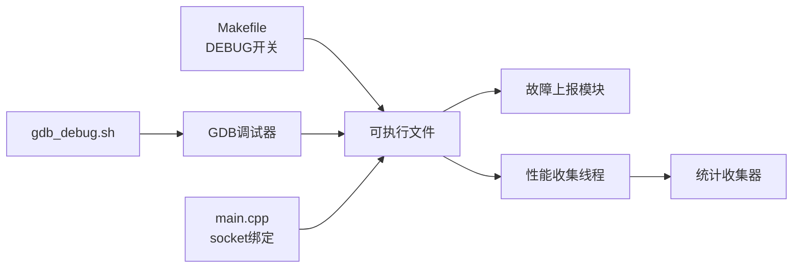

# 调试与故障排除

<cite>
**本文引用的文件**
- [README.md](file://README.md)
- [GDB_DEBUG_GUIDE.md](file://GDB_DEBUG_GUIDE.md)
- [gdb_debug.sh](file://gdb_debug.sh)
- [Makefile](file://Makefile)
- [main.cpp](file://main.cpp)
- [iommu_struct.hh](file://iommu/include/iommu_struct.hh)
- [iommu_fault.hh](file://iommu/include/iommu_fault.hh)
- [iommu_faults.cc](file://iommu/iommu_fun_model/iommu_faults.cc)
- [iommu_perf_collector.cc](file://iommu/iommu_perf_model/iommu_perf_collector.cc)
- [stats_collector.h](file://iommu/cache_src/common/stats_collector.h)
- [test_ddr.cc](file://ddr/test_ddr.cc)
- [iommu_msi_trans.cc](file://iommu/iommu_fun_model/iommu_msi_trans.cc)
</cite>

## 目录
1. [简介](#简介)
2. [项目结构](#项目结构)
3. [核心组件](#核心组件)
4. [架构总览](#架构总览)
5. [详细组件分析](#详细组件分析)
6. [依赖关系分析](#依赖关系分析)
7. [性能考量](#性能考量)
8. [故障排除指南](#故障排除指南)
9. [结论](#结论)
10. [附录](#附录)

## 简介
本文件面向IOMMU调试与故障排除场景，结合仓库中的GDB调试指南、构建脚本与源码中的日志输出，提供从断点设置、变量查看、调用栈分析到日志系统使用、常见故障诊断、性能定位与自动化调试流程的完整实践指南。读者可据此快速定位地址翻译异常、故障上报、缓存命中/缺失、以及性能瓶颈等问题，并形成可复用的调试脚本与最佳实践。

## 项目结构
项目采用SystemC建模，核心IOMMU功能分布在多个子模块中，顶层通过main.cpp进行模块绑定与仿真启动；调试相关资源集中在GDB调试指南、调试脚本与构建配置中。

图表来源
- [main.cpp:39-94](file://main.cpp#L39-L94)
- [Makefile:52-94](file://Makefile#L52-L94)

章节来源
- [README.md:63-92](file://README.md#L63-L92)
- [main.cpp:39-94](file://main.cpp#L39-L94)
- [Makefile:12-36](file://Makefile#L12-L36)

## 核心组件
- 调试构建与运行
  - 默认启用DEBUG模式，包含大量调试宏与符号，便于GDB单步与变量检查。
  - 提供gdb_debug.sh一键启动GDB并加载断点与源码路径。
- 日志与输出
  - 多处printf用于跟踪事务、缓存查询、故障上报等关键路径。
  - 性能收集线程输出DC/PC查找结果、路由决策与阶段状态。
  - 统计收集器支持将缓存统计与直方图输出到文件，辅助性能分析。
- 故障上报
  - 故障记录结构与队列机制，支持DTF屏蔽、溢出与内存访问故障标记。

章节来源
- [Makefile:25-33](file://Makefile#L25-L33)
- [gdb_debug.sh:1-37](file://gdb_debug.sh#L1-L37)
- [iommu_perf_collector.cc:39-200](file://iommu/iommu_perf_model/iommu_perf_collector.cc#L39-L200)
- [stats_collector.h:107-196](file://iommu/cache_src/common/stats_collector.h#L107-L196)
- [iommu_faults.cc:8-160](file://iommu/iommu_fun_model/iommu_faults.cc#L8-L160)

## 架构总览
下图展示调试与日志在系统中的交互位置：顶层main.cpp绑定各模块并启动仿真；IOMMU核心模块在关键路径打印日志；性能收集线程输出统计；故障模块负责故障记录与中断生成。

图表来源
- [main.cpp:39-94](file://main.cpp#L39-L94)
- [iommu_faults.cc:8-160](file://iommu/iommu_fun_model/iommu_faults.cc#L8-L160)
- [iommu_perf_collector.cc:14-200](file://iommu/iommu_perf_model/iommu_perf_collector.cc#L14-L200)
- [stats_collector.h:107-196](file://iommu/cache_src/common/stats_collector.h#L107-L196)

## 详细组件分析

### GDB调试与断点策略
- 编译与准备
  - 使用DEBUG=1编译，确保符号与调试宏开启。
  - 使用gdb_debug.sh一键启动GDB并设置断点与源码路径。
- 关键断点建议
  - 地址翻译入口与两阶段翻译函数。
  - 设备上下文定位与命令队列处理线程。
  - 故障上报函数，便于捕获故障记录写入与中断触发。
- 变量与调用栈
  - 在断点处打印请求参数、寄存器状态与关键数据结构字段。
  - 使用backtrace查看调用链，结合display自动显示关键表达式。

图表来源
- [gdb_debug.sh:22-37](file://gdb_debug.sh#L22-L37)
- [GDB_DEBUG_GUIDE.md:21-68](file://GDB_DEBUG_GUIDE.md#L21-L68)
- [GDB_DEBUG_GUIDE.md:71-102](file://GDB_DEBUG_GUIDE.md#L71-L102)

章节来源
- [Makefile:25-33](file://Makefile#L25-L33)
- [gdb_debug.sh:1-37](file://gdb_debug.sh#L1-L37)
- [GDB_DEBUG_GUIDE.md:21-102](file://GDB_DEBUG_GUIDE.md#L21-L102)

### 日志系统与日志级别
- 日志来源
  - 地址翻译与MSI转换路径包含多处printf，便于观察关键步骤与参数。
  - 性能收集线程输出DC/PC命中、路由决策与阶段状态。
  - DDR模块输出调度与响应时间等信息。
- 日志级别与控制
  - DEBUG宏在编译期开启各类调试输出，可通过修改Makefile或使用DEBUG环境变量切换。
  - 统计收集器支持将报告写入文件，便于离线分析。

图表来源
- [Makefile:25-33](file://Makefile#L25-L33)
- [iommu_msi_trans.cc:26-213](file://iommu/iommu_fun_model/iommu_msi_trans.cc#L26-L213)
- [iommu_perf_collector.cc:39-200](file://iommu/iommu_perf_model/iommu_perf_collector.cc#L39-L200)
- [test_ddr.cc:76-138](file://ddr/test_ddr.cc#L76-L138)
- [stats_collector.h:162-196](file://iommu/cache_src/common/stats_collector.h#L162-L196)

章节来源
- [Makefile:25-33](file://Makefile#L25-L33)
- [iommu_msi_trans.cc:26-213](file://iommu/iommu_fun_model/iommu_msi_trans.cc#L26-L213)
- [iommu_perf_collector.cc:39-200](file://iommu/iommu_perf_model/iommu_perf_collector.cc#L39-L200)
- [test_ddr.cc:76-138](file://ddr/test_ddr.cc#L76-L138)
- [stats_collector.h:162-196](file://iommu/cache_src/common/stats_collector.h#L162-L196)

### 故障上报与诊断
- 故障记录结构与队列
  - 故障记录包含原因码、设备ID、进程ID、事务类型等字段。
  - 队列满/内存访问故障会设置相应标志位并可能触发中断。
- 诊断要点
  - 检查DTF屏蔽位与故障队列使能状态。
  - 关注队列溢出与内存访问故障标志，避免丢失后续故障。
  - 结合日志输出定位具体故障步骤与参数。

图表来源
- [iommu_faults.cc:8-160](file://iommu/iommu_fun_model/iommu_faults.cc#L8-L160)
- [iommu_fault.hh:63-88](file://iommu/include/iommu_fault.hh#L63-L88)

章节来源
- [iommu_faults.cc:8-160](file://iommu/iommu_fun_model/iommu_faults.cc#L8-L160)
- [iommu_fault.hh:63-88](file://iommu/include/iommu_fault.hh#L63-L88)

### 性能分析与定位
- 关键输出点
  - 性能收集线程输出DC/PC命中、路由决策与阶段状态，便于定位瓶颈。
  - 统计收集器提供命中率、IOPS、延迟直方图等指标，支持离线分析。
- 分析步骤
  - 通过日志确认DC/PC命中率与路由路径。
  - 对比执行延迟与排队延迟，识别端口拥塞或互斥等待。
  - 使用统计收集器报告评估整体吞吐与缓存效率。

图表来源
- [stats_collector.h:107-196](file://iommu/cache_src/common/stats_collector.h#L107-L196)

章节来源
- [iommu_perf_collector.cc:39-200](file://iommu/iommu_perf_model/iommu_perf_collector.cc#L39-L200)
- [stats_collector.h:107-196](file://iommu/cache_src/common/stats_collector.h#L107-L196)

## 依赖关系分析
- 构建与调试
  - Makefile通过DEBUG开关控制编译选项与调试宏，影响符号与日志输出。
  - gdb_debug.sh负责GDB启动、断点设置与源码路径配置。
- 运行时绑定
  - main.cpp中将IOMMU与各模块socket绑定，形成完整的数据通路。
- 功能耦合
  - 故障上报依赖寄存器状态与内存访问，受队列容量与内存一致性影响。
  - 性能收集线程与缓存子系统紧密耦合，输出直接影响统计准确性。

图表来源
- [Makefile:25-33](file://Makefile#L25-L33)
- [gdb_debug.sh:22-37](file://gdb_debug.sh#L22-L37)
- [main.cpp:64-80](file://main.cpp#L64-L80)

章节来源
- [Makefile:25-33](file://Makefile#L25-L33)
- [gdb_debug.sh:22-37](file://gdb_debug.sh#L22-L37)
- [main.cpp:64-80](file://main.cpp#L64-L80)

## 性能考量
- 调试模式的影响
  - DEBUG=1关闭优化并启用大量日志，运行速度显著降低，属于预期行为。
- 性能观测点
  - 通过性能收集线程输出与统计收集器报告，关注DC/PC命中率、IOPS、执行/排队延迟。
- 优化建议
  - 在定位问题后切换至DEBUG=0进行性能回归验证。
  - 使用统计收集器的直方图与区间命中率分析，识别热点与异常波动。

章节来源
- [GDB_DEBUG_GUIDE.md:171-173](file://GDB_DEBUG_GUIDE.md#L171-L173)
- [iommu_perf_collector.cc:39-200](file://iommu/iommu_perf_model/iommu_perf_collector.cc#L39-L200)
- [stats_collector.h:94-104](file://iommu/cache_src/common/stats_collector.h#L94-L104)

## 故障排除指南
- 常见问题与对策
  - 符号不可用：确认DEBUG=1且未strip符号；检查源码路径与编译产物。
  - 断点无法命中：核对函数名拼写、确认在DEBUG模式下、确保代码路径被执行。
  - 性能异常：对比执行与排队延迟，排查缓存命中率与端口拥塞。
- 诊断流程
  - 设置关键断点（翻译入口、上下文定位、命令队列、故障上报）。
  - 在断点处打印请求参数、寄存器状态与关键数据结构字段。
  - 结合日志输出与统计报告定位瓶颈与异常路径。
- 自动化调试
  - 使用gdb_debug.sh一键启动GDB并设置常用断点与别名，缩短调试准备时间。

章节来源
- [GDB_DEBUG_GUIDE.md:160-193](file://GDB_DEBUG_GUIDE.md#L160-L193)
- [gdb_debug.sh:22-37](file://gdb_debug.sh#L22-L37)
- [iommu_faults.cc:8-160](file://iommu/iommu_fun_model/iommu_faults.cc#L8-L160)

## 结论
通过DEBUG构建、GDB脚本与日志输出的协同，本项目提供了从地址翻译到故障上报、从缓存命中到性能瓶颈的全链路调试能力。建议在问题定位阶段保持DEBUG=1与详尽日志，在回归验证阶段切换至RELEASE模式评估真实性能，并利用统计收集器报告持续监控关键指标。

## 附录
- 快速参考
  - 编译：使用DEBUG=1；运行：./iommu_model；调试：./gdb_debug.sh。
  - 关键断点：翻译入口、上下文定位、命令队列、故障上报。
  - 关键变量：请求参数、寄存器状态、故障记录字段、缓存统计。
  - 日志位置：翻译与MSI转换路径、性能收集线程、DDR模块。

章节来源
- [README.md:77-86](file://README.md#L77-L86)
- [GDB_DEBUG_GUIDE.md:21-102](file://GDB_DEBUG_GUIDE.md#L21-L102)
- [iommu_msi_trans.cc:26-213](file://iommu/iommu_fun_model/iommu_msi_trans.cc#L26-L213)
- [iommu_perf_collector.cc:39-200](file://iommu/iommu_perf_model/iommu_perf_collector.cc#L39-L200)
- [test_ddr.cc:76-138](file://ddr/test_ddr.cc#L76-L138)