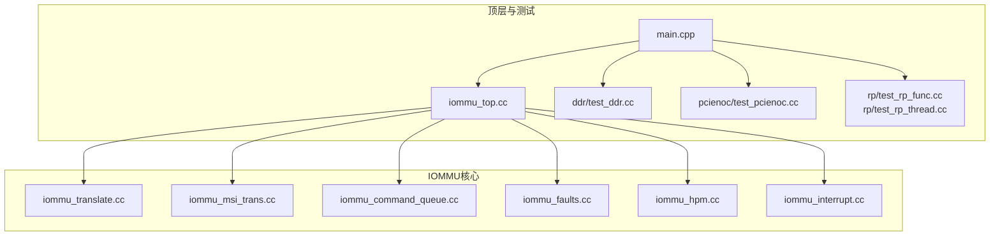
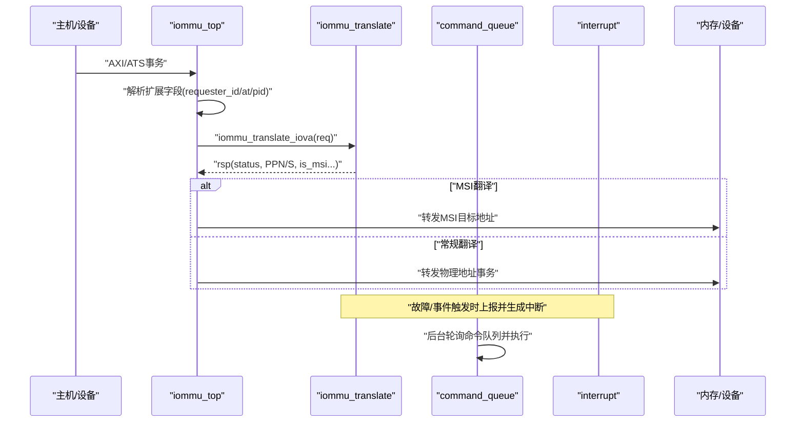
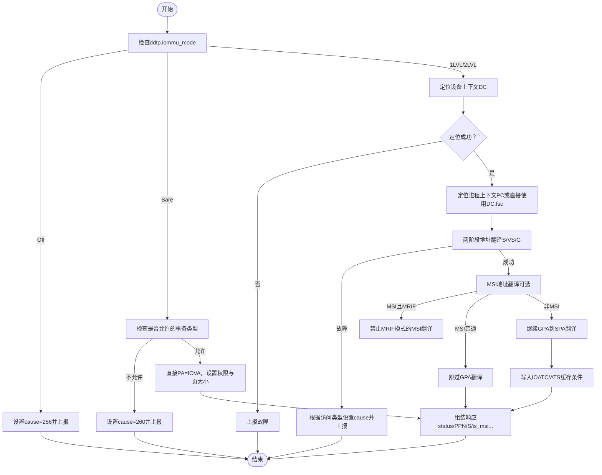
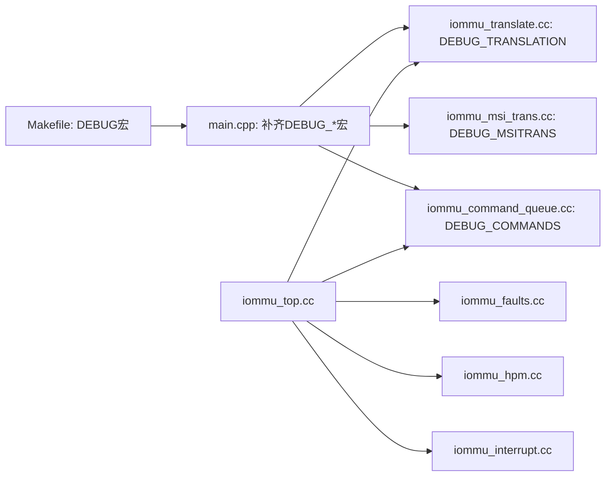

# 调试与诊断

<cite>
**本文引用的文件**
- [GDB_DEBUG_GUIDE.md](file://GDB_DEBUG_GUIDE.md)
- [gdb_debug.sh](file://gdb_debug.sh)
- [Makefile](file://Makefile)
- [main.cpp](file://main.cpp)
- [compile_systemc.bat](file://compile_systemc.bat)
- [iommu_translate.cc](file://iommu/iommu_translate.cc)
- [iommu_msi_trans.cc](file://iommu/iommu_msi_trans.cc)
- [iommu_command_queue.cc](file://iommu/iommu_command_queue.cc)
- [iommu_faults.cc](file://iommu/iommu_faults.cc)
- [iommu_hpm.cc](file://iommu/iommu_hpm.cc)
- [iommu_top.cc](file://iommu/iommu_top.cc)
- [iommu_interrupt.cc](file://iommu/iommu_interrupt.cc)
</cite>

## 目录
1. [简介](#简介)
2. [项目结构](#项目结构)
3. [核心组件](#核心组件)
4. [架构总览](#架构总览)
5. [详细组件分析](#详细组件分析)
6. [依赖关系分析](#依赖关系分析)
7. [性能考量](#性能考量)
8. [故障排查指南](#故障排查指南)
9. [结论](#结论)
10. [附录](#附录)

## 简介
本指南面向RISC-V IOMMU模型的调试与诊断，结合仓库中的GDB调试指南与源码实现，提供从环境准备、断点策略、变量检查到SystemC仿真调试、宏定义使用、性能计数与故障定位的完整流程。读者将学会：
- 如何编译并启用调试宏，使用GDB进行断点、单步与变量检查
- 在SystemC仿真环境下进行事件跟踪、时序分析与状态监控
- 正确配置与使用DEBUG系列宏（如DEBUG、DEBUG_TRANSLATION、DEBUG_MSITRANS等）
- 使用HPM计数器进行性能分析
- 面向地址转换错误、命令处理异常与内存访问故障的诊断步骤
- 日志分析与错误定位方法，以及系统性能优化建议

## 项目结构
该工程采用分层组织方式，核心IOMMU逻辑位于iommu子目录，顶层模块负责SystemC绑定与事务转发，测试模块位于各自子目录，构建通过Makefile统一管理。

图示来源
- [main.cpp:38-87](file://main.cpp#L38-L87)
- [iommu_top.cc:6-222](file://iommu/iommu_top.cc#L6-L222)

章节来源
- [Makefile:1-98](file://Makefile#L1-L98)
- [main.cpp:14-31](file://main.cpp#L14-L31)
- [iommu_top.cc:6-36](file://iommu/iommu_top.cc#L6-L36)

## 核心组件
- 地址翻译引擎：负责IOVA到PA的两阶段地址翻译、ATS请求处理、MSI地址翻译与缓存命中/缺失路径。
- 命令队列：解析并执行软件下发的IOMMU命令（如无效化、目录表清理、ATS消息等）。
- 故障上报：将故障记录写入内存队列，并生成中断；支持DTF过滤与溢出/内存访问故障处理。
- 性能监控：根据事件选择器与过滤条件对计数器进行增量与溢出中断。
- 中断生成：依据向量映射与MSI配置发送MSI中断。
- 顶层模块：SystemC绑定、AXI/ATS消息处理、调用翻译引擎并转发物理地址事务。

章节来源
- [iommu_translate.cc:8-732](file://iommu/iommu_translate.cc#L8-L732)
- [iommu_command_queue.cc:7-276](file://iommu/iommu_command_queue.cc#L7-L276)
- [iommu_faults.cc:8-160](file://iommu/iommu_faults.cc#L8-L160)
- [iommu_hpm.cc:6-110](file://iommu/iommu_hpm.cc#L6-L110)
- [iommu_interrupt.cc:27-121](file://iommu/iommu_interrupt.cc#L27-L121)
- [iommu_top.cc:41-222](file://iommu/iommu_top.cc#L41-L222)

## 架构总览
SystemC仿真主线程在顶层模块中创建IOMMU、DDR、RP、PCIENOC等模块实例，并建立TLM接口绑定。顶层模块接收外部事务（AXI/ATS），解析扩展字段后调用地址翻译引擎，根据结果决定转发至PCIe NOC或直接返回物理地址，同时记录事件与可能的故障。

图示来源
- [iommu_top.cc:120-209](file://iommu/iommu_top.cc#L120-L209)
- [iommu_translate.cc:8-732](file://iommu/iommu_translate.cc#L8-L732)
- [iommu_command_queue.cc:7-276](file://iommu/iommu_command_queue.cc#L7-L276)
- [iommu_interrupt.cc:27-121](file://iommu/iommu_interrupt.cc#L27-L121)

## 详细组件分析

### GDB调试环境与脚本
- 编译调试版本：使用DEBUG=1开启调试符号与调试宏，便于断点与变量检查。
- 可执行文件：编译后生成iommu_model，包含调试符号。
- 调试脚本：提供自动化启动GDB、设置工作目录、加载符号、断点与运行的流程，减少手工操作。

章节来源
- [GDB_DEBUG_GUIDE.md:8-35](file://GDB_DEBUG_GUIDE.md#L8-L35)
- [gdb_debug.sh:1-37](file://gdb_debug.sh#L1-L37)
- [Makefile:16-24](file://Makefile#L16-L24)

### 断点设置策略与变量检查
- 关键断点建议：在地址翻译入口、设备上下文定位、ATC/IOATC缓存、命令队列处理线程等位置设置断点，以便观察状态变化与路径分支。
- 变量检查：打印请求参数（如device_id、iova、priv_req）、寄存器状态（ddtp、capabilities、fctl）与响应结构体字段（status、PPN、S、is_msi等）。
- 条件断点与命令断点：按设备ID、权限位等条件命中，或在断点命中时自动打印关键变量并继续执行。
- 跟踪点：不中断执行，仅记录关键变量，适合长时间运行场景。

章节来源
- [GDB_DEBUG_GUIDE.md:44-68](file://GDB_DEBUG_GUIDE.md#L44-L68)
- [GDB_DEBUG_GUIDE.md:71-102](file://GDB_DEBUG_GUIDE.md#L71-L102)
- [GDB_DEBUG_GUIDE.md:176-203](file://GDB_DEBUG_GUIDE.md#L176-L203)

### SystemC仿真下的调试技巧
- 事件跟踪：在顶层模块中打印事务类型、扩展字段与翻译结果，结合断点定位路径差异。
- 时序分析：通过仿真时间推进与日志输出，观察命令队列处理、MSI写入与中断生成的时序关系。
- 状态监控：关注寄存器CSR状态（cqcsr、fqcsr、ipsr等）与缓存有效性标志，判断队列溢出、内存访问故障与中断挂起。

章节来源
- [iommu_top.cc:90-209](file://iommu/iommu_top.cc#L90-L209)
- [iommu_command_queue.cc:47-111](file://iommu/iommu_command_queue.cc#L47-L111)
- [iommu_faults.cc:23-44](file://iommu/iommu_faults.cc#L23-L44)

### 调试宏定义详解与配置
- DEBUG：顶层宏，启用后自动定义DEBUG_TRANSLATION、DEBUG_MSITRANS、DEBUG_TWOSTAGE、DEBUG_SECONDSTAGE、DEBUG_COMMANDS、DEBUG_ATC、DEBUG_FAULTS、DEBUG_INTERRUPT、DEBUG_HPM、DEBUG_UTILS等。
- DEBUG_TRANSLATION：在地址翻译主流程中输出事件计数、模式判断、缓存命中/缺失与最终响应字段。
- DEBUG_MSITRANS：在MSI地址翻译路径中输出MSI检测、PTE读取、MRIF/NAPOT处理与权限校验。
- DEBUG_COMMANDS：在命令队列处理中输出队列状态、命令解码、非法命令与执行进度。
- 其他宏：分别对应两阶段翻译、第二阶段翻译、ATC、故障、中断、HPM与通用工具。

章节来源
- [Makefile:18-20](file://Makefile#L18-L20)
- [main.cpp:14-31](file://main.cpp#L14-L31)
- [iommu_translate.cc:13-16](file://iommu/iommu_translate.cc#L13-L16)
- [iommu_msi_trans.cc:26-28](file://iommu/iommu_msi_trans.cc#L26-L28)
- [iommu_command_queue.cc:11-13](file://iommu/iommu_command_queue.cc#L11-L13)

### 地址翻译流程与调试要点
- 主流程：模式检查（Off/Bare/1LVL/2LVL）、设备/进程上下文定位、两阶段页表遍历、MSI地址翻译、ATC缓存、响应组装与事件计数。
- 关键断点：iommu_translate_iova、locate_device_context、lookup_ioatc_iotlb、cache_ioatc_iotlb、two_stage_address_translation、second_stage_address_translation、report_fault。
- 变量检查：请求参数（device_id、pid_valid、process_id、priv_req、exec_req、at）、寄存器（ddtp、capabilities、fctl）、响应（status、PPN、S、is_msi、is_mrif、dest_mrif_addr、PBMT、is_bare_mode）。

图示来源
- [iommu_translate.cc:8-732](file://iommu/iommu_translate.cc#L8-L732)

章节来源
- [iommu_translate.cc:8-732](file://iommu/iommu_translate.cc#L8-L732)
- [GDB_DEBUG_GUIDE.md:71-102](file://GDB_DEBUG_GUIDE.md#L71-L102)

### 命令队列处理与调试要点
- 队列状态：检查cqon/cqen/cqmf/cmd_ill/cmd_to、cqh/cqt、命令读取状态与非法命令处理。
- 支持命令：IOTINVAL（VMA/GVMA）、IODIR（INVAL_DDT/INVAL_PDT）、IOFENCE（C）、ATS（INVAL/PRGR）。
- 调试断点：process_commands入口、各子命令处理函数（do_iotinval_vma/gvma、do_inval_ddt/pdt、do_iofence_c、do_ats_msg）。
- 变量检查：命令结构体字段（opcode、func3、各操作数）、CSR状态、ITAG分配与挂起状态。

章节来源
- [iommu_command_queue.cc:7-276](file://iommu/iommu_command_queue.cc#L7-L276)
- [iommu_command_queue.cc:331-676](file://iommu/iommu_command_queue.cc#L331-L676)
- [GDB_DEBUG_GUIDE.md:71-87](file://GDB_DEBUG_GUIDE.md#L71-L87)

### 故障上报与中断生成
- 故障队列：检查fqon/fqen/fqmf/fqof、DTF过滤、队列满/内存访问故障、写入地址合法性与溢出中断。
- 中断生成：根据单元类型更新ipsr并查找向量映射，若为MSI则写入目标地址4字节数据，否则挂起待释放。
- 调试断点：report_fault、generate_interrupt、release_pending_interrupt。

章节来源
- [iommu_faults.cc:8-160](file://iommu/iommu_faults.cc#L8-L160)
- [iommu_interrupt.cc:27-121](file://iommu/iommu_interrupt.cc#L27-L121)
- [GDB_DEBUG_GUIDE.md:100-102](file://GDB_DEBUG_GUIDE.md#L100-L102)

### 性能监控（HPM）与调试
- 计数器增量：当事件匹配且过滤条件（DID/GSCID、PV/PSCV、IDT）满足时，计数器递增并处理溢出与中断。
- 调试断点：count_events入口与关键过滤判断处。
- 变量检查：事件ID、过滤掩码、ID类型、计数器值与OF位。

章节来源
- [iommu_hpm.cc:6-110](file://iommu/iommu_hpm.cc#L6-L110)
- [GDB_DEBUG_GUIDE.md:176-180](file://GDB_DEBUG_GUIDE.md#L176-L180)

### 顶层模块与SystemC绑定
- 初始化：复位IOMMU、设置模式（如1LVL）、配置能力与控制寄存器。
- 事务处理：AXI从端口接收读写与ATS消息，解析扩展字段后调用翻译引擎，根据结果转发或修改地址。
- 命令队列监控：后台线程等待事件并处理命令队列。

章节来源
- [iommu_top.cc:6-36](file://iommu/iommu_top.cc#L6-L36)
- [iommu_top.cc:41-222](file://iommu/iommu_top.cc#L41-L222)

## 依赖关系分析
- Makefile定义了DEBUG构建模式与全部DEBUG宏，确保编译期启用相应日志与断点。
- main.cpp在DEBUG宏下自动补全各子模块调试宏，保证一致的调试输出。
- 顶层模块依赖翻译、命令队列、故障与中断模块，形成闭环的事件/故障处理链路。

图示来源
- [Makefile:16-24](file://Makefile#L16-L24)
- [main.cpp:14-31](file://main.cpp#L14-L31)
- [iommu_top.cc:6-222](file://iommu/iommu_top.cc#L6-L222)

章节来源
- [Makefile:16-24](file://Makefile#L16-L24)
- [main.cpp:14-31](file://main.cpp#L14-L31)
- [iommu_top.cc:6-222](file://iommu/iommu_top.cc#L6-L222)

## 性能考量
- 调试模式（-O0）会显著降低运行速度，属于预期行为，仅在调试阶段启用。
- HPM计数器用于统计事件与过滤匹配，避免在生产模式下引入额外开销。
- 建议在性能分析时关闭不必要的DEBUG宏，仅保留必要模块的日志以减少输出噪声与I/O开销。

## 故障排查指南
- 符号不可用/断点未命中
  - 确认使用DEBUG=1编译，未strip调试符号，源码路径正确。
  - 检查函数名拼写与编译模式。
- 地址转换错误
  - 关注ddtp.iommu_mode、设备/进程上下文定位、两阶段页表遍历与MSI翻译路径。
  - 断点定位：iommu_translate_iova、locate_device_context、two_stage_address_translation、second_stage_address_translation、report_fault。
  - 变量检查：device_id、pid_valid、process_id、priv_req、exec_req、at、寄存器状态与响应字段。
- 命令处理异常
  - 关注命令队列CSR状态（cqon/cqen/cqmf/cmd_ill/cmd_to）、cqh/cqt与命令读取状态。
  - 断点定位：process_commands、do_iotinval_vma/gvma、do_inval_ddt/pdt、do_iofence_c、do_ats_msg。
- 内存访问故障
  - 检查故障队列溢出（fqof）、内存访问故障（fqmf）、MSI写入地址合法性与越界。
  - 断点定位：report_fault、generate_interrupt、release_pending_interrupt。
- 日志分析与错误定位
  - 顶层模块打印事务类型、扩展字段与翻译结果，结合断点逐步缩小范围。
  - 使用条件断点与命令断点自动打印关键变量，提高定位效率。

章节来源
- [GDB_DEBUG_GUIDE.md:160-173](file://GDB_DEBUG_GUIDE.md#L160-L173)
- [GDB_DEBUG_GUIDE.md:123-157](file://GDB_DEBUG_GUIDE.md#L123-L157)
- [iommu_faults.cc:23-44](file://iommu/iommu_faults.cc#L23-L44)
- [iommu_interrupt.cc:14-26](file://iommu/iommu_interrupt.cc#L14-L26)
- [iommu_top.cc:90-209](file://iommu/iommu_top.cc#L90-L209)

## 结论
通过结合GDB调试指南与源码实现，可在SystemC仿真环境下高效地进行IOMMU地址翻译、命令处理、故障上报与性能监控的调试与诊断。合理配置DEBUG宏、设置关键断点、利用条件/命令/跟踪断点与日志分析，能够快速定位地址转换错误、命令处理异常与内存访问故障，并为进一步的性能优化提供数据支撑。

## 附录
- SystemC编译安装（Windows）：compile_systemc.bat脚本可辅助完成SystemC的编译与安装，设置环境变量后可被编译器与链接器发现。
- GDB调试脚本：gdb_debug.sh提供一键启动GDB、设置工作目录与常用断点的流程，减少手工配置成本。

章节来源
- [compile_systemc.bat:1-50](file://compile_systemc.bat#L1-L50)
- [gdb_debug.sh:1-37](file://gdb_debug.sh#L1-L37)