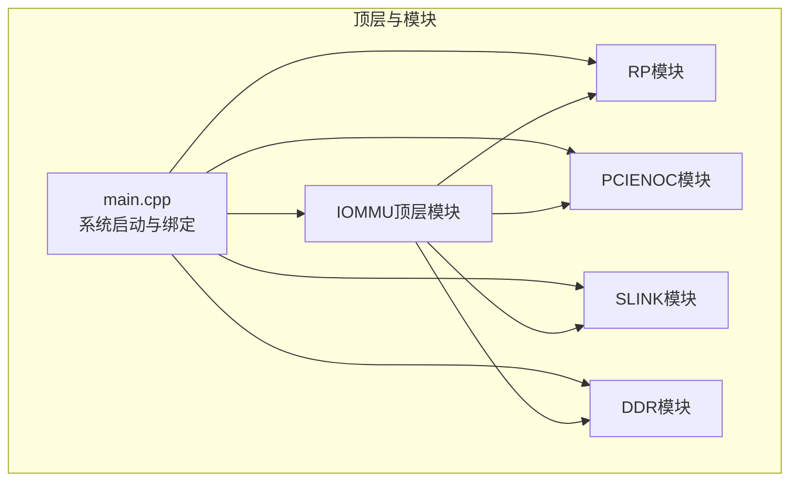
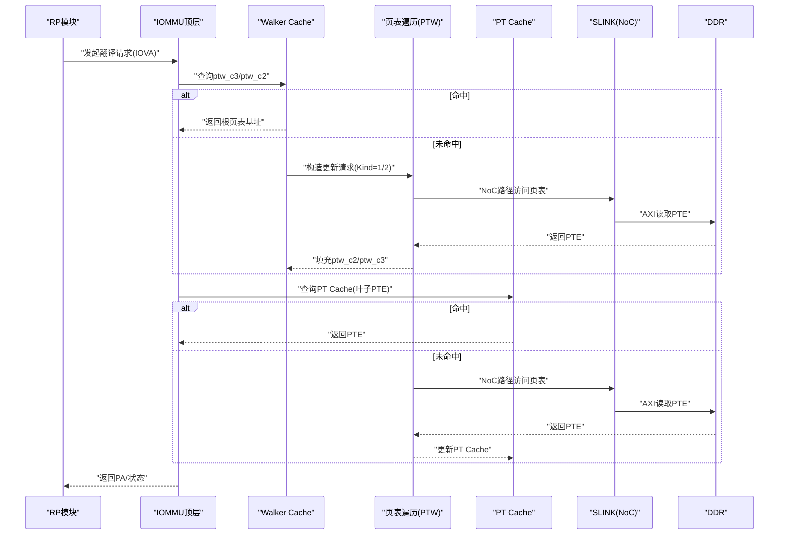
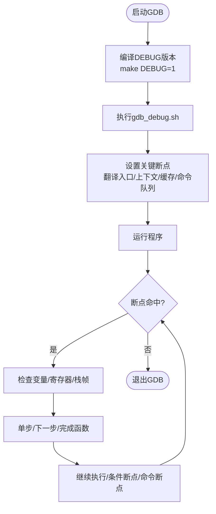
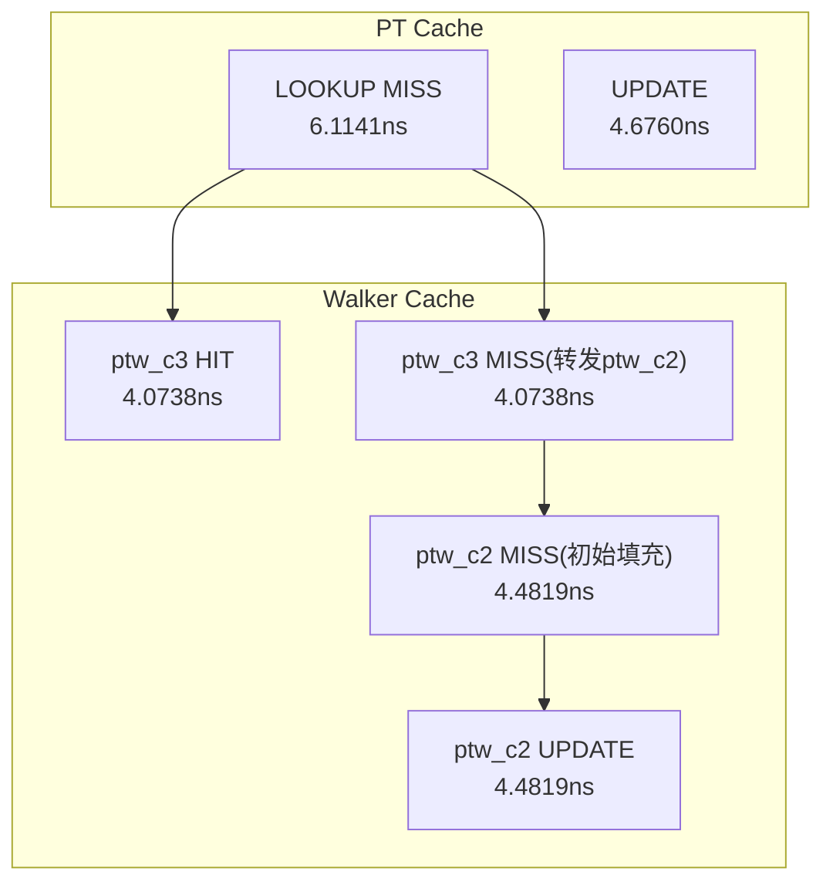
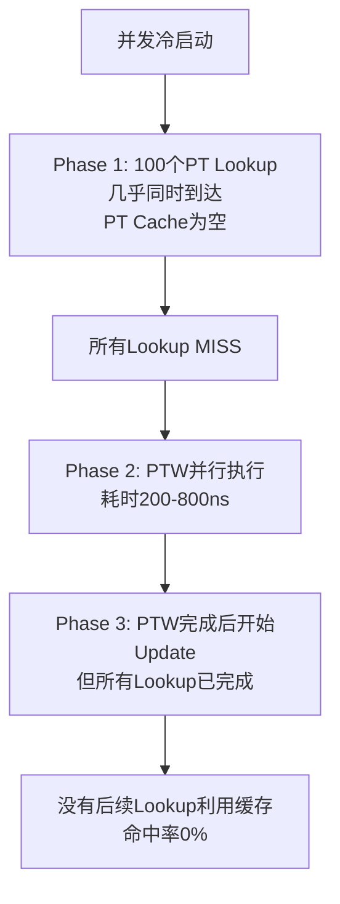
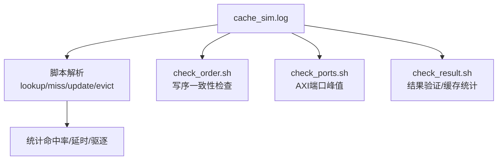
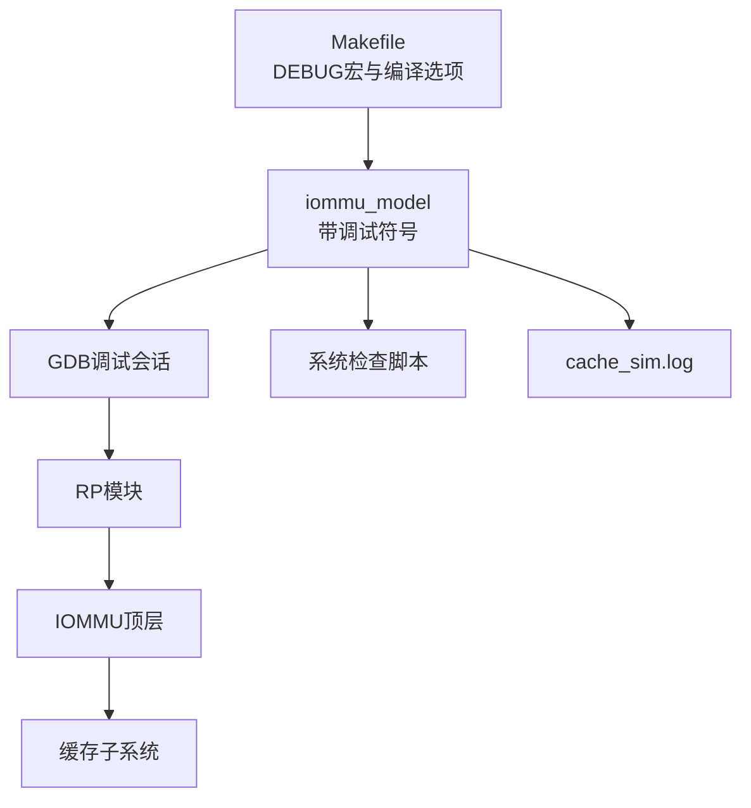

# 调试和分析工具

<cite>
**本文引用的文件**
- [GDB_DEBUG_GUIDE.md](file://GDB_DEBUG_GUIDE.md)
- [CACHE_PERFORMANCE_ANALYSIS_500REQ.md](file://CACHE_PERFORMANCE_ANALYSIS_500REQ.md)
- [PT_CACHE_HIT_RATE_ANALYSIS.md](file://PT_CACHE_HIT_RATE_ANALYSIS.md)
- [check_order.sh](file://check_order.sh)
- [check_ports.sh](file://check_ports.sh)
- [check_result.sh](file://check_result.sh)
- [check_slink.sh](file://check_slink.sh)
- [check_slink2.sh](file://check_slink2.sh)
- [check_sv39.sh](file://check_sv39.sh)
- [gdb_debug.sh](file://gdb_debug.sh)
- [main.cpp](file://main.cpp)
- [Makefile](file://Makefile)
- [cache_sim.log](file://cache_sim.log)
- [rp/test_rp_thread.cc](file://rp/test_rp_thread.cc)
- [rp/test_rp_func.cc](file://rp/test_rp_func.cc)
</cite>

## 目录
1. [简介](#简介)
2. [项目结构](#项目结构)
3. [核心组件](#核心组件)
4. [架构总览](#架构总览)
5. [详细组件分析](#详细组件分析)
6. [依赖分析](#依赖分析)
7. [性能考量](#性能考量)
8. [故障排查指南](#故障排查指南)
9. [结论](#结论)
10. [附录](#附录)

## 简介
本文件面向RISC-V IOMMU项目的调试与分析，围绕以下目标展开：
- GDB调试环境搭建与使用：断点设置、变量检查、单步执行、条件断点、跟踪点等。
- 分析工具与脚本：缓存性能分析（500请求）、页表缓存命中率分析、系统检查脚本（写序一致性、AXI outstanding、缓存命中率汇总）。
- 调试输出解读：日志格式、关键字段含义、错误信息定位与分析。
- 性能指标监控：缓存延时、队列延时、命中率、DDR outstanding等。
- 常见问题诊断流程与解决方案：并发冷启动导致的PT Cache 0%命中、Walker Cache缓存污染修复、写序一致性检查。
- 最佳实践：日志分析、瓶颈识别、优化建议与实际调试案例。

## 项目结构
该项目采用SystemC建模，包含IOMMU核心功能、缓存子系统、性能模型、以及多模块（RP、PCIENOC、SLINK、DDR）协同仿真。调试与分析相关的关键文件如下：
- 调试指南与脚本：GDB调试指南、GDB启动脚本、Makefile中的调试宏定义。
- 性能分析报告：500请求缓存性能分析、PT Cache命中率分析。
- 日志与脚本：cache_sim.log（缓存统计日志）、多个系统检查脚本（写序、端口峰值、结果校验）。
- 测试与验证：RP线程测试（并发请求）、RP功能测试（翻译接口封装）。

**图表来源**
- [main.cpp:39-94](file://main.cpp#L39-L94)

**章节来源**
- [main.cpp:39-94](file://main.cpp#L39-L94)
- [Makefile:22-30](file://Makefile#L22-L30)

## 核心组件
- GDB调试环境：提供编译调试版本、GDB脚本、常用命令与高级技巧（条件断点、命令断点、跟踪点）。
- 缓存性能分析：500请求场景下的PT Cache与Walker Cache统计、延时对比、命中率分析与修复前后对比。
- PT Cache命中率分析：并发冷启动导致0%命中率的根因、时序分析与修复验证。
- 系统检查脚本：写序一致性、AXI端口峰值、DDR outstanding、缓存命中率汇总。
- 日志解析：cache_sim.log的结构化字段与解读方法。
- 测试与验证：RP并发测试（100请求）、翻译接口封装与故障检查。

**章节来源**
- [GDB_DEBUG_GUIDE.md:1-206](file://GDB_DEBUG_GUIDE.md#L1-L206)
- [CACHE_PERFORMANCE_ANALYSIS_500REQ.md:1-305](file://CACHE_PERFORMANCE_ANALYSIS_500REQ.md#L1-L305)
- [PT_CACHE_HIT_RATE_ANALYSIS.md:1-304](file://PT_CACHE_HIT_RATE_ANALYSIS.md#L1-L304)
- [check_order.sh:1-30](file://check_order.sh#L1-L30)
- [check_ports.sh:1-13](file://check_ports.sh#L1-L13)
- [check_result.sh:1-41](file://check_result.sh#L1-L41)
- [check_slink.sh:1-35](file://check_slink.sh#L1-L35)
- [check_slink2.sh:1-32](file://check_slink2.sh#L1-L32)
- [check_sv39.sh:1-14](file://check_sv39.sh#L1-L14)
- [cache_sim.log:1-200](file://cache_sim.log#L1-L200)
- [rp/test_rp_thread.cc:102-189](file://rp/test_rp_thread.cc#L102-L189)
- [rp/test_rp_func.cc:28-89](file://rp/test_rp_func.cc#L28-L89)

## 架构总览
IOMMU模型通过SystemC进行建模，顶层main.cpp负责实例化各模块并通过Socket绑定建立通信链路。调试与分析围绕以下关键路径：
- 地址翻译路径：RP发起请求，IOMMU执行两阶段地址翻译，Walker Cache与PT Cache参与缓存加速。
- 缓存路径：DC Cache、PC Cache、PT Cache、Walker Cache（含ptw_c1/c2/c3）。
- 外设路径：SLINK（NoC）到DDR的页表访问路径；PCIENOC连接外部设备。
- 性能监控：通过日志与脚本统计缓存命中率、延时、AXI outstanding、写序一致性。

**图表来源**
- [CACHE_PERFORMANCE_ANALYSIS_500REQ.md:119-141](file://CACHE_PERFORMANCE_ANALYSIS_500REQ.md#L119-L141)
- [rp/test_rp_func.cc:28-89](file://rp/test_rp_func.cc#L28-L89)

## 详细组件分析

### GDB调试环境与使用
- 编译调试版本：使用DEBUG=1开启调试符号与宏定义，便于断点与变量检查。
- 启动方式：提供gdb_debug.sh一键启动GDB并设置断点、参数与列表源码。
- 常用命令：断点管理、单步执行、变量打印、调用栈查看。
- 高级技巧：条件断点、命令断点、跟踪点，用于自动化记录与条件触发。
- 关键断点建议：地址翻译入口、设备上下文定位、ATC/IOATC缓存、命令队列处理线程。
- 调试示例：地址翻译失败与单步调试特定功能的完整流程。

**图表来源**
- [GDB_DEBUG_GUIDE.md:21-206](file://GDB_DEBUG_GUIDE.md#L21-L206)
- [gdb_debug.sh:1-37](file://gdb_debug.sh#L1-L37)
- [Makefile:22-30](file://Makefile#L22-L30)

**章节来源**
- [GDB_DEBUG_GUIDE.md:1-206](file://GDB_DEBUG_GUIDE.md#L1-L206)
- [gdb_debug.sh:1-37](file://gdb_debug.sh#L1-L37)
- [Makefile:22-30](file://Makefile#L22-L30)

### 缓存性能分析（500请求）
- 执行摘要：500/500请求成功，0个WALK FAULT（修复后），地址翻译正确。
- PT Cache统计：总访问500，HIT=0，MISS=500，命中率0%，驱逐56次，执行延时4.6760ns，队列延时1.4370ns，总平均延时6.1141ns。
- Walker Cache统计：ptw_c3综合命中率91.80%，ptw_c2命中率0%（初始填充），SKIP UPDATE机制有效防止缓存污染。
- 延时对比：PT Cache MISS延时高于Walker Cache HIT延时，Walker Cache无队列延时，整体缓存延时占比小。
- 修复前后对比：修复Walker Cache UPDATE valid检查后，消除210个WALK FAULT，保持91.8%命中率。
- 优化建议：增大PT Cache容量、优化替换策略（SRRIP）、预取机制、使用大页减少PTW层级、提高DDR并行度。

**图表来源**
- [CACHE_PERFORMANCE_ANALYSIS_500REQ.md:26-178](file://CACHE_PERFORMANCE_ANALYSIS_500REQ.md#L26-L178)

**章节来源**
- [CACHE_PERFORMANCE_ANALYSIS_500REQ.md:1-305](file://CACHE_PERFORMANCE_ANALYSIS_500REQ.md#L1-L305)

### PT Cache命中率分析（并发冷启动）
- 问题背景：100并发请求测试中PT Cache命中率为0%。
- 根因：并发时序导致所有lookup在update之前完成，属于预期行为（冷启动）。
- 修复验证：align_iova掩码修正、lookup_pt页对齐修正、编译与链接验证通过。
- 如何产生命中：重复访问同一VPN、串行访问模式、适当等待PTW完成。
- 当前状态：功能验证通过（100/100请求翻译正确），DC Cache命中率合理，PT Cache命中率在并发冷启动场景下为0%属预期。

**图表来源**
- [PT_CACHE_HIT_RATE_ANALYSIS.md:106-157](file://PT_CACHE_HIT_RATE_ANALYSIS.md#L106-L157)

**章节来源**
- [PT_CACHE_HIT_RATE_ANALYSIS.md:1-304](file://PT_CACHE_HIT_RATE_ANALYSIS.md#L1-L304)

### 系统检查脚本与日志分析
- 写序一致性检查：check_order.sh解析输出文件，检查REORDER输出的task_id单调递增，统计最大READ/WRITE outstanding与总事务数。
- AXI端口峰值：check_ports.sh统计axi_master_0与axi_master_1的峰值outstanding与发送次数。
- 结果验证：check_result.sh统计PASS/FAIL、REORDER计数、写序检查、DDR峰值outstanding、AXI峰值、时间范围、缓存统计。
- SLINK测试：check_slink.sh/check_slink2.sh统计SLINK PASS/FAIL、写序检查、DDR峰值、AXI峰值、缓存命中率。
- 日志解读：cache_sim.log包含cache-task日志，字段如level、phase、cache、op、enter_time、done_time、exec_latency、total_latency、hit等，可用于统计与可视化。

**图表来源**
- [check_order.sh:1-30](file://check_order.sh#L1-L30)
- [check_ports.sh:1-13](file://check_ports.sh#L1-L13)
- [check_result.sh:1-41](file://check_result.sh#L1-L41)
- [check_slink.sh:1-35](file://check_slink.sh#L1-L35)
- [check_slink2.sh:1-32](file://check_slink2.sh#L1-L32)
- [cache_sim.log:1-200](file://cache_sim.log#L1-L200)

**章节来源**
- [check_order.sh:1-30](file://check_order.sh#L1-L30)
- [check_ports.sh:1-13](file://check_ports.sh#L1-L13)
- [check_result.sh:1-41](file://check_result.sh#L1-L41)
- [check_slink.sh:1-35](file://check_slink.sh#L1-L35)
- [check_slink2.sh:1-32](file://check_slink2.sh#L1-L32)
- [cache_sim.log:1-200](file://cache_sim.log#L1-L200)

### 调试输出解读与错误分析
- 日志字段解读：cache_sim.log中包含任务ID、IOVA、enter_time、done_time、exec_latency、total_latency、hit等，可用于绘制时序图与延时分析。
- 错误信息定位：RP模块的翻译接口封装（send_translation_request_rp）与故障检查（check_faults_rp/check_rsp_and_faults_rp）有助于定位故障类型与参数。
- 性能指标监控：通过脚本统计缓存命中率、延时、队列延时、AXI outstanding、DDR峰值，辅助识别瓶颈。

**章节来源**
- [rp/test_rp_func.cc:28-89](file://rp/test_rp_func.cc#L28-L89)
- [rp/test_rp_func.cc:92-179](file://rp/test_rp_func.cc#L92-L179)
- [cache_sim.log:1-200](file://cache_sim.log#L1-L200)

### 调试案例与分析示例
- 案例1：地址翻译失败调试
  - 断点设置：翻译入口、设备上下文定位、故障报告。
  - 变量检查：请求设备ID、IOVA、寄存器状态（DDTP、FCTL、CAP）。
  - 单步执行：逐步跟踪两阶段地址翻译与故障上报。
- 案例2：单步调试特定功能
  - 启动GDB并立即运行，按Ctrl+C停止后设置断点继续执行。
  - 单步进入/跳过函数，检查寄存器与关键变量。

**章节来源**
- [GDB_DEBUG_GUIDE.md:121-157](file://GDB_DEBUG_GUIDE.md#L121-L157)

## 依赖分析
- 编译与调试：Makefile在DEBUG=1时启用-g -O0与大量DEBUG宏，确保GDB可用性与符号完整性。
- 模块耦合：main.cpp中IOMMU与各模块通过Socket绑定，形成清晰的数据通路；RP模块通过TLM接口与IOMMU交互。
- 日志与脚本：cache_sim.log作为缓存统计来源，多个shell脚本解析并汇总关键指标。

**图表来源**
- [Makefile:22-30](file://Makefile#L22-L30)
- [main.cpp:39-94](file://main.cpp#L39-L94)

**章节来源**
- [Makefile:22-30](file://Makefile#L22-L30)
- [main.cpp:39-94](file://main.cpp#L39-L94)

## 性能考量
- 缓存性能：Walker Cache命中率91.8%，PT Cache在并发冷启动场景下命中率0%属预期；缓存延时仅占总延时小部分，主要瓶颈在PTW的DDR读取。
- 延时优化：减少PTW层级（大页）、提高DDR并行度、PT Cache预填充、优化替换策略（SRRIP）。
- 并发与队列：PT Cache存在队列延时，Walker Cache轮询调度消除FIFO积压，建议在高并发场景优先利用Walker Cache。
- 写序一致性：通过脚本检查task_id单调递增，避免写序破坏导致的异常。

[本节为通用性能讨论，无需列出具体文件来源]

## 故障排查指南
- 符号不可用：确认DEBUG=1编译、未strip调试符号、源码路径正确。
- 断点无法命中：检查函数名拼写、确认DEBUG=1、确认代码路径被执行。
- 并发冷启动导致PT Cache 0%命中：属于预期行为，可通过重复访问或串行访问验证命中。
- Walker Cache缓存污染：修复valid检查后，消除WALK FAULT并保持高命中率。
- 写序一致性：使用check_order.sh检查task_id单调递增，关注REORDER输出。
- AXI端口峰值：使用check_ports.sh统计axi_master_0/1峰值outstanding，评估系统并行度。
- 结果验证：使用check_result.sh/check_slink.sh/check_slink2.sh快速定位PASS/FAIL与关键统计。

**章节来源**
- [GDB_DEBUG_GUIDE.md:158-173](file://GDB_DEBUG_GUIDE.md#L158-L173)
- [PT_CACHE_HIT_RATE_ANALYSIS.md:134-157](file://PT_CACHE_HIT_RATE_ANALYSIS.md#L134-L157)
- [check_order.sh:1-30](file://check_order.sh#L1-L30)
- [check_ports.sh:1-13](file://check_ports.sh#L1-L13)
- [check_result.sh:1-41](file://check_result.sh#L1-L41)
- [check_slink.sh:1-35](file://check_slink.sh#L1-L35)
- [check_slink2.sh:1-32](file://check_slink2.sh#L1-L32)

## 结论
- 功能正确性：500请求全部成功，Walker Cache缓存污染问题已修复，地址翻译逻辑正确。
- 性能表现：Walker Cache命中率91.8%，PT Cache在并发冷启动场景下命中率0%属预期；缓存延时占比小，主要瓶颈在PTW的DDR读取。
- 优化方向：增大PT Cache容量、优化替换策略、预取机制、大页支持、提高DDR并行度。
- 调试与分析：结合GDB、日志与脚本，可快速定位问题、验证修复并指导优化。

[本节为总结性内容，无需列出具体文件来源]

## 附录
- 实际调试案例：参考“调试示例”章节，按步骤设置断点、单步执行、检查变量与寄存器。
- 日志分析最佳实践：优先关注cache_sim.log中的lookup/miss/update/evict时序，结合脚本统计命中率与延时。
- 性能瓶颈识别：以Walker Cache命中率与PT Cache延时为切入点，结合AXI outstanding与DDR峰值判断系统瓶颈。

[本节为补充内容，无需列出具体文件来源]