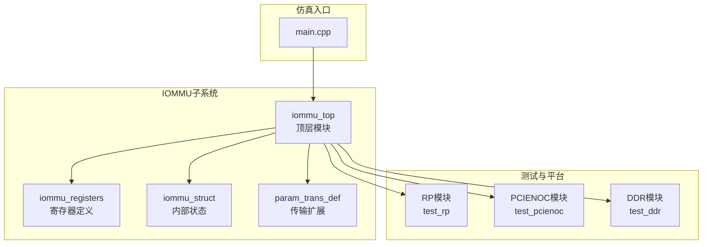
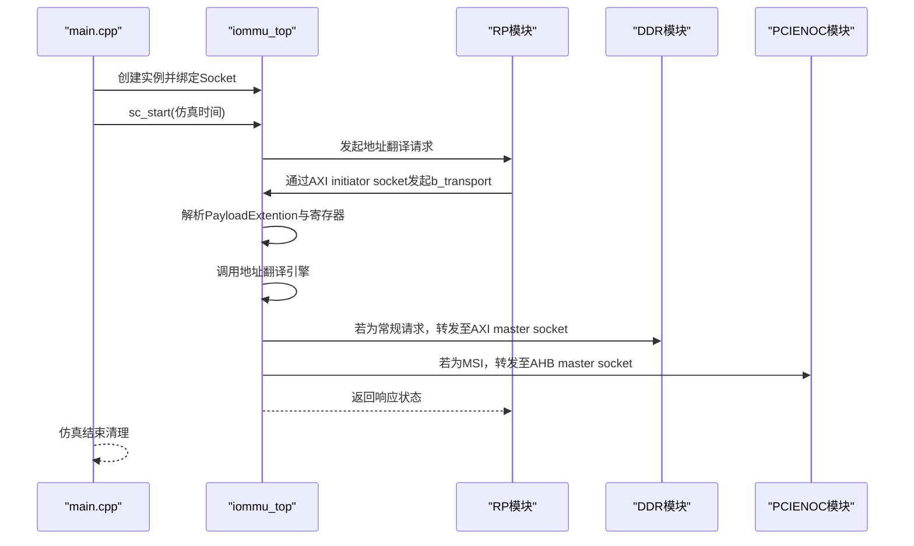
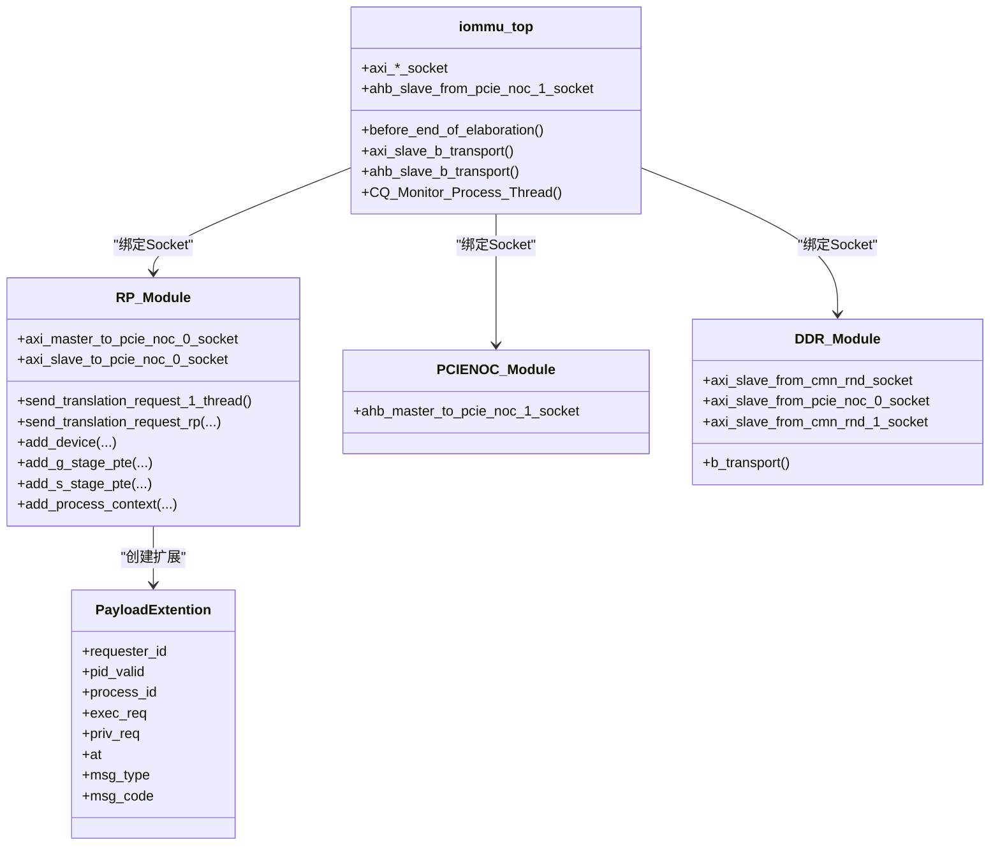
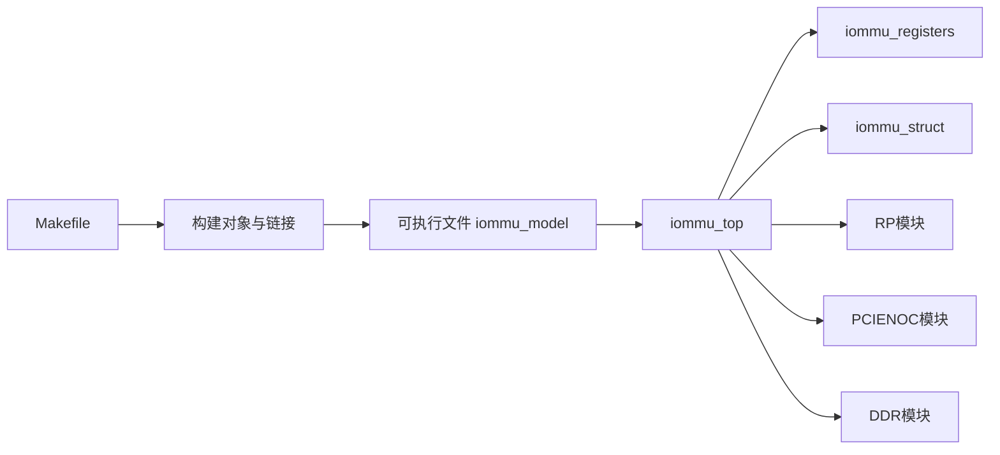

# 部署与配置

<cite>
**本文引用的文件**
- [Makefile](file://Makefile)
- [compile_systemc.bat](file://compile_systemc.bat)
- [gdb_debug.sh](file://gdb_debug.sh)
- [main.cpp](file://main.cpp)
- [GDB_DEBUG_GUIDE.md](file://GDB_DEBUG_GUIDE.md)
- [iommu_top.hh](file://iommu/iommu_top.hh)
- [iommu_top.cc](file://iommu/iommu_top.cc)
- [iommu_struct.hh](file://iommu/iommu_struct.hh)
- [iommu_registers.hh](file://iommu/iommu_registers.hh)
- [param_trans_def.hh](file://iommu/param_trans_def.hh)
- [test_rp.hh](file://rp/test_rp.hh)
- [test_rp_func.cc](file://rp/test_rp_func.cc)
- [test_rp_thread.cc](file://rp/test_rp_thread.cc)
- [test_pcienoc.hh](file://pcienoc/test_pcienoc.hh)
- [test_ddr.hh](file://ddr/test_ddr.hh)
</cite>

## 目录
1. [简介](#简介)
2. [项目结构](#项目结构)
3. [核心组件](#核心组件)
4. [架构总览](#架构总览)
5. [详细组件分析](#详细组件分析)
6. [依赖关系分析](#依赖关系分析)
7. [性能考量](#性能考量)
8. [故障排查指南](#故障排查指南)
9. [结论](#结论)
10. [附录](#附录)

## 简介
本指南面向部署与配置IOMMU SystemC仿真模型，覆盖编译配置系统（Makefile与Windows批处理）、SystemC库集成、跨平台部署差异、运行时配置与调试、性能调优与资源限制、以及生产与容器化部署策略。文档同时提供配置验证方法、性能基准测试思路与故障恢复机制，帮助读者在不同平台上稳定复现与扩展该仿真系统。

## 项目结构
该项目采用SystemC/TLM模块化设计，核心仿真入口位于顶层模块，通过Socket接口连接PCIe NOC、RP（Root Port）与DDR内存模块，形成端到端的IOMMU地址翻译与故障处理链路。构建系统支持Linux与Windows双平台，分别通过GNU Make与CMake流程实现SystemC库的编译与安装。

图示来源
- [main.cpp:38-87](file://main.cpp#L38-L87)
- [iommu_top.hh:19-55](file://iommu/iommu_top.hh#L19-L55)
- [iommu_registers.hh:1-120](file://iommu/iommu_registers.hh#L1-L120)
- [iommu_struct.hh:42-99](file://iommu/iommu_struct.hh#L42-L99)
- [param_trans_def.hh:12-97](file://iommu/param_trans_def.hh#L12-L97)
- [test_rp.hh:54-112](file://rp/test_rp.hh#L54-L112)
- [test_pcienoc.hh:10-21](file://pcienoc/test_pcienoc.hh#L10-L21)
- [test_ddr.hh:15-96](file://ddr/test_ddr.hh#L15-L96)

章节来源
- [Makefile:1-98](file://Makefile#L1-L98)
- [main.cpp:38-87](file://main.cpp#L38-L87)
- [iommu_top.hh:19-55](file://iommu/iommu_top.hh#L19-L55)

## 核心组件
- 顶层模块与Socket绑定：顶层模块负责注册b_transport回调、初始化IOMMU寄存器与能力集、触发命令队列监控线程，并在仿真开始时绑定各模块Socket。
- 寄存器与状态：寄存器定义涵盖能力、功能控制、DDT根指针、命令/故障/页面请求队列基址与状态寄存器；内部状态包含缓存、计数器、事件等。
- 传输扩展：PayloadExtention承载PCIe ATS/PRI消息、请求者ID、进程ID、特权与执行权限等，作为地址翻译决策依据。
- 测试模块：RP模块生成多种地址翻译场景，PCIENOC模块提供NO-OP接口，DDR模块提供内存读写与边界检查。

章节来源
- [iommu_top.cc:6-36](file://iommu/iommu_top.cc#L6-L36)
- [iommu_top.cc:41-210](file://iommu/iommu_top.cc#L41-L210)
- [iommu_registers.hh:172-330](file://iommu/iommu_registers.hh#L172-L330)
- [iommu_struct.hh:42-99](file://iommu/iommu_struct.hh#L42-L99)
- [param_trans_def.hh:12-97](file://iommu/param_trans_def.hh#L12-L97)
- [test_rp.hh:54-112](file://rp/test_rp.hh#L54-L112)
- [test_ddr.hh:15-96](file://ddr/test_ddr.hh#L15-L96)

## 架构总览
系统采用SystemC/TLM事件驱动仿真，顶层模块作为调度中枢，通过Socket与外部模块交互。I/O请求经由顶层模块解析后，调用IOMMU翻译引擎，根据设备上下文与页表完成地址转换，随后转发至目标模块（如DDR或PCIe NOC）。仿真时间推进由顶层模块控制，支持中断与性能计数器扩展。

图示来源
- [main.cpp:38-87](file://main.cpp#L38-L87)
- [iommu_top.cc:77-210](file://iommu/iommu_top.cc#L77-L210)
- [test_rp_func.cc:28-78](file://rp/test_rp_func.cc#L28-L78)
- [test_ddr.hh:38-94](file://ddr/test_ddr.hh#L38-L94)
- [test_pcienoc.hh:10-21](file://pcienoc/test_pcienoc.hh#L10-L21)

## 详细组件分析

### 编译配置系统与构建流程
- Linux（GNU Make）
  - 编译器与工具链：默认使用g++/gcc。
  - SystemC路径：通过SYSTEMC_PREFIX/SYSTEMC_INCLUDE/SYSTEMC_LIB设定，链接-lsystemc与pthread、m。
  - 调试/发布：DEBUG=1启用-g -O0与大量DEBUG宏；DEBUG=0启用-O3 -DNDEBUG。
  - 目标与规则：生成build目录存放对象文件，最终链接生成可执行文件；提供clean/rebuild。
  - 依赖：显式声明部分目标的头文件依赖，便于增量编译。
- Windows（CMake + MSVC）
  - SystemC源码路径与安装路径通过环境变量配置，使用CMake生成构建系统并安装。
  - 安装后设置SYSTEMC_HOME、SYSTEMC_INCLUDE、SYSTEMC_LIBDIR环境变量，供后续编译使用。

章节来源
- [Makefile:4-27](file://Makefile#L4-L27)
- [Makefile:66-93](file://Makefile#L66-L93)
- [compile_systemc.bat:5-47](file://compile_systemc.bat#L5-L47)

### SystemC库集成与版本兼容
- 头文件包含：顶层与各模块均包含systemc.h与tlm.h/tlm_utils，确保SystemC进程与TLM传输接口可用。
- 库链接：Linux通过-lsystemc链接SystemC动态库；Windows通过CMake安装后使用对应lib目录。
- 版本兼容：Makefile中定义了API版本检查禁用宏，避免因SystemC版本差异导致的编译不一致。

章节来源
- [main.cpp:1-12](file://main.cpp#L1-L12)
- [Makefile:14-27](file://Makefile#L14-L27)

### 顶层模块与Socket绑定
- Socket定义：顶层模块提供AXI与AHB两类Socket，分别用于与DDR与PCIe NOC通信。
- 回调注册：注册b_transport回调，实现读写寄存器与地址翻译。
- 初始化：在elaboration阶段重置IOMMU并设置模式（例如Bare模式）。
- 命令队列线程：基于事件触发的监控线程预留后续命令处理。

章节来源
- [iommu_top.hh:22-51](file://iommu/iommu_top.hh#L22-L51)
- [iommu_top.cc:6-36](file://iommu/iommu_top.cc#L6-L36)
- [iommu_top.cc:215-222](file://iommu/iommu_top.cc#L215-L222)

### 寄存器与状态模型
- 能力与功能控制：能力寄存器描述支持的分页模式、ATS/MSI能力、性能计数器等；功能控制寄存器决定字节序与中断方式。
- DDTP/DDT：设备目录表根指针与层级配置，决定设备上下文查找路径。
- 队列寄存器：命令/故障/页面请求队列的基址、头尾索引与状态寄存器，支撑异步处理与中断上报。
- 内部状态：缓存（DDT/PDT/TLB）、计数器、事件选择器、MSI配置表等，构成IOMMU内部状态机。

章节来源
- [iommu_registers.hh:172-330](file://iommu/iommu_registers.hh#L172-L330)
- [iommu_registers.hh:331-580](file://iommu/iommu_registers.hh#L331-L580)
- [iommu_struct.hh:42-99](file://iommu/iommu_struct.hh#L42-L99)

### 传输扩展与消息处理
- PayloadExtention：封装PCIe ATS/PRI消息类型、请求者ID、进程ID、特权与执行权限、地址类型等，作为翻译决策输入。
- NocTransaction：基于TLM通用载荷的扩展，提供便捷的扩展挂接与查询接口。

章节来源
- [param_trans_def.hh:12-97](file://iommu/param_trans_def.hh#L12-L97)
- [param_trans_def.hh:104-128](file://iommu/param_trans_def.hh#L104-L128)

### 测试模块与场景生成
- RP模块：构造多种地址翻译场景（未翻译/已翻译/ATS请求），读写内存验证，检查故障记录与响应状态。
- 测试线程：多设备、多模式组合（Bare+Sv48x4等）进行地址翻译与页表建立，刷新缓存并验证结果。
- DDR模块：提供1MB模拟内存，执行读写并进行边界检查与日志输出。
- PCIENOC模块：提供空实现的NO-OP接口，便于连接与编译。

章节来源
- [test_rp.hh:54-112](file://rp/test_rp.hh#L54-L112)
- [test_rp_func.cc:28-78](file://rp/test_rp_func.cc#L28-L78)
- [test_rp_thread.cc:60-372](file://rp/test_rp_thread.cc#L60-L372)
- [test_ddr.hh:15-96](file://ddr/test_ddr.hh#L15-L96)
- [test_pcienoc.hh:10-21](file://pcienoc/test_pcienoc.hh#L10-L21)

### 类关系图（代码级）

图示来源
- [iommu_top.hh:19-55](file://iommu/iommu_top.hh#L19-L55)
- [test_rp.hh:54-112](file://rp/test_rp.hh#L54-L112)
- [test_pcienoc.hh:10-21](file://pcienoc/test_pcienoc.hh#L10-L21)
- [test_ddr.hh:15-96](file://ddr/test_ddr.hh#L15-L96)
- [param_trans_def.hh:12-97](file://iommu/param_trans_def.hh#L12-L97)

## 依赖关系分析
- 模块耦合：顶层模块对RP/PCIENOC/DDR存在强绑定关系；RP模块依赖IOMMU寄存器与页表工具函数；DDR模块独立于IOMMU。
- 外部依赖：SystemC/TLM、pthread、m；Windows平台需SystemC库与CMake。
- 构建依赖：Makefile显式列出源文件与目标对象，部分目标声明头文件依赖，减少不必要的重编译。

图示来源
- [Makefile:29-60](file://Makefile#L29-L60)
- [iommu_top.cc:6-36](file://iommu/iommu_top.cc#L6-L36)

章节来源
- [Makefile:29-60](file://Makefile#L29-L60)

## 性能考量
- 编译优化：发布模式（DEBUG=0）启用-O3，适合长时间仿真与基准测试；调试模式（DEBUG=1）禁用优化并开启大量调试宏，便于定位问题但性能较低。
- 仿真时间：顶层模块设置固定仿真时间，实际场景可按需求调整；长仿真建议使用发布模式并合理配置日志级别。
- 内存与页表：页表层级与缓存大小影响翻译延迟与内存占用；在测试线程中展示了不同模式下的页表建立与验证流程。
- I/O吞吐：Socket绑定与b_transport路径应尽量避免冗余拷贝与阻塞操作，确保事件驱动的高效性。

章节来源
- [Makefile:16-24](file://Makefile#L16-L24)
- [rp/test_rp_thread.cc:244-250](file://rp/test_rp_thread.cc#L244-L250)

## 故障排查指南
- 调试模式编译：使用DEBUG=1编译，配合GDB脚本或手册进行断点设置与变量检查。
- GDB脚本：提供一键启动GDB并加载符号、设置断点与目录的脚本，便于快速进入调试会话。
- 常见问题：
  - 符号缺失：确认DEBUG=1且未strip调试信息。
  - 断点未命中：核对函数名拼写、编译模式与代码路径。
  - 性能异常：调试模式下运行速度较慢属正常，建议在定位问题后切换到发布模式。
- 关键断点与变量：
  - 地址翻译入口：iommu_translate_iova
  - 设备上下文定位：locate_device_context
  - ATS/PRI处理：two_stage/second_stage_address_translation、report_fault
  - 关键寄存器：reg_file.capabilities、reg_file.fctl、reg_file.ddtp
- 日志与输出：顶层模块与各模块均有打印，结合日志定位问题。

章节来源
- [GDB_DEBUG_GUIDE.md:8-20](file://GDB_DEBUG_GUIDE.md#L8-L20)
- [gdb_debug.sh:1-37](file://gdb_debug.sh#L1-L37)
- [main.cpp:14-31](file://main.cpp#L14-L31)
- [iommu_top.cc:122-209](file://iommu/iommu_top.cc#L122-L209)

## 结论
本项目提供了完整的IOMMU SystemC仿真框架，具备清晰的模块划分、可移植的构建系统与完善的调试支持。通过Makefile与Windows批处理，可在Linux与Windows环境下快速完成SystemC库集成与编译；借助顶层模块与Socket绑定，可灵活扩展与验证不同地址翻译场景。建议在开发阶段使用调试模式，在性能评估与长期仿真中切换到发布模式，并结合日志与GDB进行问题定位与修复。

## 附录

### 跨平台部署指南
- Linux
  - 安装SystemC：使用包管理器或源码编译安装SystemC，确保头文件与库路径正确。
  - 编译：执行make，默认使用/usr下的SystemC；如需自定义路径，修改SYSTEMC_PREFIX/SYSTEMC_INCLUDE/SYSTEMC_LIB。
  - 运行：生成iommu_model后直接运行，或使用gdb_debug.sh进入调试。
- Windows
  - 安装CMake与MSVC工具链。
  - 运行compile_systemc.bat，按提示完成SystemC源码配置、编译与安装。
  - 设置SYSTEMC_HOME、SYSTEMC_INCLUDE、SYSTEMC_LIBDIR环境变量，重启终端后进行编译。

章节来源
- [Makefile:8-11](file://Makefile#L8-L11)
- [compile_systemc.bat:5-47](file://compile_systemc.bat#L5-L47)
- [gdb_debug.sh:1-37](file://gdb_debug.sh#L1-L37)

### 运行时配置与参数
- 仿真时间：顶层模块设置固定仿真时间，可通过修改sc_start参数调整。
- 调试宏：DEBUG=1时自动启用多项DEBUG_*宏，便于跟踪翻译路径与故障处理。
- 寄存器初始化：顶层模块在elaboration阶段重置IOMMU并设置模式（如Bare），可根据需求调整。

章节来源
- [main.cpp:76-77](file://main.cpp#L76-L77)
- [main.cpp:14-31](file://main.cpp#L14-L31)
- [iommu_top.cc:6-36](file://iommu/iommu_top.cc#L6-L36)

### 配置验证与基准测试
- 配置验证：通过RP模块的多设备、多模式测试线程，验证不同页表模式与地址翻译路径的正确性。
- 基准测试：在发布模式下运行长仿真，统计翻译延迟与队列处理吞吐，结合性能计数器寄存器进行量化。
- 故障恢复：利用故障队列寄存器与检查函数，验证故障记录与响应一致性。

章节来源
- [rp/test_rp_thread.cc:60-372](file://rp/test_rp_thread.cc#L60-L372)
- [rp/test_rp_func.cc:81-168](file://rp/test_rp_func.cc#L81-L168)
- [iommu_registers.hh:374-454](file://iommu/iommu_registers.hh#L374-L454)