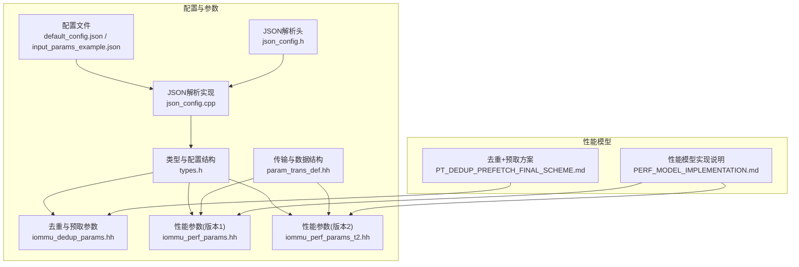
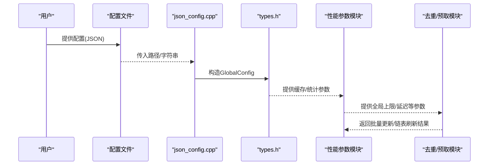
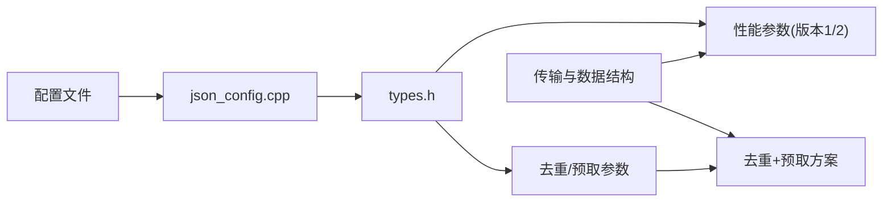
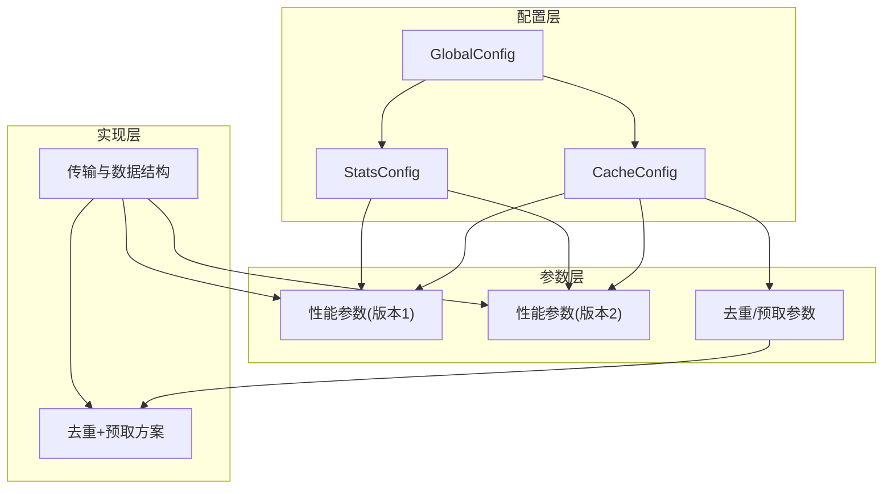

# 参数参考表

<cite>
**本文引用的文件**
- [default_config.json](file://iommu/cache_config/default_config.json)
- [input_params_example.json](file://iommu/cache_config/input_params_example.json)
- [json_config.h](file://iommu/cache_src/common/json_config.h)
- [json_config.cpp](file://iommu/cache_src/common/json_config.cpp)
- [types.h](file://iommu/cache_src/common/types.h)
- [iommu_dedup_params.hh](file://iommu/include/iommu_dedup_params.hh)
- [iommu_perf_params.hh](file://iommu/iommu_perf_model/iommu_perf_params.hh)
- [iommu_perf_params_t2.hh](file://iommu/iommu_perf_model/iommu_perf_params_t2.hh)
- [param_trans_def.hh](file://iommu/include/param_trans_def.hh)
- [PERF_MODEL_IMPLEMENTATION.md](file://PERF_MODEL_IMPLEMENTATION.md)
- [PT_DEDUP_PREFETCH_FINAL_SCHEME.md](file://PT_DEDUP_PREFETCH_FINAL_SCHEME.md)
</cite>

## 目录
1. [简介](#简介)
2. [项目结构](#项目结构)
3. [核心组件](#核心组件)
4. [架构总览](#架构总览)
5. [详细组件分析](#详细组件分析)
6. [依赖关系分析](#依赖关系分析)
7. [性能考量](#性能考量)
8. [故障排查指南](#故障排查指南)
9. [结论](#结论)
10. [附录](#附录)

## 简介
本文件面向IOMMU性能与缓存建模系统，提供完整的参数参考表，覆盖缓存配置、性能参数、去重与预取参数、以及系统级参数。内容按功能分类组织，包含参数名称、类型、默认值、取值范围、作用说明与影响分析，并给出参数之间的依赖关系图、常用参数组合推荐及快速查找与对比工具。

## 项目结构
系统主要由以下模块构成：
- 缓存配置与解析：default_config.json、input_params_example.json、json_config.*、types.h
- 性能参数：iommu_perf_params.hh、iommu_perf_params_t2.hh
- 去重与预取参数：iommu_dedup_params.hh、PT_DEDUP_PREFETCH_FINAL_SCHEME.md
- 传输与数据结构：param_trans_def.hh
- 性能模型实现说明：PERF_MODEL_IMPLEMENTATION.md

**图表来源**
- [default_config.json:1-69](file://iommu/cache_config/default_config.json#L1-L69)
- [input_params_example.json:1-69](file://iommu/cache_config/input_params_example.json#L1-L69)
- [json_config.h:1-18](file://iommu/cache_src/common/json_config.h#L1-L18)
- [json_config.cpp:1-144](file://iommu/cache_src/common/json_config.cpp#L1-L144)
- [types.h:580-628](file://iommu/cache_src/common/types.h#L580-L628)
- [iommu_dedup_params.hh:1-92](file://iommu/include/iommu_dedup_params.hh#L1-L92)
- [iommu_perf_params.hh:1-161](file://iommu/iommu_perf_model/iommu_perf_params.hh#L1-L161)
- [iommu_perf_params_t2.hh:1-154](file://iommu/iommu_perf_model/iommu_perf_params_t2.hh#L1-L154)
- [param_trans_def.hh:1-130](file://iommu/include/param_trans_def.hh#L1-L130)
- [PERF_MODEL_IMPLEMENTATION.md:1-227](file://PERF_MODEL_IMPLEMENTATION.md#L1-L227)
- [PT_DEDUP_PREFETCH_FINAL_SCHEME.md:1-944](file://PT_DEDUP_PREFETCH_FINAL_SCHEME.md#L1-L944)

**章节来源**
- [default_config.json:1-69](file://iommu/cache_config/default_config.json#L1-L69)
- [input_params_example.json:1-69](file://iommu/cache_config/input_params_example.json#L1-L69)
- [json_config.h:1-18](file://iommu/cache_src/common/json_config.h#L1-L18)
- [json_config.cpp:1-144](file://iommu/cache_src/common/json_config.cpp#L1-L144)
- [types.h:580-628](file://iommu/cache_src/common/types.h#L580-L628)
- [iommu_dedup_params.hh:1-92](file://iommu/include/iommu_dedup_params.hh#L1-L92)
- [iommu_perf_params.hh:1-161](file://iommu/iommu_perf_model/iommu_perf_params.hh#L1-L161)
- [iommu_perf_params_t2.hh:1-154](file://iommu/iommu_perf_model/iommu_perf_params_t2.hh#L1-L154)
- [param_trans_def.hh:1-130](file://iommu/include/param_trans_def.hh#L1-L130)
- [PERF_MODEL_IMPLEMENTATION.md:1-227](file://PERF_MODEL_IMPLEMENTATION.md#L1-L227)
- [PT_DEDUP_PREFETCH_FINAL_SCHEME.md:1-944](file://PT_DEDUP_PREFETCH_FINAL_SCHEME.md#L1-L944)

## 核心组件
本节梳理系统参数的主要来源与职责：
- 配置文件与解析：default_config.json与input_params_example.json定义缓存与统计参数；json_config.cpp负责解析并合并默认值。
- 类型与配置结构：types.h定义GlobalConfig、CacheConfig、StatsConfig等结构，承载解析后的参数对象。
- 性能参数：iommu_perf_params.hh与iommu_perf_params_t2.hh分别提供不同场景下的性能参数集合。
- 去重与预取参数：iommu_dedup_params.hh定义去重缓冲、预取深度、页大小等常量；PT_DEDUP_PREFETCH_FINAL_SCHEME.md描述硬件实现细节。
- 传输与数据结构：param_trans_def.hh定义PayloadExtention与NocTransaction等传输层结构。

**章节来源**
- [json_config.cpp:33-131](file://iommu/cache_src/common/json_config.cpp#L33-L131)
- [types.h:580-628](file://iommu/cache_src/common/types.h#L580-L628)
- [iommu_perf_params.hh:1-161](file://iommu/iommu_perf_model/iommu_perf_params.hh#L1-L161)
- [iommu_perf_params_t2.hh:1-154](file://iommu/iommu_perf_model/iommu_perf_params_t2.hh#L1-L154)
- [iommu_dedup_params.hh:1-92](file://iommu/include/iommu_dedup_params.hh#L1-L92)
- [PT_DEDUP_PREFETCH_FINAL_SCHEME.md:1-944](file://PT_DEDUP_PREFETCH_FINAL_SCHEME.md#L1-L944)
- [param_trans_def.hh:1-130](file://iommu/include/param_trans_def.hh#L1-L130)

## 架构总览
参数在系统中的流向如下：
- 配置文件被解析为GlobalConfig对象
- GlobalConfig包含各缓存的CacheConfig与统计配置
- 性能参数模块读取GlobalConfig与硬编码常量，驱动性能模型运行
- 去重与预取参数在PT Cache与PTW之间协同工作，通过批量更新与Buffer链表管理实现高效处理

**图表来源**
- [json_config.cpp:33-131](file://iommu/cache_src/common/json_config.cpp#L33-L131)
- [types.h:610-623](file://iommu/cache_src/common/types.h#L610-L623)
- [iommu_perf_params.hh:1-161](file://iommu/iommu_perf_model/iommu_perf_params.hh#L1-L161)
- [PT_DEDUP_PREFETCH_FINAL_SCHEME.md:363-386](file://PT_DEDUP_PREFETCH_FINAL_SCHEME.md#L363-L386)

## 详细组件分析

### 缓存配置参数（JSON）
- 全局参数
  - clock_period_ns: 数值型，单位ns，默认值见示例文件
  - random_seed: 整数型，默认值见示例文件
- 缓存时序参数（通用）
  - arbiter_latency_cycles: 整数型，默认值见示例文件
  - hash_latency_cycles: 整数型，默认值见示例文件
  - read_set_latency_cycles: 整数型，默认值见示例文件
  - compare_latency_cycles: 整数型，默认值见示例文件
  - update_way_select_latency_cycles: 整数型，默认值见示例文件
  - fill_compute_index_hit_cycles: 整数型，默认值见示例文件
  - fill_compute_index_invalid_cycles: 整数型，默认值见示例文件
  - fill_compute_index_replacement_cycles: 整数型，默认值见示例文件
  - write_way_latency_cycles: 整数型，默认值见示例文件
  - invalidation_compare_per_way_cycles: 整数型，默认值见示例文件
- 各缓存配置
  - dc_cache: num_sets、num_ways、replacement、srrip_m_bits（若适用）
  - pc_cache: num_sets、num_ways、replacement、srrip_m_bits（若适用）
  - msipt_cache: num_sets、num_ways、replacement、srrip_m_bits（若适用）
  - pt_cache: num_sets、num_ways、replacement、srrip_m_bits（若适用）
  - walker_cache: base_sets、ptw_c1、ptw_c2、ptw_c3（含num_ways与replacement）
- 统计参数
  - output_file: 字符串，默认值见示例文件
  - enable_latency_histogram: 布尔型，默认值见示例文件
  - enable_task_trace: 布尔型，默认值见示例文件
  - task_trace_level: 字符串枚举，默认值见示例文件
  - histogram_bin_width_ns: 浮点型，默认值见示例文件

作用说明与影响分析
- 时序参数直接影响缓存命中/替换/失效等关键路径的延迟建模
- 缓存规模（sets/ways）与替换策略（如plru/srrip）影响命中率与替换开销
- Walker Cache层级配置影响页表walk的命中率与DDR访问次数
- 统计参数决定输出粒度与可观测性

**章节来源**
- [default_config.json:1-69](file://iommu/cache_config/default_config.json#L1-L69)
- [input_params_example.json:1-69](file://iommu/cache_config/input_params_example.json#L1-L69)
- [json_config.cpp:10-131](file://iommu/cache_src/common/json_config.cpp#L10-L131)
- [types.h:584-623](file://iommu/cache_src/common/types.h#L584-L623)

### 性能参数（iommu_perf_params.hh）
- FIFO深度参数：涵盖Parser、Collector、Cache、Walker、DDR等路径的FIFO深度
- 缓存参数：DC/PC/PT/MSIPT缓存的容量、关联度、行大小
- AXI ID与端口并发：最大AXI ID数、初始ID池大小、各Master/Slave端口并发上限
- DDR性能：最大未完成请求数、读写延迟、带宽
- Walker Outstanding限制：xDTW与PTW/MSIPTW的outstanding上限
- PTW模块参数：Walker Cache开关
- PT Cache VA去重与去重+预取：开关、Buffer大小、预取深度、无效索引标记
- Collector Outstanding限制：DC/PC walk的outstanding上限
- 处理延迟：Parser、Collector、各Cache命中延迟、各Walker延迟、Forwarder延迟
- 出口重排序与全局Outstanding：整体outstanding上限、重排序输出延迟
- SLINK NoC延迟：单趟NoC延时
- 稳态IOPS采样窗口：稳态起止百分比
- 系统参数：最大并发任务数、设备数、进程数、设备ID位宽

作用说明与影响分析
- FIFO深度影响流水线吞吐与背压行为
- 缓存参数决定命中率与带宽占用
- 并发限制与DDR延迟共同决定整体延迟与带宽利用率
- 预留的去重/预取参数为后续优化提供接口

**章节来源**
- [iommu_perf_params.hh:1-161](file://iommu/iommu_perf_model/iommu_perf_params.hh#L1-L161)

### 性能参数（iommu_perf_params_t2.hh）
- 与版本1类似，但在FIFO深度、Walker Outstanding、SLINK NoC延迟等方面存在差异
- 适用于不同测试场景或性能目标

作用说明与影响分析
- 版本差异体现在对吞吐与延迟的不同权衡
- 选择版本时需结合具体测试目标与硬件条件

**章节来源**
- [iommu_perf_params_t2.hh:1-154](file://iommu/iommu_perf_model/iommu_perf_params_t2.hh#L1-L154)

### 去重与预取参数（iommu_dedup_params.hh）
- Dedup Buffer容量与背压策略
- PT Cache占位CL的标志位位置（is_ph、is_req）
- 预取深度与默认启用状态、Burst读取PTE上限
- PTE有效性标记与状态枚举
- 页大小与掩码、页表页大小与掩码
- Sv39地址翻译参数（VPN/PPN位数、级数、PTE大小）

作用说明与影响分析
- Buffer容量与背压策略影响高并发场景下的稳定性
- 预取深度与Burst上限影响DDR访问效率
- 标志位与页参数为硬件实现提供位级约束

**章节来源**
- [iommu_dedup_params.hh:1-92](file://iommu/include/iommu_dedup_params.hh#L1-L92)

### PT Cache去重+预取（PT_DEDUP_PREFETCH_FINAL_SCHEME.md）
- Buffer链表管理：head_index、tail_index规则与链表遍历
- 批量更新：PTW一次性返回1+D个PTE，PT Cache批量更新
- 预取执行：PTW顺序读取主PTE与D个预取PTE，等待完成后批量返回
- 刷新流程：从Buffer链表头开始遍历，计算PA并转发任务，释放Buffer

作用说明与影响分析
- 去重+预取显著降低重复walk与DDR访问
- 批量更新减少消息开销，提升吞吐
- Buffer链表管理确保任务有序刷新与资源回收

**章节来源**
- [PT_DEDUP_PREFETCH_FINAL_SCHEME.md:1-944](file://PT_DEDUP_PREFETCH_FINAL_SCHEME.md#L1-L944)

### 传输与数据结构（param_trans_def.hh）
- PayloadExtention与NocTransaction：扩展传输层元信息（源/目的地址、IO ID、序列号、消息类型、PASID等）
- 为性能模型与系统交互提供统一的事务接口

作用说明与影响分析
- 统一的传输结构便于调试与统计
- PASID等字段支撑多租户与权限控制

**章节来源**
- [param_trans_def.hh:1-130](file://iommu/include/param_trans_def.hh#L1-L130)

## 依赖关系分析
参数之间的依赖关系如下：
- 配置文件解析依赖types.h中的结构定义
- 性能参数模块依赖解析后的GlobalConfig与硬编码常量
- 去重/预取参数与性能参数共同影响PT Cache与PTW的行为
- 传输层结构为各模块间通信提供基础

**图表来源**
- [json_config.cpp:33-131](file://iommu/cache_src/common/json_config.cpp#L33-L131)
- [types.h:610-623](file://iommu/cache_src/common/types.h#L610-L623)
- [iommu_perf_params.hh:1-161](file://iommu/iommu_perf_model/iommu_perf_params.hh#L1-L161)
- [iommu_perf_params_t2.hh:1-154](file://iommu/iommu_perf_model/iommu_perf_params_t2.hh#L1-L154)
- [iommu_dedup_params.hh:1-92](file://iommu/include/iommu_dedup_params.hh#L1-L92)
- [PT_DEDUP_PREFETCH_FINAL_SCHEME.md:1-944](file://PT_DEDUP_PREFETCH_FINAL_SCHEME.md#L1-L944)
- [param_trans_def.hh:1-130](file://iommu/include/param_trans_def.hh#L1-L130)

**章节来源**
- [json_config.cpp:33-131](file://iommu/cache_src/common/json_config.cpp#L33-L131)
- [types.h:580-628](file://iommu/cache_src/common/types.h#L580-L628)
- [iommu_perf_params.hh:1-161](file://iommu/iommu_perf_model/iommu_perf_params.hh#L1-L161)
- [iommu_perf_params_t2.hh:1-154](file://iommu/iommu_perf_model/iommu_perf_params_t2.hh#L1-L154)
- [iommu_dedup_params.hh:1-92](file://iommu/include/iommu_dedup_params.hh#L1-L92)
- [PT_DEDUP_PREFETCH_FINAL_SCHEME.md:1-944](file://PT_DEDUP_PREFETCH_FINAL_SCHEME.md#L1-L944)
- [param_trans_def.hh:1-130](file://iommu/include/param_trans_def.hh#L1-L130)

## 性能考量
- 缓存规模与关联度：增大sets/ways可提升命中率，但增加比较与替换开销
- FIFO深度：过小导致流水线停顿，过大增加内存占用与延迟
- 并发限制与DDR延迟：需平衡outstanding与带宽，避免拥塞
- 预留的去重/预取参数为吞吐优化提供空间，需结合业务特征调整

[本节为通用指导，无需特定文件来源]

## 故障排查指南
- 配置解析失败：检查配置文件语法与字段命名，确认json_config.cpp对各字段的解析逻辑
- 缓存异常：核对CacheConfig的sets/ways与replacement策略，检查时序参数是否合理
- 性能瓶颈：评估FIFO深度、outstanding限制与DDR延迟，必要时切换性能参数版本
- 去重/预取问题：检查Buffer容量、预取深度与批量更新流程，确认链表刷新逻辑

**章节来源**
- [json_config.cpp:133-141](file://iommu/cache_src/common/json_config.cpp#L133-L141)
- [types.h:584-623](file://iommu/cache_src/common/types.h#L584-L623)
- [iommu_perf_params.hh:1-161](file://iommu/iommu_perf_model/iommu_perf_params.hh#L1-L161)
- [PT_DEDUP_PREFETCH_FINAL_SCHEME.md:363-386](file://PT_DEDUP_PREFETCH_FINAL_SCHEME.md#L363-L386)

## 结论
本文提供了IOMMU系统参数的完整参考，涵盖缓存配置、性能参数、去重与预取参数及传输层结构。通过参数依赖关系图与常用组合建议，可帮助用户在不同场景下进行参数调优与性能优化。

[本节为总结性内容，无需特定文件来源]

## 附录

### 参数参考表（按功能分类）
- 缓存配置（JSON）
  - clock_period_ns: 数值型，单位ns，示例默认值见配置文件
  - random_seed: 整数型，示例默认值见配置文件
  - arbiter_latency_cycles: 整数型，示例默认值见配置文件
  - hash_latency_cycles: 整数型，示例默认值见配置文件
  - read_set_latency_cycles: 整数型，示例默认值见配置文件
  - compare_latency_cycles: 整数型，示例默认值见配置文件
  - update_way_select_latency_cycles: 整数型，示例默认值见配置文件
  - fill_compute_index_hit_cycles: 整数型，示例默认值见配置文件
  - fill_compute_index_invalid_cycles: 整数型，示例默认值见配置文件
  - fill_compute_index_replacement_cycles: 整数型，示例默认值见配置文件
  - write_way_latency_cycles: 整数型，示例默认值见配置文件
  - invalidation_compare_per_way_cycles: 整数型，示例默认值见配置文件
  - dc_cache.num_sets/num_ways/replacement/srrip_m_bits: 整数型/字符串，示例默认值见配置文件
  - pc_cache.num_sets/num_ways/replacement/srrip_m_bits: 整数型/字符串，示例默认值见配置文件
  - msipt_cache.num_sets/num_ways/replacement/srrip_m_bits: 整数型/字符串，示例默认值见配置文件
  - pt_cache.num_sets/num_ways/replacement/srrip_m_bits: 整数型/字符串，示例默认值见配置文件
  - walker_cache.base_sets、ptw_c1/ptw_c2/ptw_c3的num_ways与replacement: 整数型/字符串，示例默认值见配置文件
  - statistics.output_file: 字符串，示例默认值见配置文件
  - statistics.enable_latency_histogram: 布尔型，示例默认值见配置文件
  - statistics.enable_task_trace: 布尔型，示例默认值见配置文件
  - statistics.task_trace_level: 字符串枚举，示例默认值见配置文件
  - statistics.histogram_bin_width_ns: 浮点型，示例默认值见配置文件

- 性能参数（iommu_perf_params.hh）
  - FIFO深度：Parser/Collector/Cache/Walker/DDR等路径的深度
  - 缓存参数：DC/PC/PT/MSIPT缓存容量、关联度、行大小
  - AXI ID与端口并发：最大AXI ID数、初始ID池大小、各Master/Slave端口并发上限
  - DDR性能：最大未完成请求数、读写延迟、带宽
  - Walker Outstanding限制：xDTW与PTW/MSIPTW的outstanding上限
  - PTW模块参数：Walker Cache开关
  - PT Cache VA去重与去重+预取：开关、Buffer大小、预取深度、无效索引标记
  - Collector Outstanding限制：DC/PC walk的outstanding上限
  - 处理延迟：Parser、Collector、各Cache命中延迟、各Walker延迟、Forwarder延迟
  - 出口重排序与全局Outstanding：整体outstanding上限、重排序输出延迟
  - SLINK NoC延迟：单趟NoC延时
  - 稳态IOPS采样窗口：稳态起止百分比
  - 系统参数：最大并发任务数、设备数、进程数、设备ID位宽

- 性能参数（iommu_perf_params_t2.hh）
  - 与版本1类似，但FIFO深度、Walker Outstanding、SLINK NoC延迟等存在差异

- 去重与预取参数（iommu_dedup_params.hh）
  - DEDUP_BUFFER_CAPACITY: 整数型，容量
  - DEDUP_BUFFER_BACKPRESSURE: 布尔型，背压策略
  - PT_RESERVED_IS_PH_BIT/PT_RESERVED_IS_REQ_BIT: 整数型，标志位位置
  - BUFFER_CHAIN_END: 字节型，链表尾标记
  - DEFAULT_PREFETCH_DEPTH/PREFETCH_ENABLED_BY_DEFAULT: 整数型/布尔型，预取深度与默认启用
  - MAX_BURST_PTE_COUNT: 整数型，Burst读取PTE上限
  - PTE_VALID_MASK: 位掩码，PTE有效标志
  - PTEStatus枚举：PTE有效/无效/错误/保留
  - PAGE_SIZE_4KB/PAGE_MASK_4KB/PT_PAGE_SIZE/PT_PAGE_MASK: 常量，页大小与掩码
  - SV39_VPN_BITS/SV39_PPN_BITS/SV39_LEVELS/PTE_SIZE: 常量，Sv39地址翻译参数

- 传输与数据结构（param_trans_def.hh）
  - PayloadExtention：扩展传输层元信息（源/目的地址、IO ID、序列号、消息类型、PASID等）
  - NocTransaction：基于tlm_generic_payload的事务封装

**章节来源**
- [default_config.json:1-69](file://iommu/cache_config/default_config.json#L1-L69)
- [input_params_example.json:1-69](file://iommu/cache_config/input_params_example.json#L1-L69)
- [json_config.cpp:10-131](file://iommu/cache_src/common/json_config.cpp#L10-L131)
- [types.h:584-623](file://iommu/cache_src/common/types.h#L584-L623)
- [iommu_perf_params.hh:1-161](file://iommu/iommu_perf_model/iommu_perf_params.hh#L1-L161)
- [iommu_perf_params_t2.hh:1-154](file://iommu/iommu_perf_model/iommu_perf_params_t2.hh#L1-L154)
- [iommu_dedup_params.hh:1-92](file://iommu/include/iommu_dedup_params.hh#L1-L92)
- [param_trans_def.hh:1-130](file://iommu/include/param_trans_def.hh#L1-L130)

### 参数依赖关系图

**图表来源**
- [types.h:610-623](file://iommu/cache_src/common/types.h#L610-L623)
- [iommu_perf_params.hh:1-161](file://iommu/iommu_perf_model/iommu_perf_params.hh#L1-L161)
- [iommu_perf_params_t2.hh:1-154](file://iommu/iommu_perf_model/iommu_perf_params_t2.hh#L1-L154)
- [iommu_dedup_params.hh:1-92](file://iommu/include/iommu_dedup_params.hh#L1-L92)
- [PT_DEDUP_PREFETCH_FINAL_SCHEME.md:1-944](file://PT_DEDUP_PREFETCH_FINAL_SCHEME.md#L1-L944)
- [param_trans_def.hh:1-130](file://iommu/include/param_trans_def.hh#L1-L130)

### 常用参数组合推荐
- 高吞吐/低延迟场景
  - 增大PT Cache容量与关联度，适度提高FIFO深度
  - 启用去重+预取（D=8），配合批量更新
  - 适当提高DDR最大outstanding与带宽
- 稳定性优先场景
  - 降低预取深度，启用背压策略
  - 保守设置FIFO深度，避免拥塞
  - 选择版本2参数集以适配长链路NoC延迟

[本节为通用建议，无需特定文件来源]

### 快速查找与对比工具
- 配置文件对比：使用文本编辑器或diff工具对比default_config.json与input_params_example.json，识别差异字段
- 参数解析验证：通过json_config.cpp提供的load_config/parse_config接口，验证配置文件合法性
- 性能参数对照：在iommu_perf_params.hh与iommu_perf_params_t2.hh之间切换，对比FIFO深度与延迟差异
- 去重/预取验证：依据PT_DEDUP_PREFETCH_FINAL_SCHEME.md的流程，核对批量更新与链表刷新逻辑

**章节来源**
- [json_config.cpp:133-141](file://iommu/cache_src/common/json_config.cpp#L133-L141)
- [iommu_perf_params.hh:1-161](file://iommu/iommu_perf_model/iommu_perf_params.hh#L1-L161)
- [iommu_perf_params_t2.hh:1-154](file://iommu/iommu_perf_model/iommu_perf_params_t2.hh#L1-L154)
- [PT_DEDUP_PREFETCH_FINAL_SCHEME.md:363-386](file://PT_DEDUP_PREFETCH_FINAL_SCHEME.md#L363-L386)