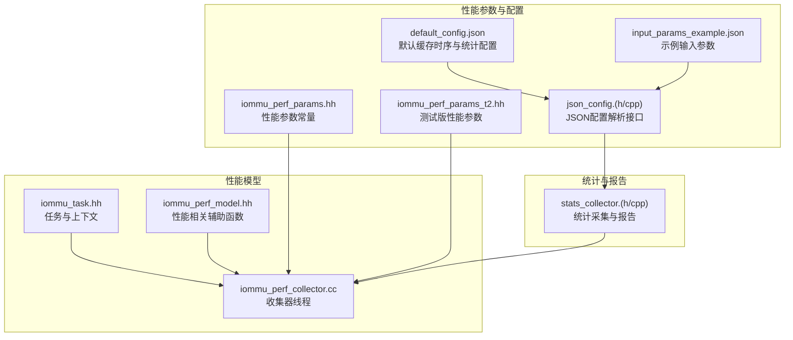
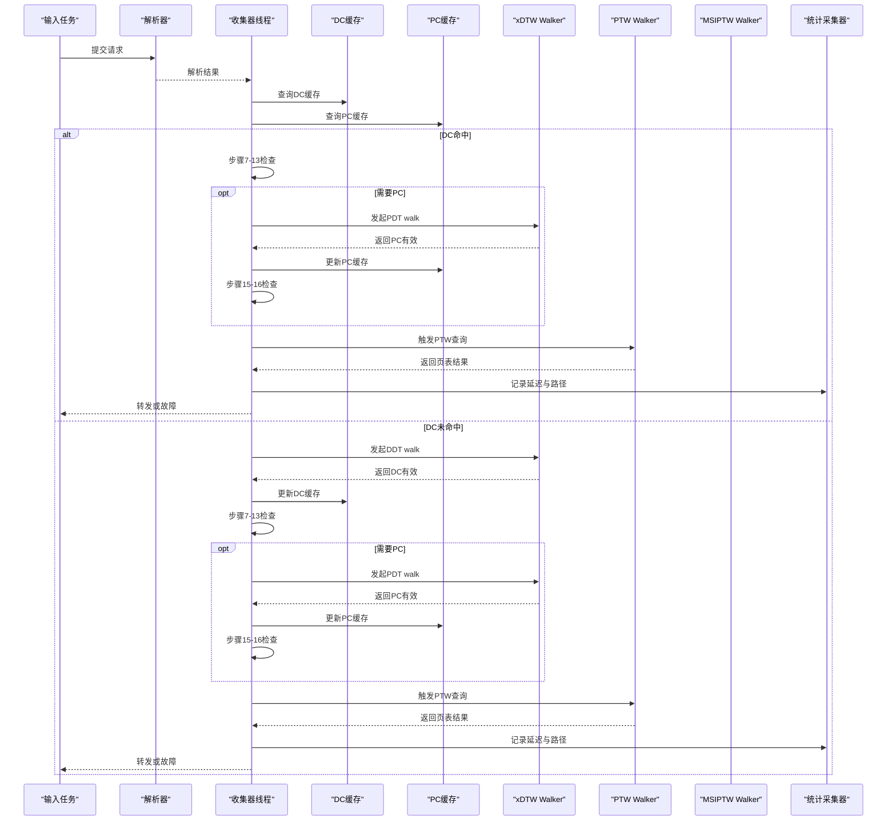
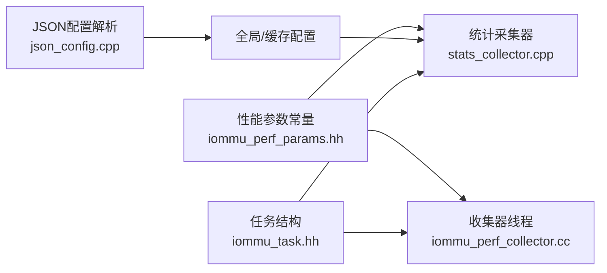

# 性能参数

<cite>
**本文引用的文件**
- [iommu_perf_params.hh](file://iommu/iommu_perf_model/iommu_perf_params.hh)
- [iommu_perf_params_t2.hh](file://iommu/iommu_perf_model/iommu_perf_params_t2.hh)
- [default_config.json](file://iommu/cache_config/default_config.json)
- [input_params_example.json](file://iommu/cache_config/input_params_example.json)
- [stats_collector.h](file://iommu/cache_src/common/stats_collector.h)
- [stats_collector.cpp](file://iommu/cache_src/common/stats_collector.cpp)
- [json_config.h](file://iommu/cache_src/common/json_config.h)
- [json_config.cpp](file://iommu/cache_src/common/json_config.cpp)
- [iommu_perf_collector.cc](file://iommu/iommu_perf_model/iommu_perf_collector.cc)
- [iommu_task.hh](file://iommu/include/iommu_task.hh)
- [iommu_perf_model.hh](file://iommu/include/iommu_perf_model.hh)
</cite>

## 目录
1. [简介](#简介)
2. [项目结构](#项目结构)
3. [核心组件](#核心组件)
4. [架构总览](#架构总览)
5. [详细组件分析](#详细组件分析)
6. [依赖关系分析](#依赖关系分析)
7. [性能考量](#性能考量)
8. [故障排查指南](#故障排查指南)
9. [结论](#结论)
10. [附录](#附录)

## 简介
本文件聚焦于IOMMU性能模型中的“性能相关配置参数”，系统性地解释以下内容：
- 时序参数：仲裁延迟、哈希延迟、读集延迟等缓存时序参数，以及处理延迟（解析、收集、缓存命中、Walker访问、转发等）。
- 统计参数：输出文件、直方图、任务跟踪等统计采集配置。
- 性能参数对仿真精度与运行效率的影响。
- 不同性能需求下的参数调整策略。
- 性能监控与分析工具的配置说明。

## 项目结构
围绕性能配置的关键目录与文件如下：
- 性能参数定义：iommu/iommu_perf_model/iommu_perf_params.hh、iommu/iommu_perf_model/iommu_perf_params_t2.hh
- 缓存时序与统计配置：iommu/cache_config/default_config.json、iommu/cache_config/input_params_example.json
- 统计采集与报告：iommu/cache_src/common/stats_collector.h、iommu/cache_src/common/stats_collector.cpp、iommu/cache_src/common/json_config.h、iommu/cache_src/common/json_config.cpp
- 性能模型与任务数据结构：iommu/iommu_perf_model/iommu_perf_collector.cc、iommu/include/iommu_task.hh、iommu/include/iommu_perf_model.hh

图表来源
- [iommu_perf_params.hh:1-161](file://iommu/iommu_perf_model/iommu_perf_params.hh#L1-L161)
- [iommu_perf_params_t2.hh:1-154](file://iommu/iommu_perf_model/iommu_perf_params_t2.hh#L1-L154)
- [default_config.json:1-69](file://iommu/cache_config/default_config.json#L1-L69)
- [input_params_example.json:1-69](file://iommu/cache_config/input_params_example.json#L1-L69)
- [json_config.cpp:1-144](file://iommu/cache_src/common/json_config.cpp#L1-L144)
- [stats_collector.cpp:1-640](file://iommu/cache_src/common/stats_collector.cpp#L1-L640)
- [iommu_perf_collector.cc:1-457](file://iommu/iommu_perf_model/iommu_perf_collector.cc#L1-L457)
- [iommu_task.hh:1-378](file://iommu/include/iommu_task.hh#L1-L378)
- [iommu_perf_model.hh:1-197](file://iommu/include/iommu_perf_model.hh#L1-L197)

章节来源
- [iommu_perf_params.hh:1-161](file://iommu/iommu_perf_model/iommu_perf_params.hh#L1-L161)
- [default_config.json:1-69](file://iommu/cache_config/default_config.json#L1-L69)
- [stats_collector.h:1-196](file://iommu/cache_src/common/stats_collector.h#L1-L196)

## 核心组件
- 性能参数常量：定义FIFO深度、缓存容量/关联度/行宽、AXI ID与带宽、DDR访问限制、Walker outstanding上限、处理延迟、重排序与全局outstanding、NoC延迟、稳态IOPS采样窗口、系统规模上限等。
- JSON配置：从JSON加载全局时钟周期、随机种子、缓存时序参数、各缓存规模与替换策略、Walker Cache层次、统计输出文件、直方图与任务跟踪开关及粒度。
- 统计采集器：记录缓存命中/缺失/驱逐/失效、预取命中率、执行/排队/请求延迟、RAM访问路径分解、阶段化时间戳、区间命中率、IOPS与端口利用率等，并生成统一报告与直方图。
- 收集器线程：实现多线程收集流程，控制outstanding上限，路由任务至Walker或转发器，负责故障处理与状态转换。
- 任务与上下文：定义任务状态机、Walker阶段、预取与批处理、DDR访问日志等，支撑统计与性能分析。

章节来源
- [iommu_perf_params.hh:6-161](file://iommu/iommu_perf_model/iommu_perf_params.hh#L6-L161)
- [json_config.cpp:33-131](file://iommu/cache_src/common/json_config.cpp#L33-L131)
- [stats_collector.cpp:227-600](file://iommu/cache_src/common/stats_collector.cpp#L227-L600)
- [iommu_perf_collector.cc:14-275](file://iommu/iommu_perf_model/iommu_perf_collector.cc#L14-L275)
- [iommu_task.hh:20-182](file://iommu/include/iommu_task.hh#L20-L182)

## 架构总览
下图展示性能参数如何影响I/O路径与统计采集的整体流程。

图表来源
- [iommu_perf_collector.cc:14-275](file://iommu/iommu_perf_model/iommu_perf_collector.cc#L14-L275)
- [stats_collector.cpp:91-133](file://iommu/cache_src/common/stats_collector.cpp#L91-L133)

## 详细组件分析

### 时序参数与处理延迟
- 缓存时序参数（来自JSON配置）：仲裁延迟、哈希延迟、读集延迟、比较延迟、更新方式选择延迟、索引计算命中/无效/替换延迟、写通路延迟、逐路失效比较延迟等。这些参数直接影响缓存执行时间与直方图分布。
- 处理延迟（来自性能参数常量）：解析器、收集器、各类缓存命中、Walker每次访问、转发器等固定延迟，用于建模流水线串行开销。
- Walker与DDR参数：Walker outstanding上限、请求/响应流水延时、最大未完成请求数、DDR读写延迟与带宽、端口并发限制等，决定内存访问瓶颈与吞吐。

章节来源
- [default_config.json:7-18](file://iommu/cache_config/default_config.json#L7-L18)
- [json_config.cpp:10-21](file://iommu/cache_src/common/json_config.cpp#L10-L21)
- [iommu_perf_params.hh:126-147](file://iommu/iommu_perf_model/iommu_perf_params.hh#L126-L147)
- [iommu_perf_params.hh:102-108](file://iommu/iommu_perf_model/iommu_perf_params.hh#L102-L108)
- [iommu_perf_params.hh:78-101](file://iommu/iommu_perf_model/iommu_perf_params.hh#L78-L101)

### FIFO深度与并发限制
- FIFO深度：Parser到Collector、Collector到Cache、Cache到Walker、Walker返回Collector/Cache、最终输出路径、DDR交互等均有独立深度定义，用于背压与流水线解耦。
- 并发限制：Collector与Walker的outstanding上限、全局outstanding上限、AXI Master端口并发限制等，防止拥塞与死锁。
- 端口带宽：通过频率×位宽计算带宽，结合延迟公式估算端到端时延。

章节来源
- [iommu_perf_params.hh:6-52](file://iommu/iommu_perf_model/iommu_perf_params.hh#L6-L52)
- [iommu_perf_params.hh:122-142](file://iommu/iommu_perf_model/iommu_perf_params.hh#L122-L142)
- [iommu_perf_params.hh:88-101](file://iommu/iommu_perf_model/iommu_perf_params.hh#L88-L101)

### 统计参数与报告
- 输出文件：指定统计日志文件名；若未显式设置，使用默认名称。
- 直方图：开启/关闭执行延迟直方图，设置bin宽度（纳秒）。
- 任务跟踪：开启/关闭任务跟踪，设置跟踪级别（如detail/off）。
- 报告内容：命中率、预取准确率、平均执行/排队/请求延迟、IOPS、RAM端口利用率、阶段化时间戳、区间命中率、任务放大系数等。

章节来源
- [default_config.json:61-67](file://iommu/cache_config/default_config.json#L61-L67)
- [input_params_example.json:61-67](file://iommu/cache_config/input_params_example.json#L61-L67)
- [json_config.cpp:114-128](file://iommu/cache_src/common/json_config.cpp#L114-L128)
- [stats_collector.h:162-176](file://iommu/cache_src/common/stats_collector.h#L162-L176)
- [stats_collector.cpp:227-600](file://iommu/cache_src/common/stats_collector.cpp#L227-L600)

### 收集器线程与outstanding控制
- 收集器线程：并行处理解析结果与缓存响应，完成路由决策，控制DC/PC outstanding，向Walker或转发器发送任务。
- outstanding上限：针对DC/PC walk分别设置上限，超过则阻塞直至完成事件通知，保障稳定性与可控性。

章节来源
- [iommu_perf_collector.cc:14-275](file://iommu/iommu_perf_model/iommu_perf_collector.cc#L14-L275)
- [iommu_perf_params.hh:122-125](file://iommu/iommu_perf_model/iommu_perf_params.hh#L122-L125)

### 任务与上下文：预取、批处理与DDR日志
- 预取与批处理：支持预取深度、组内任务管理、合并Burst读取，提升内存带宽利用。
- DDR访问日志：记录每次DDR访问类型、层级、地址、大小，便于回放与分析。
- Walker阶段：明确xDTW/PTW/MSIPTW阶段，便于统计与调试。

章节来源
- [iommu_task.hh:82-182](file://iommu/include/iommu_task.hh#L82-L182)
- [iommu_task.hh:369-376](file://iommu/include/iommu_task.hh#L369-L376)

## 依赖关系分析
- 性能参数常量被收集器线程与统计采集器广泛使用，用于控制流水线节奏与统计口径。
- JSON配置解析器将用户配置映射到全局与缓存配置对象，再由统计采集器读取并生成报告。
- 任务结构贯穿整个翻译与转发流程，承载统计所需的时间戳与路径信息。

图表来源
- [iommu_perf_params.hh:126-147](file://iommu/iommu_perf_model/iommu_perf_params.hh#L126-L147)
- [iommu_perf_collector.cc:14-275](file://iommu/iommu_perf_model/iommu_perf_collector.cc#L14-L275)
- [json_config.cpp:33-131](file://iommu/cache_src/common/json_config.cpp#L33-L131)
- [stats_collector.cpp:227-600](file://iommu/cache_src/common/stats_collector.cpp#L227-L600)
- [iommu_task.hh:185-378](file://iommu/include/iommu_task.hh#L185-L378)

## 性能考量
- 仿真精度与运行效率的权衡
  - 更细粒度的缓存时序参数（仲裁、哈希、读集、比较、索引计算、写通路、失效比较）能提升仿真精度，但会增加统计样本数量与直方图分辨率，从而影响运行效率。
  - 处理延迟（解析、收集、缓存命中、Walker访问、转发）直接影响流水线吞吐与排队长度，需根据目标平台特性进行校准。
  - FIFO深度与并发限制是关键瓶颈点：过小导致流水线停顿，过大可能放大内存占用与统计噪声。
  - 直方图bin宽度越小，分辨率越高，但内存与I/O开销越大；任务跟踪级别越高，日志量越大，对仿真性能影响显著。
- 参数调整策略
  - 高精度仿真：启用直方图与详细任务跟踪，降低bin宽度，适度提高缓存时序参数分辨率；适当增大FIFO深度与outstanding上限以减少阻塞。
  - 高效仿真：关闭直方图或降低bin宽度，降低任务跟踪级别；收紧FIFO深度与outstanding上限，减少排队与内存压力。
  - 稳态分析：利用稳态IOPS采样窗口（跳过首尾10%），仅统计中间80%稳定段，提高IOPS估计可靠性。
- 影响路径
  - 缓存时序参数→执行延迟直方图→统计准确性
  - FIFO深度/并发限制→排队与吞吐→IOPS与端口利用率
  - 处理延迟→流水线节奏→整体时延与吞吐
  - 直方图与任务跟踪→日志与I/O→仿真效率

章节来源
- [default_config.json:61-67](file://iommu/cache_config/default_config.json#L61-L67)
- [stats_collector.cpp:558-600](file://iommu/cache_src/common/stats_collector.cpp#L558-L600)
- [iommu_perf_params.hh:149-152](file://iommu/iommu_perf_model/iommu_perf_params.hh#L149-L152)

## 故障排查指南
- 统计报告核验
  - 检查执行/排队/请求延迟样本数，确认统计口径一致性（执行延迟不含排队，请求延迟含排队）。
  - 对比阶段化时间戳与窗口，确保无超时或负值异常。
  - 关注任务放大系数（RAM访问次数/原始任务数），评估预取与批处理效果。
- 日志与追踪
  - 若任务跟踪开启，注意日志体量与磁盘I/O开销；必要时降低级别或关闭。
  - DDR访问日志可用于定位内存瓶颈与访问模式异常。
- 并发与阻塞
  - outstanding超限会导致阻塞与延迟尖峰；可通过增大上限或优化上游流量控制缓解。
  - FIFO深度不足会引发流水线停顿；应结合带宽与延迟模型重新评估。

章节来源
- [stats_collector.cpp:227-600](file://iommu/cache_src/common/stats_collector.cpp#L227-L600)
- [iommu_task.hh:369-376](file://iommu/include/iommu_task.hh#L369-L376)
- [iommu_perf_collector.cc:94-100](file://iommu/iommu_perf_model/iommu_perf_collector.cc#L94-L100)

## 结论
- 性能参数通过“时序参数（缓存时序与处理延迟）+统计参数（输出文件、直方图、任务跟踪）+并发与FIFO约束”共同决定仿真精度与运行效率。
- 针对不同需求（高精度/高效仿），应动态调整直方图分辨率、任务跟踪级别、FIFO深度与outstanding上限，并结合稳态窗口与IOPS指标进行验证。
- 统计采集器提供了全面的观测维度（命中率、预取准确率、延迟直方图、阶段化时间戳、任务放大系数、端口利用率），是性能调优与问题定位的核心工具。

## 附录
- 配置文件路径与用途
  - default_config.json：默认缓存时序与统计配置模板
  - input_params_example.json：示例输入参数，便于快速上手
  - json_config.(h/cpp)：从JSON加载全局与缓存配置，解析统计参数
  - stats_collector.(h/cpp)：统计采集、直方图与统一报告
  - iommu_perf_params.hh/t2.hh：性能参数常量定义
  - iommu_perf_collector.cc：收集器线程实现
  - iommu_task.hh：任务与上下文结构
  - iommu_perf_model.hh：性能相关辅助函数与宏