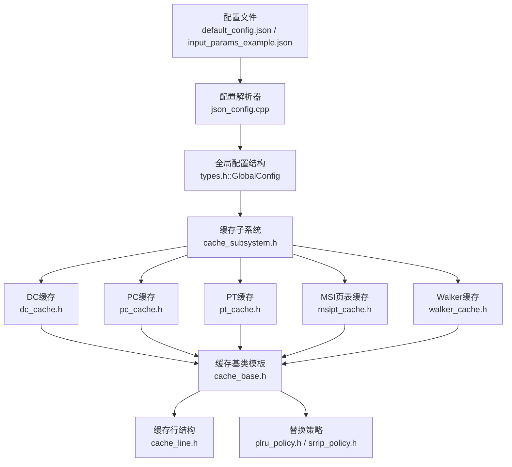
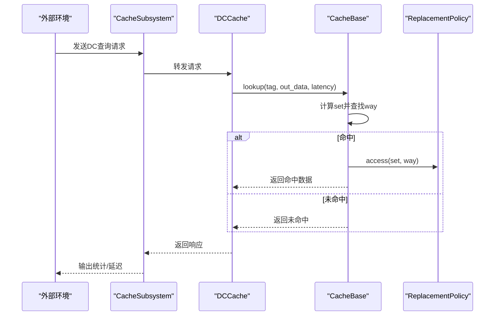
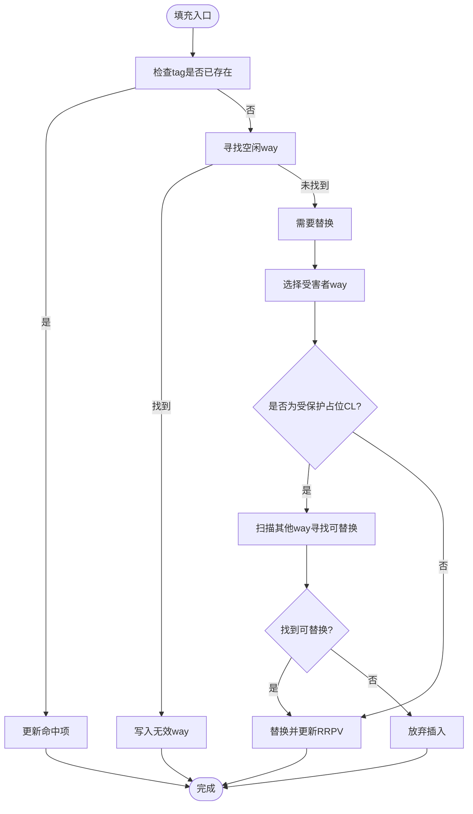
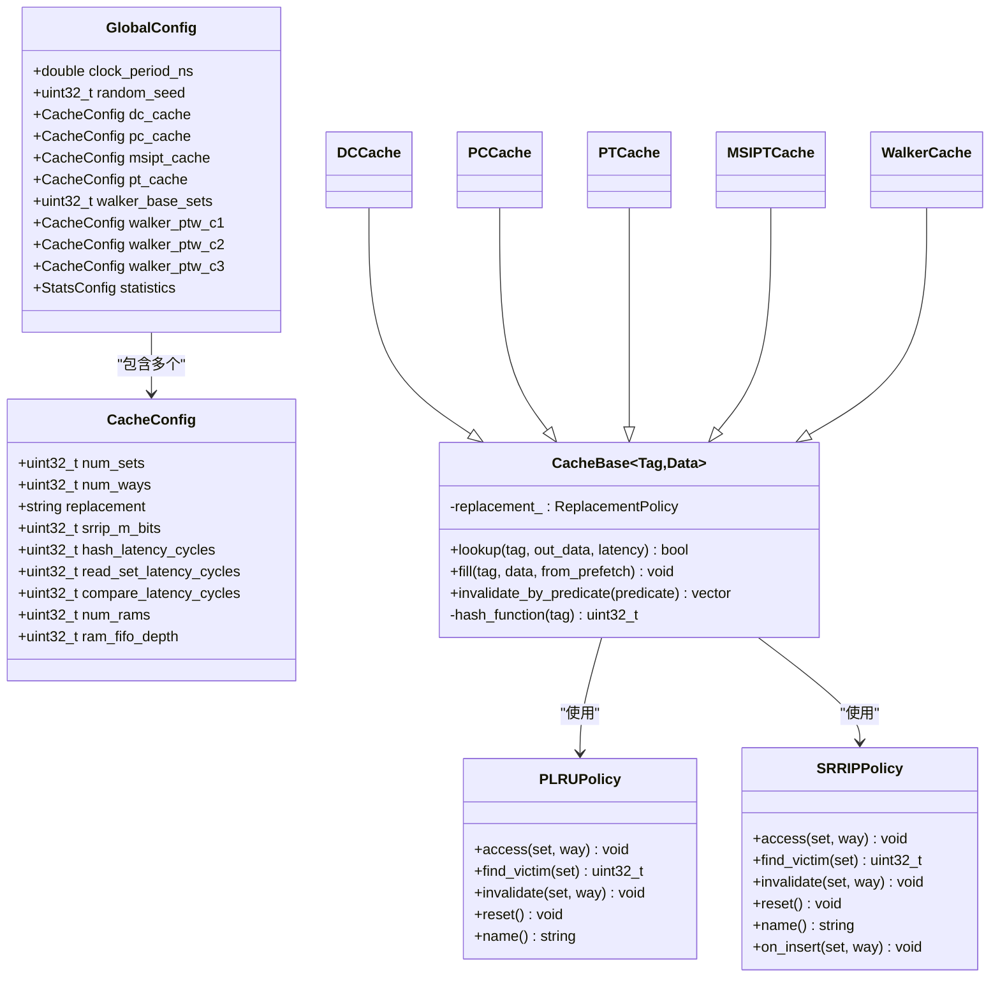

# 缓存配置

<cite>
**本文档引用的文件**
- [default_config.json](file://iommu/cache_config/default_config.json)
- [input_params_example.json](file://iommu/cache_config/input_params_example.json)
- [types.h](file://iommu/cache_src/common/types.h)
- [json_config.cpp](file://iommu/cache_src/common/json_config.cpp)
- [cache_base.h](file://iommu/cache_src/cache/cache_base.h)
- [cache_line.h](file://iommu/cache_src/cache/cache_line.h)
- [plru_policy.h](file://iommu/cache_src/replacement/plru_policy.h)
- [srrip_policy.h](file://iommu/cache_src/replacement/srrip_policy.h)
- [dc_cache.h](file://iommu/cache_src/cache/dc_cache.h)
- [pc_cache.h](file://iommu/cache_src/cache/pc_cache.h)
- [pt_cache.h](file://iommu/cache_src/cache/pt_cache.h)
- [msipt_cache.h](file://iommu/cache_src/cache/msipt_cache.h)
- [walker_cache.h](file://iommu/cache_src/cache/walker_cache.h)
- [cache_subsystem.h](file://iommu/cache_src/subsystem/cache_subsystem.h)
</cite>

## 更新摘要
**变更内容**   
- **重要更新**：DC缓存的read_set_latency_cycles从1调整为0，这是针对DC Cache原子操作延迟的重要性能调优
- 新的时序分解为Arbiter(1) + Hash(1) + ReadSet(0) + Compare(0) = 2ns总延迟
- 更新了相关配置说明和性能考量
- 新增多RAM配置参数num_rams和ram_fifo_depth的作用与调优
- 新增缓存失效功能的配置选项与支持

## 目录
1. [简介](#简介)
2. [项目结构](#项目结构)
3. [核心组件](#核心组件)
4. [架构总览](#架构总览)
5. [详细组件分析](#详细组件分析)
6. [依赖关系分析](#依赖关系分析)
7. [性能考量](#性能考量)
8. [故障排查指南](#故障排查指南)
9. [结论](#结论)
10. [附录](#附录)

## 简介
本文件面向IOMMU缓存系统的使用者与维护者，提供DC缓存、PC缓存、PT缓存、MSIPT缓存与Walker缓存的完整配置说明。内容涵盖：
- 各缓存的num_sets、num_ways、replacement等关键参数的作用与影响
- 替换策略选择依据（PLRU、SRIP、无替换）
- 缓存容量与性能的权衡建议
- 参数调优最佳实践与常见配置模式
- **重要更新**：DC缓存read_set_latency_cycles性能优化，从1周期降至0周期
- **新增**：多RAM配置参数num_rams和ram_fifo_depth的作用与调优
- **新增**：缓存失效功能的配置选项与支持

## 项目结构
缓存系统采用"配置驱动 + 统一基类 + 策略替换"的设计：
- 配置文件（JSON）定义各缓存的容量、替换策略与性能建模参数
- 统一基类负责缓存组织、仲裁、延迟建模与统计
- 策略模块提供PLRU与SRIP两种替换算法
- 各专用缓存（DC/PC/PT/MSIPT/Walker）继承基类并实现特有接口

**图表来源**
- [default_config.json:1-94](file://iommu/cache_config/default_config.json#L1-L94)
- [json_config.cpp:23-131](file://iommu/cache_src/common/json_config.cpp#L23-L131)
- [types.h:635-702](file://iommu/cache_src/common/types.h#L635-L702)
- [cache_subsystem.h:19-189](file://iommu/cache_src/subsystem/cache_subsystem.h#L19-L189)
- [cache_base.h:26-264](file://iommu/cache_src/cache/cache_base.h#L26-L264)
- [cache_line.h:1-100](file://iommu/cache_src/cache/cache_line.h#L1-L100)
- [plru_policy.h:10-33](file://iommu/cache_src/replacement/plru_policy.h#L10-L33)
- [srrip_policy.h:10-33](file://iommu/cache_src/replacement/srrip_policy.h#L10-L33)

**章节来源**
- [default_config.json:1-94](file://iommu/cache_config/default_config.json#L1-L94)
- [input_params_example.json:1-69](file://iommu/cache_config/input_params_example.json#L1-L69)
- [types.h:635-702](file://iommu/cache_src/common/types.h#L635-L702)
- [json_config.cpp:23-131](file://iommu/cache_src/common/json_config.cpp#L23-L131)
- [cache_subsystem.h:19-189](file://iommu/cache_src/subsystem/cache_subsystem.h#L19-L189)

## 核心组件
- 配置结构体
  - CacheConfig：定义num_sets、num_ways、replacement、srrip_m_bits以及各类延迟建模参数
  - **重要更新**：DC缓存的read_set_latency_cycles已优化为0周期
  - **新增**：num_rams控制多RAM数量，ram_fifo_depth控制RAM FIFO深度
  - GlobalConfig：聚合各缓存配置与统计配置
- 统一基类
  - CacheBase<Tag,Data>：封装set索引、way查找、替换算法接入、仲裁与延迟建模、失效流程与统计
- 缓存行结构
  - cache_line.h：定义缓存行的数据结构和操作接口
- 替换策略
  - PLRUPolicy：基于树的伪LRU，适合多路组相联
  - SRRIPPolicy：静态RIP，维护M比特RRPV，适合需要预测再引用间隔的场景
- 专用缓存
  - DC/PC/MSIPT：设备/进程/MSI页表缓存，提供特有查询与失效接口
  - PT：页表缓存，支持去重与预取，包含占位CL保护机制
  - Walker：三级页表遍历缓存，包含PTWc1/2/3三张子表

**章节来源**
- [types.h:635-702](file://iommu/cache_src/common/types.h#L635-L702)
- [cache_base.h:26-264](file://iommu/cache_src/cache/cache_base.h#L26-L264)
- [cache_line.h:1-100](file://iommu/cache_src/cache/cache_line.h#L1-L100)
- [plru_policy.h:10-33](file://iommu/cache_src/replacement/plru_policy.h#L10-L33)
- [srrip_policy.h:10-33](file://iommu/cache_src/replacement/srrip_policy.h#L10-L33)
- [dc_cache.h:8-31](file://iommu/cache_src/cache/dc_cache.h#L8-L31)
- [pc_cache.h:8-33](file://iommu/cache_src/cache/pc_cache.h#L8-L33)
- [pt_cache.h:8-80](file://iommu/cache_src/cache/pt_cache.h#L8-L80)
- [msipt_cache.h:8-27](file://iommu/cache_src/cache/msipt_cache.h#L8-L27)
- [walker_cache.h:15-104](file://iommu/cache_src/cache/walker_cache.h#L15-L104)

## 架构总览
缓存子系统通过FIFO与专用线程驱动各缓存模块，统一进行仲裁与统计。配置文件决定各缓存的容量与替换策略，基类负责执行lookup/fill/invalidate的延迟建模。

**图表来源**
- [cache_subsystem.h:101-133](file://iommu/cache_src/subsystem/cache_subsystem.h#L101-L133)
- [cache_base.h:267-307](file://iommu/cache_src/cache/cache_base.h#L267-L307)
- [plru_policy.h:12-20](file://iommu/cache_src/replacement/plru_policy.h#L12-L20)
- [srrip_policy.h:13-21](file://iommu/cache_src/replacement/srrip_policy.h#L13-L21)

**章节来源**
- [cache_subsystem.h:19-189](file://iommu/cache_src/subsystem/cache_subsystem.h#L19-L189)
- [cache_base.h:267-307](file://iommu/cache_src/cache/cache_base.h#L267-L307)

## 详细组件分析

### DC缓存（设备上下文）
- 关键参数
  - num_sets：默认64
  - num_ways：默认4
  - replacement：默认plru
  - **重要更新**：read_set_latency_cycles：从1周期优化为0周期，显著提升原子操作性能
  - **新增**：num_rams：控制RAM数量，影响并行访问能力
  - **新增**：ram_fifo_depth：RAM FIFO深度，缓冲并发访问
- 作用与影响
  - 缓存设备上下文，支撑设备级翻译与权限
  - 较小的num_sets与适中num_ways在命中率与延迟之间取得平衡
  - **性能优化**：read_set_latency_cycles=0使DC缓存的原子操作延迟降低，新时序为Arbiter(1) + Hash(1) + ReadSet(0) + Compare(0) = 2ns总延迟
  - 多RAM配置提升高并发场景下的吞吐能力
- 替换策略选择
  - 4路组相联配合PLRU，兼顾公平性与局部性
- 配置要点
  - 若设备上下文频繁变化，可考虑增大num_ways或调整num_sets
  - 保持replacement为plru以获得稳定性能
  - 高并发场景可适当增加num_rams提升带宽
  - **性能调优**：read_set_latency_cycles=0已针对DC缓存的原子操作特性进行了专门优化

**章节来源**
- [default_config.json:20-25](file://iommu/cache_config/default_config.json#L20-L25)
- [input_params_example.json:20-24](file://iommu/cache_config/input_params_example.json#L20-L24)
- [dc_cache.h:8-31](file://iommu/cache_src/cache/dc_cache.h#L8-L31)

### PC缓存（进程上下文）
- 关键参数
  - num_sets：默认64
  - num_ways：默认4
  - replacement：默认plru
  - read_set_latency_cycles：默认1周期
  - **新增**：num_rams：控制RAM数量
  - **新增**：ram_fifo_depth：RAM FIFO深度
- 作用与影响
  - 缓存进程上下文，支撑进程级翻译
  - 与DC缓存协同工作，减少重复查询
  - 多RAM配置改善进程切换频繁的访问模式
- 替换策略选择
  - 4路组相联配合PLRU，适合中等并发场景
- 配置要点
  - 若进程切换频繁，可适度增加num_ways提升命中
  - 根据内存带宽需求调整num_rams和ram_fifo_depth

**章节来源**
- [default_config.json:27-32](file://iommu/cache_config/default_config.json#L27-L32)
- [input_params_example.json:26-30](file://iommu/cache_config/input_params_example.json#L26-L30)
- [pc_cache.h:8-33](file://iommu/cache_src/cache/pc_cache.h#L8-L33)

### MSIPT缓存（MSI页表）
- 关键参数
  - num_sets：默认64
  - num_ways：默认4
  - replacement：默认plru
  - **新增**：num_rams：控制RAM数量
  - **新增**：ram_fifo_depth：RAM FIFO深度
- 作用与影响
  - 缓存MSI相关的页表项，降低MSI路径开销
  - 多RAM配置提升MSI中断处理的并发性能
- 替换策略选择
  - 4路组相联配合PLRU，满足一般MSI访问模式
- 配置要点
  - 根据MSI负载特性调整多RAM配置

**章节来源**
- [default_config.json:34-38](file://iommu/cache_config/default_config.json#L34-L38)
- [input_params_example.json:32-36](file://iommu/cache_config/input_params_example.json#L32-L36)
- [msipt_cache.h:8-27](file://iommu/cache_src/cache/msipt_cache.h#L8-L27)

### PT缓存（页表）
- 关键参数
  - num_sets：默认1024
  - num_ways：默认8
  - replacement：默认srrip
  - srrip_m_bits：默认2
  - **新增**：num_rams：控制RAM数量
  - **新增**：ram_fifo_depth：RAM FIFO深度
- 作用与影响
  - 缓存页表项，显著降低页表遍历开销
  - 大容量与高路数配合SRIP，提升复杂地址空间的命中
  - 多RAM配置大幅改善大规模页表遍历的吞吐量
- 替换策略选择
  - SRIP通过M比特RRPV预测再引用间隔，适合长尾访问模式
  - m_bits越大，对远期访问的容忍度越高，但内存占用与更新开销上升
- PT去重与预取
  - 支持占位CL与批量更新，**已简化**：移除is_ph、head_index、is_req字段，结构更简洁
  - 保留占位CL保护机制避免预取导致的替换风暴
- 配置要点
  - 高并发/大地址空间场景建议增大num_sets与num_ways
  - 若替换开销敏感，可适当减小m_bits或调整num_ways
  - 根据内存带宽需求合理配置num_rams和ram_fifo_depth

**图表来源**
- [cache_base.h:354-472](file://iommu/cache_src/cache/cache_base.h#L354-L472)
- [srrip_policy.h:13-33](file://iommu/cache_src/replacement/srrip_policy.h#L13-L33)

**章节来源**
- [default_config.json:40-47](file://iommu/cache_config/default_config.json#L40-L47)
- [input_params_example.json:38-43](file://iommu/cache_config/input_params_example.json#L38-L43)
- [pt_cache.h:8-80](file://iommu/cache_src/cache/pt_cache.h#L8-L80)
- [cache_base.h:354-472](file://iommu/cache_src/cache/cache_base.h#L354-L472)

### Walker缓存（页表遍历）
- 关键参数
  - base_sets：默认64
  - PTWc1：num_ways=1，replacement=none（直接映射）
  - PTWc2：num_ways=2，replacement=plru
  - PTWc3：num_ways=4，replacement=plru
  - **新增**：num_rams：控制每层RAM数量
  - **新增**：ram_fifo_depth：控制每层RAM FIFO深度
- 作用与影响
  - 分层缓存各级页表中间结果，加速VA->PA的遍历过程
  - PTWc1为直接映射，延迟最低；PTWc2/3为组相联，命中更高
  - 多RAM配置提升页表遍历的并发处理能力
- 配置要点
  - 保证PTWc1容量与base_sets一致，避免直接映射冲突
  - 在资源允许下提高PTWc2/3的num_ways可进一步降低miss
  - 根据遍历负载调整各层的RAM配置

**章节来源**
- [default_config.json:56-76](file://iommu/cache_config/default_config.json#L56-L76)
- [input_params_example.json:45-59](file://iommu/cache_config/input_params_example.json#L45-L59)
- [walker_cache.h:15-104](file://iommu/cache_src/cache/walker_cache.h#L15-L104)
- [json_config.cpp:96-129](file://iommu/cache_src/common/json_config.cpp#L96-L129)

## 依赖关系分析
- 配置到运行时
  - JSON配置经解析生成GlobalConfig
  - CacheSubsystem按配置构造各缓存实例
  - CacheBase根据CacheConfig选择替换策略并初始化
  - **新增**：解析器现在支持num_rams和ram_fifo_depth参数
- 替换策略依赖
  - PLRU：适用于多路组相联，树状bit维护访问顺序
  - SRIP：维护RRPV，适合长尾访问，需要额外存储与更新开销
- **新增**：多RAM管理
  - num_rams控制物理RAM实例数量
  - ram_fifo_depth管理并发访问的缓冲深度

**图表来源**
- [types.h:635-702](file://iommu/cache_src/common/types.h#L635-L702)
- [cache_base.h:26-264](file://iommu/cache_src/cache/cache_base.h#L26-L264)
- [plru_policy.h:12-33](file://iommu/cache_src/replacement/plru_policy.h#L12-L33)
- [srrip_policy.h:13-33](file://iommu/cache_src/replacement/srrip_policy.h#L13-L33)
- [dc_cache.h:8-31](file://iommu/cache_src/cache/dc_cache.h#L8-L31)
- [pc_cache.h:8-33](file://iommu/cache_src/cache/pc_cache.h#L8-L33)
- [pt_cache.h:8-80](file://iommu/cache_src/cache/pt_cache.h#L8-L80)
- [msipt_cache.h:8-27](file://iommu/cache_src/cache/msipt_cache.h#L8-L27)
- [walker_cache.h:15-104](file://iommu/cache_src/cache/walker_cache.h#L15-L104)

**章节来源**
- [types.h:635-702](file://iommu/cache_src/common/types.h#L635-L702)
- [cache_base.h:243-260](file://iommu/cache_src/cache/cache_base.h#L243-L260)

## 性能考量
- num_sets与num_ways的权衡
  - 增大num_sets可降低冲突miss，但增加set索引与比较开销
  - 增大num_ways可提升命中率，但替换与仲裁复杂度上升
- 替换策略选择
  - PLRU：低开销、均衡表现，适合大多数组相联场景
  - SRIP：对长尾访问友好，但需要额外RRPV存储与更新
  - 无替换：仅适用于直接映射（1-way），延迟最低但易miss
- **重要性能优化**：DC缓存read_set_latency_cycles优化
  - **关键变更**：DC缓存的read_set_latency_cycles从1周期优化为0周期
  - **性能影响**：新时序分解为Arbiter(1) + Hash(1) + ReadSet(0) + Compare(0) = 2ns总延迟
  - **适用场景**：特别针对DC Cache原子操作的延迟优化，显著提升设备上下文访问性能
  - **对比分析**：相比之前1周期的ReadSet延迟，减少了50%的访问延迟
- **新增**：多RAM配置优化
  - num_rams：增加RAM数量可提升并行访问带宽，但增加面积和功耗
  - ram_fifo_depth：适当增加FIFO深度可缓冲突发访问，但增加延迟抖动
  - 需要根据具体负载的并发度和突发特征进行调优
- 延迟建模参数
  - hash_latency_cycles、read_set_latency_cycles、compare_latency_cycles等直接影响lookup/fill/invalidate的延迟
  - fill_compute_index_*_cycles区分命中、无效way与替换三种路径，合理设置可逼近真实硬件
- PT缓存特殊性
  - 占位CL保护机制避免预取导致的替换风暴
  - SRIP的m_bits影响RRPV范围，进而影响替换倾向
  - **已简化**：reserved_t结构移除冗余字段，降低内存占用

**章节来源**
- [cache_base.h:216-249](file://iommu/cache_src/cache/cache_base.h#L216-L249)
- [cache_base.h:354-472](file://iommu/cache_src/cache/cache_base.h#L354-L472)
- [srrip_policy.h:13-33](file://iommu/cache_src/replacement/srrip_policy.h#L13-L33)

## 故障排查指南
- 命中率偏低
  - 检查num_sets是否过小导致冲突过多
  - 评估是否需要增大num_ways或更换替换策略（如PT缓存考虑SRIP）
- 替换异常或预取失效
  - 确认PT缓存的占位CL保护逻辑未阻止必要替换
  - 检查m_bits设置是否过小导致频繁驱逐活跃项
- 延迟异常
  - 校验配置中的延迟建模参数是否与目标平台匹配
  - 关注仲裁权重与ram_port争用情况
  - **新增**：检查num_rams和ram_fifo_depth配置是否合理
  - **性能调优**：DC缓存的read_set_latency_cycles=0已针对原子操作优化，如需调整需重新评估时序
- 失效不生效
  - 确认invalidate_mode（PRECISE/SCAN/GLOBAL）与目标范围匹配
  - 检查predicate是否正确匹配tag/data
- **新增**：多RAM相关问题
  - 检查num_rams是否超过硬件限制
  - 验证ram_fifo_depth是否导致缓冲区溢出
  - 监控多RAM间的负载均衡情况

**章节来源**
- [cache_base.h:474-604](file://iommu/cache_src/cache/cache_base.h#L474-L604)
- [json_config.cpp:10-21](file://iommu/cache_src/common/json_config.cpp#L10-L21)

## 结论
- DC/PC/MSIPT缓存建议维持默认的64sets×4ways与PLRU，以获得稳定的性能与较低的实现复杂度
- **重要更新**：DC缓存已通过read_set_latency_cycles=0的性能优化，特别适合原子操作场景
- PT缓存建议采用较大的sets与ways，并启用SRIP以提升复杂地址空间的命中率
- Walker缓存的三层结构在资源与性能间提供了良好折衷，可根据负载微调各层容量
- **新增**：多RAM配置应根据具体应用场景的并发需求和内存带宽要求进行针对性调优
- 配置参数应结合实际工作负载与目标平台特性进行迭代调优

## 附录

### 配置参数速查表
- 全局与延迟建模
  - clock_period_ns：时钟周期（ns）
  - cache_timing.*：仲裁、哈希、读set、比较、写way、失效比较等延迟建模参数
- DC缓存
  - num_sets：默认64
  - num_ways：默认4
  - replacement：默认plru
  - **重要更新**：read_set_latency_cycles：已从1周期优化为0周期
  - **新增**：num_rams：控制RAM数量
  - **新增**：ram_fifo_depth：RAM FIFO深度
- PC缓存
  - num_sets：默认64
  - num_ways：默认4
  - replacement：默认plru
  - read_set_latency_cycles：默认1周期
  - **新增**：num_rams：控制RAM数量
  - **新增**：ram_fifo_depth：RAM FIFO深度
- MSIPT缓存
  - num_sets：默认64
  - num_ways：默认4
  - replacement：默认plru
  - **新增**：num_rams：控制RAM数量
  - **新增**：ram_fifo_depth：RAM FIFO深度
- PT缓存
  - num_sets：默认1024
  - num_ways：默认8
  - replacement：默认srrip
  - srrip_m_bits：默认2
  - **新增**：num_rams：控制RAM数量
  - **新增**：ram_fifo_depth：RAM FIFO深度
- Walker缓存
  - base_sets：默认64
  - ptw_c1：num_ways=1，replacement=none
  - ptw_c2：num_ways=2，replacement=plru
  - ptw_c3：num_ways=4，replacement=plru
  - **新增**：各层均支持num_rams和ram_fifo_depth配置

**章节来源**
- [default_config.json:1-94](file://iommu/cache_config/default_config.json#L1-L94)
- [input_params_example.json:1-69](file://iommu/cache_config/input_params_example.json#L1-L69)
- [types.h:635-702](file://iommu/cache_src/common/types.h#L635-L702)
- [json_config.cpp:23-131](file://iommu/cache_src/common/json_config.cpp#L23-L131)