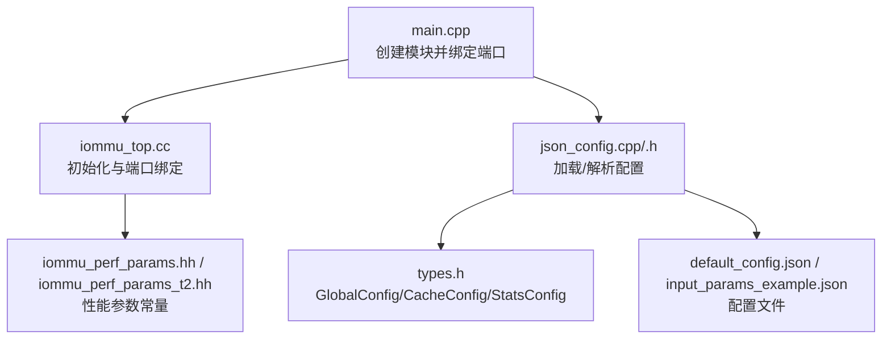
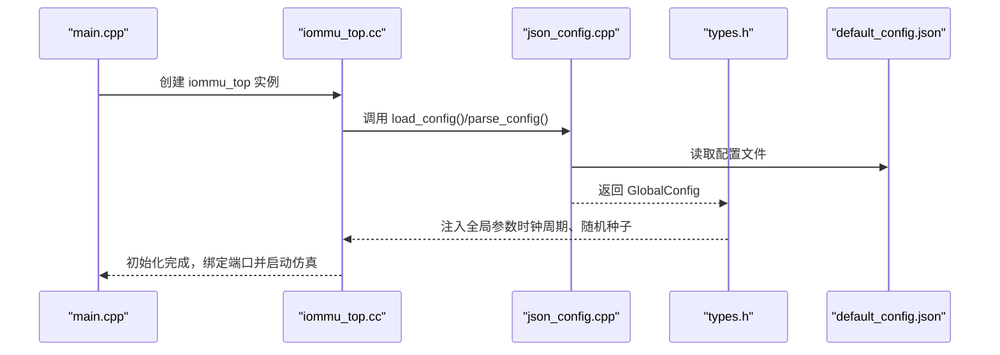
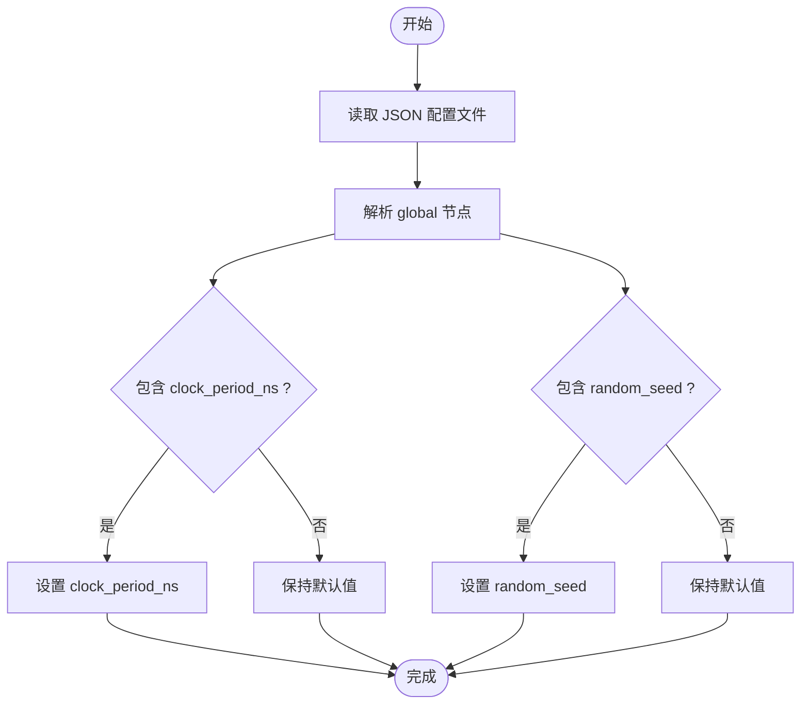
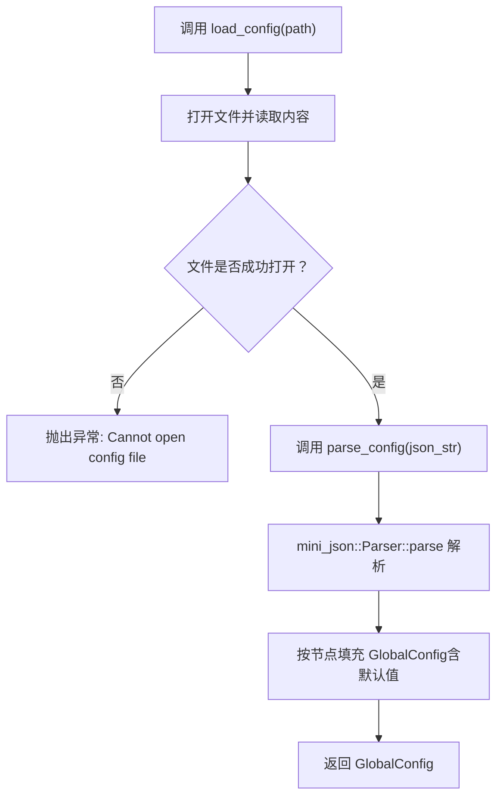
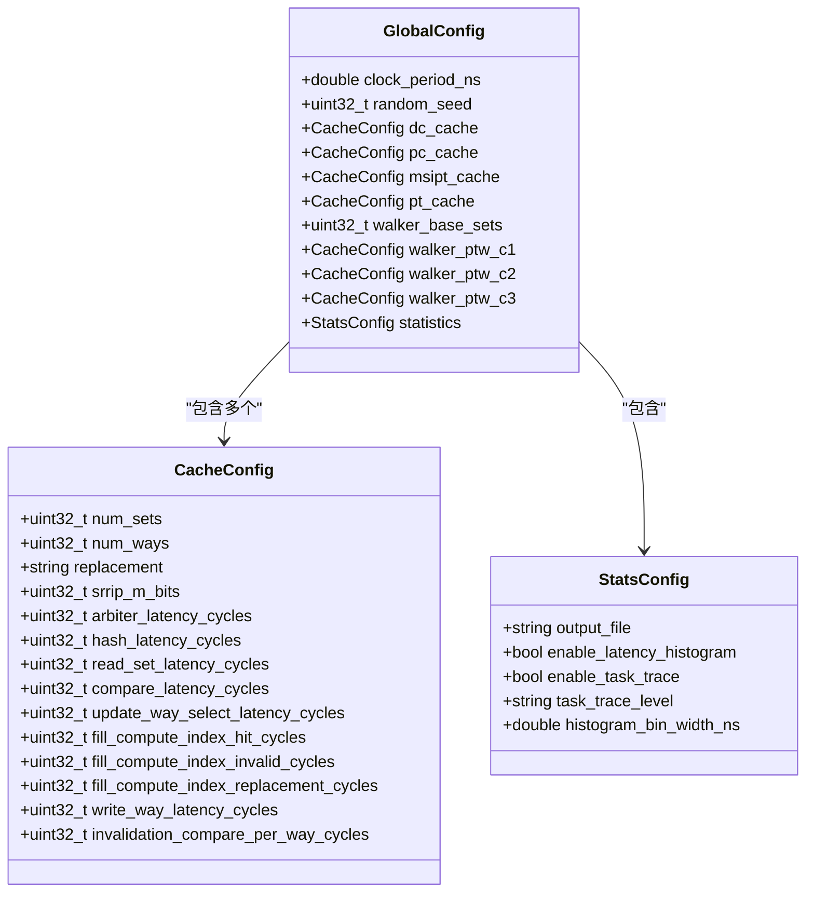
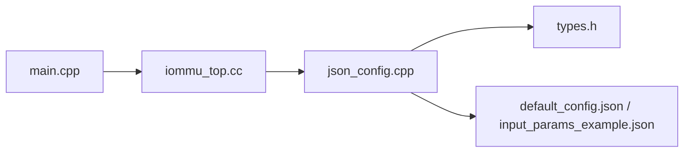

# 运行时配置

<cite>
**本文引用的文件**
- [main.cpp](file://main.cpp)
- [iommu_top.cc](file://iommu\iommu_top.cc)
- [json_config.h](file://iommu\cache_src\common\json_config.h)
- [json_config.cpp](file://iommu\cache_src\common\json_config.cpp)
- [types.h](file://iommu\cache_src\common\types.h)
- [default_config.json](file://iommu\cache_config\default_config.json)
- [input_params_example.json](file://iommu\cache_config\input_params_example.json)
- [iommu_perf_params.hh](file://iommu\iommu_perf_model\iommu_perf_params.hh)
- [iommu_perf_params_t2.hh](file://iommu\iommu_perf_model\iommu_perf_params_t2.hh)
- [iommu_perf_parser.cc](file://iommu\iommu_perf_model\iommu_perf_parser.cc)
</cite>

## 目录
1. [简介](#简介)
2. [项目结构](#项目结构)
3. [核心组件](#核心组件)
4. [架构总览](#架构总览)
5. [详细组件分析](#详细组件分析)
6. [依赖关系分析](#依赖关系分析)
7. [性能考量](#性能考量)
8. [故障排查指南](#故障排查指南)
9. [结论](#结论)
10. [附录](#附录)

## 简介
本文件聚焦于 IOMMU 性能模型与缓存仿真中的“运行时配置与参数调整”。内容涵盖：
- 全局参数（时钟周期、随机种子）的配置方法与影响
- 配置文件的加载与验证机制
- 动态参数调整的可行方案与限制条件
- 配置变更对系统行为的影响分析
- 配置文件的格式规范与校验规则

## 项目结构
围绕运行时配置的关键位置与职责：
- 配置文件：位于 iommu/cache_config 下的 JSON 文件，定义全局、缓存、统计等参数
- 配置加载与解析：iommu/cache_src/common 下的 json_config.* 提供从文件或字符串解析配置的能力
- 类型定义：types.h 中定义了 GlobalConfig、CacheConfig、StatsConfig 等结构体
- 顶层启动与绑定：main.cpp 中创建模块并绑定端口；iommu_top.cc 中进行初始化与端口绑定
- 性能参数常量：iommu_perf_params.hh 与 iommu_perf_params_t2.hh 提供静态性能参数（如 FIFO 深度、延迟、并发上限等）

**图示来源**
- [main.cpp:39-94](file://main.cpp#L39-L94)
- [iommu_top.cc:19-48](file://iommu\iommu_top.cc#L19-L48)
- [json_config.cpp:133-141](file://iommu\cache_src\common\json_config.cpp#L133-L141)
- [types.h:610-623](file://iommu\cache_src\common\types.h#L610-L623)
- [default_config.json:1-69](file://iommu\cache_config\default_config.json#L1-L69)
- [input_params_example.json:1-69](file://iommu\cache_config\input_params_example.json#L1-L69)
- [iommu_perf_params.hh:1-161](file://iommu\iommu_perf_model\iommu_perf_params.hh#L1-L161)
- [iommu_perf_params_t2.hh:1-154](file://iommu\iommu_perf_model\iommu_perf_params_t2.hh#L1-L154)

**章节来源**
- [main.cpp:39-94](file://main.cpp#L39-L94)
- [iommu_top.cc:19-48](file://iommu\iommu_top.cc#L19-L48)
- [json_config.h:9-13](file://iommu\cache_src\common\json_config.h#L9-L13)
- [json_config.cpp:133-141](file://iommu\cache_src\common\json_config.cpp#L133-L141)
- [types.h:610-623](file://iommu\cache_src\common\types.h#L610-L623)
- [default_config.json:1-69](file://iommu\cache_config\default_config.json#L1-L69)
- [input_params_example.json:1-69](file://iommu\cache_config\input_params_example.json#L1-L69)
- [iommu_perf_params.hh:1-161](file://iommu\iommu_perf_model\iommu_perf_params.hh#L1-L161)
- [iommu_perf_params_t2.hh:1-154](file://iommu\iommu_perf_model\iommu_perf_params_t2.hh#L1-L154)

## 核心组件
- 全局配置结构 GlobalConfig：包含 clock_period_ns、random_seed，以及各缓存配置与统计配置
- 缓存配置结构 CacheConfig：包含缓存容量、关联度、替换策略、SRRIPlru 参数及各类时序延迟
- 统计配置结构 StatsConfig：输出文件、直方图、任务跟踪等
- 配置加载接口：
  - load_config：从 JSON 文件路径加载并解析
  - parse_config：从 JSON 字符串解析
- 配置文件示例：default_config.json 与 input_params_example.json

**章节来源**
- [types.h:610-623](file://iommu\cache_src\common\types.h#L610-L623)
- [json_config.h:9-13](file://iommu\cache_src\common\json_config.h#L9-L13)
- [json_config.cpp:33-141](file://iommu\cache_src\common\json_config.cpp#L33-L141)
- [default_config.json:1-69](file://iommu\cache_config\default_config.json#L1-L69)
- [input_params_example.json:1-69](file://iommu\cache_config\input_params_example.json#L1-L69)

## 架构总览
运行时配置在系统中的位置与交互：

**图示来源**
- [main.cpp:39-94](file://main.cpp#L39-L94)
- [iommu_top.cc:19-48](file://iommu\iommu_top.cc#L19-L48)
- [json_config.cpp:133-141](file://iommu\cache_src\common\json_config.cpp#L133-L141)
- [types.h:610-623](file://iommu\cache_src\common\types.h#L610-L623)
- [default_config.json:1-69](file://iommu\cache_config\default_config.json#L1-L69)

## 详细组件分析

### 全局参数配置（时钟周期、随机种子）
- 时钟周期 clock_period_ns：用于将仿真时间与物理时间对齐，影响统计与性能指标的时间换算
- 随机种子 random_seed：用于随机化（例如统计采样、任务调度等），确保可复现实验结果
- 配置来源：JSON 文件中的 global 节点；解析后注入 GlobalConfig

**图示来源**
- [json_config.cpp:37-42](file://iommu\cache_src\common\json_config.cpp#L37-L42)
- [types.h:610-613](file://iommu\cache_src\common\types.h#L610-L613)
- [default_config.json:2-5](file://iommu\cache_config\default_config.json#L2-L5)

**章节来源**
- [json_config.cpp:37-42](file://iommu\cache_src\common\json_config.cpp#L37-L42)
- [types.h:610-613](file://iommu\cache_src\common\types.h#L610-L613)
- [default_config.json:2-5](file://iommu\cache_config\default_config.json#L2-L5)

### 配置文件加载与验证机制
- 加载流程：load_config 从文件路径打开并读取内容，随后调用 parse_config 解析
- 解析流程：parse_config 使用 mini_json 解析字符串，按节点逐项填充 GlobalConfig
- 错误处理：若无法打开文件，抛出异常
- 验证策略：采用“存在即覆盖”的策略，缺失字段使用默认值（例如缓存默认尺寸、替换策略等）

**图示来源**
- [json_config.cpp:133-141](file://iommu\cache_src\common\json_config.cpp#L133-L141)
- [json_config.cpp:33-131](file://iommu\cache_src\common\json_config.cpp#L33-L131)

**章节来源**
- [json_config.cpp:133-141](file://iommu\cache_src\common\json_config.cpp#L133-L141)
- [json_config.cpp:33-131](file://iommu\cache_src\common\json_config.cpp#L33-L131)

### 缓存与统计参数配置
- 缓存参数：num_sets、num_ways、replacement、srrip_m_bits
- 缓存时序参数：仲裁、哈希、读set、比较、way选择、填充计算index、写way、失效比较等延迟
- 统计参数：输出文件、直方图、任务跟踪级别、直方图 bin 宽度
- 默认值：部分缓存配置在解析时会应用默认值（如 DC/PC/MSIPT PT Cache 的默认尺寸与替换策略）

**图示来源**
- [types.h:610-623](file://iommu\cache_src\common\types.h#L610-L623)
- [json_config.cpp:23-31](file://iommu\cache_src\common\json_config.cpp#L23-L31)
- [json_config.cpp:49-76](file://iommu\cache_src\common\json_config.cpp#L49-L76)
- [json_config.cpp:114-128](file://iommu\cache_src\common\json_config.cpp#L114-L128)

**章节来源**
- [types.h:610-623](file://iommu\cache_src\common\types.h#L610-L623)
- [json_config.cpp:23-31](file://iommu\cache_src\common\json_config.cpp#L23-L31)
- [json_config.cpp:49-76](file://iommu\cache_src\common\json_config.cpp#L49-L76)
- [json_config.cpp:114-128](file://iommu\cache_src\common\json_config.cpp#L114-L128)

### 动态参数调整与限制
- 当前实现：配置通过 load_config/parse_config 在启动阶段一次性加载并注入 GlobalConfig
- 可行性评估：
  - 时钟周期与随机种子：属于全局仿真参数，通常在仿真开始前设定，运行中直接修改无内置支持
  - 缓存参数：属于构建期/启动期参数，运行中直接修改会导致缓存结构与数据布局不一致，不建议在运行时调整
  - 统计参数：可在运行时调整（如任务跟踪级别、直方图bin宽度），但需确保不会破坏统计一致性
- 建议方案：
  - 通过外部脚本在启动前生成新配置文件，重启仿真
  - 若确需运行时调整，应在顶层模块增加参数更新接口，并保证与各子系统状态一致（复杂度高，需谨慎设计）

**章节来源**
- [json_config.cpp:133-141](file://iommu\cache_src\common\json_config.cpp#L133-L141)
- [types.h:610-623](file://iommu\cache_src\common\types.h#L610-L623)

### 配置变更对系统行为的影响分析
- 时钟周期 clock_period_ns：
  - 影响仿真时间与统计指标的时间换算，进而影响吞吐、延迟统计的绝对值
- 随机种子 random_seed：
  - 影响随机化行为（如采样、调度），导致不同种子下的统计结果差异
- 缓存参数：
  - num_sets/num_ways 改变缓存容量与冲突概率，直接影响命中率与抖动
  - replacement 策略影响替换开销与时延
  - srrip_m_bits 影响 SRIP 替换策略的参数，改变替换公平性与时延
- 统计参数：
  - 输出文件与任务跟踪级别影响可观测性与输出体积
  - 直方图 bin 宽度影响统计分辨率

**章节来源**
- [types.h:610-623](file://iommu\cache_src\common\types.h#L610-L623)
- [json_config.cpp:49-76](file://iommu\cache_src\common\json_config.cpp#L49-L76)
- [json_config.cpp:114-128](file://iommu\cache_src\common\json_config.cpp#L114-L128)

### 配置文件格式规范与校验规则
- 必填节点：
  - global：clock_period_ns、random_seed
- 可选节点：
  - cache_timing：缓存时序延迟参数（可选覆盖）
  - dc_cache/pc_cache/msipt_cache/pt_cache：num_sets、num_ways、replacement、srrip_m_bits（可选覆盖）
  - walker_cache：base_sets、ptw_c1、ptw_c2、ptw_c3（可选覆盖）
  - statistics：output_file、enable_latency_histogram、enable_task_trace、task_trace_level、histogram_bin_width_ns（可选覆盖）
- 校验规则：
  - 存在即覆盖，不存在则使用默认值
  - 文件存在性检查失败时抛出异常
  - 统计节点支持 unified_log_file 作为 output_file 的后备

**章节来源**
- [default_config.json:1-69](file://iommu\cache_config\default_config.json#L1-L69)
- [input_params_example.json:1-69](file://iommu\cache_config\input_params_example.json#L1-L69)
- [json_config.cpp:33-141](file://iommu\cache_src\common\json_config.cpp#L33-L141)

## 依赖关系分析
- main.cpp 依赖 iommu_top 创建与绑定
- iommu_top 在初始化阶段依赖配置加载器
- 配置加载器依赖 types.h 中的结构体定义
- 配置文件为 JSON 文本，被 mini_json 解析

**图示来源**
- [main.cpp:39-94](file://main.cpp#L39-L94)
- [iommu_top.cc:19-48](file://iommu\iommu_top.cc#L19-L48)
- [json_config.cpp:133-141](file://iommu\cache_src\common\json_config.cpp#L133-L141)
- [types.h:610-623](file://iommu\cache_src\common\types.h#L610-L623)
- [default_config.json:1-69](file://iommu\cache_config\default_config.json#L1-L69)
- [input_params_example.json:1-69](file://iommu\cache_config\input_params_example.json#L1-L69)

**章节来源**
- [main.cpp:39-94](file://main.cpp#L39-L94)
- [iommu_top.cc:19-48](file://iommu\iommu_top.cc#L19-L48)
- [json_config.cpp:133-141](file://iommu\cache_src\common\json_config.cpp#L133-L141)
- [types.h:610-623](file://iommu\cache_src\common\types.h#L610-L623)
- [default_config.json:1-69](file://iommu\cache_config\default_config.json#L1-L69)
- [input_params_example.json:1-69](file://iommu\cache_config\input_params_example.json#L1-L69)

## 性能考量
- 全局 outstanding 限制与重排序：Parser 线程在达到全局上限时会等待释放事件，避免拥塞
- 处理延迟与带宽：Parser/Collector/Cache/Walker 等模块延迟参数影响端到端时延
- FIFO 深度：跨模块 FIFO 深度影响背压与吞吐，需与 outstanding 限制协同调优
- 并发上限：各 Walker/Collector 的 outstanding 上限决定最大并发请求数

**章节来源**
- [iommu_perf_parser.cc:10-14](file://iommu\iommu_perf_model\iommu_perf_parser.cc#L10-L14)
- [iommu_perf_params.hh:126-144](file://iommu\iommu_perf_model\iommu_perf_params.hh#L126-L144)
- [iommu_perf_params_t2.hh:133-138](file://iommu\iommu_perf_model\iommu_perf_params_t2.hh#L133-L138)

## 故障排查指南
- 配置文件无法打开：检查路径与权限，确认文件存在
- 解析异常：检查 JSON 语法与字段类型，确保与期望类型匹配
- 统计输出异常：确认 output_file 与 task_trace_level 设置，必要时使用 unified_log_file 作为后备
- 运行时参数未生效：确认是否在启动前加载配置，运行中未提供动态更新接口

**章节来源**
- [json_config.cpp:133-141](file://iommu\cache_src\common\json_config.cpp#L133-L141)
- [json_config.cpp:114-128](file://iommu\cache_src\common\json_config.cpp#L114-L128)

## 结论
- 全局参数（时钟周期、随机种子）通过 JSON 配置在启动阶段注入，运行中不建议直接调整
- 缓存与统计参数支持按需覆盖，默认值确保系统可运行
- 配置加载采用“存在即覆盖”策略，具备良好的向后兼容性
- 性能参数（outstanding、延迟、FIFO 深度）与全局时钟周期共同决定系统吞吐与延迟表现

## 附录
- 示例配置文件：
  - [default_config.json](file://iommu\cache_config\default_config.json)
  - [input_params_example.json](file://iommu\cache_config\input_params_example.json)
- 关键接口与类型：
  - [json_config.h](file://iommu\cache_src\common\json_config.h)
  - [json_config.cpp](file://iommu\cache_src\common\json_config.cpp)
  - [types.h](file://iommu\cache_src\common\types.h)
- 性能参数常量：
  - [iommu_perf_params.hh](file://iommu\iommu_perf_model\iommu_perf_params.hh)
  - [iommu_perf_params_t2.hh](file://iommu\iommu_perf_model\iommu_perf_params_t2.hh)
- 启动与绑定：
  - [main.cpp](file://main.cpp)
  - [iommu_top.cc](file://iommu\iommu_top.cc)