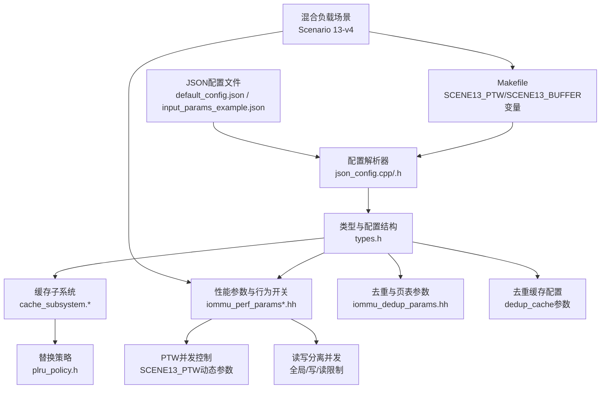
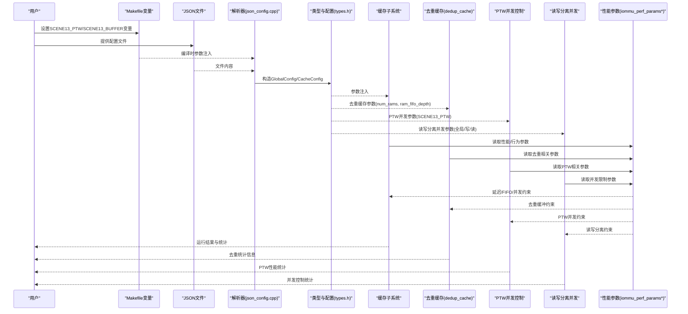
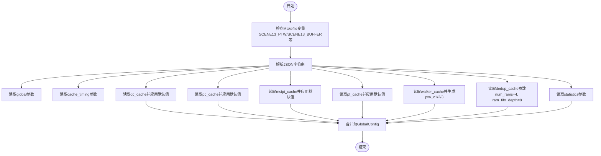
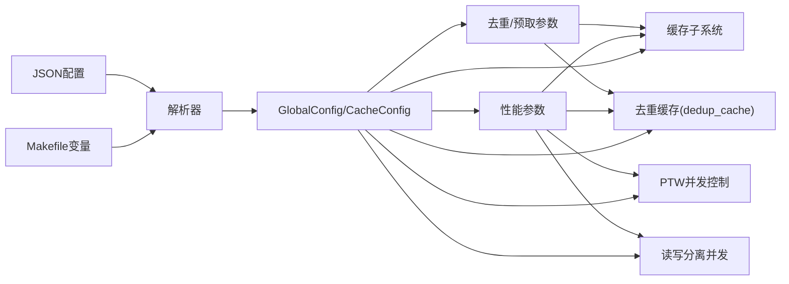

# 配置与参数

<cite>
**本文引用的文件**
- [Makefile](file://Makefile)
- [default_config.json](file://iommu/cache_config/default_config.json)
- [input_params_example.json](file://iommu/cache_config/input_params_example.json)
- [json_config.h](file://iommu/cache_src/common/json_config.h)
- [json_config.cpp](file://iommu/cache_src/common/json_config.cpp)
- [types.h](file://iommu/cache_src/common/types.h)
- [plru_policy.h](file://iommu/cache_src/replacement/plru_policy.h)
- [iommu_dedup_params.hh](file://iommu/include/iommu_dedup_params.hh)
- [iommu_perf_params.hh](file://iommu/iommu_perf_model/iommu_perf_params.hh)
- [iommu_perf_params_t2.hh](file://iommu/iommu_perf_model/iommu_perf_params_t2.hh)
- [iommu_perf_model.hh](file://iommu/include/iommu_perf_model.hh)
- [test_rp_rand4k_msi_mix_thread.cc](file://rp/test_rp_rand4k_msi_mix_thread.cc)
</cite>

## 更新摘要
**所做更改**
- **新增**：SCENE13_PTW和SCENE13_BUFFER Makefile变量的完整实现说明，支持页表遍历并发度和去重缓冲区深度的动态调整
- **更新**：Scenario 13-v4混合负载场景的配置细节，包含Buffer=512、PTW=27、Pages=909等关键参数的具体实现
- **增强**：读写分离并发控制机制的详细说明，包括写265+读243=508的并发限制配置
- **完善**：Makefile动态参数配置系统的架构和使用方法
- **扩展**：不同场景下的参数覆盖机制和优先级关系

## 目录
1. [简介](#简介)
2. [项目结构](#项目结构)
3. [核心组件](#核心组件)
4. [架构总览](#架构总览)
5. [详细组件分析](#详细组件分析)
6. [依赖分析](#依赖分析)
7. [性能考量](#性能考量)
8. [故障排查指南](#故障排查指南)
9. [结论](#结论)
10. [附录](#附录)

## 简介
本文件面向IOMMU缓存与性能建模的配置与参数，提供系统化的参考说明，覆盖以下方面：
- JSON配置文件格式与参数含义、默认值、取值范围与相互依赖
- **新增**：Makefile动态参数配置系统，支持通过SCENE13_PTW、SCENE13_BUFFER等make变量进行编译时参数调整
- 缓存参数（容量、关联度、替换策略、SRIPM位宽）、性能参数（延迟、带宽、FIFO深度、并发限制）
- 行为参数（VA去重、预取、Walker缓存、去重+预取组合）
- 去重缓存配置（dedup_cache），包括RAM数量和FIFO深度参数
- **新增**：页表遍历（PTW）并发参数的动态配置方法，通过SCENE13_PTW变量实现
- **新增**：读写分离并发控制机制，支持独立的全局、写、读outstanding限制
- **新增**：Scenario 13-v4混合负载场景的完整配置方案
- 动态参数调整方法与注意事项
- 不同应用场景的推荐配置方案
- 配置验证与错误处理机制

## 项目结构
围绕配置与参数的关键目录与文件：
- **构建系统与动态配置**：Makefile（支持SCENE7_PTW、SCENE13_PTW、SCENE13_BUFFER等make变量）
- 缓存配置JSON模板与示例：iommu/cache_config/default_config.json、iommu/cache_config/input_params_example.json
- 配置解析与类型定义：iommu/cache_src/common/json_config.{h,cpp}、iommu/cache_src/common/types.h
- 替换策略实现：iommu/cache_src/replacement/plru_policy.h
- 性能参数与行为开关：iommu/iommu_perf_model/iommu_perf_params.hh、iommu/iommu_perf_model/iommu_perf_params_t2.hh
- 去重与页表参数：iommu/include/iommu_dedup_params.hh
- 性能建模辅助：iommu/include/iommu_perf_model.hh
- **新增**：混合负载测试场景：rp/test_rp_rand4k_msi_mix_thread.cc

**图表来源**
- [Makefile:190-213](file://Makefile#L190-L213)
- [default_config.json:1-97](file://iommu/cache_config/default_config.json#L1-L97)
- [json_config.cpp:33-131](file://iommu/cache_src/common/json_config.cpp#L33-L131)
- [types.h:584-623](file://iommu/cache_src/common/types.h#L584-L623)
- [iommu_perf_params.hh:229-250](file://iommu/iommu_perf_model/iommu_perf_params.hh#L229-L250)
- [test_rp_rand4k_msi_mix_thread.cc:13-37](file://rp/test_rp_rand4k_msi_mix_thread.cc#L13-L37)

**章节来源**
- [default_config.json:1-97](file://iommu/cache_config/default_config.json#L1-L97)
- [input_params_example.json:1-69](file://iommu/cache_config/input_params_example.json#L1-L69)
- [json_config.cpp:33-131](file://iommu/cache_src/common/json_config.cpp#L33-L131)
- [types.h:584-623](file://iommu/cache_src/common/types.h#L584-L623)

## 核心组件
- 全局与缓存时序参数：clock_period_ns、random_seed、各类latency_cycles
- 缓存参数：num_sets、num_ways、replacement、srrip_m_bits
- Walker缓存：base_sets及ptw_c1/c2/c3的num_ways与replacement
- 去重缓存配置：num_rams（RAM数量）和ram_fifo_depth（FIFO深度）
- 统计参数：output_file、enable_latency_histogram、enable_task_trace、task_trace_level、histogram_bin_width_ns
- 性能参数：FIFO深度、缓存尺寸/关联度/行宽、AXI带宽/频率/ID池、DDR延迟与带宽、并发限制、处理延迟、SLINK NoC延迟、稳态采样窗口
- 行为参数：PTW_WALKER_CACHE_ENABLED、PT_CACHE_VA_DEDUP_ENABLED、PT_CACHE_DEDUP_ENABLED、PT_DEDUP_PREFETCH_DEPTH、XDTW/PTW/MSIPTW outstanding限制
- **新增**：读写分离并发控制 - IOMMU_GLOBAL_MAX_OUTSTANDING（全局）、IOMMU_WRITE_MAX_OUTSTANDING（写）、IOMMU_READ_MAX_OUTSTANDING（读）
- **新增**：Scenario 13-v4混合负载场景配置 - Buffer=512、PTW=27、Pages=909
- **新增**：Makefile动态PTW参数配置，支持SCENE7_PTW、SCENE13_PTW、SCENE13_BUFFER等make变量进行运行时调整

**章节来源**
- [default_config.json:2-95](file://iommu/cache_config/default_config.json#L2-L95)
- [input_params_example.json:2-67](file://iommu/cache_config/input_params_example.json#L2-L67)
- [iommu_perf_params.hh:229-250](file://iommu/iommu_perf_model/iommu_perf_params.hh#L229-L250)
- [iommu_perf_params_t2.hh:53-154](file://iommu/iommu_perf_model/iommu_perf_params_t2.hh#L53-L154)
- [iommu_dedup_params.hh:10-92](file://iommu/include/iommu_dedup_params.hh#L10-L92)
- [Makefile:190-213](file://Makefile#L190-L213)

## 架构总览
配置自底向上的作用链：
- Makefile变量与JSON配置文件定义参数
- 解析器将配置映射为GlobalConfig/CacheConfig结构
- 类型与数据结构(types.h)承载参数与消息/数据载荷
- 缓存子系统按配置实例化缓存与替换策略
- 去重缓存模块根据num_rams和ram_fifo_depth配置初始化多RAM结构和FIFO缓冲
- 性能参数驱动仿真延迟、带宽与并发约束
- **新增**：读写分离并发控制通过全局、写、读三个维度的outstanding限制实现
- **新增**：Scenario 13-v4场景通过SCENE13_PTW和SCENE13_BUFFER变量注入特定配置参数
- 去重与预取参数决定PT Cache行为与缓冲策略

**图表来源**
- [json_config.cpp:33-131](file://iommu/cache_src/common/json_config.cpp#L33-L131)
- [types.h:584-623](file://iommu/cache_src/common/types.h#L584-L623)
- [iommu_perf_params.hh:229-250](file://iommu/iommu_perf_model/iommu_perf_params.hh#L229-L250)
- [Makefile:190-213](file://Makefile#L190-L213)

## 详细组件分析

### Scenario 13-v4混合负载场景配置
**新增**：Scenario 13-v4是专为混合负载设计的复杂测试场景，支持4KB随机读写 + SQ/CQ/MSI混合负载

- **核心参数**：
  - **SCENE13_BUFFER=512**：去重缓冲区大小，大于全局outstanding避免死锁
  - **SCENE13_PTW=27**：页表遍历并发度，可通过`make SCENE13_PTW=N`覆盖
  - Pages=909：测试页面组数，每组包含8x512B Data + 1x32B SQ + 1x16B CQ + 1x4B MSI = 11包
  - 全局并发=508：由写265 + 读243组成

- **负载模式**：
  - 系统级任务奇读偶写交替
  - 偶数组=8x512B全读，奇数组=8x512B全写
  - SQ改为32B读请求（原为写）
  - SQ/CQ经预热后100%命中PT Cache，不进dedup/PTW

- **地址布局**：
  - 普通IOVA：0x100000 ~ 0x10FFFFF (16MB)
  - MSI IOVA：0x2000000 ~ 0x23FFFFF (4MB内随机挑256个不连续页)
  - 普通GPA：20 x 2MB大页，0 ~ 0x27FFFFF (40MB)
  - MSI窗口：0x3000000 ~ 0x30FFFFF (48MB)

**章节来源**
- [Makefile:190-213](file://Makefile#L190-L213)
- [test_rp_rand4k_msi_mix_thread.cc:13-37](file://rp/test_rp_rand4k_msi_mix_thread.cc#L13-L37)
- [test_rp_rand4k_msi_mix_thread.cc:94-108](file://rp/test_rp_rand4k_msi_mix_thread.cc#L94-L108)

### Makefile动态参数配置系统
**新增**：Makefile支持SCENE7_PTW、SCENE13_PTW、SCENE13_BUFFER等变量进行页表遍历并发参数和去重缓冲区大小的动态配置

- **SCENE13_PTW变量**：控制页表遍历并发度，默认值为27，可通过命令行覆盖
- **SCENE13_BUFFER变量**：控制去重缓冲区大小，默认值为512，可通过命令行覆盖
- 通过make变量在编译时注入PTW相关参数，无需修改源代码
- 支持不同场景下的快速参数切换和优化
- 与JSON配置形成互补，Makefile用于构建时参数，JSON用于运行时参数
- **新增**：读写分离并发控制通过TEST_CFG_IOMMU_WRITE_MAX_OUTSTANDING和TEST_CFG_IOMMU_READ_MAX_OUTSTANDING实现

**章节来源**
- [Makefile:190-213](file://Makefile#L190-L213)

### JSON配置文件格式与参数说明
- 全局参数
  - clock_period_ns：仿真时钟周期（ns），用于将仿真时间与物理时间对齐
  - random_seed：随机种子，确保可复现性
- 缓存时序参数（cache_timing）
  - arbiter_latency_cycles、hash_latency_cycles、read_set_latency_cycles、compare_latency_cycles、update_way_select_latency_cycles、fill_compute_index_*_cycles、write_way_latency_cycles、invalidation_compare_per_way_cycles
  - 以上参数直接影响缓存查找、更新、失效等关键路径的拍数与时序
- 缓存参数（dc_cache/pc_cache/msipt_cache/pt_cache）
  - num_sets、num_ways：容量与关联度
  - replacement：替换策略，当前支持"plru"
  - pt_cache特有：srrip_m_bits（SRIPM位宽）
- Walker缓存（walker_cache）
  - base_sets：基础set数
  - ptw_c1/ptw_c2/ptw_c3：分别对应不同way数与替换策略
- 去重缓存配置（dedup_cache）
  - num_rams：去重缓存中的RAM数量，默认值为4
  - ram_fifo_depth：每个RAM对应的FIFO深度，默认值为8
  - 这些参数控制去重缓冲的并行度和缓冲能力
- 统计参数（statistics）
  - output_file/unified_log_file：日志输出文件（后者可作为统一日志别名）
  - enable_latency_histogram、enable_task_trace：是否开启直方图与任务跟踪
  - task_trace_level：任务跟踪级别（off/basic/detail）
  - histogram_bin_width_ns：直方图bin宽度（ns）

**章节来源**
- [default_config.json:2-95](file://iommu/cache_config/default_config.json#L2-L95)
- [input_params_example.json:2-67](file://iommu/cache_config/input_params_example.json#L2-L67)
- [json_config.cpp:10-31](file://iommu/cache_src/common/json_config.cpp#L10-L31)
- [json_config.cpp:44-128](file://iommu/cache_src/common/json_config.cpp#L44-L128)

### 配置解析流程与默认值
- 解析入口
  - load_config(path)：从文件加载并解析
  - parse_config(str)：从JSON字符串解析
- 默认值策略
  - 若未显式指定，部分缓存采用内置默认（如dc/pc/msipt默认num_sets/num_ways与replacement）
  - pt_cache默认采用SRIP替换策略与特定srrip_m_bits
  - walker_cache的ptw_c1/ptw_c2/ptw_c3基于base_sets与固定way数与替换策略生成
  - dedup_cache默认num_rams=4，ram_fifo_depth=8
- 统计参数默认值
  - 输出文件、直方图与任务跟踪级别均有明确默认
- **新增**：Makefile变量优先级高于JSON配置中的默认值

**图表来源**
- [json_config.cpp:33-131](file://iommu/cache_src/common/json_config.cpp#L33-L131)

**章节来源**
- [json_config.cpp:33-131](file://iommu/cache_src/common/json_config.cpp#L33-L131)

### 缓存参数与替换策略
- 参数
  - num_sets、num_ways：决定缓存容量与冲突概率
  - replacement：当前支持"plru"（伪LRU树）
  - srrip_m_bits：PT Cache专用，影响SRIPM位宽
- 替换策略实现
  - PLRUPolicy使用树形bit记录访问顺序，支持access/find_victim/invalidate/reset
- 影响
  - 增大num_sets可降低冲突，提高命中率；增大num_ways可进一步提升命中率但增加比较与更新开销
  - SRIPM位宽影响PT Cache的去重/预取相关状态位

**章节来源**
- [types.h:584-600](file://iommu/cache_src/common/types.h#L584-L600)
- [plru_policy.h:10-33](file://iommu/cache_src/replacement/plru_policy.h#L10-L33)

### 性能参数与行为参数
- FIFO深度：贯穿Parser、Collector、Cache、Walker、DDR路径，决定流水线背压与吞吐
- 缓存尺寸/关联度/行宽：直接影响命中率与带宽占用
- AXI带宽/频率/ID池：决定端口吞吐与并发能力
- DDR延迟与带宽：影响Walker访问DRAM的瓶颈
- **新增**：读写分离并发控制
  - IOMMU_GLOBAL_MAX_OUTSTANDING：全局outstanding上限，默认256，场景13-v4设为508
  - IOMMU_WRITE_MAX_OUTSTANDING：写任务上限，默认265，场景13-v4设为265
  - IOMMU_READ_MAX_OUTSTANDING：读任务上限，默认243，场景13-v4设为243
- 处理延迟：Parser/Collector/Cache命中/Walker访问/Forwarder等延迟
- SLINK NoC延迟：网络传输延迟
- 稳态IOPS采样窗口：跳过首尾10%，统计中间80%稳定段
- **新增**：PTW并发参数可通过SCENE13_PTW变量动态调整

**章节来源**
- [iommu_perf_params.hh:229-250](file://iommu/iommu_perf_model/iommu_perf_params.hh#L229-L250)
- [iommu_perf_params_t2.hh:53-154](file://iommu/iommu_perf_model/iommu_perf_params_t2.hh#L53-L154)

### 去重与预取参数
- 去重缓冲容量与反压策略
- PT Cache占位CL的标志位位置（is_ph/is_req）
- 预取深度与默认启用
- PTE有效/无效/错误状态
- 页大小与地址翻译参数
- VA去重开关、去重+预取开关、去重缓冲大小、预取深度
- 去重缓存RAM配置
  - num_rams：控制去重缓冲的并行处理能力
  - ram_fifo_depth：控制每个RAM的缓冲深度，影响内存占用和吞吐量

**章节来源**
- [iommu_dedup_params.hh:10-92](file://iommu/include/iommu_dedup_params.hh#L10-92)
- [iommu_perf_params.hh:167-186](file://iommu/iommu_perf_model/iommu_perf_params.hh#L167-L186)

### 性能建模辅助与参数映射
- 任务类型分类、DDI提取、VPN提取、G-stage VPN提取、规范地址检查、MSI地址识别、MGPAW计算、MSI位提取等
- 与性能参数协同工作，确保翻译路径与延迟模型一致
- **新增**：PTW并发参数与性能模型的集成

**章节来源**
- [iommu_perf_model.hh:9-196](file://iommu/include/iommu_perf_model.hh#L9-196)

## 依赖分析
- 配置到类型与缓存
  - GlobalConfig/CacheConfig由解析器生成，注入types.h中的结构体
  - 缓存子系统依据这些结构体实例化缓存与替换策略
  - 去重缓存模块依赖num_rams和ram_fifo_depth参数进行初始化
  - **新增**：读写分离并发控制依赖全局、写、读三个维度的outstanding参数
  - **新增**：Scenario 13-v4场景依赖SCENE13_PTW和SCENE13_BUFFER变量和测试线程配置
- 配置到性能参数
  - iommu_perf_params*.hh提供静态参数，与JSON配置共同决定仿真行为
  - **新增**：Makefile变量影响性能参数的编译时配置
- 配置到行为参数
  - 去重与预取相关参数在dedup与perf模型中生效

**图表来源**
- [json_config.cpp:33-131](file://iommu/cache_src/common/json_config.cpp#L33-131)
- [types.h:584-623](file://iommu/cache_src/common/types.h#L584-L623)
- [iommu_perf_params.hh:229-250](file://iommu/iommu_perf_model/iommu_perf_params.hh#L229-L250)
- [iommu_dedup_params.hh:10-92](file://iommu/include/iommu_dedup_params.hh#L10-92)

## 性能考量
- 命中率与延迟权衡
  - 增大num_sets/num_ways可提升命中率，但会增加比较与更新延迟
  - cache_timing中的多类latency_cycles直接影响关键路径
- 并发与背压
  - FIFO深度与outstanding限制决定流水线饱和点
  - DDR延迟与带宽是Walker瓶颈，需与outstanding合理匹配
  - dedup_cache的num_rams和ram_fifo_depth影响去重处理的并行度和缓冲能力
  - **新增**：读写分离并发控制允许更精细的流量管理，写265+读243=508
  - **新增**：SCENE13_PTW参数直接影响页表遍历性能和内存带宽占用
- 带宽与端口
  - AXI带宽/频率与ID池影响端口利用率与并发
- 稳态采样
  - 通过稳态采样窗口过滤瞬态，获得更稳定的IOPS评估
- 去重缓存性能优化
  - 增加num_rams可提高并行处理能力，但会增加内存占用
  - 调整ram_fifo_depth可平衡缓冲深度和内存使用
- **新增**：Scenario 13-v4场景优化
  - SCENE13_BUFFER=512大于全局outstanding=508，避免死锁
  - SCENE13_PTW=27提供足够的页表遍历并发度
  - Pages=909确保足够的测试覆盖率

## 故障排查指南
- 配置文件加载失败
  - 现象：抛出异常提示无法打开配置文件
  - 排查：确认路径正确、文件存在且可读
- 参数缺失或类型不符
  - 现象：解析时忽略缺失字段，使用默认值；若JSON类型与期望不符，可能导致默认回退
  - 排查：对照默认配置与示例，核对字段拼写与类型
- 命中率偏低
  - 排查：检查num_sets/num_ways是否过小；查看cache_timing延迟是否过大；评估是否需要启用去重/预取
- 吞吐受限
  - 排查：检查FIFO深度、outstanding限制、DDR延迟与带宽、SLINK NoC延迟
  - 检查dedup_cache的num_rams和ram_fifo_depth是否合理
  - **新增**：检查读写分离并发参数（IOMMU_WRITE_MAX_OUTSTANDING、IOMMU_READ_MAX_OUTSTANDING）是否合理
  - **新增**：检查SCENE13_PTW等Makefile变量设置是否合适
- 统计输出异常
  - 排查：确认statistics字段配置，尤其是output_file与task_trace_level
- 去重缓存相关问题
  - 现象：去重效果不佳或内存占用过高
  - 排查：调整num_rams和ram_fifo_depth参数，监控内存使用和去重率
- **新增**：Scenario 13-v4场景问题
  - 现象：混合负载性能不符合预期
  - 排查：检查SCENE13_BUFFER大小是否大于全局outstanding，确认SCENE13_PTW并发度设置合理
  - 验证SQ/CQ/MSI负载的预热效果和命中率

**章节来源**
- [json_config.cpp:133-141](file://iommu/cache_src/common/json_config.cpp#L133-L141)
- [default_config.json:2-95](file://iommu/cache_config/default_config.json#L2-95)
- [input_params_example.json:2-67](file://iommu/cache_config/input_params_example.json#L2-67)

## 结论
- JSON配置提供了灵活的参数化入口，结合types.h中的结构体与解析器，可将参数注入到缓存、性能与行为模块
- 去重缓存配置增强了系统的去重能力和并行处理性能
- **新增**：读写分离并发控制机制提供了更精细的流量管理能力，支持写265+读243=508的并发配置
- **新增**：Scenario 13-v4混合负载场景为复杂工作负载提供了完整的测试和配置方案
- **新增**：Makefile动态参数配置系统提供了编译时的灵活配置能力，特别是SCENE13_PTW和SCENE13_BUFFER的快速调整
- 性能参数与行为参数共同决定了系统的吞吐、延迟与稳定性
- 建议在不同场景下以默认配置为基线，逐步微调num_sets/num_ways、FIFO深度、outstanding、去重缓存参数与去重/预取策略，配合稳态采样窗口进行评估
- **新增**：利用SCENE13_PTW和SCENE13_BUFFER等Makefile变量可以快速适应不同工作负载的PTW并发需求和缓冲区大小要求

## 附录

### JSON配置文件字段清单与默认值
- 全局
  - clock_period_ns：默认1.0（ns）
  - random_seed：默认42
- 缓存时序（cache_timing）
  - arbiter_latency_cycles、hash_latency_cycles、read_set_latency_cycles、compare_latency_cycles、update_way_select_latency_cycles、fill_compute_index_hit_cycles、fill_compute_index_invalid_cycles、fill_compute_index_replacement_cycles、write_way_latency_cycles、invalidation_compare_per_way_cycles
  - 默认值来源于默认配置文件中的具体数值
- 缓存（dc/pc/msipt）
  - num_sets、num_ways、replacement
  - 默认值：num_sets=64，num_ways=4，replacement="plru"
- PT Cache
  - num_sets、num_ways、replacement、srrip_m_bits
  - 默认值：num_sets=1024，num_ways=8，replacement="plru"，srrip_m_bits=2
- Walker缓存（walker_cache）
  - base_sets、ptw_c1/ptw_c2/ptw_c3的num_ways与replacement
  - 默认值：ptw_c1.num_ways=1、replacement="none"；ptw_c2/ptw_c3.num_ways=2/4、replacement="plru"
- 去重缓存（dedup_cache）
  - num_rams：默认4
  - ram_fifo_depth：默认8
- 统计（statistics）
  - output_file、enable_latency_histogram、enable_task_trace、task_trace_level、histogram_bin_width_ns
  - 默认值：output_file="cache_sim.log"，enable_latency_histogram=true，enable_task_trace=true，task_trace_level="detail"，histogram_bin_width_ns=1.0
- **新增**：Makefile变量
  - SCENE7_PTW：页表遍历并发参数，默认值取决于场景需求
  - **SCENE13_PTW**：Scenario 13-v4的PTW并发参数，默认27
  - **SCENE13_BUFFER**：Scenario 13-v4的缓冲区大小，默认512
  - SCENE13_PAGES：Scenario 13-v4的页面组数，默认909

**章节来源**
- [default_config.json:2-95](file://iommu/cache_config/default_config.json#L2-95)
- [input_params_example.json:2-67](file://iommu/cache_config/input_params_example.json#L2-67)
- [json_config.cpp:44-128](file://iommu/cache_src/common/json_config.cpp#L44-L128)
- [Makefile:190-213](file://Makefile#L190-L213)

### 参数取值范围与相互依赖
- num_sets/num_ways
  - 取值范围：正整数；受实现内存与性能约束
  - 依赖：与cache_timing中的latency_cycles共同影响关键路径延迟
- srrip_m_bits（PT Cache）
  - 取值范围：与实现相关；影响SRIPM状态位
- replacement
  - 取值范围：当前支持"plru"
- FIFO深度与outstanding
  - 取值范围：正整数；outstanding需满足各模块约束，避免拥塞
  - **新增**：读写分离outstanding需满足IOMMU_WRITE_MAX_OUTSTANDING + IOMMU_READ_MAX_OUTSTANDING ≤ IOMMU_GLOBAL_MAX_OUTSTANDING
- 去重缓存参数
  - num_rams：正整数，影响并行处理能力
  - ram_fifo_depth：正整数，影响缓冲深度和内存占用
- 时钟周期与随机种子
  - 取值范围：clock_period_ns>0；random_seed为非负整数
- **新增**：Scenario 13-v4参数
  - **SCENE13_PTW**：正整数，通常与系统内存带宽和DDR延迟相匹配
  - **SCENE13_BUFFER**：应大于IOMMU_GLOBAL_MAX_OUTSTANDING以避免死锁
  - SCENE13_PAGES：正整数，影响测试覆盖率和运行时间

**章节来源**
- [types.h:584-600](file://iommu/cache_src/common/types.h#L584-L600)
- [iommu_perf_params.hh:229-250](file://iommu/iommu_perf_model/iommu_perf_params.hh#L229-L250)
- [iommu_perf_params_t2.hh:53-154](file://iommu/iommu_perf_model/iommu_perf_params_t2.hh#L53-L154)

### 动态参数调整方法与注意事项
- 动态调整
  - 通过重新加载JSON配置并重建缓存子系统参数，可在运行时切换部分行为参数
  - **新增**：通过修改SCENE13_PTW和SCENE13_BUFFER Makefile变量并在编译时重新构建，可调整PTW并发参数和Scenario 13-v4配置
- 注意事项
  - 修改FIFO深度与outstanding需平衡整体吞吐与稳定性
  - 增大num_sets/num_ways会提升资源占用与延迟
  - 去重/预取参数需与Walker outstanding与DDR带宽协调
  - 调整dedup_cache参数时需考虑内存占用和并行处理能力的平衡
  - **新增**：读写分离并发参数需确保写+读不超过全局限制
  - **新增**：SCENE13_PTW和SCENE13_BUFFER变量的调整需要重新编译，但无需修改源代码
  - **新增**：Scenario 13-v4的SCENE13_BUFFER大小必须大于全局outstanding以避免死锁

**章节来源**
- [json_config.cpp:33-131](file://iommu/cache_src/common/json_config.cpp#L33-L131)
- [iommu_perf_params.hh:167-186](file://iommu/iommu_perf_model/iommu_perf_params.hh#L167-L186)

### 应用场景推荐配置方案
- 低延迟高命中
  - 增大num_sets与num_ways，适度提升cache_timing中的read/compare延迟容忍度
  - 启用去重与预取（根据场景选择）
  - 适当增加num_rams以提高去重并行度
  - **新增**：设置合适的SCENE13_PTW值以优化页表遍历性能
- 高吞吐与并发
  - 提升FIFO深度与outstanding，确保DDR带宽与延迟匹配
  - 合理设置AXI带宽/频率与ID池
  - 增加ram_fifo_depth以提升去重缓冲能力
  - **新增**：使用读写分离并发控制，写265+读243=508以获得最佳并发性能
- 稳态评估
  - 使用稳态采样窗口（跳过首尾10%）统计IOPS
- 去重优化场景
  - 针对高重复率的工作负载，增加num_rams和ram_fifo_depth
  - 监控去重率和内存使用，平衡性能与资源占用
- **新增**：Scenario 13-v4混合负载优化
  - SCENE13_BUFFER=512确保足够缓冲空间
  - SCENE13_PTW=27提供充足的页表遍历并发度
  - Pages=909确保充分的测试覆盖
  - 读写分离并发控制优化混合负载性能
- **新增**：场景化PTW优化
  - 对于内存密集型工作负载，适当提高SCENE13_PTW值
  - 对于CPU密集型工作负载，保持较低的PTW并发以避免内存带宽竞争

**章节来源**
- [iommu_perf_params.hh:229-250](file://iommu/iommu_perf_model/iommu_perf_params.hh#L229-L250)
- [iommu_perf_params_t2.hh:53-154](file://iommu/iommu_perf_model/iommu_perf_params_t2.hh#L53-L154)
- [Makefile:190-213](file://Makefile#L190-L213)

### Makefile动态配置使用指南
- **新增**：Scenario 13-v4变量使用方法
  - 在命令行中设置：`make TEST=rand4k_msi_mix_s2on_128g SCENE13_PTW=30`
  - 在脚本中使用：`export SCENE13_PTW=30 && make TEST=rand4k_msi_mix_s2on_128g`
  - 支持的值范围：根据系统配置和工作负载特征确定
  - **新增**：同时设置缓冲区大小：`make TEST=rand4k_msi_mix_s2on_128g SCENE13_PTW=30 SCENE13_BUFFER=600`
- 与其他参数的关系
  - SCENE13_PTW与JSON配置中的PTW相关参数协同工作
  - Makefile变量优先于JSON默认值
  - 需要重新编译才能应用新的PTW参数
  - **新增**：SCENE13_BUFFER和SCENE13_PAGES也可通过Makefile变量覆盖
- 调试与验证
  - 通过性能统计验证PTW并发度的实际效果
  - 监控内存带宽使用情况，避免过度并发导致性能下降
  - **新增**：验证读写分离并发控制的实际效果
  - **新增**：监控SCENE13_BUFFER的使用情况，确保缓冲区大小合适

**章节来源**
- [Makefile:190-213](file://Makefile#L190-L213)