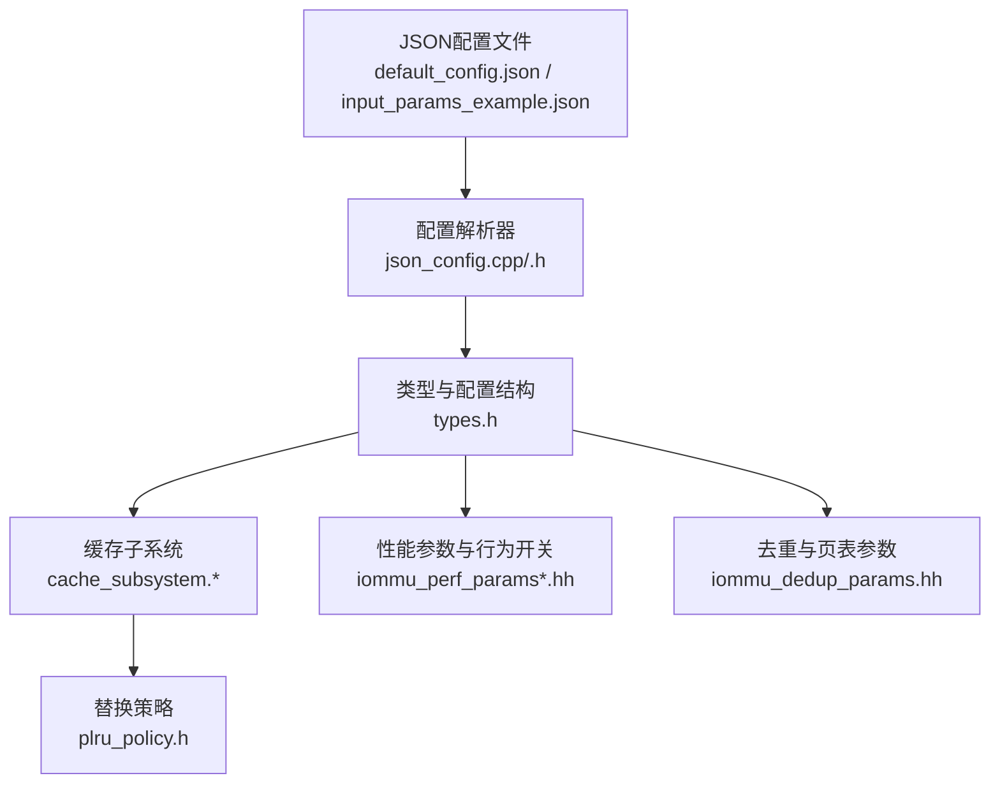
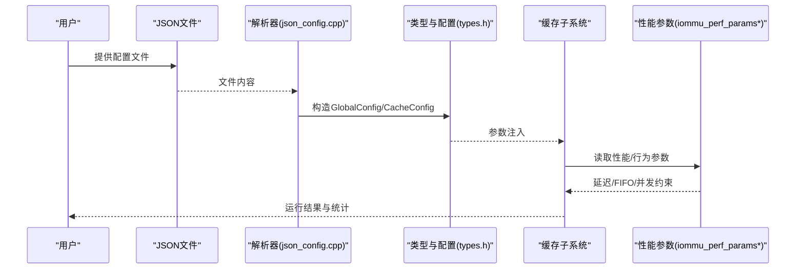
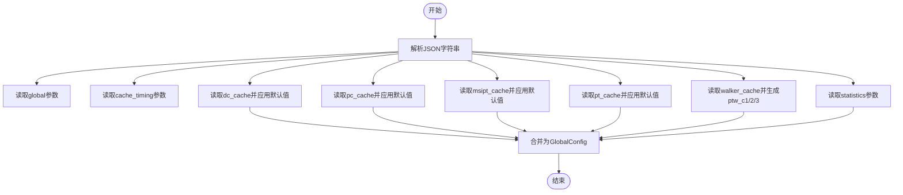
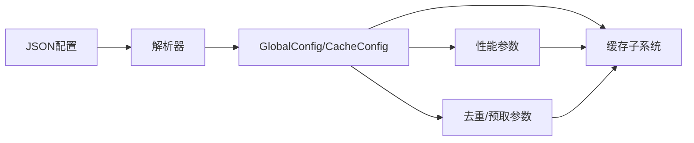

# 配置与参数

<cite>
**本文引用的文件**
- [default_config.json](file://iommu/cache_config/default_config.json)
- [input_params_example.json](file://iommu/cache_config/input_params_example.json)
- [json_config.h](file://iommu/cache_src/common/json_config.h)
- [json_config.cpp](file://iommu/cache_src/common/json_config.cpp)
- [types.h](file://iommu/cache_src/common/types.h)
- [plru_policy.h](file://iommu/cache_src/replacement/plru_policy.h)
- [iommu_dedup_params.hh](file://iommu/include/iommu_dedup_params.hh)
- [iommu_perf_params.hh](file://iommu/iommu_perf_model/iommu_perf_params.hh)
- [iommu_perf_params_t2.hh](file://iommu/iommu_perf_model/iommu_perf_params_t2.hh)
- [iommu_perf_model.hh](file://iommu/include/iommu_perf_model.hh)
</cite>

## 目录
1. [简介](#简介)
2. [项目结构](#项目结构)
3. [核心组件](#核心组件)
4. [架构总览](#架构总览)
5. [详细组件分析](#详细组件分析)
6. [依赖分析](#依赖分析)
7. [性能考量](#性能考量)
8. [故障排查指南](#故障排查指南)
9. [结论](#结论)
10. [附录](#附录)

## 简介
本文件面向IOMMU缓存与性能建模的配置与参数，提供系统化的参考说明，覆盖以下方面：
- JSON配置文件格式与参数含义、默认值、取值范围与相互依赖
- 缓存参数（容量、关联度、替换策略、SRIPM位宽）、性能参数（延迟、带宽、FIFO深度、并发限制）
- 行为参数（VA去重、预取、Walker缓存、去重+预取组合）
- 动态参数调整方法与注意事项
- 不同应用场景的推荐配置方案
- 配置验证与错误处理机制

## 项目结构
围绕配置与参数的关键目录与文件：
- 缓存配置JSON模板与示例：iommu/cache_config/default_config.json、iommu/cache_config/input_params_example.json
- 配置解析与类型定义：iommu/cache_src/common/json_config.{h,cpp}、iommu/cache_src/common/types.h
- 替换策略实现：iommu/cache_src/replacement/plru_policy.h
- 性能参数与行为开关：iommu/iommu_perf_model/iommu_perf_params.hh、iommu/iommu_perf_model/iommu_perf_params_t2.hh
- 去重与页表参数：iommu/include/iommu_dedup_params.hh
- 性能建模辅助：iommu/include/iommu_perf_model.hh

图表来源
- [default_config.json:1-69](file://iommu/cache_config/default_config.json#L1-L69)
- [input_params_example.json:1-69](file://iommu/cache_config/input_params_example.json#L1-L69)
- [json_config.cpp:33-131](file://iommu/cache_src/common/json_config.cpp#L33-L131)
- [types.h:584-623](file://iommu/cache_src/common/types.h#L584-L623)
- [plru_policy.h:10-33](file://iommu/cache_src/replacement/plru_policy.h#L10-L33)
- [iommu_perf_params.hh:54-161](file://iommu/iommu_perf_model/iommu_perf_params.hh#L54-L161)
- [iommu_dedup_params.hh:10-92](file://iommu/include/iommu_dedup_params.hh#L10-L92)

章节来源
- [default_config.json:1-69](file://iommu/cache_config/default_config.json#L1-L69)
- [input_params_example.json:1-69](file://iommu/cache_config/input_params_example.json#L1-L69)
- [json_config.cpp:33-131](file://iommu/cache_src/common/json_config.cpp#L33-L131)
- [types.h:584-623](file://iommu/cache_src/common/types.h#L584-L623)

## 核心组件
- 全局与缓存时序参数：clock_period_ns、random_seed、各类latency_cycles
- 缓存参数：num_sets、num_ways、replacement、srrip_m_bits
- Walker缓存：base_sets及ptw_c1/c2/c3的num_ways与replacement
- 统计参数：output_file、enable_latency_histogram、enable_task_trace、task_trace_level、histogram_bin_width_ns
- 性能参数：FIFO深度、缓存尺寸/关联度/行宽、AXI带宽/频率/ID池、DDR延迟与带宽、并发限制、处理延迟、SLINK NoC延迟、稳态采样窗口
- 行为参数：PTW_WALKER_CACHE_ENABLED、PT_CACHE_VA_DEDUP_ENABLED、PT_CACHE_DEDUP_ENABLED、PT_DEDUP_PREFETCH_DEPTH、XDTW/PTW/MSIPTW outstanding限制

章节来源
- [default_config.json:2-67](file://iommu/cache_config/default_config.json#L2-L67)
- [input_params_example.json:2-67](file://iommu/cache_config/input_params_example.json#L2-L67)
- [iommu_perf_params.hh:54-161](file://iommu/iommu_perf_model/iommu_perf_params.hh#L54-L161)
- [iommu_perf_params_t2.hh:53-154](file://iommu/iommu_perf_model/iommu_perf_params_t2.hh#L53-L154)
- [iommu_dedup_params.hh:10-92](file://iommu/include/iommu_dedup_params.hh#L10-L92)

## 架构总览
配置自底向上的作用链：
- JSON配置文件定义参数
- 解析器将JSON映射为GlobalConfig/CacheConfig结构
- 类型与数据结构(types.h)承载参数与消息/数据载荷
- 缓存子系统按配置实例化缓存与替换策略
- 性能参数驱动仿真延迟、带宽与并发约束
- 去重与预取参数决定PT Cache行为与缓冲策略

图表来源
- [json_config.cpp:33-131](file://iommu/cache_src/common/json_config.cpp#L33-L131)
- [types.h:584-623](file://iommu/cache_src/common/types.h#L584-L623)
- [iommu_perf_params.hh:54-161](file://iommu/iommu_perf_model/iommu_perf_params.hh#L54-L161)

## 详细组件分析

### JSON配置文件格式与参数说明
- 全局参数
  - clock_period_ns：仿真时钟周期（ns），用于将仿真时间与物理时间对齐
  - random_seed：随机种子，确保可复现性
- 缓存时序参数（cache_timing）
  - arbiter_latency_cycles、hash_latency_cycles、read_set_latency_cycles、compare_latency_cycles、update_way_select_latency_cycles、fill_compute_index_*_cycles、write_way_latency_cycles、invalidation_compare_per_way_cycles
  - 以上参数直接影响缓存查找、更新、失效等关键路径的拍数与时序
- 缓存参数（dc_cache/pc_cache/msipt_cache/pt_cache）
  - num_sets、num_ways：容量与关联度
  - replacement：替换策略，当前支持“plru”
  - pt_cache特有：srrip_m_bits（SRIPM位宽）
- Walker缓存（walker_cache）
  - base_sets：基础set数
  - ptw_c1/ptw_c2/ptw_c3：分别对应不同way数与替换策略
- 统计参数（statistics）
  - output_file/unified_log_file：日志输出文件（后者可作为统一日志别名）
  - enable_latency_histogram、enable_task_trace：是否开启直方图与任务跟踪
  - task_trace_level：任务跟踪级别（off/basic/detail）
  - histogram_bin_width_ns：直方图bin宽度（ns）

章节来源
- [default_config.json:2-67](file://iommu/cache_config/default_config.json#L2-L67)
- [input_params_example.json:2-67](file://iommu/cache_config/input_params_example.json#L2-L67)
- [json_config.cpp:10-31](file://iommu/cache_src/common/json_config.cpp#L10-L31)
- [json_config.cpp:44-128](file://iommu/cache_src/common/json_config.cpp#L44-L128)

### 配置解析流程与默认值
- 解析入口
  - load_config(path)：从文件加载并解析
  - parse_config(str)：从JSON字符串解析
- 默认值策略
  - 若未显式指定，部分缓存采用内置默认（如dc/pc/msipt默认num_sets/num_ways与replacement）
  - pt_cache默认采用SRIP替换策略与特定srrip_m_bits
  - walker_cache的ptw_c1/ptw_c2/ptw_c3基于base_sets与固定way数与替换策略生成
- 统计参数默认值
  - 输出文件、直方图与任务跟踪级别均有明确默认

图表来源
- [json_config.cpp:33-131](file://iommu/cache_src/common/json_config.cpp#L33-L131)

章节来源
- [json_config.cpp:33-131](file://iommu/cache_src/common/json_config.cpp#L33-L131)

### 缓存参数与替换策略
- 参数
  - num_sets、num_ways：决定缓存容量与冲突概率
  - replacement：当前支持“plru”（伪LRU树）
  - srrip_m_bits：PT Cache专用，影响SRIPM位宽
- 替换策略实现
  - PLRUPolicy使用树形bit记录访问顺序，支持access/find_victim/invalidate/reset
- 影响
  - 增大num_sets可降低冲突，提高命中率；增大num_ways可进一步提升命中率但增加比较与更新开销
  - SRIPM位宽影响PT Cache的去重/预取相关状态位

章节来源
- [types.h:584-600](file://iommu/cache_src/common/types.h#L584-L600)
- [plru_policy.h:10-33](file://iommu/cache_src/replacement/plru_policy.h#L10-L33)

### 性能参数与行为参数
- FIFO深度：贯穿Parser、Collector、Cache、Walker、DDR路径，决定流水线背压与吞吐
- 缓存尺寸/关联度/行宽：直接影响命中率与带宽占用
- AXI带宽/频率/ID池：决定端口吞吐与并发能力
- DDR延迟与带宽：影响Walker访问DRAM的瓶颈
- 并发限制：XDTW/PTW/MSIPTW outstanding上限，以及全局outstanding上限
- 处理延迟：Parser/Collector/Cache命中/Walker访问/Forwarder等延迟
- SLINK NoC延迟：网络传输延迟
- 稳态IOPS采样窗口：跳过首尾10%，统计中间80%稳定段

章节来源
- [iommu_perf_params.hh:54-161](file://iommu/iommu_perf_model/iommu_perf_params.hh#L54-L161)
- [iommu_perf_params_t2.hh:53-154](file://iommu/iommu_perf_model/iommu_perf_params_t2.hh#L53-L154)

### 去重与预取参数
- 去重缓冲容量与反压策略
- PT Cache占位CL的标志位位置（is_ph/is_req）
- 预取深度与默认启用
- PTE有效/无效/错误状态
- 页大小与地址翻译参数
- VA去重开关、去重+预取开关、去重缓冲大小、预取深度

章节来源
- [iommu_dedup_params.hh:10-92](file://iommu/include/iommu_dedup_params.hh#L10-L92)
- [iommu_perf_params.hh:113-121](file://iommu/iommu_perf_model/iommu_perf_params.hh#L113-L121)

### 性能建模辅助与参数映射
- 任务类型分类、DDI提取、VPN提取、G-stage VPN提取、规范地址检查、MSI地址识别、MGPAW计算、MSI位提取等
- 与性能参数协同工作，确保翻译路径与延迟模型一致

章节来源
- [iommu_perf_model.hh:9-196](file://iommu/include/iommu_perf_model.hh#L9-L196)

## 依赖分析
- 配置到类型与缓存
  - GlobalConfig/CacheConfig由解析器生成，注入types.h中的结构体
  - 缓存子系统依据这些结构体实例化缓存与替换策略
- 配置到性能参数
  - iommu_perf_params*.hh提供静态参数，与JSON配置共同决定仿真行为
- 配置到行为参数
  - 去重与预取相关参数在dedup与perf模型中生效

图表来源
- [json_config.cpp:33-131](file://iommu/cache_src/common/json_config.cpp#L33-L131)
- [types.h:584-623](file://iommu/cache_src/common/types.h#L584-L623)
- [iommu_perf_params.hh:54-161](file://iommu/iommu_perf_model/iommu_perf_params.hh#L54-L161)
- [iommu_dedup_params.hh:10-92](file://iommu/include/iommu_dedup_params.hh#L10-L92)

## 性能考量
- 命中率与延迟权衡
  - 增大num_sets/num_ways可提升命中率，但会增加比较与更新延迟
  - cache_timing中的多类latency_cycles直接影响关键路径
- 并发与背压
  - FIFO深度与outstanding限制决定流水线饱和点
  - DDR延迟与带宽是Walker瓶颈，需与outstanding合理匹配
- 带宽与端口
  - AXI带宽/频率与ID池影响端口利用率与并发
- 稳态采样
  - 通过稳态采样窗口过滤瞬态，获得更稳定的IOPS评估

## 故障排查指南
- 配置文件加载失败
  - 现象：抛出异常提示无法打开配置文件
  - 排查：确认路径正确、文件存在且可读
- 参数缺失或类型不符
  - 现象：解析时忽略缺失字段，使用默认值；若JSON类型与期望不符，可能导致默认回退
  - 排查：对照默认配置与示例，核对字段拼写与类型
- 命中率偏低
  - 排查：检查num_sets/num_ways是否过小；查看cache_timing延迟是否过大；评估是否需要启用去重/预取
- 吞吐受限
  - 排查：检查FIFO深度、outstanding限制、DDR延迟与带宽、SLINK NoC延迟
- 统计输出异常
  - 排查：确认statistics字段配置，尤其是output_file与task_trace_level

章节来源
- [json_config.cpp:133-141](file://iommu/cache_src/common/json_config.cpp#L133-L141)
- [default_config.json:2-67](file://iommu/cache_config/default_config.json#L2-L67)
- [input_params_example.json:2-67](file://iommu/cache_config/input_params_example.json#L2-L67)

## 结论
- JSON配置提供了灵活的参数化入口，结合types.h中的结构体与解析器，可将参数注入到缓存、性能与行为模块
- 性能参数与行为参数共同决定了系统的吞吐、延迟与稳定性
- 建议在不同场景下以默认配置为基线，逐步微调num_sets/num_ways、FIFO深度、outstanding与去重/预取策略，配合稳态采样窗口进行评估

## 附录

### JSON配置文件字段清单与默认值
- 全局
  - clock_period_ns：默认1.0（ns）
  - random_seed：默认42
- 缓存时序（cache_timing）
  - arbiter_latency_cycles、hash_latency_cycles、read_set_latency_cycles、compare_latency_cycles、update_way_select_latency_cycles、fill_compute_index_hit_cycles、fill_compute_index_invalid_cycles、fill_compute_index_replacement_cycles、write_way_latency_cycles、invalidation_compare_per_way_cycles
  - 默认值来源于默认配置文件中的具体数值
- 缓存（dc/pc/msipt）
  - num_sets、num_ways、replacement
  - 默认值：num_sets=64，num_ways=4，replacement=“plru”
- PT Cache
  - num_sets、num_ways、replacement、srrip_m_bits
  - 默认值：num_sets=1024，num_ways=8，replacement=“plru”，srrip_m_bits=2
- Walker缓存（walker_cache）
  - base_sets、ptw_c1/ptw_c2/ptw_c3的num_ways与replacement
  - 默认值：ptw_c1.num_ways=1、replacement=“none”；ptw_c2/ptw_c3.num_ways=2/4、replacement=“plru”
- 统计（statistics）
  - output_file、enable_latency_histogram、enable_task_trace、task_trace_level、histogram_bin_width_ns
  - 默认值：output_file=“cache_sim.log”，enable_latency_histogram=true，enable_task_trace=true，task_trace_level=“detail”，histogram_bin_width_ns=1.0

章节来源
- [default_config.json:2-67](file://iommu/cache_config/default_config.json#L2-L67)
- [input_params_example.json:2-67](file://iommu/cache_config/input_params_example.json#L2-L67)
- [json_config.cpp:44-128](file://iommu/cache_src/common/json_config.cpp#L44-L128)

### 参数取值范围与相互依赖
- num_sets/num_ways
  - 取值范围：正整数；受实现内存与性能约束
  - 依赖：与cache_timing中的latency_cycles共同影响关键路径延迟
- srrip_m_bits（PT Cache）
  - 取值范围：与实现相关；影响SRIPM状态位
- replacement
  - 取值范围：当前支持“plru”
- FIFO深度与outstanding
  - 取值范围：正整数；outstanding需满足各模块约束，避免拥塞
- 时钟周期与随机种子
  - 取值范围：clock_period_ns>0；random_seed为非负整数

章节来源
- [types.h:584-600](file://iommu/cache_src/common/types.h#L584-L600)
- [iommu_perf_params.hh:78-108](file://iommu/iommu_perf_model/iommu_perf_params.hh#L78-L108)
- [iommu_perf_params_t2.hh:78-108](file://iommu/iommu_perf_model/iommu_perf_params_t2.hh#L78-L108)

### 动态参数调整方法与注意事项
- 动态调整
  - 通过重新加载JSON配置并重建缓存子系统参数，可在运行时切换部分行为参数
- 注意事项
  - 修改FIFO深度与outstanding需平衡整体吞吐与稳定性
  - 增大num_sets/num_ways会提升资源占用与延迟
  - 去重/预取参数需与Walker outstanding与DDR带宽协调

章节来源
- [json_config.cpp:33-131](file://iommu/cache_src/common/json_config.cpp#L33-L131)
- [iommu_perf_params.hh:102-121](file://iommu/iommu_perf_model/iommu_perf_params.hh#L102-L121)

### 应用场景推荐配置方案
- 低延迟高命中
  - 增大num_sets与num_ways，适度提升cache_timing中的read/compare延迟容忍度
  - 启用去重与预取（根据场景选择）
- 高吞吐与并发
  - 提升FIFO深度与outstanding，确保DDR带宽与延迟匹配
  - 合理设置AXI带宽/频率与ID池
- 稳态评估
  - 使用稳态采样窗口（跳过首尾10%）统计IOPS

章节来源
- [iommu_perf_params.hh:149-153](file://iommu/iommu_perf_model/iommu_perf_params.hh#L149-L153)
- [iommu_perf_params_t2.hh:143-146](file://iommu/iommu_perf_model/iommu_perf_params_t2.hh#L143-L146)