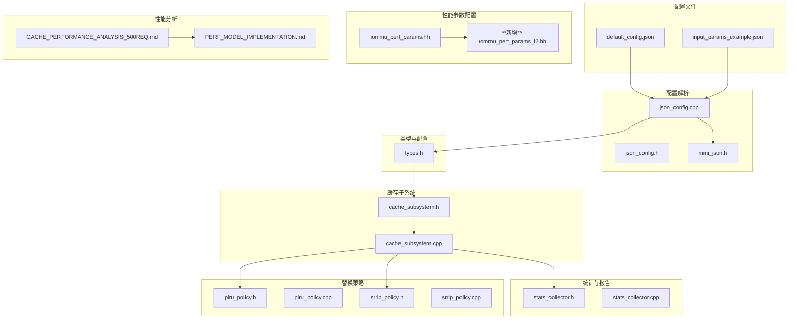
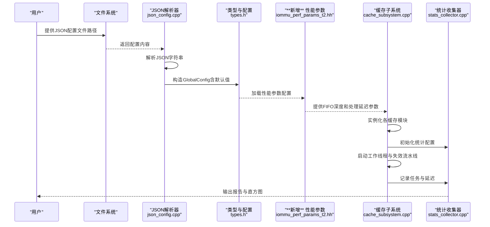
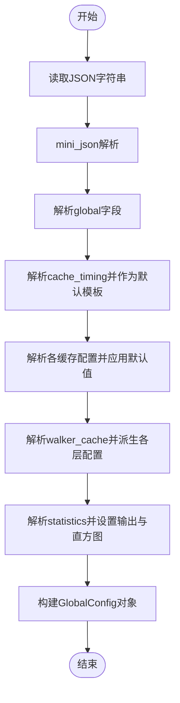
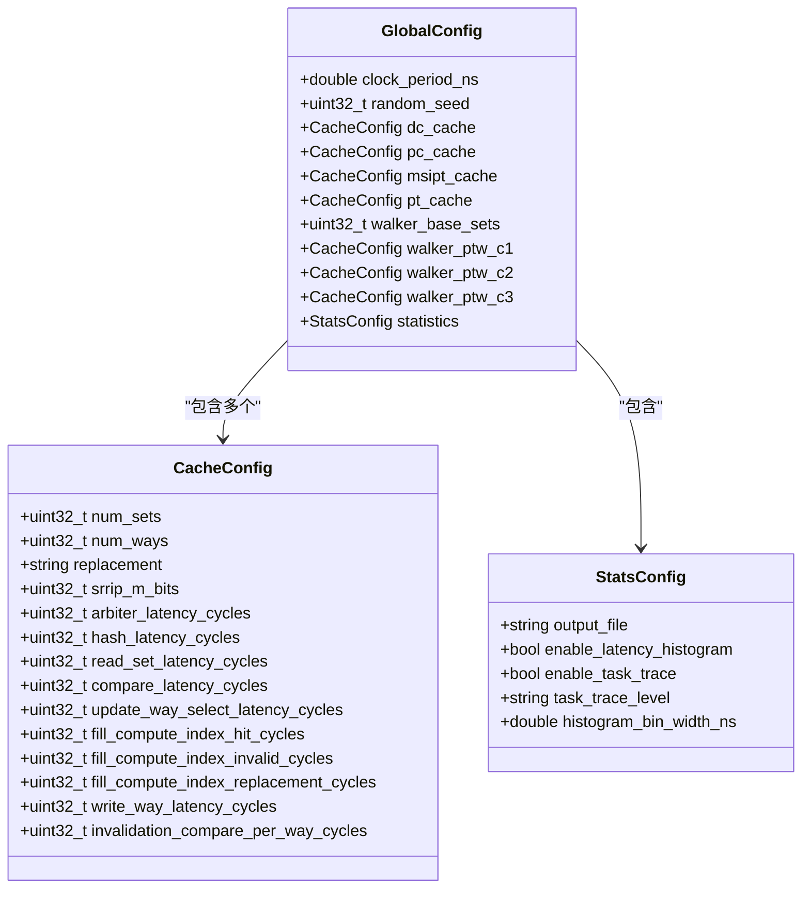
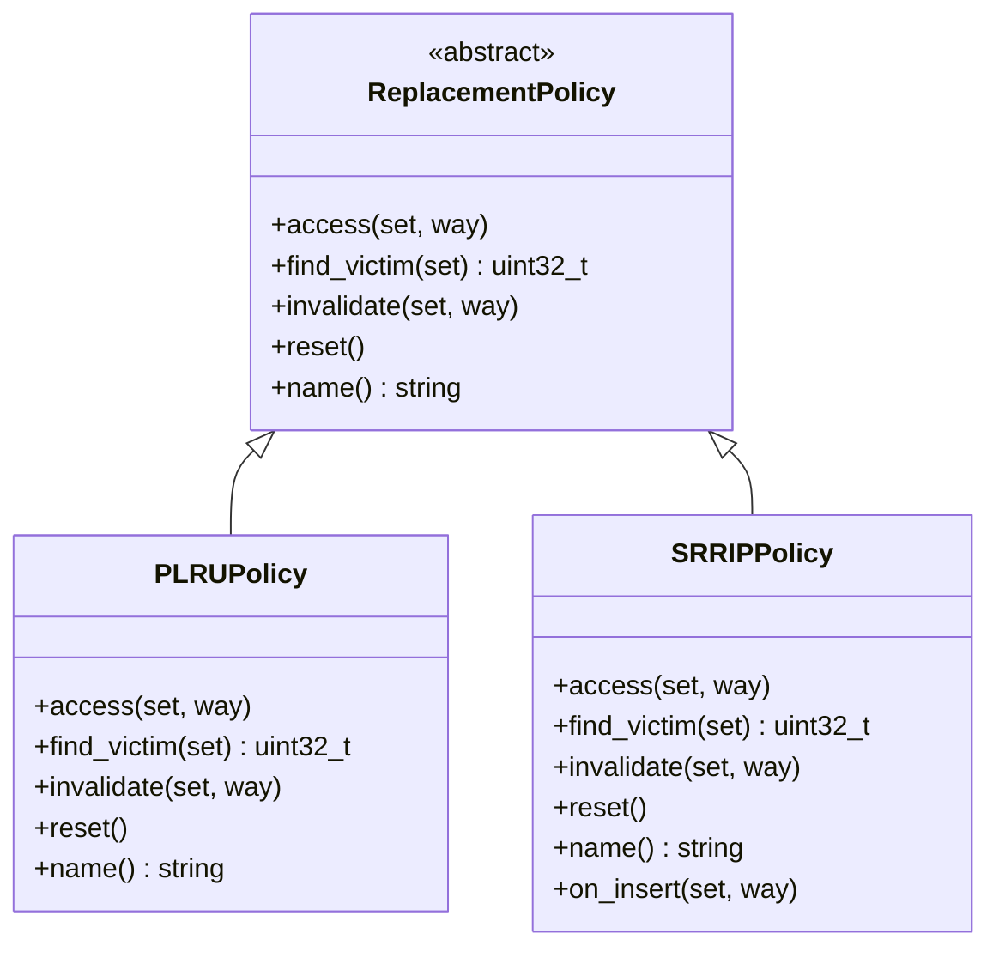
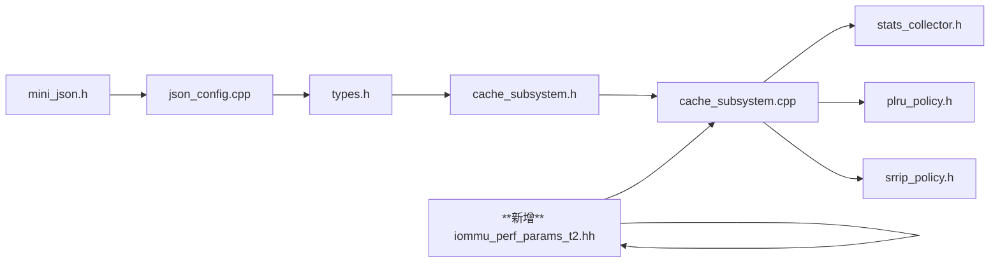

# 配置和参数管理

<cite>
**本文档引用的文件**
- [default_config.json](file://iommu/cache_config/default_config.json)
- [input_params_example.json](file://iommu/cache_config/input_params_example.json)
- [json_config.h](file://iommu/cache_src/common/json_config.h)
- [json_config.cpp](file://iommu/cache_src/common/json_config.cpp)
- [types.h](file://iommu/cache_src/common/types.h)
- [mini_json.h](file://iommu/cache_src/common/mini_json.h)
- [cache_subsystem.h](file://iommu/cache_src/subsystem/cache_subsystem.h)
- [cache_subsystem.cpp](file://iommu/cache_src/subsystem/cache_subsystem.cpp)
- [stats_collector.h](file://iommu/cache_src/common/stats_collector.h)
- [stats_collector.cpp](file://iommu/cache_src/common/stats_collector.cpp)
- [plru_policy.h](file://iommu/cache_src/replacement/plru_policy.h)
- [plru_policy.cpp](file://iommu/cache_src/replacement/plru_policy.cpp)
- [srrip_policy.h](file://iommu/cache_src/replacement/srrip_policy.h)
- [srrip_policy.cpp](file://iommu/cache_src/replacement/srrip_policy.cpp)
- [iommu_perf_params.hh](file://iommu/iommu_perf_model/iommu_perf_params.hh)
- [iommu_perf_params_t2.hh](file://iommu/iommu_perf_model/iommu_perf_params_t2.hh)
- [iommu_perf_parser.cc](file://iommu/iommu_perf_model/iommu_perf_parser.cc)
- [test_slink.cc](file://slink/test_slink.cc)
- [test_slink.hh](file://slink/test_slink.hh)
- [CACHE_PERFORMANCE_ANALYSIS_500REQ.md](file://CACHE_PERFORMANCE_ANALYSIS_500REQ.md)
- [PERF_MODEL_IMPLEMENTATION.md](file://PERF_MODEL_IMPLEMENTATION.md)
</cite>

## 更新摘要
**所做更改**
- 新增性能参数配置文件分析章节，详细介绍iommu_perf_params_t2.hh的增强功能
- 更新性能参数配置章节，包含FIFO深度规格、缓存参数配置和处理延迟参数
- 新增SLINK NoC延迟调整和性能分析场景说明
- 扩展配置参数速查表，包含新的性能参数类别
- 更新配置变更影响分析，增加性能参数调优指导

## 目录
1. [简介](#简介)
2. [项目结构](#项目结构)
3. [核心组件](#核心组件)
4. [架构总览](#架构总览)
5. [详细组件分析](#详细组件分析)
6. [性能参数配置](#性能参数配置)
7. [依赖关系分析](#依赖关系分析)
8. [性能考量](#性能考量)
9. [故障排查指南](#故障排查指南)
10. [结论](#结论)
11. [附录](#附录)

## 简介
本文件面向RISC-V IOMMU缓存系统的配置与参数管理，系统性阐述JSON配置文件的格式与结构、参数含义与取值范围、解析器实现与默认值处理机制、缓存配置调优策略、最佳实践与常见场景示例，以及配置变更的影响分析与性能对比方法。**更新**新增了iommu_perf_params_t2.hh性能参数配置文件的详细分析，包含增强的FIFO深度规格、缓存参数配置和处理延迟参数，以及性能分析场景的SLINK NoC延迟调整。

## 项目结构
与配置和参数管理直接相关的目录与文件组织如下：
- 配置文件：default_config.json、input_params_example.json
- 性能参数配置：iommu_perf_params.hh、**新增**iommu_perf_params_t2.hh
- 配置解析：json_config.h/.cpp、mini_json.h
- 类型与配置结构：types.h
- 缓存子系统：cache_subsystem.h/.cpp
- 统计收集：stats_collector.h/.cpp
- 替换策略：plru_policy.h/.cpp、srrip_policy.h/.cpp
- **新增**性能分析：CACHE_PERFORMANCE_ANALYSIS_500REQ.md、PERF_MODEL_IMPLEMENTATION.md

**图表来源**
- [default_config.json:1-69](file://iommu/cache_config/default_config.json#L1-L69)
- [input_params_example.json:1-69](file://iommu/cache_config/input_params_example.json#L1-L69)
- [iommu_perf_params.hh:1-155](file://iommu/iommu_perf_model/iommu_perf_params.hh#L1-L155)
- [iommu_perf_params_t2.hh:1-154](file://iommu/iommu_perf_model/iommu_perf_params_t2.hh#L1-L154)
- [json_config.cpp:33-141](file://iommu/cache_src/common/json_config.cpp#L33-L141)
- [types.h:573-612](file://iommu/cache_src/common/types.h#L573-L612)
- [cache_subsystem.cpp:102-170](file://iommu/cache_src/subsystem/cache_subsystem.cpp#L102-L170)
- [stats_collector.cpp:170-182](file://iommu/cache_src/common/stats_collector.cpp#L170-L182)
- [plru_policy.cpp:7-13](file://iommu/cache_src/replacement/plru_policy.cpp#L7-L13)
- [srrip_policy.cpp:6-13](file://iommu/cache_src/replacement/srrip_policy.cpp#L6-L13)
- [CACHE_PERFORMANCE_ANALYSIS_500REQ.md:1-305](file://CACHE_PERFORMANCE_ANALYSIS_500REQ.md#L1-L305)
- [PERF_MODEL_IMPLEMENTATION.md:1-227](file://PERF_MODEL_IMPLEMENTATION.md#L1-L227)

**章节来源**
- [default_config.json:1-69](file://iommu/cache_config/default_config.json#L1-L69)
- [input_params_example.json:1-69](file://iommu/cache_config/input_params_example.json#L1-L69)
- [iommu_perf_params.hh:1-155](file://iommu/iommu_perf_model/iommu_perf_params.hh#L1-L155)
- [iommu_perf_params_t2.hh:1-154](file://iommu/iommu_perf_model/iommu_perf_params_t2.hh#L1-L154)
- [json_config.cpp:33-141](file://iommu/cache_src/common/json_config.cpp#L33-L141)
- [types.h:573-612](file://iommu/cache_src/common/types.h#L573-L612)
- [cache_subsystem.cpp:102-170](file://iommu/cache_src/subsystem/cache_subsystem.cpp#L102-L170)
- [stats_collector.cpp:170-182](file://iommu/cache_src/common/stats_collector.cpp#L170-L182)

## 核心组件
- 全局配置结构：包含时钟周期、随机种子、各类缓存配置、Walker缓存层级配置、统计配置等。
- **新增**性能参数配置：包含FIFO深度规格、缓存参数、处理延迟、DDR性能参数、AXI端口参数等。
- 缓存配置结构：包含每个缓存的集数、路数、替换策略、SRRIp的M比特数，以及一系列时延参数。
- JSON配置解析器：支持从文件或字符串解析JSON，按需覆盖默认值，生成全局配置对象。
- 缓存子系统：基于配置实例化各缓存模块，驱动工作线程与失效流水线，记录任务跟踪与统计。
- 统计收集器：汇总命中/缺失/驱逐/失效次数、执行/排队/请求延迟、IOPS等指标，并可输出直方图与摘要报告。
- 替换策略：PLRU（伪LRU）与SRRIP（静态RRIP），分别用于不同缓存的替换决策。

**章节来源**
- [types.h:573-612](file://iommu/cache_src/common/types.h#L573-L612)
- [json_config.cpp:33-141](file://iommu/cache_src/common/json_config.cpp#L33-L141)
- [cache_subsystem.cpp:102-170](file://iommu/cache_src/subsystem/cache_subsystem.cpp#L102-L170)
- [stats_collector.cpp:170-182](file://iommu/cache_src/common/stats_collector.cpp#L170-L182)
- [plru_policy.cpp:7-13](file://iommu/cache_src/replacement/plru_policy.cpp#L7-L13)
- [srrip_policy.cpp:6-13](file://iommu/cache_src/replacement/srrip_policy.cpp#L6-L13)
- [iommu_perf_params_t2.hh:6-154](file://iommu/iommu_perf_model/iommu_perf_params_t2.hh#L6-L154)

## 架构总览
下图展示从JSON配置到缓存子系统运行的端到端流程，包括解析、默认值合并、实例化与统计输出。

**图表来源**
- [json_config.cpp:133-141](file://iommu/cache_src/common/json_config.cpp#L133-L141)
- [types.h:599-612](file://iommu/cache_src/common/types.h#L599-L612)
- [iommu_perf_params_t2.hh:1-154](file://iommu/iommu_perf_model/iommu_perf_params_t2.hh#L1-L154)
- [cache_subsystem.cpp:102-170](file://iommu/cache_src/subsystem/cache_subsystem.cpp#L102-L170)
- [stats_collector.cpp:170-182](file://iommu/cache_src/common/stats_collector.cpp#L170-L182)

## 详细组件分析

### JSON配置文件格式与结构
- 全局配置（global）
  - clock_period_ns：时钟周期（纳秒），用于SystemC时间单位换算。
  - random_seed：随机数种子，确保仿真可复现。
- 缓存时延配置（cache_timing）
  - 包含仲裁、哈希、读取集合、比较、更新选择、填充索引计算、写入、失效比较等时延参数（单位：周期）。
- 缓存配置（dc_cache、pc_cache、msipt_cache、pt_cache）
  - num_sets：集合数（必须为2的幂）。
  - num_ways：路数（必须为2的幂）。
  - replacement：替换策略，支持"plru"、"srrip"。
  - srrip_m_bits：仅在pt_cache中有效，决定RRPV上限与替换行为。
- Walker缓存配置（walker_cache）
  - base_sets：基础集合数。
  - ptw_c1/ptw_c2/ptw_c3：三层Walker缓存的配置，分别指定路数与替换策略。
- 统计配置（statistics）
  - output_file：统一输出文件名。
  - enable_latency_histogram：是否启用延迟直方图。
  - enable_task_trace：是否启用任务跟踪。
  - task_trace_level：任务跟踪级别（off/basic/detail）。
  - histogram_bin_width_ns：直方图分箱宽度（纳秒）。

**章节来源**
- [default_config.json:1-69](file://iommu/cache_config/default_config.json#L1-L69)
- [input_params_example.json:1-69](file://iommu/cache_config/input_params_example.json#L1-L69)
- [types.h:573-612](file://iommu/cache_src/common/types.h#L573-L612)

### JSON配置解析器实现
- 接口
  - load_config：从文件路径加载并解析。
  - parse_config：从JSON字符串解析。
- 默认值处理
  - cache_timing：作为公共默认模板，各缓存可在此基础上覆盖。
  - dc/pc/msipt：默认num_sets=64、num_ways=4、replacement="plru"。
  - pt_cache：默认num_sets=1024、num_ways=8、replacement="srrip"、srrip_m_bits=2。
  - walker_cache：base_sets决定各层ptw的sets，ptw_c1默认replacement="none"，ptw_c2/ptw_c3默认replacement="plru"。
- 参数验证与错误处理
  - 文件打开失败抛出异常。
  - mini_json解析器支持注释、类型转换与键存在性检查。
- 统计配置合并
  - 支持output_file与unified_log_file互斥或优先级处理。

**图表来源**
- [json_config.cpp:33-141](file://iommu/cache_src/common/json_config.cpp#L33-L141)
- [mini_json.h:100-141](file://iommu/cache_src/common/mini_json.h#L100-L141)

**章节来源**
- [json_config.h:9-15](file://iommu/cache_src/common/json_config.h#L9-L15)
- [json_config.cpp:33-141](file://iommu/cache_src/common/json_config.cpp#L33-L141)
- [mini_json.h:100-141](file://iommu/cache_src/common/mini_json.h#L100-L141)

### 缓存配置结构与参数含义
- CacheConfig
  - num_sets：集合数，影响冲突概率与并行度。
  - num_ways：路数，影响命中率与比较开销。
  - replacement：替换策略名称（"plru"或"srrip"）。
  - srrip_m_bits：M比特数，决定RRPV范围[0, 2^M-1]。
  - cache_timing：一系列时延参数，直接影响性能建模精度。
- GlobalConfig
  - 包含各缓存配置、Walker三层配置与统计配置。
- 类型与常量
  - TransStage、PageSize等枚举与辅助函数，支撑缓存数据结构与翻译阶段判断。

**章节来源**
- [types.h:573-612](file://iommu/cache_src/common/types.h#L573-L612)
- [types.h:65-69](file://iommu/cache_src/common/types.h#L65-L69)
- [types.h:47-52](file://iommu/cache_src/common/types.h#L47-L52)

### 缓存子系统与统计
- 实例化与时钟周期
  - 依据GlobalConfig.clock_period_ns设置SystemC时钟周期。
- 工作线程与调度
  - 各缓存独立lookup/update/invalidate线程，Walker采用统一轮询调度避免互锁。
- 任务跟踪与延迟记录
  - 根据statistics.task_trace_level与enable_task_trace决定跟踪级别与输出。
  - 记录执行延迟、排队延迟与请求总延迟，并写入日志。
- 统计报告
  - 汇总命中率、IOPS、平均延迟等指标，可选输出延迟直方图。

**图表来源**
- [types.h:573-612](file://iommu/cache_src/common/types.h#L573-L612)

**章节来源**
- [cache_subsystem.h:20-84](file://iommu/cache_src/subsystem/cache_subsystem.h#L20-L84)
- [cache_subsystem.cpp:102-170](file://iommu/cache_src/subsystem/cache_subsystem.cpp#L102-L170)
- [stats_collector.h:65-125](file://iommu/cache_src/common/stats_collector.h#L65-L125)
- [stats_collector.cpp:170-182](file://iommu/cache_src/common/stats_collector.cpp#L170-L182)

### 替换策略与调优
- PLRU（伪LRU）
  - 使用二叉树bit序列近似访问顺序，适合高并行度、低比较开销的场景。
  - num_ways必须为2的幂。
- SRRIP（静态RRIP）
  - 每行维护M比特RRPV，RRPV越大越易被替换，模拟重引用间隔预测。
  - M比特数通过pt_cache的srrip_m_bits配置，影响替换公平性与命中率。
- 调优建议
  - 增大num_ways可提升命中率，但增加比较与更新时延。
  - 选择替换策略时，考虑工作负载局部性与失效模式：热点场景可倾向SRRIP，多路并行场景可倾向PLRU。
  - 调整cache_timing中的比较/填充/写入时延，使性能模型更贴近实测。

**图表来源**
- [plru_policy.h:12-33](file://iommu/cache_src/replacement/plru_policy.h#L12-L33)
- [srrip_policy.h:13-33](file://iommu/cache_src/replacement/srrip_policy.h#L13-L33)

**章节来源**
- [plru_policy.cpp:7-13](file://iommu/cache_src/replacement/plru_policy.cpp#L7-L13)
- [plru_policy.cpp:20-48](file://iommu/cache_src/replacement/plru_policy.cpp#L20-L48)
- [srrip_policy.cpp:6-13](file://iommu/cache_src/replacement/srrip_policy.cpp#L6-L13)
- [srrip_policy.cpp:27-44](file://iommu/cache_src/replacement/srrip_policy.cpp#L27-L44)

## 性能参数配置

### 新增性能参数配置文件分析
**更新** 新增的iommu_perf_params_t2.hh提供了增强的性能参数配置，包含以下主要类别：

#### FIFO深度规格
- **Parser输出路径**：FIFO_DEPTH_PARSER_TO_COLLECTOR=4、FIFO_DEPTH_PARSER_TO_PQ=4、FIFO_DEPTH_PARSER_TO_DC_CACHE_QUERY=4、FIFO_DEPTH_PARSER_TO_PC_CACHE_QUERY=4
- **Collector到Cache路径**：FIFO_DEPTH_COLLECTOR_TO_DC_CACHE_UPDATE=4、FIFO_DEPTH_COLLECTOR_TO_PC_CACHE_UPDATE=4、FIFO_DEPTH_COLLECTOR_TO_PT_CACHE_QUERY=4、FIFO_DEPTH_COLLECTOR_TO_MSIPT_CACHE_QUERY=4
- **Cache到Walker路径**：FIFO_DEPTH_PT_CACHE_TO_PTW=256、FIFO_DEPTH_MSIPT_CACHE_TO_MSIPTW=4
- **Walker返回路径**：FIFO_DEPTH_XDTW_TO_COLLECTOR=4、FIFO_DEPTH_PTW_TO_PT_CACHE=4、FIFO_DEPTH_MSIPTW_TO_MSIPT_CACHE=4
- **最终输出路径**：FIFO_DEPTH_PT_CACHE_TO_FWD=4、FIFO_DEPTH_MSIPT_CACHE_TO_FWD=4、FIFO_DEPTH_COLLECTOR_TO_FAULT=4
- **入站缓冲**：FIFO_DEPTH_INBOUND=4

#### 缓存参数配置
- **DC Cache**：DC_CACHE_SIZE=64、DC_CACHE_ASSOC=8、DC_CACHE_LINE_SIZE=64
- **PC Cache**：PC_CACHE_SIZE=32、PC_CACHE_ASSOC=4、PC_CACHE_LINE_SIZE=32
- **PT Cache**：PT_CACHE_SIZE=256、PT_CACHE_ASSOC=16、PT_CACHE_LINE_SIZE=16
- **MSIPT Cache**：MSIPT_CACHE_SIZE=16、MSIPT_CACHE_ASSOC=4、MSIPT_CACHE_LINE_SIZE=16

#### 处理延迟参数
- **模块处理延迟**：PARSER_DELAY=1、COLLECTOR_DELAY=1、DC_CACHE_HIT_DELAY=2、PC_CACHE_HIT_DELAY=2、PT_CACHE_HIT_DELAY=3、MSIPT_CACHE_HIT_DELAY=3、XDTW_DELAY_PER_ACCESS=5、PTW_DELAY_PER_ACCESS=5、MSIPTW_DELAY_PER_ACCESS=5、FORWARDER_DELAY=2

#### DDR性能参数
- **并发限制**：DDR_MAX_OUTSTANDING=512、AXI_MASTER_1_TO_CMN_RND_MAX_OUTSTANDING=256、AXI_MASTER_0_TO_PCIE_NOC_MAX_OUTSTANDING=256
- **延迟参数**：DDR_READ_LATENCY=10、DDR_WRITE_LATENCY=8、DDR_BANDWIDTH_GBPS=128

#### AXI端口参数
- **频率和带宽**：AXI_SLAVE_0_FREQ_MHZ=1000、AXI_MASTER_0_FREQ_MHZ=1000、AXI_MASTER_1_FREQ_MHZ=1000
- **数据位宽**：AXI_SLAVE_0_WIDTH_BIT=512、AXI_MASTER_0_WIDTH_BIT=512、AXI_MASTER_1_WIDTH_BIT=128
- **计算带宽**：AXI_SLAVE_0_BANDWIDTH_MBPS=512000、AXI_MASTER_0_BANDWIDTH_MBPS=512000、AXI_MASTER_1_BANDWIDTH_MBPS=128000

#### Walker和Collector参数
- **Outstanding限制**：XDTW_MAX_DC_OUTSTANDING_TASKS=64、XDTW_MAX_PC_OUTSTANDING_TASKS=64、PTW_MAX_OUTSTANDING_TASKS=256、MSIPTW_MAX_OUTSTANDING_TASKS=64
- **流水线延迟**：PTW_REQ_PIPELINE_DELAY_NS=30、PTW_RSP_PIPELINE_DELAY_NS=2
- **功能开关**：PTW_WALKER_CACHE_ENABLED=true、PT_CACHE_VA_DEDUP_ENABLED=true

#### SLINK NoC延迟调整
- **性能分析场景**：SLINK_NOC_LATENCY_NS=2000（2微秒），相比标准配置的300ns有显著提升

#### 系统参数
- **并发控制**：IOMMU_GLOBAL_MAX_OUTSTANDING=256、REORDER_OUTPUT_DELAY=1
- **稳态采样**：STEADY_STATE_START_PERCENT=10、STEADY_STATE_END_PERCENT=90
- **系统规模**：MAX_CONCURRENT_TASKS=256、MAX_DEVICES=64、MAX_PROCESSES=64、MAX_DEVID_WIDTH=24

**章节来源**
- [iommu_perf_params_t2.hh:6-154](file://iommu/iommu_perf_model/iommu_perf_params_t2.hh#L6-L154)

### 性能参数配置与调优策略
- **FIFO深度调优**：根据工作负载并发度调整，高并发场景可适当增大PT_CACHE_TO_PTW等关键路径的FIFO深度
- **缓存参数优化**：根据实际工作负载调整缓存大小和关联度，平衡命中率与硬件成本
- **延迟参数校准**：通过性能分析报告调整处理延迟参数，使仿真结果更接近实际硬件
- **NoC延迟影响**：SLINK_NOC_LATENCY_NS的调整对整体性能有显著影响，需要结合具体网络拓扑进行优化

**章节来源**
- [iommu_perf_params_t2.hh:140-141](file://iommu/iommu_perf_model/iommu_perf_params_t2.hh#L140-L141)
- [CACHE_PERFORMANCE_ANALYSIS_500REQ.md:145-178](file://CACHE_PERFORMANCE_ANALYSIS_500REQ.md#L145-L178)

## 依赖关系分析
- 配置解析依赖mini_json实现轻量JSON解析。
- 全局配置结构被缓存子系统消费，驱动各缓存模块实例化与线程启动。
- **新增**性能参数配置被性能模型各模块使用，提供FIFO深度、处理延迟等关键参数。
- 统计收集器被子系统注入，贯穿任务跟踪与延迟记录。
- 替换策略类被缓存实现使用，影响命中/驱逐与替换代价。

**图表来源**
- [mini_json.h:14-249](file://iommu/cache_src/common/mini_json.h#L14-L249)
- [json_config.cpp:1-144](file://iommu/cache_src/common/json_config.cpp#L1-L144)
- [types.h:1-617](file://iommu/cache_src/common/types.h#L1-L617)
- [cache_subsystem.cpp:1-924](file://iommu/cache_src/subsystem/cache_subsystem.cpp#L1-L924)
- [stats_collector.h:1-130](file://iommu/cache_src/common/stats_collector.h#L1-L130)
- [plru_policy.h:1-38](file://iommu/cache_src/replacement/plru_policy.h#L1-L38)
- [srrip_policy.h:1-38](file://iommu/cache_src/replacement/srrip_policy.h#L1-L38)
- [iommu_perf_params_t2.hh:1-154](file://iommu/iommu_perf_model/iommu_perf_params_t2.hh#L1-L154)

**章节来源**
- [json_config.cpp:1-144](file://iommu/cache_src/common/json_config.cpp#L1-L144)
- [cache_subsystem.cpp:1-924](file://iommu/cache_src/subsystem/cache_subsystem.cpp#L1-L924)
- [iommu_perf_params_t2.hh:1-154](file://iommu/iommu_perf_model/iommu_perf_params_t2.hh#L1-L154)

## 性能考量
- 命中率与替换策略
  - SRRIP对重引用间隔敏感，适合长尾分布；PLRU对近期访问序列敏感，适合高并发场景。
- 缓存尺寸权衡
  - 增大num_sets可降低冲突，但增加索引计算与比较开销；增大num_ways可提升命中，但比较与替换更昂贵。
- **新增**性能参数调优
  - FIFO深度影响系统并发处理能力，需要根据工作负载特性进行优化。
  - 处理延迟参数直接影响仿真精度，应结合实测数据进行校准。
  - NoC延迟参数对整体性能有重要影响，需要根据网络拓扑和带宽进行调整。
- 统计与可视化
  - 启用延迟直方图与任务跟踪，有助于定位瓶颈与评估配置变更收益。

**章节来源**
- [iommu_perf_params_t2.hh:120-141](file://iommu/iommu_perf_model/iommu_perf_params_t2.hh#L120-L141)
- [CACHE_PERFORMANCE_ANALYSIS_500REQ.md:145-178](file://CACHE_PERFORMANCE_ANALYSIS_500REQ.md#L145-L178)

## 故障排查指南
- 配置文件加载失败
  - 检查文件路径与权限；确认JSON语法正确，无未闭合括号或非法字符。
- 解析异常
  - 关注mini_json解析器抛出的类型不匹配或键不存在错误；核对配置键名与类型。
- 运行期统计输出为空
  - 确认statistics.output_file已设置且可写；检查enable_latency_histogram与enable_task_trace配置。
- 命中率偏低
  - 调整num_sets/num_ways与替换策略；核对cache_timing是否过低导致比较/填充时延不足。
- **新增**性能参数相关问题
  - FIFO溢出：检查FIFO_DEPTH相关参数是否过小，根据并发需求调整。
  - 性能偏差：核对iommu_perf_params_t2.hh中的处理延迟和NoC延迟参数是否准确。
  - 并发限制：检查IOMMU_GLOBAL_MAX_OUTSTANDING等并发限制参数设置。

**章节来源**
- [json_config.cpp:133-141](file://iommu/cache_src/common/json_config.cpp#L133-L141)
- [stats_collector.cpp:152-161](file://iommu/cache_src/common/stats_collector.cpp#L152-L161)
- [iommu_perf_params_t2.hh:134-138](file://iommu/iommu_perf_model/iommu_perf_params_t2.hh#L134-L138)

## 结论
本文档系统梳理了RISC-V IOMMU缓存配置与参数管理的全链路：从JSON配置文件的结构与参数含义，到解析器的默认值处理与加载机制，再到缓存子系统的工作流与统计输出，并补充了替换策略的原理与调优建议。**更新**新增的iommu_perf_params_t2.hh性能参数配置文件提供了详细的FIFO深度、缓存参数、处理延迟等配置选项，为性能分析和系统调优提供了重要支撑。通过合理配置与持续观测统计指标，可在命中率与性能之间取得平衡。

## 附录

### 配置参数速查与取值范围
- global
  - clock_period_ns：正数（纳秒）
  - random_seed：整数
- cache_timing（周期）
  - arbiter_latency_cycles、hash_latency_cycles、read_set_latency_cycles、compare_latency_cycles、update_way_select_latency_cycles、fill_compute_index_hit_cycles、fill_compute_index_invalid_cycles、fill_compute_index_replacement_cycles、write_way_latency_cycles、invalidation_compare_per_way_cycles：非负整数
- 缓存通用
  - num_sets：2的幂
  - num_ways：2的幂
  - replacement：plru 或 srrip
  - srrip_m_bits：1~8（建议2~4）
- walker_cache
  - base_sets：2的幂
  - ptw_c1：num_ways=1，replacement=none
  - ptw_c2/ptw_c3：num_ways≥1，replacement=plru
- statistics
  - output_file：字符串（文件路径）
  - enable_latency_histogram：布尔
  - enable_task_trace：布尔
  - task_trace_level：off/basic/detail
  - histogram_bin_width_ns：正数（纳秒）
- **新增**性能参数（iommu_perf_params_t2.hh）
  - FIFO深度：FIFO_DEPTH_*系列参数，通常为2的幂
  - 缓存参数：DC_CACHE_*、PC_CACHE_*、PT_CACHE_*、MSIPT_CACHE_*系列
  - 处理延迟：PARSER_DELAY、COLLECTOR_DELAY、CACHE_HIT_DELAY系列
  - DDR参数：DDR_MAX_OUTSTANDING、DDR_*延迟参数
  - AXI参数：*_FREQ_MHZ、*_WIDTH_BIT、*_BANDWIDTH_MBPS系列
  - 并发限制：*_MAX_OUTSTANDING_TASKS系列
  - NoC延迟：SLINK_NOC_LATENCY_NS
  - 系统参数：MAX_CONCURRENT_TASKS、MAX_DEVICES、MAX_PROCESSES等

**章节来源**
- [types.h:573-612](file://iommu/cache_src/common/types.h#L573-L612)
- [json_config.cpp:23-112](file://iommu/cache_src/common/json_config.cpp#L23-L112)
- [iommu_perf_params_t2.hh:6-154](file://iommu/iommu_perf_model/iommu_perf_params_t2.hh#L6-L154)

### 常见配置场景与最佳实践
- 高并发短事务（如PCIe设备频繁TLB查询）
  - 建议：较小num_sets（降低冲突）、适中num_ways、PLRU、适度提高cache_timing以贴近实测。
  - **新增**性能参数：适当增大FIFO_DEPTH_PT_CACHE_TO_PTW等关键路径深度。
- 长尾工作负载（如虚拟机页面映射）
  - 建议：较大num_sets、较大num_ways、SRRIP（M=2或3）、关注直方图尾部延迟。
  - **新增**性能参数：根据工作负载特性调整缓存参数和处理延迟。
- 严格时延预算
  - 建议：缩小num_ways、优化替换策略、校准cache_timing、启用任务跟踪定位瓶颈。
  - **新增**性能参数：根据SLINK NoC延迟调整整体处理延迟参数。
- **新增**性能分析场景
  - 建议：使用iommu_perf_params_t2.hh中的增强参数，重点关注FIFO深度和NoC延迟配置。
  - 调整SLINK_NOC_LATENCY_NS以匹配实际网络环境。

**章节来源**
- [iommu_perf_params_t2.hh:140-141](file://iommu/iommu_perf_model/iommu_perf_params_t2.hh#L140-L141)
- [PERF_MODEL_IMPLEMENTATION.md:155-179](file://PERF_MODEL_IMPLEMENTATION.md#L155-L179)

### 配置变更影响分析与性能对比方法
- 影响分析
  - 命中率变化：通过统计汇总中的命中/缺失与命中率评估。
  - IOPS变化：观察IOPS指标变化，评估吞吐影响。
  - 延迟分布：对比直方图，关注尾延迟变化。
  - **新增**性能参数影响：分析FIFO深度、处理延迟、NoC延迟等参数对系统性能的影响。
- 对比方法
  - 固定输入流量与工作负载，分别运行不同配置，记录相同时间段内的统计指标与直方图。
  - 对比项包括：命中率、IOPS、平均/尾延迟、失效与驱逐次数。
  - **新增**性能参数对比：使用CACHE_PERFORMANCE_ANALYSIS_500REQ.md中的方法进行性能对比分析。

**章节来源**
- [stats_collector.cpp:109-150](file://iommu/cache_src/common/stats_collector.cpp#L109-L150)
- [stats_collector.cpp:184-212](file://iommu/cache_src/common/stats_collector.cpp#L184-L212)
- [CACHE_PERFORMANCE_ANALYSIS_500REQ.md:1-305](file://CACHE_PERFORMANCE_ANALYSIS_500REQ.md#L1-L305)
- [PERF_MODEL_IMPLEMENTATION.md:159-179](file://PERF_MODEL_IMPLEMENTATION.md#L159-L179)