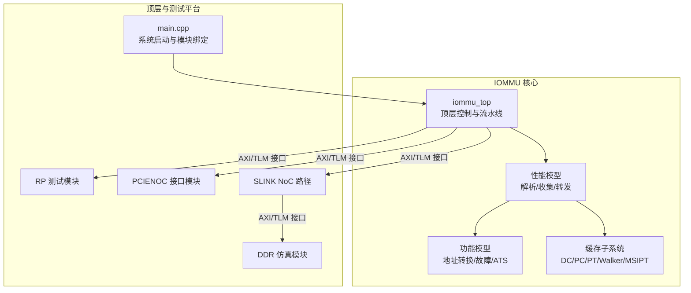
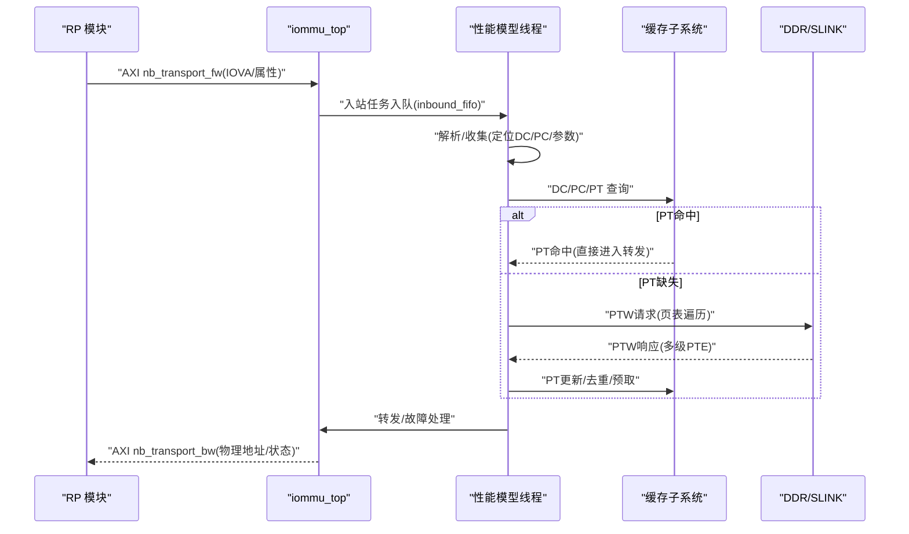
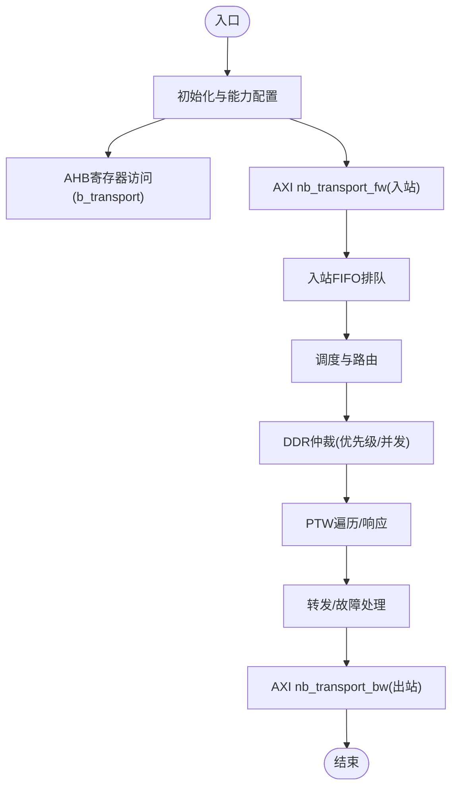
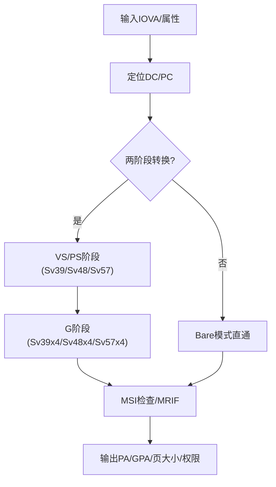
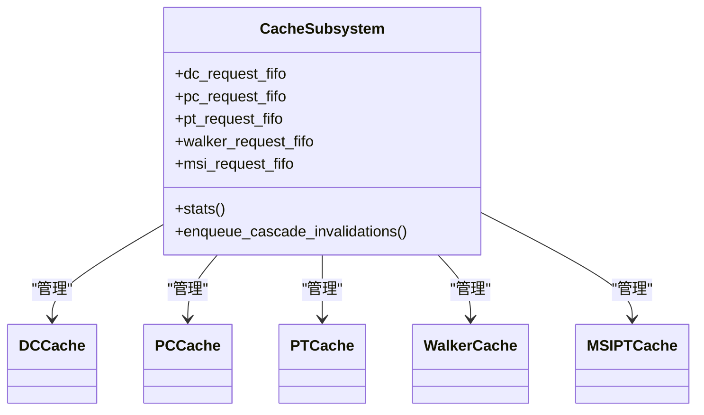
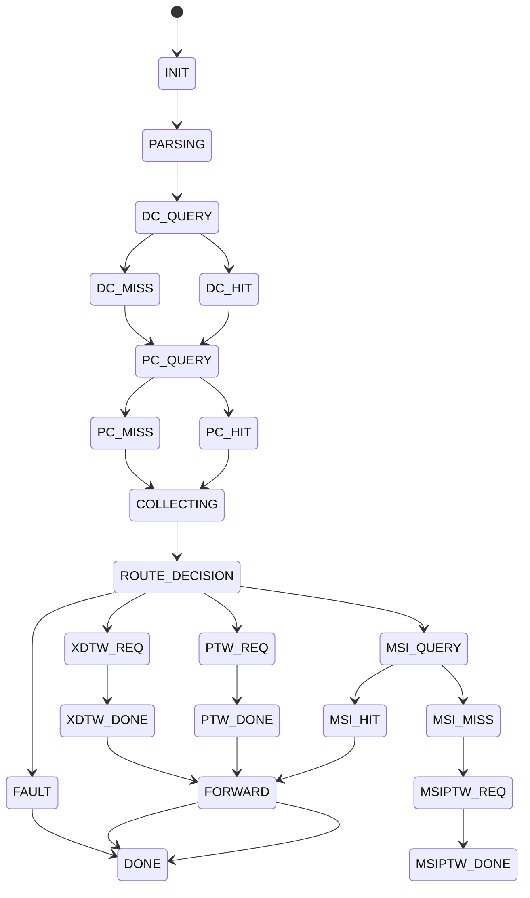
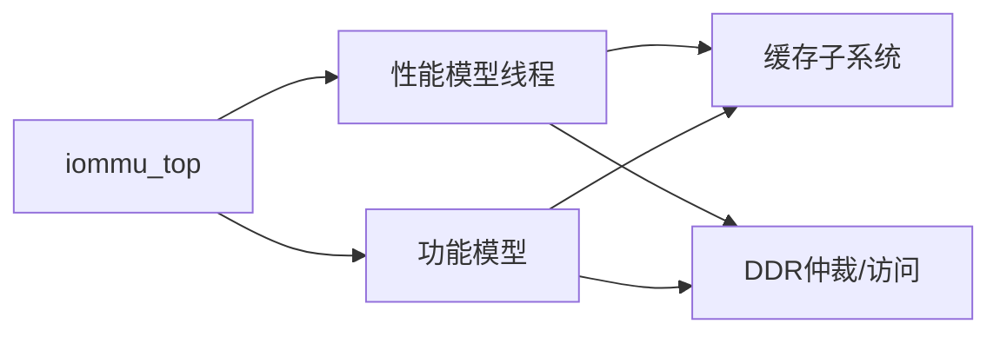

# 项目概述

<cite>
**本文档引用的文件**
- [README.md](file://README.md)
- [main.cpp](file://main.cpp)
- [iommu_top.cc](file://iommu\iommu_top.cc)
- [iommu_top.hh](file://iommu\iommu_top.hh)
- [iommu_struct.hh](file://iommu\include\iommu_struct.hh)
- [iommu_translate.hh](file://iommu\include\iommu_translate.hh)
- [iommu_data_structures.hh](file://iommu\include\iommu_data_structures.hh)
- [default_config.json](file://iommu\cache_config\default_config.json)
- [cache_subsystem.h](file://iommu\cache_src\subsystem\cache_subsystem.h)
- [iommu_task.hh](file://iommu\include\iommu_task.hh)
- [iommu_translate.cc](file://iommu\iommu_fun_model\iommu_translate.cc)
- [iommu_perf_model.hh](file://iommu\iommu_perf_model\iommu_perf_model.hh)
- [Makefile](file://Makefile)
</cite>

## 目录
1. [简介](#简介)
2. [项目结构](#项目结构)
3. [核心组件](#核心组件)
4. [架构总览](#架构总览)
5. [详细组件分析](#详细组件分析)
6. [依赖关系分析](#依赖关系分析)
7. [性能考量](#性能考量)
8. [故障排查指南](#故障排查指南)
9. [结论](#结论)
10. [附录](#附录)

## 简介
本项目是一个基于SystemC的RISC-V IOMMU（输入/输出内存管理单元）系统级仿真模型，旨在完整复现RISC-V架构下IOMMU的地址转换、故障处理、设备上下文与进程上下文管理、以及MSI（内存写中断）翻译等功能。项目采用高性能流水线架构，结合多级缓存（DC/PC/PT/Walker/MSIPT）与预取机制，支持SV39/SV48/SV57等二级地址转换模式，并提供丰富的统计与调试能力，便于开发者理解与优化IOMMU行为。

项目特点：
- 完整的两阶段地址转换（VS/PS阶段 + G阶段）
- 设备上下文（DC）与进程上下文（PC）解析与缓存
- PT Cache去重与预取（D=8）以降低页表遍历开销
- Walker Cache与多级失效流水线
- MSI地址识别与MRIF（内存驻留中断文件）支持
- 丰富的性能统计与稳态IOPS测量

## 项目结构
项目采用模块化分层组织，核心位于iommu目录，包含功能实现、性能模型、缓存子系统与公共工具。顶层main.cpp负责搭建测试平台，绑定IOMMU与RP/PCIENOC/DDR/SLink等模块，形成完整的SoC级验证环境。

图表来源
- [main.cpp:39-94](file://main.cpp#L39-L94)
- [iommu_top.hh:44-503](file://iommu\iommu_top.hh#L44-L503)

章节来源
- [README.md:63-76](file://README.md#L63-L76)
- [Makefile:52-94](file://Makefile#L52-L94)

## 核心组件
- 顶层模块 iommu_top：负责初始化、寄存器访问、AT回调、DDR仲裁、重排序输出、统计打印等。
- 性能模型：解析器（Parser）、收集器（Collector）、转发器（Forwarder）、故障处理（Fault/CQ）等线程化流水线。
- 功能模型：两阶段地址转换、设备/进程上下文定位、MSI翻译、ATS处理等。
- 缓存子系统：DC/PC/PT/Walker/MSIPT多级缓存，配套替换策略与统计收集。
- 任务与流水线：统一的任务结构体与状态机，贯穿整个翻译流程。

章节来源
- [iommu_top.hh:44-503](file://iommu\iommu_top.hh#L44-L503)
- [iommu_task.hh:185-280](file://iommu\include\iommu_task.hh#L185-L280)
- [cache_subsystem.h:21-189](file://iommu\cache_src\subsystem\cache_subsystem.h#L21-L189)

## 架构总览
IOMMU采用“解析-收集-查询-遍历-转发”的流水线架构。输入事务经解析器分类与属性提取，收集器定位DC/PC并确定翻译参数，随后进入缓存查询与页表遍历（PTW），最终通过转发器输出或进入故障处理。缓存子系统提供DC/PC/PT/Walker/MSIPT多级缓存，配合去重与预取提升吞吐。

图表来源
- [iommu_top.cc:140-201](file://iommu\iommu_top.cc#L140-L201)
- [iommu_top.cc:409-432](file://iommu\iommu_top.cc#L409-L432)
- [cache_subsystem.h:34-67](file://iommu\cache_src\subsystem\cache_subsystem.h#L34-L67)

## 详细组件分析

### 1) 顶层模块与接口
- 初始化与能力声明：在elaboration阶段完成IOMMU复位、能力与页表大小配置。
- 寄存器访问：AHB slave路径用于非性能路径的寄存器读写。
- AT回调：AXI nb_transport_fw处理RP输入，ddr_nb_transport_bw处理DDR回包。
- DDR仲裁：统一仲裁XDTW/PTW/MSIPTW与控制路径请求，限制并发与带宽。
- 输出重排序：按任务ID保序输出，确保写请求有序，读请求可乱序。

图表来源
- [iommu_top.cc:19-48](file://iommu\iommu_top.cc#L19-L48)
- [iommu_top.cc:53-78](file://iommu\iommu_top.cc#L53-L78)
- [iommu_top.cc:140-201](file://iommu\iommu_top.cc#L140-L201)
- [iommu_top.cc:279-404](file://iommu\iommu_top.cc#L279-L404)
- [iommu_top.cc:409-432](file://iommu\iommu_top.cc#L409-L432)

章节来源
- [iommu_top.cc:19-78](file://iommu\iommu_top.cc#L19-L78)
- [iommu_top.cc:140-274](file://iommu\iommu_top.cc#L140-L274)
- [iommu_top.cc:279-404](file://iommu\iommu_top.cc#L279-L404)
- [iommu_top.cc:409-432](file://iommu\iommu_top.cc#L409-L432)

### 2) 地址转换与上下文管理
- 设备上下文（DC）与进程上下文（PC）定位：根据设备ID与PASID/进程ID查找DC/PC，决定S/VS阶段页表根与PSCID。
- 两阶段地址转换：VS/PS阶段（S-stage或VS-stage）与G阶段（Guest Supervisor）联合完成，支持SV39/SV48/SV57及x4扩展模式。
- MSI地址识别：基于MSI地址掩码与模式匹配识别MSI写，支持Flat MSI页表与MRIF。
- Bare模式：当DDT模式为Bare时，直接透传或按配置页大小映射。

图表来源
- [iommu_translate.hh:95-130](file://iommu\include\iommu_translate.hh#L95-L130)
- [iommu_data_structures.hh:139-200](file://iommu\include\iommu_data_structures.hh#L139-L200)
- [iommu_data_structures.hh:260-282](file://iommu\include\iommu_data_structures.hh#L260-L282)
- [iommu_translate.cc:8-113](file://iommu\iommu_fun_model\iommu_translate.cc#L8-L113)

章节来源
- [iommu_translate.cc:8-142](file://iommu\iommu_fun_model\iommu_translate.cc#L8-L142)
- [iommu_translate.hh:95-130](file://iommu\include\iommu_translate.hh#L95-L130)
- [iommu_data_structures.hh:139-200](file://iommu\include\iommu_data_structures.hh#L139-L200)

### 3) 缓存架构与去重/预取
- 缓存子系统：DC/PC/PT/Walker/MSIPT五类缓存，独立请求/响应FIFO，避免串行瓶颈。
- 替换策略：PLRU与sRRIP（PT Cache），支持统计与任务跟踪。
- PT Cache去重与预取：同一页面的并发任务合并，预取深度D=8，减少重复DDR访问。
- Walker Cache：PTW三级缓存（c1/c2/c3），统一轮询调度，避免死锁。

图表来源
- [cache_subsystem.h:21-189](file://iommu\cache_src\subsystem\cache_subsystem.h#L21-L189)

章节来源
- [default_config.json:20-68](file://iommu\cache_config\default_config.json#L20-L68)
- [cache_subsystem.h:21-189](file://iommu\cache_src\subsystem\cache_subsystem.h#L21-L189)
- [iommu_task.hh:82-182](file://iommu\include\iommu_task.hh#L82-L182)

### 4) 任务与流水线
- 统一任务结构体：包含任务ID、设备/进程ID、IOVA、长度、地址类型、访问属性、上下文、遍历上下文、状态等。
- 状态机：从INIT到PARSE/DC_QUERY/PC_QUERY/PTW/MSI/FAULT/DONE，覆盖所有路径。
- 预取与去重：PT Cache去重表与预取组管理，支持Burst合并读取。

图表来源
- [iommu_task.hh:20-48](file://iommu\include\iommu_task.hh#L20-L48)

章节来源
- [iommu_task.hh:185-280](file://iommu\include\iommu_task.hh#L185-L280)
- [iommu_task.hh:82-182](file://iommu\include\iommu_task.hh#L82-L182)

### 5) 性能模型与参数
- 参数提取与校验：根据SXL与IOSATP/IOHGATP模式提取VPN、确定级别与PTE大小。
- Bare模式页大小：依据配置选择SV39/SV48/SV57 Bare页大小。
- MSI地址检查：基于掩码与模式匹配判断是否为MSI写。
- 任务跟踪与统计：记录PTW任务的DDR访问次数、延迟、端到端时间等。

章节来源
- [iommu_perf_model.hh:58-108](file://iommu\iommu_perf_model\iommu_perf_model.hh#L58-L108)
- [iommu_perf_model.hh:135-143](file://iommu\iommu_perf_model\iommu_perf_model.hh#L135-L143)
- [iommu_perf_model.hh:146-155](file://iommu\iommu_perf_model\iommu_perf_model.hh#L146-L155)

## 依赖关系分析
- 模块耦合：iommu_top作为中枢，协调性能模型与功能模型；缓存子系统通过明确的FIFO接口解耦。
- 外部依赖：SystemC、TLM、pthread、数学库；构建系统通过Makefile集中管理。
- 线程协作：Parser/Collector/Cache/PTW/Forwarder/Fault/CQ等线程通过FIFO与事件协同工作。

图表来源
- [iommu_top.hh:305-496](file://iommu\iommu_top.hh#L305-L496)
- [Makefile:23-36](file://Makefile#L23-L36)

章节来源
- [Makefile:23-36](file://Makefile#L23-L36)
- [iommu_top.hh:305-496](file://iommu\iommu_top.hh#L305-L496)

## 性能考量
- 并发与带宽控制：通过outstanding计数与带宽延迟，限制入口/出口/DDR端口压力。
- 缓存层次与替换：DC/PC/PT/Walker/MSIPT独立缓存，PLRU与sRRIP平衡命中率与实现复杂度。
- 去重与预取：PT Cache去重显著减少重复PTW；预取深度D=8在高并发场景下收益明显。
- 统计与稳态：提供IOPS、端到端延迟、DDR访问统计与稳态窗口分析，便于性能评估。

## 故障排查指南
- 调试宏：DEBUG/DEBUG_TRANSLATION/DEBUG_TWOSTAGE/DEBUG_MSITRANS/DEBUG_COMMANDS等可在构建时开启。
- 日志与事件：顶层打印关键路径（如PTW完成、去重恢复、缓存统计）；事件驱动的重排序与仲裁便于定位瓶颈。
- 常见问题：
  - DDR仲裁超时：检查outstanding与带宽配置。
  - PTW频繁miss：确认PT Cache去重与预取参数，核对页表层级与PTE大小。
  - ATS/MSI异常：检查DC/PC配置与MSI地址掩码/模式。

章节来源
- [Makefile:27-33](file://Makefile#L27-L33)
- [iommu_top.cc:554-779](file://iommu\iommu_top.cc#L554-L779)

## 结论
本项目以SystemC实现了RISC-V IOMMU的完整功能仿真，涵盖两阶段地址转换、设备/进程上下文管理、MSI翻译、缓存与预取、以及详尽的性能统计。其模块化设计与清晰的接口使得开发者既能快速上手，也能深入理解IOMMU内部机制与性能特征。

## 附录
- 构建与运行：WSL环境、SystemC库、GCC/G++与GNU Make；支持DEBUG/RELEASE两种模式。
- 测试场景：支持rand4k、seq128k、sv48_bare等场景，可通过Makefile TEST参数切换。
- 配置文件：default_config.json定义缓存容量、替换策略与统计输出参数。

章节来源
- [README.md:7-92](file://README.md#L7-L92)
- [Makefile:10-16](file://Makefile#L10-L16)
- [Makefile:39-49](file://Makefile#L39-L49)
- [default_config.json:1-69](file://iommu\cache_config\default_config.json#L1-L69)