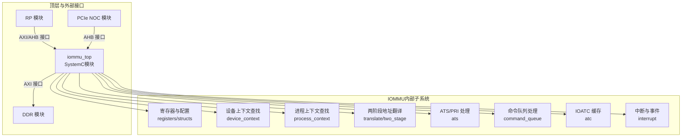
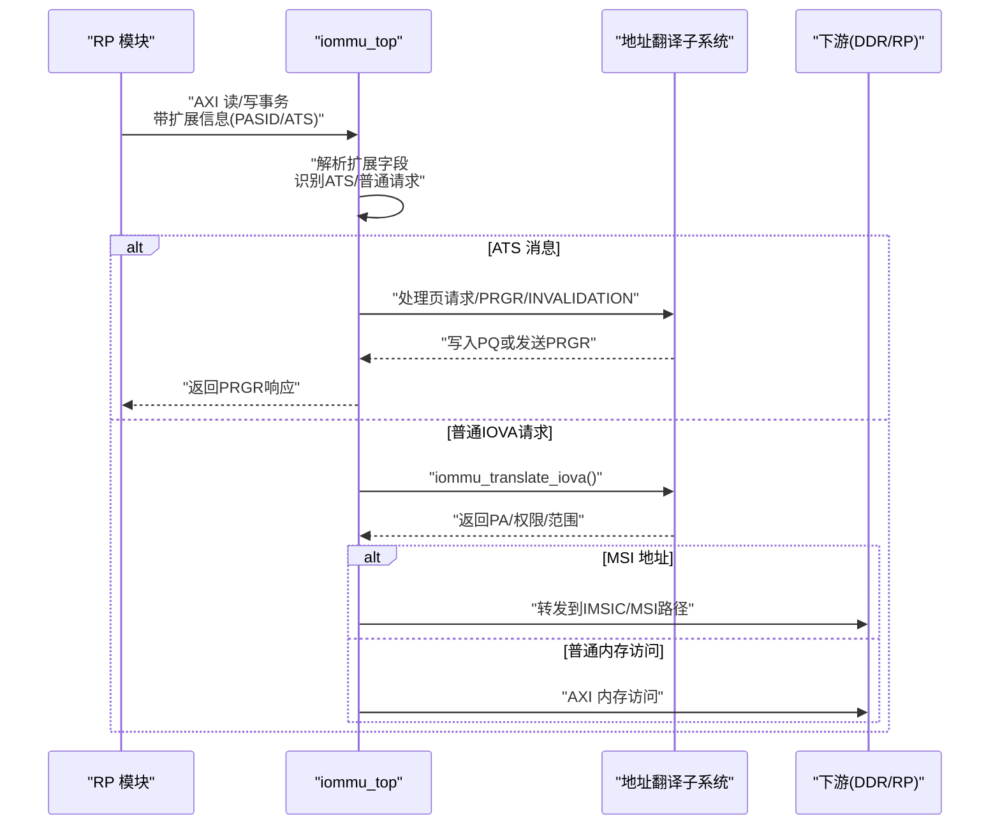
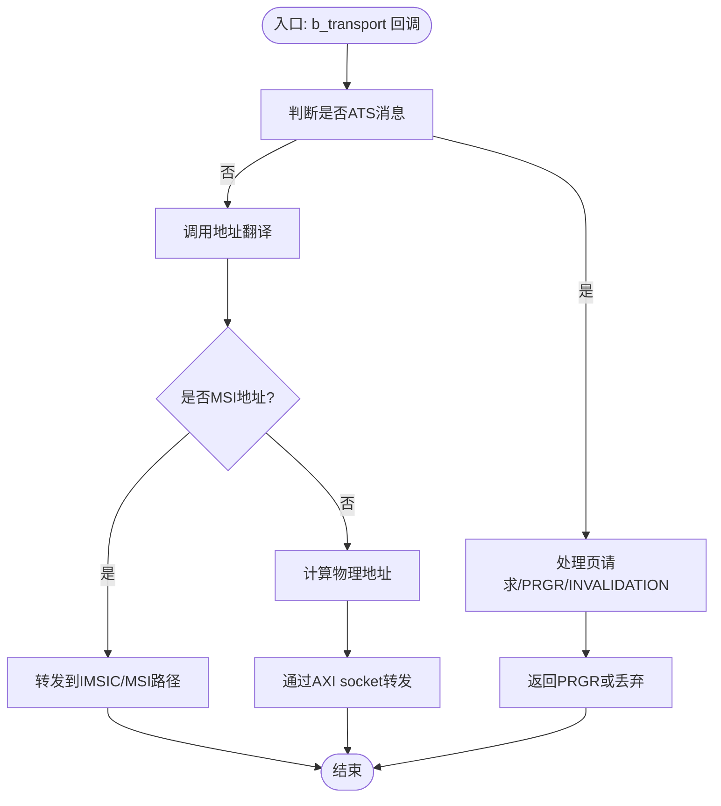
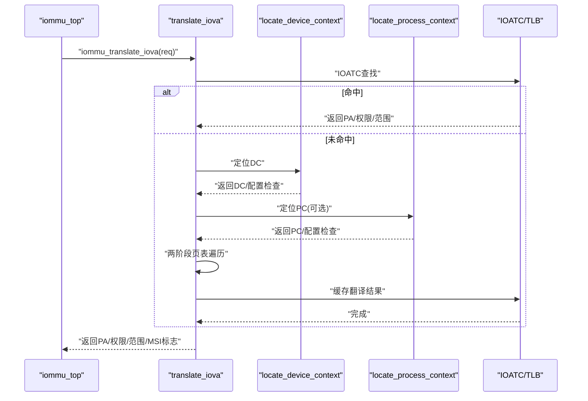
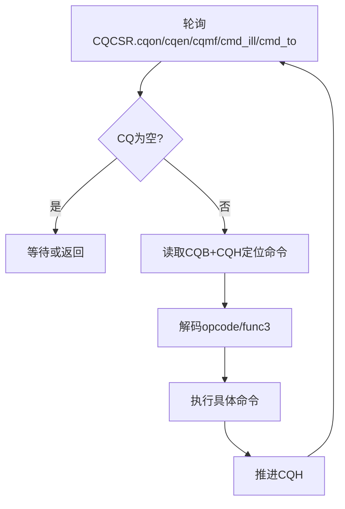
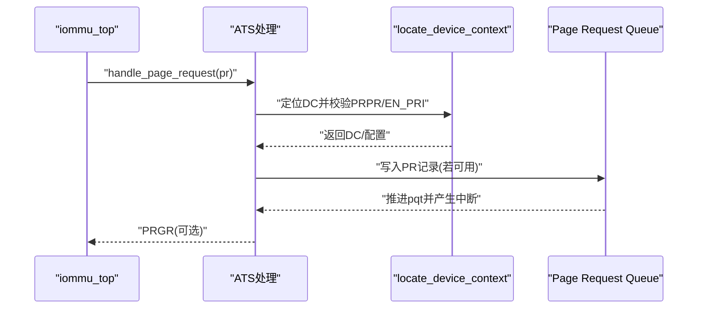
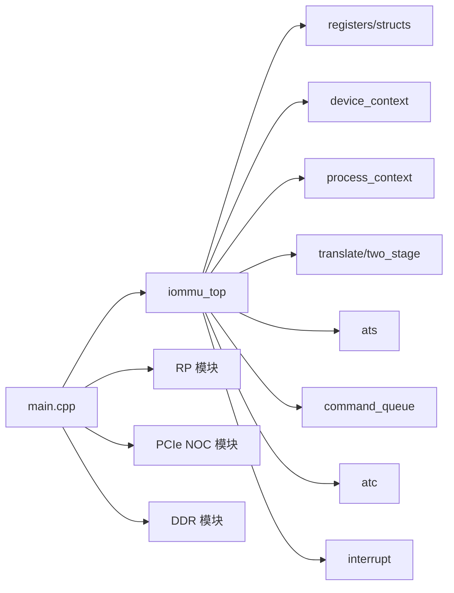

# 技术架构

<cite>
**本文引用的文件**
- [iommu_top.cc](file://iommu/iommu_top.cc)
- [iommu_top.hh](file://iommu/iommu_top.hh)
- [iommu_translate.cc](file://iommu/iommu_translate.cc)
- [iommu_translate.hh](file://iommu/iommu_translate.hh)
- [iommu_command_queue.cc](file://iommu/iommu_command_queue.cc)
- [iommu_device_context.cc](file://iommu/iommu_device_context.cc)
- [iommu_process_context.cc](file://iommu/iommu_process_context.cc)
- [iommu_struct.hh](file://iommu/iommu_struct.hh)
- [iommu_registers.hh](file://iommu/iommu_registers.hh)
- [iommu_req_rsp.hh](file://iommu/iommu_req_rsp.hh)
- [iommu_interrupt.hh](file://iommu/iommu_interrupt.hh)
- [iommu_ats.cc](file://iommu/iommu_ats.cc)
- [iommu_atc.cc](file://iommu/iommu_atc.cc)
- [main.cpp](file://main.cpp)
- [Makefile](file://Makefile)
</cite>

## 目录
1. [引言](#引言)
2. [项目结构](#项目结构)
3. [核心组件](#核心组件)
4. [架构总览](#架构总览)
5. [详细组件分析](#详细组件分析)
6. [依赖分析](#依赖分析)
7. [性能考虑](#性能考虑)
8. [故障排查指南](#故障排查指南)
9. [结论](#结论)

## 引言
本文件面向RISC-V IOMMU系统（基于SystemC与TLM）的技术架构文档，聚焦于iommu_top顶层模块的设计理念与实现，阐述各子模块职责、数据流与控制流，并以图示方式展示模块间关系与交互路径。文档既为有经验的开发者提供深入的代码级细节，也为初学者提供清晰的概念解释与循序渐进的阅读路径。

## 项目结构
该项目采用模块化分层组织，围绕SystemC与TLM构建可插拔的IOMMU模型，顶层通过TLM sockets连接RP（Root Port）、PCIe NOC、以及DDR等外部模块，内部则按功能划分为寄存器接口、地址翻译、命令队列、ATS/PRI、中断与性能监控等子系统。

图表来源
- [main.cpp:60-73](file://main.cpp#L60-L73)
- [iommu_top.hh:19-55](file://iommu/iommu_top.hh#L19-L55)

章节来源
- [Makefile:29-50](file://Makefile#L29-L50)
- [main.cpp:38-87](file://main.cpp#L38-L87)

## 核心组件
- iommu_top：顶层SystemC模块，负责初始化IOMMU状态、注册TLM b_transport回调、桥接AXI/AHB事务、触发翻译与转发至下游。
- 地址翻译子系统：实现两阶段地址翻译、MSI地址翻译、ATS响应生成、TLB/IOATC缓存管理。
- 命令队列：解析软件提交的命令，执行无效化、FENCE、ATS消息等操作。
- 设备/进程上下文：根据设备ID与进程ID定位DC/PC，校验配置合法性。
- ATS/PRI：处理PCIe ATS消息（页请求、PRGR、INVALIDATION），维护ITAG跟踪。
- 中断与事件：生成并上报各类中断（命令队列、故障队列、HPM、页面队列）。
- 寄存器与数据结构：统一的寄存器布局、能力位、控制位、队列基址与索引等。

章节来源
- [iommu_top.hh:19-55](file://iommu/iommu_top.hh#L19-L55)
- [iommu_top.cc:6-36](file://iommu/iommu_top.cc#L6-L36)
- [iommu_translate.cc:8-120](file://iommu/iommu_translate.cc#L8-L120)
- [iommu_command_queue.cc:7-60](file://iommu/iommu_command_queue.cc#L7-L60)
- [iommu_device_context.cc:9-40](file://iommu/iommu_device_context.cc#L9-L40)
- [iommu_process_context.cc:11-40](file://iommu/iommu_process_context.cc#L11-L40)
- [iommu_ats.cc:7-33](file://iommu/iommu_ats.cc#L7-L33)
- [iommu_atc.cc:7-49](file://iommu/iommu_atc.cc#L7-L49)
- [iommu_interrupt.hh:16-25](file://iommu/iommu_interrupt.hh#L16-L25)
- [iommu_registers.hh:172-250](file://iommu/iommu_registers.hh#L172-L250)

## 架构总览
IOMMU采用SystemC + TLM的模块化设计，通过简单目标/发起器socket实现松耦合通信。顶层iommu_top在elaborate阶段完成寄存器初始化与能力位配置，并注册AXI/AHB侧b_transport回调；当收到上游事务时，解析扩展信息（如请求者ID、ATS消息类型等），调用地址翻译子系统进行IOVA到PA转换或MSI地址翻译，再将结果通过相应socket转发给下游（如RP或DDR）。

图表来源
- [iommu_top.cc:41-210](file://iommu/iommu_top.cc#L41-L210)
- [iommu_translate.cc:8-120](file://iommu/iommu_translate.cc#L8-L120)
- [iommu_ats.cc:96-373](file://iommu/iommu_ats.cc#L96-L373)

章节来源
- [iommu_top.cc:41-210](file://iommu/iommu_top.cc#L41-L210)
- [iommu_translate.cc:8-120](file://iommu/iommu_translate.cc#L8-L120)
- [iommu_ats.cc:96-373](file://iommu/iommu_ats.cc#L96-L373)

## 详细组件分析

### iommu_top 顶层模块
- 职责
  - 在elaborate阶段完成IOMMU复位、能力位与模式配置。
  - 注册AXI与AHB侧b_transport回调，解析扩展信息（requester_id、ATS消息类型等）。
  - 触发地址翻译或ATS处理，根据结果转发到不同下游socket或直接返回。
- 关键接口
  - AXI简单目标socket接收来自RP/PCIe NOC的事务。
  - AXI简单发起器socket用于向DDR/RP/IMSIC等下游转发。
  - 线程驱动命令队列监控事件，触发命令处理。
- 数据/控制流
  - 从AXI侧接收tlm_generic_payload，提取扩展信息后进入翻译或ATS路径。
  - 翻译成功后计算物理地址并转发；若为MSI则走特殊路径。
  - ATS消息进入ATS子系统，必要时写入PQ或发送PRGR。

图表来源
- [iommu_top.cc:41-210](file://iommu/iommu_top.cc#L41-L210)
- [iommu_ats.cc:96-373](file://iommu/iommu_ats.cc#L96-L373)

章节来源
- [iommu_top.hh:19-55](file://iommu/iommu_top.hh#L19-L55)
- [iommu_top.cc:6-36](file://iommu/iommu_top.cc#L6-L36)
- [iommu_top.cc:41-210](file://iommu/iommu_top.cc#L41-L210)

### 地址翻译子系统（两阶段）
- 职责
  - 完成从IOVA到PA的两阶段地址翻译，支持Bare、Sv39/48/57及G-stage。
  - 支持MSI地址翻译（Flat/MRIF），并处理ATS翻译响应格式。
  - 通过IOATC/TLB缓存加速重复翻译。
- 关键流程
  - 解析请求类型（未翻译/已翻译/ATS请求），提取读写/执行/特权属性。
  - 查找设备上下文与进程上下文，校验配置与宽度限制。
  - 执行两阶段页表遍历，结合G-stage与VS-stage权限与PBMT合并。
  - 若命中MSI且非MRIF，则跳过G-stage；否则继续G-stage翻译。
  - 缓存翻译结果（NAPOT格式）以便后续命中。

图表来源
- [iommu_translate.cc:8-120](file://iommu/iommu_translate.cc#L8-L120)
- [iommu_device_context.cc:9-40](file://iommu/iommu_device_context.cc#L9-L40)
- [iommu_process_context.cc:11-40](file://iommu/iommu_process_context.cc#L11-L40)
- [iommu_atc.cc:95-147](file://iommu/iommu_atc.cc#L95-L147)

章节来源
- [iommu_translate.cc:8-120](file://iommu/iommu_translate.cc#L8-L120)
- [iommu_translate.cc:332-492](file://iommu/iommu_translate.cc#L332-L492)
- [iommu_device_context.cc:9-40](file://iommu/iommu_device_context.cc#L9-L40)
- [iommu_process_context.cc:11-40](file://iommu/iommu_process_context.cc#L11-L40)
- [iommu_atc.cc:95-147](file://iommu/iommu_atc.cc#L95-L147)

### 命令队列（Command Queue）
- 职责
  - 从内存队列顺序取出命令，解码并执行，包括IOTINVAL、IODIR、IOFENCE、ATS等。
  - 管理队列状态寄存器（启用/溢出/非法/超时等），在异常时生成中断。
  - 协调ATS无效化与IOFENCE完成时机，确保全局有序性。
- 关键点
  - 队列基址/头/尾由寄存器配置，支持范围无效化与非叶子PTE无效化扩展。
  - ATS命令分配ITAG，跟踪完成/超时，与IOFENCE等待链路协同。

图表来源
- [iommu_command_queue.cc:7-60](file://iommu/iommu_command_queue.cc#L7-L60)
- [iommu_command_queue.cc:112-276](file://iommu/iommu_command_queue.cc#L112-L276)
- [iommu_command_queue.cc:540-675](file://iommu/iommu_command_queue.cc#L540-L675)

章节来源
- [iommu_command_queue.cc:7-60](file://iommu/iommu_command_queue.cc#L7-L60)
- [iommu_command_queue.cc:112-276](file://iommu/iommu_command_queue.cc#L112-L276)
- [iommu_command_queue.cc:540-675](file://iommu/iommu_command_queue.cc#L540-L675)

### ATS/PRI 子系统
- 职责
  - 处理PCIe ATS消息：页请求（PR）、停止标记（Stop）、PRGR、INVALIDATION。
  - 维护ITAG跟踪，管理无效化请求的生命周期与超时。
  - 将页请求写入PQ，或在无法入队时自动生成PRGR响应。
- 关键流程
  - 页请求到达后，先做模式与设备ID宽度检查，再定位DC，最后写入PQ或生成PRGR。
  - INVALIDATION命令分配ITAG并发送消息，等待完成或超时，再继续IOFENCE或释放阻塞的命令。

图表来源
- [iommu_ats.cc:96-373](file://iommu/iommu_ats.cc#L96-L373)
- [iommu_device_context.cc:9-40](file://iommu/iommu_device_context.cc#L9-L40)

章节来源
- [iommu_ats.cc:7-33](file://iommu/iommu_ats.cc#L7-L33)
- [iommu_ats.cc:96-373](file://iommu/iommu_ats.cc#L96-L373)

### IOATC/TLB 缓存
- 职责
  - 缓存DC/PC与地址翻译结果，减少重复页表遍历与内存访问。
  - 提供快速匹配与权限检查，支持NAPOT范围匹配与LRU替换策略。
- 关键点
  - 翻译命中时直接返回PA与权限，未命中则触发页表遍历并写入缓存。
  - 对G-stage权限变化或D位清零的写访问，会主动失效TLB条目以触发重查。

章节来源
- [iommu_atc.cc:95-147](file://iommu/iommu_atc.cc#L95-L147)
- [iommu_atc.cc:149-232](file://iommu/iommu_atc.cc#L149-L232)

### 寄存器与数据结构
- 能力位与控制位
  - capabilities：支持的页表模式、MSI模式、ATS/PRI、HPM、端序等。
  - ddtp：设备目录表根指针与IOMMU模式（Off/Bare/1LVL/2LVL/3LVL）。
  - fctl：端序、中断模式、G-stage地址模式控制。
- 队列寄存器
  - CQB/CQH/CQT：命令队列基址、头、尾。
  - FQB/FQH/FQT：故障队列基址、头、尾。
  - PQB/PQH/PQT：页请求队列基址、头、尾。
  - CSR：队列使能、溢出、非法、超时、忙等状态。
- 请求/响应结构
  - hb_to_iommu_req_t：设备ID、进程ID、请求类型、长度、读写/执行/特权。
  - iommu_to_hb_rsp_t：翻译结果（PPN、S、权限、PBMT、MSI标志等）。

章节来源
- [iommu_registers.hh:172-250](file://iommu/iommu_registers.hh#L172-L250)
- [iommu_registers.hh:286-330](file://iommu/iommu_registers.hh#L286-L330)
- [iommu_registers.hh:456-549](file://iommu/iommu_registers.hh#L456-L549)
- [iommu_req_rsp.hh:29-102](file://iommu/iommu_req_rsp.hh#L29-L102)

## 依赖分析
- 模块内聚与耦合
  - iommu_top高内聚地封装了TLM接口与顶层控制逻辑，与其他子系统通过函数调用耦合，保持松耦合。
  - 地址翻译子系统依赖设备/进程上下文与寄存器配置，形成清晰的数据依赖链。
- 外部依赖
  - SystemC与TLM库，编译期通过Makefile链接。
  - 主程序main.cpp负责实例化模块并建立socket绑定关系。

图表来源
- [iommu_top.hh:19-55](file://iommu/iommu_top.hh#L19-L55)
- [main.cpp:48-73](file://main.cpp#L48-L73)

章节来源
- [iommu_top.hh:19-55](file://iommu/iommu_top.hh#L19-L55)
- [main.cpp:48-73](file://main.cpp#L48-L73)

## 性能考虑
- 缓存优化
  - IOATC/TLB使用LRU替换，NAPOT格式存储范围，减少页表遍历次数。
  - ATS翻译命中可直接返回，避免G-stage遍历。
- 并发与异步
  - 命令队列与ATS无效化采用异步处理，通过ITAG与事件机制协调完成与超时。
- 内存访问
  - 严格对齐与PAS掩码检查，避免越界访问；队列内存访问失败会置位错误位并生成中断。

## 故障排查指南
- 常见问题与定位
  - 命令队列异常：检查CQCSR.cqmf/cmd_ill/cmd_to，确认队列启用与内存可达性。
  - ATS/PRI异常：检查PQCSR.pqmf/pqof，确认队列启用与容量；核对DC配置（EN_PRI/PRPR）。
  - 翻译失败：查看iotval/iotval2与cause编码，区分页故障、权限故障、配置错误等。
- 中断与事件
  - 通过IPS寄存器查询中断挂起状态，结合各CSR状态位定位问题来源。
- 调试开关
  - 编译时开启DEBUG_*宏（如DEBUG_TRANSLATION/DEBUG_COMMANDS/DEBUG_ATC等）以输出详细日志。

章节来源
- [iommu_command_queue.cc:48-64](file://iommu/iommu_command_queue.cc#L48-L64)
- [iommu_ats.cc:193-232](file://iommu/iommu_ats.cc#L193-L232)
- [iommu_translate.cc:654-707](file://iommu/iommu_translate.cc#L654-L707)
- [iommu_interrupt.hh:23-25](file://iommu/iommu_interrupt.hh#L23-L25)

## 结论
该IOMMU系统以iommu_top为核心，通过SystemC/TLM实现松耦合的模块化架构：顶层负责接口与控制，内部以寄存器/上下文/翻译/ATS/队列/缓存等子系统分工协作，形成可扩展、可调试、可验证的RISC-V IOMMU参考模型。借助IOATC/TLB与两阶段翻译机制，系统在功能完整性与性能之间取得平衡；通过队列与中断机制，满足复杂平台下的可靠性与可观测性需求。