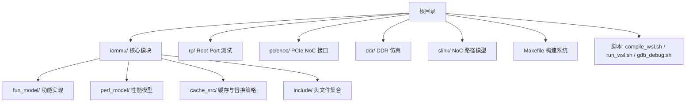
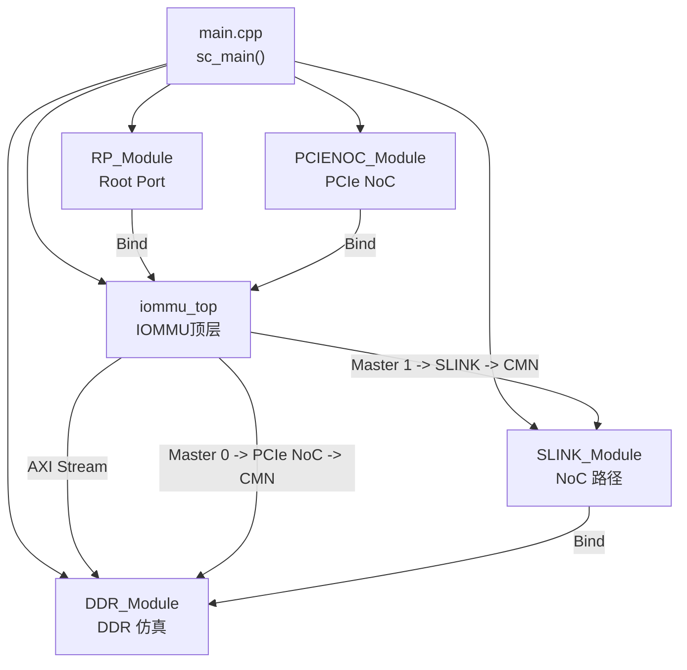
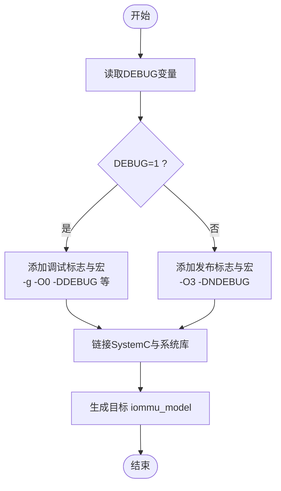
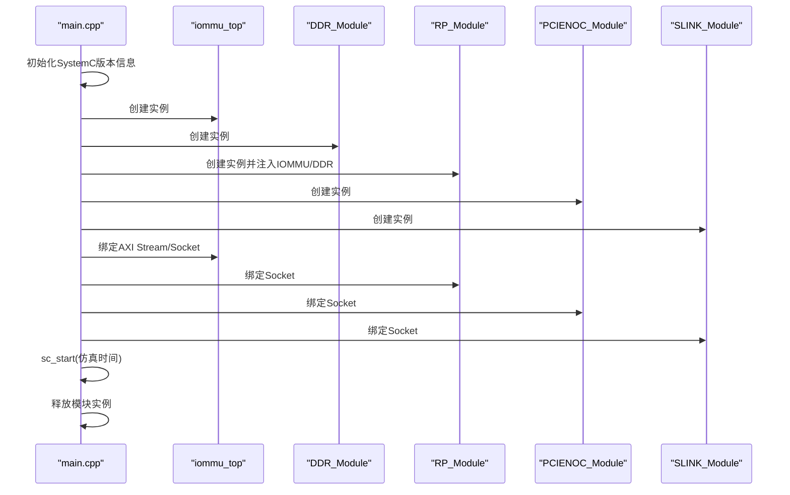
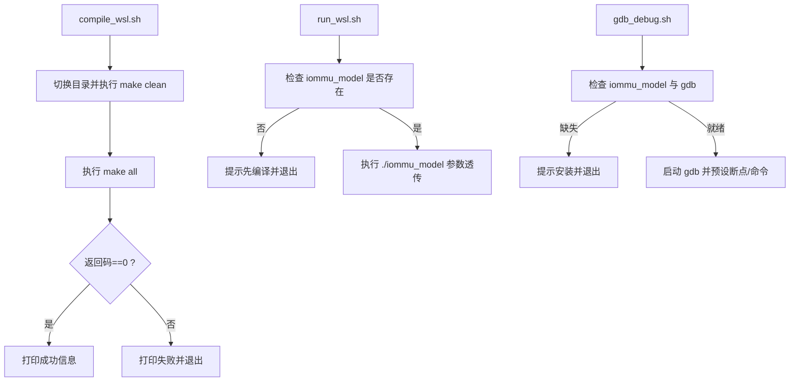
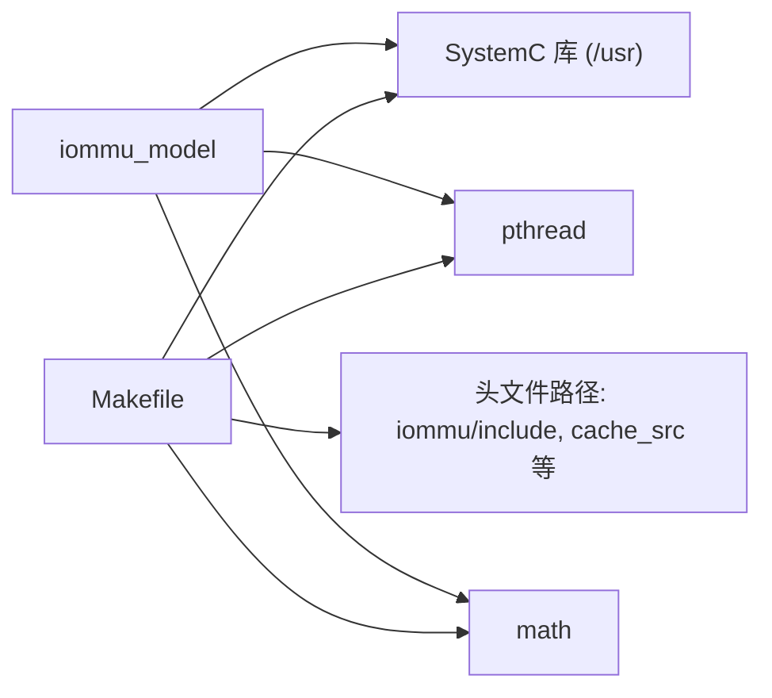

# 技术要求

<cite>
**本文引用的文件**
- [README.md](file://README.md)
- [Makefile](file://Makefile)
- [compile_wsl.sh](file://compile_wsl.sh)
- [run_wsl.sh](file://run_wsl.sh)
- [compile_systemc.bat](file://compile_systemc.bat)
- [GDB_DEBUG_GUIDE.md](file://GDB_DEBUG_GUIDE.md)
- [gdb_debug.sh](file://gdb_debug.sh)
- [main.cpp](file://main.cpp)
- [check_order.sh](file://check_order.sh)
- [check_ports.sh](file://check_ports.sh)
</cite>

## 目录
1. [引言](#引言)
2. [项目结构](#项目结构)
3. [核心组件](#核心组件)
4. [架构总览](#架构总览)
5. [详细组件分析](#详细组件分析)
6. [依赖关系分析](#依赖关系分析)
7. [性能考量](#性能考量)
8. [故障排查指南](#故障排查指南)
9. [结论](#结论)
10. [附录](#附录)

## 引言
本技术要求文档面向RISC-V IOMMU SystemC模型项目的使用者与维护者，聚焦于编译与运行环境的完整配置清单、不同编译模式的差异与选择、以及在WSL2环境下验证与排障的实操步骤。文档严格依据仓库内现有说明与脚本，确保内容可追溯、可复现、对初学者友好。

## 项目结构
项目采用分层模块化组织：
- 根目录包含顶层入口、构建脚本与运行脚本
- iommu/ 子目录包含IOMMU核心功能模块、性能模型、缓存子系统与公共组件
- 测试模块位于 rp/、pcienoc/、ddr/、slink/ 等目录
- 构建系统由Makefile驱动，支持多测试场景与调试/发布模式切换

图表来源
- [Makefile: 42-84:42-84](file://Makefile#L42-L84)
- [README.md: 63-76:63-76](file://README.md#L63-L76)

章节来源
- [README.md: 63-76:63-76](file://README.md#L63-L76)
- [Makefile: 42-84:42-84](file://Makefile#L42-L84)

## 核心组件
- 构建系统与编译模式
  - Makefile定义了编译器、SystemC库路径、编译标志与目标产物
  - 支持DEBUG=1（调试模式，默认）与DEBUG=0（发布模式）
  - 提供TEST参数选择不同测试场景（默认sv39_bare，或sv48_bare）
- 顶层入口与绑定
  - main.cpp负责创建各模块实例并建立SystemC/TLM互连
- 脚本化编译与运行
  - compile_wsl.sh与run_wsl.sh封装WSL环境下的编译与运行流程
  - gdb_debug.sh提供GDB调试会话的便捷入口

章节来源
- [Makefile: 13-33:13-33](file://Makefile#L13-L33)
- [Makefile: 22-30:22-30](file://Makefile#L22-L30)
- [Makefile: 35-40:35-40](file://Makefile#L35-L40)
- [main.cpp: 39-94:39-94](file://main.cpp#L39-L94)
- [compile_wsl.sh: 1-15:1-15](file://compile_wsl.sh#L1-L15)
- [run_wsl.sh: 1-16:1-16](file://run_wsl.sh#L1-L16)
- [gdb_debug.sh: 1-37:1-37](file://gdb_debug.sh#L1-L37)

## 架构总览
下图展示了顶层模块与外部接口的连接关系，体现IOMMU在SystemC/TLM框架中的角色与数据流。

图表来源
- [main.cpp: 49-80:49-80](file://main.cpp#L49-L80)

章节来源
- [main.cpp: 39-94:39-94](file://main.cpp#L39-L94)

## 详细组件分析

### 构建系统与编译模式
- 编译器与SystemC库
  - 使用g++/gcc作为编译器
  - SystemC库路径默认指向/usr（Linux系统安装）
  - 链接时使用-lsystemc与pthread、math库
- 编译标志与模式
  - DEBUG=1：启用-g -O0与大量DEBUG_*宏，便于调试
  - DEBUG=0：启用-O3与-NDEBUG，优化性能，去除调试信息
- 测试场景
  - TEST=sv39_bare（默认）或TEST=sv48_bare，对应不同的测试线程源文件
- 目标产物
  - 生成可执行文件iommu_model

图表来源
- [Makefile: 22-33:22-33](file://Makefile#L22-L33)
- [Makefile: 13-17:13-17](file://Makefile#L13-L17)

章节来源
- [Makefile: 9-33:9-33](file://Makefile#L9-L33)
- [Makefile: 35-40:35-40](file://Makefile#L35-L40)
- [Makefile: 96-104:96-104](file://Makefile#L96-L104)

### 顶层入口与模块绑定
- 创建并绑定模块实例，建立AXI/TLM互连
- 启动SystemC仿真，设定仿真时间
- 仿真结束后释放资源

图表来源
- [main.cpp: 39-94:39-94](file://main.cpp#L39-L94)

章节来源
- [main.cpp: 39-94:39-94](file://main.cpp#L39-L94)

### 脚本化编译与运行
- compile_wsl.sh
  - 在WSL中切换到项目目录，执行make clean与make all
  - 成功输出二进制名称，失败则退出并提示
- run_wsl.sh
  - 检查iommu_model是否存在，不存在则提示先编译
  - 存在则执行./iommu_model并传递参数
- gdb_debug.sh
  - 检查可执行文件与GDB可用性
  - 自动启动GDB并预设断点与常用命令

图表来源
- [compile_wsl.sh: 4-15:4-15](file://compile_wsl.sh#L4-L15)
- [run_wsl.sh: 7-15:7-15](file://run_wsl.sh#L7-L15)
- [gdb_debug.sh: 7-37:7-37](file://gdb_debug.sh#L7-L37)

章节来源
- [compile_wsl.sh: 1-15:1-15](file://compile_wsl.sh#L1-L15)
- [run_wsl.sh: 1-16:1-16](file://run_wsl.sh#L1-L16)
- [gdb_debug.sh: 1-37:1-37](file://gdb_debug.sh#L1-L37)

### 调试与验证脚本
- check_order.sh 与 check_ports.sh
  - 用于分析输出日志中的重排序、并发统计与端口占用情况
  - 适合在DEBUG模式下运行后进行结果验证

章节来源
- [check_order.sh: 1-30:1-30](file://check_order.sh#L1-L30)
- [check_ports.sh: 1-13:1-13](file://check_ports.sh#L1-L13)

## 依赖关系分析
- 编译期依赖
  - SystemC库（/usr目录）与pthread、math库
  - 头文件搜索路径覆盖iommu/及其子模块
- 运行期依赖
  - 已链接的SystemC共享库需在运行环境中可用
  - 可执行文件iommu_model依赖SystemC运行时

图表来源
- [Makefile: 13-17:13-17](file://Makefile#L13-L17)
- [Makefile: 32-33:32-33](file://Makefile#L32-L33)
- [Makefile: 20](file://Makefile#L20)

章节来源
- [Makefile: 13-33:13-33](file://Makefile#L13-L33)

## 性能考量
- 调试模式（DEBUG=1）
  - 启用-g -O0，便于调试但性能较低
  - 包含大量DEBUG_*宏，输出更丰富
- 发布模式（DEBUG=0）
  - 启用-O3 -DNDEBUG，优化性能，移除调试信息
  - 适合大规模请求与性能评估

章节来源
- [Makefile: 22-30:22-30](file://Makefile#L22-L30)
- [README.md: 48-53:48-53](file://README.md#L48-L53)

## 故障排查指南
- 环境与工具
  - 必须在WSL2环境中编译与运行
  - SystemC库需安装在Linux环境（/usr）
  - 确保g++支持C++17（Makefile中显式使用）
- 常见问题与解决
  - 未安装SystemC或路径不正确：检查/usr下的SystemC头文件与库是否存在
  - 未安装GDB：在Ubuntu上使用apt安装gdb
  - 可执行文件不存在：先执行make all或使用compile_wsl.sh
  - 编译失败：查看返回码，确认依赖与路径配置
- 调试辅助
  - 使用gdb_debug.sh快速启动GDB并设置断点
  - 参考GDB_DEBUG_GUIDE.md中的断点与变量检查建议

章节来源
- [README.md: 7-16:7-16](file://README.md#L7-L16)
- [README.md: 81-86:81-86](file://README.md#L81-L86)
- [gdb_debug.sh: 14-20:14-20](file://gdb_debug.sh#L14-L20)
- [GDB_DEBUG_GUIDE.md: 8-16:8-16](file://GDB_DEBUG_GUIDE.md#L8-L16)

## 结论
本项目要求在WSL2的Linux环境中使用SystemC 2.3.x与C++17标准进行编译，通过Makefile与脚本化工具简化构建与运行流程。调试模式默认开启，便于问题定位；发布模式用于性能评估。遵循本文档的环境配置与验证步骤，可确保项目在WSL2中稳定编译与运行。

## 附录

### 环境配置与验证步骤
- WSL2与Ubuntu
  - 安装WSL2并配置Ubuntu发行版
- SystemC库安装
  - 将SystemC安装到/usr目录（Linux环境）
  - 确认/usr/include与/usr/lib/x86_64-linux-gnu存在SystemC相关文件
- 编译器与工具链
  - 安装g++（支持C++17）
  - 安装GNU Make
- 验证编译环境
  - 使用make clean && make all进行编译
  - 使用compile_wsl.sh一键编译
- 验证运行环境
  - 使用run_wsl.sh运行可执行文件
  - 使用check_order.sh与check_ports.sh分析输出

章节来源
- [README.md: 7-16:7-16](file://README.md#L7-L16)
- [README.md: 17-53:17-53](file://README.md#L17-L53)
- [compile_wsl.sh: 4-15:4-15](file://compile_wsl.sh#L4-L15)
- [run_wsl.sh: 7-15:7-15](file://run_wsl.sh#L7-L15)
- [check_order.sh: 1-30:1-30](file://check_order.sh#L1-L30)
- [check_ports.sh: 1-13:1-13](file://check_ports.sh#L1-L13)

### 编译模式选择与适用场景
- 调试模式（DEBUG=1）
  - 适用于开发与问题定位，包含丰富调试输出
- 发布模式（DEBUG=0）
  - 适用于性能评估与大规模请求测试，优化运行效率

章节来源
- [Makefile: 22-30:22-30](file://Makefile#L22-L30)
- [README.md: 48-53:48-53](file://README.md#L48-L53)