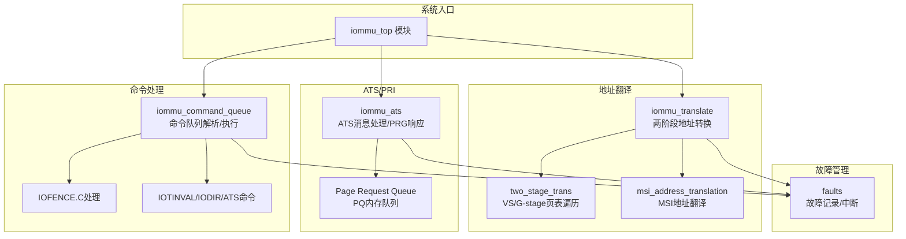
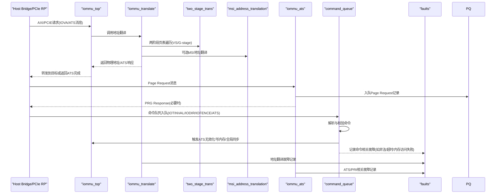
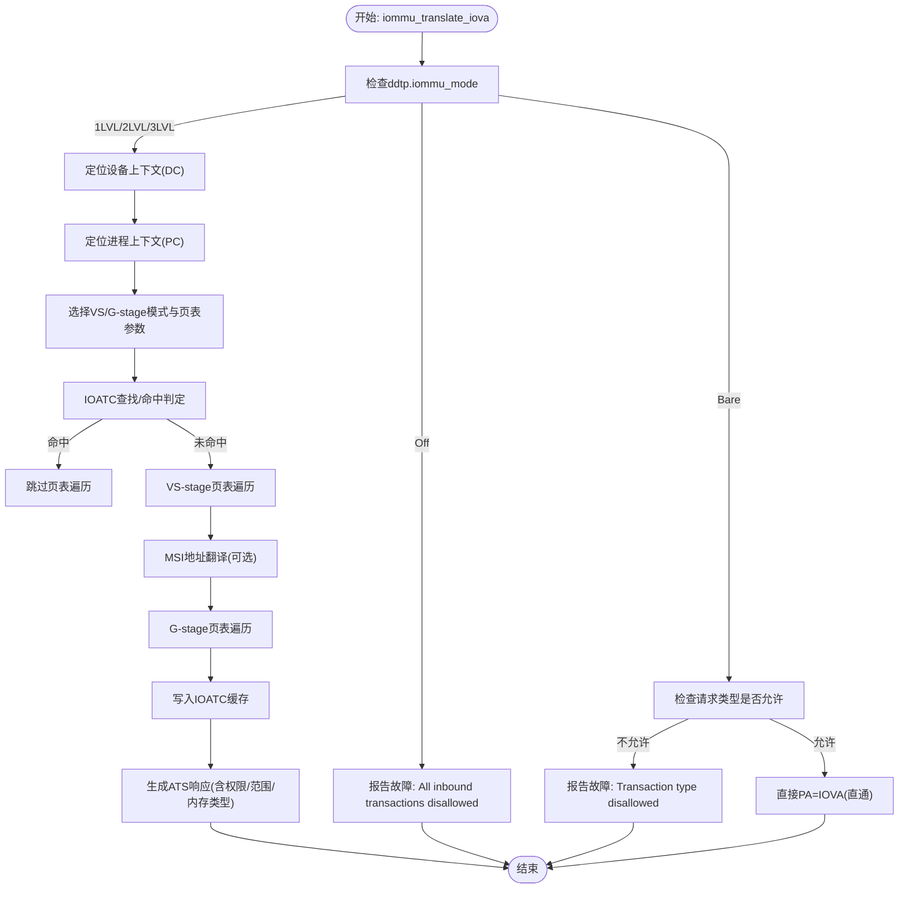
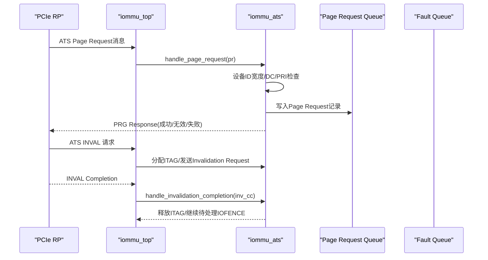
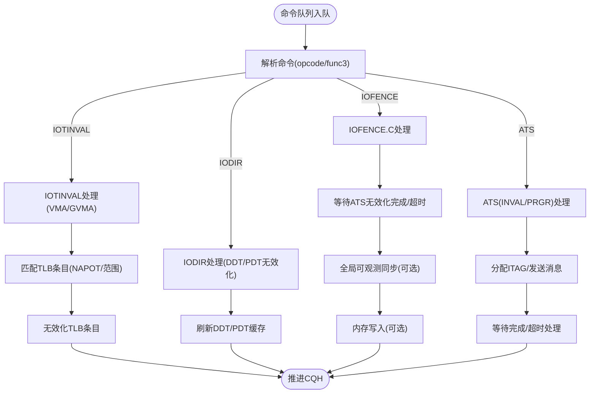
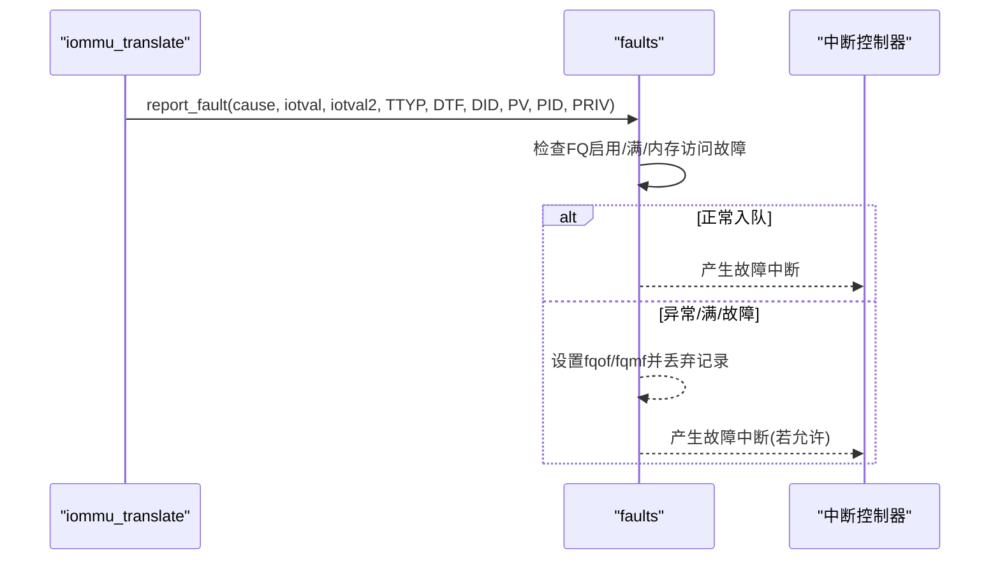
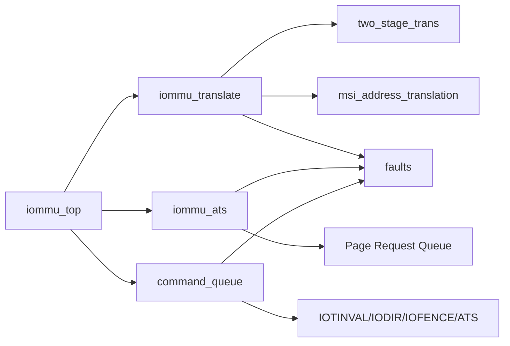

# 核心功能特性

<cite>
**本文引用的文件**
- [iommu_top.cc](file://iommu/iommu_top.cc)
- [iommu_top.hh](file://iommu/iommu_top.hh)
- [iommu_translate.cc](file://iommu/iommu_translate.cc)
- [iommu_translate.hh](file://iommu/iommu_translate.hh)
- [iommu_two_stage_trans.cc](file://iommu/iommu_two_stage_trans.cc)
- [iommu_ats.cc](file://iommu/iommu_ats.cc)
- [iommu_ats.hh](file://iommu/iommu_ats.hh)
- [iommu_command_queue.cc](file://iommu/iommu_command_queue.cc)
- [iommu_command_queue.hh](file://iommu/iommu_command_queue.hh)
- [iommu_faults.cc](file://iommu/iommu_faults.cc)
- [iommu_struct.hh](file://iommu/iommu_struct.hh)
- [iommu_registers.hh](file://iommu/iommu_registers.hh)
- [iommu_req_rsp.hh](file://iommu/iommu_req_rsp.hh)
</cite>

## 目录
1. [简介](#简介)
2. [项目结构](#项目结构)
3. [核心组件](#核心组件)
4. [架构总览](#架构总览)
5. [详细组件分析](#详细组件分析)
6. [依赖关系分析](#依赖关系分析)
7. [性能考虑](#性能考虑)
8. [故障排查指南](#故障排查指南)
9. [结论](#结论)

## 简介
本文件面向RISC-V IOMMU系统的核心功能特性，围绕两阶段地址转换机制、PCIe ATS/PRI协议支持、命令处理系统、故障管理与报告系统进行深入解析。文档以SystemC模块为入口，结合地址翻译、ATS消息处理、命令队列与无效化、故障记录与中断等子系统，帮助读者快速理解系统能力与实现要点，并提供使用场景与优势说明。

## 项目结构
IOMMU系统采用分层模块化设计：
- 系统入口：iommu_top作为SystemC模块，负责AXI/PCIE接口桥接、寄存器读写、事务转发与中断生成。
- 地址翻译：两阶段地址转换（VS-stage/G-stage）、MSI地址翻译、ATS响应生成。
- ATS/PRI：PCIe ATS消息处理（Page Request、PRG Response）与ATS无效化请求。
- 命令处理：命令队列（CQ）解析与执行，支持IOTINVAL、IODIR、IOFENCE、ATS等命令。
- 故障管理：故障队列（FQ）记录与中断上报，支持ATS专用错误路径。

图表来源
- [iommu_top.cc:1-222](file://iommu/iommu_top.cc#L1-222)
- [iommu_translate.cc:1-732](file://iommu/iommu_translate.cc#L1-732)
- [iommu_two_stage_trans.cc:1-600](file://iommu/iommu_two_stage_trans.cc#L1-600)
- [iommu_ats.cc:1-374](file://iommu/iommu_ats.cc#L1-374)
- [iommu_command_queue.cc:1-676](file://iommu/iommu_command_queue.cc#L1-676)
- [iommu_faults.cc:1-160](file://iommu/iommu_faults.cc#L1-160)

章节来源
- [iommu_top.cc:1-222](file://iommu/iommu_top.cc#L1-222)
- [iommu_top.hh:1-57](file://iommu/iommu_top.hh#L1-57)

## 核心组件
- 系统入口与接口桥接：iommu_top负责AXI/PCIE接口、寄存器映射、事务转发与中断生成。
- 地址翻译引擎：两阶段地址转换（VS-stage/G-stage）、MSI地址翻译、ATS响应生成。
- ATS/PRI子系统：Page Request消息入队、PRG响应生成、ATS无效化请求与完成处理。
- 命令处理子系统：命令队列解析、IOTINVAL/IODIR/IOFENCE/ATS命令执行与资源管理。
- 故障管理子系统：故障记录入队、中断上报、ATS专用错误路径与状态码分类。

章节来源
- [iommu_translate.cc:1-732](file://iommu/iommu_translate.cc#L1-732)
- [iommu_ats.cc:1-374](file://iommu/iommu_ats.cc#L1-374)
- [iommu_command_queue.cc:1-676](file://iommu/iommu_command_queue.cc#L1-676)
- [iommu_faults.cc:1-160](file://iommu/iommu_faults.cc#L1-160)

## 架构总览
系统以iommu_top为中心，接收来自PCIe/AXI的IOVA请求与ATS消息，通过地址翻译引擎完成两阶段地址转换；同时处理ATS消息（Page Request/PRG Response）与命令队列中的IOTINVAL/IODIR/IOFENCE/ATS等命令；所有异常与事件通过故障队列记录并触发中断。

图表来源
- [iommu_top.cc:41-210](file://iommu/iommu_top.cc#L41-210)
- [iommu_translate.cc:8-731](file://iommu/iommu_translate.cc#L8-731)
- [iommu_two_stage_trans.cc:8-599](file://iommu/iommu_two_stage_trans.cc#L8-599)
- [iommu_ats.cc:96-373](file://iommu/iommu_ats.cc#L96-373)
- [iommu_command_queue.cc:7-676](file://iommu/iommu_command_queue.cc#L7-676)
- [iommu_faults.cc:8-159](file://iommu/iommu_faults.cc#L8-159)

## 详细组件分析

### 两阶段地址转换机制（VS-stage与G-stage）
- 功能概述
  - 支持Sv32/Sv39/Sv48/Sv57及扩展Sv32x4/Sv39x4/Sv48x4/Sv57x4，根据设备上下文与进程上下文选择VS-stage与G-stage。
  - 支持Bare模式（无翻译直通）与两阶段页表遍历，结合IOATC缓存提升性能。
  - 支持NAPOT范围无效化扩展（S位）与非叶子PTE无效化扩展（NL位）。
- 关键实现
  - 地址翻译主流程：设备/进程上下文定位、权限检查、VS-stage页表遍历、MSI地址翻译、G-stage页表遍历、IOATC缓存与ATS响应生成。
  - 两阶段页表遍历：页表项合法性校验、权限检查、A/D位原子更新、NAPOT处理、超页映射与范围编码。
  - ATS响应：根据是否携带PASID、权限请求、CXL设备类型与内存类型决定Priv/N/CXL.io/AMA等字段。
- 使用场景与优势
  - 适用于多租户虚拟化平台，VS-stage由Guest控制、G-stage由宿主控制，实现细粒度内存保护与隔离。
  - ATS响应路径避免软件轮询，提高设备访问延迟敏感场景的吞吐。
  - NAPOT与范围无效化减少TLB刷新开销，适合大规模地址空间管理。

图表来源
- [iommu_translate.cc:8-731](file://iommu/iommu_translate.cc#L8-731)
- [iommu_two_stage_trans.cc:8-599](file://iommu/iommu_two_stage_trans.cc#L8-599)
- [iommu_translate.hh:95-129](file://iommu/iommu_translate.hh#L95-129)

章节来源
- [iommu_translate.cc:1-732](file://iommu/iommu_translate.cc#L1-732)
- [iommu_two_stage_trans.cc:1-600](file://iommu/iommu_two_stage_trans.cc#L1-600)
- [iommu_translate.hh:1-132](file://iommu/iommu_translate.hh#L1-132)

### PCIe ATS/PRI协议支持
- 功能概述
  - 处理PCIe ATS“Page Request”消息，入队至Page Request Queue（PQ），支持PRG Response自动回复。
  - 支持ATS无效化请求（Invalidation Request）与完成（Completion）消息，跟踪ITAG状态机。
  - ATS消息在Off/Bare模式下的行为与错误处理。
- 关键实现
  - Page Request处理：设备ID宽度检查、DC定位、PRI使能检查、PQ队列状态检查、写入PQ记录、PRG Response生成。
  - ATS无效化：ITAG分配与追踪、消息发送、超时处理、等待未决无效化完成。
  - ATS消息结构与PRG响应状态码定义。
- 使用场景与优势
  - 适用于设备按需驻留页面的场景，降低CPU干预与带宽占用。
  - ATS无效化与PRG Response确保设备地址转换缓存一致性，提升系统稳定性。

图表来源
- [iommu_top.cc:96-118](file://iommu/iommu_top.cc#L96-118)
- [iommu_ats.cc:96-373](file://iommu/iommu_ats.cc#L96-373)
- [iommu_ats.hh:47-97](file://iommu/iommu_ats.hh#L47-97)

章节来源
- [iommu_ats.cc:1-374](file://iommu/iommu_ats.cc#L1-374)
- [iommu_ats.hh:1-98](file://iommu/iommu_ats.hh#L1-98)

### 命令处理系统（IOTINVAL/IODIR/IOFENCE/ATS）
- 功能概述
  - 命令队列（CQ）解析与执行，支持IOTINVAL（VMA/GVMA）、IODIR（DDT/PDT无效化）、IOFENCE（C）、ATS（INVAL/PRGR）。
  - 支持范围无效化（S位）与非叶子PTE无效化（NL位）扩展。
  - ATS命令依赖ITAG资源，存在队列阻塞与超时处理。
- 关键实现
  - 命令解析：opcode/func3校验、操作数合法性检查、能力位约束。
  - IOTINVAL：按GV/AV/PSCV/GSCID/PSCID匹配TLB条目，支持NAPOT范围匹配。
  - IODIR：DDT/PDT缓存无效化，保证后续隐式读取可见性。
  - IOFENCE.C：全局可观测同步、可选内存写入、等待ATS无效化完成或超时。
  - ATS命令：ITAG分配、消息发送、完成处理与阻塞解除。
- 使用场景与优势
  - 批量地址空间无效化与缓存一致性维护，适合迁移、热迁移与配置变更。
  - ATS无效化与IOFENCE组合，确保设备缓存与内存一致性，降低数据竞争风险。

图表来源
- [iommu_command_queue.cc:7-676](file://iommu/iommu_command_queue.cc#L7-676)
- [iommu_command_queue.hh:38-124](file://iommu/iommu_command_queue.hh#L38-124)

章节来源
- [iommu_command_queue.cc:1-676](file://iommu/iommu_command_queue.cc#L1-676)
- [iommu_command_queue.hh:1-125](file://iommu/iommu_command_queue.hh#L1-125)

### 故障管理系统与报告
- 功能概述
  - 故障队列（FQ）记录地址翻译、ATS/PRI、命令执行等故障，支持溢出与内存访问故障标记。
  - 中断生成与屏蔽控制，区分命令队列、故障队列、性能计数器与Page Request队列中断。
  - ATS专用错误路径：Off/Bare模式下Unsupported Request/Completer Abort响应。
- 关键实现
  - 故障记录：设备ID、进程ID/PASID、权限、TTYP、CAUSE、iotval/iotval2等字段封装。
  - 队列状态检查：FQ启用/满/内存访问故障，必要时生成中断。
  - ATS错误处理：根据CAUSE与DTF策略决定是否记录与返回UR/CA。
- 使用场景与优势
  - 快速定位系统异常与配置问题，辅助运维与调试。
  - ATS错误路径与FQ记录分离，避免ATS响应干扰系统级故障统计。

图表来源
- [iommu_faults.cc:8-159](file://iommu/iommu_faults.cc#L8-159)

章节来源
- [iommu_faults.cc:1-160](file://iommu/iommu_faults.cc#L1-160)

## 依赖关系分析
- 模块耦合
  - iommu_top依赖地址翻译、ATS、命令队列与故障模块，承担接口桥接与中断生成职责。
  - 地址翻译模块内部依赖两阶段页表遍历、MSI翻译与IOATC缓存。
  - ATS模块依赖PQ内存队列与ITAG追踪，与命令队列在ATS命令上存在交互。
  - 故障模块被地址翻译、ATS、命令队列共同调用，形成统一的错误上报通道。
- 外部依赖
  - SystemC/TLM接口用于AXI/PCIE事务与寄存器访问。
  - 寄存器文件（capabilities/ddtp/cqb/fqb/pqb等）提供运行时配置与状态。

图表来源
- [iommu_top.cc:1-222](file://iommu/iommu_top.cc#L1-222)
- [iommu_translate.cc:1-732](file://iommu/iommu_translate.cc#L1-732)
- [iommu_command_queue.cc:1-676](file://iommu/iommu_command_queue.cc#L1-676)
- [iommu_ats.cc:1-374](file://iommu/iommu_ats.cc#L1-374)
- [iommu_faults.cc:1-160](file://iommu/iommu_faults.cc#L1-160)

章节来源
- [iommu_struct.hh:42-99](file://iommu/iommu_struct.hh#L42-99)
- [iommu_registers.hh:1-800](file://iommu/iommu_registers.hh#L1-800)

## 性能考虑
- 缓存与TLB
  - IOATC缓存两阶段页表结果，支持NAPOT范围缓存，减少重复页表遍历。
  - ATS专用缓存策略：T2GPA模式下缓存最终GPA->SPA映射，提升后续Translated请求命中率。
- 无效化与一致性
  - IOTINVAL支持范围无效化（S位）与非叶子PTE无效化（NL位），降低大规模无效化开销。
  - IOFENCE.C提供全局可观测同步，保障跨设备/主机一致性。
- 中断与队列
  - 命令队列与故障队列均支持溢出与内存访问故障标记，避免系统停顿。
  - ATS命令依赖ITAG资源，存在队列阻塞与超时处理，建议合理规划并发与超时阈值。

## 故障排查指南
- 常见故障与定位
  - Off/Bare模式下ATS/Translated请求：检查ddtp.iommu_mode与请求类型合法性。
  - 设备ID宽度不匹配：核对ddtp.iommu_mode与DDI[2:0]范围。
  - ATS/PRI队列满/内存访问故障：检查PQCSR/FQCSR标志位并清理。
  - 命令非法/超时/内存访问失败：检查CQCSR(cmd_ill/cmd_to/cqmf)，确认命令格式与内存可达性。
- ATS错误路径
  - Off/Bare模式下ATS翻译请求返回Unsupported Request/Completer Abort，需调整IOMMU模式或配置。
  - ATS无效化超时：检查设备响应与ITAG分配，必要时增大超时或重试。
- 建议排查步骤
  - 启用调试输出（DEBUG_*宏），观察各阶段状态与错误码。
  - 逐步缩小范围：先验证地址翻译路径，再检查ATS/PRI与命令队列。
  - 结合性能计数器与中断状态，定位瓶颈与异常发生时间点。

章节来源
- [iommu_translate.cc:620-731](file://iommu/iommu_translate.cc#L620-731)
- [iommu_ats.cc:96-373](file://iommu/iommu_ats.cc#L96-373)
- [iommu_command_queue.cc:574-676](file://iommu/iommu_command_queue.cc#L574-676)
- [iommu_faults.cc:8-159](file://iommu/iommu_faults.cc#L8-159)

## 结论
本IOMMU系统以两阶段地址转换为核心，结合PCIe ATS/PRI、命令队列与故障管理，构建了高性能、可扩展且可诊断的内存管理基础设施。通过IOATC缓存、范围无效化与全局一致性同步，系统在虚拟化与设备直连场景中具备良好表现；ATS与命令队列的协同设计进一步提升了设备访问效率与系统可控性。建议在实际部署中结合调试输出与性能监控，持续优化配置与资源分配策略。