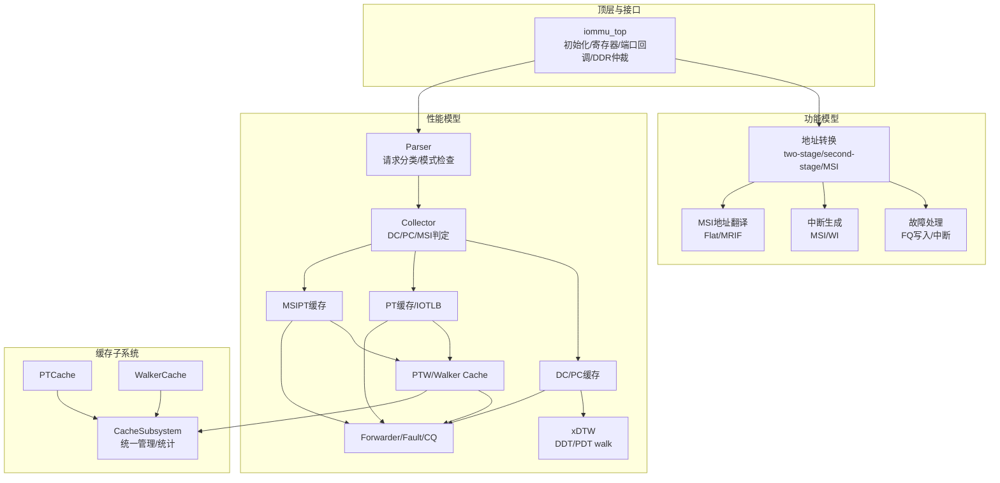
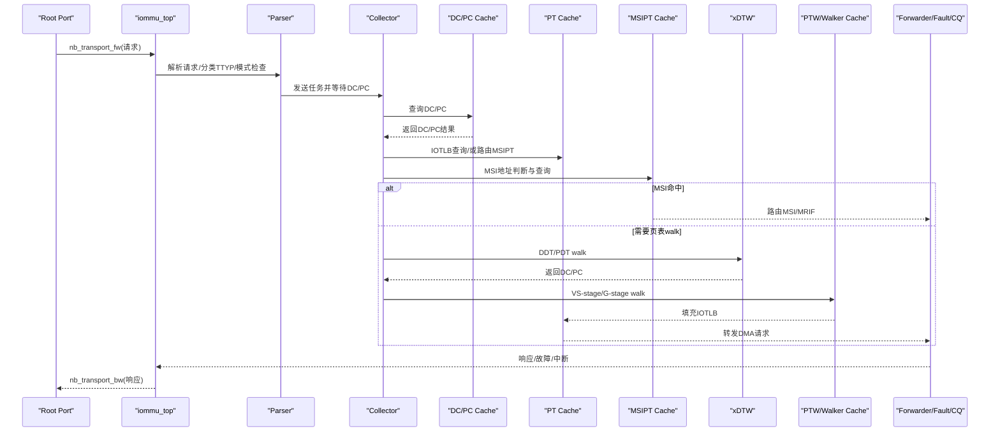
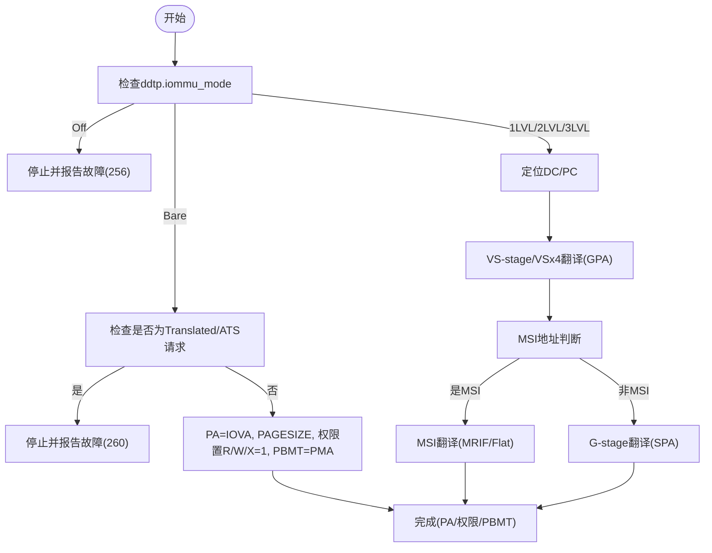
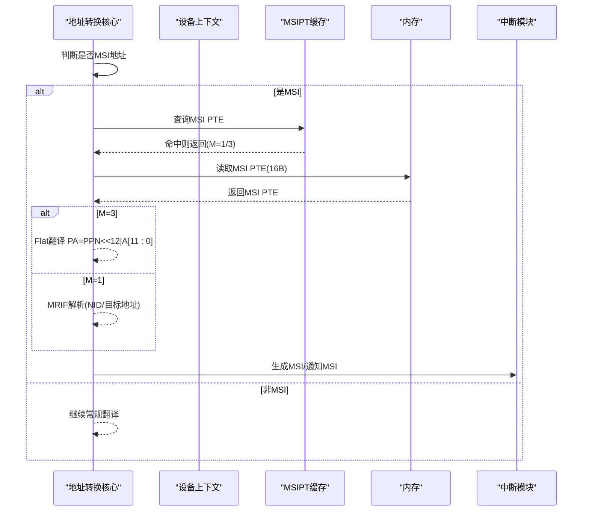
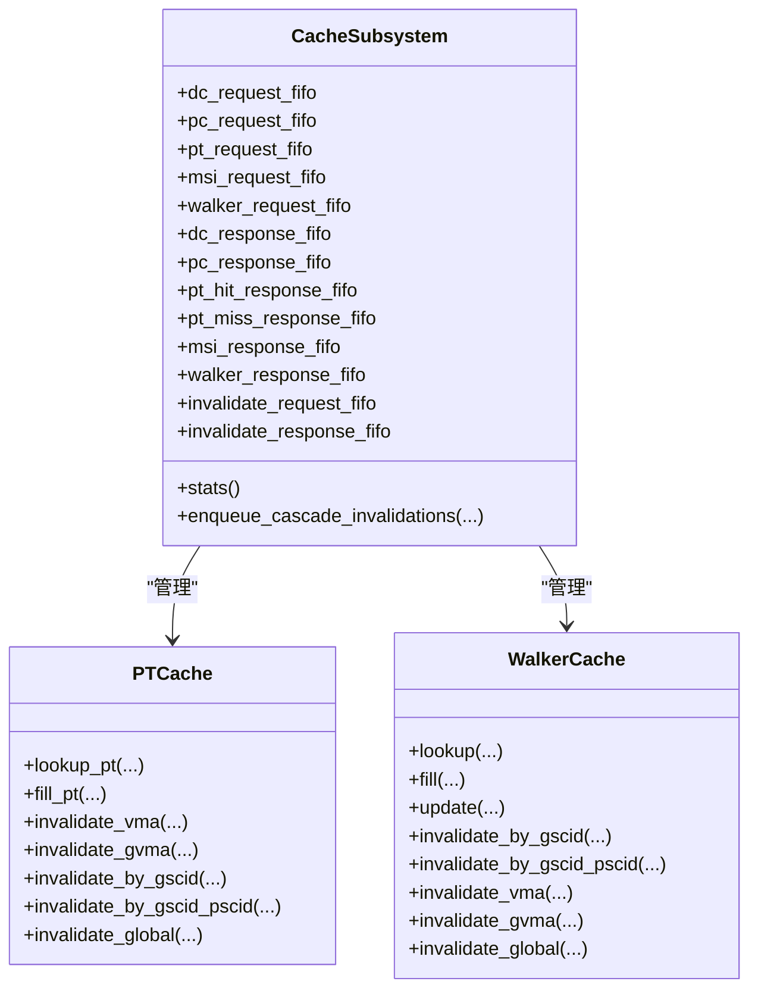
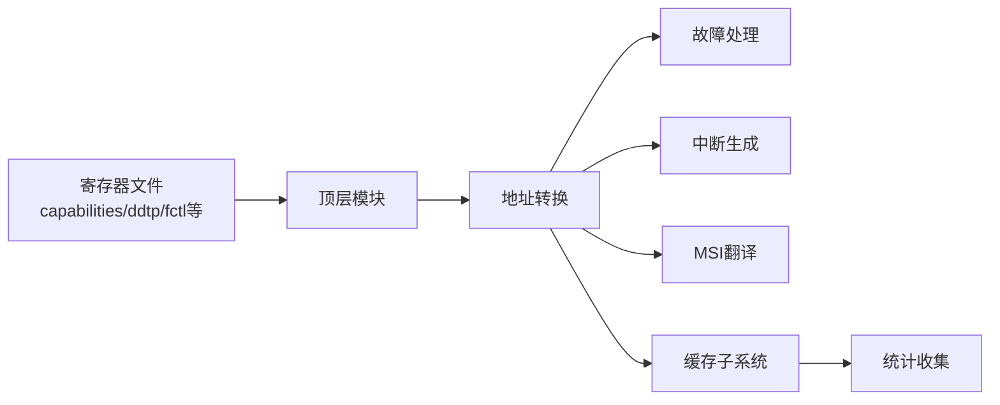
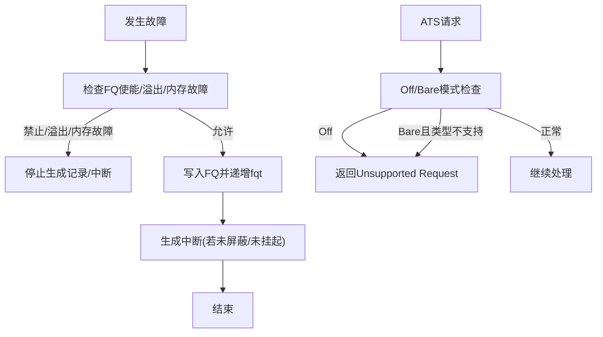

# 核心能力

<cite>
**本文引用的文件**   
- [README.md](file://README.md)
- [iommu_top.cc](file://iommu/iommu_top.cc)
- [iommu_translate.hh](file://iommu/include/iommu_translate.hh)
- [iommu_translate.cc](file://iommu/iommu_fun_model/iommu_translate.cc)
- [iommu_faults.cc](file://iommu/iommu_fun_model/iommu_faults.cc)
- [iommu_interrupt.cc](file://iommu/iommu_fun_model/iommu_interrupt.cc)
- [iommu_perf_model.hh](file://iommu/iommu_perf_model/iommu_perf_model.hh)
- [cache_subsystem.h](file://iommu/cache_src/subsystem/cache_subsystem.h)
- [pt_cache.h](file://iommu/cache_src/cache/pt_cache.h)
- [walker_cache.h](file://iommu/cache_src/cache/walker_cache.h)
- [iommu_registers.hh](file://iommu/include/iommu_registers.hh)
- [iommu_msi_trans.cc](file://iommu/iommu_fun_model/iommu_msi_trans.cc)
- [PERF_MODEL_IMPLEMENTATION.md](file://PERF_MODEL_IMPLEMENTATION.md)
- [test_rp_sv48_bare_thread.cc](file://rp/test_rp_sv48_bare_thread.cc)
</cite>

## 目录
1. [简介](#简介)
2. [项目结构](#项目结构)
3. [核心组件](#核心组件)
4. [架构总览](#架构总览)
5. [详细组件分析](#详细组件分析)
6. [依赖关系分析](#依赖关系分析)
7. [性能考量](#性能考量)
8. [故障处理指南](#故障处理指南)
9. [结论](#结论)
10. [附录](#附录)

## 简介
本项目是一个基于SystemC的RISC-V IOMMU（输入/输出内存管理单元）模型，覆盖地址转换、故障处理、中断与MSI路由、以及面向SPEC v4的高性能流水线实现。项目支持多种页表格式（Sv39、Sv48、Sv57及其G-stage变体Sv39x4/Sv48x4/Sv57x4）、单级与两级地址转换、Bare与Off模式、MSI地址翻译与MRIF路由、以及多级缓存系统（DC、PC、PT、MSIPT、Walker）。通过并行流水线与缓存一致性机制，显著提升吞吐与命中率。

## 项目结构
- 顶层模块与接口：顶层模块负责初始化、寄存器访问、端口回调、DDR仲裁与响应回传。
- 功能模型：包含地址转换、故障记录、中断生成、MSI翻译等核心功能。
- 性能模型：以SPEC v4为蓝本，构建解析器、收集器、DC/PC缓存、PT缓存、MSIPT缓存、xDTW、PTW与Walker Cache、转发与故障/CQ处理等20个线程模块。
- 缓存子系统：统一管理各类缓存的查询、更新与失效，提供统计与跟踪。
- 测试与验证：Root Port测试线程覆盖不同页表模式与并发场景。

图表来源
- [iommu_top.cc:1-583](file://iommu/iommu_top.cc#L1-L583)
- [iommu_translate.cc:1-732](file://iommu/iommu_fun_model/iommu_translate.cc#L1-L732)
- [iommu_faults.cc:1-160](file://iommu/iommu_fun_model/iommu_faults.cc#L1-L160)
- [iommu_interrupt.cc:1-121](file://iommu/iommu_fun_model/iommu_interrupt.cc#L1-L121)
- [iommu_msi_trans.cc:1-294](file://iommu/iommu_fun_model/iommu_msi_trans.cc#L1-L294)
- [PERF_MODEL_IMPLEMENTATION.md:1-227](file://PERF_MODEL_IMPLEMENTATION.md#L1-L227)
- [cache_subsystem.h:1-161](file://iommu/cache_src/subsystem/cache_subsystem.h#L1-L161)
- [pt_cache.h:1-59](file://iommu/cache_src/cache/pt_cache.h#L1-L59)
- [walker_cache.h:1-129](file://iommu/cache_src/cache/walker_cache.h#L1-L129)

章节来源
- [README.md:63-76](file://README.md#L63-L76)
- [iommu_top.cc:1-583](file://iommu/iommu_top.cc#L1-L583)

## 核心组件
- 顶层模块与端口回调：提供AHB/Axi接口、注册读写、带宽控制、DDR仲裁与响应回传。
- 地址转换引擎：支持Off/Bare模式、设备/进程上下文定位、两阶段地址转换、MSI地址翻译与MRIF路由。
- 故障与中断：故障队列写入、溢出/内存访问故障处理、中断向量映射与MSI下发。
- 缓存子系统：DC/PC/PT/MSIPT/Walker多级缓存，统一失效与统计。
- 性能模型：严格遵循SPEC v4线程划分与接口命名，实现非阻塞DDR访问、Walker Cache集成、并发流水线。

章节来源
- [iommu_top.cc:9-38](file://iommu/iommu_top.cc#L9-L38)
- [iommu_translate.cc:9-732](file://iommu/iommu_fun_model/iommu_translate.cc#L9-L732)
- [iommu_faults.cc:8-160](file://iommu/iommu_fun_model/iommu_faults.cc#L8-L160)
- [iommu_interrupt.cc:27-121](file://iommu/iommu_fun_model/iommu_interrupt.cc#L27-L121)
- [cache_subsystem.h:18-161](file://iommu/cache_src/subsystem/cache_subsystem.h#L18-L161)
- [PERF_MODEL_IMPLEMENTATION.md:1-227](file://PERF_MODEL_IMPLEMENTATION.md#L1-L227)

## 架构总览
IOMMU采用“请求解析—上下文定位—地址转换—结果缓存/转发”的流水线架构。顶层模块负责端口接入与DDR仲裁；功能模型完成地址转换与MSI处理；性能模型以SPEC v4为准，拆分为多个并行线程，配合缓存子系统实现高吞吐与低延迟。

图表来源
- [iommu_top.cc:130-190](file://iommu/iommu_top.cc#L130-L190)
- [PERF_MODEL_IMPLEMENTATION.md:14-97](file://PERF_MODEL_IMPLEMENTATION.md#L14-L97)

章节来源
- [iommu_top.cc:130-262](file://iommu/iommu_top.cc#L130-L262)
- [PERF_MODEL_IMPLEMENTATION.md:1-227](file://PERF_MODEL_IMPLEMENTATION.md#L1-L227)

## 详细组件分析

### 地址转换与模式支持
- 支持的页表格式：Sv39、Sv48、Sv57（第一/第二阶段），以及G-stage变体Sv39x4、Sv48x4、Sv57x4、Sv32x4。
- 模式与属性：Off（禁用）、Bare（直通）、1LVL/2LVL/3LVL目录表；支持SUM、SADE、GADE、SXL等控制位。
- 两级地址转换：VS-stage（iosatp）与G-stage（iohgatp）嵌套翻译，权限与PBMT合并，最终得到SPA。
- Bare模式：当PSCV=0且GV=0时，IOVA=PA直接映射，无需页表walk。
- ATS翻译：支持PCIe ATS请求的权限裁剪与CXL.io标志设置。

图表来源
- [iommu_translate.cc:94-142](file://iommu/iommu_fun_model/iommu_translate.cc#L94-L142)
- [iommu_translate.cc:332-440](file://iommu/iommu_fun_model/iommu_translate.cc#L332-L440)
- [iommu_translate.cc:442-531](file://iommu/iommu_fun_model/iommu_translate.cc#L442-L531)

章节来源
- [iommu_translate.cc:9-732](file://iommu/iommu_fun_model/iommu_translate.cc#L9-L732)
- [iommu_translate.hh:95-130](file://iommu/include/iommu_translate.hh#L95-L130)

### MSI地址翻译与中断路由
- MSI地址识别：基于设备上下文的地址掩码与模式，结合MGPAW限制进行匹配。
- Flat模式：MSI PTE为Basic Translate，PA=PPN<<12|A[11:0]。
- MRIF模式：支持原子OR写入，目标为MRIF地址与notice MSI的NID。
- 中断路由：根据向量映射与掩码状态，通过MSI配置表下发MSI。

图表来源
- [iommu_msi_trans.cc:20-294](file://iommu/iommu_fun_model/iommu_msi_trans.cc#L20-L294)
- [iommu_interrupt.cc:27-121](file://iommu/iommu_fun_model/iommu_interrupt.cc#L27-L121)

章节来源
- [iommu_msi_trans.cc:1-294](file://iommu/iommu_fun_model/iommu_msi_trans.cc#L1-L294)
- [iommu_interrupt.cc:1-121](file://iommu/iommu_fun_model/iommu_interrupt.cc#L1-L121)

### 多级缓存系统与流水线
- 缓存层次：DC（64条）、PC（32条）、PT（IOTLB）、MSIPT（MSI页表）、Walker Cache（PTWc_1/2/3）。
- 并行流水线：Parser、Collector、DC/PC Cache、PT Cache、MSIPT Cache、xDTW、PTW、Forwarder/Fault/CQ等20个线程协同。
- 非阻塞DDR：统一通过nb_transport接口发起读请求，使用outstanding表跟踪，降低阻塞。
- Walker Cache：按SV级别分层缓存，散列+SRRIP替换，支持按GSCID/PSCID/IOVA精确失效。

图表来源
- [cache_subsystem.h:18-161](file://iommu/cache_src/subsystem/cache_subsystem.h#L18-L161)
- [pt_cache.h:8-59](file://iommu/cache_src/cache/pt_cache.h#L8-L59)
- [walker_cache.h:15-129](file://iommu/cache_src/cache/walker_cache.h#L15-L129)

章节来源
- [cache_subsystem.h:1-161](file://iommu/cache_src/subsystem/cache_subsystem.h#L1-L161)
- [pt_cache.h:1-59](file://iommu/cache_src/cache/pt_cache.h#L1-L59)
- [walker_cache.h:1-129](file://iommu/cache_src/cache/walker_cache.h#L1-L129)
- [PERF_MODEL_IMPLEMENTATION.md:100-130](file://PERF_MODEL_IMPLEMENTATION.md#L100-L130)

### SPEC v4实现程度与兼容性
- 完全符合：线程数量与命名、FIFO深度、非阻塞DDR、Walker Cache集成、缓存失效通道、MSI翻译、两级地址翻译等。
- 简化实现：页表walk多级嵌套、A/D位原子更新、完整fault record格式、CQ命令解析部分字段等，可在后续完善。

章节来源
- [PERF_MODEL_IMPLEMENTATION.md:195-227](file://PERF_MODEL_IMPLEMENTATION.md#L195-L227)

### 功能特性与应用场景
- 单/双级地址转换：适用于多租户平台（VS-stage隔离+G-stage保护）。
- Bare模式：轻量直通，适合无MMU需求或旁路场景。
- Off模式：完全禁用，用于安全隔离。
- MSI路由：支持Flat与MRIF，满足IMSI/IMSIC与内存型MRIF。
- 并发与吞吐：通过20线程流水线与多级缓存，适配高带宽DMA与中断密集场景。
- 场景示例：Root Port连续写请求（Sv48+Bare模式）验证页表walk与IOTLB命中。

章节来源
- [test_rp_sv48_bare_thread.cc:10-230](file://rp/test_rp_sv48_bare_thread.cc#L10-L230)
- [iommu_perf_model.hh:57-108](file://iommu/iommu_perf_model/iommu_perf_model.hh#L57-L108)

## 依赖关系分析
- 顶层模块依赖寄存器文件与系统时钟，通过TLM接口与上游/下游模块交互。
- 地址转换依赖设备/进程上下文、页表walk与MSI翻译模块。
- 缓存子系统为多模块共享，提供统一的查询/更新/失效接口与统计。
- 性能模型严格复用功能模型的逻辑分支与数据结构，确保一致性。

图表来源
- [iommu_registers.hh:172-271](file://iommu/include/iommu_registers.hh#L172-L271)
- [iommu_top.cc:1-583](file://iommu/iommu_top.cc#L1-L583)
- [cache_subsystem.h:85-161](file://iommu/cache_src/subsystem/cache_subsystem.h#L85-L161)

章节来源
- [iommu_registers.hh:1-987](file://iommu/include/iommu_registers.hh#L1-L987)
- [iommu_top.cc:1-583](file://iommu/iommu_top.cc#L1-L583)
- [cache_subsystem.h:1-161](file://iommu/cache_src/subsystem/cache_subsystem.h#L1-L161)

## 性能考量
- 多级缓存：IOTLB命中可绕过PTW；Walker Cache显著降低重复walk；MSIPT缓存加速MSI路径。
- 并行流水线：Parser/Collector/Cache/PTW/Forwarder并行推进，减少瓶颈。
- 非阻塞DDR：通过outstanding表与回调机制，避免阻塞等待。
- 统计与可观测性：Cache命中/缺失、VA去重节省、IOPS统计、端口带宽统计。

章节来源
- [PERF_MODEL_IMPLEMENTATION.md:100-130](file://PERF_MODEL_IMPLEMENTATION.md#L100-L130)
- [iommu/iommu_top.cc:522-582](file://iommu/iommu_top.cc#L522-L582)

## 故障处理指南
- 故障记录：满足条件时写入故障队列，支持溢出与内存访问故障标记。
- 中断上报：根据向量映射与掩码状态，生成MSI中断。
- ATS特殊处理：Off模式下ATS请求返回Unsupported Request；配置错误时返回Completer Abort。
- 恢复机制：FQ满/内存故障时停止生成新记录，直至软件清除标志；CQ/FQ/PQ CSR状态决定处理流程。

图表来源
- [iommu_faults.cc:24-159](file://iommu/iommu_fun_model/iommu_faults.cc#L24-L159)
- [iommu_interrupt.cc:27-121](file://iommu/iommu_fun_model/iommu_interrupt.cc#L27-L121)
- [iommu_translate.cc:620-707](file://iommu/iommu_fun_model/iommu_translate.cc#L620-L707)

章节来源
- [iommu_faults.cc:1-160](file://iommu/iommu_fun_model/iommu_faults.cc#L1-L160)
- [iommu_interrupt.cc:1-121](file://iommu/iommu_fun_model/iommu_interrupt.cc#L1-L121)
- [iommu_translate.cc:620-707](file://iommu/iommu_fun_model/iommu_translate.cc#L620-L707)

## 结论
本IOMMU SystemC模型在功能上覆盖RISC-V IOMMU主要能力，在性能上遵循SPEC v4实现20线程流水线与多级缓存，具备良好的扩展性与可维护性。Off/Bare/多级目录表、Sv39/48/57与G-stage变体、MSI Flat/MRIF、中断路由与故障处理均得到完整体现。建议在后续版本中完善简化的逻辑（如A/D原子更新、完整fault record、CQ命令解析），以进一步提升与标准的契合度与仿真精度。

## 附录
- 编译与运行：WSL环境、SystemC 2.3.x、GCC 7+，支持DEBUG与RELEASE两种编译模式。
- 测试用例：Root Port线程测试覆盖Sv48+Bare模式与并发场景，输出Cache统计与IOPS指标。

章节来源
- [README.md:7-92](file://README.md#L7-L92)
- [test_rp_sv48_bare_thread.cc:1-230](file://rp/test_rp_sv48_bare_thread.cc#L1-L230)