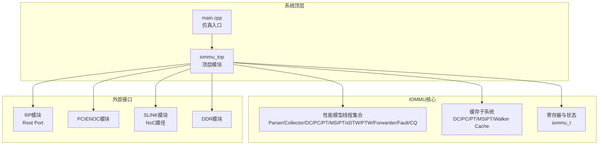
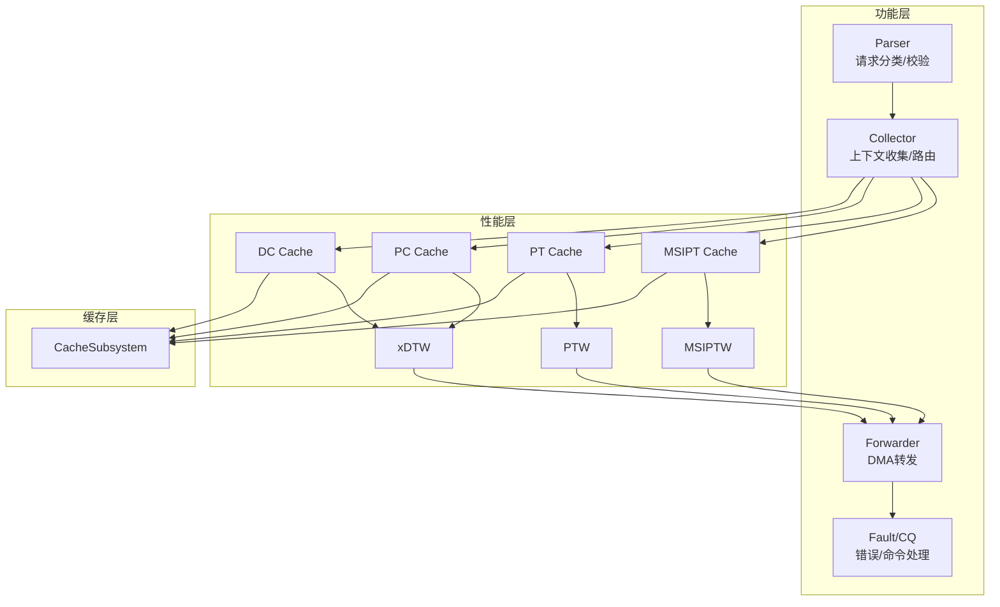
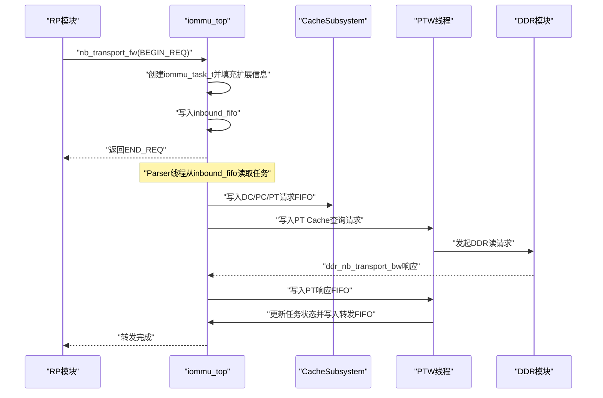
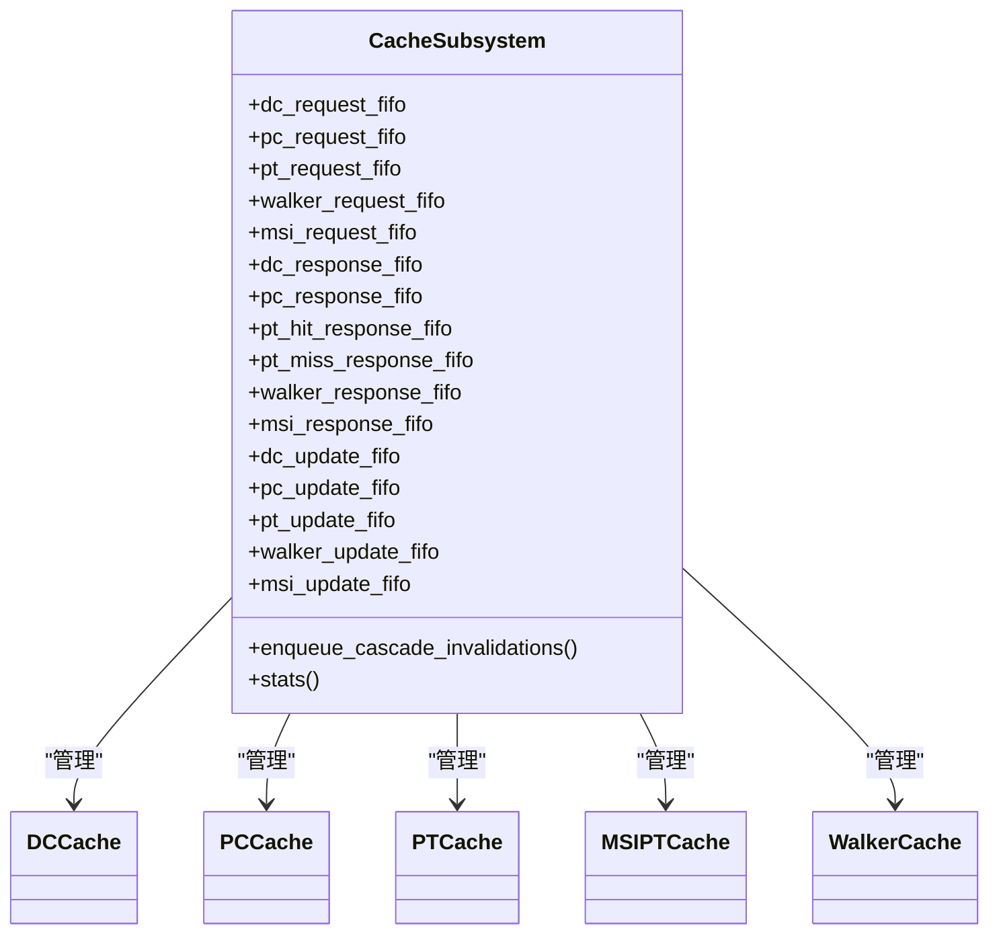
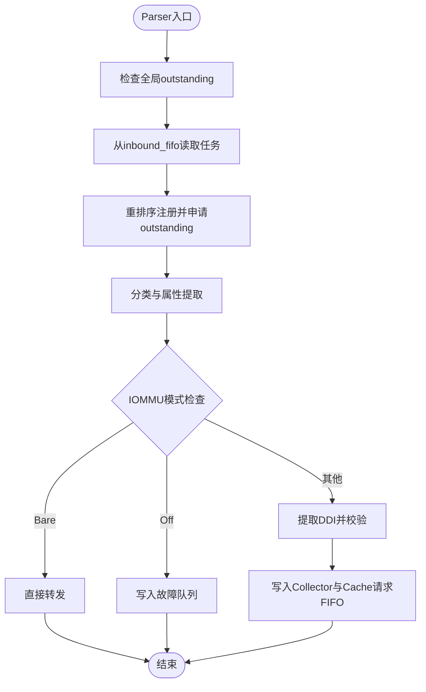
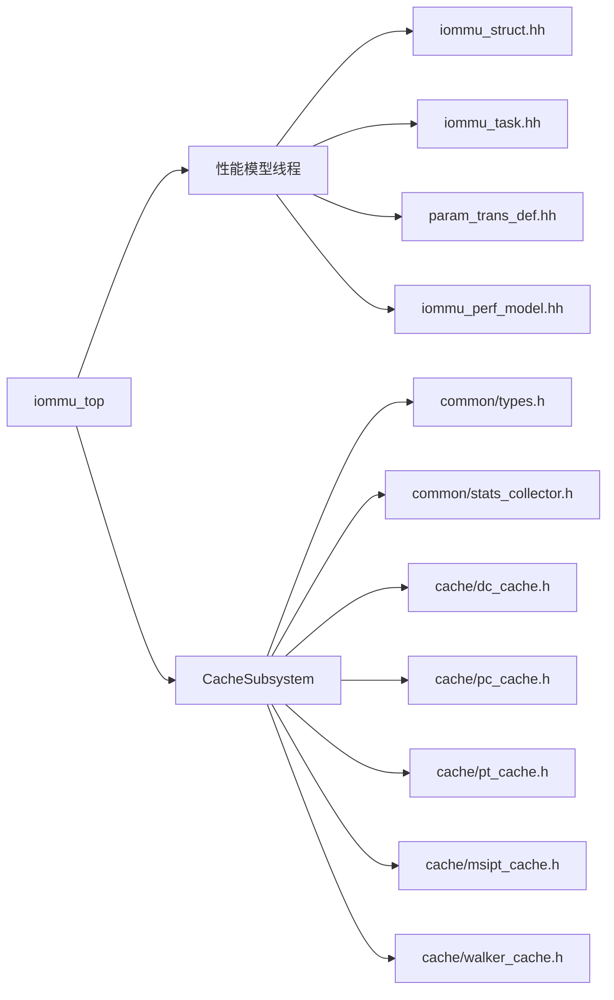

# 系统架构

<cite>
**本文引用的文件**
- [iommu_top.cc](file://iommu/iommu_top.cc)
- [iommu_top.hh](file://iommu/iommu_top.hh)
- [main.cpp](file://main.cpp)
- [README.md](file://README.md)
- [Makefile](file://Makefile)
- [iommu_struct.hh](file://iommu/include/iommu_struct.hh)
- [iommu_task.hh](file://iommu/include/iommu_task.hh)
- [param_trans_def.hh](file://iommu/include/param_trans_def.hh)
- [cache_subsystem.h](file://iommu/cache_src/subsystem/cache_subsystem.h)
- [PERF_MODEL_IMPLEMENTATION.md](file://PERF_MODEL_IMPLEMENTATION.md)
- [iommu_perf_model.hh](file://iommu/iommu_perf_model/iommu_perf_model.hh)
- [pt_cache.h](file://iommu/cache_src/cache/pt_cache.h)
- [iommu_perf_parser.cc](file://iommu/iommu_perf_model/iommu_perf_parser.cc)
</cite>

## 目录
1. [简介](#简介)
2. [项目结构](#项目结构)
3. [核心组件](#核心组件)
4. [架构总览](#架构总览)
5. [详细组件分析](#详细组件分析)
6. [依赖关系分析](#依赖关系分析)
7. [性能考量](#性能考量)
8. [故障排查指南](#故障排查指南)
9. [结论](#结论)
10. [附录](#附录)

## 简介
本项目是一个基于SystemC的RISC-V IOMMU（输入/输出内存管理单元）系统级仿真模型，采用事件驱动的事务级建模（TLM）方法，构建了包含20个独立线程的并行处理流水线，覆盖从功能层到性能层再到缓存层的完整地址翻译与故障处理链路。顶层模块iommu_top负责系统集成、接口绑定、事件驱动的回调处理、以及20个线程的注册与调度，形成高度解耦、可扩展且可仿真的IOMMU架构。

## 项目结构
项目采用模块化组织方式：
- 顶层模块与系统集成：iommu/iommu_top.cc/.hh
- 性能模型与流水线：iommu/iommu_perf_model/*（Parser、Collector、DC/PC Cache、PT Cache、xDTW、PTW、MSIPT Cache、Forwarder/Fault/CQ）
- 缓存子系统：iommu/cache_src/cache、replacement、subsystem
- 接口与数据结构：iommu/include（结构体、枚举、TLM扩展）
- 测试平台与主程序：main.cpp、rp/pcienoc/slink/ddr等测试模块
- 构建与文档：Makefile、README.md、多篇实现与分析文档

图表来源
- [main.cpp:39-94](file://main.cpp#L39-L94)
- [iommu_top.hh:41-382](file://iommu/iommu_top.hh#L41-L382)

章节来源
- [README.md:63-76](file://README.md#L63-L76)
- [Makefile:42-84](file://Makefile#L42-L84)

## 核心组件
- 顶层模块iommu_top：负责SystemC模块注册、TLM回调注册、20个线程的SC_THREAD注册、FIFO与事件管理、DDR仲裁与带宽控制、重排序输出、统计打印等。
- 性能模型线程集合：Parser、Collector、DC/PC Cache、PT Cache、MSIPT Cache、xDTW、PTW、Forwarder、Fault/CQ等，严格遵循SPEC v4的线程数量与命名规范。
- 缓存子系统CacheSubsystem：统一管理DC/PC/PT/MSIPT/Walker Cache及其lookup/update/invalidate流水线，提供对外显式的请求/响应FIFO接口。
- 接口与数据结构：SystemC TLM接口、PayloadExtention扩展、iommu_task_t任务结构、walk_context_t行走上下文、DDR请求/响应结构等。

章节来源
- [iommu_top.hh:211-382](file://iommu/iommu_top.hh#L211-L382)
- [PERF_MODEL_IMPLEMENTATION.md:7-227](file://PERF_MODEL_IMPLEMENTATION.md#L7-L227)
- [cache_subsystem.h:18-161](file://iommu/cache_src/subsystem/cache_subsystem.h#L18-L161)

## 架构总览
系统采用分层架构：
- 功能层：Parser负责请求分类与基础校验；Collector负责上下文收集与路由决策；Forwarder负责最终转发；Fault/CQ负责错误与命令处理。
- 性能层：DC/PC Cache、PT Cache、MSIPT Cache、xDTW、PTW、MSIPTW等线程并行执行，通过FIFO与PEQ（非阻塞排队）实现事件驱动的流水线。
- 缓存层：CacheSubsystem封装各类Cache，提供统一的lookup/update/invalidate接口，支持Walker Cache与失效级联。

图表来源
- [PERF_MODEL_IMPLEMENTATION.md:14-97](file://PERF_MODEL_IMPLEMENTATION.md#L14-L97)
- [cache_subsystem.h:34-66](file://iommu/cache_src/subsystem/cache_subsystem.h#L34-L66)

## 详细组件分析

### 顶层模块iommu_top职责与数据流
- 初始化与复位：before_end_of_elaboration中完成IOMMU能力与模式初始化，并设置寄存器初始状态。
- 接口绑定：注册nb_transport_fw/bw回调，绑定AHB/Axi接口到外部模块。
- 事件驱动回调：
  - 入站AT回调：axi_slave_nb_transport_fw接收RP请求，创建任务并写入inbound_fifo。
  - DDR响应回调：ddr_nb_transport_bw接收DDR响应，按源模块路由到对应FIFO或控制路径缓冲。
- 线程注册：注册20个SC_THREAD，涵盖Parser、Collector、DC/PC Cache、PT Cache、xDTW、PTW、MSIPT Cache、Forwarder、Fault/CQ、DDR仲裁、重排序等。
- FIFO与事件：维护大量sc_fifo与sc_event，实现跨线程的数据传递与同步。
- 统计与带宽：记录端口字节计数、IOPS、VA去重统计、DDR仲裁与带宽控制等。

图表来源
- [iommu_top.cc:130-190](file://iommu/iommu_top.cc#L130-L190)
- [iommu_top.cc:195-262](file://iommu/iommu_top.cc#L195-L262)
- [iommu_perf_parser.cc:9-122](file://iommu/iommu_perf_model/iommu_perf_parser.cc#L9-L122)

章节来源
- [iommu_top.cc:9-38](file://iommu/iommu_top.cc#L9-L38)
- [iommu_top.cc:43-125](file://iommu/iommu_top.cc#L43-L125)
- [iommu_top.cc:130-262](file://iommu/iommu_top.cc#L130-L262)
- [iommu_top.cc:267-389](file://iommu/iommu_top.cc#L267-L389)
- [iommu_top.cc:394-414](file://iommu/iommu_top.cc#L394-L414)
- [iommu_top.cc:419-443](file://iommu/iommu_top.cc#L419-L443)
- [iommu_top.cc:522-582](file://iommu/iommu_top.cc#L522-L582)

### 缓存子系统CacheSubsystem
- 统一接口：对外提供dc_request_fifo、pc_request_fifo、pt_request_fifo、walker_request_fifo、msi_request_fifo等请求FIFO，以及对应的响应FIFO。
- 线程化实现：每个Cache类型拥有独立的lookup/update/invalidate worker线程，避免共享FIFO造成的串行化瓶颈。
- Walker Cache调度：采用轮询调度线程替代原有多个worker，降低互锁死锁风险。
- 失效级联：DC/PC失效后可向PT/Walker/MSIPT推送级联失效消息，保证一致性。

图表来源
- [cache_subsystem.h:20-161](file://iommu/cache_src/subsystem/cache_subsystem.h#L20-L161)
- [pt_cache.h:8-59](file://iommu/cache_src/cache/pt_cache.h#L8-L59)

章节来源
- [cache_subsystem.h:18-161](file://iommu/cache_src/subsystem/cache_subsystem.h#L18-L161)

### Parser线程与任务生命周期
- 入口注册：从inbound_fifo读取任务，进行全局outstanding反压与重排序注册。
- 分类与校验：根据请求类型与IOMMU模式进行分类与合法性检查，必要时写入故障队列。
- 上下文收集：提取DDI、设备ID宽度校验，随后将任务写入collector与Cache请求FIFO。
- 任务状态推进：Parser完成后将任务状态推进至COLLECTING，等待DC/PC Cache与Collector的汇聚。

图表来源
- [iommu_perf_parser.cc:9-122](file://iommu/iommu_perf_model/iommu_perf_parser.cc#L9-L122)

章节来源
- [iommu_perf_parser.cc:9-122](file://iommu/iommu_perf_model/iommu_perf_parser.cc#L9-L122)

### SystemC TLM接口与事务级建模
- TLM接口：使用simple_initiator_socket/simple_target_socket进行端口绑定，nb_transport_fw/bw实现非阻塞回调。
- Payload扩展：通过PayloadExtention扩展携带设备ID、进程ID、地址类型等元数据，便于路由与权限判断。
- 事件驱动：通过sc_event与sc_fifo实现跨线程异步通信，配合PEQ（peq_with_get）实现非阻塞延迟与排序。
- 硬件抽象：通过nb_transport接口抽象物理总线行为，结合带宽控制与outstanding计数实现性能建模。

章节来源
- [param_trans_def.hh:12-130](file://iommu/include/param_trans_def.hh#L12-L130)
- [iommu_top.hh:44-52](file://iommu/iommu_top.hh#L44-L52)
- [iommu_top.cc:130-190](file://iommu/iommu_top.cc#L130-L190)
- [iommu_top.cc:195-262](file://iommu/iommu_top.cc#L195-L262)

### 模块化设计原则
- 职责分离：Parser负责分类与校验，Collector负责上下文与路由，CacheSubsystem负责缓存与失效，PTW/xDTW负责页表walk，Forwarder/Fault/CQ负责转发与错误处理。
- 接口清晰：CacheSubsystem对外暴露明确的请求/响应FIFO，避免内部实现细节泄露。
- 可扩展性：新增Cache类型只需在CacheSubsystem中注册相应worker线程与FIFO，保持外部接口不变。
- 可仿真性：通过SystemC事件与TLM接口，既可进行功能验证，也可进行性能统计与带宽建模。

章节来源
- [PERF_MODEL_IMPLEMENTATION.md:14-97](file://PERF_MODEL_IMPLEMENTATION.md#L14-L97)
- [cache_subsystem.h:34-66](file://iommu/cache_src/subsystem/cache_subsystem.h#L34-L66)

## 依赖关系分析
- 顶层模块依赖：SystemC、TLM、TLM Utils、各性能模型与缓存实现。
- 性能模型依赖：数据结构头文件（iommu_struct.hh、iommu_task.hh）、参数定义（param_trans_def.hh）、性能工具（iommu_perf_model.hh）。
- 缓存子系统依赖：通用types、stats_collector、各具体Cache实现。
- 构建系统：Makefile统一编译所有源文件，包含性能模型与缓存实现。

图表来源
- [Makefile:42-84](file://Makefile#L42-L84)
- [iommu_top.hh:12-27](file://iommu/iommu_top.hh#L12-L27)
- [cache_subsystem.h:6-14](file://iommu/cache_src/subsystem/cache_subsystem.h#L6-L14)

章节来源
- [Makefile:42-84](file://Makefile#L42-L84)
- [iommu_top.hh:12-27](file://iommu/iommu_top.hh#L12-L27)

## 性能考量
- 并行度：20个线程并行执行，覆盖Parser、Collector、DC/PC Cache、PT Cache、MSIPT Cache、xDTW、PTW、Forwarder、Fault/CQ等关键路径。
- 缓存命中：CacheSubsystem提供独立的响应FIFO，避免串行化瓶颈；Walker Cache集成在PTW中，提升页表walk效率。
- 带宽控制：通过outstanding计数与带宽延迟模拟真实总线行为，避免过载。
- 统计与可观测性：提供端口字节计数、IOPS统计、VA去重统计、Cache命中率统计等，便于性能分析与优化。

章节来源
- [PERF_MODEL_IMPLEMENTATION.md:180-227](file://PERF_MODEL_IMPLEMENTATION.md#L180-L227)
- [iommu_top.cc:522-582](file://iommu/iommu_top.cc#L522-L582)

## 故障排查指南
- 回调异常：检查nb_transport_fw/bw回调是否正确注册，确认PayloadExtention扩展是否存在。
- FIFO阻塞：关注outstanding计数与事件通知，确保上游线程及时释放槽位。
- 重排序问题：核对reorder_buf与write_order队列，确保写请求保序输出。
- DDR仲裁：检查仲裁优先级与带宽延迟，避免因outstanding上限导致的饥饿。
- 统计异常：通过print_cache_statistics输出端口带宽与IOPS，定位瓶颈。

章节来源
- [iommu_top.cc:130-190](file://iommu/iommu_top.cc#L130-L190)
- [iommu_top.cc:195-262](file://iommu/iommu_top.cc#L195-L262)
- [iommu_top.cc:267-389](file://iommu/iommu_top.cc#L267-L389)
- [iommu_top.cc:522-582](file://iommu/iommu_top.cc#L522-L582)

## 结论
本项目以SystemC为平台，采用SPEC v4规范的20线程并行流水线架构，结合事务级建模与缓存子系统，实现了从功能到性能的完整IOMMU仿真模型。顶层模块iommu_top承担系统集成与事件驱动的核心职责，通过清晰的接口与严格的模块化设计，既满足功能验证需求，又具备良好的性能建模能力与扩展性。

## 附录
- 构建与运行：在WSL环境下使用Makefile进行编译与运行，支持调试与发布两种模式。
- 测试场景：通过不同测试线程选择（如sv39_bare、sv48_bare）进行不同地址模式与页表级别的验证。

章节来源
- [README.md:17-54](file://README.md#L17-L54)
- [Makefile:35-41](file://Makefile#L35-L41)