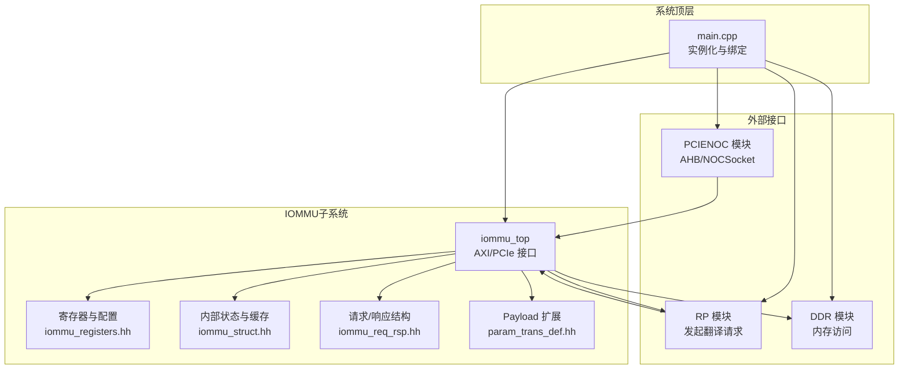
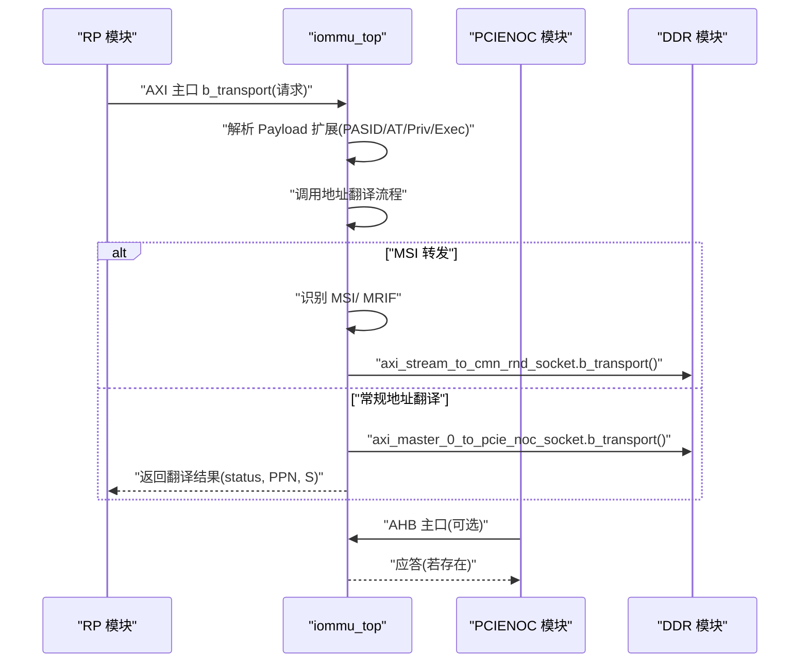
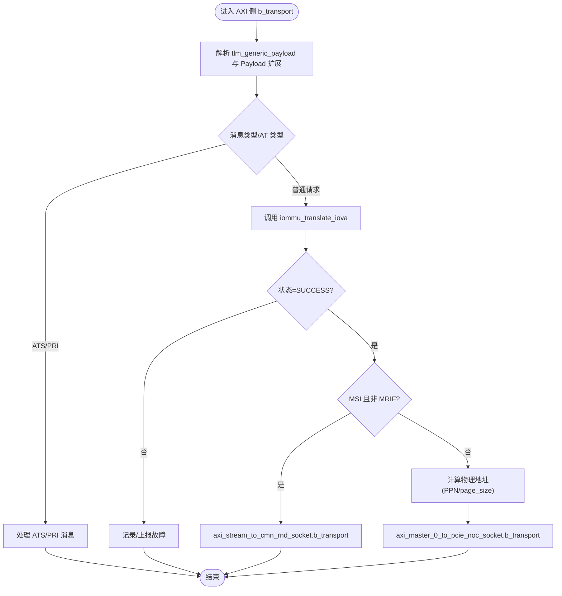
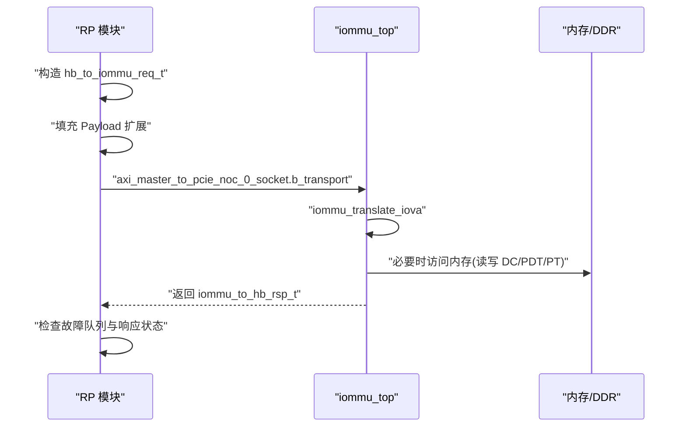
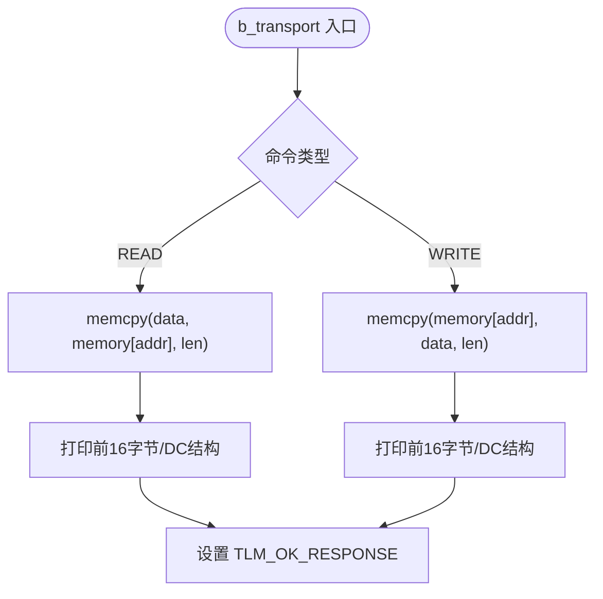
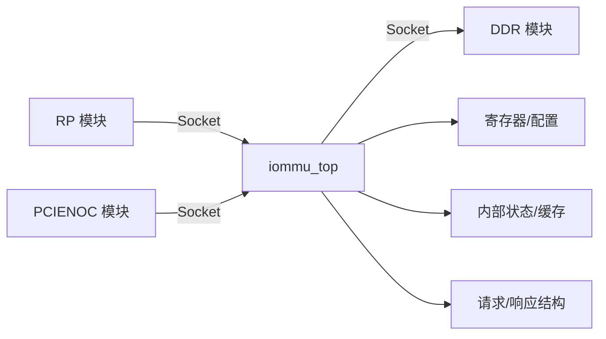

# 系统组件关系

<cite>
**本文档引用的文件**
- [main.cpp](file://main.cpp)
- [iommu_top.cc](file://iommu/iommu_top.cc)
- [iommu_top.hh](file://iommu/iommu_top.hh)
- [test_ddr.hh](file://ddr/test_ddr.hh)
- [test_ddr.cc](file://ddr/test_ddr.cc)
- [test_rp.hh](file://rp/test_rp.hh)
- [test_rp_func.cc](file://rp/test_rp_func.cc)
- [test_pcienoc.hh](file://pcienoc/test_pcienoc.hh)
- [test_pcienoc.cc](file://pcienoc/test_pcienoc.cc)
- [param_trans_def.hh](file://iommu/param_trans_def.hh)
- [iommu_req_rsp.hh](file://iommu/iommu_req_rsp.hh)
- [iommu_struct.hh](file://iommu/iommu_struct.hh)
- [iommu_registers.hh](file://iommu/iommu_registers.hh)
- [iommu_data_structures.hh](file://iommu/iommu_data_structures.hh)
</cite>

## 目录
1. [引言](#引言)
2. [项目结构](#项目结构)
3. [核心组件](#核心组件)
4. [架构总览](#架构总览)
5. [详细组件分析](#详细组件分析)
6. [依赖关系分析](#依赖关系分析)
7. [性能考量](#性能考量)
8. [故障排查指南](#故障排查指南)
9. [结论](#结论)
10. [附录](#附录)

## 引言
本文件面向系统集成与扩展工程师，系统性阐述 IOMMU 仿真模型中各模块之间的依赖关系、接口定义、数据交换与控制信号传递机制。重点围绕以下核心组件展开：iommu_top（IOMMU 顶层）、RP 模块（Root Complex/设备端发起者）、DDR 模块（内存模拟）、PCIENOC 模块（PCIe NOC 接口）。文档通过系统拓扑图与组件交互序列图，帮助读者快速把握 TLM Socket 的绑定关系与通信路径。

## 项目结构
项目采用 SystemC/TLM2 架构，模块间通过 TLM 2.0 的简单目标/发起者 Socket 实现解耦通信。顶层 main.cpp 负责实例化各模块并完成 Socket 绑定；iommu_top 作为 IOMMU 核心，对外暴露 AXI/PCIe 接口；RP 模块负责发起地址翻译请求；DDR 模块提供内存访问；PCIENOC 模块提供 NOC 接口适配。

图表来源
- [main.cpp:38-87](file://main.cpp#L38-L87)
- [iommu_top.hh:19-56](file://iommu/iommu_top.hh#L19-L56)
- [test_ddr.hh:15-36](file://ddr/test_ddr.hh#L15-L36)
- [test_rp.hh:54-112](file://rp/test_rp.hh#L54-L112)
- [test_pcienoc.hh:10-21](file://pcienoc/test_pcienoc.hh#L10-L21)

章节来源
- [main.cpp:38-87](file://main.cpp#L38-L87)
- [iommu_top.hh:19-56](file://iommu/iommu_top.hh#L19-L56)

## 核心组件
- iommu_top：IOMMU 顶层模块，封装 AXI/PCIe 接口、寄存器文件、内部状态与缓存、地址翻译流程。对外提供多路 TLM Socket，分别连接不同下游模块。
- RP 模块：设备端发起者，负责构造 TLM 请求、填充 Payload 扩展、调用 IOMMU 地址翻译接口，并进行故障记录校验。
- DDR 模块：内存模拟，提供目标 Socket 处理读写事务，支持地址越界检测与数据打印。
- PCIENOC 模块：NOC 接口适配，当前实现为空，保留 AHB 主口以连接 IOMMU 的 AHB 侧接口。

章节来源
- [iommu_top.hh:19-56](file://iommu/iommu_top.hh#L19-L56)
- [test_rp.hh:54-112](file://rp/test_rp.hh#L54-L112)
- [test_ddr.hh:15-96](file://ddr/test_ddr.hh#L15-L96)
- [test_pcienoc.hh:10-21](file://pcienoc/test_pcienoc.hh#L10-L21)

## 架构总览
系统采用“IOMMU 为中心”的拓扑：RP 通过 AXI 主口发起请求至 IOMMU；IOMMU 完成地址翻译后，将物理地址回传给 RP 或转发至 DDR；PCIENOC 提供 AHB 主口与 IOMMU 的 AHB 侧接口对接。Socket 绑定关系如下：

- iommu_top.axi_stream_to_cmn_rnd_socket → ddr.axi_slave_from_cmn_rnd_socket
- iommu_top.axi_master_0_to_pcie_noc_socket → ddr.axi_slave_from_pcie_noc_0_socket
- iommu_top.axi_master_1_to_cmn_rnd_socket → ddr.axi_slave_from_cmn_rnd_1_socket
- iommu_top.axi_master_2_to_pcie_noc_socket → rp.axi_slave_to_pcie_noc_0_socket
- rp.axi_master_to_pcie_noc_0_socket → iommu_top.axi_slave_from_pcie_noc_0_socket
- pcienoc.ahb_master_to_pcie_noc_1_socket → iommu_top.ahb_slave_from_pcie_noc_1_socket

图表来源
- [main.cpp:60-74](file://main.cpp#L60-L74)
- [iommu_top.cc:41-210](file://iommu/iommu_top.cc#L41-L210)
- [test_ddr.hh:38-94](file://ddr/test_ddr.hh#L38-L94)
- [test_rp_func.cc:28-78](file://rp/test_rp_func.cc#L28-L78)

章节来源
- [main.cpp:60-74](file://main.cpp#L60-L74)
- [iommu_top.cc:41-210](file://iommu/iommu_top.cc#L41-L210)

## 详细组件分析

### iommu_top 组件
- 角色定位：IOMMU 控制器核心，负责寄存器访问、地址翻译、ATS/PRI、MSI/MRIF、队列与中断等。
- 接口定义：
  - AXI/PCIe 侧：axi_slave_from_pcie_noc_0_socket（b_transport 回调）
  - AHB 侧：ahb_slave_from_pcie_noc_1_socket（b_transport 回调）
  - 发起者侧：axi_stream_to_cmn_rnd_socket、axi_master_0_to_pcie_noc_socket、axi_master_1_to_cmn_rnd_socket、axi_master_2_to_pcie_noc_socket
- 数据交换与控制信号：
  - 通过 tlm_generic_payload 传递地址、长度、读写命令与字节使能。
  - 通过 Payload 扩展携带 requester_id、PID、at、exec_req、priv_req 等控制位。
  - 返回 status、PPN、S、is_msi/is_mrif、dest_mrif_addr 等翻译结果。
- 关键流程：
  - 寄存器访问：AHB/AXI 侧统一走 iommu_top::ahb_slave_b_transport 与 iommu_top::axi_slave_b_transport。
  - 地址翻译：在 AXI 侧接收请求后，解析扩展，调用 iommu_translate_iova 并根据结果决定转发至 DDR 或 IMSIC/MSI 路径。
  - MSI 转发：当翻译结果标记为 MSI 且非 MRIF 时，通过 axi_stream_to_cmn_rnd_socket 转发至 IMSIC/CMN_RND。

图表来源
- [iommu_top.cc:77-210](file://iommu/iommu_top.cc#L77-L210)
- [param_trans_def.hh:12-97](file://iommu/param_trans_def.hh#L12-L97)
- [iommu_req_rsp.hh:36-102](file://iommu/iommu_req_rsp.hh#L36-L102)

章节来源
- [iommu_top.cc:41-210](file://iommu/iommu_top.cc#L41-L210)
- [iommu_top.hh:19-56](file://iommu/iommu_top.hh#L19-L56)

### RP 模块
- 角色定位：设备端发起者，构造 hb_to_iommu_req_t 请求，填充 Payload 扩展，调用 iommu_translate_iova_rp 并校验响应与故障队列。
- 接口定义：
  - axi_master_to_pcie_noc_0_socket：发起 AXI 请求至 IOMMU。
  - axi_slave_to_pcie_noc_0_socket：接收 IOMMU 响应。
- 关键流程：
  - 构造 tlm_generic_payload 与 Payload 扩展（requester_id、pid_valid、process_id、exec_req、priv_req、at）。
  - 调用 iommu_translate_iova_rp -> axi_master_to_pcie_noc_0_socket.b_transport。
  - 通过寄存器读取 FQH/FQT 与内存页表，校验故障记录。

图表来源
- [test_rp_func.cc:28-78](file://rp/test_rp_func.cc#L28-L78)
- [test_rp_func.cc:170-198](file://rp/test_rp_func.cc#L170-L198)
- [iommu_req_rsp.hh:36-102](file://iommu/iommu_req_rsp.hh#L36-L102)

章节来源
- [test_rp.hh:54-112](file://rp/test_rp.hh#L54-L112)
- [test_rp_func.cc:28-78](file://rp/test_rp_func.cc#L28-L78)

### DDR 模块
- 角色定位：内存模拟，注册多个 target socket，统一通过 b_transport 处理读写。
- 关键点：
  - 地址越界检测与错误响应。
  - 对 DC（64 字节）读写进行结构化打印，便于调试。

图表来源
- [test_ddr.hh:38-94](file://ddr/test_ddr.hh#L38-L94)

章节来源
- [test_ddr.hh:15-96](file://ddr/test_ddr.hh#L15-L96)
- [test_ddr.cc:1-6](file://ddr/test_ddr.cc#L1-L6)

### PCIENOC 模块
- 角色定位：NOC 接口适配，当前仅提供 AHB 主口，用于连接 IOMMU 的 AHB 侧接口。
- 当前实现：接口类定义，无具体逻辑。

章节来源
- [test_pcienoc.hh:10-21](file://pcienoc/test_pcienoc.hh#L10-L21)
- [test_pcienoc.cc:1-3](file://pcienoc/test_pcienoc.cc#L1-L3)

## 依赖关系分析
- 模块耦合与内聚：
  - iommu_top 高内聚：封装寄存器、翻译、队列、中断等核心逻辑；通过 Socket 与外部解耦。
  - RP/DDR/PCIENOC 低耦合：通过 TLM Socket 与 IOMMU 交互，便于替换与扩展。
- 直接依赖：
  - iommu_top 依赖 iommu_struct/iommu_registers/iommu_req_rsp/iommu_data_structures 以完成寄存器访问、数据结构与翻译流程。
  - RP 依赖 iommu_req_rsp 与 iommu_registers 以构造请求与校验故障。
  - DDR 依赖 TLM utils 以注册 target socket。
- 外部依赖与集成点：
  - TLM 2.0 Socket 绑定在 main.cpp 中集中完成，便于系统级集成与扩展。

图表来源
- [main.cpp:60-74](file://main.cpp#L60-L74)
- [iommu_struct.hh:42-100](file://iommu/iommu_struct.hh#L42-L100)
- [iommu_registers.hh:771-800](file://iommu/iommu_registers.hh#L771-L800)
- [iommu_req_rsp.hh:13-105](file://iommu/iommu_req_rsp.hh#L13-L105)

章节来源
- [iommu_struct.hh:24-100](file://iommu/iommu_struct.hh#L24-L100)
- [iommu_registers.hh:1-800](file://iommu/iommu_registers.hh#L1-L800)
- [iommu_req_rsp.hh:13-105](file://iommu/iommu_req_rsp.hh#L13-L105)

## 性能考量
- 地址翻译路径选择：
  - MSI/MRIF 路径优先，避免额外内存访问。
  - 常规路径需访问内存（DC/PDT/PT），注意页大小（4K/2M）与 NAPOT 格式转换对性能的影响。
- 队列与中断：
  - 启用 CQ/FQ/PQ 时，注意队列大小与中断触发策略，避免阻塞与抖动。
- Socket 绑定与延迟：
  - Socket 绑定在仿真开始前完成，确保路径稳定；避免在运行期动态变更绑定。

## 故障排查指南
- 常见问题与定位：
  - 地址越界：DDR b_transport 会检测并返回地址错误响应，检查地址范围与页对齐。
  - 故障记录：通过 FQH/FQT 寄存器与内存页表读取故障记录，核对 cause、iotval、PV/PID/PRIV 等字段。
  - 状态不一致：核对 iommu_to_hb_rsp_t.status 与期望值，结合请求参数（at、pid_valid、exec_req、priv_req）逐项比对。
- 调试建议：
  - 启用 DEBUG 宏（如 DEBUG_TRANSLATION、DEBUG_MSITRANS 等）以输出关键路径日志。
  - 对 DC/PDT/PT 写入前后进行读回校验，确保页表构建正确。

章节来源
- [test_ddr.hh:38-94](file://ddr/test_ddr.hh#L38-L94)
- [test_rp_func.cc:81-121](file://rp/test_rp_func.cc#L81-L121)
- [main.cpp:14-31](file://main.cpp#L14-L31)

## 结论
本系统通过清晰的模块划分与 TLM Socket 绑定，实现了 IOMMU 与 RP/DDR/PCIENOC 的松耦合集成。iommu_top 作为核心控制器，承担寄存器、翻译与队列等职责；RP 负责请求构造与校验；DDR 提供内存访问；PCIENOC 作为接口适配。遵循本文档的接口定义与绑定关系，可快速完成系统集成与功能扩展。

## 附录
- 关键数据结构与寄存器：
  - 设备上下文（DC）、进程上下文（PC）、页表指针（DDT/PDT/PT）等定义于 iommu_data_structures.hh。
  - 寄存器布局与字段含义参见 iommu_registers.hh。
  - 请求/响应结构体定义于 iommu_req_rsp.hh。
- TLM 扩展 Payload：
  - Payload 扩展结构体定义于 param_trans_def.hh，包含 requester_id、PID、at、exec_req、priv_req 等关键控制位。

章节来源
- [iommu_data_structures.hh:1-415](file://iommu/iommu_data_structures.hh#L1-L415)
- [iommu_registers.hh:1-800](file://iommu/iommu_registers.hh#L1-L800)
- [iommu_req_rsp.hh:13-105](file://iommu/iommu_req_rsp.hh#L13-L105)
- [param_trans_def.hh:12-97](file://iommu/param_trans_def.hh#L12-L97)