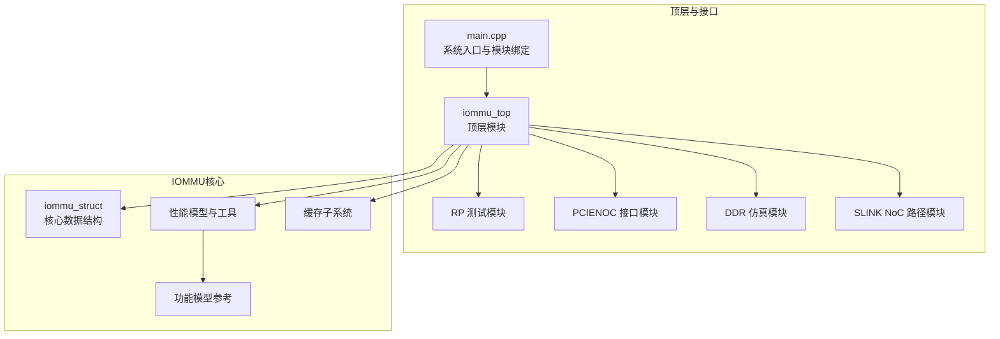
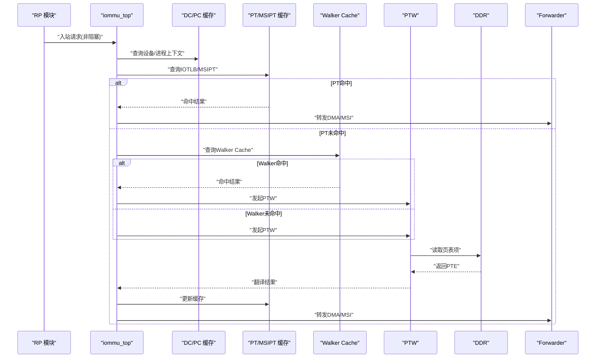
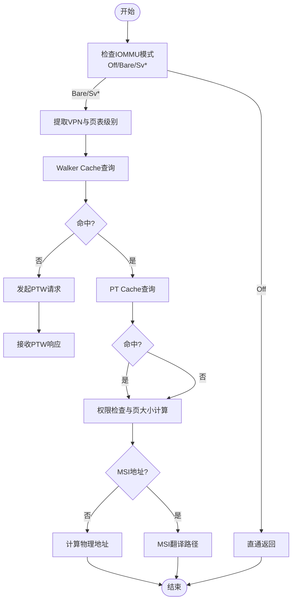
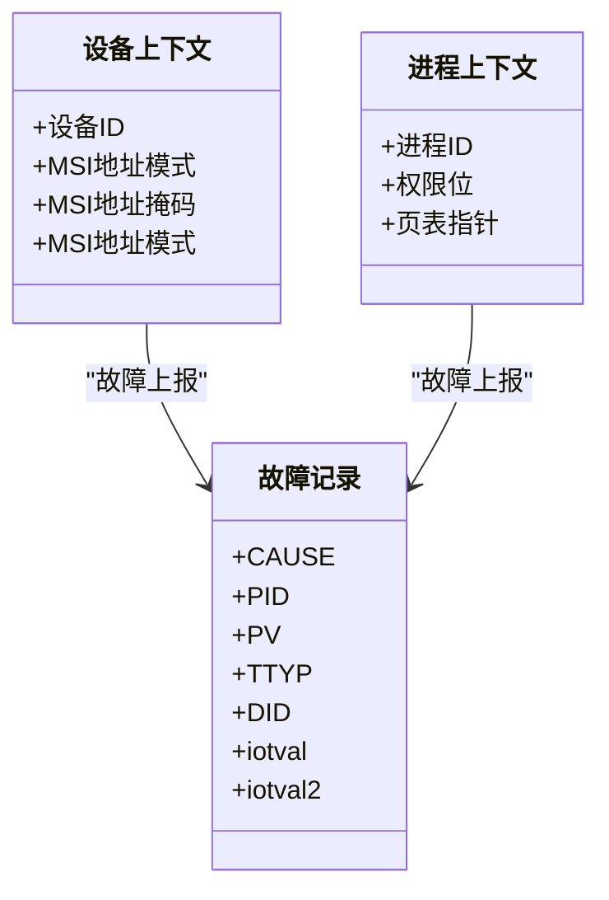
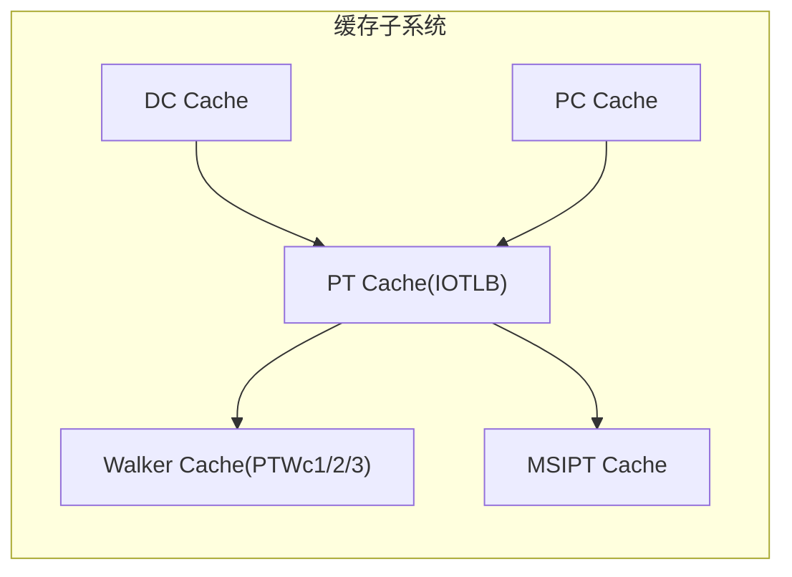
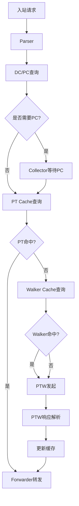
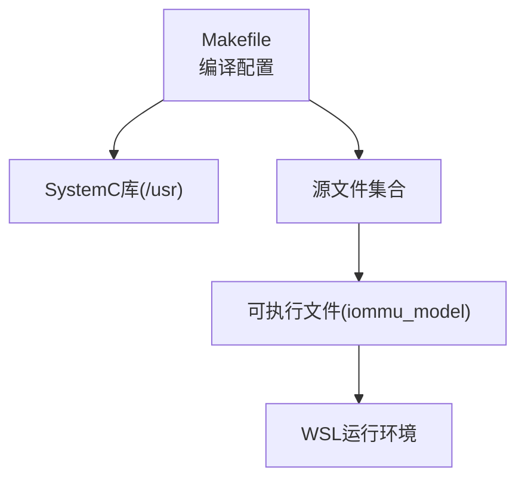

# 项目介绍

<cite>
**本文引用的文件**
- [README.md](file://README.md)
- [main.cpp](file://main.cpp)
- [iommu_top.hh](file://iommu/iommu_top.hh)
- [iommu_top.cc](file://iommu/iommu_top.cc)
- [iommu_struct.hh](file://iommu/include/iommu_struct.hh)
- [iommu_translate.hh](file://iommu/include/iommu_translate.hh)
- [iommu_fault.hh](file://iommu/include/iommu_fault.hh)
- [default_config.json](file://iommu/cache_config/default_config.json)
- [cache_subsystem.h](file://iommu/cache_src/subsystem/cache_subsystem.h)
- [iommu_perf_model.hh](file://iommu/iommu_perf_model/iommu_perf_model.hh)
- [PERF_MODEL_IMPLEMENTATION.md](file://PERF_MODEL_IMPLEMENTATION.md)
- [REFACTOR_SUMMARY.md](file://REFACTOR_SUMMARY.md)
- [CACHE_PERFORMANCE_ANALYSIS_500REQ.md](file://CACHE_PERFORMANCE_ANALYSIS_500REQ.md)
- [GDB_DEBUG_GUIDE.md](file://GDB_DEBUG_GUIDE.md)
- [Makefile](file://Makefile)
</cite>

## 目录
1. [简介](#简介)
2. [项目结构](#项目结构)
3. [核心组件](#核心组件)
4. [架构总览](#架构总览)
5. [详细组件分析](#详细组件分析)
6. [依赖关系分析](#依赖关系分析)
7. [性能考量](#性能考量)
8. [故障排查指南](#故障排查指南)
9. [结论](#结论)
10. [附录](#附录)

## 简介
本项目是一个基于SystemC的RISC-V IOMMU（输入/输出内存管理单元）系统级仿真模型，面向RISC-V平台的IOMMU功能仿真与性能评估。项目围绕SPEC v4规范实现，提供事件驱动的非阻塞仿真，涵盖地址转换、故障处理、设备/进程上下文管理、MSI地址翻译、两级页表walk以及多级缓存优化等关键能力。通过顶层模块与多线程流水线的结合，模型能够高效地模拟IOMMU在复杂PCIe拓扑与NoC路径下的地址翻译与数据转发行为，适用于系统级验证、性能分析与调试支持。

## 项目结构
项目采用模块化组织方式，核心IOMMU功能位于iommu目录，测试与接口模块分布在rp、pcienoc、ddr、slink等目录，顶层入口在main.cpp中完成模块实例化与端口绑定。构建系统通过Makefile统一管理编译选项与依赖。

图表来源
- [main.cpp:39-94](file://main.cpp#L39-L94)
- [iommu_top.hh:41-382](file://iommu/iommu_top.hh#L41-L382)

章节来源
- [README.md:63-76](file://README.md#L63-L76)
- [Makefile:42-84](file://Makefile#L42-L84)

## 核心组件
- 顶层模块 iommu_top：负责IOMMU实例初始化、端口绑定、事件驱动的多线程流水线调度、DDR仲裁与响应路由、输出重排序、统计与性能观测等。
- 性能模型与工具：提供任务上下文、地址提取、VPN/页表级别计算、MSI地址判断、两级地址翻译辅助等工具函数，支撑SPEC v4实现。
- 缓存子系统：统一管理DC/PC/PT/MSIPT/Walker缓存，提供查询、更新、失效的异步通道，支持统计与任务追踪。
- 功能模型参考：保留功能代码模型的头文件与实现，作为性能模型的逻辑参考与一致性校验依据。
- 测试与接口：Root Port、PCIe NoC、SLINK NoC、DDR仿真模块，用于构造I/O请求、验证路径与性能。

章节来源
- [iommu_top.hh:41-382](file://iommu/iommu_top.hh#L41-L382)
- [iommu_perf_model.hh:1-197](file://iommu/iommu_perf_model/iommu_perf_model.hh#L1-L197)
- [cache_subsystem.h:18-161](file://iommu/cache_src/subsystem/cache_subsystem.h#L18-L161)
- [iommu_struct.hh:42-102](file://iommu/include/iommu_struct.hh#L42-L102)

## 架构总览
IOMMU采用事件驱动的SystemC仿真，通过非阻塞TLM接口与多线程流水线实现高性能地址翻译与数据转发。顶层模块将入站请求经Parser解析后，路由至DC/PC缓存查询、PT/MSIPT缓存查询或xDTW/PTW路径，同时通过Walker Cache减少页表walk的DDR访问，最终经Forwarder转发或生成故障记录。

图表来源
- [iommu_top.cc:127-190](file://iommu/iommu_top.cc#L127-L190)
- [iommu_top.cc:267-389](file://iommu/iommu_top.cc#L267-L389)
- [PERF_MODEL_IMPLEMENTATION.md:73-97](file://PERF_MODEL_IMPLEMENTATION.md#L73-L97)

章节来源
- [iommu_top.cc:9-38](file://iommu/iommu_top.cc#L9-L38)
- [iommu_top.cc:394-414](file://iommu/iommu_top.cc#L394-L414)
- [PERF_MODEL_IMPLEMENTATION.md:14-97](file://PERF_MODEL_IMPLEMENTATION.md#L14-L97)

## 详细组件分析

### 地址转换与两级翻译
- 两级地址翻译：支持VS-stage（iosatp，Sv39/Sv48）与G-stage（iohgatp，Sv39x4/Sv48x4）嵌套翻译，结合权限检查与页大小计算，生成物理地址。
- VPN提取与页表级别：根据SXL与iosatp模式提取VPN，确定页表级别与PTE大小，支持Sv32/Sv39/Sv48/Sv57等模式。
- Bare模式与MSI地址：在Bare模式下进行直通翻译；MSI地址识别与MSI PTE解析，支持MRIF与Basic Translate两种路径。

图表来源
- [iommu_translate.hh:105-130](file://iommu/include/iommu_translate.hh#L105-L130)
- [iommu_perf_model.hh:58-108](file://iommu/iommu_perf_model/iommu_perf_model.hh#L58-L108)
- [iommu_perf_model.hh:146-155](file://iommu/iommu_perf_model/iommu_perf_model.hh#L146-L155)

章节来源
- [iommu_translate.hh:95-130](file://iommu/include/iommu_translate.hh#L95-L130)
- [iommu_perf_model.hh:10-41](file://iommu/iommu_perf_model/iommu_perf_model.hh#L10-L41)

### 设备/进程上下文与故障处理
- 设备上下文定位：根据设备ID与PID定位DC，支持Off/Bare与多级模式；进程上下文定位：根据PCID与权限位定位PC。
- 故障记录：定义故障类型与记录格式，包含CAUSE、PID、PV、TTYP、DID、iotval/iotval2等字段，支持写入故障队列与中断上报。

图表来源
- [iommu_fault.hh:63-89](file://iommu/include/iommu_fault.hh#L63-L89)
- [iommu_translate.hh:95-103](file://iommu/include/iommu_translate.hh#L95-L103)

章节来源
- [iommu_fault.hh:26-89](file://iommu/include/iommu_fault.hh#L26-L89)
- [iommu_translate.hh:95-103](file://iommu/include/iommu_translate.hh#L95-L103)

### 缓存子系统与多级缓存优化
- 缓存子系统：统一管理DC/PC/PT/MSIPT/Walker缓存，提供查询、更新、失效的异步通道，支持统计与任务追踪。
- Walker Cache：三级缓存（PTWc_1/2/3），散列索引与SRRIP替换，支持按GSCID/PSCID/IOVA失效，显著降低PTW的DDR访问。
- PT Cache：IOTLB缓存叶子PTE，配合VA去重与批量恢复，减少重复walk。

图表来源
- [cache_subsystem.h:18-161](file://iommu/cache_src/subsystem/cache_subsystem.h#L18-L161)
- [default_config.json:20-69](file://iommu/cache_config/default_config.json#L20-L69)

章节来源
- [cache_subsystem.h:30-84](file://iommu/cache_src/subsystem/cache_subsystem.h#L30-L84)
- [default_config.json:20-69](file://iommu/cache_config/default_config.json#L20-L69)

### 顶层模块与事件驱动流水线
- 端口与回调：顶层模块注册非阻塞nb_transport回调，处理入站请求与DDR响应，维护outstanding计数与事件通知。
- 线程划分：Parser、Collector、DC/PC Cache、PT Cache、MSIPT Cache、xDTW、PTW、Forwarder、Fault/CQ等线程协同工作，形成20线程流水线。
- 统计与观测：提供端到端IOPS、端口带宽、缓存命中率、VA去重统计等指标。

图表来源
- [iommu_top.cc:127-190](file://iommu/iommu_top.cc#L127-L190)
- [iommu_top.cc:267-389](file://iommu/iommu_top.cc#L267-L389)
- [iommu_top.hh:211-279](file://iommu/iommu_top.hh#L211-L279)

章节来源
- [iommu_top.cc:9-38](file://iommu/iommu_top.cc#L9-L38)
- [iommu_top.cc:520-582](file://iommu/iommu_top.cc#L520-L582)
- [iommu_top.hh:211-382](file://iommu/iommu_top.hh#L211-L382)

## 依赖关系分析
- 构建依赖：Makefile统一管理SystemC路径、编译标志与源文件列表，确保在WSL环境下正确链接SystemC库。
- 运行环境：必须在WSL（Windows Subsystem for Linux）中编译与运行，SystemC库需安装在/usr目录下。
- 调试支持：提供GDB调试指南与脚本，支持断点、单步、变量检查与调用栈跟踪。

图表来源
- [Makefile:13-34](file://Makefile#L13-L34)
- [Makefile:42-84](file://Makefile#L42-L84)
- [README.md:7-16](file://README.md#L7-L16)

章节来源
- [Makefile:13-34](file://Makefile#L13-L34)
- [README.md:7-16](file://README.md#L7-L16)

## 性能考量
- Walker Cache命中率：在典型场景下可达91.8%，显著降低PTW的DDR访问；PT Cache在空间扫描场景下命中率为0%，但通过VA去重与批量恢复提升整体效率。
- 端到端IOPS与带宽：顶层模块提供IOMMU与PTW的IOPS统计、端口平均带宽与峰值利用率，便于性能评估。
- 并发与流水线：20线程流水线与非阻塞DDR接口提升并发处理能力，outstanding计数与仲裁机制保障高吞吐。

章节来源
- [CACHE_PERFORMANCE_ANALYSIS_500REQ.md:13-179](file://CACHE_PERFORMANCE_ANALYSIS_500REQ.md#L13-L179)
- [iommu_top.cc:520-582](file://iommu/iommu_top.cc#L520-L582)

## 故障排查指南
- 编译与运行：确保在WSL中使用DEBUG=1编译，生成包含调试符号的可执行文件；运行前检查SystemC库路径与权限。
- GDB调试：通过断点设置、单步执行、变量检查与调用栈跟踪定位问题；针对地址翻译、设备/进程上下文定位与故障上报等关键路径设置断点。
- 性能观测：利用顶层统计接口观察IOPS、带宽与缓存命中率，结合Walker Cache与PT Cache的命中率分析定位瓶颈。

章节来源
- [GDB_DEBUG_GUIDE.md:8-206](file://GDB_DEBUG_GUIDE.md#L8-L206)
- [README.md:55-61](file://README.md#L55-L61)

## 结论
本项目基于SPEC v4规范，采用SystemC事件驱动与多线程流水线，实现了RISC-V IOMMU的地址转换、故障处理、设备/进程上下文管理与MSI翻译等核心功能。通过Walker Cache与多级缓存优化，显著降低DDR访问并提升整体性能；顶层模块提供丰富的统计与观测接口，便于系统级验证与性能分析。项目具备良好的可扩展性与可维护性，适合在复杂PCIe与NoC环境下进行深入研究与工程应用。

## 附录
- 规范与实现：遵循SPEC v4的线程数量、FIFO命名与深度、数据结构定义，实现非阻塞DDR接口、Walker Cache集成与Cache Invalidation通道。
- 重构与演进：已完成从阻塞式功能模型到非阻塞式性能模型的重构，集成Walker Cache与缓存失效联动机制，支持并发处理与上下文恢复。

章节来源
- [PERF_MODEL_IMPLEMENTATION.md:195-227](file://PERF_MODEL_IMPLEMENTATION.md#L195-L227)
- [REFACTOR_SUMMARY.md:230-294](file://REFACTOR_SUMMARY.md#L230-L294)