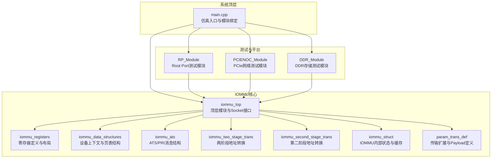
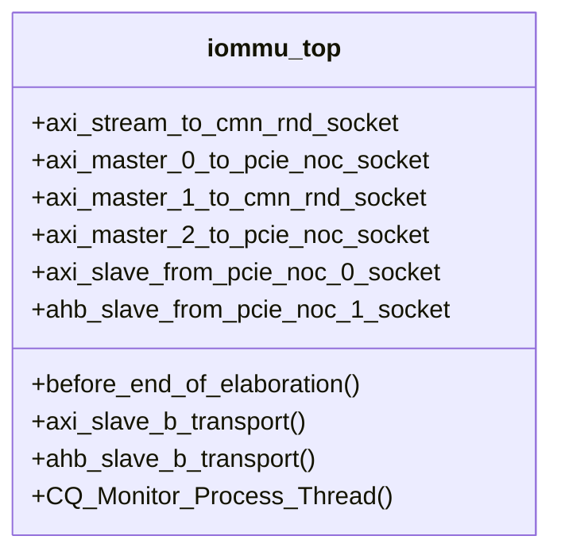
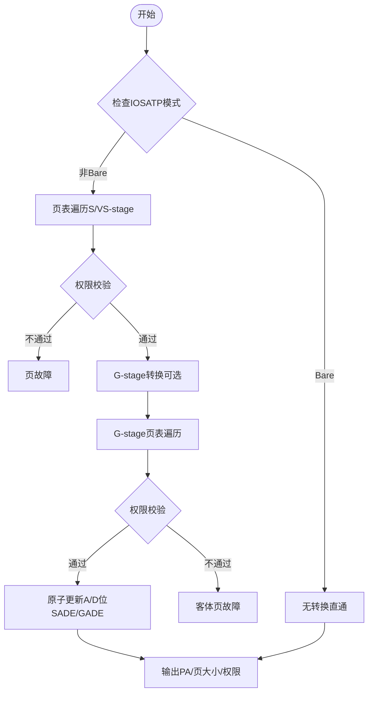
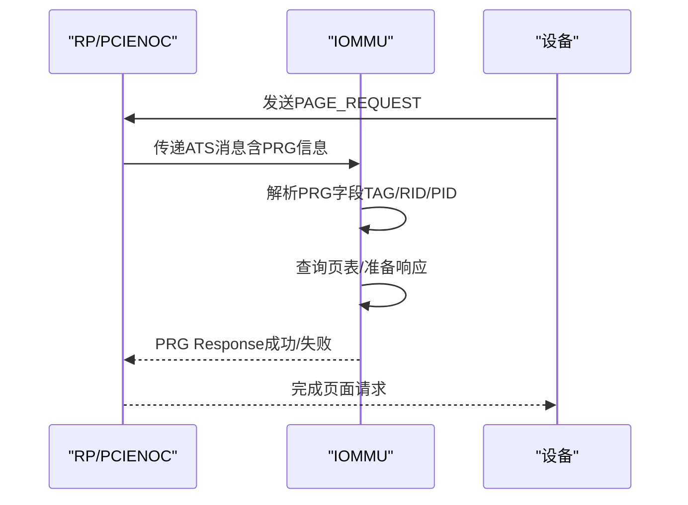
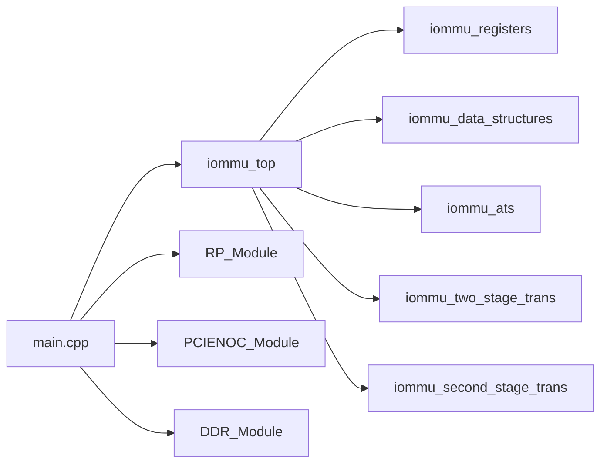

# 项目介绍

<cite>
**本文档引用的文件**
- [main.cpp](file://main.cpp)
- [iommu_top.hh](file://iommu/iommu_top.hh)
- [iommu_top.cc](file://iommu/iommu_top.cc)
- [iommu_registers.hh](file://iommu/iommu_registers.hh)
- [iommu_data_structures.hh](file://iommu/iommu_data_structures.hh)
- [iommu_ats.hh](file://iommu/iommu_ats.hh)
- [iommu_second_stage_trans.cc](file://iommu/iommu_second_stage_trans.cc)
- [iommu_two_stage_trans.cc](file://iommu/iommu_two_stage_trans.cc)
- [test_rp.hh](file://rp/test_rp.hh)
- [test_pcienoc.hh](file://pcienoc/test_pcienoc.hh)
- [Makefile](file://Makefile)
- [compile_systemc.bat](file://compile_systemc.bat)
- [GDB_DEBUG_GUIDE.md](file://GDB_DEBUG_GUIDE.md)
- [iommu_struct.hh](file://iommu/iommu_struct.hh)
- [param_trans_def.hh](file://iommu/param_trans_def.hh)
</cite>

## 目录
1. [引言](#引言)
2. [项目结构](#项目结构)
3. [核心组件](#核心组件)
4. [架构总览](#架构总览)
5. [详细组件分析](#详细组件分析)
6. [依赖关系分析](#依赖关系分析)
7. [性能考量](#性能考量)
8. [故障排查指南](#故障排查指南)
9. [结论](#结论)
10. [附录](#附录)

## 引言
本项目是一个基于SystemC的RISC-V IOMMU（输入/输出内存管理单元）系统级仿真模型，旨在为RISC-V平台上的IOMMU功能提供完整的建模与验证能力。IOMMU在现代计算系统中承担着关键角色：它负责将设备发起的IOVA（IO虚拟地址）转换为系统物理地址（PA），同时提供内存访问权限控制、安全隔离以及与PCIe ATS/PRI等协议的交互能力。在RISC-V架构下，IOMMU通过两阶段地址转换（S/VS-stage与G-stage）实现灵活的内存管理与安全策略，尤其适用于虚拟化场景与多租户平台。

本项目的创新点与技术特色包括：
- 基于SystemC的完整系统级仿真，支持TLM（事务级建模）接口，便于与SoC其他模块集成。
- 支持PCIe ATS（地址转换服务）与PRI（页面请求接口）协议，实现设备侧的地址转换与按需页加载。
- 实现两阶段地址转换流程，覆盖S/VS-stage与G-stage页表遍历、权限校验、A/D位原子更新、NAPOT超级页等细节。
- 提供丰富的调试与测试支撑，包括GDB调试指南、测试模块（RP、PCIENOC、DDR）以及命令队列、中断、性能监控等子系统。

应用场景涵盖：
- 硬件验证：在RTL综合前对IOMMU行为进行系统级验证，减少后端bug率。
- 系统调试：通过仿真重现复杂地址转换与故障场景，辅助定位问题。
- 性能分析：利用硬件性能计数器（HPM）与事件统计，评估IOMMU在不同配置下的性能表现。

## 项目结构
项目采用模块化组织，顶层通过SystemC模块连接IOMMU核心、RP（Root Port桥接器）、PCIENOC（PCIe网络）与DDR存储模块，形成一个可运行的系统级仿真环境。

**图表来源**
- [main.cpp:38-87](file://main.cpp#L38-L87)
- [iommu_top.hh:19-57](file://iommu/iommu_top.hh#L19-L57)
- [test_rp.hh:54-112](file://rp/test_rp.hh#L54-L112)
- [test_pcienoc.hh:10-21](file://pcienoc/test_pcienoc.hh#L10-L21)

**章节来源**
- [main.cpp:38-87](file://main.cpp#L38-L87)
- [iommu_top.hh:19-57](file://iommu/iommu_top.hh#L19-L57)
- [test_rp.hh:54-112](file://rp/test_rp.hh#L54-L112)
- [test_pcienoc.hh:10-21](file://pcienoc/test_pcienoc.hh#L10-L21)

## 核心组件
- 顶层模块 iommu_top：封装IOMMU核心逻辑，提供AXI与AHB Socket接口，处理来自RP/PCIENOC的IO请求与寄存器访问，驱动地址转换与消息处理。
- 地址转换引擎：实现两阶段地址转换（S/VS-stage → G-stage），支持多种页表格式（Sv32/Sv39/Sv48/Sv57及x4变体），权限校验与A/D位原子更新。
- ATS/PRI支持：解析PCIe ATS消息与PRI页面请求，生成响应或触发页加载。
- 寄存器与数据结构：完整实现IOMMU寄存器布局、设备上下文（DC）、进程上下文（PC）、页表指针（DDT/PDT/IOSATP/IOHGATP/MSIPTP）等。
- 测试与平台：RP与PCIENOC测试模块模拟设备与PCIe网络行为；DDR模块提供内存访问；GDB调试指南支持问题定位。

**章节来源**
- [iommu_top.cc:6-36](file://iommu/iommu_top.cc#L6-L36)
- [iommu_registers.hh:172-250](file://iommu/iommu_registers.hh#L172-L250)
- [iommu_data_structures.hh:29-130](file://iommu/iommu_data_structures.hh#L29-L130)
- [iommu_ats.hh:47-58](file://iommu/iommu_ats.hh#L47-L58)

## 架构总览
系统通过SystemC的TLM接口连接各模块，顶层main.cpp创建并绑定各模块的Socket，形成如下数据流：
- 设备请求经RP/PCIENOC进入IOMMU，携带扩展信息（Requester ID、PASID、AT类型、读写意图等）。
- IOMMU根据设备上下文与页表执行两阶段地址转换，必要时触发G-stage转换。
- 转换成功则将IOVA映射为PA并转发至DDR；若为MSI写入则转发至IMSIC/MRIF路径。
- ATS/PRI消息被解析并处理，支持页面请求与失效通知。
- 寄存器访问通过AHB/AXI接口由IOMMU内部寄存器文件处理。

```mermaid
sequenceDiagram
participant DEV as "设备/RP"
participant HB as "PCIENOC/总线桥"
participant IOMMU as "IOMMU核心"
participant MEM as "DDR/存储"
DEV->>HB : 发起IO请求含扩展信息
HB->>IOMMU : b_transport(AXI/AHB)
IOMMU->>IOMMU : 解析扩展信息Requester ID/PASID/AT
IOMMU->>IOMMU : 两阶段地址转换S/VS→G
IOMMU->>MEM : 访问内存PA
MEM-->>IOMMU : 返回数据/确认
IOMMU-->>HB : 响应完成
HB-->>DEV : 完成事务
```

**图表来源**
- [main.cpp:60-73](file://main.cpp#L60-L73)
- [iommu_top.cc:77-210](file://iommu/iommu_top.cc#L77-L210)

**章节来源**
- [main.cpp:60-73](file://main.cpp#L60-L73)
- [iommu_top.cc:77-210](file://iommu/iommu_top.cc#L77-L210)

## 详细组件分析

### IOMMU顶层模块与Socket接口
- 提供多个Initiator Socket与Target Socket，分别连接DDR与RP/PCIENOC。
- 实现AHB与AXI两种接口的b_transport回调，处理寄存器读写与IO请求。
- 初始化IOMMU能力、模式与页表大小参数，设置为DDB_Bare模式以便直通验证。

**图表来源**
- [iommu_top.hh:19-57](file://iommu/iommu_top.hh#L19-L57)

**章节来源**
- [iommu_top.hh:19-57](file://iommu/iommu_top.hh#L19-L57)
- [iommu_top.cc:6-36](file://iommu/iommu_top.cc#L6-L36)
- [iommu_top.cc:41-210](file://iommu/iommu_top.cc#L41-L210)

### 两阶段地址转换（S/VS → G）
- 支持Sv32/Sv39/Sv48/Sv57与x4变体，根据MODE字段确定页表层级与VPN划分。
- 对S/VS-stage与G-stage分别进行页表遍历，校验权限位（R/W/X/U），处理NAPOT超级页编码。
- 支持SADE/GADE原子更新A/D位，隐式访问G-stage PTE以满足一致性要求。
- 输出PA、页大小与权限信息，用于后续内存访问或MSI处理。

**图表来源**
- [iommu_two_stage_trans.cc:8-17](file://iommu/iommu_two_stage_trans.cc#L8-L17)
- [iommu_second_stage_trans.cc:7-15](file://iommu/iommu_second_stage_trans.cc#L7-L15)

**章节来源**
- [iommu_two_stage_trans.cc:8-17](file://iommu/iommu_two_stage_trans.cc#L8-L17)
- [iommu_second_stage_trans.cc:7-15](file://iommu/iommu_second_stage_trans.cc#L7-L15)

### ATS/PRI协议支持
- ATS消息结构包含MSGCODE、TAG、RID、PV、PID、PRIV、EXEC_REQ等字段。
- 支持页面请求（PRI）与失效请求/完成消息，维护itag跟踪器以管理并发请求。
- 处理PAGE_REQUEST消息，构造PRG响应并转发至RP/PCIENOC。

**图表来源**
- [iommu_ats.hh:47-91](file://iommu/iommu_ats.hh#L47-L91)
- [iommu_top.cc:96-118](file://iommu/iommu_top.cc#L96-L118)

**章节来源**
- [iommu_ats.hh:47-91](file://iommu/iommu_ats.hh#L47-L91)
- [iommu_top.cc:96-118](file://iommu/iommu_top.cc#L96-L118)

### 寄存器与数据结构
- 能力寄存器（capabilities）：声明支持的页表模式、MSI模式、ATS/PRI、HPM等能力。
- 设备上下文（DC）：包含TC（翻译控制）、IOHGATP（G-stage根指针）、TA（翻译属性）、FSC（S/VS-stage根指针）、MSI页表指针与匹配掩码/模式。
- 寄存器布局与控制状态寄存器（CQCSR/FQCSR/PQCSR）：管理命令队列、故障队列与页面请求队列的启用、索引与状态。

**章节来源**
- [iommu_registers.hh:172-250](file://iommu/iommu_registers.hh#L172-L250)
- [iommu_data_structures.hh:29-130](file://iommu/iommu_data_structures.hh#L29-L130)
- [iommu_data_structures.hh:324-335](file://iommu/iommu_data_structures.hh#L324-L335)

### 传输扩展与Payload
- PayloadExtention扩展包含Requester ID、AT类型、PASID、消息类型与代码等，用于区分ATS/PRI与普通IO请求。
- NocTransaction封装扩展信息，便于在TLM事务中携带设备上下文。

**章节来源**
- [param_trans_def.hh:12-97](file://iommu/param_trans_def.hh#L12-L97)

## 依赖关系分析
- 顶层main.cpp依赖SystemC与TLM，创建并绑定各模块Socket。
- iommu_top依赖寄存器、数据结构、地址转换与ATS模块，形成核心功能闭环。
- 测试模块RP与PCIENOC通过Socket与IOMMU交互，模拟真实系统行为。
- 构建系统通过Makefile统一编译，支持Debug/Release模式与SystemC链接。

**图表来源**
- [main.cpp:38-87](file://main.cpp#L38-L87)
- [iommu_top.cc:6-36](file://iommu/iommu_top.cc#L6-L36)

**章节来源**
- [main.cpp:38-87](file://main.cpp#L38-L87)
- [Makefile:30-50](file://Makefile#L30-L50)

## 性能考量
- 两阶段地址转换涉及多次页表访问与权限校验，建议合理配置页表层级与页大小，避免过多隐式访问导致延迟。
- A/D位原子更新（SADE/GADE）可能引入额外的PTE读写，需关注内存带宽与一致性开销。
- HPM计数器可用于统计页表遍历次数、故障与事件，指导性能优化。
- Debug模式下启用大量日志与断点会显著降低仿真速度，建议在性能测试时切换到Release模式。

## 故障排查指南
- 使用GDB调试：通过提供的调试脚本或手动启动GDB，设置断点于关键函数（如地址转换、设备上下文定位、命令队列处理等），逐步单步定位问题。
- 常见问题：
  - 地址翻译失败：检查页表配置、权限位与SXL/GXL设置，确认IOVA是否符合规范。
  - ATS/PRI异常：核对消息字段（MSGCODE、TAG、RID、PV、PID）与itag跟踪状态。
  - 内存访问故障：检查PMA/PMP限制与物理地址越界。
- 建议流程：先缩小范围到具体模块（地址转换/ATS/寄存器），再深入到数据结构与页表项。

**章节来源**
- [GDB_DEBUG_GUIDE.md:21-206](file://GDB_DEBUG_GUIDE.md#L21-L206)

## 结论
本项目以SystemC为基础，完整实现了RISC-V IOMMU的关键功能：两阶段地址转换、PCIe ATS/PRI协议处理、寄存器与数据结构建模、以及配套的测试与调试工具。其模块化设计与TLM接口使其易于集成到更大规模的SoC仿真平台，能够有效支撑硬件验证、系统调试与性能分析等场景。对于初学者而言，建议从顶层模块与地址转换流程入手，逐步理解设备上下文、页表结构与协议交互机制。

## 附录
- 构建与运行
  - Linux：使用Makefile进行编译，默认Debug模式开启详细日志与断点。
  - Windows：使用批处理脚本编译并安装SystemC，设置环境变量后进行编译。
- 调试建议
  - 使用GDB脚本快速启动，结合条件断点与跟踪点定位问题。
  - 在地址转换关键路径设置断点，观察页表遍历与权限校验结果。

**章节来源**
- [Makefile:14-24](file://Makefile#L14-L24)
- [compile_systemc.bat:1-50](file://compile_systemc.bat#L1-L50)
- [GDB_DEBUG_GUIDE.md:21-206](file://GDB_DEBUG_GUIDE.md#L21-L206)