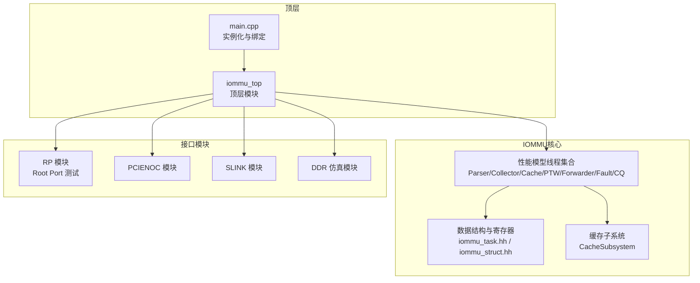
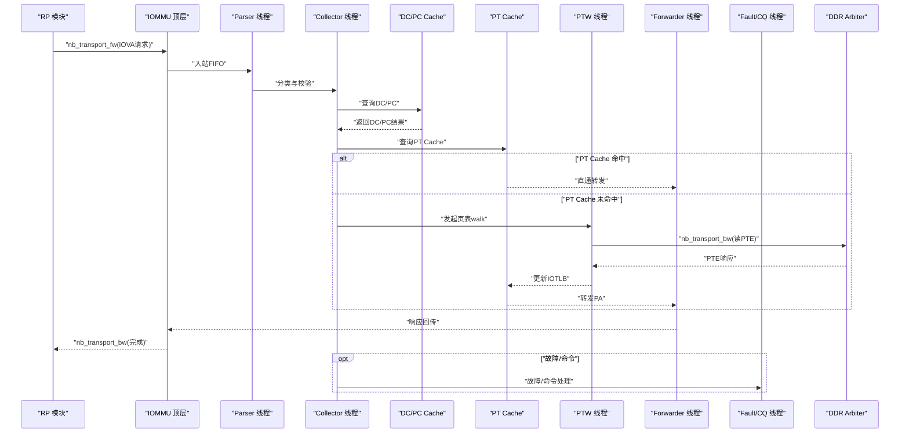
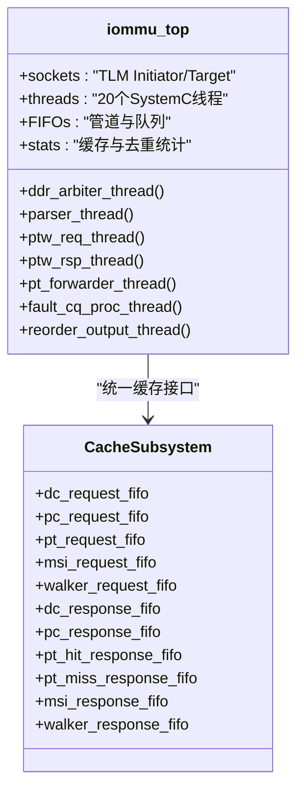
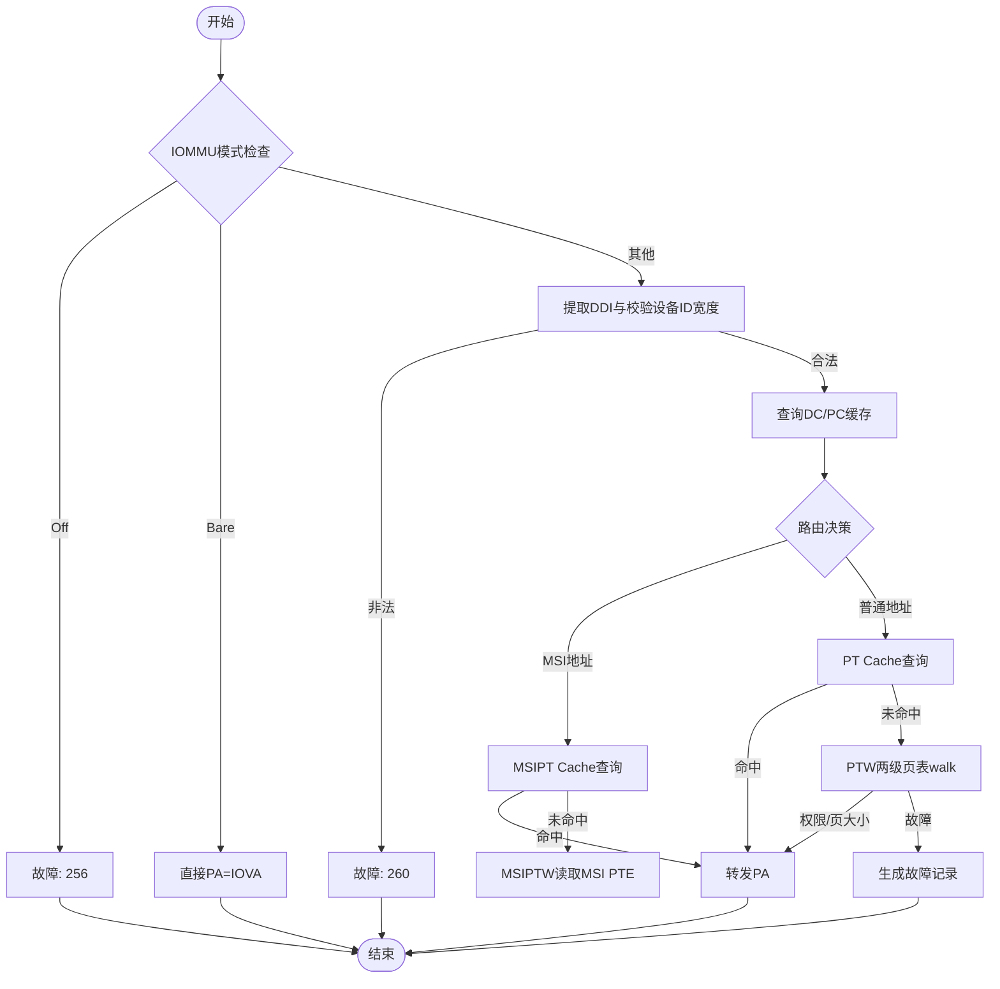
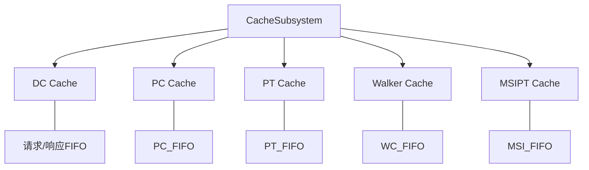
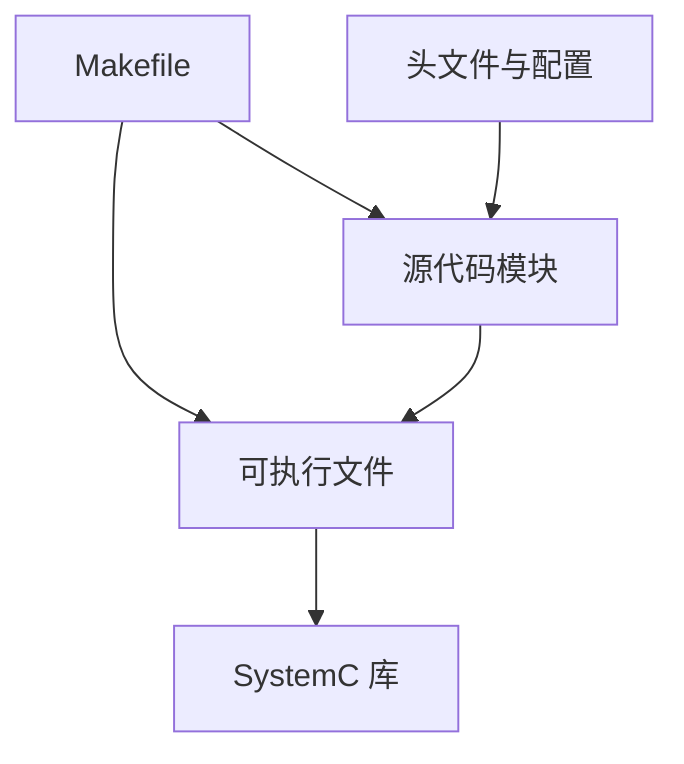

# 项目概述

<cite>
**本文引用的文件**
- [README.md](file://README.md)
- [main.cpp](file://main.cpp)
- [iommu_top.hh](file://iommu/iommu_top.hh)
- [iommu_top.cc](file://iommu/iommu_top.cc)
- [iommu_task.hh](file://iommu/include/iommu_task.hh)
- [iommu_struct.hh](file://iommu/include/iommu_struct.hh)
- [cache_subsystem.h](file://iommu/cache_src/subsystem/cache_subsystem.h)
- [default_config.json](file://iommu/cache_config/default_config.json)
- [PERF_MODEL_IMPLEMENTATION.md](file://PERF_MODEL_IMPLEMENTATION.md)
- [CACHE_PERFORMANCE_ANALYSIS_500REQ.md](file://CACHE_PERFORMANCE_ANALYSIS_500REQ.md)
- [Makefile](file://Makefile)
- [test_rp_thread.cc](file://rp/test_rp_thread.cc)
- [iommu_perf_parser.cc](file://iommu/iommu_perf_model/iommu_perf_parser.cc)
- [iommu_translate.cc](file://iommu/iommu_fun_model/iommu_translate.cc)
</cite>

## 目录
1. [简介](#简介)
2. [项目结构](#项目结构)
3. [核心组件](#核心组件)
4. [架构总览](#架构总览)
5. [详细组件分析](#详细组件分析)
6. [依赖关系分析](#依赖关系分析)
7. [性能考量](#性能考量)
8. [故障排查指南](#故障排查指南)
9. [结论](#结论)
10. [附录](#附录)

## 简介
本项目是一个基于SystemC的RISC-V IOMMU（输入/输出内存管理单元）系统级仿真模型，目标是准确模拟RISC-V架构下的IOMMU功能，包括地址转换、故障处理、设备上下文管理、PCIe ATS（Address Translation Services）以及MSI（Message Signaled Interrupt）地址翻译等。项目采用20个独立SystemC线程构成的流水线架构，结合多级缓存（DC/PC/PT/Walker/MSIPT）与模块化设计，提供高性能、可扩展的地址翻译与转发路径。

项目强调与SPEC v4规范的对齐，实现了完整的性能模型，支持Sv39/Sv48两级地址翻译、Walker Cache加速、非阻塞DDR仲裁与响应、以及命令队列（CQ）与中断/性能监控（HPM）等关键子系统。

## 项目结构
项目采用“模块化+分层”的组织方式，核心IOMMU实现位于iommu目录，测试与接口模块分布在rp、pcienoc、ddr、slink等目录，顶层主程序负责实例化与绑定各模块。

- 顶层入口与绑定
  - main.cpp：创建IOMMU顶层模块、RP、PCIENOC、SLINK、DDR等模块，并建立TLM socket之间的绑定关系，启动仿真。
- IOMMU核心
  - iommu_top.hh/cc：顶层模块，定义20个线程、FIFO、DDR仲裁、回调接口、状态机与统计打印等。
  - include/：核心数据结构与寄存器定义，如iommu_task.hh、iommu_struct.hh等。
  - iommu_perf_model/：性能模型实现，包含Parser、Collector、DC/PC Cache、PT Cache、MSIPT Cache、xDTW、PTW、Forwarder/Fault/CQ等线程。
  - iommu_fun_model/：功能模型实现，如iommu_translate.cc等，作为性能模型的参考与对照。
  - cache_src/：缓存子系统与替换策略实现，统一由CacheSubsystem管理。
  - cache_config/：缓存配置JSON，定义时序、容量与替换策略等。
- 测试与接口
  - rp/：Root Port测试线程，模拟设备发起IOVA翻译请求。
  - pcienoc/、slink/、ddr/：NoC与内存接口模块，提供AXI/总线接口与背压控制。
- 构建与运行
  - Makefile：构建配置，指定SystemC路径、编译选项、调试/发布模式与源文件列表。
  - README.md：环境要求、编译与运行说明。

**图示来源**
- [main.cpp:39-94](file://main.cpp#L39-L94)
- [iommu_top.hh:202-361](file://iommu/iommu_top.hh#L202-L361)
- [cache_subsystem.h:20-161](file://iommu/cache_src/subsystem/cache_subsystem.h#L20-L161)

**章节来源**
- [README.md:63-76](file://README.md#L63-L76)
- [Makefile:42-84](file://Makefile#L42-L84)

## 核心组件
- 顶层模块 iommu_top
  - 定义20个SystemC线程，涵盖Parser、DC/PC Cache、Collector、xDTW、PT Cache、PTW、MSIPT Cache、Forwarder、Fault/CQ、DDR Arbiter与重排序等。
  - 提供TLM nb_transport回调，实现非阻塞接口与响应回传。
  - 维护全局outstanding计数、重排序缓冲、VA去重表与缓存统计。
- 性能模型线程
  - Parser：解析入站请求、分类事务类型、校验IOMMU模式与设备ID宽度，下发到Collector与缓存查询。
  - Collector：聚合DC/PC查询结果，决定路由到PT Cache或MSIPT Cache。
  - Cache子系统：统一管理DC/PC/PT/Walker/MSIPT缓存，提供lookup/update/invalidation通道与统计。
  - PT Cache：IOTLB缓存，命中则直通转发，未命中则触发PTW。
  - PTW：两级页表walk，支持VS/G嵌套，集成Walker Cache加速。
  - MSIPT Cache：MSI页表缓存与翻译，支持MRIF/Basic Translate。
  - Forwarder/Fault/CQ：DMA转发、故障记录与命令队列处理。
- 数据结构与寄存器
  - iommu_task_t：统一的任务上下文，包含请求属性、上下文字段、翻译结果、状态机与walk上下文。
  - iommu_t：IOMMU实例，包含寄存器文件、上下文缓存、全局参数与指向顶层模块的指针。
- 缓存子系统
  - CacheSubsystem：对外暴露请求/响应FIFO，内部管理各缓存worker线程与失效流水线，支持统计与任务追踪。

**章节来源**
- [iommu_top.hh:202-361](file://iommu/iommu_top.hh#L202-L361)
- [iommu_top.cc:9-540](file://iommu/iommu_top.cc#L9-L540)
- [iommu_task.hh:14-200](file://iommu/include/iommu_task.hh#L14-L200)
- [iommu_struct.hh:42-102](file://iommu/include/iommu_struct.hh#L42-L102)
- [cache_subsystem.h:20-161](file://iommu/cache_src/subsystem/cache_subsystem.h#L20-L161)

## 架构总览
IOMMU采用“流水线+并行”的架构设计，将地址翻译分解为多个阶段，每个阶段由独立线程处理，通过FIFO解耦，最大化并发与吞吐。顶层模块负责调度与仲裁，缓存子系统提供统一的查询/更新/失效通道，DDR Arbiter保障多路请求有序访问物理内存。

**图示来源**
- [main.cpp:64-83](file://main.cpp#L64-L83)
- [iommu_top.cc:130-189](file://iommu/iommu_top.cc#L130-L189)
- [iommu_perf_parser.cc:9-122](file://iommu/iommu_perf_model/iommu_perf_parser.cc#L9-L122)
- [iommu_top.cc:266-387](file://iommu/iommu_top.cc#L266-L387)

## 详细组件分析

### 1) 顶层模块与线程体系
- 线程职责
  - Parser：请求解析与模式校验，下发到Collector与缓存查询。
  - Collector：聚合DC/PC结果，决策路由与权限检查。
  - DC/PC Cache：设备/进程上下文缓存，命中则快速返回，未命中则触发xDTW。
  - PT Cache：IOTLB缓存，命中直通，未命中触发PTW。
  - PTW：两级页表walk，支持VS/G嵌套，Walker Cache加速。
  - MSIPT Cache：MSI页表缓存与翻译，支持MRIF/Basic Translate。
  - Forwarder/Fault/CQ：DMA转发、故障记录与命令队列处理。
  - DDR Arbiter：多路请求仲裁，带outstanding控制与背压。
  - 重排序：保证写请求保序输出，读请求乱序完成。
- 关键接口
  - nb_transport_fw/bw：非阻塞回调，实现高性能数据路径。
  - FIFO：严格遵循SPEC定义的深度与命名，确保一致性。
  - 统计与诊断：缓存命中率、VA去重统计、Walker Cache命中率等。

**图示来源**
- [iommu_top.hh:202-361](file://iommu/iommu_top.hh#L202-L361)
- [cache_subsystem.h:34-83](file://iommu/cache_src/subsystem/cache_subsystem.h#L34-L83)

**章节来源**
- [iommu_top.hh:202-361](file://iommu/iommu_top.hh#L202-L361)
- [iommu_top.cc:266-387](file://iommu/iommu_top.cc#L266-L387)

### 2) 地址转换与两级翻译
- 功能模型参考：iommu_translate.cc实现了标准的IOVA翻译流程，包括模式检查、设备ID宽度校验、DC/PC定位、Sv39/Sv48两级页表walk与权限检查。
- 性能模型实现：Parser/Collector/PT Cache/PTW/Forwarder等线程对应上述步骤，通过FIFO与回调实现非阻塞与高并发。
- Walker Cache：在PTW中集成PTWc_1/2/3，显著降低重复walk开销，命中率可达91.8%（实测）。

**图示来源**
- [iommu_translate.cc:94-200](file://iommu/iommu_fun_model/iommu_translate.cc#L94-L200)
- [iommu_perf_parser.cc:31-122](file://iommu/iommu_perf_model/iommu_perf_parser.cc#L31-L122)

**章节来源**
- [iommu_translate.cc:94-200](file://iommu/iommu_fun_model/iommu_translate.cc#L94-L200)
- [PERF_MODEL_IMPLEMENTATION.md:73-97](file://PERF_MODEL_IMPLEMENTATION.md#L73-L97)

### 3) 缓存子系统与多级缓存
- CacheSubsystem统一管理DC/PC/PT/Walker/MSIPT五类缓存，提供lookup/update/invalidation通道，避免单点瓶颈。
- 配置文件default_config.json定义时序、容量与替换策略，支持PLRU/SRRIP等策略。
- 实测显示Walker Cache在500请求扫描场景下命中率达91.8%，PT Cache在该空间扫描场景下命中率为0%（预期）。

**图示来源**
- [cache_subsystem.h:20-161](file://iommu/cache_src/subsystem/cache_subsystem.h#L20-L161)
- [default_config.json:20-69](file://iommu/cache_config/default_config.json#L20-L69)

**章节来源**
- [cache_subsystem.h:20-161](file://iommu/cache_src/subsystem/cache_subsystem.h#L20-L161)
- [default_config.json:20-69](file://iommu/cache_config/default_config.json#L20-L69)
- [CACHE_PERFORMANCE_ANALYSIS_500REQ.md:13-178](file://CACHE_PERFORMANCE_ANALYSIS_500REQ.md#L13-L178)

### 4) DDR仲裁与非阻塞访问
- DDR Arbiter线程实现多路请求的优先级与轮询仲裁，维护全局与各Master outstanding计数，避免拥塞。
- nb_transport_bw回调接收DDR响应，按来源模块分发到对应FIFO，支持控制路径与数据路径分离。
- 带宽控制与延迟注入模拟真实系统行为。

**章节来源**
- [iommu_top.cc:266-387](file://iommu/iommu_top.cc#L266-L387)

### 5) 重排序与出口保序
- 重排序缓冲按task_id维护写请求保序，读请求到达即输出，避免不必要的阻塞。
- 重排序完成后释放全局outstanding，配合Parser入口反压，形成闭环。

**章节来源**
- [iommu_top.hh:176-197](file://iommu/iommu_top.hh#L176-L197)

## 依赖关系分析
- 编译依赖
  - SystemC 2.3.x、C++17、TLM接口。
  - Makefile中明确指定SystemC头文件与库路径、调试/发布编译选项。
- 运行时依赖
  - 必须在WSL环境下编译与运行，SystemC库需正确安装于Linux环境。
- 模块间耦合
  - 顶层模块通过socket与各接口模块解耦，内部通过FIFO与回调耦合。
  - CacheSubsystem作为缓存统一入口，降低各模块对具体缓存实现的依赖。

**图示来源**
- [Makefile:13-34](file://Makefile#L13-L34)
- [README.md:7-16](file://README.md#L7-L16)

**章节来源**
- [Makefile:13-34](file://Makefile#L13-L34)
- [README.md:7-16](file://README.md#L7-L16)

## 性能考量
- 线程数量与并发
  - 20个线程覆盖解析、缓存、walk、转发、故障与仲裁，最大化并行度。
- 缓存策略
  - Walker Cache显著降低PTW开销，PT Cache在空间扫描场景命中率低但可接受。
  - 建议在实际工作负载中评估PT Cache容量与替换策略（如SRRIP）。
- DDR访问
  - 非阻塞接口与仲裁器减少等待，但仍以PTW DDR读取为主瓶颈。
- 统计与可观测性
  - 提供缓存命中率、VA去重统计、Walker Cache命中率等指标，便于性能分析。

**章节来源**
- [PERF_MODEL_IMPLEMENTATION.md:180-227](file://PERF_MODEL_IMPLEMENTATION.md#L180-L227)
- [CACHE_PERFORMANCE_ANALYSIS_500REQ.md:13-178](file://CACHE_PERFORMANCE_ANALYSIS_500REQ.md#L13-L178)

## 故障排查指南
- 常见故障类型
  - IOMMU模式Off：导致所有入站事务禁止（cause=256）。
  - Bare模式下出现Translated/ATS请求：事务类型不允许（cause=260）。
  - 设备ID宽度超限：在1LVL/2LVL模式下DDI越界（cause=260）。
- 调试手段
  - 使用DEBUG宏开启详细日志（翻译、两级地址、MSI、命令等）。
  - 通过print_cache_statistics打印缓存命中率与VA去重统计。
  - 使用GDB调试指南进行断点与变量检查。
- 验证方法
  - 单设备并发2000请求测试：Back-to-back注入，验证PA正确性与吞吐。
  - Walker Cache修复前后对比：消除缓存污染导致的walk fault。

**章节来源**
- [README.md:77-92](file://README.md#L77-L92)
- [iommu_top.cc:518-540](file://iommu/iommu_top.cc#L518-L540)
- [test_rp_thread.cc:100-188](file://rp/test_rp_thread.cc#L100-L188)
- [CACHE_PERFORMANCE_ANALYSIS_500REQ.md:210-292](file://CACHE_PERFORMANCE_ANALYSIS_500REQ.md#L210-L292)

## 结论
本项目以SystemC为平台，完整实现了RISC-V IOMMU的地址翻译与相关子系统，采用20线程流水线与多级缓存架构，在SPEC v4规范指引下提供了高并发、可扩展且可验证的仿真模型。通过Walker Cache与统一缓存子系统，显著提升了性能；通过严格的FIFO与仲裁设计，保证了系统的稳定性与可预测性。建议在实际部署中结合工作负载特征进一步优化缓存容量与替换策略，并持续利用统计指标进行性能调优。

## 附录
- 使用场景示例
  - Root Port并发请求：单设备2000请求扫描，Back-to-back注入，验证翻译正确性与吞吐。
  - Bare模式直通：设备ID宽度受限，仅支持未翻译请求。
  - ATS翻译请求：在IOMMU启用状态下处理PCIe ATS请求。
- 运行与编译
  - 在WSL中执行编译脚本或使用make命令，支持DEBUG与RELEASE两种模式。
- 参考文档
  - PERF_MODEL_IMPLEMENTATION.md：性能模型实现总结。
  - CACHE_PERFORMANCE_ANALYSIS_500REQ.md：500请求性能分析报告。

**章节来源**
- [README.md:17-62](file://README.md#L17-L62)
- [test_rp_thread.cc:40-188](file://rp/test_rp_thread.cc#L40-L188)
- [PERF_MODEL_IMPLEMENTATION.md:1-227](file://PERF_MODEL_IMPLEMENTATION.md#L1-L227)
- [CACHE_PERFORMANCE_ANALYSIS_500REQ.md:1-305](file://CACHE_PERFORMANCE_ANALYSIS_500REQ.md#L1-L305)