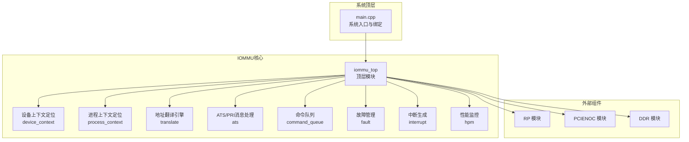
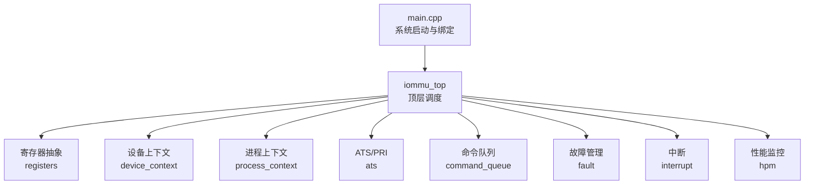
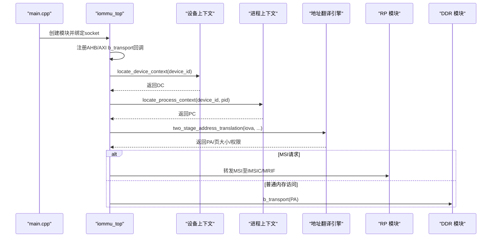
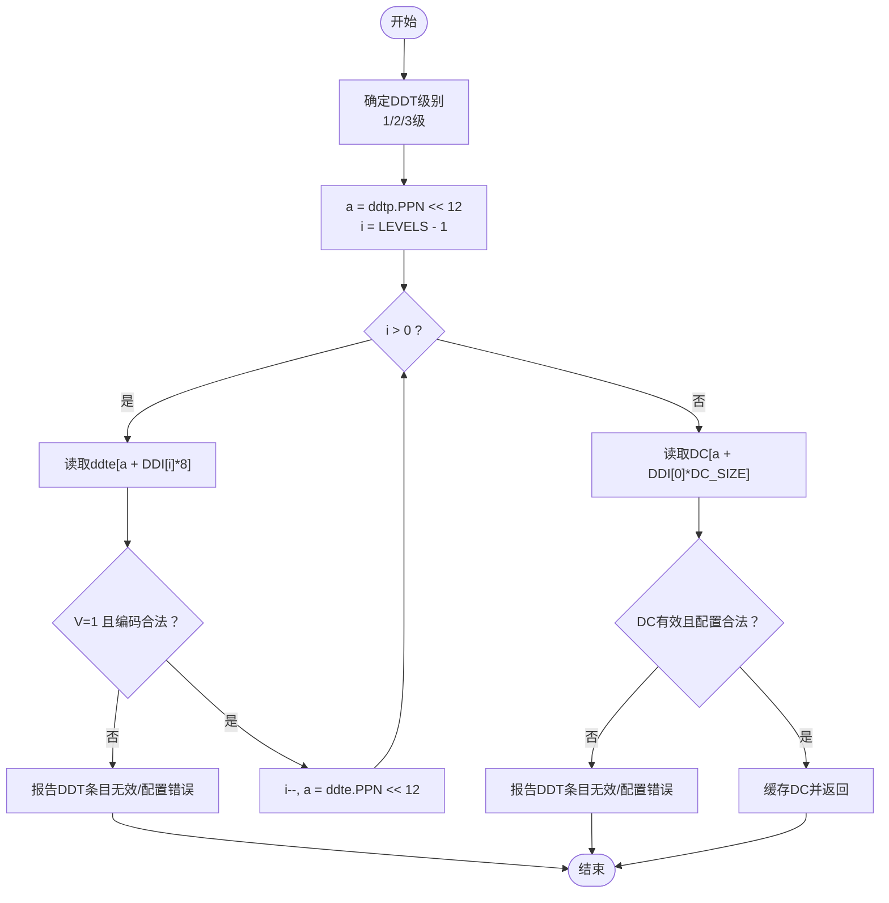
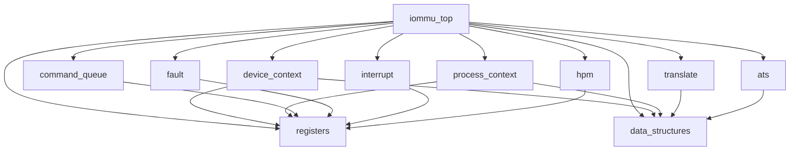

# 项目概述

<cite>
**本文引用的文件**
- [main.cpp](file://main.cpp)
- [iommu_top.hh](file://iommu/iommu_top.hh)
- [iommu_top.cc](file://iommu/iommu_top.cc)
- [iommu_data_structures.hh](file://iommu/iommu_data_structures.hh)
- [iommu_registers.hh](file://iommu/iommu_registers.hh)
- [iommu_ats.hh](file://iommu/iommu_ats.hh)
- [iommu_command_queue.hh](file://iommu/iommu_command_queue.hh)
- [iommu_translate.hh](file://iommu/iommu_translate.hh)
- [iommu_fault.hh](file://iommu/iommu_fault.hh)
- [iommu_interrupt.hh](file://iommu/iommu_interrupt.hh)
- [iommu_hpm.hh](file://iommu/iommu_hpm.hh)
- [iommu_device_context.cc](file://iommu/iommu_device_context.cc)
- [iommu_process_context.cc](file://iommu/iommu_process_context.cc)
</cite>

## 目录
1. [引言](#引言)
2. [项目结构](#项目结构)
3. [核心组件](#核心组件)
4. [架构总览](#架构总览)
5. [详细组件分析](#详细组件分析)
6. [依赖分析](#依赖分析)
7. [性能考虑](#性能考虑)
8. [故障排查指南](#故障排查指南)
9. [结论](#结论)
10. [附录](#附录)

## 引言
本项目是一个基于SystemC与TLM（事务级建模）的RISC-V IOMMU（输入/输出内存管理单元）系统级仿真模型。其核心目标是实现对PCIe ATS（Address Translation Services）与PRI（Page Request Interface）协议的完整支持，并提供两阶段地址转换、命令队列处理、故障管理与中断生成等关键能力。项目采用模块化设计，通过顶层模块统一调度各子模块，结合寄存器抽象、数据结构定义与翻译引擎，形成可扩展、可验证的系统级仿真平台。

该模型既适合初学者理解IOMMU在RISC-V系统中的角色与工作原理，也为有经验的开发者提供了深入的接口与实现细节，便于进行协议验证、性能评估与集成测试。

## 项目结构
项目采用按功能域划分的模块化组织方式，顶层通过main.cpp进行系统初始化与绑定，IOMMU核心逻辑集中在iommu目录下，其他模块（RP、PCIENOC、DDR）作为外部桥接与存储组件参与仿真。

- 顶层入口与绑定：main.cpp负责创建IOMMU、RP、PCIENOC、DDR模块实例，并通过TLM socket完成跨模块连接。
- IOMMU核心：iommu目录包含设备上下文定位、进程上下文定位、两阶段地址翻译、ATS/PRI消息处理、命令队列、故障与中断、性能监控等子系统。
- 外部组件：RP（Root Port）模拟PCIe上游交互；PCIENOC提供PCIe NOC互连；DDR提供物理内存访问。

**图表来源**
- [main.cpp:38-87](file://main.cpp#L38-L87)
- [iommu_top.hh:19-55](file://iommu/iommu_top.hh#L19-L55)
- [iommu_device_context.cc:9-229](file://iommu/iommu_device_context.cc#L9-L229)
- [iommu_process_context.cc:11-196](file://iommu/iommu_process_context.cc#L11-L196)

**章节来源**
- [main.cpp:38-87](file://main.cpp#L38-L87)
- [iommu_top.hh:19-55](file://iommu/iommu_top.hh#L19-L55)

## 核心组件
本节从系统视角梳理IOMMU仿真模型的关键组件及其职责：

- 顶层模块（iommu_top）
  - 提供AXI/HB主/从socket，接收来自PCIe上游与下游的事务请求。
  - 实现AHB与AXI两种接口的b_transport处理，完成寄存器读写与IOVA翻译。
  - 管理命令队列监控线程，触发后续命令处理流程。
  - 在elaboration阶段完成IOMMU复位与能力配置。

- 设备上下文定位（device_context）
  - 基于DDT（设备目录表）多级索引定位设备上下文DC，支持1/2/3级配置。
  - 执行DC配置检查，确保与能力集与控制寄存器一致。
  - 支持IOATC缓存以提升查找效率。

- 进程上下文定位（process_context）
  - 在PDT（进程目录表）中定位PC，支持1/2/3级配置。
  - 当G-stage启用时，先进行G-stage地址翻译再访问PDT。
  - 执行PC配置检查，确保页表模式与能力匹配。

- 地址翻译引擎（translate）
  - 实现两阶段地址转换：S/VS-stage（第一阶段）与G-stage（第二阶段）。
  - 支持MSI地址翻译与MRIF路径识别。
  - 输出物理地址、页大小、页表项信息与访问权限。

- ATS/PRI消息处理（ats）
  - 解析PCIe ATS消息类型与参数，支持PRG响应、无效化请求等。
  - 跟踪itag状态，协调PRG响应与消息路由。

- 命令队列（command_queue）
  - 定义命令格式与操作码，支持IOFENCE、IOTINVAL、IODIR、ATS等命令。
  - 提供命令执行接口，处理阻塞与挂起的ATS无效化请求。

- 故障管理（fault）
  - 定义故障记录格式，记录故障原因、设备ID、进程ID、访问类型等。
  - 提供故障上报接口，配合FQ（故障队列）与中断机制。

- 中断与性能监控（interrupt、hpm）
  - 生成与释放中断，支持命令队列、故障队列、HPM与页面队列中断源。
  - 提供事件计数接口，统计未翻译请求、TLB缺失、页表遍历等事件。

**章节来源**
- [iommu_top.cc:6-36](file://iommu/iommu_top.cc#L6-L36)
- [iommu_device_context.cc:9-229](file://iommu/iommu_device_context.cc#L9-L229)
- [iommu_process_context.cc:11-196](file://iommu/iommu_process_context.cc#L11-L196)
- [iommu_translate.hh:95-130](file://iommu/iommu_translate.hh#L95-L130)
- [iommu_ats.hh:47-96](file://iommu/iommu_ats.hh#L47-L96)
- [iommu_command_queue.hh:38-124](file://iommu/iommu_command_queue.hh#L38-L124)
- [iommu_fault.hh:63-88](file://iommu/iommu_fault.hh#L63-L88)
- [iommu_interrupt.hh:16-24](file://iommu/iommu_interrupt.hh#L16-L24)
- [iommu_hpm.hh:42-43](file://iommu/iommu_hpm.hh#L42-L43)

## 架构总览
IOMMU系统采用“分层+模块化”的设计，顶层通过TLM socket连接外部组件，内部通过寄存器抽象与数据结构驱动地址翻译与消息处理。系统支持多种地址翻译模式（Bare/Sv32/Sv39/Sv48/Sv57及x4变体），并提供两阶段转换能力以适配虚拟化场景。

**图表来源**
- [main.cpp:38-87](file://main.cpp#L38-L87)
- [iommu_top.hh:19-55](file://iommu/iommu_top.hh#L19-L55)
- [iommu_registers.hh:172-249](file://iommu/iommu_registers.hh#L172-L249)
- [iommu_data_structures.hh:29-130](file://iommu/iommu_data_structures.hh#L29-L130)

## 详细组件分析

### 顶层模块（iommu_top）与系统绑定
- 功能要点
  - 注册AHB与AXI的b_transport回调，分别处理寄存器访问与IOVA翻译请求。
  - 对PCIe ATS/PRI消息进行解析与转发，支持PAGE_REQUEST与PRG响应。
  - 将MSI与普通内存访问区分处理，MSI直接转发至IMSIC或MRIF路径。
  - 两阶段地址转换：根据请求类型与扩展信息决定是否走G-stage。
  - 通过事件驱动命令队列监控线程，推进后续处理。

**图表来源**
- [main.cpp:50-73](file://main.cpp#L50-L73)
- [iommu_top.cc:41-210](file://iommu/iommu_top.cc#L41-L210)
- [iommu_device_context.cc:9-229](file://iommu/iommu_device_context.cc#L9-L229)
- [iommu_process_context.cc:11-196](file://iommu/iommu_process_context.cc#L11-L196)
- [iommu_translate.hh:105-130](file://iommu/iommu_translate.hh#L105-L130)

**章节来源**
- [iommu_top.hh:19-55](file://iommu/iommu_top.hh#L19-L55)
- [iommu_top.cc:41-210](file://iommu/iommu_top.cc#L41-L210)

### 设备上下文定位（DDT遍历）
- 关键点
  - DDT支持1/2/3级配置，索引位宽随能力集变化。
  - 非叶子节点为8字节，叶子节点存放DC（32/64字节，取决于MSI能力）。
  - 访问DDT与DC时进行PMA/PMP校验与数据污染检测。
  - 支持IOATC缓存，减少重复查找开销。

**图表来源**
- [iommu_device_context.cc:74-229](file://iommu/iommu_device_context.cc#L74-L229)

**章节来源**
- [iommu_device_context.cc:9-229](file://iommu/iommu_device_context.cc#L9-L229)

### 进程上下文定位（PDT遍历）
- 关键点
  - 当DC的PDTV=1时，使用PDT定位PC；否则直接使用DC中的iosatp。
  - 若G-stage启用，需先将PDT根地址经G-stage转换为SPA。
  - 访问PDT与PC时进行PMA/PMP校验与数据污染检测。
  - 支持IOATC缓存，减少重复查找开销。

**章节来源**
- [iommu_process_context.cc:11-196](file://iommu/iommu_process_context.cc#L11-L196)

### 两阶段地址转换（S/VS-stage + G-stage）
- 关键点
  - 第一阶段：S/VS-stage页表（或Bare）将IOVA映射为GPA（或SPA，当Bare时）。
  - 第二阶段：G-stage页表将GPA映射为SPA，支持嵌套虚拟化场景。
  - 支持MSI地址翻译与MRIF路径识别，区分MSI直写与MRIF模式。
  - 输出物理地址、页大小、页表项与访问权限，用于后续内存访问。

**章节来源**
- [iommu_translate.hh:105-130](file://iommu/iommu_translate.hh#L105-L130)

### ATS/PRI消息处理
- 关键点
  - 解析PCIe ATS消息类型（如PAGE_REQUEST、PRG Response、Invalidation等）。
  - 分配itag并跟踪PRG响应状态，支持批量PRG处理。
  - 生成IOMMU到IO桥的消息，完成ATS无效化与PRG响应。

**章节来源**
- [iommu_ats.hh:47-96](file://iommu/iommu_ats.hh#L47-L96)

### 命令队列与命令执行
- 关键点
  - 定义命令格式与操作码，支持IOFENCE、IOTINVAL、IODIR、ATS等。
  - 提供命令执行接口，处理阻塞与挂起的ATS无效化请求。
  - 通过CQCSR寄存器控制队列使能、中断与状态。

**章节来源**
- [iommu_command_queue.hh:38-124](file://iommu/iommu_command_queue.hh#L38-L124)
- [iommu_registers.hh:456-549](file://iommu/iommu_registers.hh#L456-L549)

### 故障管理与中断
- 关键点
  - 故障记录包含原因、设备ID、进程ID、访问类型、iotval/iotval2等。
  - 支持DTF（禁用翻译故障报告）控制，配合FQCSR与IPS寄存器。
  - 生成中断通知软件处理故障，支持命令队列、故障队列、HPM与页面队列中断源。

**章节来源**
- [iommu_fault.hh:63-88](file://iommu/iommu_fault.hh#L63-L88)
- [iommu_interrupt.hh:16-24](file://iommu/iommu_interrupt.hh#L16-L24)
- [iommu_registers.hh:550-591](file://iommu/iommu_registers.hh#L550-L591)

### 性能监控（HPM）
- 关键点
  - 提供事件计数接口，统计未翻译请求、TLB缺失、页表遍历等事件。
  - 支持多个计数器与事件选择寄存器，便于性能分析与优化。

**章节来源**
- [iommu_hpm.hh:42-43](file://iommu/iommu_hpm.hh#L42-L43)

## 依赖分析
IOMMU核心模块之间存在清晰的依赖关系：顶层模块依赖寄存器抽象与数据结构，设备/进程上下文定位依赖寄存器与内存访问接口，地址翻译引擎依赖上下文与页表结构，ATS/PRI模块依赖消息格式与队列，命令队列依赖寄存器CSR，故障与中断模块贯穿全链路。

**图表来源**
- [iommu_top.hh:19-55](file://iommu/iommu_top.hh#L19-L55)
- [iommu_registers.hh:172-249](file://iommu/iommu_registers.hh#L172-L249)
- [iommu_data_structures.hh:29-130](file://iommu/iommu_data_structures.hh#L29-L130)

**章节来源**
- [iommu_top.hh:19-55](file://iommu/iommu_top.hh#L19-L55)
- [iommu_registers.hh:172-249](file://iommu/iommu_registers.hh#L172-L249)
- [iommu_data_structures.hh:29-130](file://iommu/iommu_data_structures.hh#L29-L130)

## 性能考虑
- 缓存策略：IOATC缓存DC/PC，显著降低DDT/PDT遍历开销。
- 内存访问一致性：通过QoS ID（RCID/MCID）与端序控制（fctl.SBE）保证访问一致性与性能。
- 事件计数：利用HPM统计TLB缺失、页表遍历次数，指导优化策略。
- 并发与线程：命令队列监控线程通过事件驱动，避免忙轮询。

[本节为通用性能讨论，不直接分析具体文件]

## 故障排查指南
- 常见问题
  - DDT/PDT条目无效或配置错误：检查V位与保留位编码，确认与能力集匹配。
  - 访问故障/数据污染：检查PMA/PMP规则与内存一致性。
  - ATS/PRI消息异常：核对消息类型、itag状态与PRG响应码。
  - 命令队列停滞：检查CQCSR状态与中断标志，必要时清理错误位。
- 排查步骤
  - 启用调试宏（DEBUG_*）观察关键路径日志。
  - 使用TR_REQ接口进行单步翻译验证。
  - 检查FQ记录与中断状态，定位故障根因。

**章节来源**
- [iommu_fault.hh:63-88](file://iommu/iommu_fault.hh#L63-L88)
- [iommu_command_queue.hh:456-549](file://iommu/iommu_command_queue.hh#L456-L549)
- [iommu_top.cc:41-210](file://iommu/iommu_top.cc#L41-L210)

## 结论
本项目以SystemC/TLM为核心，构建了支持PCIe ATS/PRI协议的RISC-V IOMMU系统级仿真模型。通过模块化设计与两阶段地址转换，实现了从设备上下文定位、进程上下文定位到地址翻译与消息处理的完整闭环。项目具备良好的可扩展性与可维护性，既可用于教学演示，也可作为验证与集成测试的基础平台。

[本节为总结性内容，不直接分析具体文件]

## 附录
- 技术栈
  - SystemC 2.3.3：系统级建模与事件驱动仿真。
  - TLM：跨模块事务通信与接口抽象。
  - pthread：命令队列监控线程（在当前代码中体现为SystemC线程）。
- 使用场景示例
  - ATS翻译请求：设备发起ATS Translation Request，IOMMU查询DC/PC后完成S/VS-stage与G-stage转换，返回GPA/SPA。
  - PAGE_REQUEST：设备请求页面驻留，IOMMU生成PRG响应并通知RP。
  - 命令队列：软件通过CQB/CQT/CQCSR提交命令，IOMMU异步执行并产生中断通知。

[本节为概览性内容，不直接分析具体文件]