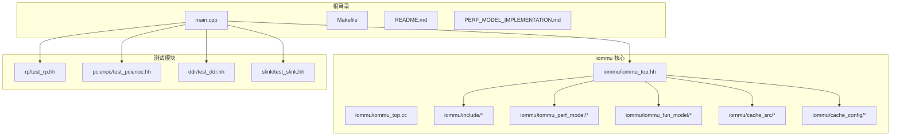
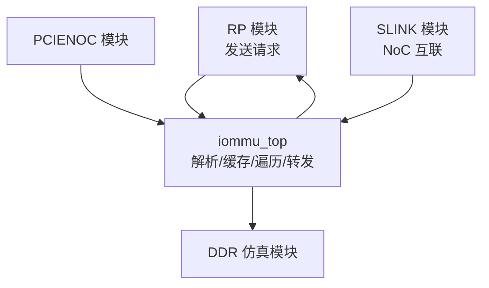
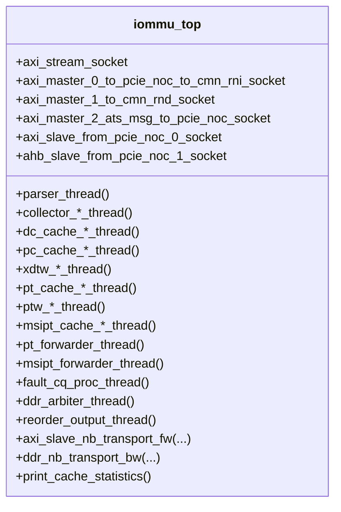
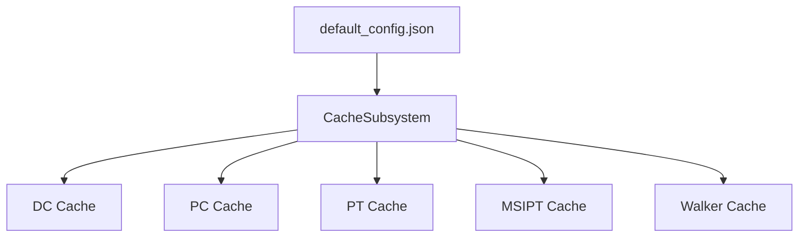
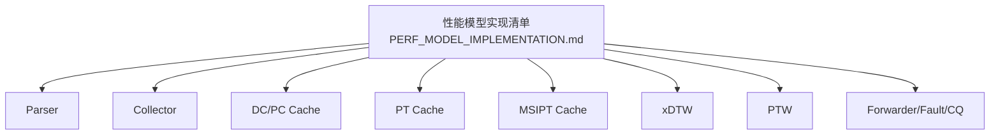
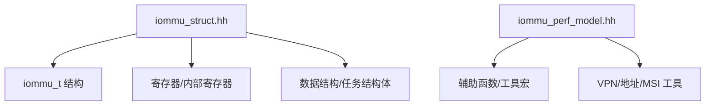
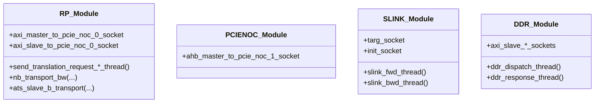
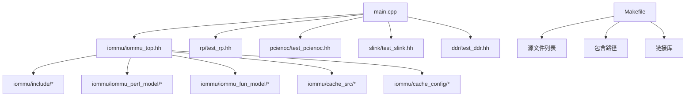

# 项目结构

<cite>
**本文引用的文件**
- [README.md](file://README.md)
- [main.cpp](file://main.cpp)
- [Makefile](file://Makefile)
- [iommu/iommu_top.hh](file://iommu/iommu_top.hh)
- [iommu/iommu_top.cc](file://iommu/iommu_top.cc)
- [iommu/cache_config/default_config.json](file://iommu/cache_config/default_config.json)
- [rp/test_rp.hh](file://rp/test_rp.hh)
- [pcienoc/test_pcienoc.hh](file://pcienoc/test_pcienoc.hh)
- [ddr/test_ddr.hh](file://ddr/test_ddr.hh)
- [slink/test_slink.hh](file://slink/test_slink.hh)
- [iommu/include/iommu_struct.hh](file://iommu/include/iommu_struct.hh)
- [iommu/include/iommu_perf_model.hh](file://iommu/include/iommu_perf_model.hh)
- [iommu/iommu_perf_model/iommu_perf_model.hh](file://iommu/iommu_perf_model/iommu_perf_model.hh)
- [PERF_MODEL_IMPLEMENTATION.md](file://PERF_MODEL_IMPLEMENTATION.md)
</cite>

## 目录
1. [简介](#简介)
2. [项目结构](#项目结构)
3. [核心组件](#核心组件)
4. [架构总览](#架构总览)
5. [详细组件分析](#详细组件分析)
6. [依赖分析](#依赖分析)
7. [性能考虑](#性能考虑)
8. [故障排查指南](#故障排查指南)
9. [结论](#结论)
10. [附录](#附录)

## 简介
本项目是一个基于 SystemC 的 RISC-V IOMMU（输入/输出内存管理单元）系统级仿真模型，用于模拟 RISC-V 架构下的地址转换、故障处理、设备上下文管理、MSI 地址翻译、以及多级页表遍历等核心功能。项目采用高性能性能模型实现，包含完整的流水线组件与缓存子系统，并通过 TLM（传输-响应接口）连接 RP（Root Port）、PCIe NoC、SLINK（NoC interconnect）、以及 DDR 仿真模块，形成端到端的系统级仿真平台。

## 项目结构
项目采用“模块化 + 层次化”的组织方式：
- 根目录包含顶层入口、构建配置、测试脚本与说明文档
- iommu 子目录为核心 IOMMU 实现，细分为缓存配置、缓存子系统、功能实现、性能模型、顶层接口等
- 测试模块 rp、pcienoc、ddr、slink 分别提供根端口、PCIe NoC、DDR 仿真与 NoC 互联路径的仿真支撑
- include 目录集中存放公共数据结构、寄存器定义、任务与工具接口等

**图表来源**
- [main.cpp:1-94](file://main.cpp#L1-L94)
- [Makefile:1-132](file://Makefile#L1-L132)
- [iommu/iommu_top.hh:1-382](file://iommu/iommu_top.hh#L1-L382)

**章节来源**
- [README.md:63-76](file://README.md#L63-L76)
- [Makefile:42-84](file://Makefile#L42-L84)

## 核心组件
- 顶层模块 iommu_top：负责系统级调度、FIFO 管道、DDR 仲裁、重排序输出、回调接口注册、以及统计输出
- 缓存子系统 CacheSubsystem：封装 DC/PC/PT/MSIPT/Walker 缓存，提供统一的查询/更新 FIFO 接口
- 性能模型模块：Parser、Collector、DC/PC Cache、PT Cache、MSIPT Cache、xDTW、PTW、Forwarder/Fault/CQ 等
- 功能实现模块：与性能模型对应的功能参考实现，便于对照与回归
- 测试模块：RP（Root Port）、PCIe NoC、SLINK（NoC interconnect）、DDR 仿真

**章节来源**
- [iommu/iommu_top.hh:41-382](file://iommu/iommu_top.hh#L41-L382)
- [iommu/iommu_top.cc:9-583](file://iommu/iommu_top.cc#L9-L583)
- [PERF_MODEL_IMPLEMENTATION.md:7-97](file://PERF_MODEL_IMPLEMENTATION.md#L7-L97)

## 架构总览
系统以 main.cpp 为入口，创建 iommu_top、RP、PCIENOC、SLINK、DDR 等模块，并通过 TLM Socket 将各模块互联。IOMMU 顶层模块负责接收来自 RP 的请求，经 Parser/Collector/Cache/PTW/Forwarder/Fault/CQ 等流水线处理后，通过 AXI/SLINK/PCIe NoC 路径访问 DDR，最终返回响应给 RP。

**图表来源**
- [main.cpp:39-94](file://main.cpp#L39-L94)
- [rp/test_rp.hh:54-184](file://rp/test_rp.hh#L54-L184)
- [pcienoc/test_pcienoc.hh:10-21](file://pcienoc/test_pcienoc.hh#L10-L21)
- [slink/test_slink.hh:21-58](file://slink/test_slink.hh#L21-L58)
- [ddr/test_ddr.hh:17-64](file://ddr/test_ddr.hh#L17-L64)

## 详细组件分析

### 顶层模块 iommu_top
- 职责：系统级控制与调度，注册 nb_transport 回调，初始化缓存子系统，维护多个 sc_fifo 管道，管理 outstanding 计数与重排序缓冲，提供统计打印与 VA 去重恢复
- 关键接口：AXI/SLAVE 主/从 Socket、AHB 寄存器访问 b_transport、nb_transport_fw/bw 回调
- 线程划分：Parser、DC/PC Cache、Collector、xDTW、PT Cache、PTW、MSIPT Cache、Forwarder、Fault/CQ、DDR Arbiter、Reorder 输出等
- 统计与指标：Cache 命中/未命中、VA 去重统计、IOMMU/PTW 吞吐、端口带宽

**图表来源**
- [iommu/iommu_top.hh:41-382](file://iommu/iommu_top.hh#L41-L382)
- [iommu/iommu_top.cc:9-583](file://iommu/iommu_top.cc#L9-L583)

**章节来源**
- [iommu/iommu_top.hh:41-382](file://iommu/iommu_top.hh#L41-L382)
- [iommu/iommu_top.cc:9-583](file://iommu/iommu_top.cc#L9-L583)

### 缓存子系统与配置
- 缓存配置：default_config.json 定义 clock_period、随机种子、各类缓存容量/替换策略、统计输出参数等
- 缓存类型：DC、PC、PT、MSIPT、Walker Cache（PTWc1/2/3）
- 统一接口：通过 CacheSubsystem 将查询/更新请求映射到对应缓存，简化顶层耦合

**图表来源**
- [iommu/cache_config/default_config.json:1-69](file://iommu/cache_config/default_config.json#L1-L69)
- [iommu/iommu_top.hh:59-60](file://iommu/iommu_top.hh#L59-L60)

**章节来源**
- [iommu/cache_config/default_config.json:1-69](file://iommu/cache_config/default_config.json#L1-L69)
- [iommu/iommu_top.hh:59-60](file://iommu/iommu_top.hh#L59-L60)

### 性能模型与功能实现对照
- 性能模型：Parser、Collector、DC/PC Cache、PT Cache、MSIPT Cache、xDTW、PTW、Forwarder/Fault/CQ 等，均在 PERF_MODEL_IMPLEMENTATION.md 中给出实现清单与参考逻辑
- 功能实现：与性能模型一一对应的功能参考实现，便于对比与回归验证

**图表来源**
- [PERF_MODEL_IMPLEMENTATION.md:7-97](file://PERF_MODEL_IMPLEMENTATION.md#L7-L97)

**章节来源**
- [PERF_MODEL_IMPLEMENTATION.md:7-97](file://PERF_MODEL_IMPLEMENTATION.md#L7-L97)

### 数据结构与工具接口
- iommu_struct.hh：集中声明 iommu_t、寄存器文件、数据结构、任务结构体、中断/故障/命令队列等
- iommu_perf_model.hh：提供性能模型辅助函数（分类请求类型、提取 VPN、校验规范地址、MSI 地址判断、MGPAW 计算等）

**图表来源**
- [iommu/include/iommu_struct.hh:42-102](file://iommu/include/iommu_struct.hh#L42-L102)
- [iommu/include/iommu_perf_model.hh:1-197](file://iommu/include/iommu_perf_model.hh#L1-L197)

**章节来源**
- [iommu/include/iommu_struct.hh:42-102](file://iommu/include/iommu_struct.hh#L42-L102)
- [iommu/include/iommu_perf_model.hh:1-197](file://iommu/include/iommu_perf_model.hh#L1-L197)

### 测试模块
- RP（Root Port）：发送不同类型的请求，接收响应，支持并发与多请求跟踪
- PCIe NoC：作为 IOMMU 与外部总线之间的桥接模块
- SLINK：NoC 互联路径，模拟请求/响应的管道延迟
- DDR：仿真内存访问，支持读写 outstanding 控制与延迟

**图表来源**
- [rp/test_rp.hh:54-184](file://rp/test_rp.hh#L54-L184)
- [pcienoc/test_pcienoc.hh:10-21](file://pcienoc/test_pcienoc.hh#L10-L21)
- [slink/test_slink.hh:21-58](file://slink/test_slink.hh#L21-L58)
- [ddr/test_ddr.hh:17-64](file://ddr/test_ddr.hh#L17-L64)

**章节来源**
- [rp/test_rp.hh:54-184](file://rp/test_rp.hh#L54-L184)
- [pcienoc/test_pcienoc.hh:10-21](file://pcienoc/test_pcienoc.hh#L10-L21)
- [slink/test_slink.hh:21-58](file://slink/test_slink.hh#L21-L58)
- [ddr/test_ddr.hh:17-64](file://ddr/test_ddr.hh#L17-L64)

## 依赖分析
- 顶层入口 main.cpp 依赖 iommu_top、RP、PCIENOC、SLINK、DDR 的头文件与实现
- iommu_top 依赖 include 下的数据结构与性能模型工具、缓存子系统、以及功能实现模块
- 构建系统 Makefile 统一管理编译选项、包含路径、源文件列表与链接库

**图表来源**
- [main.cpp:9-13](file://main.cpp#L9-L13)
- [iommu/iommu_top.hh:12-27](file://iommu/iommu_top.hh#L12-L27)
- [Makefile:20-33](file://Makefile#L20-L33)

**章节来源**
- [main.cpp:9-13](file://main.cpp#L9-L13)
- [Makefile:20-33](file://Makefile#L20-L33)

## 性能考虑
- 流水线设计：Parser/Collector/Cache/PTW/Forwarder/Fault/CQ 等多线程并行处理，提升吞吐
- 缓存层次：DC/PC/PT/MSIPT/Walker Cache 降低 DDR 访问频率，提高命中率
- 仲裁与延迟：DDR Arbiter 支持优先级与轮询，SLINK 使用 PEQ 实现管道延迟，保证时序一致性
- 统计与可观测性：提供 Cache 命中/未命中、VA 去重、IOPS、端口带宽等统计输出

## 故障排查指南
- 编译环境：确保在 WSL 环境下使用 SystemC 与 GCC，参考 README 的编译与运行说明
- 调试：使用 GDB 调试指南文档进行断点与变量检查
- 运行：通过 main.cpp 启动仿真，观察系统版本输出与仿真开始/结束提示
- 缓存统计：在仿真结束时调用 iommu_top::print_cache_statistics 输出命中率与吞吐统计

**章节来源**
- [README.md:17-86](file://README.md#L17-L86)
- [main.cpp:39-94](file://main.cpp#L39-L94)
- [iommu/iommu_top.cc:522-582](file://iommu/iommu_top.cc#L522-L582)

## 结论
本项目以 iommu_top 为核心，结合缓存子系统与性能模型，实现了 RISC-V IOMMU 的系统级仿真。通过清晰的模块划分、完善的流水线设计与丰富的统计输出，开发者可以高效地进行功能验证、性能分析与问题定位。建议在 WSL 环境下进行编译与运行，并利用提供的测试模块与统计接口开展系统级验证。

## 附录
- 构建与运行：参考 README 的编译与运行步骤，或直接使用 Makefile 的 all/clean/rebuild 目标
- 性能模型实现：参考 PERF_MODEL_IMPLEMENTATION.md 的实现清单与技术特性

**章节来源**
- [README.md:17-86](file://README.md#L17-L86)
- [PERF_MODEL_IMPLEMENTATION.md:130-158](file://PERF_MODEL_IMPLEMENTATION.md#L130-L158)